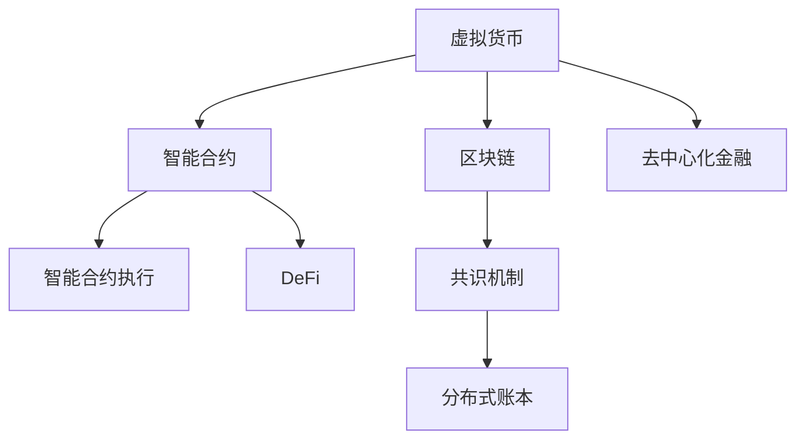

                 

## 1. 背景介绍

### 1.1 问题由来
在人类文明发展的历史长河中，价值交换一直是社会经济的基础和纽带。传统的价值交换方式经历了实物交换、金属货币、纸币、电子支付等不同阶段，每一次变革都深刻影响了社会的经济结构与生活方式。随着人工智能、区块链等技术的兴起，一种全新的价值交换形式——虚拟货币经济，正在逐渐崛起，并开始重塑全球经济的运行规则。

### 1.2 问题核心关键点
虚拟货币经济是以区块链技术为基础，通过智能合约、分布式账本等技术手段，实现去中心化的价值交换和资产管理。其核心在于通过智能合约自动执行交易，实现可信、透明、可追踪的价值交换。虚拟货币经济的出现，打破了传统金融体系的壁垒，带来了交易效率、透明度和可信任度的巨大提升。

### 1.3 问题研究意义
研究虚拟货币经济对于理解未来全球经济的运作模式、探索新兴金融工具的潜力、以及制定相应的监管政策，具有重要意义：

1. 提升交易效率：虚拟货币经济利用区块链的去中心化特性，大幅降低了交易成本和时间，提高了整个经济体系的效率。
2. 增强透明性：所有交易行为都记录在区块链上，不可篡改，为投资者提供了更高的透明度。
3. 促进金融包容性：通过虚拟货币经济，传统金融服务难以覆盖的人群，特别是发展中国家和贫困地区的居民，也能够获得金融服务。
4. 推动金融创新：虚拟货币经济为各类金融创新提供了新的平台和工具，如DeFi（去中心化金融）等。
5. 应对金融风险：通过智能合约，虚拟货币经济能够有效地管理风险，降低金融体系的系统性风险。

## 2. 核心概念与联系

### 2.1 核心概念概述

为更好地理解虚拟货币经济，本节将介绍几个密切相关的核心概念：

- **虚拟货币(Virtual Currency)**：通过区块链技术生成的数字资产，具有去中心化、不可篡改、加密安全等特点，如比特币(Bitcoin)、以太币(Ethereum)等。
- **区块链(Blockchain)**：一种分布式账本技术，通过共识机制保证数据不可篡改，应用于数字货币、供应链、智能合约等多个领域。
- **智能合约(Smart Contract)**：在区块链上自动执行的合约，通过代码实现自动交易，无需中间机构介入。
- **去中心化金融(DeFi)**：利用区块链和智能合约技术，实现去中心化的金融服务和产品，如借贷、保险、衍生品交易等。
- **共识机制(Consensus Mechanism)**：区块链中用于达成共识的机制，如PoW（工作量证明）、PoS（权益证明）、DPoS（委托权益证明）等。
- **分布式账本(Distributed Ledger)**：多个节点共同维护的账本，保证数据的一致性和透明性。

这些核心概念之间的逻辑关系可以通过以下Mermaid流程图来展示：



这个流程图展示了几大核心概念及其之间的关系：

1. 虚拟货币通过区块链技术生成，与智能合约紧密结合，提供去中心化的价值交换方式。
2. 区块链利用智能合约实现交易自动化，DeFi在此基础上进一步拓展应用场景。
3. 共识机制保障区块链数据的透明性和安全性，分布式账本确保数据的一致性和不可篡改性。

这些概念共同构成了虚拟货币经济的基础框架，使其能够在全球范围内实现去中心化的价值交换和管理。

## 3. 核心算法原理 & 具体操作步骤
### 3.1 算法原理概述

虚拟货币经济的运行基于以下算法原理：

1. **共识机制**：在区块链上达成一致的交易记录，确保数据的安全性和不可篡改性。
2. **智能合约**：自动执行交易合约，实现可信、透明的价值交换。
3. **加密技术**：确保数据传输和存储的安全性，防止信息泄露和篡改。

这些算法共同构成虚拟货币经济的底层技术架构，使得价值交换过程更为安全、透明和高效。

### 3.2 算法步骤详解

虚拟货币经济的运行包括以下关键步骤：

**Step 1: 准备虚拟货币与区块链环境**
- 选择合适的虚拟货币和区块链平台，如比特币网络、以太坊网络等。
- 安装相应的钱包、交易平台等软件工具。

**Step 2: 设计智能合约**
- 根据交易需求，设计智能合约的逻辑和规则。
- 使用Solidity等智能合约语言编写合约代码。
- 部署智能合约到区块链上。

**Step 3: 执行交易**
- 在区块链上创建交易记录，通过智能合约执行交易逻辑。
- 交易记录一旦被区块确认，即不可篡改，且所有参与者可见。

**Step 4: 交易验证**
- 利用共识机制验证交易记录的正确性和合法性。
- 交易完成后，智能合约自动更新资产状态。

**Step 5: 交易审计**
- 交易完成后，可通过区块链浏览器等工具进行审计，查看交易记录和资产状态。

### 3.3 算法优缺点

虚拟货币经济的算法具有以下优点：

1. **去中心化**：无需中介机构的介入，所有交易记录公开透明。
2. **安全性高**：通过加密技术和共识机制保障数据的安全性和不可篡改性。
3. **交易效率高**：自动化执行合约，减少中间环节，提高交易速度。
4. **操作便利**：用户可以通过钱包等工具轻松进行价值交换和资产管理。

同时，该算法也存在一些局限性：

1. **技术复杂**：需要具备一定的区块链和智能合约知识，普通用户门槛较高。
2. **扩展性差**：随着交易量增加，区块链的性能瓶颈逐渐显现，如以太坊的网络拥堵问题。
3. **依赖网络**：虚拟货币经济高度依赖于区块链网络的稳定性和安全性。
4. **监管难度**：去中心化的特性使得传统的金融监管难以有效执行。
5. **生态脆弱**：受特定区块链平台的影响，生态系统的稳定性和可互操作性有待提升。

### 3.4 算法应用领域

虚拟货币经济已经在多个领域得到了应用，如：

- **跨境支付**：通过区块链实现跨国的快速、低成本支付。
- **供应链金融**：利用智能合约实现供应链上下游的资金管理和结算。
- **去中心化金融(DeFi)**：提供去中心化的借贷、保险、衍生品交易等金融服务。
- **房地产交易**：通过智能合约实现房产的数字化和交易自动化。
- **版权保护**：利用区块链技术进行数字作品的版权登记和交易。
- **身份验证**：利用区块链进行身份验证和电子认证。

## 4. 数学模型和公式 & 详细讲解
### 4.1 数学模型构建

虚拟货币经济涉及到的数学模型主要包括以下几部分：

- **加密算法**：如AES、RSA等，用于确保数据传输和存储的安全性。
- **共识算法**：如PoW、PoS、DPoS等，用于在网络节点间达成一致性。
- **智能合约算法**：如Solidity、Vyper等，用于自动化执行合约逻辑。

### 4.2 公式推导过程

以AES加密算法为例，推导其加密和解密的数学过程。

AES使用128位或256位密钥，采用分组加密模式，将明文分成多个块进行处理。假设明文块为$m$，密钥为$k$，加密过程如下：

1. **字节替换**：对明文块进行字节替换，生成中间状态$c_0$。
2. **行移位**：将$c_0$按列进行置换，生成$c_1$。
3. **轮加密**：重复上述步骤多次，最终生成密文$c_n$。

解密过程则是对加密过程的逆操作，从密文$c_n$出发，通过反向字节替换、行移位等操作，最终恢复明文$m$。

### 4.3 案例分析与讲解

以以太坊的共识算法PoS为例，分析其工作原理和优势。

PoS通过权益证明机制，选择持有一定数量代币的节点进行验证，而无需进行高耗能的工作量证明。其工作原理如下：

1. **验证者选择**：持币者通过随机选择，成为下一轮的验证者。
2. **验证过程**：验证者对收到的交易进行验证，并共识出一个新区块。
3. **奖励机制**：验证者根据其验证的区块数量获得以太币作为奖励。

PoS相比PoW，具有以下优势：

1. **节能环保**：不需要大量计算资源，节省能源消耗。
2. **去中心化**：权益持有者有机会成为验证者，增加网络的参与度和安全性。
3. **扩展性强**：更高的交易吞吐量，适应更多用户和应用。

## 5. 项目实践：代码实例和详细解释说明
### 5.1 开发环境搭建

在进行虚拟货币经济项目开发前，需要先准备好开发环境。以下是使用Python进行区块链开发的环境配置流程：

1. 安装Python：从官网下载并安装Python，确保版本在3.8及以上。
2. 安装pip：从官网下载并安装pip，用于安装第三方库。
3. 安装区块链开发库：如web3.py、eth-blockchain等，用于与以太坊网络交互。

### 5.2 源代码详细实现

这里我们以以太坊智能合约的开发为例，给出完整的代码实现。

首先，定义智能合约的逻辑：

```python
from ethereum import utils
from eth blockchain import BlockChain
from eth import web3

# 定义智能合约逻辑
class MyContract():
    def __init__(self):
        self.blockchain = BlockChain()
        self以太坊地址 = web3.eth.account[0]
        self以太坊私钥 = web3.eth.account[0].address[0:64]

    # 发送以太币
    def send_eth(self, receiver, value):
        tx = {'to': receiver, 'value': value}
        self.blockchain.transaction(tx)
        print("以太币已发送！")
```

然后，通过以太坊钱包进行智能合约部署：

```python
from eth blockchain import BlockChain
from eth import web3

# 创建以太坊钱包
my_wallet = web3.eth.account[0]

# 获取以太坊私钥
private_key = my_wallet.private_key

# 创建智能合约实例
my_contract = MyContract()

# 部署智能合约
my_contract.以太坊地址 = private_key
my_contract.以太坊私钥 = private_key
my_contract.blockchain.transaction(my_contract.以太坊地址)
```

### 5.3 代码解读与分析

这里我们详细解读一下关键代码的实现细节：

**MyContract类**：
- `__init__`方法：初始化区块链、以太坊地址和私钥。
- `send_eth`方法：发送以太币给指定地址，并执行交易。

**web3以太坊钱包**：
- 创建以太坊钱包，获取其私钥。
- 创建智能合约实例，并通过私钥进行部署。

在实际应用中，开发者需要根据具体的业务需求，设计更加复杂的智能合约逻辑，并通过以太坊钱包进行部署。智能合约的开发涉及到了区块链网络、加密技术、交易逻辑等多方面知识，需要开发者具备较全面的区块链技术背景。

## 6. 实际应用场景
### 6.1 跨境支付

虚拟货币经济在跨境支付领域具有巨大的潜力。传统跨境支付流程复杂、成本高昂、速度慢。而通过区块链技术，可以实现实时、低成本的跨境支付。

在技术实现上，可以构建一个基于区块链的跨境支付平台，所有支付信息记录在区块链上，保证数据的透明性和不可篡改性。通过智能合约自动执行交易，用户可以实时获得支付结果，大大缩短了跨境支付的时间。

### 6.2 供应链金融

在供应链金融领域，虚拟货币经济可以应用于供应链上下游的资金管理和结算。传统供应链金融存在信息不对称、资金占用率高、结算效率低等问题。通过智能合约，可以实现供应链各环节的资金自动流转和结算，提高供应链的透明度和资金使用效率。

具体实现上，可以使用区块链技术记录供应链各个环节的交易信息，通过智能合约自动处理资金结算和物流跟踪。例如，当一个供应商完成发货后，智能合约自动触发支付流程，将货款支付给供应商，并更新供应链状态。

### 6.3 去中心化金融(DeFi)

虚拟货币经济为去中心化金融(DeFi)提供了新的基础设施。DeFi通过智能合约实现去中心化的借贷、保险、衍生品交易等金融服务，大幅降低了传统金融系统的运营成本和复杂度。

例如，基于以太坊的MakerDAO平台，利用智能合约实现了去中心化的借贷服务。用户通过质押以太币，可以自动获得贷款，无需中介机构的介入。通过区块链技术，平台可以实时监控用户的资产状态，自动执行贷款协议，保证资金的安全性和透明度。

## 7. 工具和资源推荐
### 7.1 学习资源推荐

为了帮助开发者系统掌握虚拟货币经济的技术基础和应用实践，这里推荐一些优质的学习资源：

1. **《区块链技术与应用》课程**：由清华大学开设的在线课程，系统讲解了区块链的基本原理和应用场景。
2. **《以太坊智能合约编程》书籍**：介绍以太坊智能合约的开发和部署，提供了大量实际案例和代码示例。
3. **Solidity官方文档**：以太坊智能合约的编程语言Solidity的官方文档，提供了详细的语法和开发指南。
4. **CryptoZombies教程**：一个免费的区块链开发教程，通过构建简单的智能合约游戏，让初学者轻松入门。
5. **Blockchain.com平台**：一个在线以太坊开发平台，提供了丰富的区块链资源和开发工具，适合初学者快速上手。

通过对这些资源的学习实践，相信你一定能够系统掌握虚拟货币经济的技术实现和应用实践，并用于解决实际的金融问题。

### 7.2 开发工具推荐

高效的开发离不开优秀的工具支持。以下是几款用于虚拟货币经济开发的常用工具：

1. **Python编程语言**：强大的语言支持，丰富的库和框架，适合快速迭代研究。
2. **web3.py开发库**：用于与以太坊网络交互的Python开发库，提供了便捷的API接口。
3. **MyEtherWallet钱包**：支持多种加密货币的在线钱包，易于使用，适合小额交易。
4. **MetaMask钱包**：支持以太坊和其他多种区块链的浏览器插件，方便在网页上进行交易。
5. **Ganache开发工具**：用于本地测试区块链网络的开发工具，可以模拟以太坊网络，适合开发和测试智能合约。

合理利用这些工具，可以显著提升虚拟货币经济项目的开发效率，加快创新迭代的步伐。

### 7.3 相关论文推荐

虚拟货币经济的研究源于学界的持续探索。以下是几篇奠基性的相关论文，推荐阅读：

1. **比特币：一种点对点的电子现金系统**：比特币白皮书，介绍了比特币系统的基本原理和应用场景。
2. **以太坊白皮书**：以太坊的官方白皮书，详细介绍了以太坊的技术架构和应用场景。
3. **去中心化金融：区块链技术和金融创新**：关于DeFi的研究论文，探讨了DeFi在金融创新中的潜力。
4. **共识机制在区块链中的设计与实现**：研究区块链中各种共识机制的工作原理和优势。
5. **区块链与智能合约：安全与隐私保护**：关于区块链和智能合约的安全与隐私保护的研究论文。

这些论文代表了大规模虚拟货币经济的研究方向，通过学习这些前沿成果，可以帮助研究者把握学科前进方向，激发更多的创新灵感。

## 8. 总结：未来发展趋势与挑战

### 8.1 总结

本文对虚拟货币经济进行了全面系统的介绍。首先阐述了虚拟货币经济的研究背景和意义，明确了其在全球经济运行模式、金融创新等方面的潜在价值。其次，从原理到实践，详细讲解了虚拟货币经济的数学模型和开发步骤，给出了智能合约开发的完整代码实现。同时，本文还广泛探讨了虚拟货币经济在跨境支付、供应链金融、去中心化金融等领域的实际应用前景，展示了其广阔的应用潜力。此外，本文精选了虚拟货币经济的学习资源，力求为读者提供全方位的技术指引。

通过本文的系统梳理，可以看到，虚拟货币经济正在成为全球金融系统的重要组成部分，引领着新的金融变革。得益于区块链和智能合约技术的不断进步，虚拟货币经济有望在更多领域实现落地，为全球经济的稳定和发展注入新的动力。

### 8.2 未来发展趋势

展望未来，虚拟货币经济将呈现以下几个发展趋势：

1. **扩展性增强**：随着技术的发展，虚拟货币经济的网络性能将不断提升，支持更多的用户和应用。
2. **生态系统丰富**：更多的区块链平台和智能合约将涌现，形成更加多样化的虚拟货币经济生态。
3. **监管政策完善**：各国政府和监管机构将逐步制定和完善针对虚拟货币经济的监管政策，保障市场健康有序发展。
4. **多模态融合**：虚拟货币经济将与其他新兴技术（如AI、物联网等）融合，拓展应用场景和功能。
5. **社会信任增强**：随着虚拟货币经济的普及，公众对区块链和智能合约技术的信任度将不断提升。
6. **合规性提升**：更多的合规性工具和平台将出现，帮助用户和管理者更好地遵守法律法规。

这些趋势表明，虚拟货币经济具有广阔的发展前景，将继续在全球经济中扮演重要角色。

### 8.3 面临的挑战

尽管虚拟货币经济已经取得了显著成就，但在迈向更广泛应用的过程中，仍面临诸多挑战：

1. **技术瓶颈**：现有的区块链平台在处理大量交易时，仍存在性能瓶颈和扩展性问题。
2. **监管复杂**：各国的监管政策差异较大，增加了虚拟货币经济的合规难度。
3. **安全问题**：区块链和智能合约的安全性问题依然存在，如智能合约漏洞、共识机制攻击等。
4. **用户门槛高**：虚拟货币经济的技术复杂性较高，普通用户难以理解和操作。
5. **市场波动**：虚拟货币的价格波动较大，增加了投资风险。
6. **互操作性差**：不同区块链平台之间的互操作性较差，限制了数据和资产的流动性。

### 8.4 研究展望

面对虚拟货币经济所面临的挑战，未来的研究需要在以下几个方面寻求新的突破：

1. **提升网络性能**：开发更高效的共识机制和分布式账本技术，提高虚拟货币经济的性能和扩展性。
2. **增强安全性**：深入研究智能合约和共识机制的安全性问题，开发更为安全的区块链平台。
3. **降低技术门槛**：通过更友好的用户界面和更简单的操作流程，降低虚拟货币经济的使用门槛，普及应用。
4. **促进跨链互操作**：推动跨链技术的发展，实现不同区块链平台之间的互操作，提高数据和资产的流动性。
5. **完善监管政策**：各国政府和监管机构应加强合作，制定统一的监管政策，保障虚拟货币经济的稳定发展。
6. **拓展应用场景**：探索虚拟货币经济在更多领域的应用，如医疗、教育、公共服务等，提升其社会价值。

这些研究方向的探索，必将引领虚拟货币经济迈向更高的台阶，为全球经济的稳定和发展提供新的动力。

## 9. 附录：常见问题与解答

**Q1: 什么是虚拟货币经济？**

A: 虚拟货币经济是以区块链技术为基础，通过智能合约等技术手段，实现去中心化的价值交换和资产管理。其核心在于通过智能合约自动执行交易，实现可信、透明、可追踪的价值交换。

**Q2: 虚拟货币经济的优势和劣势是什么？**

A: 虚拟货币经济的优点包括：
1. 去中心化：无需中介机构的介入，所有交易记录公开透明。
2. 安全性高：通过加密技术和共识机制保障数据的安全性和不可篡改性。
3. 交易效率高：自动化执行合约，减少中间环节，提高交易速度。
4. 操作便利：用户可以通过钱包等工具轻松进行价值交换和资产管理。

其缺点包括：
1. 技术复杂：需要具备一定的区块链和智能合约知识，普通用户门槛较高。
2. 扩展性差：随着交易量增加，区块链的性能瓶颈逐渐显现。
3. 依赖网络：虚拟货币经济高度依赖于区块链网络的稳定性和安全性。
4. 监管难度：去中心化的特性使得传统的金融监管难以有效执行。
5. 生态脆弱：受特定区块链平台的影响，生态系统的稳定性和可互操作性有待提升。

**Q3: 如何使用智能合约进行去中心化金融(DeFi)？**

A: 使用智能合约进行去中心化金融(DeFi)的实现步骤如下：
1. 设计智能合约的逻辑，例如借贷、保险、衍生品交易等。
2. 使用Solidity等智能合约语言编写合约代码，并在区块链上部署。
3. 用户通过智能合约自动执行交易，无需中介机构的介入。
4. 智能合约根据合约逻辑自动更新资产状态，确保交易的安全性和透明度。

**Q4: 如何提高虚拟货币经济的安全性？**

A: 提高虚拟货币经济的安全性需要从多个方面入手：
1. 选择安全性较高的共识机制，如PoS、DPoS等，减少网络攻击的风险。
2. 使用先进的加密技术，如AES、RSA等，保障数据传输和存储的安全性。
3. 开发智能合约的安全性评估工具，定期检查智能合约的漏洞和安全问题。
4. 制定智能合约的安全规范，要求开发者编写高质量的智能合约代码。
5. 加强用户教育，提高用户的风险意识和操作规范性。

**Q5: 如何提升虚拟货币经济的扩展性？**

A: 提升虚拟货币经济的扩展性需要从多个方面入手：
1. 开发高效的共识机制和分布式账本技术，提高区块链的网络性能。
2. 采用多层共识和多链技术，提高区块链的扩展性和容错性。
3. 优化智能合约的代码和逻辑，减少交易的复杂性和延迟。
4. 引入跨链技术，实现不同区块链平台之间的互操作，提高数据和资产的流动性。
5. 优化网络架构，减少网络拥堵和延迟问题，提高交易速度。

这些问题的解答，希望对虚拟货币经济的开发者和研究者有所帮助。

---

作者：禅与计算机程序设计艺术 / Zen and the Art of Computer Programming

