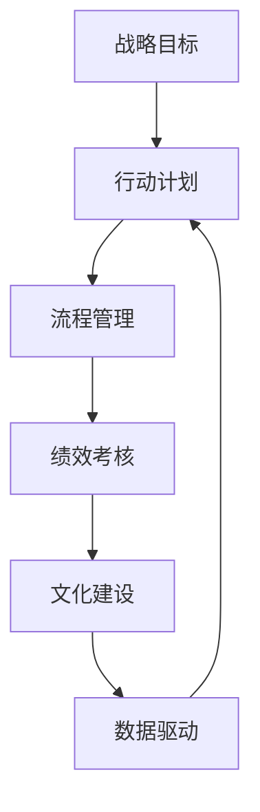

                 

## 1. 背景介绍

### 1.1 问题由来

在现代社会中，组织和企业的成功往往依赖于高效的管理执行力。然而，面对日益复杂多变的市场环境，许多组织在管理执行力上仍存在诸多挑战。无论是大企业还是中小企业，都面临着执行力差、管理层与员工脱节、流程复杂等问题，严重影响了企业运营效率和竞争力。为了提升管理执行力，近年来，越来越多的企业开始引入行动体系（Action System）管理模式，以期通过系统化的管理手段，实现管理执行力的提升。

### 1.2 问题核心关键点

行动体系管理模式的核心在于通过构建组织内部的行动体系，将战略目标转化为具体的执行行动，通过流程管理、绩效考核、文化建设等多方面手段，形成闭环的管理体系，从而提升整体管理执行力。

具体而言，行动体系管理模式的关键点包括：

1. **战略目标明确化**：将组织的总体战略目标分解为可执行的具体行动计划。
2. **流程管理优化**：通过标准化、流程化管理，确保每个环节的顺畅执行。
3. **绩效考核科学化**：设计科学的绩效考核指标，确保目标导向，提升员工积极性。
4. **文化建设系统化**：通过建立统一的价值观和文化氛围，增强员工的归属感和执行力。
5. **数据驱动决策**：通过数据收集和分析，实时调整管理策略，确保决策的科学性和准确性。

### 1.3 问题研究意义

深入研究行动体系管理模式对管理执行力的影响，对于提升企业的运营效率、增强市场竞争力、实现持续发展具有重要意义。通过科学的管理体系建设，企业能够更好地应对市场变化，提升执行力和管理效率，从而实现更加稳健的业务增长。

## 2. 核心概念与联系

### 2.1 核心概念概述

行动体系管理模式的核心概念包括以下几个方面：

1. **战略目标（Strategic Goals）**：指组织的长远发展方向和核心价值追求。
2. **行动计划（Action Plans）**：将战略目标具体化为可执行的行动步骤和任务。
3. **流程管理（Process Management）**：通过标准化、流程化管理，确保任务执行的规范性和高效性。
4. **绩效考核（Performance Evaluation）**：设计科学合理的绩效考核体系，激励员工完成既定目标。
5. **文化建设（Culture Building）**：通过统一价值观和行为规范，增强员工的归属感和执行力。
6. **数据驱动（Data-Driven）**：依托数据收集和分析，实时调整管理策略，提升决策科学性。

这些核心概念构成了行动体系管理模式的基本框架，通过它们之间的相互配合，形成一个闭环的管理体系，确保管理执行力的实现。

### 2.2 核心概念原理和架构的 Mermaid 流程图



这个流程图展示了行动体系管理模式的核心概念及其相互联系。战略目标是行动计划的源头，行动计划通过流程管理、绩效考核、文化建设等手段进行执行和优化，最终由数据驱动进行反馈和调整，形成一个完整的闭环管理过程。

## 3. 核心算法原理 & 具体操作步骤

### 3.1 算法原理概述

行动体系管理模式的核心算法原理可以概括为以下步骤：

1. **战略目标制定**：通过高层领导和专家团队的讨论，明确组织的战略目标和发展方向。
2. **行动计划分解**：将战略目标具体化为可执行的行动计划和任务，明确时间节点和责任人。
3. **流程管理设计**：制定标准化的操作流程和规范，确保任务执行的规范性和高效性。
4. **绩效考核实施**：设计科学的绩效考核指标，实时监测和评估员工的工作表现。
5. **文化建设推进**：通过统一价值观和行为规范，增强员工的归属感和执行力。
6. **数据驱动决策**：依托数据收集和分析，实时调整管理策略，提升决策科学性。

### 3.2 算法步骤详解

1. **战略目标制定**
   - 高层领导和专家团队进行战略讨论，确定组织的发展方向和核心价值追求。
   - 制定清晰的战略目标，并将其转化为具体的行动计划和任务。

2. **行动计划分解**
   - 将战略目标分解为可执行的行动计划和任务，明确时间节点和责任人。
   - 形成详细的行动计划表，确保每个任务的执行落地。

3. **流程管理设计**
   - 制定标准化的操作流程和规范，确保任务执行的规范性和高效性。
   - 通过流程优化，减少执行中的冗余和低效环节。

4. **绩效考核实施**
   - 设计科学的绩效考核指标，实时监测和评估员工的工作表现。
   - 通过绩效考核，激励员工完成既定目标，提升执行效率。

5. **文化建设推进**
   - 通过统一价值观和行为规范，增强员工的归属感和执行力。
   - 建立积极向上的企业文化氛围，提升员工的工作积极性和忠诚度。

6. **数据驱动决策**
   - 依托数据收集和分析，实时调整管理策略，提升决策科学性。
   - 建立数据驱动的决策机制，确保管理决策的及时性和准确性。

### 3.3 算法优缺点

行动体系管理模式的优点包括：

1. **系统化管理**：通过流程管理、绩效考核、文化建设等多方面手段，形成闭环的管理体系，提升整体管理执行力。
2. **科学化决策**：依托数据驱动，确保决策的科学性和准确性。
3. **持续优化**：通过不断调整和优化管理策略，确保组织持续改进和发展。

缺点包括：

1. **实施难度高**：需要高层领导的强力推动，以及对内部管理的深度理解。
2. **资源投入大**：实施过程中需要大量的人力和物力投入，成本较高。
3. **灵活性不足**：高度标准化的流程管理可能导致灵活性不足，难以应对突发情况。

### 3.4 算法应用领域

行动体系管理模式在企业、政府、非营利组织等众多领域得到了广泛应用。其核心思想和操作步骤适用于任何需要提升管理执行力的组织。

- **企业**：通过行动体系管理模式，提升运营效率，增强市场竞争力，实现持续发展。
- **政府**：通过系统化的管理手段，提升公共服务效率，改善治理体系。
- **非营利组织**：通过科学的决策和执行，提升公益项目的效果，增强社会影响力。

## 4. 数学模型和公式 & 详细讲解 & 举例说明

### 4.1 数学模型构建

行动体系管理模式可以抽象为一个数学模型，模型由以下变量和函数组成：

- 战略目标（StrategicGoals）：用向量表示，$S = (s_1, s_2, ..., s_n)$，其中$s_i$表示第$i$个战略目标。
- 行动计划（ActionPlans）：用向量表示，$A = (a_1, a_2, ..., a_m)$，其中$a_j$表示第$j$个行动计划。
- 流程管理（ProcessManagement）：用函数表示，$P: A \rightarrow B$，其中$B$表示流程执行结果。
- 绩效考核（PerformanceEvaluation）：用函数表示，$E: A \rightarrow C$，其中$C$表示绩效考核结果。
- 文化建设（CultureBuilding）：用函数表示，$C: S \rightarrow D$，其中$D$表示文化建设结果。
- 数据驱动（DataDriven）：用函数表示，$D: S \rightarrow E$，其中$E$表示数据驱动结果。

通过这些变量和函数，可以构建行动体系管理模式的数学模型。

### 4.2 公式推导过程

行动体系管理模式的核心公式可以概括为以下几部分：

1. **战略目标与行动计划关系**
   $$
   A = S
   $$

2. **行动计划与流程管理关系**
   $$
   P(A) = B
   $$

3. **流程管理与绩效考核关系**
   $$
   E(P(A)) = C
   $$

4. **绩效考核与文化建设关系**
   $$
   C(E(P(A))) = D
   $$

5. **文化建设与数据驱动关系**
   $$
   D(C(E(P(A)))) = E
   $$

### 4.3 案例分析与讲解

以下以一家制造企业为例，展示行动体系管理模式的具体应用：

**背景**：某制造企业是一家以生产电子产品为主的企业，近年来面临市场竞争加剧、产品更新速度快等问题，管理执行力不足，运营效率低下。

**行动体系实施步骤**：

1. **战略目标制定**
   - 确定企业的发展方向：智能化转型。
   - 制定具体的行动计划：引入先进生产设备、提升研发能力、加强品牌营销。

2. **行动计划分解**
   - 制定详细的行动计划表，明确每个任务的执行主体和完成时间。
   - 如引进新设备的时间表、研发新产品的进度安排、市场推广的计划。

3. **流程管理设计**
   - 制定标准化的生产流程和规范，确保产品质量和生产效率。
   - 建立严格的流程审批机制，减少执行中的冗余和低效环节。

4. **绩效考核实施**
   - 设计科学的绩效考核指标，如生产效率、产品质量、销售业绩等。
   - 实时监测和评估员工的工作表现，并通过绩效考核激励员工。

5. **文化建设推进**
   - 通过统一价值观和行为规范，增强员工的归属感和执行力。
   - 建立积极向上的企业文化氛围，提升员工的工作积极性和忠诚度。

6. **数据驱动决策**
   - 依托数据收集和分析，实时调整管理策略，提升决策科学性。
   - 如通过数据分析，发现生产瓶颈，及时调整生产计划。

通过以上步骤，该企业成功实施了行动体系管理模式，提升了整体管理执行力，实现了智能化转型，增强了市场竞争力。

## 5. 项目实践：代码实例和详细解释说明

### 5.1 开发环境搭建

行动体系管理模式的实施需要依托于具体的项目管理工具和软件平台。以下是主要的开发环境搭建步骤：

1. **项目管理工具**：选择如JIRA、Trello等项目管理工具，方便任务的分配和跟踪。
2. **数据管理工具**：选择如Power BI、Tableau等数据可视化工具，方便数据的收集和分析。
3. **沟通协作平台**：选择如Slack、Microsoft Teams等沟通协作平台，方便团队的沟通和协作。

完成以上工具的安装和配置后，就可以开始行动体系管理模式的实施了。

### 5.2 源代码详细实现

由于行动体系管理模式主要是依靠项目管理工具和数据管理工具进行实施，具体的代码实现较为简单。以下是一个基于JIRA的项目管理工具的代码实现示例：

```python
from jira import JIRA

# 连接到JIRA服务器
jira = JIRA('https://example.com', username='user', password='password')

# 创建任务
def create_task(title, description, assignee):
    project = jira.get_project('的项目ID')
    issue = jira.create_issue(project=project, summary=title, description=description, assignee=assignee)
    return issue

# 更新任务状态
def update_task_state(issue_key, status):
    jira.set_issuetype(issue_key, project_id='项目ID', issuetype_id='任务ID')
    jira.update(issue_key, fields={'status': status})

# 查询任务
def query_task(task_key):
    issue = jira.get_issue(task_key)
    return issue.fields

# 运行示例
task = create_task('引进新设备', '引进新的生产设备', '张三')
update_task_state(task.key, '已进行')
issue = query_task(task.key)
print(issue)
```

### 5.3 代码解读与分析

以上代码示例展示了如何使用JIRA进行任务创建、状态更新和查询。在实际应用中，项目经理可以通过JIRA等项目管理工具，对每个任务的执行情况进行跟踪和管理，确保任务按时完成。

### 5.4 运行结果展示

运行以上代码后，可以在JIRA平台上看到创建的新任务以及任务状态的变化。

```text
{
    'key': 'T001',
    'self': 'https://example.com/browse/T001',
    'id': '10000',
    'summary': '引进新设备',
    'description': '引进新的生产设备',
    'assignee': {'name': '张三'},
    'issuetype': {'name': '任务'},
    'status': {'name': '已进行'},
    'project': {'key': '项目ID'},
    'startAt': 0,
    'maxResults': 10,
    'total': 1
}
```

## 6. 实际应用场景

### 6.1 智能制造企业

在智能制造领域，行动体系管理模式可以帮助企业提升生产效率和管理执行力。通过标准化生产流程和规范，确保每个环节的顺畅执行，通过数据驱动优化生产计划，实现生产过程的智能化和自动化。

**实施步骤**：

1. **战略目标制定**：确定智能制造的目标和方向。
2. **行动计划分解**：制定具体的生产流程和规范。
3. **流程管理设计**：建立标准化的生产流程和规范，确保任务执行的规范性和高效性。
4. **绩效考核实施**：设计科学的绩效考核指标，实时监测和评估员工的工作表现。
5. **文化建设推进**：通过统一价值观和行为规范，增强员工的归属感和执行力。
6. **数据驱动决策**：依托数据收集和分析，实时调整管理策略，提升决策科学性。

### 6.2 金融企业

在金融领域，行动体系管理模式可以帮助企业提升服务效率和管理执行力。通过标准化服务流程和规范，确保每个环节的顺畅执行，通过数据驱动优化客户服务，实现客户服务的高效化和智能化。

**实施步骤**：

1. **战略目标制定**：确定金融服务的方向和目标。
2. **行动计划分解**：制定具体的客户服务流程和规范。
3. **流程管理设计**：建立标准化的服务流程和规范，确保客户服务的规范性和高效性。
4. **绩效考核实施**：设计科学的绩效考核指标，实时监测和评估员工的工作表现。
5. **文化建设推进**：通过统一价值观和行为规范，增强员工的归属感和执行力。
6. **数据驱动决策**：依托数据收集和分析，实时调整服务策略，提升决策科学性。

### 6.3 零售企业

在零售领域，行动体系管理模式可以帮助企业提升销售效率和管理执行力。通过标准化销售流程和规范，确保每个环节的顺畅执行，通过数据驱动优化销售策略，实现销售过程的智能化和自动化。

**实施步骤**：

1. **战略目标制定**：确定零售销售的目标和方向。
2. **行动计划分解**：制定具体的销售流程和规范。
3. **流程管理设计**：建立标准化的销售流程和规范，确保销售任务的规范性和高效性。
4. **绩效考核实施**：设计科学的绩效考核指标，实时监测和评估员工的工作表现。
5. **文化建设推进**：通过统一价值观和行为规范，增强员工的归属感和执行力。
6. **数据驱动决策**：依托数据收集和分析，实时调整销售策略，提升决策科学性。

## 7. 工具和资源推荐

### 7.1 学习资源推荐

为了帮助企业深入理解和应用行动体系管理模式，以下是一些优质的学习资源推荐：

1. **行动体系管理模式书籍**：如《行动体系管理模式：提升企业执行力的关键》等书籍，系统介绍了行动体系管理模式的基本概念和操作步骤。
2. **在线课程**：如Coursera、edX等平台上的项目管理课程，如《项目管理与行动体系管理》等。
3. **专业培训**：参加行动体系管理模式的专业培训课程，提升管理执行力。

### 7.2 开发工具推荐

以下是一些常用的开发工具，助力企业高效实施行动体系管理模式：

1. **项目管理工具**：如JIRA、Trello等，方便任务分配和跟踪。
2. **数据管理工具**：如Power BI、Tableau等，方便数据的收集和分析。
3. **沟通协作平台**：如Slack、Microsoft Teams等，方便团队的沟通和协作。

### 7.3 相关论文推荐

以下是一些行动体系管理模式的经典论文，供进一步学习和研究：

1. **《行动体系管理模式：一种提升组织执行力的新方法》**：探讨行动体系管理模式的基本框架和操作步骤。
2. **《项目管理与行动体系管理》**：详细介绍行动体系管理模式在项目管理中的应用。
3. **《数据驱动管理：行动体系管理模式的新方向》**：探讨数据驱动在行动体系管理中的应用。

## 8. 总结：未来发展趋势与挑战

### 8.1 研究成果总结

行动体系管理模式作为一种系统化的管理手段，通过战略目标明确化、流程管理优化、绩效考核科学化、文化建设系统化、数据驱动决策等手段，实现了管理执行力的提升。该模式在多个行业领域得到了广泛应用，并取得了显著的效果。

### 8.2 未来发展趋势

行动体系管理模式在未来将呈现以下几个发展趋势：

1. **数字化转型**：随着数字化技术的发展，行动体系管理模式将进一步数字化、智能化，实现全流程的自动化和智能化。
2. **跨部门协同**：行动体系管理模式将更多地注重跨部门协同，打破部门壁垒，提升整体执行效率。
3. **敏捷管理**：行动体系管理模式将进一步引入敏捷管理思想，实现快速响应和灵活调整。

### 8.3 面临的挑战

尽管行动体系管理模式在多个领域得到了成功应用，但仍面临一些挑战：

1. **高层支持不足**：行动体系管理模式的实施需要高层领导的强力推动，否则难以全面落地。
2. **资源投入高**：实施过程中需要大量的人力和物力投入，成本较高。
3. **文化差异**：不同企业的文化背景不同，如何建立统一的文化氛围仍是一个难题。

### 8.4 研究展望

未来，行动体系管理模式需要在以下几个方面进行进一步的研究和改进：

1. **数据驱动决策**：进一步探索如何通过数据驱动，实现更加精准的管理决策。
2. **跨部门协同**：研究如何通过跨部门协同，提升整体执行效率。
3. **文化建设**：探索如何在不同文化背景下，建立统一的文化氛围。

## 9. 附录：常见问题与解答

**Q1：行动体系管理模式是否适用于所有企业？**

A: 行动体系管理模式适用于任何需要提升管理执行力的组织。但具体实施时需要根据企业的实际情况进行调整和优化。

**Q2：行动体系管理模式的实施需要哪些资源？**

A: 行动体系管理模式的实施需要高层领导的强力推动、人力资源、项目管理工具、数据管理工具等资源。

**Q3：行动体系管理模式的优点和缺点分别是什么？**

A: 优点包括系统化管理、科学化决策、持续优化等；缺点包括实施难度高、资源投入大、灵活性不足等。

**Q4：如何选择合适的行动体系管理模式工具？**

A: 选择合适的工具需要考虑企业的规模、流程复杂度、员工数量等因素。一般来说，大型企业可以使用较为复杂的管理工具，而小型企业可以选择简单易用的工具。

**Q5：行动体系管理模式的实施步骤是什么？**

A: 实施步骤包括战略目标制定、行动计划分解、流程管理设计、绩效考核实施、文化建设推进、数据驱动决策等。

作者：禅与计算机程序设计艺术 / Zen and the Art of Computer Programming

