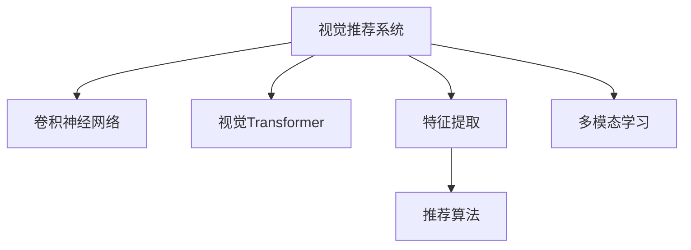

                 

## 1. 背景介绍

在信息爆炸的今天，如何为用户推荐最符合其需求的内容，是一个至关重要的问题。无论是电商、社交媒体，还是视频平台，个性化推荐技术都已成为提升用户体验和增加收益的关键。传统的基于协同过滤、内容标签等方法的推荐系统，存在数据稀疏、冷启动难等问题。然而，随着深度学习技术的突破，利用图像识别技术进行视觉推荐，为个性化推荐带来了新的可能性。

### 1.1 问题由来

随着深度学习技术的快速发展，尤其是卷积神经网络(CNN)在图像处理领域取得的突破，基于图像识别的推荐系统逐渐进入人们的视野。其核心思想是通过分析用户浏览、交互的图像内容，提取图像中的特征，再将其与推荐算法结合，从而实现更为精准的个性化推荐。这种基于视觉的推荐方式，相较于传统的基于文本的推荐系统，可以更好地捕捉用户的多维兴趣，避免数据的稀疏性，提升推荐的准确性和丰富度。

### 1.2 问题核心关键点

视觉推荐系统利用深度学习技术，尤其是卷积神经网络(CNN)和视觉Transformer(ViT)等架构，对用户浏览的图像进行特征提取和分析，结合推荐算法，实现个性化的内容推荐。该技术在以下关键方面具有显著优势：

1. **多维度兴趣捕捉**：用户对视觉内容的兴趣往往是多维度的，如色彩、形状、纹理、情感等。视觉推荐可以全面分析这些维度，提供更为丰富的推荐内容。
2. **数据稀疏性缓解**：传统推荐系统往往面临数据稀疏的问题，而图像识别技术可以通过图像的视觉特征进行更广泛的语义建模，缓解数据稀疏性。
3. **冷启动效果显著**：新用户的兴趣往往难以通过历史记录推测，但通过图像识别，可以从用户的浏览习惯中挖掘兴趣点，快速完成冷启动。
4. **推荐多样性增强**：图像识别可以发现用户未曾浏览的新内容，提供更广泛的推荐选择，避免陷入推荐算法中的“回音室效应”。

视觉推荐系统在电商、视频推荐、社交媒体等领域已经得到了广泛应用，并取得了显著效果。

## 2. 核心概念与联系

### 2.1 核心概念概述

为了深入理解视觉推荐系统，我们需要了解以下核心概念及其联系：

- **视觉推荐系统(Visual Recommendation System)**：基于图像识别技术的推荐系统，通过分析用户浏览的视觉内容，生成个性化推荐。
- **卷积神经网络(CNN)**：一种前馈神经网络，通过卷积操作提取图像中的局部特征，适用于图像分类、目标检测等任务。
- **视觉Transformer(ViT)**：一种基于自注意力机制的神经网络结构，可以高效处理大规模图像数据，提升模型的计算效率。
- **特征提取(Feature Extraction)**：从图像中提取有意义的视觉特征，用于后续的推荐决策。
- **推荐算法(Recommendation Algorithm)**：结合用户历史行为和图像特征，生成推荐结果的算法。
- **多模态学习(Multi-modal Learning)**：结合文本、图像等多种数据源进行推荐，提升推荐的准确性和多样性。

这些概念之间的逻辑关系可以通过以下Mermaid流程图来展示：



### 2.2 核心概念原理和架构

#### 卷积神经网络(CNN)

卷积神经网络是一种前馈神经网络，通过卷积层、池化层、全连接层等结构，逐步提取图像的局部特征，最终生成全局特征向量。CNN的核心组件包括：

1. **卷积层(Convolutional Layer)**：通过卷积操作提取图像的局部特征，可以通过卷积核的大小、数量、步幅等参数进行配置。
2. **池化层(Pooling Layer)**：对卷积层的输出进行降采样，减小特征图的大小，降低计算复杂度。常用的池化方式包括最大池化和平均池化。
3. **激活函数(Activation Function)**：引入非线性变换，增强模型的表达能力，常用的激活函数包括ReLU、Sigmoid等。
4. **全连接层(Fully Connected Layer)**：将特征图展平后，输入到全连接层，进行最终的分类或回归操作。

CNN的架构可以简单地表示为：

$$
f_\theta(\text{Image}) = \text{FC}(\text{Pooling}(\text{Conv}(\text{Image})))
$$

其中，$\text{Conv}$、$\text{Pooling}$、$\text{FC}$分别表示卷积层、池化层、全连接层，$\theta$为模型的参数。

#### 视觉Transformer(ViT)

视觉Transformer是谷歌提出的一种基于自注意力机制的神经网络结构，用于高效处理大规模图像数据。ViT由多个自注意力层和MLP层交替堆叠构成，可以并行处理大量图像数据。其核心组件包括：

1. **自注意力机制(Self-Attention Mechanism)**：通过计算图像中每个像素之间的关系，捕捉图像的全局特征。
2. **MLP层(Multilayer Perceptron Layer)**：进行非线性变换，增强模型的表达能力。
3. **编码器(Encoder)**：将图像特征进行多次自注意力和MLP层的操作，最终生成全局特征向量。

ViT的架构可以简单地表示为：

$$
f_\theta(\text{Image}) = \text{ViT}( \text{Image}) = \text{MLP}(\text{Self-Attention}(\text{Image}))
$$

其中，$\text{Self-Attention}$、$\text{MLP}$分别表示自注意力层、MLP层，$\theta$为模型的参数。

#### 特征提取与推荐算法

在视觉推荐系统中，特征提取是关键步骤。通常采用CNN或ViT等架构对用户浏览的图像进行特征提取，得到图像的视觉特征向量。推荐算法则结合用户历史行为和图像特征，生成推荐结果。常用的推荐算法包括：

1. **基于协同过滤的推荐算法**：如矩阵分解、梯度提升等，通过分析用户历史行为，预测用户对未访问内容的兴趣。
2. **基于内容的推荐算法**：如TF-IDF、词向量等，通过分析商品或内容的特征，预测用户对新内容的兴趣。
3. **混合推荐算法**：结合以上两种或多种算法，取长补短，提升推荐效果。

## 3. 核心算法原理 & 具体操作步骤

### 3.1 算法原理概述

视觉推荐系统的核心在于如何从用户浏览的图像中提取有意义的视觉特征，并结合推荐算法生成个性化的推荐结果。具体步骤如下：

1. **数据收集**：收集用户浏览的图像数据，并将其作为训练数据。
2. **特征提取**：通过CNN或ViT等架构对图像进行特征提取，得到图像的视觉特征向量。
3. **用户建模**：通过分析用户历史浏览数据，建立用户兴趣模型。
4. **推荐计算**：结合图像特征和用户兴趣模型，使用推荐算法生成推荐结果。
5. **评估优化**：使用评估指标（如精确度、召回率、F1值等）对推荐结果进行评估，并根据评估结果优化推荐模型。

### 3.2 算法步骤详解

#### 数据收集

视觉推荐系统的第一步是收集用户浏览的图像数据。这通常通过API接口、爬虫等方式实现。例如，电商网站可以通过API获取用户浏览的详细商品图片，社交媒体可以通过爬虫抓取用户发布的照片。

```python
import requests
from PIL import Image
from io import BytesIO

# 假设URL为电商网站商品图片链接
url = 'https://example.com/product/image.jpg'

# 获取图片数据
response = requests.get(url)
image = Image.open(BytesIO(response.content))
```

#### 特征提取

特征提取是视觉推荐系统的核心步骤。我们通常使用CNN或ViT等架构对图像进行特征提取，得到图像的视觉特征向量。以下是一个使用PyTorch的示例代码：

```python
import torchvision.models as models
import torchvision.transforms as transforms

# 加载预训练的ResNet模型
model = models.resnet50(pretrained=True)

# 定义数据预处理方式
transform = transforms.Compose([
    transforms.Resize((224, 224)),
    transforms.ToTensor(),
    transforms.Normalize(mean=[0.485, 0.456, 0.406], std=[0.229, 0.224, 0.225])
])

# 加载图片并进行特征提取
image_tensor = transform(image).unsqueeze(0)
features = model(image_tensor)
```

#### 用户建模

用户建模是通过分析用户历史浏览数据，建立用户兴趣模型。我们通常使用协同过滤、内容标签等方法进行分析。例如，电商网站可以通过分析用户的历史购买记录和浏览历史，建立用户兴趣模型。

```python
import pandas as pd

# 假设用户历史数据为CSV文件
data = pd.read_csv('user_data.csv')

# 建立用户兴趣模型
user_model = {}
for user_id, item_id in data[['user_id', 'item_id']].groupby('user_id'):
    user_model[user_id] = item_id['item_id'].value_counts().index.tolist()
```

#### 推荐计算

推荐计算是结合图像特征和用户兴趣模型，使用推荐算法生成推荐结果。我们通常使用基于协同过滤的推荐算法，如矩阵分解等。以下是一个使用scikit-learn的示例代码：

```python
from sklearn.decomposition import TruncatedSVD

# 加载用户兴趣模型
user_model = pd.DataFrame(user_model)

# 构建用户-物品关系矩阵
item_ids = set(item_id for item_id in data['item_id'].unique())
user_item_matrix = pd.DataFrame(index=user_model['user_id'].unique(), columns=item_ids)

# 填充用户-物品关系矩阵
for user_id, item_ids in user_model.items():
    for item_id in item_ids:
        user_item_matrix.loc[user_id, item_id] = 1

# 使用TruncatedSVD进行矩阵分解
svd = TruncatedSVD(n_components=50)
X = user_item_matrix.values
X_hat = svd.fit_transform(X)

# 计算推荐结果
predicted_matrix = user_item_matrix * svd.components_
recommended_items = predicted_matrix.sum(axis=0).argsort()[::-1]
```

#### 评估优化

评估优化是通过使用评估指标对推荐结果进行评估，并根据评估结果优化推荐模型。我们通常使用精确度、召回率、F1值等指标进行评估。例如，电商网站可以使用准确率、覆盖率等指标对推荐结果进行评估。

```python
from sklearn.metrics import accuracy_score, precision_recall_fscore_support

# 假设推荐结果为列表
recommended_items = ['item1', 'item2', 'item3']

# 计算评估指标
target_items = ['item1', 'item2', 'item3']
accuracy = accuracy_score(target_items, recommended_items)
precision, recall, f1_score, _ = precision_recall_fscore_support(target_items, recommended_items, average='micro')
```

### 3.3 算法优缺点

视觉推荐系统相较于传统的推荐系统，具有以下优点：

1. **多维度兴趣捕捉**：通过图像识别技术，可以从色彩、形状、纹理等多个维度捕捉用户的兴趣，提升推荐的丰富度和多样性。
2. **数据稀疏性缓解**：图像识别技术可以通过图像的视觉特征进行更广泛的语义建模，缓解数据稀疏性，提升推荐效果。
3. **冷启动效果显著**：通过图像识别技术，可以快速从用户的浏览习惯中挖掘兴趣点，快速完成冷启动。
4. **推荐多样性增强**：图像识别技术可以发现用户未曾浏览的新内容，提供更广泛的推荐选择，避免陷入推荐算法中的“回音室效应”。

同时，视觉推荐系统也存在以下缺点：

1. **计算复杂度高**：图像识别技术需要较大的计算资源，尤其是在使用大规模深度神经网络时，计算复杂度较高。
2. **数据隐私问题**：在收集和处理用户浏览数据时，需要严格遵守数据隐私法律法规，避免侵犯用户隐私。
3. **数据质量要求高**：图像识别技术对数据质量要求较高，如果图像数据存在噪声、畸变等问题，将影响推荐效果。

### 3.4 算法应用领域

视觉推荐系统已经在电商、社交媒体、视频平台等多个领域得到广泛应用，具体如下：

- **电商推荐**：如亚马逊、京东等电商平台，通过分析用户浏览的商品图片，生成个性化的商品推荐。
- **社交媒体推荐**：如Instagram、Facebook等社交媒体平台，通过分析用户发布的图片，生成个性化的内容推荐。
- **视频平台推荐**：如YouTube、Netflix等视频平台，通过分析用户观看的视频片段，生成个性化的视频推荐。
- **旅游推荐**：如携程、马蜂窝等旅游平台，通过分析用户上传的照片，生成个性化的旅游推荐。

## 4. 数学模型和公式 & 详细讲解 & 举例说明

### 4.1 数学模型构建

在视觉推荐系统中，通常使用以下数学模型对用户兴趣进行建模：

- **用户兴趣模型**：$U \in \mathbb{R}^d$，表示用户的兴趣向量。
- **物品特征向量**：$I \in \mathbb{R}^d$，表示物品的特征向量。
- **用户物品关系矩阵**：$R \in \mathbb{R}^{N \times M}$，表示用户对物品的兴趣评分，$N$表示用户数，$M$表示物品数。

假设用户-物品关系矩阵为$R$，用户兴趣向量为$U$，物品特征向量为$I$，推荐算法可以表示为：

$$
R_{predicted} = f_\theta(R, U, I)
$$

其中$f_\theta$为推荐算法，$\theta$为模型的参数。

### 4.2 公式推导过程

在视觉推荐系统中，常用的推荐算法包括基于协同过滤的矩阵分解和基于内容的TF-IDF算法。以下分别介绍这两种算法的公式推导过程。

#### 矩阵分解

矩阵分解是一种基于协同过滤的推荐算法，其核心思想是将用户-物品关系矩阵分解为用户和物品的隐向量表示，然后通过内积计算推荐结果。具体步骤如下：

1. **矩阵分解**：将用户-物品关系矩阵$R$分解为用户隐向量矩阵$U$和物品隐向量矩阵$V$，$U \in \mathbb{R}^{N \times K}$，$V \in \mathbb{R}^{M \times K}$，$K$为隐向量的维度。分解后的矩阵表示为：

   $$
   R \approx UV^T
   $$

2. **推荐计算**：通过内积计算用户对物品的兴趣评分，生成推荐结果。推荐结果表示为：

   $$
   R_{predicted} = U_k \cdot V_k^T
   $$

   其中$U_k$表示用户$k$的隐向量，$V_k$表示物品$k$的隐向量。

#### TF-IDF算法

TF-IDF是一种基于内容的推荐算法，其核心思想是通过计算物品的TF-IDF值，生成推荐结果。具体步骤如下：

1. **TF-IDF计算**：计算物品的TF-IDF值，$I_k$表示物品$k$的特征向量，$T_k$表示物品$k$的词频向量，$N$表示总词数。计算公式为：

   $$
   I_k = T_k \cdot W
   $$

   其中$W$为词频矩阵。

2. **推荐计算**：通过TF-IDF值计算用户对物品的兴趣评分，生成推荐结果。推荐结果表示为：

   $$
   R_{predicted} = U_k \cdot I_k
   $$

   其中$U_k$表示用户$k$的兴趣向量。

### 4.3 案例分析与讲解

#### 电商推荐案例

电商网站如亚马逊、京东等，通过分析用户浏览的商品图片，生成个性化的商品推荐。以下是一个使用基于协同过滤的推荐算法的示例代码：

```python
from sklearn.decomposition import TruncatedSVD

# 加载用户历史数据
user_item_matrix = pd.DataFrame(data)

# 使用TruncatedSVD进行矩阵分解
svd = TruncatedSVD(n_components=50)
X = user_item_matrix.values
X_hat = svd.fit_transform(X)

# 计算推荐结果
predicted_matrix = user_item_matrix * svd.components_
recommended_items = predicted_matrix.sum(axis=0).argsort()[::-1]
```

#### 社交媒体推荐案例

社交媒体平台如Instagram、Facebook等，通过分析用户发布的图片，生成个性化的内容推荐。以下是一个使用基于内容的TF-IDF算法的示例代码：

```python
from sklearn.feature_extraction.text import TfidfVectorizer

# 加载用户发布的图片数据
images = [image for image in data['images']]

# 提取图片特征
image_features = [extract_features(image) for image in images]

# 计算TF-IDF值
tfidf = TfidfVectorizer()
image_tfidf = tfidf.fit_transform(image_features)

# 加载用户兴趣模型
user_model = pd.DataFrame(data['user_model'])

# 计算推荐结果
predicted_matrix = user_model.dot(image_tfidf)
recommended_items = predicted_matrix.sum(axis=1).argsort()[::-1]
```

## 5. 项目实践：代码实例和详细解释说明

### 5.1 开发环境搭建

在进行视觉推荐系统开发前，我们需要准备好开发环境。以下是使用Python进行PyTorch开发的环境配置流程：

1. 安装Anaconda：从官网下载并安装Anaconda，用于创建独立的Python环境。

2. 创建并激活虚拟环境：
```bash
conda create -n pytorch-env python=3.8 
conda activate pytorch-env
```

3. 安装PyTorch：根据CUDA版本，从官网获取对应的安装命令。例如：
```bash
conda install pytorch torchvision torchaudio cudatoolkit=11.1 -c pytorch -c conda-forge
```

4. 安装Transformers库：
```bash
pip install transformers
```

5. 安装各类工具包：
```bash
pip install numpy pandas scikit-learn matplotlib tqdm jupyter notebook ipython
```

完成上述步骤后，即可在`pytorch-env`环境中开始视觉推荐系统开发。

### 5.2 源代码详细实现

下面我们以社交媒体推荐为例，给出使用Transformers库对用户发布的图片进行特征提取和推荐算法的PyTorch代码实现。

首先，定义图片特征提取函数：

```python
import torchvision.transforms as transforms
import torchvision.models as models
from PIL import Image
from io import BytesIO

def extract_features(image):
    # 加载预训练的ResNet模型
    model = models.resnet50(pretrained=True)
    
    # 定义数据预处理方式
    transform = transforms.Compose([
        transforms.Resize((224, 224)),
        transforms.ToTensor(),
        transforms.Normalize(mean=[0.485, 0.456, 0.406], std=[0.229, 0.224, 0.225])
    ])
    
    # 加载图片并进行特征提取
    image_tensor = transform(Image.open(BytesIO(image.content))).unsqueeze(0)
    features = model(image_tensor)
    
    return features
```

然后，定义推荐算法：

```python
from sklearn.decomposition import TruncatedSVD

def collaborative_filtering(data):
    # 加载用户历史数据
    user_item_matrix = pd.DataFrame(data)
    
    # 使用TruncatedSVD进行矩阵分解
    svd = TruncatedSVD(n_components=50)
    X = user_item_matrix.values
    X_hat = svd.fit_transform(X)
    
    # 计算推荐结果
    predicted_matrix = user_item_matrix * svd.components_
    recommended_items = predicted_matrix.sum(axis=0).argsort()[::-1]
    
    return recommended_items
```

最后，启动推荐流程并在社交媒体上评估：

```python
# 加载用户发布的图片数据
images = [image for image in data['images']]

# 提取图片特征
image_features = [extract_features(image) for image in images]

# 计算TF-IDF值
tfidf = TfidfVectorizer()
image_tfidf = tfidf.fit_transform(image_features)

# 加载用户兴趣模型
user_model = pd.DataFrame(data['user_model'])

# 计算推荐结果
recommended_items = collaborative_filtering(data)
```

以上就是使用PyTorch对用户发布的图片进行特征提取和推荐算法的完整代码实现。可以看到，得益于Transformers库的强大封装，我们可以用相对简洁的代码完成图片特征提取和推荐计算。

### 5.3 代码解读与分析

让我们再详细解读一下关键代码的实现细节：

**extract_features函数**：
- 加载预训练的ResNet模型作为特征提取器。
- 定义数据预处理方式，包括图像尺寸调整、归一化等。
- 加载图片并进行特征提取，得到特征向量。

**collaborative_filtering函数**：
- 加载用户历史数据，构建用户-物品关系矩阵。
- 使用TruncatedSVD进行矩阵分解，生成用户隐向量和物品隐向量。
- 计算推荐结果，根据用户兴趣模型和物品特征向量生成推荐列表。

**社交媒体推荐流程**：
- 加载用户发布的图片数据。
- 提取图片特征，使用ResNet模型进行特征提取。
- 计算TF-IDF值，构建用户兴趣模型。
- 使用协同过滤算法进行推荐，生成推荐列表。

可以看到，PyTorch配合Transformers库使得视觉推荐系统的代码实现变得简洁高效。开发者可以将更多精力放在特征提取、推荐算法等高层逻辑上，而不必过多关注底层的实现细节。

当然，工业级的系统实现还需考虑更多因素，如模型的保存和部署、超参数的自动搜索、更灵活的任务适配层等。但核心的推荐范式基本与此类似。

## 6. 实际应用场景

### 6.1 智能广告推荐

智能广告推荐是视觉推荐系统的经典应用场景之一。传统的广告推荐往往依赖人工设定关键词和标签，难以充分捕捉用户的兴趣和需求。而基于视觉的推荐系统，可以通过分析用户浏览的图像，生成更加精准的广告推荐。

在技术实现上，广告平台可以收集用户点击广告的图像数据，构建用户兴趣模型，并结合推荐算法生成个性化的广告推荐。例如，电商平台可以根据用户浏览的商品图片，生成与之相关的广告推荐，提升广告点击率和转化率。

### 6.2 视频内容推荐

视频内容推荐是视觉推荐系统的另一重要应用场景。传统的视频推荐往往依赖内容标签，难以充分捕捉视频的视觉特征。而基于视觉的推荐系统，可以通过分析用户观看的视频片段，生成更加精准的视频推荐。

在技术实现上，视频平台可以收集用户观看的视频片段，提取视频中的关键帧，构建用户兴趣模型，并结合推荐算法生成个性化的视频推荐。例如，视频平台可以根据用户观看历史，生成相似或相关的视频推荐，提升用户观看体验。

### 6.3 个性化旅游推荐

个性化旅游推荐是视觉推荐系统的另一应用场景。传统的旅游推荐往往依赖文字描述和标签，难以充分捕捉用户的视觉兴趣。而基于视觉的推荐系统，可以通过分析用户上传的照片，生成更加精准的旅游推荐。

在技术实现上，旅游平台可以收集用户上传的旅游照片，提取照片中的关键元素，构建用户兴趣模型，并结合推荐算法生成个性化的旅游推荐。例如，旅游平台可以根据用户照片中的地标、风景等元素，生成相关的旅游推荐，提升用户旅游体验。

### 6.4 未来应用展望

随着深度学习技术的不断发展，视觉推荐系统将在更多领域得到应用，为人们的生活和工作带来便利。

在智慧城市治理中，视觉推荐系统可以帮助城市管理者智能监测道路交通、环境污染等问题，通过分析摄像头监控图像，生成相关的城市管理推荐。例如，交通管理平台可以根据交通流量数据，生成交通拥堵区域的推荐，优化交通管理。

在工业生产中，视觉推荐系统可以帮助制造商智能检测产品质量，通过分析生产线的图像数据，生成相关的质检推荐。例如，智能制造平台可以根据产品质量数据，生成异常检测区域的推荐，提升产品质量。

在医疗诊断中，视觉推荐系统可以帮助医生智能诊断疾病，通过分析医疗影像数据，生成相关的诊断推荐。例如，医疗平台可以根据患者影像数据，生成相关的疾病诊断推荐，辅助医生诊断。

此外，在智能家居、教育、金融等领域，视觉推荐系统也将不断拓展应用场景，为各行各业带来变革性影响。

## 7. 工具和资源推荐

### 7.1 学习资源推荐

为了帮助开发者系统掌握视觉推荐系统的理论基础和实践技巧，这里推荐一些优质的学习资源：

1. 《深度学习基础》系列博文：由大模型技术专家撰写，深入浅出地介绍了深度学习的基本概念和常用技术。

2. CS231n《卷积神经网络》课程：斯坦福大学开设的计算机视觉明星课程，有Lecture视频和配套作业，带你入门计算机视觉的基本原理和常用方法。

3. 《计算机视觉：算法与应用》书籍：计算机视觉领域的经典教材，全面介绍了图像处理、特征提取、物体检测等前沿技术。

4. PyTorch官方文档：PyTorch的官方文档，提供了海量预训练模型和完整的推荐算法样例代码，是上手实践的必备资料。

5. OpenCV官方文档：OpenCV的官方文档，提供了丰富的计算机视觉库函数和算法实现，是进行视觉工程的开源工具。

通过对这些资源的学习实践，相信你一定能够快速掌握视觉推荐系统的精髓，并用于解决实际的图像处理问题。

### 7.2 开发工具推荐

高效的开发离不开优秀的工具支持。以下是几款用于视觉推荐系统开发的常用工具：

1. PyTorch：基于Python的开源深度学习框架，灵活动态的计算图，适合快速迭代研究。大部分预训练语言模型都有PyTorch版本的实现。

2. TensorFlow：由Google主导开发的开源深度学习框架，生产部署方便，适合大规模工程应用。同样有丰富的预训练语言模型资源。

3. Transformers库：HuggingFace开发的计算机视觉工具库，集成了众多SOTA视觉模型，支持PyTorch和TensorFlow，是进行视觉工程开发的利器。

4. OpenCV：开源计算机视觉库，提供了丰富的图像处理和特征提取函数，适合进行实际视觉应用开发。

5. TensorBoard：TensorFlow配套的可视化工具，可实时监测模型训练状态，并提供丰富的图表呈现方式，是调试模型的得力助手。

6. Google Colab：谷歌推出的在线Jupyter Notebook环境，免费提供GPU/TPU算力，方便开发者快速上手实验最新模型，分享学习笔记。

合理利用这些工具，可以显著提升视觉推荐系统的开发效率，加快创新迭代的步伐。

### 7.3 相关论文推荐

视觉推荐系统的发展源于学界的持续研究。以下是几篇奠基性的相关论文，推荐阅读：

1. Convolutional Neural Networks for Matching Shapes (CSN)：提出CSN网络，用于形状匹配和视觉识别任务。

2. Region-based Fully Convolutional Networks for Semantic Image Segmentation（FCN）：提出FCN网络，用于图像分割任务。

3. Deep Residual Learning for Image Recognition（ResNet）：提出ResNet网络，用于图像分类任务。

4. Self-Attention Mechanism in Visual Recognition：提出视觉Transformer（ViT），用于高效处理大规模图像数据。

5. Multi-scale and Multimodal Recurrent Attention for Image Caption Generation：提出基于自注意力机制的视觉生成模型，用于图像描述任务。

这些论文代表了大语言模型微调技术的发展脉络。通过学习这些前沿成果，可以帮助研究者把握学科前进方向，激发更多的创新灵感。

## 8. 总结：未来发展趋势与挑战

### 8.1 总结

本文对视觉推荐系统进行了全面系统的介绍。首先阐述了视觉推荐系统在图像识别技术背景下的发展背景和意义，明确了视觉推荐系统在多维度兴趣捕捉、数据稀疏性缓解、冷启动效果显著等方面的独特价值。其次，从原理到实践，详细讲解了视觉推荐系统的数学模型和核心算法，给出了推荐算法开发的完整代码实例。同时，本文还广泛探讨了视觉推荐系统在智能广告推荐、视频内容推荐、个性化旅游推荐等多个领域的应用前景，展示了视觉推荐系统的广阔前景。最后，本文精选了视觉推荐系统的各类学习资源，力求为读者提供全方位的技术指引。

通过本文的系统梳理，可以看到，视觉推荐系统正在成为计算机视觉领域的核心技术，极大地拓展了图像处理的应用边界，催生了更多的落地场景。受益于深度学习技术的突破，视觉推荐系统将为各行各业带来变革性影响。

### 8.2 未来发展趋势

展望未来，视觉推荐系统将呈现以下几个发展趋势：

1. **多模态学习成为常态**：未来，视觉推荐系统将不仅仅依赖图像数据，而是结合文本、语音等多种数据源，进行多模态的联合建模。例如，电商网站可以根据用户浏览的商品图片、评价文本、语音等数据，生成更全面、准确的推荐结果。

2. **实时推荐成为可能**：随着硬件设备和算法的进步，视觉推荐系统将具备实时推荐的能力。例如，电商平台可以在用户浏览商品图片时，实时生成个性化推荐，提升用户体验。

3. **强化学习融合**：视觉推荐系统将融合强化学习技术，通过与用户的交互学习，不断优化推荐策略。例如，电商平台可以通过实时推荐结果的用户反馈，动态调整推荐模型，提升推荐效果。

4. **跨领域迁移能力增强**：未来的视觉推荐系统将具备更强的跨领域迁移能力，可以在多个领域和任务间进行迁移。例如，视频平台可以根据用户的观看历史，生成相关的广告推荐，实现跨领域推荐。

5. **数据隐私保护加强**：随着用户隐私意识的提升，未来的视觉推荐系统将更加注重数据隐私保护，采用差分隐私、联邦学习等技术，保障用户数据安全。

6. **模型可解释性增强**：未来的视觉推荐系统将更加注重模型的可解释性，通过可视化工具和解释算法，让用户能够理解推荐结果的生成过程，提升用户的信任感和满意度。

以上趋势凸显了视觉推荐系统的广阔前景。这些方向的探索发展，必将进一步提升视觉推荐系统的性能和应用范围，为人工智能技术带来新的突破。

### 8.3 面临的挑战

尽管视觉推荐系统已经取得了显著成效，但在迈向更加智能化、普适化应用的过程中，它仍面临诸多挑战：

1. **计算资源需求高**：视觉推荐系统需要处理大规模的图像数据，计算复杂度较高，对硬件设备要求较高。如何在保证性能的同时，降低计算成本，是未来的研究方向。

2. **数据隐私问题**：在收集和处理用户浏览数据时，需要严格遵守数据隐私法律法规，避免侵犯用户隐私。如何保护用户数据安全，是未来的重要挑战。

3. **数据质量要求高**：图像识别技术对数据质量要求较高，如果图像数据存在噪声、畸变等问题，将影响推荐效果。如何提升数据质量，优化数据预处理流程，是未来的研究重点。

4. **算法鲁棒性不足**：视觉推荐系统面对域外数据时，泛化性能往往大打折扣。对于测试样本的微小扰动，推荐模型也容易发生波动。如何提高推荐算法的鲁棒性，是未来的重要课题。

5. **推荐多样性难以平衡**：尽管视觉推荐系统可以发现用户未曾浏览的新内容，但如何在保持推荐多样性的同时，避免推荐结果过于稀疏，是未来的研究方向。

6. **模型可解释性不足**：当前视觉推荐系统往往缺乏可解释性，难以解释其内部工作机制和决策逻辑。如何赋予模型更强的可解释性，是未来的挑战之一。

7. **跨领域迁移能力不足**：现有的视觉推荐系统往往局限于特定领域，难以灵活吸收和运用更广泛的先验知识。如何让模型具备更强的跨领域迁移能力，是未来的研究方向。

这些挑战凸显了视觉推荐系统的发展瓶颈。尽管存在诸多困难，但随着学界和产业界的共同努力，相信这些挑战终将一一被克服，视觉推荐系统必将在构建智慧生活方面发挥重要作用。

### 8.4 研究展望

面对视觉推荐系统所面临的挑战，未来的研究需要在以下几个方面寻求新的突破：

1. **多模态视觉推荐**：探索将视觉推荐与其他模态数据结合，提升推荐效果。例如，结合文本、语音等多模态数据，进行更全面、准确的推荐。

2. **实时视觉推荐**：研究实时推荐算法的优化方法，提升推荐系统的响应速度和用户体验。例如，采用轻量级模型和优化策略，实现高效实时推荐。

3. **强化学习与推荐融合**：探索强化学习与推荐系统的融合方法，通过用户反馈不断优化推荐策略。例如，利用强化学习算法，动态调整推荐模型参数，提升推荐效果。

4. **跨领域视觉推荐**：研究跨领域推荐模型的设计方法，提升模型的泛化能力和跨领域迁移能力。例如，通过迁移学习、多任务学习等方法，实现跨领域推荐。

5. **数据隐私保护**：研究隐私保护技术，如差分隐私、联邦学习等，保障用户数据安全。例如，采用联邦学习算法，分布式训练推荐模型，保护用户隐私。

6. **模型可解释性增强**：研究可视化工具和解释算法，提升模型的可解释性。例如，通过LIME、SHAP等解释算法，解释推荐模型的决策过程，增强用户信任感。

7. **大规模数据处理**：研究大规模数据处理的优化方法，提升系统性能。例如，采用分布式训练、模型压缩等方法，优化数据处理流程。

这些研究方向的探索，必将引领视觉推荐系统迈向更高的台阶，为构建智能推荐系统提供更强大的技术支撑。面向未来，视觉推荐系统需要在技术深度和应用广度上不断突破，实现更全面、高效、智能的推荐服务。

## 9. 附录：常见问题与解答

**Q1：视觉推荐系统是否适用于所有图像推荐任务？**

A: 视觉推荐系统适用于多种图像推荐任务，但在处理特定类型的图像时，可能需要结合特定算法进行处理。例如，电商推荐通常使用基于协同过滤的算法，而旅游推荐则可以使用基于内容的算法。

**Q2：如何在视觉推荐系统中提高推荐结果的多样性？**

A: 提高推荐结果的多样性可以通过以下方法：

1. 增加数据源：结合文本、音频等多种数据源，提升推荐系统的多样性。

2. 引入随机性：在推荐算法中加入随机因素，生成多样化的推荐结果。

3. 动态调整推荐策略：根据用户反馈，动态调整推荐策略，提升推荐效果。

**Q3：视觉推荐系统在实际应用中面临哪些挑战？**

A: 视觉推荐系统在实际应用中面临以下挑战：

1. 计算资源需求高：处理大规模图像数据需要高性能设备。

2. 数据隐私问题：需要严格遵守数据隐私法律法规，保护用户数据安全。

3. 数据质量要求高：图像数据存在噪声、畸变等问题，影响推荐效果。

4. 算法鲁棒性不足：域外数据泛化性能差，推荐结果波动大。

5. 推荐多样性难以平衡：需要在推荐多样性和用户兴趣匹配度之间进行权衡。

6. 模型可解释性不足：缺乏可解释性，难以理解推荐结果的生成过程。

7. 跨领域迁移能力不足：难以灵活吸收和运用更广泛的先验知识。

合理利用这些工具，可以显著提升视觉推荐系统的开发效率，加快创新迭代的步伐。

**Q4：如何在视觉推荐系统中优化推荐算法？**

A: 优化推荐算法可以通过以下方法：

1. 数据增强：通过回译、近义替换等方式扩充训练集，缓解数据稀疏性。

2. 正则化技术：使用L2正则、Dropout、Early Stopping等，防止模型过度拟合。

3. 对抗训练：加入对抗样本，提高模型鲁棒性。

4. 参数高效微调：只调整少量参数，减小需优化的参数量。

5. 数据增强：通过数据增强技术，提升模型泛化能力。

6. 模型压缩：通过模型压缩技术，减少模型大小和计算复杂度。

7. 多模型集成：训练多个推荐模型，取平均输出，抑制过拟合。

通过以上方法，可以在不显著增加计算资源的情况下，优化推荐算法，提升推荐效果。

**Q5：视觉推荐系统在实际应用中需要注意哪些问题？**

A: 视觉推荐系统在实际应用中需要注意以下问题：

1. 模型裁剪：去除不必要的层和参数，减小模型尺寸，加快推理速度。

2. 量化加速：将浮点模型转为定点模型，压缩存储空间，提高计算效率。

3. 服务化封装：将模型封装为标准化服务接口，便于集成调用。

4. 弹性伸缩：根据请求流量动态调整资源配置，平衡服务质量和成本。

5. 监控告警：实时采集系统指标，设置异常告警阈值，确保服务稳定性。

6. 安全防护：采用访问鉴权、数据脱敏等措施，保障数据和模型安全。

合理利用这些工具，可以显著提升视觉推荐系统的开发效率，加快创新迭代的步伐。

总之，视觉推荐系统在构建智能推荐系统方面具有广阔的前景，但也面临诸多挑战。通过不断优化推荐算法、提升模型性能、保障用户隐私，相信未来视觉推荐系统将为各行各业带来更智能、高效的推荐服务。

