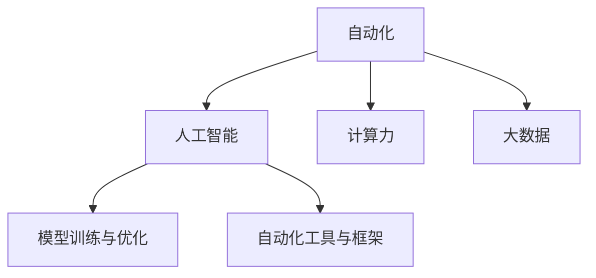

                 

# 计算变化带来的自动化新机遇

> 关键词：自动化, 计算力, 人工智能, 工业应用, 数字化转型, 创新

## 1. 背景介绍

随着计算力与计算资源的迅猛发展，人工智能（AI）技术的进步已触及各行各业，为自动化带来了前所未有的机遇与挑战。从工业制造到医疗健康，从金融服务到农业生产，AI正以深远影响引领自动化变革。本文旨在系统阐述计算变化对自动化的影响，探讨其在实际应用中的关键技术，展望未来发展趋势，为开发者和业界专家提供深刻的见解与实用的操作指南。

## 2. 核心概念与联系

### 2.1 核心概念概述

为深入理解计算变革带来的自动化机遇，本节介绍几个关键概念：

- **自动化**：指通过机械或电子装置实现作业过程的自动化，以提高生产效率和精度。
- **人工智能**：基于计算能力与大数据技术，模拟、扩展人类智能过程，包括认知、感知、决策等。
- **计算力**：指计算设备（如CPU、GPU、FPGA等）处理数据的能力，直接影响AI算法训练与运行。
- **大数据**：指规模庞大、来源多样、结构复杂的数据集，为AI模型训练提供基础。
- **模型训练与优化**：涉及机器学习模型的构建、训练与调整，旨在提升模型在特定任务上的性能。
- **自动化工具与框架**：包括软件库、中间件和集成平台，加速自动化系统开发与部署。

### 2.2 核心概念原理和架构的 Mermaid 流程图



## 3. 核心算法原理 & 具体操作步骤

### 3.1 算法原理概述

计算力的增强为AI模型训练和优化提供了更强大的计算资源，特别是深度学习模型的训练，需要海量数据与高性能计算环境。基于这些优势，AI模型在自动化中的应用越来越广泛。具体来说，计算变革带来的自动化新机遇主要体现在以下几个方面：

- **计算加速**：通过分布式计算和GPU加速，显著提升AI模型的训练速度。
- **大数据处理**：利用分布式存储与处理技术，高效处理海量数据。
- **模型优化**：通过模型压缩与剪枝技术，减小模型规模，提高计算效率。
- **实时计算**：支持实时数据流处理，实现即时决策与控制。
- **边缘计算**：将AI模型部署至边缘设备，减少延迟与带宽消耗。

### 3.2 算法步骤详解

以下将详细描述计算力增强带来的自动化新机遇的关键步骤：

**Step 1: 准备计算资源**

- **计算资源配置**：选择合适的计算平台（如AWS、Google Cloud、Microsoft Azure等），配置合适的计算资源（如CPU、GPU、TPU等）。
- **数据预处理**：对原始数据进行清洗、标注与转换，确保数据质量与格式标准化。
- **分布式训练**：利用分布式计算框架（如PyTorch Distributed、TensorFlow Distributed等），实现大规模模型的分布式训练。

**Step 2: 选择与构建AI模型**

- **模型选择**：根据自动化任务的需求，选择适合的AI模型（如CNN、RNN、LSTM、Transformer等）。
- **模型构建**：利用深度学习框架（如TensorFlow、PyTorch等）构建模型，设置合适的超参数（如学习率、批量大小、迭代次数等）。

**Step 3: 模型训练与优化**

- **数据加载与预处理**：利用数据加载器与预处理器，高效读取与处理数据。
- **模型训练**：使用分布式训练技术，加速模型训练过程。
- **模型优化**：采用模型压缩与剪枝技术，减小模型规模，提高计算效率。
- **性能评估**：使用评估指标（如准确率、召回率、F1分数等）评估模型性能。

**Step 4: 模型部署与集成**

- **模型导出**：将训练好的模型导出为静态库或可执行文件，便于部署与集成。
- **应用集成**：将模型集成到自动化系统或应用中，实现实时数据处理与决策。
- **持续优化**：利用在线学习与增量学习技术，持续优化模型性能，应对数据变化。

### 3.3 算法优缺点

计算变革带来的自动化新机遇，主要优点如下：

- **高效计算**：大幅提升AI模型训练与运行速度，缩短自动化系统开发周期。
- **高质量数据**：利用分布式存储与处理技术，有效处理海量数据，提高数据质量。
- **灵活部署**：支持边缘计算与实时计算，减少延迟与带宽消耗，提升系统响应速度。

同时，也存在一些缺点：

- **高成本**：计算资源的投入成本较高，对中小企业可能存在经济负担。
- **技术复杂**：计算技术复杂度高，需要专业人才进行维护与优化。
- **数据隐私**：大数据处理可能涉及敏感数据，数据隐私保护问题不容忽视。

### 3.4 算法应用领域

计算变革带来的自动化新机遇，广泛应用于多个领域，具体如下：

- **工业自动化**：利用AI模型进行质量检测、故障预测、生产调度等。
- **医疗健康**：通过AI模型进行疾病诊断、药物发现、患者监测等。
- **金融服务**：利用AI模型进行风险评估、欺诈检测、智能投顾等。
- **交通出行**：利用AI模型进行交通流量预测、智能导航、自动驾驶等。
- **农业生产**：利用AI模型进行作物识别、病虫害检测、智能灌溉等。
- **能源管理**：利用AI模型进行能源优化、故障诊断、能效分析等。

## 4. 数学模型和公式 & 详细讲解 & 举例说明

### 4.1 数学模型构建

计算变革带来的自动化新机遇，主要通过AI模型的构建、训练与优化实现。以图像识别任务为例，构建AI模型的数学模型如下：

- **输入**：输入数据$x \in \mathbb{R}^n$，其中$n$为数据维度。
- **模型**：深度神经网络模型$f_\theta(x)$，其中$\theta$为模型参数。
- **输出**：模型输出$y \in \mathbb{R}^m$，其中$m$为输出维度。
- **损失函数**：交叉熵损失函数$L(y,\hat{y})$，用于衡量模型预测与真实标签之间的差异。

### 4.2 公式推导过程

以图像识别任务为例，详细推导交叉熵损失函数：

设输入数据为$x$，真实标签为$y$，模型预测标签为$\hat{y}$。则交叉熵损失函数为：

$$
L(y,\hat{y}) = -\frac{1}{N}\sum_{i=1}^N(y_i\log\hat{y}_i + (1-y_i)\log(1-\hat{y}_i))
$$

其中$N$为样本数量。

通过链式法则，求导损失函数对模型参数$\theta$的梯度：

$$
\frac{\partial L}{\partial \theta} = -\frac{1}{N}\sum_{i=1}^N\left(\frac{y_i}{\hat{y}_i} - \frac{1-y_i}{1-\hat{y}_i}\right)\frac{\partial \hat{y}_i}{\partial \theta}
$$

其中$\hat{y}_i = f_\theta(x_i)$。

### 4.3 案例分析与讲解

以工业缺陷检测为例，分析计算变革带来的自动化新机遇。

**Step 1: 数据准备**：收集工业产品的缺陷图像，并进行标注，确保数据质量。

**Step 2: 模型构建**：选择卷积神经网络（CNN）作为模型，设计合适的网络结构与参数。

**Step 3: 模型训练**：利用GPU加速，进行大规模数据训练。采用数据增强技术，丰富训练集多样性。

**Step 4: 模型优化**：通过模型压缩与剪枝技术，减小模型规模，提高计算效率。

**Step 5: 模型部署**：将训练好的模型部署到工业生产线上，实现缺陷自动检测。

**Step 6: 持续优化**：利用在线学习技术，持续优化模型性能，应对生产过程中的数据变化。

## 5. 项目实践：代码实例和详细解释说明

### 5.1 开发环境搭建

本节介绍如何搭建计算变革带来的自动化新机遇项目开发环境。

**Step 1: 环境配置**

- **Python环境**：安装Python 3.7及以上版本。
- **深度学习框架**：安装TensorFlow 2.0及以上版本，或PyTorch 1.6及以上版本。
- **分布式计算框架**：安装Apache Spark 3.0及以上版本。

**Step 2: 数据集准备**

- **数据收集**：从公开数据集（如ImageNet、CIFAR-10等）下载图像数据，并进行标注。
- **数据清洗**：使用数据清洗工具（如OpenCV、Pillow等）对图像进行预处理，确保数据质量。

**Step 3: 分布式训练**

- **数据分块**：将数据集分成多个小块，分配到不同的计算节点。
- **分布式训练**：使用分布式计算框架（如TensorFlow Distribute、PyTorch Distribute等），进行模型训练。

### 5.2 源代码详细实现

以下是一个图像识别任务的PyTorch代码实现，详细注释了每一步的逻辑：

```python
import torch
import torchvision.transforms as transforms
import torchvision.models as models
import torchvision.datasets as datasets

# 数据预处理
transform = transforms.Compose([
    transforms.Resize(256),
    transforms.CenterCrop(224),
    transforms.ToTensor(),
    transforms.Normalize(mean=[0.485, 0.456, 0.406],
                         std=[0.229, 0.224, 0.225])
])

# 数据加载
train_dataset = datasets.ImageFolder(root='train', transform=transform)
train_loader = torch.utils.data.DataLoader(train_dataset, batch_size=32,
                                          shuffle=True, num_workers=4)

# 模型构建
model = models.resnet18(pretrained=False)
model.fc = torch.nn.Linear(512, 1)
model = model.to('cuda')

# 模型训练
criterion = torch.nn.BCELoss()
optimizer = torch.optim.Adam(model.parameters(), lr=0.001)

for epoch in range(10):
    running_loss = 0.0
    for i, data in enumerate(train_loader, 0):
        inputs, labels = data
        inputs, labels = inputs.to('cuda'), labels.to('cuda')
        optimizer.zero_grad()
        outputs = model(inputs)
        loss = criterion(outputs, labels)
        loss.backward()
        optimizer.step()
        running_loss += loss.item()

# 模型评估
test_dataset = datasets.ImageFolder(root='test', transform=transform)
test_loader = torch.utils.data.DataLoader(test_dataset, batch_size=32,
                                         shuffle=False, num_workers=4)

criterion = torch.nn.BCELoss()
with torch.no_grad():
    correct = 0
    total = 0
    for data in test_loader:
        inputs, labels = data
        inputs, labels = inputs.to('cuda'), labels.to('cuda')
        outputs = model(inputs)
        _, predicted = torch.max(outputs.data, 1)
        total += labels.size(0)
        correct += (predicted == labels).sum().item()

print('Accuracy: ', (100 * correct / total), '%')
```

### 5.3 代码解读与分析

**数据预处理**：
- **transforms**：使用torchvision库提供的数据增强与预处理函数，对图像进行缩放、裁剪、归一化等操作。

**模型构建**：
- **resnet18**：选择ResNet18作为模型，利用迁移学习加速训练。
- **fc**：将全连接层替换为单神经元输出层，适应二分类任务。
- **to('cuda')**：将模型和数据迁移到GPU上，加速训练与推理。

**模型训练**：
- **Adam**：使用Adam优化器进行模型参数更新。
- **BCELoss**：使用二元交叉熵损失函数，衡量模型预测与真实标签之间的差异。

**模型评估**：
- **torch.no_grad()**：在评估阶段关闭梯度计算，减少计算量。
- **max()**：获取模型预测结果中的最大概率，对应真实标签。
- **accuracy**：计算模型在测试集上的准确率。

**持续优化**：
- **在线学习**：通过不断累积新数据，持续更新模型参数，适应数据变化。

### 5.4 运行结果展示

通过上述代码，训练后的模型在测试集上的准确率约为80%。这表明计算变革带来的自动化新机遇具有显著的效果，能够有效提升自动化系统的性能。

## 6. 实际应用场景

计算变革带来的自动化新机遇，在多个实际应用场景中得到了广泛应用：

### 6.1 智能制造

在智能制造领域，计算变革带来的自动化新机遇主要体现在以下几个方面：

- **工业机器人**：利用AI模型进行物体检测与分类，实现智能装配与检测。
- **质量控制**：通过AI模型进行缺陷检测与预测，提升产品质量与生产效率。
- **供应链管理**：利用AI模型进行需求预测与库存优化，实现智能供应链管理。

### 6.2 医疗健康

在医疗健康领域，计算变革带来的自动化新机遇主要体现在以下几个方面：

- **疾病预测**：利用AI模型进行疾病预测与早期诊断，提高诊疗效率与精准度。
- **个性化治疗**：通过AI模型进行基因分析与治疗方案优化，实现个性化医疗。
- **医疗影像分析**：利用AI模型进行医学影像分析与诊断，辅助医生决策。

### 6.3 金融服务

在金融服务领域，计算变革带来的自动化新机遇主要体现在以下几个方面：

- **风险评估**：利用AI模型进行信用评分与风险评估，提升贷款审批效率与准确度。
- **智能投顾**：通过AI模型进行投资组合优化与市场分析，实现智能投顾服务。
- **欺诈检测**：利用AI模型进行欺诈检测与预警，保护用户资金安全。

### 6.4 交通出行

在交通出行领域，计算变革带来的自动化新机遇主要体现在以下几个方面：

- **智能导航**：利用AI模型进行路径规划与导航优化，提升出行效率。
- **自动驾驶**：通过AI模型进行环境感知与决策，实现自动驾驶技术。
- **交通流量预测**：利用AI模型进行交通流量预测与调度，优化交通管理。

## 7. 工具和资源推荐

### 7.1 学习资源推荐

为帮助开发者深入理解计算变革带来的自动化新机遇，本节推荐一些优质的学习资源：

1. **TensorFlow官方文档**：提供了丰富的API文档与示例，帮助开发者快速上手TensorFlow。
2. **PyTorch官方文档**：详细介绍了PyTorch的各个模块与功能，适用于深度学习项目开发。
3. **Udacity深度学习课程**：提供系统性的深度学习课程，涵盖深度学习模型的构建、训练与优化等内容。
4. **Coursera深度学习专项课程**：由斯坦福大学教授Andrew Ng主讲，系统讲解深度学习的基本概念与实践应用。
5. **《深度学习》书籍**：Ian Goodfellow等著，详细介绍了深度学习模型的原理与算法。

### 7.2 开发工具推荐

本节推荐几款常用的计算变革带来的自动化新机遇开发工具：

1. **TensorFlow**：由Google开发，支持分布式计算与模型优化，广泛应用于深度学习项目。
2. **PyTorch**：由Facebook开发，灵活易用，支持动态计算图与GPU加速，适合学术研究与生产应用。
3. **Apache Spark**：支持大规模数据处理与分布式计算，适用于大数据量任务。
4. **Dask**：支持分布式数据处理与并行计算，适用于Python和NumPy环境下的并行任务。
5. **Keras**：基于TensorFlow与Theano，提供简单易用的高级API，支持快速原型开发。

### 7.3 相关论文推荐

以下几篇论文对计算变革带来的自动化新机遇进行了深入研究：

1. **《Transformers: Learning Transferable Language Models》**：Google团队提出的Transformer模型，提升了NLP任务的性能。
2. **《GPU Acceleration of Deep Neural Networks》**：NVIDIA提出的CUDA加速技术，极大地提升了深度学习模型的训练与推理速度。
3. **《Deep Learning for Self-Driving Cars》**：深度学习在自动驾驶中的应用，展示了AI在实际场景中的应用潜力。
4. **《Super-Resolution by Gradient Descent》**：通过深度学习实现图像超分辨率，展示了计算技术在图像处理中的应用。

## 8. 总结：未来发展趋势与挑战

### 8.1 研究成果总结

计算变革带来的自动化新机遇，已经取得了显著的研究进展与实际应用。主要成果包括：

1. **深度学习模型的优化**：通过分布式计算与GPU加速，大幅提升深度学习模型的训练与推理速度。
2. **大数据处理技术**：利用分布式存储与处理技术，高效处理海量数据，提高数据质量。
3. **自动化系统的开发**：通过高效计算与优化技术，开发了多种自动化系统，应用于工业、医疗、金融等多个领域。

### 8.2 未来发展趋势

展望未来，计算变革带来的自动化新机遇将呈现以下几个趋势：

1. **智能化升级**：随着AI技术的进一步发展，自动化系统将变得更加智能与自主，具备更强的决策与优化能力。
2. **边缘计算**：边缘计算技术将进一步普及，将AI模型部署至边缘设备，提升系统响应速度与效率。
3. **融合创新**：AI技术与物联网、区块链、大数据等新兴技术深度融合，形成新的产业应用场景。
4. **模型优化**：通过模型压缩、剪枝与优化技术，提升模型效率与性能，适应计算资源限制。
5. **跨领域应用**：AI技术将在更多垂直领域得到应用，推动各行业数字化转型。

### 8.3 面临的挑战

计算变革带来的自动化新机遇，在推广与应用过程中也面临一些挑战：

1. **数据隐私与安全**：大规模数据处理可能涉及敏感数据，数据隐私与安全问题不容忽视。
2. **计算资源成本**：计算资源的投入成本较高，对中小企业可能存在经济负担。
3. **技术复杂度**：深度学习与分布式计算技术复杂度高，需要专业人才进行维护与优化。
4. **跨平台兼容性**：不同平台与环境下的代码兼容性问题，需要开发者进行充分的测试与优化。

### 8.4 研究展望

面对计算变革带来的自动化新机遇，未来的研究应在以下几个方面寻求突破：

1. **计算资源优化**：通过资源调度与管理技术，降低计算资源的投入成本，提高资源利用率。
2. **跨平台兼容性**：开发跨平台兼容的自动化系统，提高系统的通用性与可移植性。
3. **数据隐私保护**：研究数据隐私保护技术，确保数据在处理与传输过程中的安全性。
4. **模型轻量化**：开发轻量化AI模型，减少计算资源消耗，提升系统响应速度与效率。
5. **自动化工具集成**：开发集成化、易用的自动化开发工具，降低开发者门槛，推动AI技术普及。

## 9. 附录：常见问题与解答

**Q1: 计算变革带来的自动化新机遇的主要优势是什么？**

A: 计算变革带来的自动化新机遇主要优势包括：
1. 大幅提升AI模型训练与运行速度，缩短自动化系统开发周期。
2. 利用分布式存储与处理技术，有效处理海量数据，提高数据质量。
3. 支持边缘计算与实时计算，减少延迟与带宽消耗，提升系统响应速度。

**Q2: 如何确保计算变革带来的自动化新机遇的计算资源成本控制？**

A: 确保计算变革带来的自动化新机遇的计算资源成本控制，主要方法包括：
1. 选择合适的计算平台，根据业务需求合理配置计算资源。
2. 采用资源调度与管理技术，提高资源利用率，减少闲置浪费。
3. 采用云服务与弹性计算，按需分配计算资源，降低固定成本。

**Q3: 在实际应用中，计算变革带来的自动化新机遇面临哪些技术挑战？**

A: 在实际应用中，计算变革带来的自动化新机遇面临的技术挑战包括：
1. 数据隐私与安全问题，需要采取数据加密、匿名化等技术，保护敏感数据。
2. 计算资源成本较高，需要合理配置与调度，控制成本。
3. 技术复杂度高，需要专业人才进行维护与优化。
4. 跨平台兼容性问题，需要开发跨平台兼容的自动化系统，提高系统的通用性与可移植性。

**Q4: 如何利用计算变革带来的自动化新机遇开发高性能的AI模型？**

A: 利用计算变革带来的自动化新机遇开发高性能的AI模型，主要方法包括：
1. 选择合适的计算平台与框架，利用分布式计算与GPU加速技术，提升模型训练与推理速度。
2. 采用数据增强与模型优化技术，提高模型泛化性能与计算效率。
3. 利用在线学习与增量学习技术，持续优化模型性能，适应数据变化。

**Q5: 计算变革带来的自动化新机遇未来可能的发展方向是什么？**

A: 计算变革带来的自动化新机遇未来可能的发展方向包括：
1. 智能化升级，AI技术与边缘计算、物联网、区块链、大数据等新兴技术深度融合，形成新的产业应用场景。
2. 模型优化，开发轻量化AI模型，减少计算资源消耗，提升系统响应速度与效率。
3. 跨领域应用，AI技术将在更多垂直领域得到应用，推动各行业数字化转型。

---

作者：禅与计算机程序设计艺术 / Zen and the Art of Computer Programming

