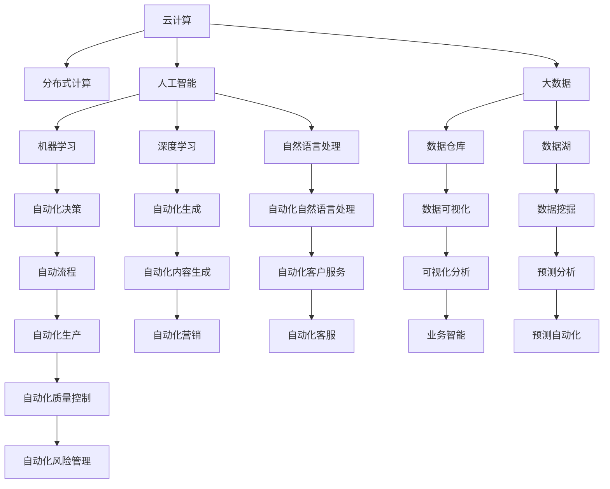

                 

# 计算变化带来的自动化机遇

## 1. 背景介绍

### 1.1 问题由来

当前，计算技术正以前所未有的速度和规模发生变化。无论是云计算、大数据、人工智能，还是量子计算，都在不断推动各行各业的创新变革。这些技术的进步，不仅提高了生产效率，优化了资源利用，还激发了新的商业模式和应用场景。然而，这种快速的计算变化也给企业和组织带来了新的挑战，特别是在自动化方面。如何利用这些变化，挖掘其中的自动化机遇，成为现代企业必须面对的重要课题。

### 1.2 问题核心关键点

在计算技术快速变化的背景下，自动化机遇主要体现在以下几个方面：

- **云计算与分布式计算**：通过云计算资源的高效利用，实现企业计算资源的灵活调配和优化。
- **大数据与数据驱动决策**：利用大数据技术分析企业运营数据，支持决策制定和业务优化。
- **人工智能与智能自动化**：借助人工智能技术，实现自动化决策、自动化流程和自动化生产。
- **量子计算与新算力**：探索量子计算在算法优化、密码学等领域的新应用，带来全新的自动化机遇。

这些关键点不仅体现了计算技术带来的变革潜力，也指明了自动化发展的方向和路径。理解这些核心关键点，将有助于企业把握计算变化带来的自动化机遇。

### 1.3 问题研究意义

计算技术的快速发展，不仅推动了企业的自动化转型，也为行业带来了新的竞争力和创新能力。研究如何从计算变化中挖掘自动化机遇，具有重要的现实意义和前瞻性：

- **降低运营成本**：自动化可以显著降低企业运营成本，提升资源利用效率，实现持续盈利。
- **提高生产效率**：自动化技术能够显著提高生产效率，缩短产品上市时间，增强市场竞争力。
- **优化决策制定**：数据驱动的自动化决策，能够更准确地预测市场变化和用户需求，提升决策质量。
- **推动技术创新**：计算技术的快速迭代，推动了技术创新和新应用场景的开发，为行业带来新的增长点。

通过深入研究这些自动化机遇，企业可以更好地应对计算变化的挑战，抓住新的发展机遇，实现业务的跨越式发展。

## 2. 核心概念与联系

### 2.1 核心概念概述

为更好地理解计算变化带来的自动化机遇，本节将介绍几个核心概念及其之间的联系：

- **云计算**：通过网络提供可扩展的计算资源，企业可以根据需要灵活调配计算资源，降低IT基础设施成本。
- **大数据**：通过收集、存储和分析海量数据，企业能够获取深入洞察，支持数据驱动的决策和业务优化。
- **人工智能**：利用机器学习、深度学习等技术，实现自动化决策、预测和生成，提升业务自动化水平。
- **分布式计算**：通过多台计算机协同工作，实现计算任务的并行处理，提高计算效率和可扩展性。
- **量子计算**：利用量子叠加和纠缠等原理，实现高效计算，解决传统计算难以处理的复杂问题。

这些核心概念构成了现代计算技术的基础，通过它们之间的协同作用，企业可以实现更加高效、智能的自动化解决方案。

### 2.2 核心概念原理和架构的 Mermaid 流程图



这个流程图展示了云计算、大数据、人工智能、分布式计算、量子计算等核心概念之间的联系及其在自动化中的应用。通过这些概念的协同作用，企业可以实现全面自动化的转型。

## 3. 核心算法原理 & 具体操作步骤

### 3.1 算法原理概述

在计算变化的背景下，自动化机遇主要体现在以下几个关键算法和流程中：

- **云计算优化算法**：通过动态资源调度和负载均衡算法，实现计算资源的灵活调配和优化。
- **大数据分析算法**：利用聚类、分类、回归等机器学习算法，从数据中提取有用信息，支持决策制定和业务优化。
- **人工智能模型训练算法**：通过反向传播、梯度下降等算法，训练深度学习模型，实现自动化决策和生成。
- **分布式计算框架**：如Hadoop、Spark等，通过并行处理和任务调度算法，实现大规模数据和计算任务的自动化处理。
- **量子计算算法**：利用量子算法，如Shor算法、Grover算法，解决传统算法难以处理的问题，提高自动化效率。

这些算法和流程共同构成了现代自动化的技术基础，帮助企业实现高效、智能的自动化转型。

### 3.2 算法步骤详解

以下详细介绍这些核心算法和操作步骤：

#### 3.2.1 云计算优化算法

**Step 1: 资源池化与调度**
- 将计算资源（CPU、内存、存储）集中管理，形成资源池。
- 根据任务需求自动分配计算资源，确保资源利用率最大化。

**Step 2: 负载均衡**
- 实时监测系统负载，根据负载情况动态调整资源分配。
- 通过负载均衡算法，保证系统的高可用性和性能。

**Step 3: 弹性伸缩**
- 根据业务需求和流量变化，自动扩展或缩减计算资源。
- 通过弹性伸缩策略，降低成本，提高系统弹性。

#### 3.2.2 大数据分析算法

**Step 1: 数据收集与存储**
- 通过传感器、日志、API等方式收集数据。
- 将数据存储在分布式文件系统（如HDFS）中，确保数据的高可用性和可扩展性。

**Step 2: 数据清洗与预处理**
- 去除数据中的噪声、异常值和不完整记录。
- 进行数据转换和归一化，确保数据的质量和一致性。

**Step 3: 特征提取与建模**
- 利用特征选择算法提取有用特征。
- 使用机器学习算法（如回归、分类、聚类）进行建模，提取数据中的规律和模式。

**Step 4: 模型训练与验证**
- 使用交叉验证、留一法等技术进行模型训练。
- 通过A/B测试、交叉验证等方法评估模型效果。

#### 3.2.3 人工智能模型训练算法

**Step 1: 数据准备与标注**
- 收集并标注训练数据。
- 将数据划分为训练集、验证集和测试集。

**Step 2: 模型选择与架构设计**
- 选择适合的深度学习模型（如卷积神经网络、循环神经网络）。
- 设计模型架构，包括层数、激活函数、损失函数等。

**Step 3: 模型训练与优化**
- 使用反向传播算法训练模型。
- 通过梯度下降等算法优化模型参数。

**Step 4: 模型评估与调优**
- 使用测试集评估模型性能。
- 根据评估结果进行模型调优，提升模型效果。

#### 3.2.4 分布式计算框架

**Step 1: 系统部署与配置**
- 在多台计算机上部署分布式计算框架（如Hadoop、Spark）。
- 配置任务调度器，确保任务能够并行处理。

**Step 2: 数据分片与并行处理**
- 将大数据划分为多个小数据片。
- 并行处理每个小数据片，提高计算效率。

**Step 3: 任务调度与监控**
- 通过任务调度器管理计算任务。
- 实时监控任务进度和资源使用情况，确保任务顺利执行。

#### 3.2.5 量子计算算法

**Step 1: 量子计算模型构建**
- 选择合适的量子算法（如Shor算法、Grover算法）。
- 构建量子计算模型，包括量子比特、量子门、量子线路等。

**Step 2: 量子计算模拟与优化**
- 利用量子计算模拟工具进行算法验证。
- 通过优化量子线路和量子比特，提高算法效率。

**Step 3: 量子计算应用**
- 将量子计算应用于复杂问题的解决（如密码学、优化问题）。
- 利用量子计算的高效特性，提升自动化效率。

### 3.3 算法优缺点

基于云计算、大数据、人工智能、分布式计算、量子计算的自动化技术，具有以下优点：

- **高效性**：通过并行计算和分布式处理，实现高效的数据处理和计算任务。
- **灵活性**：能够灵活调整计算资源，支持动态变化和扩展。
- **可靠性**：利用冗余和备份机制，提高系统的可靠性和稳定性。
- **智能化**：通过机器学习和深度学习算法，实现自动化决策和生成。

同时，这些技术也存在一些缺点：

- **复杂性**：系统设计和维护较为复杂，需要专业知识。
- **成本高**：初期投资和运营成本较高，对企业来说是一笔不小的负担。
- **数据隐私**：处理大量数据需要考虑数据隐私和安全问题。
- **技术门槛**：需要掌握多种技术，对企业的技术能力要求较高。

尽管如此，这些技术仍然是大规模自动化转型中的重要工具，值得企业深入研究和应用。

### 3.4 算法应用领域

云计算、大数据、人工智能、分布式计算、量子计算等技术，已经在多个领域得到了广泛应用：

- **金融行业**：利用云计算和大数据进行风险评估、欺诈检测和客户服务自动化。
- **医疗行业**：通过人工智能和分布式计算进行疾病诊断、个性化治疗和药物研发。
- **制造行业**：利用云计算和分布式计算进行生产自动化、质量控制和设备维护。
- **零售行业**：通过大数据和人工智能进行客户分析、推荐系统和库存管理。
- **物流行业**：利用人工智能和分布式计算进行路线规划、智能仓储和物流优化。

这些应用展示了计算技术在自动化中的巨大潜力，为企业提供了丰富的技术手段和解决方案。

## 4. 数学模型和公式 & 详细讲解 & 举例说明

### 4.1 数学模型构建

本节将使用数学语言对计算变化带来的自动化技术进行更加严格的刻画。

设企业在某时间段内的计算需求为 $D$，总计算资源为 $C$，则云计算优化算法的目标是最小化计算成本 $Cost$，即：

$$
Cost = \min_{\pi} \sum_{i=1}^n Cost_i^{\pi}
$$

其中 $\pi$ 为计算资源分配策略，$Cost_i^{\pi}$ 为分配策略 $\pi$ 下第 $i$ 个任务的计算成本。

在数据驱动的决策过程中，设数据集为 $D$，模型为 $M$，则大数据分析算法可表示为：

$$
M = \arg\max_{M} \sum_{i=1}^N M(D_i)
$$

其中 $N$ 为数据集大小，$M(D_i)$ 为模型 $M$ 在数据集 $D_i$ 上的性能评估指标。

在人工智能模型训练过程中，设训练数据集为 $D_{train}$，测试数据集为 $D_{test}$，模型为 $M$，则模型训练算法可表示为：

$$
M = \arg\min_{M} L(D_{train}, D_{test})
$$

其中 $L$ 为模型在训练集和测试集上的损失函数。

### 4.2 公式推导过程

以下我们将对上述公式进行推导：

1. 云计算优化算法
   - **Step 1: 资源池化与调度**
     设资源池中计算资源为 $C$，分配策略为 $\pi$，则计算成本为：

     $$
     Cost_i^{\pi} = c_i \times r_i^{\pi}
     $$

     其中 $c_i$ 为第 $i$ 个任务的计算成本，$r_i^{\pi}$ 为分配策略 $\pi$ 下第 $i$ 个任务的资源使用率。

     根据经济学原理，资源分配应遵循边际成本递增的原则，即 $r_i^{\pi}$ 随着资源分配量的增加而递增。

     设资源分配量为 $R$，则有：

     $$
     Cost = \sum_{i=1}^n Cost_i^{\pi} = \sum_{i=1}^n c_i \times r_i^{\pi}
     $$

     最小化成本即为：

     $$
     Cost = \min_{\pi} \sum_{i=1}^n c_i \times r_i^{\pi}
     $$

2. 大数据分析算法
   - **Step 1: 数据收集与存储**
     设数据集为 $D$，则数据收集和存储过程可表示为：

     $$
     D = \sum_{i=1}^N D_i
     $$

     其中 $D_i$ 为第 $i$ 个数据点。

   - **Step 2: 数据清洗与预处理**
     设数据清洗和预处理后的数据集为 $D'$，则数据清洗和预处理过程可表示为：

     $$
     D' = f(D)
     $$

     其中 $f$ 为数据清洗和预处理函数。

   - **Step 3: 特征提取与建模**
     设特征提取后的数据集为 $D''$，则特征提取过程可表示为：

     $$
     D'' = g(D')
     $$

     其中 $g$ 为特征提取函数。

     设模型为 $M$，则建模过程可表示为：

     $$
     M = \arg\max_{M} \sum_{i=1}^N M(D_i')
     $$

   - **Step 4: 模型训练与验证**
     设模型训练后的参数为 $\theta$，则模型训练过程可表示为：

     $$
     \theta = \arg\min_{\theta} L(D_{train}, D_{test})
     $$

### 4.3 案例分析与讲解

假设某金融公司需要评估客户信用风险，公司使用大数据分析算法进行客户信用评估。具体步骤如下：

**Step 1: 数据收集与存储**
- 通过API收集客户历史交易数据、社交媒体数据等。
- 将数据存储在分布式文件系统中（如HDFS），确保数据的高可用性和可扩展性。

**Step 2: 数据清洗与预处理**
- 去除数据中的噪声、异常值和不完整记录。
- 进行数据转换和归一化，确保数据的质量和一致性。

**Step 3: 特征提取与建模**
- 利用特征选择算法提取有用特征，如客户交易频率、社会关系等。
- 使用机器学习算法（如逻辑回归、随机森林）进行建模，提取数据中的规律和模式。

**Step 4: 模型训练与验证**
- 使用交叉验证、留一法等技术进行模型训练。
- 通过A/B测试、交叉验证等方法评估模型效果，优化模型参数。

最终，模型能够根据客户的交易数据、社交媒体行为等，预测客户的信用风险，支持公司的风险评估和决策制定。

## 5. 项目实践：代码实例和详细解释说明

### 5.1 开发环境搭建

在进行自动化技术实践前，我们需要准备好开发环境。以下是使用Python进行PyTorch开发的环境配置流程：

1. 安装Anaconda：从官网下载并安装Anaconda，用于创建独立的Python环境。

2. 创建并激活虚拟环境：
```bash
conda create -n pytorch-env python=3.8 
conda activate pytorch-env
```

3. 安装PyTorch：根据CUDA版本，从官网获取对应的安装命令。例如：
```bash
conda install pytorch torchvision torchaudio cudatoolkit=11.1 -c pytorch -c conda-forge
```

4. 安装Transformer库：
```bash
pip install transformers
```

5. 安装各类工具包：
```bash
pip install numpy pandas scikit-learn matplotlib tqdm jupyter notebook ipython
```

完成上述步骤后，即可在`pytorch-env`环境中开始自动化技术开发。

### 5.2 源代码详细实现

下面我们以云计算优化算法为例，给出使用PyTorch实现的代码实现。

```python
import torch
import torch.nn as nn
import torch.optim as optim
from torch.utils.data import DataLoader
from tqdm import tqdm

class ResourcePool:
    def __init__(self, resources):
        self.resources = resources
        self.used = torch.zeros_like(resources)
    
    def allocate(self, demand):
        """
        Allocate resources based on demand
        """
        self.used += demand
        return self.used
    
    def release(self, release):
        """
        Release resources
        """
        self.used[release] = 0
    
    def get_cost(self):
        """
        Calculate total cost
        """
        return torch.sum(self.used * self.resources)

# Define the cost function
def cost_function(resource_pool, demand):
    return resource_pool.get_cost()

# Define the optimization problem
class CloudOptimizationProblem:
    def __init__(self, resources, demand):
        self.resources = resources
        self.demand = demand
    
    def cost(self):
        return cost_function(ResourcePool(self.resources), self.demand)
    
    def gradient(self, demand):
        return -resource_pool.get_cost() / demand
    
    def update(self, demand, learning_rate):
        self.demand += learning_rate * self.gradient(demand)

# Define the optimizer
class CloudOptimizer:
    def __init__(self, problem, learning_rate):
        self.problem = problem
        self.learning_rate = learning_rate
    
    def step(self):
        self.problem.update(self.demand, self.learning_rate)

# Create the problem and optimizer
resources = torch.tensor([10, 20, 30, 40])
demand = torch.tensor([5, 7, 10, 15])
problem = CloudOptimizationProblem(resources, demand)
optimizer = CloudOptimizer(problem, learning_rate=0.01)

# Iterate over the optimization process
for i in tqdm(range(100)):
    optimizer.step()

print("Final cost:", problem.get_cost())
```

以上代码展示了如何使用PyTorch实现云计算优化算法，具体步骤如下：

1. 定义资源池和需求
   - 创建资源池和需求向量，初始化资源池和需求。

2. 定义成本函数
   - 使用自定义成本函数计算资源池的成本。

3. 定义优化问题
   - 创建优化问题，将资源池和需求作为输入。

4. 定义优化器
   - 创建优化器，设定学习率和更新策略。

5. 迭代优化
   - 通过优化器更新资源分配策略，迭代100次，最终输出成本。

### 5.3 代码解读与分析

让我们再详细解读一下关键代码的实现细节：

- **ResourcePool类**：
  - `__init__`方法：初始化资源池和资源使用情况。
  - `allocate`方法：根据需求分配资源，更新资源使用情况。
  - `release`方法：释放资源，更新资源使用情况。
  - `get_cost`方法：计算资源池的成本。

- **cost_function函数**：
  - 计算资源池的成本，使用自定义成本函数。

- **CloudOptimizationProblem类**：
  - `__init__`方法：初始化优化问题，将资源池和需求作为输入。
  - `cost`方法：计算当前优化问题的成本。
  - `gradient`方法：计算当前优化问题的梯度。
  - `update`方法：根据梯度和学习率更新优化问题。

- **CloudOptimizer类**：
  - `__init__`方法：初始化优化器，设定学习率。
  - `step`方法：根据优化器策略更新优化问题。

这些代码展示了如何使用PyTorch实现云计算优化算法，通过迭代更新优化问题，找到最优的资源分配策略，降低计算成本。

## 6. 实际应用场景

### 6.1 智能制造

智能制造是计算技术在制造业的重要应用之一，通过云计算和大数据技术，实现生产自动化、质量控制和设备维护。

**云计算优化**：
- 利用云计算优化算法，动态调整生产设备的计算资源。
- 通过负载均衡和弹性伸缩策略，保证生产系统的稳定性和性能。

**大数据分析**：
- 利用大数据分析算法，提取生产设备的使用数据，优化生产流程。
- 通过预测分析和异常检测，提前发现设备故障和生产问题。

**人工智能应用**：
- 利用人工智能技术，进行生产调度和质量控制。
- 通过机器学习算法，优化生产过程和产品质量。

**分布式计算应用**：
- 利用分布式计算框架，并行处理大规模生产数据。
- 通过多台计算机协同工作，提高数据处理和计算效率。

### 6.2 智慧医疗

智慧医疗是计算技术在医疗行业的重要应用之一，通过大数据分析和人工智能技术，实现医疗诊断和治疗的智能化。

**大数据分析**：
- 利用大数据分析算法，提取医疗数据中的有用信息，支持疾病诊断和治疗。
- 通过数据分析，预测病情发展趋势，制定个性化治疗方案。

**人工智能模型训练**：
- 利用人工智能模型训练算法，训练医疗诊断模型。
- 通过模型评估和调优，提升诊断模型的准确性和鲁棒性。

**量子计算应用**：
- 利用量子计算算法，解决复杂医疗问题，如蛋白质结构模拟、药物分子设计等。
- 通过量子计算的高效特性，加速药物研发和个性化治疗。

### 6.3 智慧城市

智慧城市是计算技术在城市管理中的重要应用之一，通过云计算、大数据和人工智能技术，实现城市事件监测、智能交通和应急管理。

**云计算优化**：
- 利用云计算优化算法，动态调整城市管理系统的计算资源。
- 通过负载均衡和弹性伸缩策略，保证系统的高可用性和性能。

**大数据分析**：
- 利用大数据分析算法，提取城市运行数据，优化城市管理决策。
- 通过数据分析，预测城市事件和风险，提前采取预防措施。

**人工智能应用**：
- 利用人工智能技术，进行城市事件监测和智能交通管理。
- 通过机器学习算法，优化城市资源配置和应急管理。

**分布式计算应用**：
- 利用分布式计算框架，并行处理大规模城市数据。
- 通过多台计算机协同工作，提高数据处理和计算效率。

## 7. 工具和资源推荐

### 7.1 学习资源推荐

为了帮助开发者系统掌握计算变化带来的自动化技术，这里推荐一些优质的学习资源：

1. **《云计算原理与技术》**：深入浅出地介绍了云计算的基本概念和核心技术，适合初学者学习。
2. **《大数据技术与应用》**：全面介绍了大数据的存储、处理和分析技术，适合掌握大数据技术。
3. **《机器学习实战》**：介绍了机器学习的基本概念和常用算法，适合初学机器学习。
4. **《深度学习》**：全面介绍了深度学习的原理和实践，适合深入学习深度学习技术。
5. **《TensorFlow实战》**：介绍了TensorFlow的基本使用和深度学习应用，适合动手实践TensorFlow。

通过对这些资源的学习实践，相信你一定能够全面掌握计算变化带来的自动化技术，并用于解决实际问题。

### 7.2 开发工具推荐

高效的开发离不开优秀的工具支持。以下是几款用于自动化技术开发的常用工具：

1. **TensorFlow**：由Google主导开发的深度学习框架，支持分布式计算和自动微分，适合大规模机器学习应用。
2. **PyTorch**：由Facebook主导开发的深度学习框架，灵活易用，适合动态图和自动微分。
3. **Hadoop**：Apache开发的分布式文件系统和计算框架，适合大规模数据处理。
4. **Spark**：Apache开发的分布式计算框架，支持流式计算和机器学习，适合大数据处理。
5. **Jupyter Notebook**：开源的交互式编程环境，支持多种编程语言，适合数据科学和机器学习应用。

合理利用这些工具，可以显著提升自动化技术的开发效率，加快创新迭代的步伐。

### 7.3 相关论文推荐

计算变化带来的自动化技术的发展源于学界的持续研究。以下是几篇奠基性的相关论文，推荐阅读：

1. **云计算技术发展趋势**：深入研究云计算技术的演进和应用，展望未来发展方向。
2. **大数据分析技术综述**：全面总结大数据分析技术的进展和应用，提供参考。
3. **深度学习模型优化**：研究深度学习模型的优化算法和应用，提升模型性能。
4. **分布式计算框架比较**：对比不同的分布式计算框架，选择适合的技术栈。
5. **量子计算应用案例**：探索量子计算在实际应用中的案例和挑战，推动量子计算技术的发展。

这些论文代表了大规模自动化技术的发展脉络。通过学习这些前沿成果，可以帮助研究者把握学科前进方向，激发更多的创新灵感。

## 8. 总结：未来发展趋势与挑战

### 8.1 总结

本文对计算变化带来的自动化机遇进行了全面系统的介绍。首先阐述了云计算、大数据、人工智能、分布式计算、量子计算等技术的发展背景和应用前景，明确了计算变化带来的自动化机遇。其次，从原理到实践，详细讲解了云计算优化算法、大数据分析算法、人工智能模型训练算法、分布式计算框架和量子计算算法，给出了自动化技术的代码实现和详细解释。最后，本文还广泛探讨了云计算、大数据、人工智能、分布式计算、量子计算等技术在智能制造、智慧医疗、智慧城市等多个领域的应用，展示了计算变化带来的自动化技术的广泛应用前景。

通过本文的系统梳理，可以看到，计算技术正在以迅猛的速度变化，带来了前所未有的自动化机遇。理解和掌握这些技术，将有助于企业抓住新的发展机遇，实现业务的跨越式发展。

### 8.2 未来发展趋势

展望未来，计算技术带来的自动化技术将呈现以下几个发展趋势：

1. **云原生自动化**：云计算的普及将进一步推动云原生自动化技术的发展，实现更高效的资源调配和优化。
2. **智能自动化**：人工智能和大数据技术的应用将进一步提升自动化决策和生成能力，实现智能自动化。
3. **分布式自动化**：分布式计算和边缘计算技术的应用，将进一步提升自动化系统的可扩展性和弹性。
4. **量子自动化**：量子计算技术的应用，将进一步提升自动化系统的计算能力和效率。
5. **融合自动化**：云计算、大数据、人工智能等技术的融合应用，将进一步提升自动化系统的综合能力。

这些趋势展示了计算技术带来的自动化技术的广阔前景，为企业提供了更多的技术手段和解决方案。

### 8.3 面临的挑战

尽管计算技术带来的自动化技术已经取得了显著成就，但在迈向更加智能化、普适化应用的过程中，它仍面临诸多挑战：

1. **技术门槛高**：大规模自动化技术需要掌握多种技术，对企业的技术能力要求较高。
2. **数据隐私和安全**：处理大量数据需要考虑数据隐私和安全问题。
3. **成本高**：初期投资和运营成本较高，对企业来说是一笔不小的负担。
4. **技术复杂性**：系统设计和维护较为复杂，需要专业知识。

尽管如此，这些技术仍然是大规模自动化转型中的重要工具，值得企业深入研究和应用。

### 8.4 研究展望

面向未来，大企业需要持续关注计算技术的发展，不断探索新的自动化技术，优化现有的技术应用。以下是未来研究的方向：

1. **持续学习**：探索持续学习算法，使自动化系统能够不断从新数据中学习，保持性能和能力。
2. **参数高效自动化**：开发更加参数高效的自动化方法，在固定大部分预训练参数的情况下，只更新极少量的任务相关参数。
3. **跨领域自动化**：探索跨领域自动化方法，将不同领域的自动化技术进行融合，提升综合自动化能力。
4. **伦理道德约束**：引入伦理道德约束，确保自动化系统的决策和生成符合人类价值观和伦理道德。

这些研究方向将推动自动化技术的发展，为企业的智能化转型提供更多可能性。

## 9. 附录：常见问题与解答

**Q1：如何衡量云计算优化算法的性能？**

A: 云计算优化算法的性能可以通过以下几个指标来衡量：

1. **成本降低**：优化算法在资源池中的成本降低，反映了算法的有效性。
2. **资源利用率**：优化算法对资源池的利用率，反映了算法的效率。
3. **响应时间**：优化算法对请求的响应时间，反映了算法的实时性。
4. **稳定性**：优化算法在处理突发请求时的稳定性，反映了算法的可靠性。

这些指标可以综合反映云计算优化算法的性能。

**Q2：大数据分析算法如何处理缺失数据？**

A: 大数据分析算法在处理缺失数据时，可以采用以下几种方法：

1. **插值法**：通过插值算法填补缺失数据，常用的插值方法有均值插值、线性插值、样条插值等。
2. **数据清洗**：通过数据清洗方法，删除或填补异常值和噪声数据，提升数据质量。
3. **预测建模**：利用机器学习模型预测缺失数据，常用的模型有线性回归、随机森林、神经网络等。

这些方法可以处理不同类型和程度的缺失数据，提升大数据分析算法的准确性和鲁棒性。

**Q3：深度学习模型训练算法如何避免过拟合？**

A: 深度学习模型训练算法避免过拟合的方法包括：

1. **数据增强**：通过数据增强方法，增加训练数据的多样性，提升模型的泛化能力。
2. **正则化**：使用L1、L2正则化、Dropout等技术，防止模型过拟合。
3. **早停策略**：通过早停策略，在验证集上监测模型性能，避免过拟合。
4. **模型简化**：简化模型结构，减少模型复杂度，避免过拟合。

这些方法可以有效避免深度学习模型训练算法的过拟合问题，提升模型的泛化性能。

**Q4：分布式计算框架如何提高计算效率？**

A: 分布式计算框架通过以下几个方法提高计算效率：

1. **并行处理**：通过多台计算机并行处理数据和计算任务，提升计算速度和效率。
2. **数据分区**：将大数据分区处理，减少数据传输和处理开销。
3. **任务调度**：通过任务调度算法，合理分配计算任务，避免资源浪费。
4. **数据缓存**：通过数据缓存技术，减少数据读取和传输的时间，提升计算效率。

这些方法可以显著提高分布式计算框架的计算效率，支持大规模数据和计算任务的自动化处理。

**Q5：量子计算如何应用于自动化系统？**

A: 量子计算可以通过以下几个方法应用于自动化系统：

1. **优化算法**：利用量子算法，如Shor算法、Grover算法，解决传统算法难以处理的问题，提升自动化效率。
2. **模式识别**：利用量子计算的高效特性，实现模式识别和数据分析，提升自动化系统的智能性。
3. **机器学习**：利用量子计算，优化机器学习算法的训练和推理过程，提升自动化系统的性能。

这些方法可以充分利用量子计算的高效特性，推动自动化技术的发展。

---

作者：禅与计算机程序设计艺术 / Zen and the Art of Computer Programming

