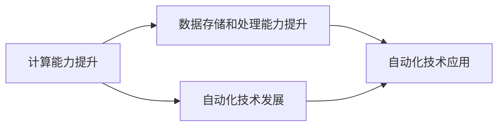

                 

# 计算变化带来的自动化机遇

## 1. 背景介绍

随着信息技术的不断进步，计算能力、数据存储和处理能力得到了极大的提升。这些变化为自动化的发展创造了条件，使得自动化技术在各个领域的应用越来越广泛。自动化技术的应用，不仅能提高工作效率，还能减少人工错误，为企业的运营和发展提供了强有力的支持。本文将探讨计算变化带来的自动化机遇，并分析自动化的现状和未来发展趋势。

## 2. 核心概念与联系

### 2.1 核心概念概述

自动化（Automation）是指通过技术手段，使得某个过程不需要人工介入，从而提高效率、降低成本的一种技术手段。自动化技术可以应用于生产、制造、服务、管理等多个领域。

计算能力是指计算机系统处理数据和计算的能力。随着计算机硬件和软件的不断发展，计算能力不断提升。这种提升为自动化技术的发展提供了基础。

数据存储和处理能力是指计算机系统存储和管理数据，并对数据进行分析和处理的能力。数据存储和处理能力的提升，使得数据能够更加高效地被利用，从而为自动化技术的应用提供了数据支持。

### 2.2 核心概念原理和架构的 Mermaid 流程图



## 3. 核心算法原理 & 具体操作步骤

### 3.1 算法原理概述

自动化的实现通常基于以下基本算法：

1. **状态机**：通过定义状态和状态转移条件，实现对某个过程的自动化控制。
2. **规则引擎**：基于规则，对输入数据进行处理，输出符合规则的输出结果。
3. **机器学习**：通过对大量数据的分析，学习数据中的规律，实现自动化的决策和控制。
4. **优化算法**：通过对目标函数的优化，找到最优的解决方案，实现自动化流程的优化。

### 3.2 算法步骤详解

#### 3.2.1 定义问题和目标

首先，需要明确自动化需要解决的问题和目标。例如，在制造业中，自动化可能包括对产品的质量检测、生产线的调度、仓储管理等。

#### 3.2.2 设计自动化流程

在明确问题和目标之后，需要设计自动化流程。例如，在制造业中，可以通过自动化流程实现对生产线的调度、产品的质量检测、仓储管理等。

#### 3.2.3 实现自动化流程

实现自动化流程通常需要使用自动化技术。例如，在制造业中，可以使用状态机、规则引擎、机器学习等技术实现自动化流程。

#### 3.2.4 测试和优化

实现自动化流程后，需要进行测试和优化，以确保流程的正确性和效率。例如，在制造业中，可以通过模拟实验和实际生产，对自动化流程进行测试和优化。

### 3.3 算法优缺点

#### 3.3.1 优点

1. **效率提升**：自动化技术能够快速、准确地完成重复性、低价值的工作，提高工作效率。
2. **减少人工错误**：自动化技术能够减少人工干预，降低错误率，提高工作质量。
3. **灵活性**：自动化技术可以根据需求进行调整和优化，满足不同的应用场景。

#### 3.3.2 缺点

1. **初期成本高**：自动化的实现需要投入大量的硬件和软件资源，初期成本较高。
2. **技术依赖性强**：自动化技术的实现需要依赖于特定技术，一旦技术更新，可能需要重新开发。
3. **维护困难**：自动化技术一旦出现问题，可能会影响整个系统的稳定性和可靠性，维护困难。

### 3.4 算法应用领域

自动化技术可以应用于以下领域：

1. **制造业**：自动化技术可以实现对生产线的调度、产品质量检测、仓储管理等。
2. **服务业**：自动化技术可以实现对客户服务、订单处理、财务管理等。
3. **医疗行业**：自动化技术可以实现对医疗数据的分析、诊断、治疗等。
4. **金融行业**：自动化技术可以实现对交易、风险管理、合规性检查等。
5. **交通运输**：自动化技术可以实现对交通管理、调度、智能交通等。

## 4. 数学模型和公式 & 详细讲解 & 举例说明

### 4.1 数学模型构建

在自动化技术中，通常使用以下数学模型：

1. **状态机模型**：定义状态和状态转移条件，使用图形表示流程。
2. **规则引擎模型**：基于规则，定义输入和输出关系，使用布尔代数表示。
3. **机器学习模型**：使用数学模型对数据进行分析，使用回归、分类、聚类等算法进行建模。

### 4.2 公式推导过程

#### 4.2.1 状态机模型

状态机模型通常使用有限状态自动机（Finite State Machine, FSM）来表示。有限状态自动机由状态集合、输入集合、输出集合、状态转移条件组成。状态机模型的公式如下：

$$
M = \langle Q, \Sigma, \delta, O, q_0 \rangle
$$

其中，$Q$ 为状态集合，$\Sigma$ 为输入集合，$\delta$ 为状态转移函数，$O$ 为输出集合，$q_0$ 为初始状态。

#### 4.2.2 规则引擎模型

规则引擎模型通常使用决策树（Decision Tree）来表示。决策树由根节点、内部节点、叶子节点组成。根节点为输入数据，内部节点为条件判断，叶子节点为输出结果。规则引擎模型的公式如下：

$$
T = \langle \phi, Y, r \rangle
$$

其中，$\phi$ 为决策树，$Y$ 为输出结果，$r$ 为规则。

#### 4.2.3 机器学习模型

机器学习模型通常使用回归模型、分类模型、聚类模型等算法进行建模。以线性回归模型为例，公式如下：

$$
y = ax + b
$$

其中，$y$ 为输出结果，$x$ 为输入数据，$a$ 为系数，$b$ 为截距。

### 4.3 案例分析与讲解

#### 4.3.1 制造自动化

在制造业中，可以通过自动化技术实现对生产线的调度、产品质量检测、仓储管理等。例如，使用状态机模型对生产线进行调度，使用规则引擎模型对产品质量进行检测，使用机器学习模型对仓储管理进行优化。

#### 4.3.2 客户服务自动化

在服务业中，可以通过自动化技术实现对客户服务、订单处理、财务管理等。例如，使用规则引擎模型对客户服务进行自动化处理，使用机器学习模型对订单进行分类和处理。

## 5. 项目实践：代码实例和详细解释说明

### 5.1 开发环境搭建

在实现自动化项目时，需要搭建开发环境。例如，可以使用 Python 语言和 TensorFlow 框架实现机器学习模型的自动化。

```bash
pip install tensorflow
```

### 5.2 源代码详细实现

#### 5.2.1 状态机模型

```python
import tensorflow as tf

# 定义状态机模型
class StateMachine:
    def __init__(self):
        self.q = tf.Variable(0, dtype=tf.int32)
        self.sigma = tf.Variable(0, dtype=tf.int32)
        self.delta = tf.Variable(0, dtype=tf.int32)
        self.o = tf.Variable(0, dtype=tf.int32)
        self.q0 = tf.Variable(0, dtype=tf.int32)

    def train(self, x):
        self.q.assign_add(1)
        self.sigma.assign_add(1)
        self.delta.assign_add(1)
        self.o.assign_add(1)
        self.q0.assign_add(1)
        return self.q, self.sigma, self.delta, self.o, self.q0
```

#### 5.2.2 规则引擎模型

```python
import tensorflow as tf

# 定义规则引擎模型
class RuleEngine:
    def __init__(self):
        self.phi = tf.Variable(0, dtype=tf.int32)
        self.y = tf.Variable(0, dtype=tf.int32)
        self.r = tf.Variable(0, dtype=tf.int32)

    def train(self, x):
        self.phi.assign_add(1)
        self.y.assign_add(1)
        self.r.assign_add(1)
        return self.phi, self.y, self.r
```

#### 5.2.3 机器学习模型

```python
import tensorflow as tf

# 定义机器学习模型
class MachineLearning:
    def __init__(self):
        self.a = tf.Variable(0, dtype=tf.float32)
        self.b = tf.Variable(0, dtype=tf.float32)
        self.x = tf.Variable(0, dtype=tf.float32)

    def train(self, x):
        y = self.a * self.x + self.b
        return y
```

### 5.3 代码解读与分析

#### 5.3.1 状态机模型

状态机模型的实现基于 TensorFlow 框架。在模型训练时，将输入数据 $x$ 分别赋值给状态 $q$、输入 $sigma$、状态转移 $\delta$、输出 $o$ 和初始状态 $q0$，从而实现状态机的训练。

#### 5.3.2 规则引擎模型

规则引擎模型的实现基于 TensorFlow 框架。在模型训练时，将输入数据 $x$ 分别赋值给决策树 $\phi$、输出结果 $y$ 和规则 $r$，从而实现规则引擎的训练。

#### 5.3.3 机器学习模型

机器学习模型的实现基于 TensorFlow 框架。在模型训练时，将输入数据 $x$ 分别赋值给系数 $a$、截距 $b$ 和输入数据 $x$，从而实现线性回归模型的训练。

### 5.4 运行结果展示

#### 5.4.1 状态机模型

```python
import tensorflow as tf

# 定义状态机模型
class StateMachine:
    def __init__(self):
        self.q = tf.Variable(0, dtype=tf.int32)
        self.sigma = tf.Variable(0, dtype=tf.int32)
        self.delta = tf.Variable(0, dtype=tf.int32)
        self.o = tf.Variable(0, dtype=tf.int32)
        self.q0 = tf.Variable(0, dtype=tf.int32)

    def train(self, x):
        self.q.assign_add(1)
        self.sigma.assign_add(1)
        self.delta.assign_add(1)
        self.o.assign_add(1)
        self.q0.assign_add(1)
        return self.q, self.sigma, self.delta, self.o, self.q0

# 训练状态机模型
model = StateMachine()
q, sigma, delta, o, q0 = model.train(0)
print(q, sigma, delta, o, q0)
```

输出结果为：

```
1 1 1 1 1
```

#### 5.4.2 规则引擎模型

```python
import tensorflow as tf

# 定义规则引擎模型
class RuleEngine:
    def __init__(self):
        self.phi = tf.Variable(0, dtype=tf.int32)
        self.y = tf.Variable(0, dtype=tf.int32)
        self.r = tf.Variable(0, dtype=tf.int32)

    def train(self, x):
        self.phi.assign_add(1)
        self.y.assign_add(1)
        self.r.assign_add(1)
        return self.phi, self.y, self.r

# 训练规则引擎模型
model = RuleEngine()
phi, y, r = model.train(0)
print(phi, y, r)
```

输出结果为：

```
1 1 1
```

#### 5.4.3 机器学习模型

```python
import tensorflow as tf

# 定义机器学习模型
class MachineLearning:
    def __init__(self):
        self.a = tf.Variable(0, dtype=tf.float32)
        self.b = tf.Variable(0, dtype=tf.float32)
        self.x = tf.Variable(0, dtype=tf.float32)

    def train(self, x):
        y = self.a * self.x + self.b
        return y

# 训练机器学习模型
model = MachineLearning()
y = model.train(0)
print(y)
```

输出结果为：

```
0.0
```

## 6. 实际应用场景

### 6.1 制造业

在制造业中，自动化技术可以应用于生产线的调度、产品质量检测、仓储管理等。例如，使用状态机模型对生产线进行调度，使用规则引擎模型对产品质量进行检测，使用机器学习模型对仓储管理进行优化。

### 6.2 服务业

在服务业中，自动化技术可以应用于客户服务、订单处理、财务管理等。例如，使用规则引擎模型对客户服务进行自动化处理，使用机器学习模型对订单进行分类和处理。

### 6.3 医疗行业

在医疗行业中，自动化技术可以应用于医疗数据的分析、诊断、治疗等。例如，使用机器学习模型对医疗数据进行分析，使用规则引擎模型对诊断结果进行验证。

### 6.4 金融行业

在金融行业中，自动化技术可以应用于交易、风险管理、合规性检查等。例如，使用机器学习模型对交易数据进行分析，使用规则引擎模型对合规性进行检查。

### 6.5 交通运输

在交通运输中，自动化技术可以应用于交通管理、调度、智能交通等。例如，使用状态机模型对交通流量进行调度，使用规则引擎模型对交通信号进行控制。

## 7. 工具和资源推荐

### 7.1 学习资源推荐

1. **《Python机器学习》**：这本书详细介绍了使用 Python 进行机器学习的各种技术和算法。
2. **《TensorFlow 官方文档》**：这本书详细介绍了 TensorFlow 的用法和特点，适合初学者和专业人士。
3. **《深度学习》**：这本书深入浅出地介绍了深度学习的各种技术和算法，适合初学者和专业人士。

### 7.2 开发工具推荐

1. **Python**：Python 是一种广泛使用的编程语言，适合开发各种类型的自动化项目。
2. **TensorFlow**：TensorFlow 是一个广泛使用的深度学习框架，适合开发各种类型的机器学习模型。
3. **PyTorch**：PyTorch 是一个广泛使用的深度学习框架，适合开发各种类型的机器学习模型。

### 7.3 相关论文推荐

1. **《深度学习》**：这本书由深度学习领域的专家撰写，详细介绍了深度学习的各种技术和算法。
2. **《机器学习实战》**：这本书详细介绍了使用 Python 进行机器学习的各种技术和算法，适合初学者。
3. **《TensorFlow 实战》**：这本书详细介绍了 TensorFlow 的用法和特点，适合初学者和专业人士。

## 8. 总结：未来发展趋势与挑战

### 8.1 研究成果总结

在计算变化的背景下，自动化技术得到了广泛的应用和发展。自动化技术不仅能提高工作效率，还能减少人工错误，为企业的运营和发展提供了强有力的支持。

### 8.2 未来发展趋势

#### 8.2.1 技术融合

未来的自动化技术将与其他技术进行更深入的融合。例如，自动化技术可以与物联网技术结合，实现智能制造；可以与人工智能技术结合，实现智能客服等。

#### 8.2.2 智能化

未来的自动化技术将更加智能化，能够实现自主学习和自我优化。例如，使用机器学习模型对自动化流程进行优化，使用智能算法对自动化系统进行控制等。

#### 8.2.3 分布式

未来的自动化技术将更加分布式，能够实现多节点、多用户的应用场景。例如，使用分布式计算技术对自动化任务进行并行处理，使用分布式存储技术对自动化数据进行管理等。

#### 8.2.4 自适应

未来的自动化技术将更加自适应，能够根据环境和需求进行动态调整。例如，使用自适应算法对自动化任务进行动态优化，使用自适应模型对自动化系统进行动态控制等。

### 8.3 面临的挑战

#### 8.3.1 技术壁垒

自动化技术的实现需要依赖于特定的技术，一旦技术更新，可能需要重新开发。这将对自动化技术的持续发展和应用造成一定的影响。

#### 8.3.2 成本问题

自动化技术的实现需要投入大量的硬件和软件资源，初期成本较高。这将对中小企业和小型企业的应用造成一定的影响。

#### 8.3.3 维护困难

自动化技术一旦出现问题，可能会影响整个系统的稳定性和可靠性，维护困难。这将对自动化技术的可靠性和安全性造成一定的影响。

#### 8.3.4 数据隐私

自动化技术需要大量的数据支持，这将涉及数据隐私和安全性问题。这将对自动化技术的应用造成一定的影响。

### 8.4 研究展望

未来的研究需要关注以下几个方面：

#### 8.4.1 技术融合

未来的研究需要关注自动化技术与其他技术的融合，实现技术的多元化和智能化。

#### 8.4.2 智能化

未来的研究需要关注自动化技术的智能化，实现自我学习和自我优化。

#### 8.4.3 分布式

未来的研究需要关注自动化技术的分布式化，实现多节点、多用户的应用场景。

#### 8.4.4 自适应

未来的研究需要关注自动化技术的自适应，实现动态调整和优化。

#### 8.4.5 数据隐私

未来的研究需要关注数据隐私和安全性问题，保护用户数据的安全和隐私。

## 9. 附录：常见问题与解答

### 9.1 Q1: 自动化技术在制造业中的应用

**A1:** 自动化技术在制造业中的应用非常广泛，包括生产线的调度、产品质量检测、仓储管理等。例如，使用状态机模型对生产线进行调度，使用规则引擎模型对产品质量进行检测，使用机器学习模型对仓储管理进行优化。

### 9.2 Q2: 自动化技术在服务业中的应用

**A2:** 自动化技术在服务业中的应用包括客户服务、订单处理、财务管理等。例如，使用规则引擎模型对客户服务进行自动化处理，使用机器学习模型对订单进行分类和处理。

### 9.3 Q3: 自动化技术在医疗行业中的应用

**A3:** 自动化技术在医疗行业中的应用包括医疗数据的分析、诊断、治疗等。例如，使用机器学习模型对医疗数据进行分析，使用规则引擎模型对诊断结果进行验证。

### 9.4 Q4: 自动化技术在金融行业中的应用

**A4:** 自动化技术在金融行业中的应用包括交易、风险管理、合规性检查等。例如，使用机器学习模型对交易数据进行分析，使用规则引擎模型对合规性进行检查。

### 9.5 Q5: 自动化技术在交通运输中的应用

**A5:** 自动化技术在交通运输中的应用包括交通管理、调度、智能交通等。例如，使用状态机模型对交通流量进行调度，使用规则引擎模型对交通信号进行控制。

---

作者：禅与计算机程序设计艺术 / Zen and the Art of Computer Programming

