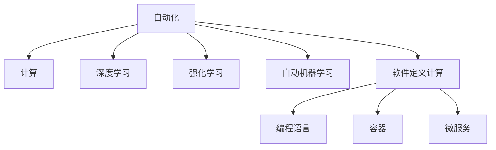

                 

# 计算本质的变化与自动化进展

## 1. 背景介绍

### 1.1 问题由来

随着计算机技术和信息技术的不断进步，计算的本质发生了深刻的变化，计算已经从传统的基于硬件的指令执行，逐渐向软件定义的自动化流程演进。这一变化，不仅显著提高了计算的效率，也极大地促进了科学、工程和社会领域的创新。在科技革命的背景下，自动化技术正在以肉眼可见的速度改变世界，人们开始广泛思考其未来趋势和所面临的挑战。

### 1.2 问题核心关键点

在当前的技术浪潮中，计算和自动化领域的主要趋势包括：
- **自动化进程的加速**：随着AI和机器学习的崛起，自动化技术的应用范围和深度不断扩展，从而进一步推动计算的智能化。
- **计算平台的变革**：云计算、边缘计算、量子计算等新型计算架构的兴起，提供了全新的计算资源和能力。
- **算法的革新**：深度学习、强化学习、自动机器学习等新型算法技术的广泛应用，使得算法变得更加高效和灵活。
- **软件定义的计算**：以编程语言、容器、微服务为代表的软件定义计算方法，正在逐步替代传统的硬件指令执行模式。

这些趋势共同塑造了计算和自动化的新面貌，并将在未来进一步深刻影响人类社会。因此，深入理解这些变化，探讨其潜在影响，对科技界和业界人士至关重要。

## 2. 核心概念与联系

### 2.1 核心概念概述

为了更好地理解计算本质的变化和自动化的进展，本节将介绍几个核心概念：

- **自动化(Automation)**：指利用技术手段代替人工操作的过程，提高生产效率和工作质量。
- **计算(Computation)**：指使用物理或软件系统执行特定任务的过程，计算能力是自动化技术的基础。
- **软件定义计算(Software-Defined Computation)**：指计算过程由软件而非硬件控制，软件通过抽象、封装、编程等手段定义计算资源和计算过程，提高了计算的灵活性和效率。
- **深度学习(Deep Learning)**：一种基于神经网络的学习技术，通过多层非线性变换实现对复杂模式的识别和预测。
- **强化学习(Reinforcement Learning)**：通过试错学习，最大化某个目标函数，广泛应用于游戏、控制等领域。
- **自动机器学习(Automatic Machine Learning)**：指利用自动化工具，自动搜索和选择最佳模型和参数的技术。

这些核心概念之间的逻辑关系可以通过以下Mermaid流程图来展示：



这个流程图展示了一系列核心概念及其之间的关系：

1. 自动化利用计算能力提高生产效率。
2. 深度学习和强化学习等新型算法技术，提升了计算的智能化水平。
3. 自动机器学习和软件定义计算，进一步增强了计算的自动化程度。
4. 编程语言、容器、微服务等软件工具，支撑了更高层次的自动化。

这些概念共同构成了计算和自动化的技术框架，为理解其发展提供了必要的背景知识。

## 3. 核心算法原理 & 具体操作步骤

### 3.1 算法原理概述

计算和自动化的自动化范式，本质上是将复杂的计算任务，通过算法和程序封装为自动化流程，由计算机自动执行的过程。以深度学习为例，其核心思想是通过多层神经网络，自动提取数据中的特征和模式，从而实现对输入数据的预测和分类。在算法上，深度学习模型通常包括卷积神经网络(CNN)、循环神经网络(RNN)、长短时记忆网络(LSTM)等。

### 3.2 算法步骤详解

深度学习的具体步骤如下：

**Step 1: 数据准备**
- 收集和预处理训练数据，确保数据的质量和多样性。
- 将数据分为训练集、验证集和测试集，用于模型训练、调优和性能评估。

**Step 2: 模型构建**
- 选择合适的神经网络结构，如卷积神经网络、循环神经网络等。
- 定义损失函数和优化器，如交叉熵损失、Adam优化器等。
- 设置超参数，如学习率、批大小、迭代轮数等。

**Step 3: 模型训练**
- 在训练集上使用前向传播和反向传播算法，更新模型参数。
- 周期性在验证集上评估模型性能，根据性能指标调整模型参数。
- 重复上述步骤直至满足预设的迭代轮数或性能指标。

**Step 4: 模型评估与部署**
- 在测试集上评估模型性能，计算模型的准确率、召回率、F1分数等指标。
- 将训练好的模型封装为可部署的应用，如RESTful API、微服务等。
- 定期更新模型，加入新的数据和算法改进，保持模型的性能和稳定性。

### 3.3 算法优缺点

深度学习的优点包括：
- **高精度**：深度神经网络能够学习复杂模式，预测精度高。
- **自动化**：自动化的特征提取和模式识别，减少了人工干预。
- **泛化能力强**：经过大量数据训练，模型能够对新数据进行有效预测。

深度学习的缺点包括：
- **需要大量数据**：模型训练需要大量的标注数据，数据获取和标注成本高。
- **计算资源消耗大**：深度学习模型的计算复杂度高，训练和推理资源消耗大。
- **模型可解释性差**：深度模型如同"黑盒"，难以解释其内部工作机制。

这些优缺点共同构成了深度学习的技术特点，也是未来研究的关键方向。

### 3.4 算法应用领域

深度学习在多个领域得到了广泛应用，例如：

- **计算机视觉**：图像识别、物体检测、人脸识别等任务。
- **自然语言处理**：文本分类、情感分析、机器翻译等任务。
- **语音识别**：自动语音识别、语音合成等任务。
- **推荐系统**：个性化推荐、商品推荐等任务。
- **医疗诊断**：疾病诊断、图像分析等任务。
- **金融分析**：风险评估、交易策略等任务。
- **游戏与机器人**：自动游戏、机器人控制等任务。

## 4. 数学模型和公式 & 详细讲解 & 举例说明

### 4.1 数学模型构建

深度学习模型的数学模型主要由以下几部分组成：

- **输入层**：接收输入数据，将数据转换为网络可处理的形式。
- **隐藏层**：通过非线性变换提取数据特征，每个隐藏层包括多个神经元。
- **输出层**：根据任务需求，输出预测结果。

以最简单的全连接神经网络为例，其数学模型如下：

$$
y = W^T \cdot x + b
$$

其中，$W$ 为权重矩阵，$b$ 为偏置向量，$x$ 为输入向量，$y$ 为输出向量。

### 4.2 公式推导过程

深度学习的核心是反向传播算法，其推导过程如下：

假设输出层有 $n$ 个神经元，输入为 $x$，权重矩阵为 $W$，偏置向量为 $b$。则输出层的前向传播公式为：

$$
y = W^T \cdot x + b
$$

设输出层神经元的实际输出为 $\hat{y}_i$，期望输出为 $y_i$，则误差平方和公式为：

$$
J = \frac{1}{2} \sum_{i=1}^n (\hat{y}_i - y_i)^2
$$

其中，$J$ 为均方误差。

对权重矩阵 $W$ 和偏置向量 $b$ 求偏导数，得到：

$$
\frac{\partial J}{\partial W} = \frac{\partial \sum_{i=1}^n (\hat{y}_i - y_i)^2}{\partial W}
$$
$$
\frac{\partial J}{\partial b} = \frac{\partial \sum_{i=1}^n (\hat{y}_i - y_i)^2}{\partial b}
$$

利用链式法则和误差传播，可以得到反向传播算法的更新公式：

$$
W_{new} = W - \eta \frac{\partial J}{\partial W}
$$
$$
b_{new} = b - \eta \frac{\partial J}{\partial b}
$$

其中，$\eta$ 为学习率。

### 4.3 案例分析与讲解

以图像分类任务为例，假设输入为一张28x28的灰度图像 $x$，输出为10个类别的概率分布 $y$。通过3个隐藏层和softmax激活函数，神经网络的输出公式为：

$$
y = W^T \cdot tanh(W_1^T \cdot tanh(W_2^T \cdot tanh(W_3^T \cdot x + b_3) + b_2) + b_1)
$$

假设网络已训练完毕，输入一张测试图像 $x_{test}$，通过前向传播得到输出 $y_{test}$。计算 $y_{test}$ 与真实标签 $y_{true}$ 的交叉熵损失：

$$
L = -\sum_{i=1}^{10} y_i \log(y_{test,i})
$$

通过反向传播更新模型参数，使得 $L$ 最小化，从而提高模型对新图像的分类能力。

## 5. 项目实践：代码实例和详细解释说明

### 5.1 开发环境搭建

在进行深度学习项目实践前，我们需要准备好开发环境。以下是使用Python进行PyTorch开发的环境配置流程：

1. 安装Anaconda：从官网下载并安装Anaconda，用于创建独立的Python环境。

2. 创建并激活虚拟环境：
```bash
conda create -n pytorch-env python=3.8 
conda activate pytorch-env
```

3. 安装PyTorch：根据CUDA版本，从官网获取对应的安装命令。例如：
```bash
conda install pytorch torchvision torchaudio cudatoolkit=11.1 -c pytorch -c conda-forge
```

4. 安装各类工具包：
```bash
pip install numpy pandas scikit-learn matplotlib tqdm jupyter notebook ipython
```

完成上述步骤后，即可在`pytorch-env`环境中开始深度学习项目实践。

### 5.2 源代码详细实现

这里我们以图像分类任务为例，给出使用PyTorch进行卷积神经网络(CNN)的代码实现。

```python
import torch
import torch.nn as nn
import torch.optim as optim
from torch.utils.data import DataLoader
import torchvision.transforms as transforms
import torchvision.datasets as datasets

class CNNModel(nn.Module):
    def __init__(self):
        super(CNNModel, self).__init__()
        self.conv1 = nn.Conv2d(1, 32, kernel_size=3, stride=1, padding=1)
        self.relu1 = nn.ReLU()
        self.pool1 = nn.MaxPool2d(kernel_size=2, stride=2)
        self.conv2 = nn.Conv2d(32, 64, kernel_size=3, stride=1, padding=1)
        self.relu2 = nn.ReLU()
        self.pool2 = nn.MaxPool2d(kernel_size=2, stride=2)
        self.fc1 = nn.Linear(7*7*64, 1024)
        self.relu3 = nn.ReLU()
        self.fc2 = nn.Linear(1024, 10)

    def forward(self, x):
        x = self.conv1(x)
        x = self.relu1(x)
        x = self.pool1(x)
        x = self.conv2(x)
        x = self.relu2(x)
        x = self.pool2(x)
        x = x.view(-1, 7*7*64)
        x = self.fc1(x)
        x = self.relu3(x)
        x = self.fc2(x)
        return x

# 训练函数
def train(model, train_loader, device, optimizer, epoch, criterion):
    model.train()
    for batch_idx, (data, target) in enumerate(train_loader):
        data, target = data.to(device), target.to(device)
        optimizer.zero_grad()
        output = model(data)
        loss = criterion(output, target)
        loss.backward()
        optimizer.step()
        if batch_idx % 100 == 0:
            print('Train Epoch: {} [{}/{} ({:.0f}%)]\tLoss: {:.6f}'.format(
                epoch, batch_idx * len(data), len(train_loader.dataset),
                100. * batch_idx / len(train_loader), loss.item()))

# 评估函数
def evaluate(model, test_loader, device, criterion):
    model.eval()
    test_loss = 0
    correct = 0
    with torch.no_grad():
        for data, target in test_loader:
            data, target = data.to(device), target.to(device)
            output = model(data)
            test_loss += criterion(output, target).item()
            pred = output.argmax(dim=1, keepdim=True)
            correct += pred.eq(target.view_as(pred)).sum().item()
    test_loss /= len(test_loader.dataset)
    print('\nTest set: Average loss: {:.4f}, Accuracy: {}/{} ({:.0f}%)\n'.format(
        test_loss, correct, len(test_loader.dataset),
        100. * correct / len(test_loader.dataset)))

# 测试代码
batch_size = 64
train_dataset = datasets.CIFAR10(root='./data', train=True, transform=transforms.ToTensor(), download=True)
test_dataset = datasets.CIFAR10(root='./data', train=False, transform=transforms.ToTensor())

train_loader = DataLoader(train_dataset, batch_size=batch_size, shuffle=True)
test_loader = DataLoader(test_dataset, batch_size=batch_size, shuffle=False)

device = torch.device('cuda' if torch.cuda.is_available() else 'cpu')
model = CNNModel().to(device)
optimizer = optim.SGD(model.parameters(), lr=0.001, momentum=0.9)
criterion = nn.CrossEntropyLoss()

for epoch in range(10):
    train(model, train_loader, device, optimizer, epoch, criterion)
    evaluate(model, test_loader, device, criterion)
```

### 5.3 代码解读与分析

让我们再详细解读一下关键代码的实现细节：

**CNNModel类**：
- `__init__`方法：定义卷积神经网络的结构。
- `forward`方法：实现前向传播，计算输出。

**train函数**：
- 将模型置于训练模式，对每个批次的数据进行前向传播和反向传播，更新模型参数。
- 在训练集上循环迭代，每轮100次输出训练进度和损失。

**evaluate函数**：
- 将模型置于评估模式，对测试集数据进行前向传播，计算损失和精度。

**测试代码**：
- 加载CIFAR-10数据集。
- 将模型和数据加载到GPU上。
- 使用SGD优化器，进行10轮训练，并在测试集上评估模型性能。

以上代码实现了CNN模型的基本功能，包括了模型的定义、前向传播、训练和评估等核心环节。PyTorch的强大框架使得模型的构建和训练变得简洁高效。

## 6. 实际应用场景

### 6.1 智能交通系统

深度学习和自动化技术在智能交通系统中具有广阔的应用前景。智能交通系统能够通过实时感知、分析、预测和控制，提升交通流的效率和安全性。

**自动驾驶**：通过卷积神经网络对摄像头采集的图像进行实时分析，识别交通标志、行人、车辆等元素，生成决策路径。

**交通流量预测**：利用递归神经网络对历史交通流量数据进行建模，预测未来的交通流量变化。

**智能交通信号控制**：通过强化学习优化信号灯控制策略，提高交通流量控制效果。

### 6.2 医疗健康

深度学习和自动化技术在医疗健康领域的应用也日益增多，为诊断、治疗和健康管理带来了新的希望。

**医学影像诊断**：通过卷积神经网络对CT、MRI等医学影像进行分类和分割，辅助医生进行诊断。

**病理学分析**：利用深度学习对病理切片进行图像分析，识别出癌细胞、肿瘤等异常区域。

**个性化医疗**：通过深度学习对患者的基因组数据进行分析，提供个性化的治疗方案和健康建议。

### 6.3 金融领域

深度学习和自动化技术在金融领域也有广泛的应用，特别是在风险管理和交易策略等方面。

**风险评估**：通过深度学习模型对客户行为和市场数据进行分析，预测信用风险和市场波动。

**交易策略**：利用深度学习进行高频交易和算法交易，优化投资组合。

**量化分析**：通过深度学习对历史数据进行建模，预测股票价格变化。

### 6.4 未来应用展望

未来，随着计算和自动化的进一步发展，深度学习技术将得到更广泛的应用：

- **多模态计算**：结合视觉、听觉、文本等多模态数据，构建更加智能的系统。
- **实时计算**：实现边缘计算和云边缘计算的结合，实现实时数据处理和决策。
- **自适应学习**：利用自适应学习算法，实时调整模型参数，适应数据的变化。
- **自动化运维**：通过自动化运维工具，实现模型的自动部署和监控，降低运维成本。
- **隐私保护**：利用差分隐私、联邦学习等技术，保护数据隐私和安全。

这些发展趋势将进一步推动计算和自动化的应用深度和广度，为各行各业带来新的突破。

## 7. 工具和资源推荐

### 7.1 学习资源推荐

为了帮助开发者系统掌握深度学习和自动化的理论基础和实践技巧，这里推荐一些优质的学习资源：

1. **Deep Learning Specialization**：由Andrew Ng教授主讲的深度学习课程，详细讲解了深度学习的理论基础和应用技巧。

2. **CS231n：Convolutional Neural Networks for Visual Recognition**：斯坦福大学开设的计算机视觉课程，涵盖了卷积神经网络、数据增强、目标检测等前沿内容。

3. **Reinforcement Learning: An Introduction**：由Richard Sutton和Andrew Barton合著的强化学习经典教材，讲解了强化学习的理论基础和应用案例。

4. **Hands-On Machine Learning with Scikit-Learn, Keras, and TensorFlow**：由Aurélien Géron编写的机器学习实战书籍，详细介绍了深度学习框架的使用方法。

5. **AutoML with H2O**：介绍自动机器学习工具H2O的使用，展示了自动机器学习在实际应用中的效果。

通过这些资源的学习实践，相信你一定能够快速掌握深度学习和自动化的精髓，并用于解决实际的业务问题。

### 7.2 开发工具推荐

高效的开发离不开优秀的工具支持。以下是几款用于深度学习项目开发的常用工具：

1. **PyTorch**：基于Python的开源深度学习框架，灵活动态的计算图，适合快速迭代研究。

2. **TensorFlow**：由Google主导开发的开源深度学习框架，生产部署方便，适合大规模工程应用。

3. **JAX**：由Google开发的自动微分和分布式计算框架，易于使用且高效。

4. **TensorBoard**：TensorFlow配套的可视化工具，可实时监测模型训练状态，并提供丰富的图表呈现方式。

5. **Horovod**：分布式深度学习框架，支持多GPU和多机训练，提高计算效率。

6. **Netron**：用于可视化深度学习模型的工具，支持多种模型格式，方便开发者调试和分析。

7. **PyTorch Lightning**：基于PyTorch的轻量级模型管理框架，自动管理模型训练流程。

合理利用这些工具，可以显著提升深度学习项目开发的效率和效果，加速技术创新的迭代。

### 7.3 相关论文推荐

深度学习和自动化的研究源于学界的持续创新。以下是几篇奠基性的相关论文，推荐阅读：

1. **ImageNet Classification with Deep Convolutional Neural Networks**：AlexNet模型首次提出深度卷积神经网络，并用于大规模图像分类任务，开启了深度学习的新纪元。

2. **DNN: A Deep Learning Library for Machine Learning Researchers**：Google发布的深度学习框架DNN，展示了深度学习在计算机视觉、自然语言处理等领域的广泛应用。

3. **Playing Atari with Deep Reinforcement Learning**：通过深度强化学习算法AlphaGo，展示了人工智能在复杂游戏领域的突破性进展。

4. **A Survey of Algorithm-Based Automatic Machine Learning**：综述了自动机器学习领域的进展和未来方向，为自动机器学习的研究和应用提供了参考。

5. **Softmax Regression as a Probabilistic Model for Document Categorization**：通过softmax回归算法进行文本分类，展示了深度学习在自然语言处理任务中的应用潜力。

这些论文代表了大规模学习和自动化的研究脉络，为深度学习和自动化的深入探索提供了理论和实践的依据。

## 8. 总结：未来发展趋势与挑战

### 8.1 总结

本文对深度学习和自动化的自动化范式进行了全面系统的介绍。首先阐述了计算本质的变化，从传统的硬件指令执行向软件定义计算的演进，明确了计算和自动化技术在当今科技革命中的重要作用。其次，从算法原理到具体操作步骤，详细讲解了深度学习模型的构建和训练过程，给出了实际应用中的代码实现和优化建议。同时，本文还广泛探讨了深度学习在智能交通、医疗健康、金融等领域的广泛应用，展示了其巨大的潜力和未来前景。最后，本文精选了深度学习和自动化的各类学习资源，力求为读者提供全方位的技术指引。

通过本文的系统梳理，可以看到，深度学习和自动化技术已经深刻改变了计算和自动化的面貌，将在未来的科技革命中发挥更加重要的作用。面向未来，我们需要不断探索新技术、优化算法、提升计算效率，以应对不断变化的应用需求和挑战。

### 8.2 未来发展趋势

展望未来，深度学习和自动化技术的趋势包括以下几个方面：

1. **计算平台的多样化**：边缘计算、量子计算等新兴计算平台将为深度学习和自动化技术提供新的计算资源。
2. **算法的创新**：新型算法如自适应学习、对抗训练等，将进一步提升深度学习模型的性能和鲁棒性。
3. **模型的泛化能力**：通过多模态学习、迁移学习等技术，提高深度学习模型的泛化能力和适应性。
4. **自动化的深化**：自动机器学习、自动化调参等技术将进一步降低深度学习应用的门槛。
5. **软件定义的计算**：编程语言、容器、微服务等软件工具，将提供更加灵活和高效的平台支撑。
6. **计算资源的优化**：优化计算资源的使用效率，如模型压缩、分布式计算等。

这些趋势凸显了深度学习和自动化的广阔前景，为科技界和业界人士提供了丰富的想象空间。

### 8.3 面临的挑战

尽管深度学习和自动化技术已经取得了显著进展，但在迈向更加智能化、普适化应用的过程中，仍面临诸多挑战：

1. **数据隐私和安全**：深度学习模型的训练和应用过程中，需要大量数据，如何保护数据隐私和安全，成为重要问题。
2. **模型的可解释性**：深度学习模型往往是"黑盒"，难以解释其内部工作机制，这对于高风险应用尤为重要。
3. **资源消耗**：深度学习模型的计算复杂度高，对计算资源和存储资源的需求大，如何降低资源消耗，提高计算效率，成为重要挑战。
4. **模型的鲁棒性**：深度学习模型对输入数据的微小变化敏感，如何提高模型的鲁棒性，防止误判，是重要研究方向。
5. **计算的速度和延迟**：在实时应用场景中，计算的速度和延迟成为关键瓶颈，如何提升计算速度，降低延迟，是重要挑战。

这些挑战需要研究者不断探索和解决，才能使深度学习和自动化技术更好地应用于实际业务。

### 8.4 研究展望

未来，在深度学习和自动化的研究上，我们还需要在以下几个方面寻求新的突破：

1. **自适应学习**：利用自适应学习算法，实时调整模型参数，适应数据的变化，提升模型的实时性和效率。
2. **隐私保护**：利用差分隐私、联邦学习等技术，保护数据隐私和安全。
3. **模型的可解释性**：利用可解释性算法，提高模型的可解释性，增强对决策过程的理解。
4. **跨领域学习**：利用多模态学习、迁移学习等技术，提高模型的泛化能力和适应性。
5. **模型的优化**：利用模型压缩、分布式计算等技术，降低模型的计算资源消耗，提高计算效率。
6. **模型的鲁棒性**：利用对抗训练、噪声注入等技术，提高模型的鲁棒性，防止误判。

这些研究方向将进一步推动深度学习和自动化的应用范围和深度，为科技界和业界人士提供更多创新思路和应用场景。

## 9. 附录：常见问题与解答

**Q1：深度学习和自动化技术如何降低对人工标注数据的依赖？**

A: 深度学习和自动化技术可以通过无监督学习和半监督学习等方法，减少对人工标注数据的依赖。例如，利用自监督学习，通过预训练模型在大量无标签数据上进行预训练，再用少量标注数据进行微调，可以显著降低标注成本。

**Q2：深度学习在实际应用中面临哪些挑战？**

A: 深度学习在实际应用中面临以下挑战：
1. 数据隐私和安全问题。深度学习模型需要大量数据进行训练，数据隐私和安全保护是重要问题。
2. 模型的可解释性问题。深度学习模型往往是"黑盒"，难以解释其内部工作机制。
3. 计算资源消耗问题。深度学习模型的计算复杂度高，对计算资源和存储资源的需求大。
4. 模型的鲁棒性问题。深度学习模型对输入数据的微小变化敏感，如何提高模型的鲁棒性，防止误判，是重要研究方向。
5. 计算的速度和延迟问题。在实时应用场景中，计算的速度和延迟成为关键瓶颈。

**Q3：如何提高深度学习模型的泛化能力？**

A: 提高深度学习模型的泛化能力，可以通过以下方法：
1. 利用多模态学习，结合视觉、听觉、文本等多模态数据，构建更加智能的系统。
2. 利用迁移学习，在不同任务之间进行知识迁移，提高模型的泛化能力。
3. 利用自适应学习算法，实时调整模型参数，适应数据的变化，提升模型的泛化能力。
4. 利用对抗训练等技术，提高模型的鲁棒性，防止过拟合，提升模型的泛化能力。

这些方法可以帮助深度学习模型更好地适应新数据和新场景，提高其泛化能力和应用价值。

**Q4：如何降低深度学习模型的计算资源消耗？**

A: 降低深度学习模型的计算资源消耗，可以通过以下方法：
1. 模型压缩：通过剪枝、量化等技术，减小模型参数量，降低计算资源消耗。
2. 分布式计算：利用分布式计算框架，如Horovod，提高计算效率，降低单节点计算负担。
3. 硬件加速：利用GPU、TPU等高性能硬件设备，加速深度学习模型的计算过程。
4. 算法优化：通过优化算法，提高深度学习模型的计算效率，减少资源消耗。

这些方法可以帮助深度学习模型在实际应用中更好地平衡计算资源和模型性能。

**Q5：深度学习在医疗健康领域的应用前景如何？**

A: 深度学习在医疗健康领域的应用前景广阔，可以通过以下方式：
1. 医学影像分析：利用深度学习对CT、MRI等医学影像进行分类和分割，辅助医生进行诊断。
2. 病理学分析：利用深度学习对病理切片进行图像分析，识别出癌细胞、肿瘤等异常区域。
3. 个性化医疗：通过深度学习对患者的基因组数据进行分析，提供个性化的治疗方案和健康建议。
4. 医疗数据挖掘：利用深度学习对海量的医疗数据进行挖掘，发现潜在的疾病模式和风险因素。
5. 智能药物研发：利用深度学习对分子结构数据进行分析，加速新药的研发和测试。

这些应用可以极大地提升医疗健康领域的诊断和治疗水平，为患者提供更好的医疗服务。

总之，深度学习和自动化技术正在改变计算和自动化的本质，推动了科技的进步和产业的发展。未来，这些技术将继续发展，为各行各业带来更多的突破和创新。

