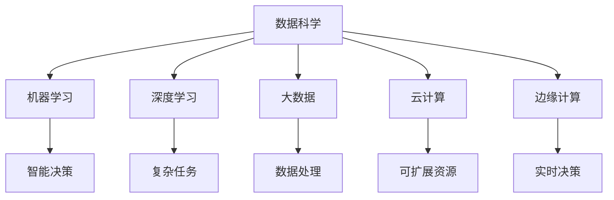

                 

# 计算的本质变化与未来趋势

在21世纪的技术浪潮中，计算的本质发生了根本性的变化。从早期的电子管计算机到如今的AI和大数据时代，计算的核心已经从“数据处理”转变为“智能决策”。本文将深入探讨这一转变的过程，并对未来的趋势进行展望，以期为未来的技术发展提供洞见。

## 1. 背景介绍

### 1.1 历史回顾
计算机科学自诞生以来，经历了多个重要的发展阶段。早期的计算机主要是用于科学计算和数据处理，如天气预报、核物理模拟等。随着硬件和软件的不断进步，计算机开始被广泛应用于商业和科学计算领域，如ERP系统、网络分析等。

然而，随着互联网的普及和数据量的爆炸性增长，计算的本质发生了重大变化。数据成为了一种重要的资源，数据分析和机器学习成为了计算的核心任务。如今，计算不再只是为了解决问题，而是为了从数据中挖掘出知识，支持智能决策。

### 1.2 当前背景
当前，数据已经成为了一种战略性资产。各行各业都在利用数据驱动的决策支持系统，优化运营效率，提高竞争力。同时，计算资源和计算能力也得到了前所未有的发展，高性能计算、云计算、边缘计算等技术为数据驱动的智能决策提供了坚实的技术基础。

在这一背景下，计算的本质已经从“数据处理”转向了“智能决策”。计算的核心任务不再只是处理数据，而是从数据中挖掘知识，形成智能决策。

## 2. 核心概念与联系

### 2.1 核心概念概述

为了更好地理解计算的本质变化，本节将介绍几个密切相关的核心概念：

- **数据科学**：以数据为驱动的科学，旨在从数据中提取知识，支持决策。数据科学包括数据收集、数据清洗、数据分析、数据可视化等多个环节。
- **机器学习**：通过数据训练模型，使模型能够自动学习和预测，支持智能决策。机器学习分为监督学习、无监督学习和强化学习等不同类型。
- **深度学习**：一种特殊的机器学习方法，通过多层神经网络从数据中学习表示，支持复杂任务的智能决策。深度学习在图像识别、自然语言处理等领域表现出色。
- **大数据**：指超过传统数据处理能力的数据集，通常涉及海量、高速、多样化的数据源。大数据技术包括数据采集、数据存储、数据处理、数据分析等多个环节。
- **云计算**：通过网络提供可扩展的计算资源和数据存储服务，支持大规模数据驱动的智能决策。云计算技术包括IaaS、PaaS和SaaS等不同层次的服务模式。
- **边缘计算**：在数据源附近进行计算和存储，减少数据传输成本，支持实时决策。边缘计算技术包括边缘计算平台、边缘计算协议等。

这些核心概念之间的逻辑关系可以通过以下Mermaid流程图来展示：



这个流程图展示了这个概念体系的核心关系：

1. 数据科学是基础，通过数据收集、清洗、分析等环节，为智能决策提供数据支撑。
2. 机器学习和深度学习是技术手段，通过训练模型从数据中提取知识，形成智能决策。
3. 大数据和云计算提供了计算和存储的支撑，为数据驱动的智能决策提供了技术保障。
4. 边缘计算提供了实时计算能力，支持复杂任务和实时决策。

这些核心概念共同构成了数据驱动的智能决策技术体系，推动着计算本质的重大变化。

## 3. 核心算法原理 & 具体操作步骤

### 3.1 算法原理概述

计算本质的变化主要体现在从“数据处理”到“智能决策”的转变。这一转变依赖于多个关键算法的创新和应用。

在传统的“数据处理”阶段，计算的核心是数据处理算法，如排序、搜索、统计等。这些算法主要依赖于硬件的计算能力和数据存储能力。

在“智能决策”阶段，计算的核心是机器学习和深度学习算法。这些算法依赖于大规模数据集的训练，通过学习数据中的模式和规律，形成智能决策模型。例如，监督学习算法通过训练数据集，构建分类或回归模型，支持智能决策。无监督学习算法通过聚类、降维等方法，发现数据中的潜在模式。强化学习算法通过试错和反馈，学习最优决策策略。

### 3.2 算法步骤详解

以监督学习算法为例，其核心步骤包括数据收集、数据预处理、模型训练和模型评估。

1. **数据收集**：从不同数据源收集数据，形成大规模数据集。数据源包括数据库、API接口、传感器、社交媒体等。
2. **数据预处理**：对原始数据进行清洗、去重、归一化等处理，形成高质量的数据集。数据预处理包括数据清洗、特征提取、数据转换等步骤。
3. **模型训练**：使用数据集训练机器学习模型，形成智能决策模型。模型训练包括模型选择、模型参数优化、模型验证等步骤。
4. **模型评估**：使用测试集评估模型性能，形成智能决策的输出。模型评估包括模型评估指标、模型调优、模型部署等步骤。

这些步骤通过高效的算法和工具实现，形成了数据驱动的智能决策技术体系。

### 3.3 算法优缺点

监督学习算法具有以下优点：

1. 数据驱动：模型性能依赖于数据集的质量和数量，数据质量越高，模型性能越好。
2. 透明性：模型的决策过程可解释，能够理解和调试。
3. 可扩展性：模型可扩展到不同的数据源和任务，支持复杂决策。

同时，监督学习算法也存在以下缺点：

1. 数据依赖：模型性能依赖于高质量的数据集，数据不足时难以发挥优势。
2. 过拟合：模型可能过度拟合训练数据，难以泛化到新数据。
3. 计算资源：模型训练需要大量计算资源，如GPU、TPU等。

未来，基于监督学习算法的智能决策技术需要进一步提升数据处理能力，降低计算资源依赖，提高模型的泛化能力和可解释性。

### 3.4 算法应用领域

监督学习算法在多个领域得到广泛应用，例如：

- **金融风控**：通过分析历史交易数据，构建欺诈检测模型，支持智能决策。
- **医疗诊断**：通过分析病人历史数据，构建诊断模型，支持智能诊断。
- **智能推荐**：通过分析用户行为数据，构建推荐模型，支持智能推荐。
- **自动驾驶**：通过分析车辆和环境数据，构建决策模型，支持自动驾驶。
- **工业制造**：通过分析设备运行数据，构建预测模型，支持智能制造。

这些领域的应用展示了监督学习算法在智能决策中的强大潜力。

## 4. 数学模型和公式 & 详细讲解 & 举例说明

### 4.1 数学模型构建

监督学习算法的核心数学模型是损失函数。损失函数衡量模型预测值与真实值之间的差异，是模型优化的目标。以二分类任务为例，损失函数定义如下：

$$
L(y,\hat{y}) = -\log(\hat{y})y + (1-\log(1-\hat{y}))(1-y)
$$

其中，$y$为真实标签，$\hat{y}$为模型预测值。

### 4.2 公式推导过程

以逻辑回归为例，推导损失函数的计算过程：

$$
\hat{y} = \sigma(\theta^T x)
$$

其中，$\theta$为模型参数，$x$为输入特征。

将$\hat{y}$代入损失函数，得：

$$
L(y,\hat{y}) = -\log(\hat{y})y + (1-\log(1-\hat{y}))(1-y)
$$

在实际应用中，通过梯度下降等优化算法，最小化损失函数，更新模型参数。

### 4.3 案例分析与讲解

以医疗诊断为例，分析监督学习算法的应用过程。假设有一个二分类任务，医生需要根据病人的症状（如年龄、性别、血压等）预测病人是否患有某种疾病。医生收集了1000个病人的数据，其中500个病人患病，500个病人未患病。将症状作为特征，患病与否作为标签，构建数据集。

使用逻辑回归算法构建模型，将症状输入模型，得到预测值$\hat{y}$。通过损失函数计算预测值与真实值之间的差异，使用梯度下降算法优化模型参数，形成最终的诊断模型。使用测试集评估模型性能，输出病人的患病概率。

## 5. 项目实践：代码实例和详细解释说明

### 5.1 开发环境搭建

在进行项目实践前，我们需要准备好开发环境。以下是使用Python进行TensorFlow开发的环境配置流程：

1. 安装Anaconda：从官网下载并安装Anaconda，用于创建独立的Python环境。

2. 创建并激活虚拟环境：
```bash
conda create -n tf-env python=3.8 
conda activate tf-env
```

3. 安装TensorFlow：根据CUDA版本，从官网获取对应的安装命令。例如：
```bash
conda install tensorflow -c pytorch -c conda-forge
```

4. 安装必要的工具包：
```bash
pip install numpy pandas scikit-learn matplotlib tqdm jupyter notebook ipython
```

完成上述步骤后，即可在`tf-env`环境中开始项目实践。

### 5.2 源代码详细实现

下面以二分类任务为例，给出使用TensorFlow进行监督学习算法的Python代码实现。

```python
import tensorflow as tf
from tensorflow.keras.datasets import mnist
from tensorflow.keras.models import Sequential
from tensorflow.keras.layers import Dense
from tensorflow.keras.optimizers import Adam
from tensorflow.keras.losses import binary_crossentropy

# 加载数据集
(x_train, y_train), (x_test, y_test) = mnist.load_data()

# 数据预处理
x_train = x_train / 255.0
x_test = x_test / 255.0
x_train = x_train.reshape(-1, 784)
x_test = x_test.reshape(-1, 784)

# 构建模型
model = Sequential([
    Dense(128, activation='relu', input_shape=(784,)),
    Dense(1, activation='sigmoid')
])

# 定义损失函数和优化器
loss = binary_crossentropy
optimizer = Adam(lr=0.001)

# 编译模型
model.compile(optimizer=optimizer, loss=loss, metrics=['accuracy'])

# 训练模型
model.fit(x_train, y_train, epochs=10, batch_size=32, validation_data=(x_test, y_test))

# 评估模型
model.evaluate(x_test, y_test)
```

### 5.3 代码解读与分析

让我们再详细解读一下关键代码的实现细节：

**数据预处理**：
- `x_train = x_train / 255.0`：将像素值归一化到0-1之间。
- `x_train = x_train.reshape(-1, 784)`：将样本展开成784维向量。

**模型构建**：
- `Sequential`：使用Keras的序列模型，构建包含两个全连接层的神经网络。
- `Dense(128, activation='relu', input_shape=(784,))`：第一个全连接层，128个神经元，激活函数为ReLU。
- `Dense(1, activation='sigmoid')`：输出层，1个神经元，激活函数为Sigmoid，用于二分类任务。

**损失函数和优化器**：
- `binary_crossentropy`：二分类任务的损失函数。
- `Adam(lr=0.001)`：使用Adam优化器，学习率为0.001。

**模型编译**：
- `model.compile(optimizer=optimizer, loss=loss, metrics=['accuracy'])`：编译模型，指定优化器、损失函数和评估指标。

**模型训练**：
- `model.fit(x_train, y_train, epochs=10, batch_size=32, validation_data=(x_test, y_test))`：训练模型，指定训练数据、批次大小、迭代轮数和验证数据。

**模型评估**：
- `model.evaluate(x_test, y_test)`：在测试集上评估模型性能，输出损失和准确率。

可以看到，TensorFlow提供了便捷的API接口，使得模型构建和训练过程变得简单高效。开发者可以将更多精力放在数据处理、模型改进等高层逻辑上，而不必过多关注底层的实现细节。

当然，工业级的系统实现还需考虑更多因素，如模型的保存和部署、超参数的自动搜索、更灵活的任务适配层等。但核心的算法实现基本与此类似。

## 6. 实际应用场景

### 6.1 智能推荐系统

智能推荐系统已经广泛应用于电子商务、新闻媒体、视频平台等领域，成为提升用户体验的重要手段。传统推荐系统主要依赖用户历史行为数据进行推荐，难以发现用户的潜在兴趣。

基于监督学习算法的推荐系统可以通过分析用户行为数据，构建推荐模型，支持智能推荐。以电商平台的商品推荐为例，收集用户浏览、点击、购买等行为数据，将行为数据作为特征，构建推荐模型。通过监督学习算法训练模型，预测用户对不同商品的兴趣度，形成推荐列表。

### 6.2 医疗诊断系统

医疗诊断系统是数据驱动的智能决策的重要应用领域。传统医疗诊断主要依赖医生的经验，难以处理大量的病例数据。

基于监督学习算法的医疗诊断系统可以通过分析病人的历史数据，构建诊断模型，支持智能诊断。以影像诊断为例，收集病人的CT、MRI等影像数据，将影像数据作为特征，构建诊断模型。通过监督学习算法训练模型，预测病人是否患有某种疾病，输出诊断结果。

### 6.3 自动驾驶系统

自动驾驶系统是计算本质的重大应用之一。传统自动驾驶系统主要依赖传感器和地图数据进行决策，难以处理复杂的城市交通环境。

基于监督学习算法的自动驾驶系统可以通过分析车辆和环境数据，构建决策模型，支持智能驾驶。以路径规划为例，收集车辆和环境数据，将数据作为特征，构建决策模型。通过监督学习算法训练模型，预测最优路径，输出驾驶指令。

### 6.4 未来应用展望

未来，基于监督学习算法的智能决策技术将继续拓展应用领域，带来更多的创新和突破：

1. **多模态融合**：将视觉、语音、文本等多种模态的数据进行融合，形成更加全面的智能决策系统。例如，智能助手可以同时处理语音和文本输入，提供更加智能的对话体验。
2. **实时决策**：通过边缘计算等技术，实现实时计算和决策，支持复杂任务和实时应用。例如，智能医疗系统可以实时分析病人的生理数据，提供个性化的医疗建议。
3. **自适应学习**：通过持续学习和反馈机制，智能决策系统可以不断学习和改进，保持最新的决策能力。例如，智能客服系统可以不断学习和优化对话策略，提升客户满意度。
4. **可解释性增强**：通过模型解释和可视化技术，智能决策系统可以提供更加透明的决策过程和结果，增强用户信任。例如，智能推荐系统可以提供推荐依据和理由，增强用户体验。
5. **跨领域应用**：智能决策系统可以应用于不同领域，如金融、医疗、制造等，提升各领域的运营效率和决策质量。例如，智能制造系统可以实时监控设备状态，优化生产过程。

这些方向展示了智能决策技术的广阔前景，将进一步推动各行业的数字化转型和智能化升级。

## 7. 工具和资源推荐

### 7.1 学习资源推荐

为了帮助开发者系统掌握监督学习算法的理论基础和实践技巧，这里推荐一些优质的学习资源：

1. **《深度学习》系列课程**：由吴恩达教授主讲的Coursera课程，涵盖深度学习基础和高级应用。
2. **TensorFlow官方文档**：提供了完整的TensorFlow框架介绍和使用指南，是学习TensorFlow的最佳资源。
3. **Kaggle竞赛**：参加Kaggle数据科学竞赛，通过实战练习掌握监督学习算法。
4. **GitHub开源项目**：GitHub上有大量开源的监督学习算法实现，可以借鉴和参考。
5. **AI大咖分享**：参加AI大咖的在线讲座和分享，获取最新的算法和应用案例。

通过对这些资源的学习实践，相信你一定能够快速掌握监督学习算法的精髓，并用于解决实际的智能决策问题。

### 7.2 开发工具推荐

高效的开发离不开优秀的工具支持。以下是几款用于监督学习算法开发的常用工具：

1. **Jupyter Notebook**：强大的交互式编程环境，支持Python、R、Scala等语言。
2. **TensorFlow**：由Google主导开发的深度学习框架，支持高效计算和分布式训练。
3. **Keras**：基于TensorFlow的高层API，简化模型构建和训练过程。
4. **PyTorch**：由Facebook开发的深度学习框架，灵活易用，适合科研和生产应用。
5. **Scikit-Learn**：Python的机器学习库，提供了丰富的监督学习算法和工具。

合理利用这些工具，可以显著提升监督学习算法的开发效率，加快创新迭代的步伐。

### 7.3 相关论文推荐

监督学习算法的发展源于学界的持续研究。以下是几篇奠基性的相关论文，推荐阅读：

1. **《机器学习》书籍**：Tom Mitchell教授的经典著作，系统介绍了机器学习的理论和算法。
2. **《深度学习》书籍**：Ian Goodfellow等人的专著，详细讲解了深度学习的基础和应用。
3. **《强化学习》书籍**：Richard Sutton和Andrew Barto的著作，介绍了强化学习的基本理论和算法。
4. **《数据分析与统计学习》课程**：约翰霍普金斯大学的MOOC课程，涵盖数据分析和统计学习的基础知识。
5. **《TensorFlow教程》书籍**：Google开发的TensorFlow教程，提供了丰富的实践案例和代码实现。

这些论文代表了大数据和深度学习的发展脉络。通过学习这些前沿成果，可以帮助研究者把握学科前进方向，激发更多的创新灵感。

## 8. 总结：未来发展趋势与挑战

### 8.1 总结

本文对基于监督学习算法的计算本质变化进行了全面系统的介绍。首先阐述了从“数据处理”到“智能决策”的转变过程，明确了监督学习算法的核心价值。其次，从原理到实践，详细讲解了监督学习算法的数学原理和关键步骤，给出了实际应用的完整代码实现。同时，本文还广泛探讨了监督学习算法在推荐系统、医疗诊断、自动驾驶等多个领域的应用前景，展示了算法在智能决策中的强大潜力。

通过本文的系统梳理，可以看到，基于监督学习算法的计算本质变化是数据驱动智能决策的重要驱动力。这一转变引领了计算技术的重大进步，为各行业的智能化升级提供了强大的技术支撑。未来，基于监督学习算法的计算技术将继续拓展应用领域，带来更多的创新和突破。

### 8.2 未来发展趋势

展望未来，基于监督学习算法的智能决策技术将呈现以下几个发展趋势：

1. **多模态融合**：通过融合视觉、语音、文本等多种模态的数据，形成更加全面和准确的智能决策系统。例如，智能助手可以同时处理语音和文本输入，提供更加智能的对话体验。
2. **实时决策**：通过边缘计算等技术，实现实时计算和决策，支持复杂任务和实时应用。例如，智能医疗系统可以实时分析病人的生理数据，提供个性化的医疗建议。
3. **自适应学习**：通过持续学习和反馈机制，智能决策系统可以不断学习和改进，保持最新的决策能力。例如，智能客服系统可以不断学习和优化对话策略，提升客户满意度。
4. **可解释性增强**：通过模型解释和可视化技术，智能决策系统可以提供更加透明的决策过程和结果，增强用户信任。例如，智能推荐系统可以提供推荐依据和理由，增强用户体验。
5. **跨领域应用**：智能决策系统可以应用于不同领域，如金融、医疗、制造等，提升各领域的运营效率和决策质量。例如，智能制造系统可以实时监控设备状态，优化生产过程。

这些趋势展示了基于监督学习算法的智能决策技术的广阔前景，将进一步推动各行业的数字化转型和智能化升级。

### 8.3 面临的挑战

尽管基于监督学习算法的智能决策技术已经取得了瞩目成就，但在迈向更加智能化、普适化应用的过程中，它仍面临着诸多挑战：

1. **数据依赖**：模型的性能依赖于高质量的数据集，数据不足时难以发挥优势。如何降低对数据集的质量和数量的依赖，是一个重要的研究方向。
2. **计算资源**：模型训练需要大量计算资源，如GPU、TPU等。如何降低计算资源的需求，提高模型的计算效率，是一个重要的研究方向。
3. **模型可解释性**：模型的决策过程往往难以解释，难以理解其内部工作机制和决策逻辑。如何增强模型的可解释性，增强用户信任，是一个重要的研究方向。
4. **数据隐私和安全**：数据驱动的智能决策系统涉及大量敏感数据，如何保护数据隐私和安全，是一个重要的研究方向。
5. **跨领域应用**：不同领域的智能决策系统需要解决不同的问题，如何构建通用性和适应性更强的智能决策系统，是一个重要的研究方向。

这些挑战需要学术界和产业界的共同努力，通过技术创新和应用实践，不断突破，实现基于监督学习算法的智能决策技术的更大发展。

### 8.4 研究展望

未来，基于监督学习算法的智能决策技术需要围绕数据、计算、模型、应用等多个维度进行深入研究，寻求新的突破：

1. **数据增强**：通过数据增强技术，如数据合成、数据扩充等，提高数据集的质量和数量。例如，通过数据合成技术，生成更多的训练样本，提升模型的泛化能力。
2. **模型压缩**：通过模型压缩技术，如量化、剪枝、蒸馏等，降低模型的计算资源需求。例如，通过量化技术，将浮点模型转化为定点模型，降低内存占用和计算成本。
3. **模型优化**：通过模型优化技术，如自适应学习、联邦学习等，提升模型的适应性和泛化能力。例如，通过自适应学习技术，让模型能够持续学习和优化，保持最新的决策能力。
4. **应用创新**：通过应用创新技术，如边缘计算、云计算等，支持智能决策系统的实时化和跨领域应用。例如，通过边缘计算技术，支持智能决策系统的实时决策和实时应用。
5. **跨学科融合**：通过跨学科融合技术，如神经科学、心理学等，增强智能决策系统的认知智能能力。例如，通过神经科学研究，理解人类认知过程，提升智能决策系统的智能水平。

这些研究方向展示了基于监督学习算法的智能决策技术的发展方向，将推动各行业的智能化升级，带来更多创新和突破。

## 9. 附录：常见问题与解答

**Q1: 什么是监督学习算法？**

A: 监督学习算法是一种通过标注数据训练模型，使其能够从输入数据中预测输出的机器学习方法。通过训练数据集，模型学习输入数据和输出标签之间的映射关系，形成预测模型。监督学习算法包括分类算法、回归算法、聚类算法等不同类型。

**Q2: 监督学习算法与无监督学习算法有什么区别？**

A: 监督学习算法和无监督学习算法的主要区别在于训练数据的标注情况。监督学习算法使用标注数据进行训练，通过标注数据指导模型学习输入和输出之间的映射关系。无监督学习算法则不使用标注数据，通过数据本身的内在规律进行学习和建模。

**Q3: 监督学习算法在实际应用中有哪些应用场景？**

A: 监督学习算法在实际应用中有多种应用场景，包括但不限于：
1. 金融风控：通过分析历史交易数据，构建欺诈检测模型，支持智能决策。
2. 医疗诊断：通过分析病人历史数据，构建诊断模型，支持智能诊断。
3. 智能推荐：通过分析用户行为数据，构建推荐模型，支持智能推荐。
4. 自动驾驶：通过分析车辆和环境数据，构建决策模型，支持智能驾驶。
5. 工业制造：通过分析设备运行数据，构建预测模型，支持智能制造。

**Q4: 监督学习算法在实际应用中需要注意哪些问题？**

A: 监督学习算法在实际应用中需要注意以下问题：
1. 数据依赖：模型的性能依赖于高质量的数据集，数据不足时难以发挥优势。
2. 过拟合：模型可能过度拟合训练数据，难以泛化到新数据。
3. 计算资源：模型训练需要大量计算资源，如GPU、TPU等。
4. 模型可解释性：模型的决策过程往往难以解释，难以理解其内部工作机制和决策逻辑。
5. 数据隐私和安全：数据驱动的智能决策系统涉及大量敏感数据，如何保护数据隐私和安全。

**Q5: 监督学习算法与深度学习算法有什么关系？**

A: 监督学习算法是深度学习算法的一种，深度学习算法是监督学习算法在神经网络模型中的应用。深度学习算法通过多层神经网络从数据中学习表示，支持复杂任务的智能决策。监督学习算法是深度学习算法的基础，用于构建初始的模型和任务适配层，支持深度学习算法的训练和优化。

综上所述，基于监督学习算法的计算本质变化是数据驱动智能决策的重要驱动力。这一转变引领了计算技术的重大进步，为各行业的智能化升级提供了强大的技术支撑。未来，基于监督学习算法的计算技术将继续拓展应用领域，带来更多的创新和突破。同时，监督学习算法在实际应用中也面临着诸多挑战，需要通过技术创新和应用实践，不断突破，实现更大的发展。

