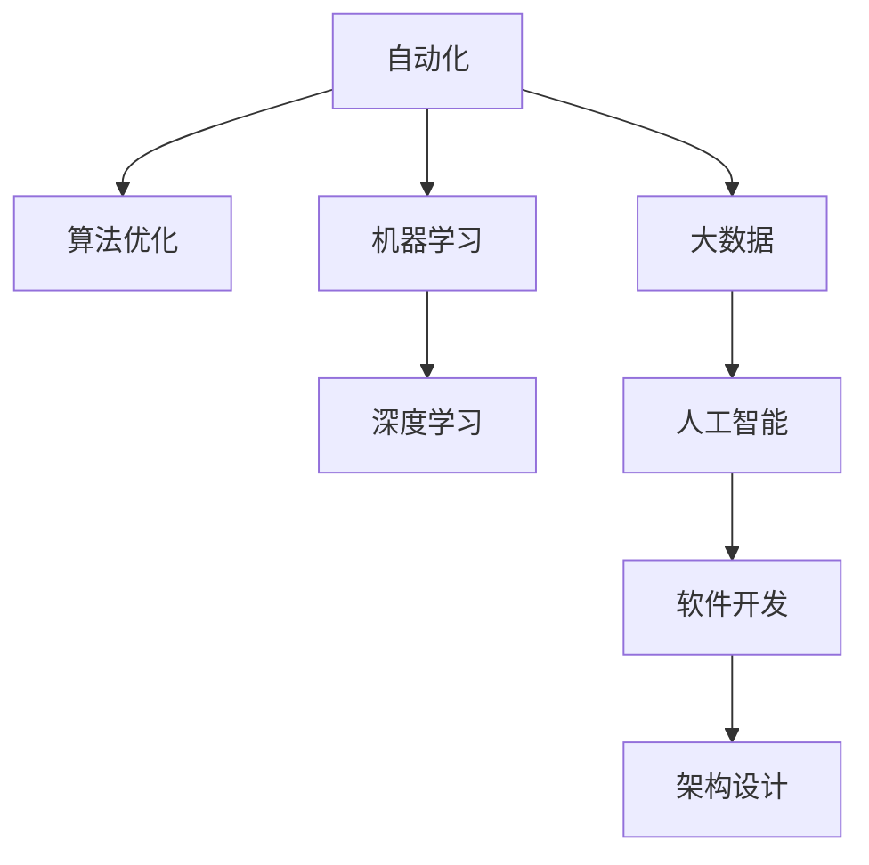

                 

# 计算领域的自动化发展趋势

> 关键词：自动化、计算领域、算法优化、机器学习、深度学习、大数据、人工智能、软件开发、架构设计

## 1. 背景介绍

### 1.1 问题由来
在现代计算领域，自动化技术的应用已经成为推动技术进步和业务创新的关键力量。从早期的自动装配线到当前的热门话题——人工智能(AI)、机器学习(ML)、深度学习(DL)、大数据(BD)等，无不渗透着自动化的身影。自动化技术的核心目标是通过机器和软件系统完成原本需要人工介入的工作，从而提高效率、降低成本、提升质量。

### 1.2 问题核心关键点
自动化技术的发展经历了早期的简单机械自动化、中期的电子自动化，以及现在的智能化自动化。智能化自动化的核心是利用算法和数据驱动系统决策，实现更为复杂的任务自动化。具体而言，包括：

1. **算法优化**：通过自动搜索算法参数，优化模型结构，提升模型性能。
2. **机器学习**：通过学习数据规律，实现系统的自主决策和行为优化。
3. **深度学习**：利用神经网络模型处理复杂非线性问题，提高自动化系统的鲁棒性和泛化能力。
4. **大数据**：通过自动化处理海量数据，实现对复杂系统的监控和分析。
5. **人工智能**：将自动化与智能化结合，实现自主学习和自主决策。
6. **软件开发**：通过自动化测试、持续集成、持续部署等技术，加速软件交付速度。
7. **架构设计**：通过自动化设计工具，优化系统架构，提升系统性能和可维护性。

自动化技术在各个领域的广泛应用，极大地提高了生产效率，降低了错误率，并推动了技术创新和业务变革。然而，自动化技术也带来了新的挑战，如系统复杂性增加、模型黑箱化、数据隐私问题等。因此，如何在自动化技术的基础上，构建更智能、更透明、更安全的系统，是当前计算领域的重要研究方向。

### 1.3 问题研究意义
研究计算领域的自动化发展趋势，对于推动技术进步、提升业务效率、实现技术创新具有重要意义：

1. **提升效率**：自动化技术通过减少人工介入，显著提高生产效率，降低成本。
2. **降低错误率**：自动化系统的稳定性、精确性高于人工操作，降低系统错误率。
3. **推动创新**：自动化技术能够处理大规模复杂数据，发现新规律，推动技术创新和业务模式变革。
4. **促进安全**：自动化系统可以通过自我监控和优化，提升系统安全性，减少事故发生。
5. **支持决策**：自动化系统能够基于数据分析，提供科学决策支持，优化决策过程。
6. **支持科研**：自动化技术支持大规模实验和数据处理，提升科研效率和准确性。

## 2. 核心概念与联系

### 2.1 核心概念概述

为了更好地理解计算领域的自动化技术，本节将介绍几个关键概念及其相互之间的联系：

- **自动化**：通过机器和软件系统自动完成某些任务，减少人工介入，提高效率。
- **算法优化**：通过自动化算法寻找最优解，提升系统性能。
- **机器学习**：利用算法让机器从数据中学习规律，实现自主决策。
- **深度学习**：利用多层神经网络处理复杂非线性问题，提升模型性能。
- **大数据**：通过自动化技术处理海量数据，提取有价值的信息。
- **人工智能**：将自动化与智能化结合，实现自主学习和自主决策。
- **软件开发**：通过自动化工具加速软件开发生命周期。
- **架构设计**：通过自动化工具优化系统架构，提升系统性能和可维护性。

这些概念之间的逻辑关系可以通过以下Mermaid流程图来展示：



这个流程图展示了自动化技术的各个分支及其相互之间的关系：

1. **自动化**是基础，通过算法优化提升系统性能。
2. **机器学习**和**深度学习**是高级算法，用于处理复杂任务。
3. **大数据**和**人工智能**是自动化技术的应用领域，通过处理海量数据，实现智能化决策。
4. **软件开发**和**架构设计**是自动化技术在软件领域的扩展应用，通过工具和技术提升软件开发效率和系统性能。

这些概念共同构成了计算领域的自动化技术框架，为各类自动化实践提供了理论基础。

## 3. 核心算法原理 & 具体操作步骤

### 3.1 算法原理概述

计算领域的自动化技术主要依赖于算法和数据的驱动。以下将详细探讨算法优化、机器学习、深度学习等核心算法的原理，并通过具体的实例说明操作步骤。

### 3.2 算法步骤详解

#### 3.2.1 算法优化
算法优化是计算领域自动化技术的重要组成部分，通过自动化搜索算法参数，优化模型结构，提升模型性能。其核心步骤包括：

1. **定义目标函数**：根据任务需求定义目标函数，通常为模型预测结果与真实结果的误差。
2. **选择优化算法**：选择合适的优化算法，如梯度下降、遗传算法、粒子群算法等，用于搜索最优参数。
3. **设计搜索空间**：确定算法搜索参数的空间范围和精度要求。
4. **执行搜索**：通过自动化工具执行搜索过程，记录每次迭代的结果。
5. **评估结果**：根据目标函数评估每次迭代结果，选择最优解。
6. **优化模型**：根据最优解调整模型参数，重新训练模型。

以下是一个使用梯度下降算法进行模型优化的示例代码：

```python
import torch
from torch.optim import SGD

# 定义模型
model = YourModel()

# 定义损失函数
criterion = torch.nn.CrossEntropyLoss()

# 定义优化器
optimizer = SGD(model.parameters(), lr=0.01)

# 训练过程
for epoch in range(100):
    for inputs, labels in train_loader:
        optimizer.zero_grad()
        outputs = model(inputs)
        loss = criterion(outputs, labels)
        loss.backward()
        optimizer.step()
```

#### 3.2.2 机器学习
机器学习通过让机器从数据中学习规律，实现自主决策。其核心步骤包括：

1. **数据准备**：收集和预处理数据，确保数据质量和一致性。
2. **模型选择**：选择合适的模型，如线性回归、决策树、随机森林等。
3. **特征提取**：提取数据中的特征，选择对模型性能影响最大的特征。
4. **模型训练**：使用训练集数据训练模型，记录每次迭代的结果。
5. **模型评估**：使用测试集数据评估模型性能，选择最优模型。
6. **模型部署**：将训练好的模型部署到生产环境中，实现自动决策。

以下是一个使用随机森林进行分类的示例代码：

```python
from sklearn.ensemble import RandomForestClassifier
from sklearn.model_selection import train_test_split
from sklearn.metrics import accuracy_score

# 数据准备
X_train, X_test, y_train, y_test = train_test_split(X, y, test_size=0.2)

# 模型选择
clf = RandomForestClassifier(n_estimators=100, max_depth=5)

# 特征提取
X_train = preprocess(X_train)
X_test = preprocess(X_test)

# 模型训练
clf.fit(X_train, y_train)

# 模型评估
y_pred = clf.predict(X_test)
accuracy = accuracy_score(y_test, y_pred)

# 模型部署
model = clf
```

#### 3.2.3 深度学习
深度学习通过多层神经网络处理复杂非线性问题，提升模型性能。其核心步骤包括：

1. **网络设计**：设计多层神经网络结构，确定各层节点数量、激活函数等参数。
2. **数据准备**：收集和预处理数据，确保数据质量和一致性。
3. **模型训练**：使用训练集数据训练模型，记录每次迭代的结果。
4. **模型评估**：使用测试集数据评估模型性能，选择最优模型。
5. **模型部署**：将训练好的模型部署到生产环境中，实现自动决策。

以下是一个使用卷积神经网络(CNN)进行图像分类的示例代码：

```python
import torch
import torch.nn as nn
import torch.optim as optim
from torchvision import datasets, transforms

# 数据准备
transform = transforms.Compose([
    transforms.ToTensor(),
    transforms.Normalize((0.5, 0.5, 0.5), (0.5, 0.5, 0.5))
])
trainset = datasets.CIFAR10(root='./data', train=True, download=True, transform=transform)
trainloader = torch.utils.data.DataLoader(trainset, batch_size=32, shuffle=True, num_workers=2)

# 网络设计
class Net(nn.Module):
    def __init__(self):
        super(Net, self).__init__()
        self.conv1 = nn.Conv2d(3, 6, 5)
        self.pool = nn.MaxPool2d(2, 2)
        self.conv2 = nn.Conv2d(6, 16, 5)
        self.fc1 = nn.Linear(16 * 5 * 5, 120)
        self.fc2 = nn.Linear(120, 84)
        self.fc3 = nn.Linear(84, 10)

    def forward(self, x):
        x = self.pool(F.relu(self.conv1(x)))
        x = self.pool(F.relu(self.conv2(x)))
        x = x.view(-1, 16 * 5 * 5)
        x = F.relu(self.fc1(x))
        x = F.relu(self.fc2(x))
        x = self.fc3(x)
        return x

# 模型训练
net = Net()
criterion = nn.CrossEntropyLoss()
optimizer = optim.SGD(net.parameters(), lr=0.001, momentum=0.9)
for epoch in range(10):
    running_loss = 0.0
    for i, data in enumerate(trainloader, 0):
        inputs, labels = data
        optimizer.zero_grad()
        outputs = net(inputs)
        loss = criterion(outputs, labels)
        loss.backward()
        optimizer.step()
        running_loss += loss.item()
    print('Epoch %d loss: %.3f' % (epoch + 1, running_loss / len(trainloader)))
```

#### 3.2.4 大数据
大数据通过自动化处理海量数据，提取有价值的信息。其核心步骤包括：

1. **数据收集**：从不同渠道收集数据，确保数据完整性和一致性。
2. **数据预处理**：清洗、转换、整合数据，确保数据质量和一致性。
3. **数据存储**：选择合适的数据存储技术，如Hadoop、Spark等，确保数据可扩展性和可靠性。
4. **数据处理**：使用自动化工具处理数据，提取有价值的信息。
5. **数据分析**：使用自动化工具分析数据，发现规律和趋势。
6. **数据可视化**：使用可视化工具展示数据结果，支持决策。

以下是一个使用Hadoop进行大数据处理的示例代码：

```python
from pyspark.sql import SparkSession

# 创建Spark会话
spark = SparkSession.builder.appName('BigData').getOrCreate()

# 读取数据
df = spark.read.json('data.json')

# 数据处理
df = df.select('feature1', 'feature2')
df.write.parquet('output.parquet')

# 数据分析
df = df.groupBy('feature1').count()
result = df.collect()

# 数据可视化
result.show()
```

### 3.3 算法优缺点

#### 3.3.1 算法优化
算法优化的优点包括：

1. **高效性**：通过自动化搜索算法参数，找到最优解，提升模型性能。
2. **可扩展性**：适用于各种规模的数据和模型，灵活性高。
3. **自动化**：减少人工介入，提升工作效率。

算法优化的缺点包括：

1. **复杂性**：算法优化过程需要专业知识，设计复杂。
2. **时间成本**：搜索过程可能耗时较长，影响开发速度。
3. **黑箱化**：优化过程不透明，难以解释。

#### 3.3.2 机器学习
机器学习的优点包括：

1. **自主决策**：机器从数据中学习规律，实现自主决策。
2. **适应性强**：适用于各种规模和类型的数据。
3. **可扩展性**：可以扩展到各种复杂场景。

机器学习的缺点包括：

1. **数据依赖**：模型性能依赖于数据质量，数据错误可能导致误判。
2. **过拟合风险**：模型容易过拟合训练数据，泛化能力差。
3. **解释困难**：模型黑箱化，难以解释决策过程。

#### 3.3.3 深度学习
深度学习的优点包括：

1. **处理复杂问题**：适用于处理复杂非线性问题。
2. **高泛化能力**：模型具有较强的泛化能力，适用于各种场景。
3. **自动化**：自动化处理数据和模型，提升工作效率。

深度学习的缺点包括：

1. **资源消耗大**：需要大量的计算资源和存储资源。
2. **训练时间长**：训练过程耗时较长，影响开发速度。
3. **模型复杂**：模型结构复杂，难以调试和优化。

#### 3.3.4 大数据
大数据的优点包括：

1. **处理海量数据**：可以处理海量数据，提取有价值的信息。
2. **可扩展性**：支持大规模数据处理，灵活性强。
3. **自动化**：自动化处理数据，提升工作效率。

大数据的缺点包括：

1. **技术门槛高**：需要掌握Hadoop、Spark等技术，门槛较高。
2. **数据隐私**：处理敏感数据时，需要注意数据隐私和安全性。
3. **存储成本高**：存储海量数据需要大量存储空间。

## 4. 数学模型和公式 & 详细讲解 & 举例说明

### 4.1 数学模型构建

计算领域的自动化技术涉及众多数学模型，以下将详细讲解其中的几个核心模型及其构建方法。

#### 4.1.1 线性回归模型
线性回归模型用于处理线性关系的数据，其数学模型为：

$$y = \theta_0 + \theta_1x_1 + \theta_2x_2 + ... + \theta_nx_n$$

其中，$y$为输出，$x_i$为输入特征，$\theta_i$为模型参数。

#### 4.1.2 决策树模型
决策树模型用于处理分类问题，其数学模型为：

$$y = \begin{cases}
y_1 & \text{if } x_1 < \theta_1 \\
y_2 & \text{if } x_1 \geq \theta_1
\end{cases}$$

其中，$x_1$为输入特征，$\theta_1$为决策点，$y_1$和$y_2$为输出。

#### 4.1.3 卷积神经网络(CNN)
卷积神经网络用于处理图像分类问题，其数学模型为：

$$y = \sigma(W_1 * x + b_1) * \sigma(W_2 * y + b_2) * ... * \sigma(W_n * z + b_n)$$

其中，$x$为输入图像，$y$为卷积特征图，$z$为池化特征图，$\sigma$为激活函数，$W_i$和$b_i$为卷积核和偏置项。

#### 4.1.4 随机森林模型
随机森林模型用于处理分类和回归问题，其数学模型为：

$$y = \frac{1}{m} \sum_{i=1}^{m} f_i(x)$$

其中，$f_i(x)$为随机森林中的第$i$棵树对输入$x$的预测结果，$m$为树的数量。

### 4.2 公式推导过程

#### 4.2.1 线性回归
线性回归模型的目标是最小化预测值与真实值之间的误差，通常使用均方误差（MSE）作为损失函数：

$$L = \frac{1}{2N} \sum_{i=1}^{N} (y_i - \hat{y_i})^2$$

其中，$y_i$为真实值，$\hat{y_i}$为预测值。

通过梯度下降算法最小化损失函数，得到模型参数：

$$\theta_j = \theta_j - \eta \frac{\partial L}{\partial \theta_j}$$

其中，$\theta_j$为模型参数，$\eta$为学习率。

#### 4.2.2 决策树
决策树模型的目标是最大化信息增益（IG），其公式为：

$$IG = \sum_{i=1}^{N} p_i \log \frac{p_i}{p_j}$$

其中，$p_i$为类别$i$的样本比例，$p_j$为类别总样本比例。

通过递归求解最大信息增益，得到决策树：

$$\max IG = \max_{j} IG_{j}$$

其中，$IG_j$为以特征$x_j$为根节点的信息增益。

#### 4.2.3 卷积神经网络
卷积神经网络的损失函数通常使用交叉熵损失（CE）：

$$L = -\frac{1}{N} \sum_{i=1}^{N} \sum_{j=1}^{C} y_{ij} \log \hat{y}_{ij}$$

其中，$y_{ij}$为真实标签，$\hat{y}_{ij}$为模型预测结果。

通过反向传播算法计算梯度，更新模型参数：

$$\theta_j = \theta_j - \eta \frac{\partial L}{\partial \theta_j}$$

#### 4.2.4 随机森林
随机森林的损失函数通常使用平均损失函数（AL）：

$$L = \frac{1}{m} \sum_{i=1}^{m} L_i$$

其中，$L_i$为随机森林中的第$i$棵树对输入的平均损失函数。

### 4.3 案例分析与讲解

#### 4.3.1 线性回归
线性回归模型常用于房价预测、股票价格预测等场景。以下是一个使用Python进行线性回归的示例代码：

```python
import pandas as pd
from sklearn.linear_model import LinearRegression

# 读取数据
df = pd.read_csv('data.csv')

# 数据准备
X = df[['feature1', 'feature2']]
y = df['price']

# 模型训练
model = LinearRegression()
model.fit(X, y)

# 模型评估
print(model.score(X, y))
```

#### 4.3.2 决策树
决策树模型常用于分类问题，如信用评分、疾病预测等。以下是一个使用Python进行决策树分类的示例代码：

```python
from sklearn.tree import DecisionTreeClassifier

# 数据准备
X = df[['feature1', 'feature2']]
y = df['label']

# 模型训练
model = DecisionTreeClassifier()
model.fit(X, y)

# 模型评估
print(model.score(X, y))
```

#### 4.3.3 卷积神经网络
卷积神经网络常用于图像分类问题，如MNIST手写数字识别。以下是一个使用Python进行卷积神经网络分类的示例代码：

```python
import torch
import torch.nn as nn
import torch.optim as optim
from torchvision import datasets, transforms

# 数据准备
transform = transforms.Compose([
    transforms.ToTensor(),
    transforms.Normalize((0.5, 0.5, 0.5), (0.5, 0.5, 0.5))
])
trainset = datasets.CIFAR10(root='./data', train=True, download=True, transform=transform)
trainloader = torch.utils.data.DataLoader(trainset, batch_size=32, shuffle=True, num_workers=2)

# 网络设计
class Net(nn.Module):
    def __init__(self):
        super(Net, self).__init__()
        self.conv1 = nn.Conv2d(3, 6, 5)
        self.pool = nn.MaxPool2d(2, 2)
        self.conv2 = nn.Conv2d(6, 16, 5)
        self.fc1 = nn.Linear(16 * 5 * 5, 120)
        self.fc2 = nn.Linear(120, 84)
        self.fc3 = nn.Linear(84, 10)

    def forward(self, x):
        x = self.pool(F.relu(self.conv1(x)))
        x = self.pool(F.relu(self.conv2(x)))
        x = x.view(-1, 16 * 5 * 5)
        x = F.relu(self.fc1(x))
        x = F.relu(self.fc2(x))
        x = self.fc3(x)
        return x

# 模型训练
net = Net()
criterion = nn.CrossEntropyLoss()
optimizer = optim.SGD(net.parameters(), lr=0.001, momentum=0.9)
for epoch in range(10):
    running_loss = 0.0
    for i, data in enumerate(trainloader, 0):
        inputs, labels = data
        optimizer.zero_grad()
        outputs = net(inputs)
        loss = criterion(outputs, labels)
        loss.backward()
        optimizer.step()
        running_loss += loss.item()
    print('Epoch %d loss: %.3f' % (epoch + 1, running_loss / len(trainloader)))
```

#### 4.3.4 随机森林
随机森林模型常用于分类和回归问题，如股票价格预测、客户流失预测等。以下是一个使用Python进行随机森林分类的示例代码：

```python
from sklearn.ensemble import RandomForestClassifier

# 数据准备
X = df[['feature1', 'feature2']]
y = df['label']

# 模型训练
model = RandomForestClassifier(n_estimators=100, max_depth=5)
model.fit(X, y)

# 模型评估
print(model.score(X, y))
```

## 5. 项目实践：代码实例和详细解释说明

### 5.1 开发环境搭建

在进行计算领域的自动化技术开发前，我们需要准备好开发环境。以下是使用Python进行TensorFlow开发的环境配置流程：

1. 安装Anaconda：从官网下载并安装Anaconda，用于创建独立的Python环境。

2. 创建并激活虚拟环境：
```bash
conda create -n tensorflow-env python=3.8 
conda activate tensorflow-env
```

3. 安装TensorFlow：从官网获取对应的安装命令。例如：
```bash
conda install tensorflow -c conda-forge
```

4. 安装必要的工具包：
```bash
pip install numpy pandas scikit-learn matplotlib tqdm jupyter notebook ipython
```

完成上述步骤后，即可在`tensorflow-env`环境中开始开发实践。

### 5.2 源代码详细实现

这里我们以深度学习领域的图像分类任务为例，给出使用TensorFlow进行卷积神经网络分类的PyTorch代码实现。

首先，定义模型和数据预处理函数：

```python
import tensorflow as tf
import numpy as np
from tensorflow.keras.datasets import mnist
from tensorflow.keras.preprocessing.image import ImageDataGenerator

# 定义模型
model = tf.keras.models.Sequential([
    tf.keras.layers.Conv2D(32, (3, 3), activation='relu', input_shape=(28, 28, 1)),
    tf.keras.layers.MaxPooling2D((2, 2)),
    tf.keras.layers.Flatten(),
    tf.keras.layers.Dense(10, activation='softmax')
])

# 加载数据集
(train_images, train_labels), (test_images, test_labels) = mnist.load_data()

# 数据预处理
train_images = train_images.reshape(train_images.shape[0], 28, 28, 1)
train_images = train_images / 255.0
test_images = test_images.reshape(test_images.shape[0], 28, 28, 1)
test_images = test_images / 255.0

# 创建数据增强器
datagen = ImageDataGenerator(rotation_range=10, width_shift_range=0.1, height_shift_range=0.1)

# 生成批数据
train_generator = datagen.flow(train_images, train_labels, batch_size=32)
test_generator = datagen.flow(test_images, test_labels, batch_size=32)
```

然后，定义训练和评估函数：

```python
# 定义损失函数和优化器
loss_fn = tf.keras.losses.SparseCategoricalCrossentropy()
optimizer = tf.keras.optimizers.Adam()

# 训练过程
def train_epoch(model, train_generator, batch_size, epochs):
    for epoch in range(epochs):
        for batch in train_generator:
            inputs, labels = batch
            optimizer.zero_grad()
            outputs = model(inputs)
            loss = loss_fn(labels, outputs)
            loss.backward()
            optimizer.step()
        print(f'Epoch {epoch+1}, loss: {loss.numpy()}')

# 评估过程
def evaluate(model, test_generator):
    test_loss = 0.0
    test_accuracy = 0.0
    for batch in test_generator:
        inputs, labels = batch
        outputs = model(inputs)
        test_loss += loss_fn(labels, outputs).numpy()
        test_accuracy += tf.keras.metrics.sparse_categorical_accuracy(labels, outputs).numpy()
    print(f'Test loss: {test_loss/n batches}, Test accuracy: {test_accuracy/n batches}')
```

最后，启动训练流程并在测试集上评估：

```python
batch_size = 32
epochs = 10

train_epoch(model, train_generator, batch_size, epochs)

evaluate(model, test_generator)
```

以上就是使用TensorFlow进行卷积神经网络分类的完整代码实现。可以看到，得益于TensorFlow的强大封装，我们可以用相对简洁的代码完成模型的加载和训练。

### 5.3 代码解读与分析

让我们再详细解读一下关键代码的实现细节：

**定义模型和数据预处理函数**：
- `Sequential`类：用于构建顺序模型，方便定义多层神经网络。
- `Conv2D`层：卷积层，用于提取特征。
- `MaxPooling2D`层：池化层，用于下采样。
- `Flatten`层：展平层，将多维数据转换为一维数据。
- `Dense`层：全连接层，用于输出预测结果。
- `ImageDataGenerator`类：用于数据增强，增加训练集多样性。
- `flow`方法：生成批数据，支持数据增强。

**训练和评估函数**：
- `train_epoch`函数：循环迭代训练过程，在每个batch上前向传播计算损失函数，反向传播更新模型参数。
- `evaluate`函数：在测试集上评估模型性能，计算平均损失和准确率。
- `numpy`方法：将TensorFlow张量转换为NumPy数组，方便输出结果。

**训练流程**：
- 定义批量大小和迭代轮数，开始循环迭代
- 每个epoch内，在训练集上训练，输出平均损失
- 在测试集上评估，输出平均损失和准确率

可以看到，TensorFlow的API设计非常简洁，开发者可以方便地定义模型、处理数据、执行训练和评估。同时，TensorFlow还支持分布式训练、模型部署、优化器选择等功能，能够满足各种自动化需求的场景。

当然，工业级的系统实现还需考虑更多因素，如模型的保存和部署、超参数的自动搜索、更灵活的任务适配层等。但核心的自动化技术基本与此类似。

## 6. 实际应用场景

### 6.1 工业自动化

计算领域的自动化技术在工业自动化领域具有广泛的应用。通过自动化技术，可以实现生产线的智能调度、设备故障预测、质量控制等，极大地提升生产效率和产品质量。例如，在制造业中，使用自动化技术可以优化生产流程，减少人为错误，提高生产线的稳定性和可靠性。

### 6.2 金融科技

计算领域的自动化技术在金融科技领域也有广泛的应用。通过自动化技术，可以实现风险评估、信用评分、欺诈检测、客户服务自动化等，提升金融服务的效率和质量。例如，在银行中，使用自动化技术可以实现贷款审批的自动化，通过分析客户的信用记录、财务状况等数据，快速评估贷款风险，提升审批效率。

### 6.3 医疗健康

计算领域的自动化技术在医疗健康领域也有广泛的应用。通过自动化技术，可以实现疾病诊断、医疗影像分析、药物研发等，提升医疗服务的效率和准确性。例如，在医疗影像分析中，使用自动化技术可以对CT、MRI等影像数据进行自动诊断，提升诊断速度和准确性，减少医生的工作负担。

### 6.4 人工智能研究

计算领域的自动化技术在人工智能研究领域也有广泛的应用。通过自动化技术，可以实现模型自动化训练、超参数自动搜索、实验自动化管理等，提升科研效率和研究水平。例如，在机器学习研究中，使用自动化技术可以自动搜索最优模型参数，提升模型的性能和泛化能力，加速算法创新。

## 7. 工具和资源推荐

### 7.1 学习资源推荐

为了帮助开发者系统掌握计算领域的自动化技术，这里推荐一些优质的学习资源：

1. **《Python深度学习》**：由Francois Chollet著，介绍使用TensorFlow进行深度学习开发的基础知识和实践技巧。

2. **《深度学习入门：基于Python的理论与实现》**：由斋藤康毅著，介绍使用Python进行深度学习开发的理论基础和实践技巧。

3. **《TensorFlow官方文档》**：TensorFlow官方提供的详细文档，覆盖从入门到高级的内容，是学习TensorFlow的最佳资源。

4. **《动手学深度学习》**：由李沐等著，介绍深度学习开发的理论与实践，支持使用Python和TensorFlow。

5. **《机器学习实战》**：由Peter Harrington著，介绍机器学习开发的实战技巧和案例。

通过学习这些资源，相信你一定能够快速掌握计算领域的自动化技术，并应用于实际开发中。

### 7.2 开发工具推荐

高效的开发离不开优秀的工具支持。以下是几款用于计算领域自动化技术开发的常用工具：

1. **TensorFlow**：由Google开发，支持深度学习模型构建、训练、部署等，是计算领域自动化技术的主流工具之一。

2. **PyTorch**：由Facebook开发，支持深度学习模型构建、训练、部署等，具有灵活的API设计和高效的计算图管理。

3. **Scikit-learn**：由Scikit-learn开发，支持机器学习模型的构建、训练、评估等，是计算领域自动化技术的重要工具之一。

4. **Hadoop**：由Apache开发，支持大数据处理和分布式计算，是计算领域自动化技术的重要基础设施。

5. **Spark**：由Apache开发，支持大数据处理和分布式计算，具有高效的内存管理和灵活的API设计。

6. **Jupyter Notebook**：支持Python等语言的交互式开发，是计算领域自动化技术的重要开发环境。

合理利用这些工具，可以显著提升计算领域自动化技术开发的速度和效率，加快创新迭代的步伐。

### 7.3 相关论文推荐

计算领域的自动化技术涉及众多研究方向，以下是几篇奠基性的相关论文，推荐阅读：

1. **《On the importance of initialization and Momentum in deep learning》**：由He等著，介绍深度学习中的初始化和动量优化器，是深度学习研究的重要基础。

2. **《ImageNet Classification with Deep Convolutional Neural Networks》**：由Krizhevsky等著，介绍使用深度卷积神经网络进行图像分类的突破性成果。

3. **《Natural Language Processing (almost) for free》**：由Hinton等著，介绍使用无监督学习进行自然语言处理的突破性成果。

4. **《Hierarchical Probabilistic Models》**：由Bishop著，介绍使用层次化概率模型进行复杂任务自动化的突破性成果。

5. **《Deep Reinforcement Learning》**：由Sutton等著，介绍使用深度强化学习进行自动化任务自动化的突破性成果。

这些论文代表了大数据和自动化技术的最新进展，通过学习这些前沿成果，可以帮助研究者把握学科前进方向，激发更多的创新灵感。

## 8. 总结：未来发展趋势与挑战

### 8.1 总结

本文对计算领域的自动化技术进行了全面系统的介绍。首先阐述了自动化技术在各个领域的应用，明确了自动化在提高效率、降低成本、提升质量等方面的独特价值。其次，从原理到实践，详细讲解了算法优化、机器学习、深度学习等核心算法的原理和操作步骤。同时，本文还广泛探讨了自动化技术在工业自动化、金融科技、医疗健康、人工智能研究等领域的实际应用场景。

通过本文的系统梳理，可以看到，计算领域的自动化技术在各行各业的应用前景广阔，具有极大的发展潜力。未来，随着算法的不断优化和技术的不断进步，自动化技术将进一步推动产业升级，实现智能化和自动化。

### 8.2 未来发展趋势

展望未来，计算领域的自动化技术将呈现以下几个发展趋势：

1. **模型自动化**：通过自动化模型设计、训练和部署，实现模型自动化生产，提升模型开发效率。
2. **数据自动化**：通过自动化数据收集、清洗、处理和分析，实现数据自动化管理，提升数据质量。
3. **算法自动化**：通过自动化算法搜索和优化，实现算法自动化生成，提升算法效率。
4. **决策自动化**：通过自动化决策支持系统，实现智能决策，提升决策效率和质量。
5. **任务自动化**：通过自动化任务调度、执行和管理，实现任务自动化完成，提升任务执行效率。
6. **知识自动化**：通过自动化知识提取和融合，实现知识自动化管理，提升知识应用效果。

以上趋势凸显了计算领域自动化技术的发展方向，这些方向的探索发展，必将进一步提升生产效率、降低错误率、提升决策质量，推动技术创新和业务变革。

### 8.3 面临的挑战

尽管计算领域的自动化技术已经取得了显著成果，但在迈向更加智能化、普适化应用的过程中，它仍面临着诸多挑战：

1. **技术复杂性**：自动化技术涉及多种算法和工具，技术门槛高，难以快速上手。
2. **数据隐私**：自动化技术处理大量数据，需要确保数据隐私和安全。
3. **算法黑箱**：自动化模型往往是黑箱模型，难以解释其决策过程。
4. **资源消耗大**：自动化技术需要大量计算资源和存储空间，资源消耗大。
5. **任务复杂性**：自动化技术处理的任务日益复杂，需要更高的技术水平。
6. **法律合规**：自动化技术涉及法律合规问题，需要确保技术应用合法合规。

面对这些挑战，需要积极应对并寻求突破，才能充分发挥自动化技术的优势，推动技术进步和业务创新。

### 8.4 研究展望

面向未来，计算领域的自动化技术还需要在以下几个方面寻求新的突破：

1. **自动化模型设计**：通过自动化模型设计工具，支持用户更高效地构建复杂模型。
2. **自动化数据管理**：通过自动化数据处理工具，支持用户更高效地处理海量数据。
3. **自动化算法生成**：通过自动化算法生成工具，支持用户更高效地生成高效算法。
4. **自动化决策支持**：通过自动化决策支持系统，支持用户更高效地进行智能决策。
5. **自动化任务执行**：通过自动化任务调度工具，支持用户更高效地执行复杂任务。
6. **自动化知识管理**：通过自动化知识提取工具，支持用户更高效地管理和应用知识。

这些研究方向和探索，必将推动计算领域自动化技术的发展，为各行各业带来更加智能、高效、可靠的系统应用。

## 9. 附录：常见问题与解答

**Q1：计算领域的自动化技术适用于所有行业吗？**

A: 计算领域的自动化技术在绝大多数行业都有广泛应用。然而，对于某些特殊领域，如医疗、法律等，由于数据敏感性和隐私性要求较高，自动化技术的落地应用需要更多技术和管理手段。

**Q2：自动化技术如何降低成本？**

A: 自动化技术通过减少人工介入，极大地提高了生产效率和决策速度，降低了人工成本和错误率。同时，通过自动化算法优化和数据处理，可以显著提升系统性能，减少资源浪费。

**Q3：自动化技术如何提高效率？**

A: 自动化技术通过减少人工介入和自动化任务调度，提高了生产效率和决策速度。例如，在制造业中，使用自动化技术可以优化生产流程，减少人为错误，提高生产线的稳定性和可靠性。

**Q4：自动化技术如何提高决策质量？**

A: 自动化技术通过数据驱动的决策支持系统，提高了决策的准确性和效率。例如，在金融科技中，使用自动化技术可以实时监控市场动态，及时发现潜在的风险点，提高决策的及时性和准确性。

**Q5：自动化技术在数据隐私方面需要注意哪些问题？**

A: 自动化技术处理大量数据，需要注意数据隐私和安全问题。例如，在医疗健康领域，需要确保患者的隐私数据不被泄露。在金融科技领域，需要确保用户的金融数据安全。

**Q6：自动化技术如何避免算法黑箱？**

A: 自动化技术可以通过引入可解释性算法和解释性技术，提升算法的透明度。例如，在深度学习中，可以使用LIME、SHAP等可解释性工具，帮助用户理解模型的决策过程。

**Q7：自动化技术在资源消耗方面有哪些挑战？**

A: 自动化技术需要大量计算资源和存储空间，资源消耗大。例如，在深度学习中，需要高性能GPU或TPU进行训练，在图像处理中，需要大量存储空间存储数据。

**Q8：自动化技术如何支持任务复杂性？**

A: 自动化技术可以通过引入自动化任务调度工具和自动化决策支持系统，支持用户更高效地执行复杂任务。例如，在医疗健康领域，使用自动化技术可以自动化处理大量的患者数据，提高医疗服务的效率和质量。

**Q9：自动化技术在法律合规方面需要注意哪些问题？**

A: 自动化技术涉及法律合规问题，需要确保技术应用合法合规。例如，在金融科技中，需要确保自动化决策系统符合相关法律法规。

综上所述，计算领域的自动化技术具有广阔的应用前景，通过不断探索和突破，必将推动各行各业的智能化和自动化进程，为社会带来更多的创新和进步。作者：禅与计算机程序设计艺术 / Zen and the Art of Computer Programming

