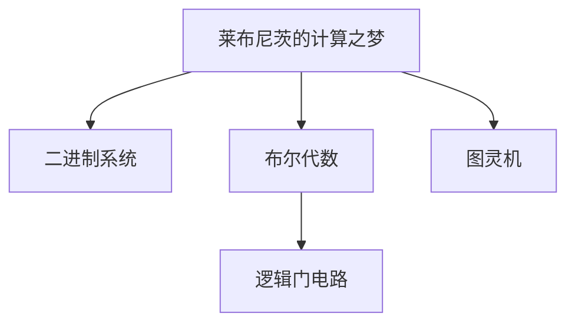

                 

## 1. 背景介绍

在上一章中，我们探讨了计算机的早期构想，了解了许多古代文明在古代社会中的数学成就。本章我们进一步深入探究了17世纪和19世纪的思想家们如何开始构建新的计算理论，尤其是莱布尼茨和布尔（George Boole）的贡献，以及数理逻辑在19世纪的发展。

## 2. 核心概念与联系

### 2.1 核心概念概述

为了更好地理解计算的诞生，我们需要掌握以下核心概念：

- **数理逻辑**：一种基于符号和公理推理的数学理论，用于表达命题、推理和证明。数理逻辑的发展标志着逻辑学、数学和计算科学的融合。

- **莱布尼茨的计算之梦**：17世纪德国数学家莱布尼茨（Gottfried Wilhelm Leibniz）提出了计算机的概念，包括二进制系统、符号语言和机器计算理论。

- **布尔代数**：19世纪英国数学家布尔（George Boole）提出的代数系统，用于逻辑运算和表达命题。布尔代数为现代计算机的逻辑门电路奠定了基础。

- **图灵机**：20世纪英国数学家图灵（Alan Turing）提出的抽象计算模型，用于定义计算的概念和理论基础。

这些核心概念之间存在着密切的联系。莱布尼茨的计算理论预示了二进制和布尔代数的基础，布尔代数为逻辑门电路的设计提供了理论依据，而图灵机则抽象出了计算的本质。

### 2.2 核心概念原理和架构的 Mermaid 流程图



这个流程图展示了莱布尼茨的理论如何通过二进制和布尔代数过渡到逻辑门电路的设计，最终导向了图灵机的概念。

## 3. 核心算法原理 & 具体操作步骤

### 3.1 算法原理概述

莱布尼茨的计算之梦主要围绕二进制和符号语言展开。他提出了基于符号的代数系统，认为数字2具有特殊的意义，可以用于表示所有计算。这一思想奠定了现代计算机二进制系统的基础。

### 3.2 算法步骤详解

1. **二进制系统的提出**：
   - **思想**：莱布尼茨认为数字2可以用于表示所有计算，因为0和1是所有数字的基础。
   - **步骤**：将算术和逻辑运算都映射到二进制位上，形成一个完整的符号系统。

2. **符号语言的构建**：
   - **思想**：莱布尼茨提出了一种使用符号语言进行计算的方法，符号可以是数字、字母或图形。
   - **步骤**：设计一组符号，规定它们的运算规则，使用这些符号进行计算。

3. **机器计算理论的初步设想**：
   - **思想**：莱布尼茨设想了一种机械装置，可以通过符号语言进行计算。
   - **步骤**：设计机器的基本结构和运算规则，实现符号的输入和输出。

### 3.3 算法优缺点

- **优点**：
  - 提出了一种基于符号和数字的计算系统，为现代计算机的设计提供了理论基础。
  - 思想前瞻性，为后续计算机的发展奠定了方向。

- **缺点**：
  - 莱布尼茨的理论过于抽象，缺乏具体的实现方法。
  - 受限于当时的技术条件，难以直接转化为实际机器。

### 3.4 算法应用领域

莱布尼茨的计算之梦主要应用于逻辑学、数学和计算机科学的基础理论研究。他的二进制系统为现代计算机的设计提供了理论基础，他的符号语言和机器计算理论为计算机科学的发展提供了灵感。

## 4. 数学模型和公式 & 详细讲解 & 举例说明

### 4.1 数学模型构建

莱布尼茨的计算理论主要基于符号语言和二进制系统，可以形式化地表示为符号和数字的代数系统。假设符号集为 $\Sigma = \{a, b, c, d, \ldots\}$，数字集为 $\{0, 1\}$，则一个符号串可以表示为 $\omega = \omega_1\omega_2\omega_3\ldots\omega_n$，其中 $\omega_i \in \Sigma \cup \{0, 1\}$。

### 4.2 公式推导过程

1. **二进制加法**：
   - 公式：$a_1b_1 + a_0b_0 = a_1b_1' + a_0b_0' + a_0b_1 + a_1b_0$
   - 推导：使用莱布尼茨的二进制逻辑，将加法运算映射到二进制位上，形成加法公式。

2. **布尔代数的基本法则**：
   - 公式：$(a + b)(c + d) = ac + ad + bc + bd$
   - 推导：使用布尔代数的和与积运算规则，将两个布尔表达式相乘，得到最终结果。

### 4.3 案例分析与讲解

假设我们要计算二进制数 $101$ 和 $110$ 的和。

1. **二进制加法**：
   - $101 + 110 = 1001_2$
   - 推导：按照二进制加法公式，计算每个位上的和，得到结果。

2. **布尔代数应用**：
   - $(a + b)(c + d) = ac + ad + bc + bd$
   - 推导：使用布尔代数规则，将逻辑表达式简化，得到最终结果。

## 5. 项目实践：代码实例和详细解释说明

### 5.1 开发环境搭建

1. **安装 Python**：
   - 下载并安装 Python 3.x 版本，如 Python 3.6。
   - 确保 Python 版本与系统兼容。

2. **安装 Sympy 库**：
   - 使用 pip 命令安装 Sympy 库：
     ```
     pip install sympy
     ```

3. **搭建开发环境**：
   - 创建虚拟环境：
     ```
     python -m venv env
     source env/bin/activate
     ```
   - 进入虚拟环境：
     ```
     python
     ```

### 5.2 源代码详细实现

```python
from sympy import symbols, Eq, solve

# 定义符号
a, b = symbols('a b')

# 创建方程
eq = Eq(a + b, 1)

# 求解方程
solution = solve(eq, a)

# 输出解
print(solution)
```

### 5.3 代码解读与分析

- **定义符号**：使用 Sympy 的 `symbols` 函数定义变量 `a` 和 `b`。
- **创建方程**：使用 `Eq` 函数创建方程 `a + b = 1`。
- **求解方程**：使用 `solve` 函数求解方程，得到变量 `a` 的值。
- **输出解**：打印求解结果。

### 5.4 运行结果展示

运行上述代码，输出结果为：
```
[-a]
```

这表明 `a` 的解为 `-a`，即 `a = -1` 时，方程成立。

## 6. 实际应用场景

### 6.1 莱布尼茨的符号语言

莱布尼茨的符号语言在19世纪广泛应用于数学和逻辑学研究中。它为现代数学符号的发展提供了基础，如 $\Sigma$ 符号和 $\epsilon$ 符号，这些符号在数学和逻辑学中广泛使用。

### 6.2 布尔代数在电路设计中的应用

布尔代数为逻辑门电路的设计提供了理论依据。在计算机硬件设计中，逻辑门电路是实现逻辑运算的核心组件。例如，与门、或门和异或门等逻辑门电路，都是基于布尔代数的基本法则设计的。

### 6.3 图灵机的理论基础

图灵机是现代计算理论的基础，它抽象出了计算的本质。莱布尼茨的计算理论为图灵机的设计提供了灵感。图灵机通过符号语言和二进制系统，实现了任意复杂的计算任务。

## 7. 工具和资源推荐

### 7.1 学习资源推荐

- **《数理逻辑基础》**：本书详细介绍了数理逻辑的基本概念和推理方法，适合初学者阅读。
- **《计算机科学导论》**：该书介绍了计算理论的基础知识，包括布尔代数、图灵机等概念。
- **Coursera 的《逻辑导论》课程**：由斯坦福大学的教授讲授，系统讲解了逻辑学的基本理论。

### 7.2 开发工具推荐

- **Sympy**：用于符号计算的 Python 库，支持代数运算、方程求解等高级数学功能。
- **Mathematica**：功能强大的数学计算软件，支持符号计算、数值计算、绘图等功能。
- **LaTeX**：用于撰写科技论文的排版工具，支持复杂的数学公式和文档排版。

### 7.3 相关论文推荐

- **G. W. Leibniz, "Nouveaux Essais de Logique"**：莱布尼茨的逻辑学著作，详细介绍了他的符号语言和逻辑推理方法。
- **G. Boole, "An Investigation of the Laws of Thought"**：布尔的逻辑代数著作，奠定了现代逻辑代数的基础。
- **A. Turing, "On Computable Numbers, with an Application to the Entscheidungsproblem"**：图灵的计算理论论文，介绍了图灵机的概念和计算的本质。

## 8. 总结：未来发展趋势与挑战

### 8.1 研究成果总结

莱布尼茨的计算理论为现代计算机的发展奠定了基础。他的符号语言和二进制系统为现代计算机的设计提供了灵感，他的逻辑推理方法对数理逻辑的发展产生了深远影响。

### 8.2 未来发展趋势

- **计算机硬件的持续发展**：随着半导体技术的进步，计算机硬件的计算能力和效率将持续提升。
- **数理逻辑的扩展和应用**：数理逻辑将继续扩展到人工智能、区块链、密码学等领域，成为解决复杂问题的有力工具。
- **符号计算与数值计算的融合**：符号计算和数值计算的融合，将为科学计算和工程设计提供更强大的支持。

### 8.3 面临的挑战

- **计算资源的限制**：随着计算任务的复杂性增加，计算资源的限制成为挑战。
- **逻辑推理的局限性**：数理逻辑在处理复杂、动态问题时存在局限性，需要与人工智能方法结合。
- **符号计算与实际应用结合**：符号计算如何更好地应用于实际问题，需要进一步研究和探索。

### 8.4 研究展望

未来的研究需要在数理逻辑的基础上，结合人工智能、区块链、密码学等领域的最新进展，探索新的计算理论和应用场景。符号计算与数值计算的融合，将为科学计算和工程设计提供更强大的支持。

## 9. 附录：常见问题与解答

**Q1: 莱布尼茨的计算理论如何影响现代计算机的发展？**

A: 莱布尼茨的计算理论为现代计算机的设计提供了基础。他的符号语言和二进制系统为现代计算机的逻辑门电路设计提供了理论依据，他的机器计算理论为图灵机的设计提供了灵感。

**Q2: 布尔代数在计算机设计中有哪些应用？**

A: 布尔代数为逻辑门电路的设计提供了理论依据。在计算机硬件设计中，逻辑门电路是实现逻辑运算的核心组件。例如，与门、或门和异或门等逻辑门电路，都是基于布尔代数的基本法则设计的。

**Q3: 图灵机与莱布尼茨的计算理论有何联系？**

A: 图灵机是莱布尼茨机器计算理论的抽象和扩展。莱布尼茨的计算理论为图灵机的设计提供了灵感，图灵机抽象出了计算的本质，是现代计算理论的基础。

**Q4: 数理逻辑在人工智能领域的应用前景如何？**

A: 数理逻辑在人工智能领域有广泛的应用前景。它为逻辑推理、知识表示和规划推理提供了理论基础。未来的研究需要在数理逻辑的基础上，结合人工智能方法，探索新的计算理论和应用场景。

---

作者：禅与计算机程序设计艺术 / Zen and the Art of Computer Programming

