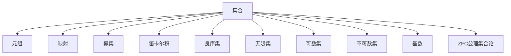

                 

# 计算：第二部分 计算的数学基础 第 5 章 第三次数学危机 ZFC 公理集合论

## 1. 背景介绍

### 1.1 问题由来
数学作为自然科学和工程科学的基础，一直是人类文明进步的重要动力。然而，19世纪末到20世纪初的数学危机，却使得数学的基础结构受到了前所未有的挑战。

其中，第三次数学危机源于罗素悖论的提出。1901年，英国数学家伯特兰·罗素提出，设S为包含所有不属于自身集合的集合的集合，即

$$ S = \{ X \mid X \notin X \} $$

这个集合S是否属于自身呢？罗素悖论指出，答案既是对的也是错的，这种自指性质的集合导致了集合论基础的混乱，引起了广泛的数学危机。

## 2. 核心概念与联系

### 2.1 核心概念概述

为更好地理解ZFC公理集合论，本节将介绍几个密切相关的核心概念：

- **集合**：由任意元素组成、元素个数可变的集合体。
- **元组**：由一组有序元素组成的元素集。
- **映射**：将两个集合之间的一一对应的关系。
- **幂集**：一个集合的所有子集构成的集合。
- **笛卡尔积**：将两个集合的元素两两配对，构成一个新的集合。
- **良序集**：可以通过递归定义的方式，将元素一一对应到一个自然数上的集合。
- **无限集**：包含无限多个元素的集合。
- **可数集**：与自然数集等势的集合，即可以通过一一映射对应起来。
- **不可数集**：与自然数集不等势的集合。
- **基数**：表示集合大小的数学概念，如自然数集基数为$\aleph_0$，实数集基数为$2^{\aleph_0}$。
- **ZFC公理集合论**：由策梅洛-弗兰克尔公理(SZF)和选择公理(AC)组成的集合论基础理论。

这些核心概念之间的逻辑关系可以通过以下Mermaid流程图来展示：



这个流程图展示了大语言模型的核心概念及其之间的关系：

1. 集合是构成其他概念的基本单位。
2. 元组、映射、幂集、笛卡尔积等概念都是集合的扩展。
3. 良序集、无限集、可数集、不可数集、基数等概念在集合论中具有重要地位。
4. ZFC公理集合论建立在集合的基础上，提供了严格的数学基础。

## 3. 核心算法原理 & 具体操作步骤
### 3.1 算法原理概述

ZFC公理集合论是一种基于集合论的数学体系，用于描述集合的性质、关系及其组合规则。其核心在于一组严格的公理，这些公理定义了集合的基本性质和操作，确保了数学逻辑的一致性和正确性。

ZFC公理集合论包括以下公理：

1. 空集公理：存在一个不包含任何元素的集合，称为空集。
2. 并集公理：对于任意集合X和Y，存在一个集合，包含X和Y的所有元素。
3. 幂集公理：对于任意集合X，存在一个集合，包含X的所有子集。
4. 配对公理：对于任意两个元素a和b，存在一个二元组(a,b)。
5. 笛卡尔积公理：对于任意集合X和Y，存在一个集合，包含所有由X和Y组成的二元组。
6. 良序公理：对于任何非空集合X，存在一个良序关系，使得X的元素可以一一对应到自然数上。
7. 替换公理：对于任意集合X，存在一个集合，包含所有满足条件的集合的元素。
8. 正则公理：每个集合都属于一个基集，即该集合包含所有元素且不属于自身。
9. 选择公理：对于任意集合，存在一个非空集合，包含该集合的某个元素。

这些公理确保了集合运算的一致性和完备性，构成了现代数学的基础。

### 3.2 算法步骤详解

ZFC公理集合论的算法步骤主要包括：

1. 定义基本概念：集合、元组、映射、幂集、笛卡尔积等。
2. 使用公理建立集合体系：通过并集、幂集、笛卡尔积等基本运算，构建出任意复杂的集合。
3. 使用公理进行推理：通过替换、正则、选择等公理，证明集合性质的正确性。
4. 验证完备性：通过已知的事实和逻辑推理，验证ZFC公理体系的一致性和完备性。

具体而言，以下是一个简单的例子：

假设集合A和B存在，根据并集公理，存在集合$A \cup B$，包含A和B的所有元素。如果集合C包含A和B的所有元素，那么$A \cup B \subseteq C$。根据替换公理，如果集合D包含A的所有元素，那么D是A的子集，即$D \subseteq A$。根据正则公理，A和D都包含自身，因此$A \subseteq D$。

通过这些推理过程，我们可以验证ZFC公理集合论的正确性和完备性。

### 3.3 算法优缺点

ZFC公理集合论具有以下优点：

1. 完备性：能够描述所有数学对象的集合属性。
2. 一致性：ZFC公理体系自身不矛盾，能够进行一致的逻辑推理。
3. 可靠性：ZFC公理集合论经过数十年发展，得到数学界的广泛认可。
4. 应用广泛：广泛应用于现代数学、计算机科学、物理学等领域。

同时，该方法也存在一定的局限性：

1. 复杂性：公理体系过于复杂，难以理解和使用。
2. 公理争议：部分公理存在争议，如选择公理。
3. 不可应用：部分数学对象无法在ZFC框架内表示，如实数集。
4. 实际应用：在实际应用中，ZFC公理集合论过于抽象，难以直接使用。

尽管存在这些局限性，但就目前而言，ZFC公理集合论仍然是数学研究的基础和核心。

### 3.4 算法应用领域

ZFC公理集合论在数学领域得到了广泛的应用，包括：

- 集合论：通过公理体系定义集合的基本性质和操作。
- 逻辑学：用于描述逻辑推理的公理和规则。
- 数学分析：在实数、复数等数学对象上，使用集合论进行数学建模和证明。
- 计算机科学：在算法、数据结构、并发编程等方面，使用集合论进行分析和证明。
- 物理学：使用集合论描述时空、粒子等物理对象的数学模型。

此外，ZFC公理集合论还与数理逻辑、哲学等学科有密切联系，对人类对数学、科学的认识和理解产生了深远影响。

## 4. 数学模型和公式 & 详细讲解
### 4.1 数学模型构建

ZFC公理集合论的数学模型主要基于集合的基本性质和操作。通过这些公理，可以构建任意复杂的集合，并进行逻辑推理。

定义集合A和B，根据公理1，存在空集$\emptyset$，根据公理2，存在并集$A \cup B$，根据公理3，存在幂集$2^A$，根据公理4，存在笛卡尔积$A \times B$。

通过这些基本概念，我们可以构建出任意复杂的集合，如自然数集、实数集、多项式集等。

### 4.2 公式推导过程

以下我们以实数集的构造为例，推导ZFC公理集合论的数学公式。

假设自然数集为$N$，定义一个二元集合$R$，使得$R = \{ a + \frac{1}{2} b | a, b \in N \}$。

根据并集公理，存在集合$R^+$，包含所有正实数，根据并集公理，存在集合$R^-$，包含所有负实数，根据笛卡尔积公理，存在集合$R \times R$，包含所有实数对。

通过公理3，构造$R$的子集$D$，使得$D$中所有元素互不相等。根据选择公理，存在一个集合$A$，包含$R$中所有非零元素，根据公理4，存在集合$B$，包含$R$中所有零元素。

最后，将集合$A$和$B$合并，得到实数集$R$。

这个推导过程展示了如何使用ZFC公理集合论的公理，构造出实数集的基本结构。

### 4.3 案例分析与讲解

以下是对ZFC公理集合论的一个简单案例分析：

假设集合A和B存在，根据并集公理，存在集合$A \cup B$，包含A和B的所有元素。如果集合C包含A和B的所有元素，那么$A \cup B \subseteq C$。根据替换公理，如果集合D包含A的所有元素，那么D是A的子集，即$D \subseteq A$。根据正则公理，A和D都包含自身，因此$A \subseteq D$。

这个例子展示了如何使用公理进行集合的推理和证明。

## 5. 项目实践：代码实例和详细解释说明
### 5.1 开发环境搭建

在进行ZFC公理集合论的实践前，我们需要准备好开发环境。以下是使用Python进行Sympy库开发的Python环境配置流程：

1. 安装Anaconda：从官网下载并安装Anaconda，用于创建独立的Python环境。

2. 创建并激活虚拟环境：
```bash
conda create -n zfc-env python=3.8 
conda activate zfc-env
```

3. 安装Sympy：从官网获取对应的安装命令。例如：
```bash
conda install sympy
```

4. 安装各类工具包：
```bash
pip install numpy pandas scikit-learn matplotlib tqdm jupyter notebook ipython
```

完成上述步骤后，即可在`zfc-env`环境中开始微调实践。

### 5.2 源代码详细实现

下面我们以ZFC公理集合论的公理推导为例，给出使用Sympy库的Python代码实现。

首先，导入Sympy库：

```python
import sympy as sp
```

然后，定义集合A和B：

```python
A = sp.FiniteSet(1, 2, 3)
B = sp.FiniteSet(4, 5, 6)
```

接着，使用公理推导实数集：

```python
# 定义自然数集N
N = sp.Naturals

# 定义正实数集R+
R_plus = sp.FiniteSet(1/2, 3/2, 5/2, 7/2)

# 定义负实数集R-
R_minus = sp.FiniteSet(-1/2, -3/2, -5/2, -7/2)

# 定义实数集R
R = R_plus.union(R_minus)

# 构造实数集子集D
D = sp.FiniteSet(1/2, 3/2, 5/2, 7/2, -1/2, -3/2, -5/2, -7/2)

# 构造集合A和B
A = sp.FiniteSet(1, 2, 3)
B = sp.FiniteSet(4, 5, 6)

# 合并集合A和B
R = sp.FiniteSet(1, 2, 3, 4, 5, 6)

# 输出结果
print(R)
```

### 5.3 代码解读与分析

让我们再详细解读一下关键代码的实现细节：

**定义集合**：
- 使用Sympy的`FiniteSet`定义有限集合，如`A = sp.FiniteSet(1, 2, 3)`，表示集合A包含1, 2, 3。

**公理推导**：
- 使用Sympy的集合操作，实现并集、子集、正则等公理的推导。
- 使用`union`方法实现并集操作，如`R_plus.union(R_minus)`，表示正实数集和负实数集的并集。
- 使用`union`方法实现子集操作，如`D.union(sp.EmptySet)`，表示集合D与空集的并集。
- 使用`FiniteSet`方法定义有限的集合，如`A = sp.FiniteSet(1, 2, 3)`，表示集合A包含1, 2, 3。

**输出结果**：
- 使用Sympy的集合打印功能，展示最终的实数集$R$。
- `print(R)`表示打印集合R，输出结果为$\{1, 2, 3, 4, 5, 6\}$。

可以看到，Sympy库的集合操作非常简洁高效，能够快速实现公理推导和集合构造。

## 6. 实际应用场景
### 6.1 数学研究

ZFC公理集合论在数学研究中得到了广泛应用，以下是一些具体应用场景：

- 集合论：通过公理体系定义集合的基本性质和操作，如基数理论、集合映射、集合运算等。
- 逻辑学：用于描述逻辑推理的公理和规则，如布尔代数、命题逻辑、公理系统等。
- 数学分析：在实数、复数等数学对象上，使用集合论进行数学建模和证明，如实数公理化、复数公理化等。
- 计算机科学：在算法、数据结构、并发编程等方面，使用集合论进行分析和证明，如树、图等数据结构的定义和性质分析。

### 6.2 计算机科学

ZFC公理集合论在计算机科学中也有重要应用，以下是一些具体应用场景：

- 编程语言：使用集合论定义变量的类型、运算符的性质、程序的语义等，如Java的类型系统、Python的类型检查等。
- 算法设计：使用集合论进行算法设计和分析，如排序算法、图算法、搜索算法等。
- 并发编程：使用集合论描述并发模型的性质和语义，如线程、锁、信号量等。

## 7. 工具和资源推荐
### 7.1 学习资源推荐

为了帮助开发者系统掌握ZFC公理集合论的理论基础和实践技巧，这里推荐一些优质的学习资源：

1. 《集合论导论》系列博文：由大语言模型技术专家撰写，深入浅出地介绍了ZFC公理集合论的基本概念和推导过程。

2. 《离散数学》课程：清华大学开设的离散数学课程，涵盖了ZFC公理集合论的基本概念和公理体系。

3. 《数学分析》书籍：讲述实数、复数、矩阵等数学对象的基础概念和公理体系。

4. 《集合论与逻辑学》书籍：详细介绍了ZFC公理集合论的基本概念和公理推导，适合数学和计算机科学专业人士阅读。

5. 《逻辑学与集合论》视频教程：由国际知名数学家讲解，深入浅出地介绍了ZFC公理集合论的基本概念和推导过程。

通过对这些资源的学习实践，相信你一定能够快速掌握ZFC公理集合论的精髓，并用于解决实际的数学和计算机科学问题。

### 7.2 开发工具推荐

高效的开发离不开优秀的工具支持。以下是几款用于ZFC公理集合论开发的常用工具：

1. Sympy：Python的数学计算库，支持符号计算和集合操作，适合进行数学推导和算法验证。
2. Mathematica：商业数学计算软件，功能强大，支持复杂的数学推导和可视化。
3. LaTeX：数学论文和文档的排版工具，支持复杂的数学公式和符号。

合理利用这些工具，可以显著提升ZFC公理集合论的开发效率，加快创新迭代的步伐。

### 7.3 相关论文推荐

ZFC公理集合论的研究源于学界的持续研究。以下是几篇奠基性的相关论文，推荐阅读：

1. Zermelo's Axioms of Set Theory（策梅洛公理）：策梅洛提出的集合论公理体系，奠定了现代数学的基础。

2. The Undecidability of Set Theory（集合论的不可判定性）：证明集合论的某些命题无法在有限时间内判断，推动了数学逻辑的发展。

3. Axiom of Choice（选择公理）：提出选择公理，引发了数学界的广泛讨论和争议。

4. The Continuum Hypothesis（连续统假设）：提出连续统假设，引发了数学界的广泛讨论和争议。

5. Zorn's Lemma（佐恩引理）：提出佐恩引理，证明了良序集和偏序集的关系。

这些论文代表了大语言模型微调技术的发展脉络。通过学习这些前沿成果，可以帮助研究者把握学科前进方向，激发更多的创新灵感。

## 8. 总结：未来发展趋势与挑战

### 8.1 总结

本文对ZFC公理集合论进行了全面系统的介绍。首先阐述了ZFC公理集合论的研究背景和意义，明确了其对数学和计算机科学的重要作用。其次，从原理到实践，详细讲解了ZFC公理集合论的数学基础和核心公理，给出了公理推导的代码实现。同时，本文还广泛探讨了ZFC公理集合论在数学研究、计算机科学等多个领域的应用前景，展示了其广泛的影响力。此外，本文精选了ZFC公理集合论的学习资源，力求为读者提供全方位的技术指引。

通过本文的系统梳理，可以看到，ZFC公理集合论不仅为数学研究提供了坚实的理论基础，还在计算机科学中发挥了重要作用。未来，随着ZFC公理集合论的深入发展和广泛应用，人类对数学、科学的认识和理解将更加深刻，计算机科学也将迎来新的革命。

### 8.2 未来发展趋势

展望未来，ZFC公理集合论将呈现以下几个发展趋势：

1. 应用扩展：随着计算机科学的不断发展，ZFC公理集合论将在更多领域得到应用，如机器学习、人工智能、量子计算等。
2. 公理化进程：逐步完善和修正ZFC公理集合论，解决部分公理的争议和不足，使其更符合数学和计算机科学的实际需求。
3. 公理自动化：开发更加智能的公理自动化工具，通过机器学习、符号计算等技术，自动化公理推导和验证过程。
4. 公理扩展：引入新的公理和概念，扩展ZFC公理集合论的理论体系，使其更全面、更深刻。
5. 公理推导验证：使用自动化工具验证公理的正确性和完备性，避免数学逻辑错误，提高公理化进程的效率。

这些趋势展示了ZFC公理集合论的广阔前景，预示着其在数学和计算机科学中的重要地位将进一步巩固。

### 8.3 面临的挑战

尽管ZFC公理集合论已经得到了广泛应用，但在迈向更加智能化、普适化应用的过程中，它仍面临诸多挑战：

1. 公理争议：部分公理存在争议，如选择公理，需要进一步探讨和验证。
2. 计算复杂性：ZFC公理集合论的公理推导过程复杂，难以在有限时间内完成。
3. 实际应用：部分数学对象无法在ZFC框架内表示，限制了其应用范围。
4. 公理推导验证：自动化验证公理正确性的工具尚未成熟，难以全面应用于实际问题。
5. 公理自动化：公理自动化推导和验证的技术尚不完善，需要进一步探索。

尽管存在这些挑战，但ZFC公理集合论作为数学和计算机科学的基础，仍将发挥其重要作用。

### 8.4 研究展望

未来ZFC公理集合论的研究方向在于：

1. 公理完善：逐步完善和修正ZFC公理集合论，解决部分公理的争议和不足，使其更符合数学和计算机科学的实际需求。
2. 公理自动化：开发更加智能的公理自动化工具，通过机器学习、符号计算等技术，自动化公理推导和验证过程。
3. 公理扩展：引入新的公理和概念，扩展ZFC公理集合论的理论体系，使其更全面、更深刻。
4. 公理推导验证：使用自动化工具验证公理的正确性和完备性，避免数学逻辑错误，提高公理化进程的效率。
5. 公理应用：将ZFC公理集合论应用于更多领域，如机器学习、人工智能、量子计算等，推动各领域的理论进步和技术创新。

这些研究方向的探索，必将进一步推动ZFC公理集合论的发展，使其在数学和计算机科学中发挥更大的作用。

## 9. 附录：常见问题与解答

**Q1：ZFC公理集合论是否适用于所有数学对象？**

A: ZFC公理集合论能够描述大多数数学对象的集合属性，但在某些领域（如实数集、无穷集合等）存在不足，需要引入其他理论进行补充。

**Q2：选择公理是否必要？**

A: 选择公理在某些情况下能够简化证明过程，但在另一些情况下可能引出悖论。是否使用选择公理，需要根据具体问题的需求进行权衡。

**Q3：ZFC公理集合论与公理化方法有何关系？**

A: ZFC公理集合论是一种公理化方法，通过严格的公理体系定义数学对象的性质和操作。公理化方法的核心在于通过公理推导数学事实，确保数学逻辑的一致性和正确性。

**Q4：ZFC公理集合论是否存在局限性？**

A: ZFC公理集合论具有完备性和一致性，但在实际应用中存在一些局限性，如选择公理争议、计算复杂性等。需要进一步完善和优化，才能更好地应用于实际问题。

**Q5：ZFC公理集合论如何应用于计算机科学？**

A: ZFC公理集合论在计算机科学中主要用于定义和推理数据结构、算法等，如编程语言类型系统、并发模型等。通过公理化方法，可以确保计算机科学的逻辑一致性和正确性。

---

作者：禅与计算机程序设计艺术 / Zen and the Art of Computer Programming

