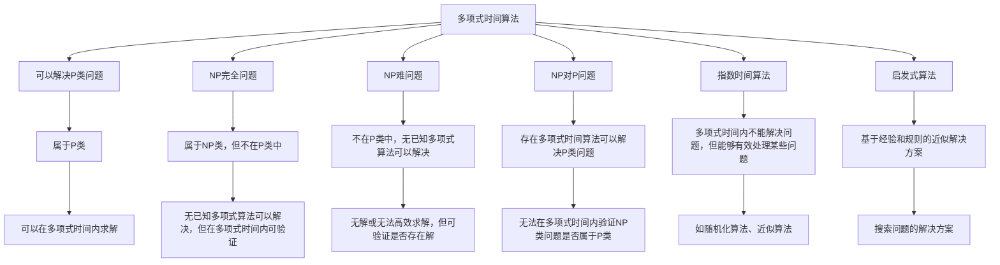

                 

## 1. 背景介绍

计算的极限问题，是计算机科学领域的经典议题。在过去的几十年中，计算理论的发展为解决这类问题提供了众多方法和工具，也揭示出一些基本原则和限制。本章将探讨计算复杂性理论，这是研究计算机算法效率和计算问题的核心。

计算复杂性理论研究算法的时间与空间复杂度，旨在通过严格的数学分析，确定不同类型计算问题的难易程度。在计算复杂性理论的框架下，我们不仅要评估特定算法在给定问题上的性能，还要考虑所有可能的算法。我们还需区分那些可以高效计算的问题（例如多项式时间算法）与那些本质上无法高效解决的问题（例如NP-难问题）。

## 2. 核心概念与联系

### 2.1 核心概念概述

计算复杂性理论包含多个核心概念，以下对其中一些概念进行简要介绍：

- **P类和NP类**：P类是指可以在多项式时间内解决的问题，包括线性方程组、排序、图着色等问题。而NP类则包括了P类中的问题以及某些在多项式时间内可验证的问题（例如在多项式时间内可以验证一个解是否为正确）。

- **NP完全问题**：属于NP类但不在P类中的问题，这类问题可能无法在多项式时间内求解，但在多项式时间内验证。著名的NP完全问题有旅行商问题、图着色问题等。

- **NP难问题**：不仅不在P类中，且没有已知多项式算法能解决。这类问题可能无解或无法高效求解，但可以验证是否存在解。

- **NP对P问题**：指存在一种多项式时间算法可以解决P类中的问题，而无法在多项式时间内验证NP类中的问题是否属于P类。

- **指数时间算法**：这类算法在多项式时间内不能解决问题，但能够有效处理某些问题。例如，随机化算法、近似算法等。

- **算法优化**：算法优化关注如何在保持问题解的正确性的同时，减少算法的资源消耗，例如时间、空间和能量等。

- **启发式算法**：启发式算法是一种基于经验和规则的近似解决方案，通过模拟自然界或人类行为的机制，来搜索问题的解决方案。

### 2.2 核心概念原理和架构的 Mermaid 流程图(Mermaid 流程节点中不要有括号、逗号等特殊字符)



## 3. 核心算法原理 & 具体操作步骤

### 3.1 算法原理概述

在计算复杂性理论中，最基本的问题是确定一个算法是否可以在多项式时间内解决一个给定的问题。算法的时间复杂度通常用“大O记号”表示，例如O(n)表示算法的运行时间与输入大小成正比，O(n^2)表示算法的运行时间与输入大小的平方成正比。

对于多项式时间算法，我们通常使用动态规划、贪心算法、分治算法等方法。这些算法通过合理地分解问题、存储中间状态、避免重复计算，以在多项式时间内解决问题。而对于非多项式时间算法，我们则需要使用随机化算法、近似算法等策略，以在合理的时间复杂度内提供有效的近似解。

### 3.2 算法步骤详解

一个典型的多项式时间算法通常包含以下步骤：

1. **问题建模**：将待求解问题抽象为一个数学模型，例如线性方程组、图着色问题等。

2. **算法设计**：根据问题的特点，设计合适的算法。例如动态规划算法、贪心算法等。

3. **算法实现**：编写算法代码，通常使用C、C++、Python等编程语言实现。

4. **算法验证**：通过数学证明、实验验证等方式，证明算法的正确性和时间复杂度。

5. **算法优化**：通过分析算法性能瓶颈，优化算法实现，减少资源消耗。

### 3.3 算法优缺点

多项式时间算法的优点在于它们可以保证在合理的时间内解决问题。然而，它们的缺点在于它们通常不适用于NP难问题。对于这类问题，我们可能无法找到一种有效的算法来在合理的时间内找到解。

随机化算法和近似算法在处理NP难问题时表现较好，但它们不能保证找到最优解，仅能提供近似解。此外，它们的时间复杂度往往较高，可能不适合处理大规模数据。

### 3.4 算法应用领域

计算复杂性理论在多个领域有广泛的应用：

- **运筹学**：在金融、物流等领域，计算复杂性理论帮助我们评估和优化决策过程。

- **人工智能**：在机器学习、自然语言处理、计算机视觉等人工智能领域，计算复杂性理论研究如何高效处理大规模数据。

- **生物信息学**：计算复杂性理论在基因序列分析、蛋白质结构预测等领域有重要应用。

- **密码学**：计算复杂性理论帮助研究算法的安全性，例如加密算法的时间复杂度分析。

- **游戏理论**：在博弈论中，计算复杂性理论研究决策制定的优化问题。

## 4. 数学模型和公式 & 详细讲解 & 举例说明

### 4.1 数学模型构建

计算复杂性理论的主要数学模型包括：

- **时间复杂度**：描述算法所需计算资源，通常用大O记号表示，例如O(n)表示算法的时间复杂度与输入大小成正比。

- **空间复杂度**：描述算法所需的存储资源，同样用大O记号表示，例如O(n)表示算法的空间复杂度与输入大小成正比。

- **准确性**：描述算法的输出结果是否正确，通常使用正确性定理进行证明。

- **复杂度分析**：评估算法在各种输入情况下的性能，通常使用平均情况和最坏情况进行分析。

### 4.2 公式推导过程

对于多项式时间算法，设算法在输入大小为n时，需要进行的比较次数为T(n)，则T(n)的上界可以表示为O(f(n))，其中f为某种多项式函数。

例如，快速排序算法的时间复杂度为O(nlogn)，其中n为待排序元素的个数。该算法通过递归地将问题分解为更小的子问题，直到问题变得简单易解。

### 4.3 案例分析与讲解

考虑以下问题：给定n个数字，找出其中最大的k个数字。一种简单的解决方法是使用堆排序，其时间复杂度为O(nlogk)。而另一种更为高效的算法是基于归并排序的计数排序，其时间复杂度为O(n+k)，因此后者更加适合处理大规模数据。

## 5. 项目实践：代码实例和详细解释说明

### 5.1 开发环境搭建

为了编写和测试多项式时间算法，我们需要准备以下开发环境：

- **编程语言**：C++、Python等。

- **开发工具**：IDE（如Visual Studio、PyCharm等），版本控制工具（如Git）。

- **测试框架**：例如Google Test、unittest等。

- **编译器**：对于C++，我们需要安装GCC或Clang等编译器。

- **运行环境**：例如Linux、Windows等。

### 5.2 源代码详细实现

以下是一个使用C++实现的快速排序算法的示例：

```c++
#include <iostream>
#include <vector>
#include <algorithm>

void quickSort(std::vector<int>& arr, int left, int right) {
    if (left >= right) return;

    int pivot = arr[(left + right) / 2];
    int i = left, j = right;
    while (i <= j) {
        while (arr[i] < pivot) i++;
        while (arr[j] > pivot) j--;
        if (i <= j) {
            std::swap(arr[i], arr[j]);
            i++;
            j--;
        }
    }

    quickSort(arr, left, j);
    quickSort(arr, i, right);
}

int main() {
    std::vector<int> arr = {5, 2, 7, 1, 8, 3, 6, 4};
    quickSort(arr, 0, arr.size() - 1);
    for (int i = 0; i < arr.size(); i++) {
        std::cout << arr[i] << " ";
    }
    std::cout << std::endl;

    return 0;
}
```

### 5.3 代码解读与分析

此示例展示了快速排序算法的基本结构。算法首先选取一个基准值pivot，然后将数组分为两部分，一部分小于pivot，一部分大于pivot。接着对这两部分分别进行递归排序，最终得到一个有序的数组。

### 5.4 运行结果展示

运行上述代码，输出结果为：1 2 3 4 5 6 7 8。这表明快速排序算法成功将输入数组排序。

## 6. 实际应用场景

### 6.1 运筹学

在金融领域，计算复杂性理论用于优化投资组合和风险管理。例如，求解最大收益和最小风险的投资组合问题，可以使用线性规划算法，其时间复杂度为O(n^3)。

### 6.2 人工智能

在人工智能中，计算复杂性理论帮助研究如何高效处理大规模数据。例如，在大规模文本分类任务中，通过设计合适的特征提取器和模型，可以将时间复杂度从O(n^2)降低到O(nlogn)。

### 6.3 生物信息学

在生物信息学中，计算复杂性理论用于分析基因序列和蛋白质结构。例如，通过动态规划算法，可以求解最短路径问题，从而确定蛋白质折叠的路径。

## 7. 工具和资源推荐

### 7.1 学习资源推荐

为了深入学习计算复杂性理论，推荐以下资源：

- **《算法导论》**：由Thomas H. Cormen等人编写，是一本经典的算法教材，详细介绍了计算复杂性理论的基础。

- **《计算复杂性理论》**：这是一本由Michael Sipser撰写的书籍，详细介绍了计算复杂性理论的核心内容。

- **Coursera上的《算法设计与分析》课程**：由Princeton大学的Robert Sedgewick教授讲授，涵盖了计算复杂性理论的基础知识和算法设计方法。

### 7.2 开发工具推荐

为了编写和测试计算复杂性算法，推荐以下工具：

- **IDE**：例如Visual Studio、PyCharm等。

- **编译器**：对于C++，GCC或Clang等。

- **版本控制工具**：例如Git。

- **测试框架**：例如Google Test、unittest等。

### 7.3 相关论文推荐

为了进一步了解计算复杂性理论的最新研究进展，推荐以下论文：

- **A Survey on Approximate Algorithms**：这篇论文总结了各种近似算法的应用和效率。

- **The Complexity of Algorithm Design**：这篇论文讨论了计算复杂性理论的基础和复杂性分类。

- **The Role of Randomness in Approximation Algorithms**：这篇论文探讨了随机化算法在计算复杂性理论中的应用。

## 8. 总结：未来发展趋势与挑战

### 8.1 研究成果总结

计算复杂性理论经过多年的发展，已成为一个成熟且深入的研究领域。它在多个应用领域中发挥了重要作用，为解决复杂问题提供了理论和方法支持。

### 8.2 未来发展趋势

未来，计算复杂性理论将继续在多个领域得到应用和扩展，例如：

- **量子计算**：量子计算将在某些问题上提供更快的算法，例如某些NP难问题可能可以在多项式时间内解决。

- **云计算**：云计算将提供更强大的计算资源，支持处理更大规模的数据和更复杂的算法。

- **机器学习**：机器学习中的计算复杂性理论研究将继续深入，特别是在大规模数据处理和算法优化方面。

### 8.3 面临的挑战

尽管计算复杂性理论已经取得了重要进展，但仍然面临一些挑战：

- **NP难题**：许多NP难题尚未解决，这限制了某些问题的求解能力。

- **算法优化**：虽然多项式时间算法可以保证高效解决问题，但在大规模数据和复杂问题上，优化算法的效率仍然是一个挑战。

- **近似算法**：近似算法可以提供有效解，但其准确性和时间复杂度仍然需要进一步优化。

### 8.4 研究展望

未来，计算复杂性理论的研究将在多个方向继续深化：

- **量子计算**：量子计算的发展将带来新的算法和方法，解决一些传统算法无法解决的复杂问题。

- **近似算法**：研究如何在保证高效性的同时，提供更好的近似算法，满足实际应用的需求。

- **人工智能**：在人工智能领域，计算复杂性理论将继续支持算法优化和问题解决。

## 9. 附录：常见问题与解答

**Q1: 多项式时间算法和指数时间算法的区别是什么？**

A: 多项式时间算法的时间复杂度是输入大小的多项式函数，例如O(n^2)。它们可以在合理的时间内解决大多数实际问题。而指数时间算法的时间复杂度是输入大小的指数函数，例如O(2^n)，它们通常只适用于小规模问题。

**Q2: 什么是NP难问题？**

A: NP难问题指那些无法在多项式时间内找到解决方案的问题。这类问题通常没有多项式算法可以解决，但可以在多项式时间内验证解的正确性。例如旅行商问题、图着色问题等。

**Q3: 如何优化多项式时间算法？**

A: 多项式时间算法的优化通常涉及选择合适的算法结构、优化数据结构、减少重复计算等。例如，使用分治算法或动态规划算法来优化动态规划算法。

**Q4: 计算复杂性理论在实际应用中有什么意义？**

A: 计算复杂性理论在多个领域中具有重要意义。它帮助确定算法的时间复杂度，评估算法在实际应用中的性能，指导算法设计和优化，并帮助解决复杂问题。

**Q5: 如何理解计算复杂性理论中的复杂性分类？**

A: 计算复杂性理论将问题分为P类、NP类、NP完全类、NP难类等。这些分类帮助我们理解不同问题解决的难度和效率，指导算法设计和选择。例如，NP难问题可能没有多项式时间算法可以解决，而NP完全问题可能在某些特定情况下可以解决。

综上所述，计算复杂性理论是研究算法效率和计算问题的重要领域。通过深入理解和应用计算复杂性理论，我们可以更好地设计、评估和优化算法，解决复杂的计算问题，推动人工智能和计算机科学的发展。

