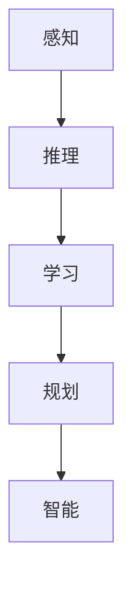

                 

## 1. 背景介绍

### 1.1 问题由来
在人工智能(AI)的发展历程中，机器智能一直是核心的研究主题。从早期基于规则的系统，到后来的符号主义和联结主义，再到近期的深度学习范式，机器智能的实现路径不断演进，形成了今天充满活力和多样性的AI研究与应用生态。然而，究竟什么是机器智能，以及如何定义、构建、评估和应用它，始终是一个亟待深入探讨的问题。

机器智能的探讨不仅涉及技术层面，还与伦理、社会、经济等多个维度紧密相关。在算法日益复杂的今天，明确机器智能的定义，成为推动AI技术走向成熟、健康、可控发展的关键一步。

### 1.2 问题核心关键点
机器智能的核心关键点包括：

- **定义与边界**：机器智能到底是指什么？是具备和人类一样的认知能力，还是能够执行某些特定的任务？
- **构建与实现**：如何让机器具备智能？是采用基于规则的系统、符号主义方法、联结主义模型，还是深度学习范式？
- **评估与检验**：如何评价一个系统是否具备智能？是依赖人类的主观判断，还是通过特定的指标和测试任务进行量化评估？
- **应用与影响**：机器智能如何应用到实际问题中？是否应该限制其应用范围，以避免潜在的风险和负面影响？

这些问题涉及技术、伦理、社会等多个方面，是AI研究与实践需要不断思考和探讨的主题。

### 1.3 问题研究意义
明确机器智能的定义，有助于指导AI技术的研究方向，推动技术规范化和标准化，从而促进AI技术的健康发展。对于从业者和政策制定者而言，清晰的定义和边界将有助于制定科学合理的技术发展路径和伦理规范，确保AI技术的安全、可靠和公平。

此外，机器智能的定义和应用，还直接影响着人类社会的发展方向和未来愿景。AI技术在未来将成为解决众多社会问题的重要工具，包括医疗、教育、交通、环境保护等。因此，对机器智能的定义与边界进行深入讨论，对于构建一个健康、可持续的AI生态系统具有重要意义。

## 2. 核心概念与联系

### 2.1 核心概念概述
机器智能涉及多个核心概念，包括：

- **智能(Smartness)**：指系统能够通过感知、学习、推理、规划等方式自主完成任务的能力。
- **学习(Learning)**：指系统通过数据和经验进行自我改进和优化的过程。
- **推理(Inference)**：指系统根据已知信息推导出新知识或结论的能力。
- **感知(Perception)**：指系统从环境中获取、处理和理解信息的能力。
- **规划(Planning)**：指系统制定和执行行动计划，实现目标的能力。

这些概念之间相互关联，共同构成了机器智能的完整框架。

### 2.2 核心概念原理和架构的 Mermaid 流程图(Mermaid 流程节点中不要有括号、逗号等特殊字符)


这个流程图展示了感知、推理、学习、规划与智能之间的联系。感知系统获取环境信息，推理系统根据信息推导出新知识，学习系统通过经验不断改进，规划系统制定和执行行动计划，最终形成系统的智能表现。

## 3. 核心算法原理 & 具体操作步骤
### 3.1 算法原理概述

机器智能的构建和实现，通常基于以下基本原理：

- **符号主义(Symbolic AI)**：基于规则和逻辑的推理系统，通过符号操作实现知识表示和推理。
- **联结主义(Connective AI)**：基于神经网络的学习系统，通过反向传播算法优化参数，实现对数据的拟合和预测。
- **深度学习(Deep Learning)**：一种特殊的联结主义模型，通过多层神经网络对大规模数据进行深度抽象和特征学习，实现更高级别的模式识别和决策。

这些方法各有优缺点，适用于不同的应用场景。符号主义适用于需要明确规则和逻辑的应用，如专家系统；联结主义适用于处理大规模非结构化数据，如图像识别、自然语言处理；深度学习则适用于需要处理复杂模式识别和决策的问题，如图像分类、语音识别。

### 3.2 算法步骤详解

构建和实现机器智能通常包括以下关键步骤：

**Step 1: 数据获取与预处理**
- 收集和整理训练数据集，去除噪声和冗余信息。
- 进行数据增强和标准化处理，提高数据的质量和多样性。

**Step 2: 模型设计**
- 选择合适的算法和模型结构，如神经网络、规则引擎等。
- 设计模型的输入输出接口，定义任务目标和评价指标。

**Step 3: 模型训练**
- 使用训练数据对模型进行训练，调整参数以最小化误差。
- 使用验证数据集进行模型评估，避免过拟合和欠拟合。

**Step 4: 模型评估与测试**
- 在测试数据集上评估模型性能，使用各种指标（如准确率、召回率、F1分数等）进行量化评估。
- 进行实际应用测试，验证模型的泛化能力和实际效果。

**Step 5: 部署与应用**
- 将模型部署到实际应用环境中，进行生产环境的运行和监控。
- 持续收集反馈数据，进行模型更新和优化。

### 3.3 算法优缺点
- **优点**：
  - 可以处理大规模非结构化数据，如图像、文本等。
  - 能够自动提取和抽象特征，适用于复杂模式识别和决策。
  - 可以通过数据积累不断提升性能，具备自我学习的能力。
- **缺点**：
  - 对数据和计算资源有较高要求，需要大量标注数据和高性能硬件。
  - 模型复杂度高，难以解释其决策过程，存在“黑盒”问题。
  - 训练时间长，模型更新和优化需要大量时间。

### 3.4 算法应用领域
机器智能在各个领域均有广泛应用，包括但不限于：

- **医疗**：通过图像识别、自然语言处理等技术，辅助医生进行诊断和治疗。
- **金融**：使用机器学习模型进行风险评估、投资决策等。
- **零售**：通过客户行为分析，提供个性化推荐和营销策略。
- **交通**：利用传感器和机器学习技术，实现智能交通管理和自动驾驶。
- **制造**：通过预测和优化生产流程，提高生产效率和产品质量。

## 4. 数学模型和公式 & 详细讲解 & 举例说明
### 4.1 数学模型构建

机器智能的构建通常依赖于数学模型。以下是一个简单的机器学习模型的数学模型构建：

假设训练数据集为 $D=\{(x_i, y_i)\}_{i=1}^N$，其中 $x_i$ 为输入特征，$y_i$ 为标签。定义模型为 $f(x; \theta)$，其中 $\theta$ 为模型参数。模型训练的目标是最小化损失函数：

$$
\min_{\theta} \frac{1}{N}\sum_{i=1}^N \ell(f(x_i; \theta), y_i)
$$

其中 $\ell$ 为损失函数，常用的有均方误差、交叉熵等。

### 4.2 公式推导过程

以线性回归为例，假设模型 $f(x; \theta) = \theta_0 + \theta_1 x_1 + \theta_2 x_2$，其中 $\theta_0, \theta_1, \theta_2$ 为模型参数。使用均方误差作为损失函数，则有：

$$
\ell(y, \hat{y}) = (y - \hat{y})^2
$$

代入上述数学模型，得：

$$
\min_{\theta} \frac{1}{N}\sum_{i=1}^N (y_i - \theta_0 - \theta_1 x_{i1} - \theta_2 x_{i2})^2
$$

使用梯度下降算法进行参数更新：

$$
\theta_j \leftarrow \theta_j - \eta \frac{\partial \ell}{\partial \theta_j}
$$

其中 $\eta$ 为学习率，$\frac{\partial \ell}{\partial \theta_j}$ 为损失函数对 $\theta_j$ 的梯度。

### 4.3 案例分析与讲解

以图像分类任务为例，使用卷积神经网络(CNN)进行模型构建。CNN通常包含多个卷积层、池化层和全连接层，能够自动学习输入数据的特征表示。假设使用LeNet-5网络进行图像分类，输入为28x28像素的灰度图像，输出为10类标签。

模型输入为 $x \in \mathbb{R}^{28 \times 28}$，经过多个卷积层和池化层后，得到特征表示 $h \in \mathbb{R}^{128}$。使用全连接层将特征映射到10类标签：

$$
\hat{y} = \sigma(\theta_1 h + \theta_2)
$$

其中 $\sigma$ 为 sigmoid 函数。使用交叉熵作为损失函数：

$$
\ell(y, \hat{y}) = -\frac{1}{N} \sum_{i=1}^N y_i \log \hat{y}_i + (1 - y_i) \log (1 - \hat{y}_i)
$$

通过反向传播算法进行参数更新，不断迭代训练，直到模型收敛。

## 5. 项目实践：代码实例和详细解释说明
### 5.1 开发环境搭建

使用Python和TensorFlow进行项目实践，需要安装以下依赖包：

```bash
pip install tensorflow numpy matplotlib sklearn
```

### 5.2 源代码详细实现

以下是一个简单的TensorFlow图像分类模型的代码实现：

```python
import tensorflow as tf
import numpy as np
import matplotlib.pyplot as plt
import sklearn.metrics

# 加载数据集
(x_train, y_train), (x_test, y_test) = tf.keras.datasets.mnist.load_data()

# 数据预处理
x_train = x_train.reshape(-1, 28*28).astype('float32') / 255
x_test = x_test.reshape(-1, 28*28).astype('float32') / 255
y_train = tf.keras.utils.to_categorical(y_train)
y_test = tf.keras.utils.to_categorical(y_test)

# 构建模型
model = tf.keras.Sequential([
    tf.keras.layers.Dense(128, activation='relu', input_shape=(784,)),
    tf.keras.layers.Dense(10, activation='softmax')
])

# 编译模型
model.compile(optimizer='adam', loss='categorical_crossentropy', metrics=['accuracy'])

# 训练模型
model.fit(x_train, y_train, epochs=10, batch_size=32, validation_data=(x_test, y_test))

# 评估模型
loss, accuracy = model.evaluate(x_test, y_test)
print(f'Test loss: {loss:.3f}')
print(f'Test accuracy: {accuracy:.3f}')
```

### 5.3 代码解读与分析

**数据加载与预处理**：
- 使用TensorFlow的内置数据集模块加载MNIST数据集。
- 将图像数据展平为一维向量，并进行归一化处理，将像素值映射到[0,1]区间。
- 使用to_categorical将标签转换为one-hot编码。

**模型构建**：
- 定义一个包含一个隐层和一个输出层的全连接神经网络。
- 使用ReLU作为隐层激活函数，softmax作为输出层激活函数，进行多分类预测。

**模型训练与评估**：
- 使用Adam优化器，交叉熵损失函数，准确率作为评价指标，进行模型训练。
- 在测试集上评估模型性能，输出测试损失和准确率。

## 6. 实际应用场景
### 6.1 医疗诊断

机器智能在医疗诊断中具有广泛应用，包括疾病预测、影像识别、病历分析等。例如，通过深度学习模型对医学影像进行分类，可以辅助医生进行快速、准确的诊断。使用自然语言处理技术对病历进行情感分析，可以提升医疗服务质量和效率。

### 6.2 智能推荐

智能推荐系统能够根据用户行为和偏好，提供个性化的商品或内容推荐。例如，电商平台可以使用协同过滤、基于内容的推荐等算法，为用户提供最适合的商品推荐。视频流媒体平台可以使用基于协同过滤和深度学习模型，进行个性化视频推荐。

### 6.3 金融风险管理

金融领域需要实时监控市场风险，预测股票价格波动。机器智能可以通过分析历史数据和市场情绪，进行风险预测和预警。例如，使用深度学习模型对金融新闻进行情感分析，可以预测市场情绪，辅助投资决策。

### 6.4 智能交通

智能交通管理系统可以通过摄像头和传感器采集数据，使用机器学习模型进行实时分析，优化交通信号控制，提高交通效率。例如，使用深度学习模型对交通流量进行预测，可以实时调整信号灯设置，减少交通拥堵。

### 6.5 智慧城市

智慧城市建设需要利用机器智能技术，进行城市管理和公共服务优化。例如，使用机器学习模型对城市公共数据进行分析，可以优化能源分配、交通管理、公共安全等服务。使用自然语言处理技术对社交媒体进行情感分析，可以监测公共舆情，提升城市治理水平。

## 7. 工具和资源推荐
### 7.1 学习资源推荐

为了帮助开发者系统掌握机器智能的理论基础和实践技巧，这里推荐一些优质的学习资源：

1. 《深度学习》系列书籍：Ian Goodfellow等人所著，深入浅出地介绍了深度学习的基本概念和算法。
2. 《机器学习实战》书籍：Peter Harrington所著，提供了丰富的实践案例，适合初学者入门。
3. CS231n《卷积神经网络》课程：斯坦福大学开设的计算机视觉课程，讲解了CNN的基本原理和应用。
4. Coursera《机器学习》课程：Andrew Ng教授所开设的课程，系统讲解了机器学习的基本理论和算法。
5. Google AI公开课：Google提供的一系列免费AI课程，涵盖深度学习、自然语言处理、机器学习等多个方向。

### 7.2 开发工具推荐

高效的开发离不开优秀的工具支持。以下是几款用于机器智能开发的常用工具：

1. PyTorch：基于Python的开源深度学习框架，灵活、高效，支持GPU加速。
2. TensorFlow：由Google主导开发的深度学习框架，生产部署方便，支持分布式计算。
3. Keras：高层次的神经网络API，易于上手，支持多种深度学习框架。
4. Scikit-learn：Python的机器学习库，提供了丰富的算法和工具。
5. OpenCV：计算机视觉库，提供了多种图像处理和分析功能。

### 7.3 相关论文推荐

机器智能的研究源于学界的持续探索。以下是几篇奠基性的相关论文，推荐阅读：

1. 《ImageNet Classification with Deep Convolutional Neural Networks》：AlexNet论文，提出了深度卷积神经网络架构，推动了计算机视觉的快速发展。
2. 《Human-Level Speech Recognition Using Deep Neural Networks》：Hinton等人所著，展示了深度学习在语音识别中的应用潜力。
3. 《Long Short-Term Memory》：Hochreiter等人所著，介绍了循环神经网络，解决了序列数据处理问题。
4. 《Attention is All You Need》：Transformer论文，提出了Transformer模型，彻底改变了自然语言处理的方向。
5. 《AlphaGo Zero》：DeepMind的研究成果，展示了深度强化学习在复杂博弈问题中的应用。

## 8. 总结：未来发展趋势与挑战

### 8.1 研究成果总结

机器智能的研究已经取得显著进展，并在多个领域展示了巨大的应用潜力。然而，机器智能的实现仍然面临诸多挑战，包括：

- 数据隐私和安全问题：机器智能需要大量数据进行训练，如何保护用户隐私和数据安全，是亟待解决的问题。
- 模型透明性和可解释性：深度学习模型的“黑盒”性质，使得其决策过程难以解释，需要开发更多可解释性强的算法和工具。
- 计算资源限制：机器智能需要高性能计算资源，如何在资源受限的情况下，提高模型的训练和推理效率，是未来的重要研究方向。
- 算法偏见问题：机器智能模型可能会学习到训练数据中的偏见，需要开发公平、公正的算法，避免模型偏见对社会产生负面影响。

### 8.2 未来发展趋势

未来机器智能的发展趋势包括：

- 模型的透明性和可解释性：更多的研究将致力于开发可解释性强的算法和工具，帮助用户理解机器智能的决策过程。
- 数据隐私和伦理问题：随着数据隐私意识的提升，如何保护用户隐私和数据安全，将是未来研究的重要方向。
- 计算资源优化：通过模型压缩、量化加速等技术，提高模型的训练和推理效率，降低计算资源需求。
- 算法公平性：开发更多公平、公正的机器智能算法，避免算法偏见对社会产生负面影响。

### 8.3 面临的挑战

尽管机器智能取得了显著进展，但未来仍面临诸多挑战：

- 数据隐私和安全问题：机器智能需要大量数据进行训练，如何保护用户隐私和数据安全，是亟待解决的问题。
- 模型透明性和可解释性：深度学习模型的“黑盒”性质，使得其决策过程难以解释，需要开发更多可解释性强的算法和工具。
- 计算资源限制：机器智能需要高性能计算资源，如何在资源受限的情况下，提高模型的训练和推理效率，是未来的重要研究方向。
- 算法偏见问题：机器智能模型可能会学习到训练数据中的偏见，需要开发公平、公正的算法，避免模型偏见对社会产生负面影响。

### 8.4 研究展望

未来的研究需要在以下几个方面寻求新的突破：

- 开发更多公平、公正的机器智能算法，避免算法偏见对社会产生负面影响。
- 提高机器智能模型的透明性和可解释性，帮助用户理解模型的决策过程。
- 保护用户隐私和数据安全，开发更多保护隐私的技术和工具。
- 优化计算资源，提高模型的训练和推理效率，降低资源需求。

这些研究方向将推动机器智能技术的不断进步，为社会带来更广泛的应用和更多的好处。

## 9. 附录：常见问题与解答

**Q1：机器智能的实现需要哪些关键技术？**

A: 机器智能的实现通常依赖于以下几个关键技术：

- 数据获取与预处理：收集和整理训练数据集，去除噪声和冗余信息。
- 模型设计：选择合适的算法和模型结构，如神经网络、规则引擎等。
- 模型训练：使用训练数据对模型进行训练，调整参数以最小化误差。
- 模型评估与测试：在测试数据集上评估模型性能，使用各种指标进行量化评估。
- 模型部署与应用：将模型部署到实际应用环境中，进行生产环境的运行和监控。

**Q2：深度学习模型有哪些优缺点？**

A: 深度学习模型的优缺点包括：

- 优点：
  - 能够处理大规模非结构化数据，如图像、文本等。
  - 能够自动提取和抽象特征，适用于复杂模式识别和决策。
  - 可以通过数据积累不断提升性能，具备自我学习的能力。
- 缺点：
  - 对数据和计算资源有较高要求，需要大量标注数据和高性能硬件。
  - 模型复杂度高，难以解释其决策过程，存在“黑盒”问题。
  - 训练时间长，模型更新和优化需要大量时间。

**Q3：如何保护用户隐私和数据安全？**

A: 保护用户隐私和数据安全，可以采取以下措施：

- 数据匿名化：对敏感信息进行脱敏处理，避免泄露用户隐私。
- 数据加密：使用加密技术保护数据在传输和存储过程中的安全性。
- 差分隐私：在数据发布时添加噪声，避免个人隐私被泄露。
- 访问控制：限制数据的访问权限，确保只有授权人员可以访问数据。

**Q4：如何提高模型的透明性和可解释性？**

A: 提高模型的透明性和可解释性，可以采取以下措施：

- 模型可视化：使用可视化工具，展示模型内部结构和学习过程。
- 特征重要性分析：使用特征重要性分析方法，解释模型预测的关键特征。
- 可解释性算法：开发更多可解释性强的算法和工具，帮助用户理解模型决策过程。
- 对抗样本分析：通过对抗样本分析，揭示模型漏洞和决策偏差。

**Q5：机器智能的未来发展方向有哪些？**

A: 机器智能的未来发展方向包括：

- 模型的透明性和可解释性：更多的研究将致力于开发可解释性强的算法和工具，帮助用户理解机器智能的决策过程。
- 数据隐私和伦理问题：随着数据隐私意识的提升，如何保护用户隐私和数据安全，将是未来研究的重要方向。
- 计算资源优化：通过模型压缩、量化加速等技术，提高模型的训练和推理效率，降低计算资源需求。
- 算法公平性：开发更多公平、公正的机器智能算法，避免算法偏见对社会产生负面影响。

以上问题与解答，希望能为读者提供关于机器智能的全面理解，促进其在各个领域的应用和发展。

---

作者：禅与计算机程序设计艺术 / Zen and the Art of Computer Programming

