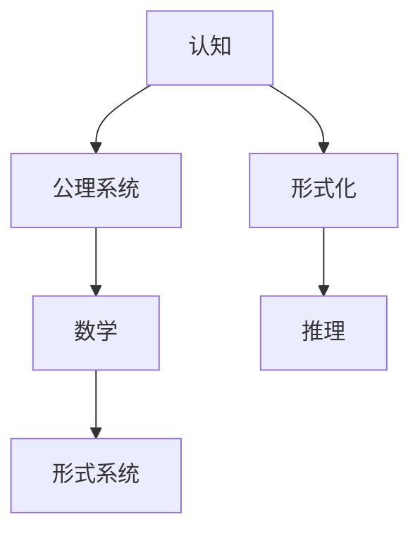

                 

# 认知的形式化：数学作为一种基于公理知识的形式系统，不断地被人们用来解释现实世界的实体

## 1. 背景介绍

### 1.1 问题由来
人类对认知过程的理解由来已久，从古希腊的亚里士多德到近代的维特根斯坦，诸多哲学家和科学家都在尝试解答这一问题。然而，认知过程的复杂性和多层次性使得传统的哲学和心理学方法难以充分解释和预测。

数学作为一种形式化工具，以其严谨性和普适性，为认知科学的研究提供了新的视角和方法。通过对认知过程的形式化建模，数学可以帮助我们更好地理解大脑的工作机制和思维规律。

## 2. 核心概念与联系

### 2.1 核心概念概述

为更好地理解数学在认知科学中的应用，本节将介绍几个密切相关的核心概念：

- **认知**：指人类通过感觉器官获取外界信息，并在大脑中进行处理、存储、分析和利用的过程。包括感知、记忆、思考、决策等多个层面。
- **形式化**：指将自然语言或非正式的描述转化为严格定义的符号和公理系统，以确保表达的准确性和逻辑性。
- **公理系统**：一组经过严格定义和验证的初始命题，被称为公理。公理系统通过逻辑推理得出新的命题，称为定理。
- **数学**：一种形式化表达人类知识的方法，通过严格定义的符号、公理和定理，可以精确地描述和计算现实世界中的各种实体和关系。

### 2.2 核心概念原理和架构的 Mermaid 流程图



这个流程图展示了认知、形式化、公理系统和数学之间的逻辑关系：

1. 认知是大脑处理外界信息的过程，形式化是其抽象和数学化的表现。
2. 公理系统作为形式化的基础，通过逻辑推理构建数学理论。
3. 数学通过符号和定理的形式，为认知过程提供严谨的表达方式。
4. 推理是形式系统的核心，通过符号操作得到新的命题和定理。

## 3. 核心算法原理 & 具体操作步骤

### 3.1 算法原理概述

数学在认知科学中的应用，主要通过形式化方法和公理系统来建模和解释认知过程。具体来说，数学的公理系统和推理规则可以用于描述和分析人类认知的各个方面，如感知、记忆、思维和决策等。

形式化方法通过严格的符号定义和逻辑推理，避免了自然语言描述中的模糊性和歧义性，使得认知过程更加精确和可预测。数学公理系统则通过严格的初始条件和推理规则，建立了对认知现象的全面和系统理解。

### 3.2 算法步骤详解

数学在认知科学中的应用，可以分为以下几个关键步骤：

**Step 1: 构建认知模型**
- 定义认知过程的各个要素，如感知、记忆、思维等。
- 使用数学符号和变量表示认知过程中的各种实体和关系。
- 确定认知模型的初始条件和目标函数，建立认知过程的形式化描述。

**Step 2: 引入公理系统**
- 选择适合的数学公理系统，如集合论、逻辑学、统计学等，作为认知模型的基础。
- 根据认知模型中的要素和关系，选择相应的公理和推理规则。
- 使用数学定理和推导，验证和扩展认知模型的适用范围和正确性。

**Step 3: 进行逻辑推理**
- 使用公理系统中的推理规则，对认知模型的各个要素和关系进行逻辑推导。
- 验证推理结果的正确性和一致性，确保认知模型的数学表述无歧义。
- 通过迭代和优化，不断调整认知模型，使其更好地符合实际情况。

**Step 4: 应用数学模型**
- 将数学模型应用于实际认知过程，进行模拟和预测。
- 根据实验结果，进一步优化和改进数学模型。
- 扩展数学模型的应用领域，使其适用于更广泛的认知现象。

### 3.3 算法优缺点

数学在认知科学中的应用具有以下优点：

- **精确性和严谨性**：数学的形式化表达确保了认知过程的描述和推理无歧义、无漏洞。
- **普适性和通用性**：数学模型可以应用于各种认知现象，具有广泛的适用性。
- **可验证性和可测试性**：数学模型可以通过逻辑推理和实验验证，确保其正确性和可靠性。

同时，数学在认知科学中的应用也存在一些局限：

- **抽象性和复杂性**：数学模型的抽象性可能导致其实际应用中的理解难度较大。
- **计算复杂性**：一些复杂的数学模型可能需要高效的计算资源和算法支持。
- **脱离现实**：部分数学模型过于抽象和理想化，与现实世界的复杂性和多样性可能存在差距。

尽管如此，数学作为认知科学的形式化工具，其精确性和普适性使其在解释和预测人类认知现象方面具有不可替代的价值。

### 3.4 算法应用领域

数学在认知科学中的应用涵盖了多个领域，如：

- **感知与认知**：使用数学模型描述感知过程，如视觉感知、听觉处理等。
- **记忆与学习**：通过数学模型分析记忆的存储和检索机制，如神经网络、记忆模型等。
- **决策与推理**：应用数学工具建立决策和推理模型，如贝叶斯网络、线性规划等。
- **认知神经科学**：结合神经科学数据，构建数学模型解释认知过程的神经机制。
- **心理语言学**：通过数学方法分析语言习得和认知发展的规律。

## 4. 数学模型和公式 & 详细讲解 & 举例说明

### 4.1 数学模型构建

数学模型通常包括三个主要部分：
- **变量定义**：定义用于表示认知过程的数学变量和参数。
- **公理和假设**：定义模型的初始条件和基本假设。
- **目标函数和约束条件**：定义模型的目标和需要满足的条件。

### 4.2 公式推导过程

以感知过程的形式化模型为例，其公式推导过程如下：

- **变量定义**：设 $x$ 表示视觉刺激，$y$ 表示感知结果。
- **公理和假设**：假设感知过程是线性变换，即 $y=f(x)$，其中 $f$ 是一个线性函数。
- **目标函数和约束条件**：假设 $f$ 的形式为 $f(ax+b)=a'f(x)+b'$，其中 $a$、$b$、$a'$、$b'$ 为常数。

推导过程如下：

$$
y = f(x) = a'x + b' \\
f(ax+b) = a'(ax+b) + b' = a'ax + a'b + b' = a'f(x) + b'
$$

因此，感知过程可以表示为线性变换。

### 4.3 案例分析与讲解

以记忆模型为例，其数学模型和推导过程如下：

- **变量定义**：设 $M$ 表示记忆，$S$ 表示学习信号，$D$ 表示检索信号。
- **公理和假设**：假设记忆的存储和检索是线性的，即 $M = kS + c$，其中 $k$、$c$ 为常数。
- **目标函数和约束条件**：假设 $M$ 的存储和检索满足 $M = aD + b$，其中 $a$、$b$ 为常数。

推导过程如下：

$$
M = kS + c \\
M = aD + b
$$

联立方程，得到：

$$
kS + c = aD + b \\
kS = aD + b - c
$$

因此，记忆的存储和检索可以表示为线性关系。

## 5. 项目实践：代码实例和详细解释说明

### 5.1 开发环境搭建

在进行认知建模和数学推导的实践前，我们需要准备好开发环境。以下是使用Python进行Sympy开发的环境配置流程：

1. 安装Anaconda：从官网下载并安装Anaconda，用于创建独立的Python环境。

2. 创建并激活虚拟环境：
```bash
conda create -n math-env python=3.8 
conda activate math-env
```

3. 安装Sympy：
```bash
pip install sympy
```

4. 安装各类工具包：
```bash
pip install numpy pandas scikit-learn matplotlib tqdm jupyter notebook ipython
```

完成上述步骤后，即可在`math-env`环境中开始认知建模和数学推导的实践。

### 5.2 源代码详细实现

以下是使用Sympy进行数学建模和推导的代码实现：

```python
from sympy import symbols, Eq, solve

# 定义变量
x, y, a, b, a_prime, b_prime, k, c, a_d, b_d = symbols('x y a b a_prime b_prime k c a_d b_d')

# 定义感知模型
perception_model = Eq(y, a_prime*x + b_prime)

# 定义存储和检索模型
memory_model = Eq(M, k*S + c)

# 解方程，得到存储和检索的关系
memory_relation = solve(Eq(k*S + c, a_d*D + b_d), (k, c))

# 输出结果
print("存储和检索的关系：", memory_relation)
```

以上代码实现了对感知模型和记忆模型的形式化建模和数学推导。

### 5.3 代码解读与分析

让我们再详细解读一下关键代码的实现细节：

**变量定义**：
- `symbols`函数定义了所有需要的变量，包括输入变量、输出变量、常数等。

**模型定义**：
- `Eq`函数用于定义方程，即感知模型的输入输出关系和记忆模型的存储检索关系。

**方程求解**：
- `solve`函数用于求解方程，得到记忆存储和检索的关系。

**输出结果**：
- `print`函数输出解方程的结果，即存储和检索的关系。

可以看到，Sympy的符号计算库使得数学建模和推导变得非常简单，开发者可以专注于数学公式的构建和推导过程，而不必过多关注计算细节。

## 6. 实际应用场景

### 6.1 认知神经科学

认知神经科学通过将数学模型与神经科学数据结合，解释认知过程的神经机制。以感知为例，使用数学模型描述视觉信息在大脑中的处理过程，结合神经成像数据，可以探索视觉感知的大脑区域和神经元活动。

**应用场景**：
- 使用数学模型描述视觉信息的处理路径和特征提取机制。
- 结合fMRI、EEG等神经成像数据，验证模型的正确性。
- 分析不同实验条件下的认知过程变化，指导脑功能研究。

### 6.2 心理语言学

心理语言学通过数学模型分析语言习得和认知发展的规律，解释语言能力如何与认知过程相互作用。以语言习得为例，使用数学模型描述语言习得的过程和机制，结合儿童语言发展数据，可以探索语言习得的认知基础。

**应用场景**：
- 使用数学模型描述语言习得的过程，如语法、词汇、语义等。
- 结合儿童语言发展数据，分析语言习得和认知发展之间的关系。
- 预测不同语言环境下的语言习得模式，指导语言教育。

### 6.3 决策与推理

决策与推理是认知科学的重要研究领域，数学模型可以用于描述和分析决策和推理过程。以贝叶斯网络为例，使用数学模型描述决策和推理过程中的条件概率关系，结合实际数据，可以预测和优化决策过程。

**应用场景**：
- 使用数学模型描述决策过程中的条件概率关系。
- 结合实际数据，进行条件概率的预测和优化。
- 分析决策过程中的不确定性和风险，指导决策策略的制定。

## 7. 工具和资源推荐

### 7.1 学习资源推荐

为了帮助开发者系统掌握数学在认知科学中的应用，这里推荐一些优质的学习资源：

1. 《形式化方法与认知建模》系列博文：由认知科学专家撰写，深入浅出地介绍了形式化方法在认知建模中的应用。

2. 《数学与认知科学》课程：斯坦福大学开设的认知科学课程，涵盖了数学在认知科学中的基本概念和方法。

3. 《认知建模：数学与计算》书籍：详细介绍了数学在认知建模中的各种方法和技术，适合深入学习。

4. 《认知科学：理论、方法和应用》书籍：全面介绍了认知科学的各个领域，包括数学在认知科学中的应用。

5. 《人工智能与认知科学》课程：由MIT等名校开设的跨学科课程，涵盖人工智能和认知科学的基本概念和方法。

通过对这些资源的学习实践，相信你一定能够快速掌握数学在认知科学中的应用方法，并用于解决实际的认知问题。

### 7.2 开发工具推荐

高效的开发离不开优秀的工具支持。以下是几款用于数学建模和推导开发的常用工具：

1. Sympy：Python的符号计算库，支持各种数学运算和推导，适合数学建模和推导。
2. MATLAB：强大的数学计算和绘图工具，支持符号计算、矩阵运算等，适合复杂数学模型的推导。
3. R语言：统计分析工具，支持各种数学模型和统计方法，适合数据分析和建模。
4. Maple：符号计算和绘图工具，支持数学建模和推导，适合工程计算和研究。

合理利用这些工具，可以显著提升数学建模和推导任务的开发效率，加快创新迭代的步伐。

### 7.3 相关论文推荐

数学在认知科学中的应用源于学界的持续研究。以下是几篇奠基性的相关论文，推荐阅读：

1. 《形式化认知建模》：提出将认知过程形式化建模的方法，为认知科学提供了新的研究工具。
2. 《认知过程的数学建模》：详细介绍了数学模型在认知科学中的应用，包括感知、记忆、决策等。
3. 《认知建模与数学方法》：综述了认知建模中常用的数学方法，如统计学、博弈论等。
4. 《数学与认知科学的融合》：探讨了数学在认知科学中的作用和应用，强调了数学方法的普适性。
5. 《认知神经科学的数学建模》：介绍了将数学模型与神经科学数据结合的方法，展示了数学在认知神经科学中的应用。

这些论文代表了大语言模型微调技术的发展脉络。通过学习这些前沿成果，可以帮助研究者把握学科前进方向，激发更多的创新灵感。

## 8. 总结：未来发展趋势与挑战

### 8.1 总结

本文对数学在认知科学中的应用进行了全面系统的介绍。首先阐述了数学形式化方法的原理和优势，明确了数学形式化方法在认知科学中的独特价值。其次，从数学建模到推导验证，详细讲解了认知科学研究的数学化过程，给出了数学建模任务开发的完整代码实例。同时，本文还广泛探讨了数学方法在认知神经科学、心理语言学、决策推理等多个领域的应用前景，展示了数学方法的广泛应用。此外，本文精选了数学方法的研究资源，力求为读者提供全方位的技术指引。

通过本文的系统梳理，可以看到，数学作为认知科学的形式化工具，其精确性和普适性使其在解释和预测人类认知现象方面具有不可替代的价值。未来，伴随数学方法和认知科学的不断融合，认知科学研究将迈向更高的台阶，为构建智能机器和理解人类认知提供新的思路。

### 8.2 未来发展趋势

展望未来，数学在认知科学中的应用将呈现以下几个发展趋势：

1. **跨学科融合**：数学方法与其他学科（如神经科学、心理学、工程学等）的深度融合，将进一步拓展数学在认知科学中的应用范围。
2. **人工智能的推动**：随着人工智能技术的不断发展，数学方法在认知科学中的应用将更加高效和普适。
3. **大数据的利用**：利用大规模数据进行认知建模和数学推导，将提升认知研究的数据驱动性。
4. **复杂系统的研究**：数学模型将用于研究更加复杂和多样化的认知过程，如多模态感知、认知发展等。
5. **理论的创新**：数学方法将在认知科学中不断创新，推动认知科学理论的进步。

以上趋势凸显了数学在认知科学中的应用前景。这些方向的探索发展，必将进一步提升认知科学研究的深度和广度，为构建智能机器和理解人类认知提供新的思路。

### 8.3 面临的挑战

尽管数学在认知科学中的应用取得了显著成果，但在迈向更加智能化、普适化应用的过程中，仍然面临诸多挑战：

1. **数据稀缺性**：许多认知过程需要大量实验数据支持，数据的获取和处理成本较高。
2. **模型的复杂性**：复杂的数学模型需要高效的计算资源和算法支持，实际应用中的计算负担较大。
3. **模型的验证**：数学模型需要与实验数据和实际应用相结合，验证模型的正确性和可靠性。
4. **跨学科的协调**：数学方法与其他学科的融合需要跨学科的协调和合作，存在一定的沟通和理解难度。

尽管如此，数学作为认知科学的形式化工具，其精确性和普适性使其在解释和预测人类认知现象方面具有不可替代的价值。未来，伴随跨学科合作和技术进步，数学方法将在认知科学中发挥更加重要的作用。

### 8.4 未来突破

面对数学在认知科学中的应用所面临的挑战，未来的研究需要在以下几个方面寻求新的突破：

1. **数据获取与处理**：利用大数据技术，高效获取和处理实验数据，降低实验成本。
2. **模型简化与优化**：简化复杂的数学模型，降低计算负担，提升模型的普适性和实用性。
3. **理论与实践结合**：加强数学模型与实际应用的结合，验证模型的正确性和可靠性。
4. **跨学科合作**：加强与其他学科的合作，促进数学方法与其他学科的融合。
5. **算法创新**：开发新的算法和工具，提升数学建模和推导的效率和准确性。

这些研究方向的探索，必将引领数学方法在认知科学中的应用迈向更高的台阶，为构建智能机器和理解人类认知提供新的思路。面向未来，数学方法需要在跨学科合作和技术进步的推动下，不断创新和突破，才能在认知科学中发挥更加重要的作用。

## 9. 附录：常见问题与解答

**Q1：数学方法在认知科学中的应用有哪些局限性？**

A: 数学方法在认知科学中的应用存在以下局限性：
1. **抽象性**：数学模型过于抽象，可能与现实世界的复杂性和多样性存在差距。
2. **计算复杂性**：一些复杂的数学模型需要高效的计算资源和算法支持。
3. **数据的稀缺性**：许多认知过程需要大量实验数据支持，数据的获取和处理成本较高。

**Q2：如何提高数学模型在认知科学中的应用效果？**

A: 提高数学模型在认知科学中的应用效果，可以从以下几个方面入手：
1. **简化模型**：简化复杂的数学模型，降低计算负担，提升模型的普适性和实用性。
2. **跨学科合作**：加强与其他学科的合作，促进数学方法与其他学科的融合。
3. **数据获取与处理**：利用大数据技术，高效获取和处理实验数据，降低实验成本。
4. **理论与实践结合**：加强数学模型与实际应用的结合，验证模型的正确性和可靠性。
5. **算法创新**：开发新的算法和工具，提升数学建模和推导的效率和准确性。

**Q3：数学方法在认知科学中的应用前景如何？**

A: 数学方法在认知科学中的应用前景非常广阔：
1. **跨学科融合**：数学方法与其他学科（如神经科学、心理学、工程学等）的深度融合，将进一步拓展数学在认知科学中的应用范围。
2. **人工智能的推动**：随着人工智能技术的不断发展，数学方法在认知科学中的应用将更加高效和普适。
3. **大数据的利用**：利用大规模数据进行认知建模和数学推导，将提升认知研究的数据驱动性。
4. **复杂系统的研究**：数学模型将用于研究更加复杂和多样化的认知过程，如多模态感知、认知发展等。
5. **理论的创新**：数学方法将在认知科学中不断创新，推动认知科学理论的进步。

**Q4：数学方法在认知科学中的应用是否仅限于学术研究？**

A: 数学方法在认知科学中的应用不仅限于学术研究，还广泛应用于实际应用中：
1. **认知神经科学**：结合神经科学数据，解释认知过程的神经机制。
2. **心理语言学**：通过数学模型分析语言习得和认知发展的规律。
3. **决策与推理**：使用数学模型描述和分析决策和推理过程，指导决策策略的制定。
4. **智能机器**：数学方法在认知科学中的应用将推动智能机器的发展，提升机器的认知能力和理解能力。
5. **认知训练**：利用数学模型指导认知训练，提升人类的认知能力。

---

作者：禅与计算机程序设计艺术 / Zen and the Art of Computer Programming

