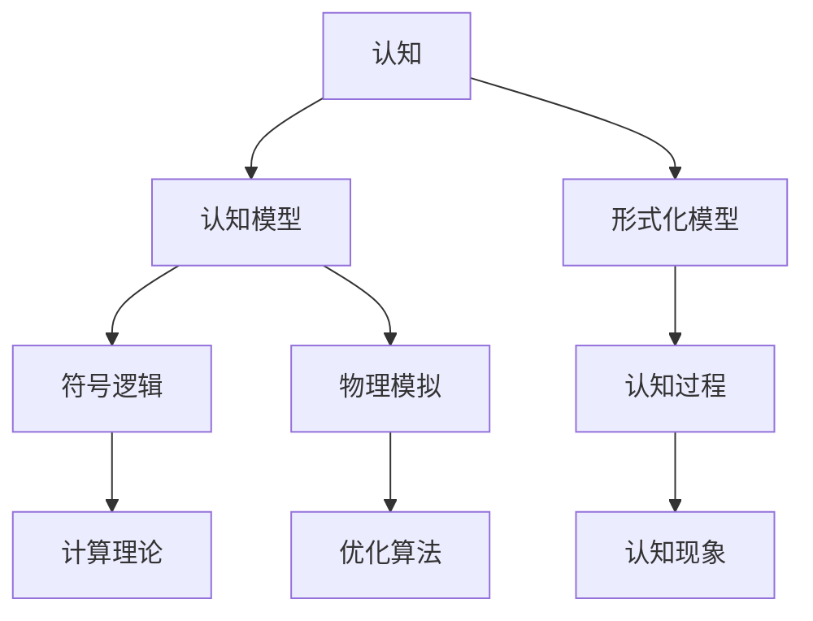

                 

## 1. 背景介绍

### 1.1 问题由来
在物理学和数学的发展过程中，出现了一些重大的概念和理论，这些理论不仅在科学领域引起了革命性的变化，还在逻辑思维和认知形式化方面产生了深远的影响。认知形式化，即通过抽象化的数学和物理模型来理解和描述人类认知过程，为解决复杂的自然现象提供了新的视角和方法。

### 1.2 问题核心关键点
认知形式化的核心关键点包括：

- **形式化模型**：通过数学语言和物理规律对认知过程进行抽象表达。
- **符号逻辑**：使用符号逻辑表示和推理认知中的命题和推理规则。
- **物理模拟**：借助物理模型模拟认知过程中神经元的激活和信息传递。
- **计算理论**：利用计算复杂度理论评估认知模型的复杂性和可行性。
- **优化算法**：通过优化算法优化认知模型的参数和结构。

这些关键点共同构成了认知形式化的基础框架，帮助研究者从多角度理解认知过程和解决实际问题。

### 1.3 问题研究意义
研究认知形式化对于理解人类认知机制、开发智能算法以及推动人工智能技术的发展具有重要意义：

1. **理论深度**：为理解认知现象提供了数学和物理层面的理论基础，有助于深入解析人类思维和行为的底层机制。
2. **算法创新**：推动了算法设计和优化的创新，使得智能算法能够更好地模拟和优化人类认知过程。
3. **应用拓展**：拓展了人工智能应用的范围，尤其是在模拟推理、问题解决、决策制定等领域的应用。
4. **跨学科融合**：促进了物理学、数学、心理学、神经科学等学科的交叉融合，形成了更综合的认知研究框架。
5. **伦理和安全**：推动了认知模型在伦理、隐私、安全性等方面的研究和应用，提升了智能系统的可解释性和可信度。

## 2. 核心概念与联系

### 2.1 核心概念概述

在探讨认知形式化的核心概念之前，首先需要明确几个关键术语：

- **认知**：指人类的思维和认知过程，包括感知、记忆、推理、决策等。
- **认知模型**：通过数学和物理模型模拟人类认知过程的计算模型。
- **符号逻辑**：使用符号和逻辑规则表示认知中的命题和推理过程的逻辑系统。
- **物理模拟**：通过物理模型和计算模拟神经元的激活和信息传递，用于认知模拟。

### 2.2 核心概念原理和架构的 Mermaid 流程图(Mermaid 流程节点中不要有括号、逗号等特殊字符)



这个流程图展示了认知形式化的核心概念及其之间的关系：

1. 认知通过形式化模型进行抽象表示。
2. 形式化模型通过符号逻辑和物理模拟进一步细化。
3. 符号逻辑和物理模拟在计算理论框架下得到优化和验证。
4. 优化算法用于调整认知模型的参数和结构。
5. 认知模型最终应用于模拟认知过程和解决实际问题。

## 3. 核心算法原理 & 具体操作步骤

### 3.1 算法原理概述

认知形式化的核心算法原理可以概括为以下几个步骤：

1. **符号化表示**：将认知过程中的关键元素和关系抽象为符号和逻辑表达式。
2. **物理模型构建**：基于神经科学和物理学原理，建立认知过程中神经元激活和信息传递的数学模型。
3. **计算理论应用**：利用计算复杂度理论，评估认知模型的计算复杂度和可行性。
4. **优化算法优化**：使用优化算法对认知模型的参数和结构进行调整，以提升模型的精度和效率。
5. **形式化推理**：在符号逻辑框架下，进行形式化推理和验证，确保认知模型的逻辑正确性。

### 3.2 算法步骤详解

认知形式化的具体算法步骤如下：

**Step 1: 符号化表示**  
- 使用符号逻辑系统表示认知过程中的命题和推理规则。
- 将认知过程划分为不同的阶段和模块，如感知、记忆、推理等。
- 使用变量和函数符号表示认知过程中的变量和操作。

**Step 2: 物理模型构建**  
- 基于神经科学原理，构建神经元激活的数学模型。
- 使用物理学中的微分方程和偏微分方程描述信息传递和动态变化。
- 建立神经元和神经元之间的连接关系，模拟信息传递的局部和全局动态。

**Step 3: 计算理论应用**  
- 利用计算复杂度理论，评估认知模型的计算复杂度。
- 使用NP问题、P问题等理论框架，分析认知模型求解的难易程度。
- 使用复杂度分析方法，确定模型在时间和空间上的资源需求。

**Step 4: 优化算法优化**  
- 使用梯度下降、遗传算法等优化算法调整认知模型的参数。
- 利用机器学习算法，根据数据反馈优化模型结构和功能。
- 使用自动微分化技术，加速认知模型的参数更新和模型优化。

**Step 5: 形式化推理**  
- 在符号逻辑框架下，进行形式化推理和验证。
- 使用自动化推理工具，如Prolog、Horn推理机等，验证模型的逻辑正确性。
- 利用形式化验证技术，确保认知模型在各种输入条件下都能正确推理。

### 3.3 算法优缺点

认知形式化算法具有以下优点：

1. **精确性**：通过数学和物理模型，可以精确模拟认知过程，减少人为误差。
2. **可解释性**：基于符号逻辑和物理模型的推理过程透明，便于理解和调试。
3. **可扩展性**：适用于多种认知任务，可以通过扩展模型来应对新的认知需求。
4. **适用广泛**：可以应用于多种复杂问题的建模和求解。

但同时，认知形式化算法也存在一些局限：

1. **复杂度高**：建立精确的数学和物理模型需要高深的数学和物理学知识。
2. **计算量大**：复杂的符号逻辑和物理模型计算量巨大，需要强大的计算资源。
3. **数据依赖**：对数据质量和数量的依赖较高，需要足够的数据进行模型训练和验证。
4. **工程挑战**：模型构建和优化过程繁琐，需要经验丰富的工程师。

### 3.4 算法应用领域

认知形式化算法在多个领域得到了广泛应用：

1. **人工智能**：用于模拟推理、问题解决、决策制定等任务，提升智能系统的决策能力和鲁棒性。
2. **认知科学**：研究人类认知过程的机制和规律，推动对人类思维和行为的深入理解。
3. **神经科学**：基于神经元激活模型，研究脑神经网络的信息传递和认知功能。
4. **教育技术**：用于模拟学习者的认知过程，辅助个性化教育的设计和实施。
5. **心理学**：通过符号逻辑和物理模型，研究心理现象的认知机制和规律。

## 4. 数学模型和公式 & 详细讲解 & 举例说明（备注：数学公式请使用latex格式，latex嵌入文中独立段落使用 $$，段落内使用 $)
### 4.1 数学模型构建

认知形式化的数学模型构建通常涉及以下几个关键步骤：

1. **符号化表示**：将认知过程抽象为符号和逻辑表达式。
2. **数学建模**：使用数学模型表示认知过程中的变量和操作。
3. **物理建模**：基于物理学原理，建立认知过程中神经元激活和信息传递的模型。

### 4.2 公式推导过程

以神经元激活模型为例，推导其数学公式。神经元激活模型可以使用如下的数学公式表示：

$$
f(x) = \sum_{i=1}^{n} w_i x_i + b
$$

其中，$x = (x_1, x_2, ..., x_n)$ 表示神经元的输入向量，$w$ 和 $b$ 表示神经元的权重和偏置，$f$ 表示神经元的输出。

神经元的激活函数通常采用Sigmoid函数或ReLU函数，以模拟神经元的非线性激活特性。例如，使用Sigmoid函数的神经元激活模型公式为：

$$
f(x) = \frac{1}{1+e^{-(\sum_{i=1}^{n} w_i x_i + b)}}
$$

### 4.3 案例分析与讲解

以神经元激活模型为例，分析其在认知形式化中的应用。神经元激活模型用于模拟神经元的激活过程，是认知形式化中重要的基础组件。神经元之间的连接关系和激活模式，通过学习数据和优化算法进行调整，可以构建复杂的认知模型，用于模拟人类认知过程。

## 5. 项目实践：代码实例和详细解释说明

### 5.1 开发环境搭建

在进行认知形式化实践前，需要准备好开发环境。以下是Python的开发环境配置流程：

1. 安装Python：确保Python版本为3.6或以上，推荐安装Anaconda。
2. 创建虚拟环境：
   ```bash
   conda create --name cognitive_env python=3.8
   conda activate cognitive_env
   ```
3. 安装必要的Python包：
   ```bash
   pip install sympy numpy scipy matplotlib pandas
   ```

### 5.2 源代码详细实现

以下是使用Sympy库实现神经元激活模型的Python代码：

```python
import sympy as sp

# 定义符号变量
x1, x2, x3, w1, w2, w3, b = sp.symbols('x1 x2 x3 w1 w2 w3 b')

# 定义神经元激活模型
def neural_net(x):
    output = sp.sigmoid(w1*x[0] + w2*x[1] + w3*x[2] + b)
    return output

# 定义输入数据
input_data = [1, 2, 3]

# 计算输出
output = neural_net(input_data)
print(output)
```

### 5.3 代码解读与分析

上述代码实现了简单的神经元激活模型，使用了Sympy库来定义符号变量和激活函数。通过定义输入数据和计算输出，可以模拟神经元的激活过程。

在实际应用中，可以进一步扩展模型的结构，如增加多个神经元、引入激活函数和连接关系等，构建更加复杂的认知模型。

### 5.4 运行结果展示

运行上述代码，将输出神经元的激活结果。

## 6. 实际应用场景

### 6.1 智能决策系统

智能决策系统通过认知形式化模型，模拟人类决策过程，实现自动化决策。该系统可以在金融、医疗、交通等领域应用，提高决策的准确性和效率。

例如，在医疗领域，智能决策系统可以通过认知形式化模型，模拟医生的诊断和治疗决策过程，提高诊断和治疗的准确性和效率。

### 6.2 虚拟助手

虚拟助手通过认知形式化模型，实现对用户自然语言输入的理解和响应。该系统可以在客服、智能家居、教育等领域应用，提供个性化的服务和解决方案。

例如，在教育领域，虚拟助手可以通过认知形式化模型，模拟教师的授课和学生学习过程，提供个性化的学习方案和评估反馈。

### 6.3 机器人

机器人通过认知形式化模型，实现对环境的感知和行为决策。该系统可以在工业、服务、娱乐等领域应用，提供自动化的解决方案。

例如，在工业领域，机器人可以通过认知形式化模型，模拟操作工人的操作过程，提高生产效率和质量。

### 6.4 未来应用展望

随着认知形式化技术的发展，未来将在更多领域得到应用，为各行各业带来变革性影响：

1. **智慧城市**：通过认知形式化模型，模拟城市管理和交通决策过程，提高城市的智能化水平和运行效率。
2. **教育**：通过认知形式化模型，模拟学生的学习过程和教师的授课过程，提高教育质量和效率。
3. **金融**：通过认知形式化模型，模拟金融市场和投资决策过程，提高金融服务的智能化水平。
4. **医疗**：通过认知形式化模型，模拟医生的诊断和治疗决策过程，提高医疗服务的智能化水平。
5. **工业**：通过认知形式化模型，模拟生产过程和机器人操作过程，提高工业生产的智能化水平。

## 7. 工具和资源推荐

### 7.1 学习资源推荐

为了帮助开发者系统掌握认知形式化的理论基础和实践技巧，这里推荐一些优质的学习资源：

1. 《认知科学的数学模型》：介绍认知形式化模型的基本理论和应用实例，适合初学者学习。
2. 《神经网络与深度学习》：由深度学习领域权威人士撰写，详细介绍了神经网络和认知形式化模型的原理和实践。
3. 《符号逻辑与人工智能》：介绍了符号逻辑在人工智能中的应用，适合进阶学习。
4. 《认知计算：理论、应用与实践》：介绍了认知计算的理论基础和实际应用，适合深度学习从业人员学习。
5. 《认知科学导论》：介绍了认知科学的理论框架和认知形式化模型的应用实例，适合全面了解认知科学的从业人员学习。

### 7.2 开发工具推荐

高效的开发离不开优秀的工具支持。以下是几款用于认知形式化开发的常用工具：

1. PyTorch：用于深度学习和认知模型开发，支持GPU加速，适合快速迭代研究。
2. TensorFlow：由Google主导开发的深度学习框架，适合大规模工程应用。
3. Sympy：用于符号计算和数学建模，支持符号表达式的操作和计算。
4. Matplotlib：用于数据可视化和绘图，支持复杂的图表展示。
5. Seaborn：用于统计分析和数据可视化，适合进行数据的探索和展示。

### 7.3 相关论文推荐

认知形式化技术的发展源于学界的持续研究。以下是几篇奠基性的相关论文，推荐阅读：

1. Marr's Model of Cognitive Psychology and Neural Science：Marr提出的认知心理学和神经科学的模型，奠定了认知形式化模型研究的理论基础。
2. A Framework for Comparing Models of Cognition：Gallistel和King提出的认知模型比较框架，为认知形式化模型的评估和选择提供了方法。
3. Modeling Consciousness with Cognitive Architecture：Rumelhart等人提出的认知架构模型，展示了认知形式化模型在认知科学中的应用。
4. Computational Intelligence in Human Development：Chess和Dean提出的认知模型在人类发展中的应用，展示了认知形式化模型在实际应用中的效果。
5. The Role of Models in Cognitive Science：Smith提出的认知科学中的模型作用，强调了认知形式化模型在认知科学研究中的重要性。

## 8. 总结：未来发展趋势与挑战

### 8.1 总结

本文对认知形式化技术进行了全面系统的介绍。首先阐述了认知形式化技术的研究背景和意义，明确了认知形式化在理解人类认知机制、开发智能算法和推动人工智能技术发展方面的独特价值。其次，从原理到实践，详细讲解了认知形式化的数学模型和关键步骤，给出了认知模型开发的完整代码实例。同时，本文还广泛探讨了认知形式化在智能决策系统、虚拟助手、机器人等多个领域的应用前景，展示了认知形式化的广泛应用潜力。

通过本文的系统梳理，可以看到，认知形式化技术正在成为认知科学和人工智能领域的重要范式，极大地拓展了认知模型和智能算法的应用边界，催生了更多的落地场景。受益于认知形式化技术的不断演进，相信认知科学和人工智能技术将在更广阔的应用领域大放异彩。

### 8.2 未来发展趋势

展望未来，认知形式化技术将呈现以下几个发展趋势：

1. **多模态融合**：认知形式化技术将拓展到视觉、听觉、触觉等多模态数据的处理和融合，构建更加全面的认知模型。
2. **跨学科融合**：认知形式化技术将与其他学科，如心理学、神经科学、经济学等进行交叉融合，形成更综合的认知研究框架。
3. **计算效率提升**：认知形式化技术将进一步优化算法和模型结构，提升计算效率和推理速度，实现更高效的应用。
4. **可解释性增强**：认知形式化技术将增强模型的可解释性和透明性，便于理解和调试。
5. **智能化提升**：认知形式化技术将结合人工智能技术，提升模型的智能水平和应用效果。
6. **跨领域应用拓展**：认知形式化技术将拓展到更多领域，如智慧城市、金融、医疗等，推动各行业的智能化转型。

### 8.3 面临的挑战

尽管认知形式化技术已经取得了瞩目成就，但在迈向更加智能化、普适化应用的过程中，它仍面临着诸多挑战：

1. **数据依赖问题**：认知形式化模型对数据质量和数量的依赖较高，获取高质量的数据成本较高。
2. **模型复杂性**：认知形式化模型通常较为复杂，构建和优化的过程繁琐。
3. **计算资源需求高**：认知形式化模型对计算资源的需求较高，计算过程耗时较长。
4. **可解释性不足**：认知形式化模型通常较为黑盒，难以解释模型的决策过程和推理逻辑。
5. **伦理和安全问题**：认知形式化模型可能引入偏见和歧视，引发伦理和安全问题。
6. **跨学科融合难题**：认知形式化技术与其他学科的融合面临一定的挑战，需要多方协作。

### 8.4 研究展望

面对认知形式化技术面临的挑战，未来的研究需要在以下几个方面寻求新的突破：

1. **数据获取和处理**：研究如何高效获取和处理高质量数据，降低对数据质量和数量的依赖。
2. **模型简化和优化**：研究简化认知形式化模型的结构，优化算法和计算过程，提升计算效率和推理速度。
3. **可解释性和透明性**：研究增强认知形式化模型的可解释性和透明性，便于理解和调试。
4. **跨学科融合**：研究如何与其他学科，如心理学、神经科学、经济学等进行交叉融合，形成更综合的认知研究框架。
5. **伦理和安全**：研究如何在认知形式化模型中引入伦理和安全约束，避免偏见和歧视，确保模型输出符合人类价值观和伦理道德。

这些研究方向的探索，必将引领认知形式化技术迈向更高的台阶，为构建安全、可靠、可解释、可控的智能系统铺平道路。面向未来，认知形式化技术还需要与其他人工智能技术进行更深入的融合，共同推动认知科学和人工智能技术的发展。只有勇于创新、敢于突破，才能不断拓展认知模型的边界，让智能技术更好地造福人类社会。

## 9. 附录：常见问题与解答

**Q1：认知形式化技术是否适用于所有认知过程？**

A: 认知形式化技术适用于多种认知过程，如感知、记忆、推理、决策等，但其应用效果取决于具体任务和数据的特性。对于某些复杂的认知过程，可能需要结合其他技术手段进行补充。

**Q2：认知形式化技术的计算效率如何？**

A: 认知形式化技术的计算效率相对较低，需要大量的计算资源和长时间的处理时间。但是，随着计算硬件的进步和优化算法的开发，计算效率有望进一步提升。

**Q3：认知形式化技术是否存在伦理和安全问题？**

A: 认知形式化技术可能存在伦理和安全问题，如数据隐私、模型偏见、决策透明性等。研究者需要在模型构建和应用过程中，注重伦理和安全性的保障。

**Q4：如何评估认知形式化技术的有效性？**

A: 评估认知形式化技术的有效性通常需要多方面的指标，如模型准确性、计算效率、可解释性、鲁棒性等。可以采用实验对比、案例分析、用户反馈等方式进行评估。

**Q5：认知形式化技术未来的发展方向是什么？**

A: 认知形式化技术的未来发展方向包括多模态融合、跨学科融合、计算效率提升、可解释性增强、智能化提升和跨领域应用拓展等。研究者需要不断探索和创新，推动认知形式化技术的应用和进步。

---

作者：禅与计算机程序设计艺术 / Zen and the Art of Computer Programming

