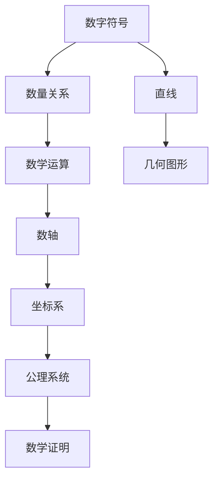

                 

# 认知的形式化：文字产生之初就开始发明数字符号，数和直线等基础概念的形成经过了漫长的时间

## 1. 背景介绍

### 1.1 问题由来

在人类文明史中，数字符号和直线作为基础数学概念，一直是数学发展的基石。然而，这些概念的形成和认知形式化是一个复杂且漫长的过程。本系列文章将深入探讨这些基本数学概念的历史演变，以及它们如何被形式化表示和应用。

### 1.2 问题核心关键点

1. **数字符号的形成**：古代人类如何从抽象到具象地表达数量关系。
2. **直线与几何概念的演进**：直线作为数学中的基础元素，其认知形式化的历史。
3. **数与直线概念的融合**：数与几何学之间相互影响和促进的过程。
4. **数学形式化的意义**：数学符号和公理系统的建立对现代数学发展的影响。

## 2. 核心概念与联系

### 2.1 核心概念概述

- **数字符号**：用于表示数量的抽象符号，如阿拉伯数字(0-9)。
- **直线**：几何学中最基本的元素，表示为无限延伸的曲线，两端点为无穷远点。
- **数与直线的关系**：数轴、坐标系等数学工具，将数字符号与直线结合，形成数学表达的基础。
- **数学形式化**：通过公理化、符号化等方法，将数学概念和推理过程形式化，便于推导和验证。

### 2.2 核心概念原理和架构的 Mermaid 流程图



### 2.3 核心概念的联系

- **数字符号与数量关系**：数字符号是表示数量的符号，而数量关系是数学的基本组成部分。
- **直线与几何图形**：直线是几何学中最基本的图形元素，通过组合形成复杂的几何形状。
- **数轴与坐标系**：数轴和坐标系将数字符号与直线结合，形成数学表达的基本框架。
- **公理系统与数学证明**：公理系统提供数学推理的逻辑基础，数学证明则是基于公理系统的逻辑推导过程。

## 3. 核心算法原理 & 具体操作步骤

### 3.1 算法原理概述

数学的形式化过程，本质上是对数学概念和推理过程的符号化表示。其核心在于通过一组公理，定义数学对象的性质，并推导出新的性质和结论。数学形式化的目标，是构建一套逻辑严谨、无歧义的数学表达体系，便于交流和推导。

### 3.2 算法步骤详解

1. **定义数学对象**：通过公理或定义，明确数学对象的基本性质和关系。
2. **推导新性质**：基于已定义的公理，通过逻辑推理，推导出新的性质和结论。
3. **验证和扩展**：对推导出的结论进行验证，并扩展到更广泛的应用场景。
4. **形式化表示**：将数学对象、公理、结论等用符号形式表示出来，形成数学表达式或证明。

### 3.3 算法优缺点

**优点**：
- **严谨性**：形式化数学提供了一套逻辑严谨的推理体系，减少了人为错误和歧义。
- **普适性**：形式化方法适用于各种数学问题，具有广泛的适用性。
- **可验证性**：形式化推理的每一步都有严格的逻辑基础，便于验证和检查。

**缺点**：
- **复杂性**：形式化数学的符号和逻辑较为复杂，理解难度较高。
- **抽象性**：形式化数学的符号和公理抽象性较强，对于初学者较难上手。
- **灵活性**：形式化方法在处理某些特殊情况时，可能显得过于僵化。

### 3.4 算法应用领域

形式化数学广泛应用于数学、物理、计算机科学等领域，是现代科学和技术的重要基础。例如：
- **数学**：微积分、线性代数、几何学等领域的公理化表示。
- **物理**：牛顿力学、相对论等物理理论的符号化表示。
- **计算机科学**：算法设计、程序验证、逻辑推理等领域的符号化方法。

## 4. 数学模型和公式 & 详细讲解 & 举例说明

### 4.1 数学模型构建

数学模型的构建，通常包括以下几个步骤：
1. **定义对象**：明确数学对象的基本性质和关系。
2. **设定公理**：基于定义的对象，设定基本的公理和假设。
3. **推导结论**：通过逻辑推理，推导出新的性质和结论。
4. **符号表示**：将数学对象、公理、结论等用符号形式表示出来，形成数学表达式。

### 4.2 公式推导过程

以欧几里得几何为例，推导勾股定理的符号化表示过程：
1. **定义对象**：三角形、角度、边长等。
2. **设定公理**：几何学的基本公理，如“同角或等角的补角相等”。
3. **推导结论**：利用公理和已知的定理，推导出勾股定理。
4. **符号表示**：将推导过程用符号表示，形成数学公式。

### 4.3 案例分析与讲解

以微积分为例，分析导数定义的符号化表示过程：
1. **定义对象**：函数、自变量、因变量等。
2. **设定公理**：极限的定义、连续性定理等。
3. **推导结论**：利用公理和极限概念，推导出导数的定义。
4. **符号表示**：将推导过程用符号表示，形成数学表达式。

## 5. 项目实践：代码实例和详细解释说明

### 5.1 开发环境搭建

进行数学模型的实践，需要搭建Python开发环境。具体步骤如下：
1. 安装Python：从官网下载并安装Python。
2. 安装必要的库：安装SymPy、NumPy等数学计算库。
3. 设置IDE：选择PyCharm等IDE进行开发。

### 5.2 源代码详细实现

以下是一个简单的数学公式推导示例，展示如何使用SymPy库进行符号化计算：

```python
from sympy import symbols, Eq, solve

# 定义符号
x, y, z = symbols('x y z')

# 定义方程
eq1 = Eq(x**2 + y**2, z**2)

# 解方程
solution = solve(eq1, (x, y, z))
print(solution)
```

### 5.3 代码解读与分析

- `symbols`函数：定义符号变量，如`x`、`y`、`z`。
- `Eq`函数：定义方程，如`x^2 + y^2 = z^2`。
- `solve`函数：解方程，返回可能的解集。

## 6. 实际应用场景

### 6.1 科学计算

数学形式化在科学计算中具有广泛应用，例如在物理学、天文学等领域，通过符号化表示和计算，可以简化复杂的物理方程，提高计算效率。

### 6.2 算法设计

形式化方法在算法设计中也有重要应用，如在人工智能中，形式化表示和推理，可以用于构建符号计算引擎，支持逻辑推理和符号计算。

### 6.3 教育与培训

形式化数学的教学和培训，有助于提高学生的逻辑思维能力和推理能力，为后续的学习打下坚实的基础。

## 7. 工具和资源推荐

### 7.1 学习资源推荐

- **SymPy文档**：SymPy官方文档，详细介绍了如何使用SymPy进行数学计算和符号化表示。
- **Wolfram MathWorld**：MathWorld是一个数学百科全书，提供大量数学概念和公式的符号化表示。
- **Coursera数学课程**：Coursera提供的数学课程，涵盖数学基础和进阶内容。

### 7.2 开发工具推荐

- **PyCharm**：Python IDE，提供丰富的数学计算和符号化工具。
- **MATLAB**：MathWorks提供的数学计算工具，支持符号化计算和图形化表示。
- **Mathematica**：Wolfram公司提供的符号化计算工具，支持广泛的数学应用场景。

### 7.3 相关论文推荐

- **《欧几里得几何学》**：欧几里得著，奠定了几何学的基础。
- **《微积分原理》**：牛顿著，阐述了微积分的基本原理和符号表示。
- **《符号化计算基础》**：介绍符号化计算的基本原理和方法。

## 8. 总结：未来发展趋势与挑战

### 8.1 研究成果总结

数学形式化作为数学和科学的基础，其发展和应用具有深远的历史和现实意义。在数学的演进过程中，形式化方法不断推动着数学的进步和应用。

### 8.2 未来发展趋势

未来，数学形式化将继续在各个领域得到广泛应用，例如：
- **人工智能**：符号计算和逻辑推理在人工智能中的作用将日益凸显。
- **科学计算**：符号化表示和计算将在科学计算中发挥更大作用。
- **教育培训**：形式化数学的教学方法将不断创新，提高学生的逻辑思维能力。

### 8.3 面临的挑战

尽管数学形式化在数学发展中发挥了重要作用，但仍面临一些挑战：
- **复杂性**：形式化数学的符号和逻辑较为复杂，理解难度较高。
- **普及性**：形式化数学在普及和应用过程中，还存在一些障碍。
- **技术变革**：随着计算技术的发展，新的形式化工具和方法也将不断出现。

### 8.4 研究展望

未来，数学形式化将进一步融合计算机技术，推动数学的自动化和智能化发展。例如：
- **自动化推导**：利用机器学习等技术，自动化推导数学公式和定理。
- **符号化计算**：发展符号化计算引擎，支持大规模数学计算和符号化表示。
- **交叉学科应用**：将数学形式化与其他学科相结合，推动跨学科研究和发展。

## 9. 附录：常见问题与解答

**Q1：如何理解数学形式化的意义？**

A: 数学形式化的意义在于，通过符号化表示和逻辑推理，构建一套严谨的数学表达体系。这种形式化的表达方式，不仅便于交流和推导，还能减少人为错误和歧义，提高数学研究的准确性和可靠性。

**Q2：数学形式化在科学计算中的应用有哪些？**

A: 数学形式化在科学计算中的应用包括：
- 符号化表示和计算，简化复杂的物理方程。
- 自动化推导和验证，提高计算效率和精度。
- 多学科交叉应用，促进科学研究的融合和创新。

**Q3：学习数学形式化的难点在哪里？**

A: 学习数学形式化的难点在于，其符号和逻辑较为抽象和复杂，需要较强的逻辑思维和推理能力。初学者可能难以理解其本质和应用。

**Q4：如何应用数学形式化进行算法设计？**

A: 应用数学形式化进行算法设计，通常包括以下步骤：
- 定义数学对象和公理。
- 用符号表示算法过程。
- 验证和优化算法。
- 实现和测试算法。

**Q5：数学形式化的未来发展方向是什么？**

A: 数学形式化的未来发展方向包括：
- 自动化推导和验证，利用机器学习等技术，自动化推导数学公式和定理。
- 符号化计算引擎，支持大规模数学计算和符号化表示。
- 跨学科应用，推动数学与其他学科的融合和创新。

作者：禅与计算机程序设计艺术 / Zen and the Art of Computer Programming

