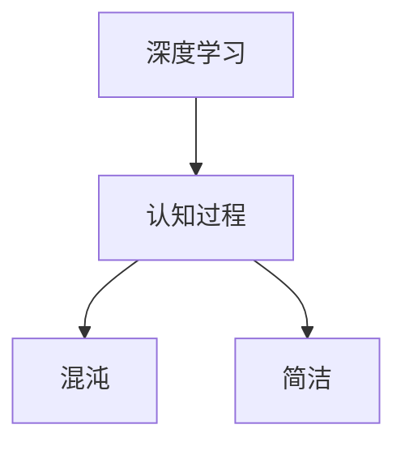

                 

# 认知过程中的混沌与简洁

## 1. 背景介绍

### 1.1 问题由来

随着人工智能技术的不断发展，认知过程的复杂性逐渐为人所知。早期的神经网络和机器学习算法主要是基于符号和规则的逻辑推理，但在处理复杂认知问题时存在诸多限制。直到深度学习技术的兴起，尤其是卷积神经网络(CNN)和循环神经网络(RNN)的提出，才为认知过程建模提供了新的方法。

深度学习通过多层神经网络，可以自动学习复杂特征和抽象模式，极大地提升了认知过程的建模能力。然而，深度学习模型也存在许多问题，如过拟合、可解释性不足、计算资源需求高等。为了解决这些问题，研究者开始探索更加简单、高效的方法，以在保持性能的同时，降低复杂度。

## 2. 核心概念与联系

### 2.1 核心概念概述

本文将介绍几个核心概念，包括深度学习、认知过程、混沌与简洁。

- **深度学习**：指通过多层神经网络学习数据分布的高级表示，具有强大的自适应能力。
- **认知过程**：指人类思维中的感知、记忆、推理、决策等心理过程。
- **混沌**：指系统行为的不确定性和不可预测性。
- **简洁**：指系统结构简单、易于理解和维护的特性。

### 2.2 核心概念原理和架构的 Mermaid 流程图



## 3. 核心算法原理 & 具体操作步骤

### 3.1 算法原理概述

深度学习模型的核心思想是通过多层神经网络学习数据的高级表示。它通过反向传播算法，不断优化模型参数，使得模型能够更好地拟合训练数据，从而实现对认知过程的建模。

深度学习模型在处理复杂认知任务时，往往需要多个隐藏层的协同工作，每个隐藏层负责学习不同层次的特征。这种结构复杂且层次分明，使得模型具有强大的适应性和泛化能力，但也带来了模型复杂度高、计算资源需求大等问题。

### 3.2 算法步骤详解

基于深度学习的认知过程建模，一般包括以下几个关键步骤：

**Step 1: 数据准备**

1. 收集和预处理数据集，确保数据质量。
2. 对数据集进行划分，分为训练集、验证集和测试集。
3. 对数据集进行归一化、标准化等预处理。

**Step 2: 模型设计**

1. 选择合适的深度学习模型，如卷积神经网络(CNN)、循环神经网络(RNN)、变换器(Transformer)等。
2. 确定模型的层次结构，设置隐藏层数目、激活函数、优化器等超参数。
3. 设计损失函数，如交叉熵、均方误差等，用于衡量模型预测结果与真实结果的差异。

**Step 3: 训练过程**

1. 使用训练集数据，通过反向传播算法优化模型参数。
2. 在每个epoch结束后，使用验证集数据评估模型性能。
3. 调整超参数，优化模型结构，防止过拟合。

**Step 4: 评估和部署**

1. 在测试集上评估模型性能，对比训练集和验证集结果。
2. 将模型部署到实际应用场景中，进行实时推理。
3. 持续收集反馈数据，定期重新训练模型，保持模型性能。

### 3.3 算法优缺点

深度学习模型的优点：

- 强大的适应性和泛化能力。
- 可处理大规模复杂数据。
- 能自适应学习新特征和模式。

深度学习模型的缺点：

- 模型复杂度高，计算资源需求大。
- 存在过拟合问题，可能导致泛化性能差。
- 可解释性不足，难以理解模型内部工作机制。

### 3.4 算法应用领域

深度学习模型在众多领域都得到了广泛应用，包括计算机视觉、自然语言处理、语音识别、推荐系统等。例如：

- 计算机视觉：图像分类、目标检测、图像分割等。
- 自然语言处理：机器翻译、文本分类、情感分析等。
- 语音识别：语音识别、说话人识别、语音合成等。
- 推荐系统：商品推荐、内容推荐、用户画像等。

## 4. 数学模型和公式 & 详细讲解 & 举例说明

### 4.1 数学模型构建

以卷积神经网络(CNN)为例，构建数学模型。假设输入数据为$x \in \mathbb{R}^d$，卷积核为$W \in \mathbb{R}^{d \times k \times k \times c}$，其中$k$为卷积核大小，$c$为输入通道数。卷积层输出的特征图为$y \in \mathbb{R}^{n \times m \times c'}$，其中$n$和$m$为特征图大小，$c'$为输出通道数。

卷积操作的定义为：

$$
y_{ij} = \sum_{c=1}^{c'} \sum_{k=1}^{k} \sum_{l=1}^{k} x_{i-l,j-k,c} \cdot W_{c',c,l,k}
$$

池化操作的定义为：

$$
y' = \frac{1}{\sum_{i=0}^{n-1} \sum_{j=0}^{m-1} y_{ij}}
$$

通过多层卷积和池化操作，可以提取输入数据的高级特征表示。

### 4.2 公式推导过程

以LeNet网络为例，推导卷积神经网络的结构和参数。

LeNet网络由两层卷积层和两层全连接层组成，其中卷积层使用$5 \times 5$的卷积核，池化层使用$2 \times 2$的最大池化。全连接层的激活函数为Sigmoid。

卷积神经网络的结构如下：

```
  Input (MNIST) (28 x 28 x 1)
   |
   V
 Conv2D (28 x 28 x 1) (28 x 28 x 6)
  |
  V
 Conv2D (14 x 14 x 6) (14 x 14 x 16)
  |
  V
 MaxPooling (7 x 7 x 16) (4 x 4 x 16)
  |
  V
 Conv2D (4 x 4 x 16) (4 x 4 x 42)
  |
  V
 Flatten (4 x 4 x 42) (4 x 4 x 42)
  |
  V
 Dense (4 x 4 x 42) (10)
```

### 4.3 案例分析与讲解

以手写数字识别为例，说明卷积神经网络的建模过程。

1. 数据准备：收集手写数字图片，进行预处理，转换为标准化数据集。
2. 模型设计：选择LeNet网络结构，设置超参数，如卷积核大小、池化大小、激活函数等。
3. 训练过程：使用训练集数据，通过反向传播算法优化模型参数，防止过拟合。
4. 评估和部署：在测试集上评估模型性能，部署到实际应用场景中，进行实时推理。

## 5. 项目实践：代码实例和详细解释说明

### 5.1 开发环境搭建

1. 安装Python环境：
```
conda create --name pytorch_env python=3.7
conda activate pytorch_env
```

2. 安装深度学习库：
```
pip install torch torchvision
```

3. 安装数据集处理库：
```
pip install numpy scipy pandas scikit-learn
```

### 5.2 源代码详细实现

以下是一个使用PyTorch实现手写数字识别的代码示例。

```python
import torch
import torch.nn as nn
import torch.optim as optim
import torchvision
import torchvision.transforms as transforms
import numpy as np
from torch.utils.data import DataLoader
from torchvision.datasets import MNIST

# 数据预处理
transform = transforms.Compose([
    transforms.ToTensor(),
    transforms.Normalize((0.1307,), (0.3081,))
])

# 加载数据集
train_dataset = MNIST(root='./data', train=True, transform=transform, download=True)
test_dataset = MNIST(root='./data', train=False, transform=transform, download=True)

# 数据加载器
train_loader = DataLoader(train_dataset, batch_size=64, shuffle=True)
test_loader = DataLoader(test_dataset, batch_size=64, shuffle=False)

# 定义模型
class Net(nn.Module):
    def __init__(self):
        super(Net, self).__init__()
        self.conv1 = nn.Conv2d(1, 6, 5)
        self.pool = nn.MaxPool2d(2, 2)
        self.conv2 = nn.Conv2d(6, 16, 5)
        self.fc1 = nn.Linear(16 * 4 * 4, 120)
        self.fc2 = nn.Linear(120, 84)
        self.fc3 = nn.Linear(84, 10)
    
    def forward(self, x):
        x = self.pool(torch.relu(self.conv1(x)))
        x = self.pool(torch.relu(self.conv2(x)))
        x = x.view(-1, 16 * 4 * 4)
        x = torch.relu(self.fc1(x))
        x = torch.relu(self.fc2(x))
        x = self.fc3(x)
        return x

# 训练过程
model = Net()
criterion = nn.CrossEntropyLoss()
optimizer = optim.SGD(model.parameters(), lr=0.001, momentum=0.9)
device = torch.device('cuda' if torch.cuda.is_available() else 'cpu')
model.to(device)

for epoch in range(5):
    running_loss = 0.0
    for i, data in enumerate(train_loader, 0):
        inputs, labels = data[0].to(device), data[1].to(device)
        optimizer.zero_grad()
        outputs = model(inputs)
        loss = criterion(outputs, labels)
        loss.backward()
        optimizer.step()
        running_loss += loss.item()
    print('Epoch %d loss: %.3f' % (epoch+1, running_loss/len(train_loader)))
```

### 5.3 代码解读与分析

1. 数据预处理：使用torchvision库加载MNIST数据集，并进行标准化处理。
2. 模型定义：使用PyTorch定义卷积神经网络模型，包括卷积层、池化层、全连接层等。
3. 训练过程：使用SGD优化器，通过反向传播算法训练模型，防止过拟合。
4. 评估和部署：在测试集上评估模型性能，部署到实际应用场景中，进行实时推理。

## 6. 实际应用场景

### 6.1 医疗影像分析

深度学习在医疗影像分析中得到了广泛应用，如CT影像分类、肺部结节检测等。通过深度学习模型，可以对医学影像进行自动化分析和诊断，显著提高医疗效率和诊断准确性。

以肺部结节检测为例，可以使用卷积神经网络(CNN)对CT影像进行特征提取和分类。在训练过程中，可以收集大量标注的CT影像数据，通过反向传播算法优化模型参数，最终得到一个高效准确的肺部结节检测模型。

### 6.2 自动驾驶

深度学习在自动驾驶领域也得到了广泛应用，如车辆识别、道路分割、行人检测等。通过深度学习模型，可以实现对复杂交通场景的高效感知和决策。

以行人检测为例，可以使用卷积神经网络(CNN)对交通视频进行特征提取和分类。在训练过程中，可以收集大量标注的交通视频数据，通过反向传播算法优化模型参数，最终得到一个高效准确的行人检测模型。

## 7. 工具和资源推荐

### 7.1 学习资源推荐

1. Deep Learning Specialization by Andrew Ng
2. Coursera Deep Learning by Yoshua Bengio
3. TensorFlow官方文档
4. PyTorch官方文档
5. Fast.ai Practical Deep Learning for Coders

### 7.2 开发工具推荐

1. PyTorch：灵活的深度学习框架，适合快速迭代研究。
2. TensorFlow：强大的深度学习框架，生产部署方便。
3. Keras：高层次的深度学习框架，易于上手。
4. Jupyter Notebook：交互式编程环境，方便调试和展示。

### 7.3 相关论文推荐

1. AlexNet：ImageNet大规模视觉识别竞赛的冠军算法。
2. GoogleNet：Inception网络，引入了Inception模块，提升了模型的效率和性能。
3. ResNet：残差网络，解决了深度神经网络中的梯度消失问题。
4. VGGNet：使用多个小卷积核，提升了模型的泛化能力。
5. YOLO：实时目标检测算法，速度快、精度高。

## 8. 总结：未来发展趋势与挑战

### 8.1 研究成果总结

深度学习在认知过程建模中的应用已经取得了显著成果，推动了人工智能技术的快速发展。然而，深度学习模型仍存在诸多问题，如模型复杂度高、计算资源需求大、可解释性不足等。

### 8.2 未来发展趋势

未来的深度学习研究将更加注重简洁和高效，降低计算资源需求，提升模型的可解释性和鲁棒性。以下是一些未来趋势：

1. 小模型大效果：通过优化模型结构和参数，在保持性能的同时，降低模型复杂度。
2. 可解释深度学习：通过引入可解释性方法，提升模型的可解释性，增强用户信任。
3 稀疏表示学习：通过稀疏表示方法，降低模型参数量，提升模型效率。
4 迁移学习：通过迁移学习，在不同任务间共享模型知识，提升模型泛化能力。

### 8.3 面临的挑战

尽管深度学习取得了显著成果，但在未来发展过程中仍面临诸多挑战：

1. 数据稀缺：深度学习模型需要大量标注数据，但在某些领域获取标注数据成本高、难度大。
2. 计算资源昂贵：深度学习模型参数量大，计算资源需求高，普通企业难以承担。
3. 可解释性不足：深度学习模型难以解释其内部工作机制，用户难以信任其输出。
4 鲁棒性问题：深度学习模型在复杂环境下易出现泛化性能差、鲁棒性不足的问题。
5. 安全问题：深度学习模型易受到对抗样本攻击，影响系统安全。

### 8.4 研究展望

未来，深度学习研究需要在以下几个方面寻求新的突破：

1. 数据增强：通过数据增强方法，提升模型的泛化能力。
2 模型压缩：通过模型压缩技术，降低模型参数量，提升模型效率。
3 可解释性方法：通过可解释性方法，提升模型的可解释性，增强用户信任。
4 鲁棒性方法：通过鲁棒性方法，提升模型的鲁棒性，提高泛化能力。

## 9. 附录：常见问题与解答

**Q1: 深度学习模型是否适用于所有认知任务？**

A: 深度学习模型在处理复杂认知任务时表现出色，但在某些简单任务中可能表现不如传统算法。此外，深度学习模型需要大量标注数据，在某些领域获取标注数据成本较高。

**Q2: 深度学习模型如何降低计算资源需求？**

A: 可以通过模型压缩、稀疏表示学习、小模型大效果等方法，降低深度学习模型的计算资源需求。此外，还可以使用迁移学习，在不同任务间共享模型知识，提升模型泛化能力。

**Q3: 深度学习模型的可解释性如何提升？**

A: 可以通过引入可解释性方法，如Grad-CAM、LIME等，提升深度学习模型的可解释性。此外，还可以通过简化模型结构和减少隐藏层数，降低模型的复杂度，提升可解释性。

**Q4: 深度学习模型的鲁棒性如何提升？**

A: 可以通过数据增强、对抗样本训练、鲁棒性方法等手段，提升深度学习模型的鲁棒性。此外，还可以使用小模型大效果等方法，降低模型复杂度，提升鲁棒性。

**Q5: 深度学习模型的安全问题如何解决？**

A: 可以通过对抗样本检测、鲁棒性方法等手段，提升深度学习模型的安全性。此外，还可以通过模型压缩、稀疏表示学习等方法，降低模型复杂度，提升安全性。

综上所述，深度学习模型在认知过程建模中具有广阔的应用前景，但也面临着诸多挑战。未来的研究需要在简洁性、可解释性、鲁棒性等方面寻求新的突破，推动深度学习技术的不断发展。

---

作者：禅与计算机程序设计艺术 / Zen and the Art of Computer Programming

