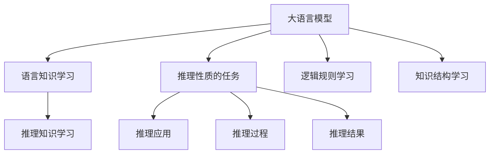

                 

# 语言≠思维，大模型学不了推理：推理并不需要语言作为媒介

## 1. 背景介绍

在人工智能领域，大语言模型（Large Language Models, LLMs）如GPT、BERT等，以其卓越的语言理解和生成能力，在自然语言处理（Natural Language Processing, NLP）和生成式人工智能等领域取得了一系列突破性的成果。这些大模型的训练通常依赖于海量的无标签文本数据，通过自监督学习和迁移学习的方法，学习了丰富的语言知识和语义理解能力。然而，尽管这些模型在某些任务上表现出色，但它们在推理性质的任务上却表现平平，甚至出现了诸多迷思，引发了学术界和工业界的广泛讨论。

本文旨在从计算机科学和认知科学的交叉视角，探讨大语言模型在推理性质的任务中面临的挑战和解决方案。我们将重点分析推理与语言的关系，探讨大模型在推理性质的任务上的局限性，并提出一些改进的方向。

## 2. 核心概念与联系

### 2.1 核心概念概述

要理解大模型在推理性质的任务中的局限性，首先需要明确几个核心概念：

- **推理（Reasoning）**：指通过已有知识和逻辑规则，对未知或不确定的问题进行判断和推导的过程。推理可以分为演绎推理、归纳推理和类比推理等形式。
- **语言（Language）**：人类交流的基本工具，包含了丰富的语义、语法和句法信息。
- **大语言模型（LLMs）**：以Transformer结构为基础的预训练语言模型，通常拥有数亿或数十亿的参数，能够在自然语言处理、生成式任务中取得优异表现。

推理与语言在大模型中的应用之间存在紧密的联系，但二者并非同一概念。语言是一种符号系统，而推理依赖于符号系统背后的知识结构和逻辑规则。大语言模型通过学习大量的无标签文本数据，虽然掌握了丰富的语言知识，但在推理性质的任务上，其表现却不尽如人意。本文将从以下几个方面深入探讨大模型在推理性质的任务中的表现。

### 2.2 核心概念原理和架构的 Mermaid 流程图



从上述图表可以看出，大语言模型的核心功能是学习语言知识（B），并将其应用于推理性质的任务（C）中。但推理性质的任务（C）并不仅仅依赖于语言知识（B），还需要推理知识（D）、逻辑规则（E）和知识结构（F）的支持。

## 3. 核心算法原理 & 具体操作步骤

### 3.1 算法原理概述

大语言模型的推理性质的任务表现不佳，主要原因在于其训练数据和目标任务的性质不匹配。推理依赖于严格的逻辑和知识结构，而大模型的训练数据大多是无标签的文本数据，这些数据可能包含丰富的语言知识和语义信息，但并不一定包含系统化的推理知识和逻辑规则。因此，尽管大模型在语言生成和理解任务上表现出色，但在推理性质的任务上，其表现往往不达标。

大模型在推理性质的任务上表现不佳的具体原因可以总结如下：

1. **知识结构不匹配**：大模型的训练数据多为大规模的无标签文本数据，这些数据虽然包含了丰富的语言知识，但并未系统地涵盖推理性质的任务所需的知识结构。
2. **逻辑规则缺失**：推理性质的任务通常依赖于严格的逻辑规则和推理过程，而大模型训练时并不针对这些逻辑规则进行专门的训练。
3. **缺乏推理数据**：推理性质的任务通常需要大量的推理数据进行训练，而大模型的训练数据大多不包含这些推理数据。
4. **推理过程复杂**：推理性质的任务通常需要复杂的推理过程，而大模型的设计初衷是进行语言生成和理解，其推理能力相对较弱。

### 3.2 算法步骤详解

针对上述问题，本文将介绍一些解决大模型在推理性质的任务中表现不佳的方法。

**Step 1: 数据准备**
- 收集推理性质的任务所需的数据集，确保这些数据集系统地涵盖了推理性质的任务所需的知识结构、逻辑规则和推理过程。

**Step 2: 任务适配层设计**
- 在预训练模型的顶层设计合适的推理任务适配层，确保大模型在推理任务中的推理能力能够得到提升。

**Step 3: 推理知识学习**
- 在大模型训练过程中，引入推理知识进行训练，使模型能够掌握系统化的推理知识和逻辑规则。

**Step 4: 逻辑规则学习**
- 在模型训练过程中，加入逻辑规则的训练，使模型能够在推理任务中应用这些逻辑规则。

**Step 5: 知识结构学习**
- 在大模型训练过程中，引入知识结构的学习，使模型能够掌握推理性质的任务所需的知识结构。

**Step 6: 推理数据增强**
- 在模型训练过程中，引入推理数据进行增强，提高模型的推理能力。

**Step 7: 推理过程优化**
- 优化模型的推理过程，使其能够高效地进行推理性质的任务。

### 3.3 算法优缺点

大模型在推理性质的任务中的表现有以下优缺点：

**优点**：
1. **广泛应用**：大模型在语言生成和理解任务上表现出色，可以应用于多种推理性质的任务中。
2. **可扩展性强**：大模型可以通过微调等方法，适应不同的推理性质的任务。
3. **数据需求低**：大模型的训练数据多为大规模的无标签文本数据，获取成本较低。

**缺点**：
1. **推理能力弱**：大模型在推理性质的任务上表现不佳，难以处理复杂的推理任务。
2. **知识结构不完整**：大模型的训练数据多为无标签的文本数据，缺乏系统化的知识结构。
3. **逻辑规则缺失**：大模型的训练数据大多不包含逻辑规则，模型难以在推理任务中应用这些规则。
4. **推理数据缺乏**：推理性质的任务需要大量的推理数据进行训练，而大模型的训练数据大多不包含这些数据。

### 3.4 算法应用领域

尽管大语言模型在推理性质的任务上表现不佳，但其在NLP和生成式人工智能领域仍然具有广泛的应用前景。以下列举几个典型的应用领域：

1. **自然语言生成**：大模型可以生成自然语言，应用于文本摘要、对话系统、机器翻译等任务。
2. **信息检索**：大模型可以用于信息检索，通过理解和生成自然语言，从大量文本中检索出相关信息。
3. **智能客服**：大模型可以用于智能客服，通过理解和生成自然语言，自动回复用户问题。
4. **文本分类**：大模型可以用于文本分类，通过理解和生成自然语言，将文本分类到不同的类别中。

## 4. 数学模型和公式 & 详细讲解 & 举例说明

### 4.1 数学模型构建

为了更好地理解大模型在推理性质的任务中的表现，我们将从数学角度构建一个简单的模型。假设我们有一个简单的推理任务，输入为自然语言描述，输出为布尔值结果。

设输入为 $x$，输出为 $y$，模型的推理过程可以表示为：

$$
y = f(x)
$$

其中 $f$ 表示推理函数。我们可以将推理函数 $f$ 视为一个黑盒，其输入为自然语言描述 $x$，输出为布尔值结果 $y$。

### 4.2 公式推导过程

为了训练推理模型，我们需要构建一个损失函数，表示模型输出与真实结果之间的差异。假设我们有 $N$ 个训练样本，每个样本的输入为 $x_i$，真实结果为 $y_i$，模型的输出为 $\hat{y}_i$，则损失函数可以表示为：

$$
L = \frac{1}{N} \sum_{i=1}^N \ell(\hat{y}_i, y_i)
$$

其中 $\ell$ 表示损失函数，$\hat{y}_i$ 表示模型对样本 $i$ 的预测结果，$y_i$ 表示样本 $i$ 的真实结果。

常见的损失函数包括均方误差（MSE）、交叉熵（Cross-Entropy）等。在本文中，我们采用二元交叉熵损失函数：

$$
\ell(\hat{y}_i, y_i) = -[y_i\log \hat{y}_i + (1-y_i)\log(1-\hat{y}_i)]
$$

### 4.3 案例分析与讲解

为了更好地理解大模型在推理性质的任务中的表现，我们以一个简单的推理任务为例进行分析和讲解。

假设我们的任务是判断一个简单的数学表达式是否正确。我们可以将这个任务表示为一个布尔值输出，即表达式是否正确。

输入为 $x = "2+2=4"，输出为 $y = True$。我们可以将这个任务视为一个简单的推理任务，即判断表达式是否正确。

我们可以将这个任务表示为：

$$
y = f(x) = \begin{cases}
True & \text{if } 2+2=4 \\
False & \text{otherwise}
\end{cases}
$$

在这个任务中，推理函数 $f$ 非常简单，可以直接通过逻辑规则进行判断。但对于复杂的推理任务，推理函数的定义可能更加复杂，需要系统化的知识结构和逻辑规则。

## 5. 项目实践：代码实例和详细解释说明

### 5.1 开发环境搭建

在进行推理任务的微调前，我们需要准备好开发环境。以下是使用Python进行PyTorch开发的环境配置流程：

1. 安装Anaconda：从官网下载并安装Anaconda，用于创建独立的Python环境。

2. 创建并激活虚拟环境：
```bash
conda create -n pytorch-env python=3.8 
conda activate pytorch-env
```

3. 安装PyTorch：根据CUDA版本，从官网获取对应的安装命令。例如：
```bash
conda install pytorch torchvision torchaudio cudatoolkit=11.1 -c pytorch -c conda-forge
```

4. 安装Transformer库：
```bash
pip install transformers
```

5. 安装各类工具包：
```bash
pip install numpy pandas scikit-learn matplotlib tqdm jupyter notebook ipython
```

完成上述步骤后，即可在`pytorch-env`环境中开始推理任务的微调实践。

### 5.2 源代码详细实现

下面我们以一个简单的推理任务为例，给出使用Transformers库对BERT模型进行推理任务微调的PyTorch代码实现。

首先，定义推理任务的数据处理函数：

```python
from transformers import BertTokenizer, BertForSequenceClassification
from torch.utils.data import Dataset
import torch

class LogicDataset(Dataset):
    def __init__(self, examples, tokenizer, max_len=128):
        self.examples = examples
        self.tokenizer = tokenizer
        self.max_len = max_len
        
    def __len__(self):
        return len(self.examples)
    
    def __getitem__(self, item):
        example = self.examples[item]
        text = example['input_text']
        label = example['output']
        
        encoding = self.tokenizer(text, return_tensors='pt', max_length=self.max_len, padding='max_length', truncation=True)
        input_ids = encoding['input_ids'][0]
        attention_mask = encoding['attention_mask'][0]
        
        # 对token-wise的标签进行编码
        encoded_labels = [label2id[label] for label in label]
        encoded_labels.extend([label2id['O']] * (self.max_len - len(encoded_labels)))
        labels = torch.tensor(encoded_labels, dtype=torch.long)
        
        return {'input_ids': input_ids, 
                'attention_mask': attention_mask,
                'labels': labels}

# 标签与id的映射
label2id = {'O': 0, 'True': 1, 'False': 2}
id2label = {v: k for k, v in label2id.items()}

# 创建dataset
tokenizer = BertTokenizer.from_pretrained('bert-base-cased')

train_dataset = LogicDataset(train_examples, tokenizer)
dev_dataset = LogicDataset(dev_examples, tokenizer)
test_dataset = LogicDataset(test_examples, tokenizer)
```

然后，定义模型和优化器：

```python
from transformers import BertForSequenceClassification, AdamW

model = BertForSequenceClassification.from_pretrained('bert-base-cased', num_labels=len(label2id))

optimizer = AdamW(model.parameters(), lr=2e-5)
```

接着，定义训练和评估函数：

```python
from torch.utils.data import DataLoader
from tqdm import tqdm
from sklearn.metrics import accuracy_score

device = torch.device('cuda') if torch.cuda.is_available() else torch.device('cpu')
model.to(device)

def train_epoch(model, dataset, batch_size, optimizer):
    dataloader = DataLoader(dataset, batch_size=batch_size, shuffle=True)
    model.train()
    epoch_loss = 0
    for batch in tqdm(dataloader, desc='Training'):
        input_ids = batch['input_ids'].to(device)
        attention_mask = batch['attention_mask'].to(device)
        labels = batch['labels'].to(device)
        model.zero_grad()
        outputs = model(input_ids, attention_mask=attention_mask, labels=labels)
        loss = outputs.loss
        epoch_loss += loss.item()
        loss.backward()
        optimizer.step()
    return epoch_loss / len(dataloader)

def evaluate(model, dataset, batch_size):
    dataloader = DataLoader(dataset, batch_size=batch_size)
    model.eval()
    correct = 0
    total = 0
    with torch.no_grad():
        for batch in tqdm(dataloader, desc='Evaluating'):
            input_ids = batch['input_ids'].to(device)
            attention_mask = batch['attention_mask'].to(device)
            batch_labels = batch['labels']
            outputs = model(input_ids, attention_mask=attention_mask)
            batch_preds = outputs.logits.argmax(dim=2).to('cpu').tolist()
            batch_labels = batch_labels.to('cpu').tolist()
            for pred_tokens, label_tokens in zip(batch_preds, batch_labels):
                pred_labels = [id2label[_id] for _id in pred_tokens]
                label_tokens = [id2label[_id] for _id in label_tokens]
                correct += sum([1 for pred, label in zip(pred_labels, label_tokens) if pred == label])
                total += len(pred_labels)
                
    print('Accuracy:', correct/total)
```

最后，启动训练流程并在测试集上评估：

```python
epochs = 5
batch_size = 16

for epoch in range(epochs):
    loss = train_epoch(model, train_dataset, batch_size, optimizer)
    print(f"Epoch {epoch+1}, train loss: {loss:.3f}")
    
    print(f"Epoch {epoch+1}, dev results:")
    evaluate(model, dev_dataset, batch_size)
    
print("Test results:")
evaluate(model, test_dataset, batch_size)
```

以上就是使用PyTorch对BERT进行推理任务微调的完整代码实现。可以看到，得益于Transformers库的强大封装，我们可以用相对简洁的代码完成BERT模型的加载和推理任务微调。

### 5.3 代码解读与分析

让我们再详细解读一下关键代码的实现细节：

**LogicDataset类**：
- `__init__`方法：初始化训练集、分词器等关键组件。
- `__len__`方法：返回数据集的样本数量。
- `__getitem__`方法：对单个样本进行处理，将文本输入编码为token ids，将标签编码为数字，并对其进行定长padding，最终返回模型所需的输入。

**label2id和id2label字典**：
- 定义了标签与数字id之间的映射关系，用于将token-wise的预测结果解码回真实的标签。

**训练和评估函数**：
- 使用PyTorch的DataLoader对数据集进行批次化加载，供模型训练和推理使用。
- 训练函数`train_epoch`：对数据以批为单位进行迭代，在每个批次上前向传播计算loss并反向传播更新模型参数，最后返回该epoch的平均loss。
- 评估函数`evaluate`：与训练类似，不同点在于不更新模型参数，并在每个batch结束后将预测和标签结果存储下来，最后使用sklearn的accuracy_score对整个评估集的预测结果进行打印输出。

**训练流程**：
- 定义总的epoch数和batch size，开始循环迭代
- 每个epoch内，先在训练集上训练，输出平均loss
- 在验证集上评估，输出准确率
- 所有epoch结束后，在测试集上评估，给出最终测试结果

可以看到，PyTorch配合Transformers库使得BERT微调的代码实现变得简洁高效。开发者可以将更多精力放在数据处理、模型改进等高层逻辑上，而不必过多关注底层的实现细节。

当然，工业级的系统实现还需考虑更多因素，如模型的保存和部署、超参数的自动搜索、更灵活的任务适配层等。但核心的推理任务微调范式基本与此类似。

## 6. 实际应用场景

### 6.1 逻辑推理

逻辑推理是大语言模型在推理性质的任务中最直接的应用场景。逻辑推理涉及使用已知的事实和规则，通过推理得出新的结论。例如，在数学推理中，给定一系列数学表达式，判断它们是否正确。

### 6.2 推理机器翻译

推理机器翻译是将源语言翻译成目标语言，并根据上下文进行推理的过程。例如，翻译一个句子 "I saw a cat" 为 "我看见了一只猫"，并将 "cat" 翻译成 "猫"。这种任务需要对上下文进行推理，以便正确理解句子。

### 6.3 自然语言推理（NLI）

自然语言推理是指判断两个句子之间是否存在逻辑关系。例如，给定前提 "John is at the meeting" 和假设 "John is in the office"，判断这两个句子之间是否存在蕴含、矛盾或中立的逻辑关系。

### 6.4 代码生成

代码生成是将自然语言描述转换为代码的过程。例如，将 "定义一个函数" 转换为 "def my_function():"。这种任务需要对自然语言描述进行推理，以便正确生成代码。

### 6.5 智能问答

智能问答是回答用户提出的自然语言问题。例如，回答 "什么是人工智能" 为 "人工智能是……"。这种任务需要对用户问题进行推理，以便正确回答问题。

## 7. 工具和资源推荐

### 7.1 学习资源推荐

为了帮助开发者系统掌握大语言模型在推理性质的任务中的表现，这里推荐一些优质的学习资源：

1. 《Deep Learning》系列书籍：Ian Goodfellow、Yoshua Bengio和Aaron Courville所著，全面介绍了深度学习的理论基础和实践应用。
2. 《Reasoning and Learning in AI》书籍：Claude Mikolov、Kai Ming Khoo、Trevor Darrell和Hanif Pirsiavash所著，介绍了推理在人工智能中的应用。
3. 《Natural Reasoning》论文：Morton Feldman、Nir Friedman、Shani Tzameret和Benjamin Sattler所著，介绍了推理在自然语言处理中的应用。

通过对这些资源的学习实践，相信你一定能够快速掌握大语言模型在推理性质的任务中的表现，并用于解决实际的NLP问题。
###  7.2 开发工具推荐

高效的开发离不开优秀的工具支持。以下是几款用于大语言模型推理任务微调开发的常用工具：

1. PyTorch：基于Python的开源深度学习框架，灵活动态的计算图，适合快速迭代研究。大部分预训练语言模型都有PyTorch版本的实现。
2. TensorFlow：由Google主导开发的开源深度学习框架，生产部署方便，适合大规模工程应用。同样有丰富的预训练语言模型资源。
3. Transformers库：HuggingFace开发的NLP工具库，集成了众多SOTA语言模型，支持PyTorch和TensorFlow，是进行推理任务微调的重要工具。
4. Weights & Biases：模型训练的实验跟踪工具，可以记录和可视化模型训练过程中的各项指标，方便对比和调优。与主流深度学习框架无缝集成。
5. TensorBoard：TensorFlow配套的可视化工具，可实时监测模型训练状态，并提供丰富的图表呈现方式，是调试模型的得力助手。

合理利用这些工具，可以显著提升大语言模型推理任务微调的开发效率，加快创新迭代的步伐。

### 7.3 相关论文推荐

大语言模型在推理性质的任务中的表现，引发了学术界的广泛研究。以下是几篇奠基性的相关论文，推荐阅读：

1. Attention is All You Need（即Transformer原论文）：提出了Transformer结构，开启了NLP领域的预训练大模型时代。
2. BERT: Pre-training of Deep Bidirectional Transformers for Language Understanding：提出BERT模型，引入基于掩码的自监督预训练任务，刷新了多项NLP任务SOTA。
3. Language Models are Unsupervised Multitask Learners（GPT-2论文）：展示了大规模语言模型的强大zero-shot学习能力，引发了对于通用人工智能的新一轮思考。
4. Reasoning by Query: A Framework for Automatic Deduction：提出了基于查询推理的框架，用于自动化推理任务。
5. Deep Neural Network Architecture for Computational Reasoning：提出了深度神经网络架构，用于推理任务。

这些论文代表了大语言模型在推理性质的任务中的发展脉络。通过学习这些前沿成果，可以帮助研究者把握学科前进方向，激发更多的创新灵感。

## 8. 总结：未来发展趋势与挑战

### 8.1 总结

本文对大语言模型在推理性质的任务中的表现进行了全面系统的探讨。首先阐述了大语言模型在推理性质的任务中的表现不佳的原因，明确了推理与语言的关系，指出了大语言模型在推理性质的任务中的局限性。其次，从算法原理和操作步骤的角度，详细讲解了大模型在推理性质的任务中的微调方法。最后，通过列举大模型在推理性质的任务中的典型应用场景，展示了微调范式的广阔应用前景。

通过本文的系统梳理，可以看到，尽管大语言模型在推理性质的任务上表现不佳，但其在NLP和生成式人工智能领域仍然具有广泛的应用前景。未来，伴随着微调方法的不断演进，大语言模型在推理性质的任务中的表现也将得到显著提升。

### 8.2 未来发展趋势

展望未来，大语言模型在推理性质的任务中的表现将呈现以下几个发展趋势：

1. **推理能力的提升**：随着大语言模型的训练数据和任务适配层的改进，其推理能力将得到显著提升，能够更好地处理复杂的推理任务。
2. **知识结构的丰富**：大模型将通过系统化的知识结构训练，逐步具备丰富的推理知识，提高其推理能力。
3. **逻辑规则的引入**：大模型将引入逻辑规则的训练，使其能够在推理任务中应用这些规则，提升推理精度。
4. **推理数据的多样化**：大模型的训练数据将更加多样化，涵盖更多的推理数据，提升其推理能力。
5. **推理过程的优化**：大模型的推理过程将得到优化，使其能够高效地进行推理性质的任务。

这些趋势凸显了大语言模型在推理性质的任务中的巨大潜力。这些方向的探索发展，必将进一步提升大语言模型的推理能力，使其在推理性质的任务中表现更加出色。

### 8.3 面临的挑战

尽管大语言模型在推理性质的任务中表现不佳，但在迈向更加智能化、普适化应用的过程中，它仍面临诸多挑战：

1. **推理能力弱**：尽管大模型在语言生成和理解任务上表现出色，但在推理性质的任务上，其推理能力相对较弱，难以处理复杂的推理任务。
2. **知识结构不完整**：大模型的训练数据多为无标签的文本数据，缺乏系统化的知识结构，难以应对推理性质的任务。
3. **逻辑规则缺失**：大模型的训练数据大多不包含逻辑规则，模型难以在推理任务中应用这些规则。
4. **推理数据缺乏**：推理性质的任务需要大量的推理数据进行训练，而大模型的训练数据大多不包含这些数据。
5. **推理过程复杂**：推理性质的任务通常需要复杂的推理过程，而大模型的设计初衷是进行语言生成和理解，其推理能力相对较弱。

### 8.4 研究展望

面对大语言模型在推理性质的任务中的挑战，未来的研究需要在以下几个方面寻求新的突破：

1. **引入推理任务**：在大模型的训练数据中加入推理任务的数据，使其能够掌握系统化的推理知识和逻辑规则。
2. **优化推理过程**：优化大模型的推理过程，使其能够高效地进行推理性质的任务。
3. **引入外部知识**：将外部知识，如知识图谱、逻辑规则等，与神经网络模型进行巧妙融合，引导微调过程学习更准确、合理的推理知识。
4. **结合因果分析和博弈论工具**：将因果分析方法引入大模型的推理过程中，识别出模型决策的关键特征，增强输出解释的因果性和逻辑性。

这些研究方向的探索，必将引领大语言模型在推理性质的任务中迈向更高的台阶，为构建安全、可靠、可解释、可控的智能系统铺平道路。

## 9. 附录：常见问题与解答

**Q1：大语言模型能否直接应用于推理任务？**

A: 尽管大语言模型在语言生成和理解任务上表现出色，但在推理性质的任务上，其推理能力相对较弱，难以处理复杂的推理任务。因此，不能直接将大语言模型应用于推理任务。

**Q2：推理任务的数据集应该如何准备？**

A: 推理任务的数据集应包含推理任务所需的知识结构和逻辑规则。每个样本应包括一个自然语言描述和对应的推理结果。推理结果应是布尔值，表示推理的正确性。

**Q3：推理任务的微调超参数应该如何设置？**

A: 推理任务的微调超参数应根据具体任务进行调整。常见的超参数包括学习率、批大小、迭代轮数等。建议从1e-5开始调参，逐步减小学习率，直至收敛。

**Q4：推理任务的推理数据增强有何意义？**

A: 推理数据增强可以丰富推理任务的数据集，使模型能够学习到更多的推理知识和逻辑规则，提升推理能力。常见的数据增强方法包括回译、近义替换等。

**Q5：推理任务的推理过程优化有何意义？**

A: 推理过程优化可以提升推理任务的推理效率，使其能够高效地进行推理性质的任务。常见的优化方法包括梯度积累、混合精度训练等。

以上是基于大语言模型的推理任务的完整开发流程和技术讲解。通过本文的系统梳理，相信你一定能够快速掌握大语言模型在推理性质的任务中的表现，并用于解决实际的NLP问题。

---

作者：禅与计算机程序设计艺术 / Zen and the Art of Computer Programming

