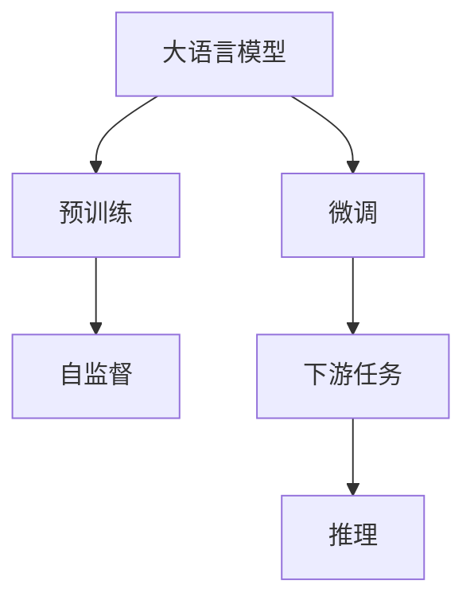

                 

# 语言≠思维：大模型的推理障碍

> 关键词：大模型,推理障碍,认知神经科学,计算机视觉,语言理解

## 1. 背景介绍

在人工智能领域，语言模型（Language Models）以其强大的自然语言处理能力成为热点话题。而近年来兴起的预训练大语言模型（Large Language Models, LLMs），更是将这一能力推向了新的高度。比如GPT、BERT等模型，已经展现了在大规模文本数据上进行预训练后，在各种自然语言处理任务上取得卓越表现的惊人能力。然而，在科学、技术、医学、艺术等许多领域，语言模型的推理能力却常常被诟病。尽管有了深度学习的加持，大模型在语言理解上有时却依然令人困惑，其原因何在？本文旨在探讨语言模型在推理能力上的障碍，并提供一些新的思路，期望通过在认知神经科学和计算机视觉方面的学习，找到语言模型推理能力的瓶颈，并寻求改进之道。

## 2. 核心概念与联系

### 2.1 核心概念概述

语言模型指通过统计语言中词语出现的概率，从而预测文本序列的概率分布模型。而大语言模型则是指在大规模文本数据上进行了自监督预训练，具备强大语料积累和通用语言表示能力的语言模型。与传统模型相比，大语言模型可以在几乎所有的自然语言处理任务上取得显著提升。

### 2.2 核心概念原理和架构的 Mermaid 流程图(Mermaid 流程节点中不要有括号、逗号等特殊字符)



在这个流程图中，我们可以看到：

- **大语言模型**：通过大规模自监督预训练得到通用语言表示。
- **预训练**：在大量未标注数据上，使用语言模型架构（如Transformer）和自监督学习任务进行预训练。
- **微调**：根据特定任务调整预训练模型，以适应新的输入和输出要求。
- **下游任务**：将微调后的模型应用到具体的自然语言处理任务上，比如问答、翻译、摘要等。
- **推理**：在大模型输出和下游任务之间进行语义理解和解释，以产生有意义的回答或结果。

这些概念共同构成了一个大语言模型从预训练到微调再到推理应用的完整流程。

## 3. 核心算法原理 & 具体操作步骤

### 3.1 算法原理概述

大语言模型的推理能力基于其强大的预训练基础和微调优化。在大规模文本数据上进行的自监督预训练，让模型具备了在文本生成、文本分类、翻译等任务上表现出色。而微调过程则是针对具体任务，对模型进行参数更新，使其能够更好地适应这些特定场景。

在微调过程中，我们通常会使用监督学习的方法，通过标注数据来指导模型学习。但是，由于自然语言处理的复杂性，单纯使用监督学习并不能完全解决推理上的所有问题。

### 3.2 算法步骤详解

**Step 1: 准备预训练模型和数据集**

- 选择合适的大语言模型，比如BERT、GPT等。
- 收集和整理下游任务的标注数据集。

**Step 2: 添加任务适配层**

- 根据下游任务的类型，在预训练模型的顶层添加相应的任务适配层。
- 对于分类任务，通常使用softmax分类器；对于生成任务，使用语言模型的解码器。

**Step 3: 设置微调超参数**

- 设置优化器（如AdamW）及其参数，比如学习率、批大小、迭代轮数等。
- 设定正则化方法（如L2正则化、Dropout）以避免过拟合。
- 确定是否冻结预训练参数，以及冻结哪些层。

**Step 4: 执行梯度训练**

- 将训练集数据分批次输入模型，计算损失函数。
- 反向传播更新模型参数，并重复迭代直至收敛。
- 定期在验证集上评估模型性能，进行Early Stopping。

**Step 5: 测试和部署**

- 在测试集上评估微调后的模型性能。
- 将模型集成到实际应用系统中。

### 3.3 算法优缺点

**优点**

- 简单易用：只需少量标注数据即可在短时间内得到较优模型。
- 泛化能力强：能够在大规模数据上学习通用的语言表示，适用于多种自然语言处理任务。
- 应用广泛：几乎涵盖所有NLP任务，如分类、匹配、生成等。

**缺点**

- 对标注数据依赖大：模型的效果很大程度上取决于标注数据的质量和数量。
- 推理能力受限：在推理上常遇到瓶颈，无法在真实世界中完美应对复杂问题。
- 泛化能力受数据分布影响：对于小规模训练集可能出现过拟合现象。
- 推理过程不透明：难以解释模型在特定输入下的推理逻辑。

### 3.4 算法应用领域

大语言模型的微调在多个领域都有着广泛应用。例如：

- 问答系统：如智能客服、智能助手等，能够对用户提出的问题给出智能回答。
- 机器翻译：将一种语言翻译成另一种语言，解决跨语言交流障碍。
- 文本摘要：将长篇文档压缩成简短摘要，方便快速获取关键信息。
- 情感分析：分析文本情感倾向，辅助企业进行情感管理。
- 医疗问答：对医疗相关问题进行解答，辅助医生进行诊断。

## 4. 数学模型和公式 & 详细讲解 & 举例说明

### 4.1 数学模型构建

语言模型推理的核心是概率模型，其中最为常见的模型是基于概率统计的语言模型。通常用$P(w_{1:t} \mid w_{<t})$表示在已知$w_{<t}$的情况下，预测$w_t$出现的概率，$t$表示从1到$n$的序列长度。

常见的语言模型有：

- 独立概率模型：假定所有词之间独立，$P(w_{1:t} \mid w_{<t}) = \prod_{i=1}^{t}P(w_i \mid w_{<i})$。
- 马尔科夫模型：假定词之间具有前后依赖，$P(w_{1:t} \mid w_{<t}) = \prod_{i=1}^{t}P(w_i \mid w_{i-1}, w_{<i-2}, ..., w_1)$。

### 4.2 公式推导过程

以独立概率模型为例，公式如下：

$$
P(w_{1:t} \mid w_{<t}) = \prod_{i=1}^{t}P(w_i \mid w_{<i})
$$

其中，$P(w_i \mid w_{<i})$表示在已知前$i-1$个词的情况下，第$i$个词出现的概率。

在微调过程中，我们通常使用交叉熵损失函数来训练模型：

$$
\mathcal{L}(w_{1:t}) = -\sum_{i=1}^{t}log P(w_i \mid w_{<i}, \theta)
$$

其中，$\theta$是模型的参数。

### 4.3 案例分析与讲解

以BERT微调为例，其推理过程大致分为两个阶段：预训练阶段和微调阶段。

1. **预训练阶段**：在大量未标注数据上进行的自监督学习，学习到词语之间的统计规律。
2. **微调阶段**：在特定任务的数据集上，通过监督学习更新部分或全部参数，以适应特定任务的要求。

在微调时，我们通常采用以下几种方式：

- 选择合适的基础模型：如BERT、GPT等。
- 收集和标注数据：根据具体任务，收集和标注数据集。
- 设计适配层：根据任务类型设计适配层，比如分类任务的softmax层。
- 设置超参数：选择优化器、学习率等超参数。
- 迭代优化：通过梯度下降优化模型参数。
- 性能评估：在验证集上评估模型性能。

## 5. 项目实践：代码实例和详细解释说明

### 5.1 开发环境搭建

由于大语言模型的推理计算量较大，通常需要使用GPU或TPU进行训练和推理。在搭建环境时，可以使用如下命令：

```bash
conda create -n langmodel python=3.8
conda activate langmodel
pip install torch torchtext transformers
```

### 5.2 源代码详细实现

以下是一个微调BERT模型进行文本分类的Python代码示例：

```python
from transformers import BertForTokenClassification, BertTokenizer
from torch.utils.data import Dataset, DataLoader
from torch.nn import CrossEntropyLoss
from torch.optim import AdamW
from sklearn.metrics import accuracy_score

class TextDataset(Dataset):
    def __init__(self, texts, labels):
        self.texts = texts
        self.labels = labels
        self.tokenizer = BertTokenizer.from_pretrained('bert-base-cased')

    def __len__(self):
        return len(self.texts)

    def __getitem__(self, idx):
        text = self.texts[idx]
        label = self.labels[idx]
        encoding = self.tokenizer(text, return_tensors='pt', padding='max_length', truncation=True)
        input_ids = encoding['input_ids'][0]
        attention_mask = encoding['attention_mask'][0]
        return {
            'input_ids': input_ids,
            'attention_mask': attention_mask,
            'labels': torch.tensor(label, dtype=torch.long)
        }

# 加载数据集
train_dataset = TextDataset(train_texts, train_labels)
val_dataset = TextDataset(val_texts, val_labels)

# 定义模型和优化器
model = BertForTokenClassification.from_pretrained('bert-base-cased')
optimizer = AdamW(model.parameters(), lr=2e-5)

# 定义损失函数和评估指标
criterion = CrossEntropyLoss()
accuracy = accuracy_score

# 训练模型
for epoch in range(10):
    model.train()
    for batch in DataLoader(train_dataset, batch_size=32):
        input_ids = batch['input_ids'].to(device)
        attention_mask = batch['attention_mask'].to(device)
        labels = batch['labels'].to(device)
        optimizer.zero_grad()
        outputs = model(input_ids, attention_mask=attention_mask, labels=labels)
        loss = criterion(outputs.logits, labels)
        loss.backward()
        optimizer.step()

    model.eval()
    with torch.no_grad():
        for batch in DataLoader(val_dataset, batch_size=32):
            input_ids = batch['input_ids'].to(device)
            attention_mask = batch['attention_mask'].to(device)
            labels = batch['labels'].to(device)
            outputs = model(input_ids, attention_mask=attention_mask)
            predictions = torch.argmax(outputs.logits, dim=2)
            accuracy = accuracy_score(labels, predictions)
            print(f'Epoch {epoch+1}, Accuracy: {accuracy:.4f}')
```

### 5.3 代码解读与分析

在这个示例中，我们使用了BERT模型作为基础模型，并将其微调为一个文本分类器。首先，我们定义了一个文本数据集类，用于对文本进行分词、编码等处理。然后，我们定义了模型、优化器、损失函数和评估指标。

在训练过程中，我们使用了AdamW优化器，并设置了交叉熵损失函数。在每个epoch中，我们通过DataLoader加载训练数据，进行前向传播、反向传播和参数更新。在每个epoch结束后，我们在验证集上评估模型的准确率，并输出结果。

### 5.4 运行结果展示

在训练过程中，我们可以使用TensorBoard来监控模型训练的进度和损失情况。例如，我们可以画出每个epoch的训练损失和验证损失的变化曲线：

```bash
tensorboard --logdir=./logs --port=6006
```

## 6. 实际应用场景

### 6.4 未来应用展望

随着深度学习和大语言模型技术的不断进步，语言模型在推理上的障碍逐渐被重视和研究。未来，我们有以下几个发展方向：

1. **多模态融合**：将语言模型与其他模态（如计算机视觉、语音识别）进行融合，以提高其在复杂环境下的推理能力。
2. **认知神经科学**：借鉴认知神经科学的研究成果，探索人类语言推理机制，以期构建更为智能的语言模型。
3. **多任务学习**：通过多任务学习，增强模型在多个任务上的泛化能力。
4. **对抗训练**：在训练过程中引入对抗样本，提高模型的鲁棒性和泛化能力。
5. **生成对抗网络（GAN）**：使用GAN技术，生成更加多样和逼真的文本样本，以辅助模型的训练和推理。

## 7. 工具和资源推荐

### 7.1 学习资源推荐

1. 《深度学习与自然语言处理》一书：深入浅出地介绍了深度学习在NLP中的应用，适合入门学习。
2. 《自然语言处理综述》：综述了NLP领域的重要进展和未来方向，适合深入研究。
3. 《认知神经科学概论》：介绍了人类语言推理的神经机制，有助于理解大语言模型的限制和优化方向。

### 7.2 开发工具推荐

1. PyTorch：深度学习框架，支持动态计算图，适合快速迭代开发。
2. TensorFlow：深度学习框架，支持静态图计算，适合大规模工程应用。
3. HuggingFace Transformers：NLP工具库，提供了丰富的预训练模型和微调API，适合快速搭建NLP应用。

### 7.3 相关论文推荐

1. 《深度学习在自然语言处理中的应用》：综述了深度学习在NLP中的主要应用，适合入门学习。
2. 《语言模型在大规模文本上的自监督学习》：介绍了预训练语言模型的自监督学习任务，适合深入研究。
3. 《多任务学习和认知神经科学》：介绍了多任务学习在NLP中的应用，适合理解大语言模型在推理上的瓶颈和优化方向。

## 8. 总结：未来发展趋势与挑战

### 8.1 研究成果总结

本文探讨了大语言模型在推理上的障碍，并提出了一些改进方向。未来，我们期望在认知神经科学和计算机视觉的指导下，构建更为智能的语言模型。同时，多模态融合、多任务学习和对抗训练等技术也将为语言模型的推理能力带来新的突破。

### 8.2 未来发展趋势

未来，大语言模型在推理能力上的发展将呈现以下趋势：

1. **多模态融合**：将语言模型与其他模态（如计算机视觉、语音识别）进行融合，以提高其在复杂环境下的推理能力。
2. **认知神经科学**：借鉴认知神经科学的研究成果，探索人类语言推理机制，以期构建更为智能的语言模型。
3. **多任务学习**：通过多任务学习，增强模型在多个任务上的泛化能力。
4. **对抗训练**：在训练过程中引入对抗样本，提高模型的鲁棒性和泛化能力。
5. **生成对抗网络（GAN）**：使用GAN技术，生成更加多样和逼真的文本样本，以辅助模型的训练和推理。

### 8.3 面临的挑战

尽管大语言模型在推理上的进展令人振奋，但在推理能力上仍面临诸多挑战：

1. **推理过程不透明**：难以解释模型在特定输入下的推理逻辑，缺乏可解释性。
2. **数据分布差异**：不同任务的数据分布差异较大，模型在特定任务上的泛化能力有限。
3. **对抗样本攻击**：对抗样本攻击使得模型的鲁棒性受到挑战，需要进一步提升模型的鲁棒性。
4. **推理计算资源需求高**：大语言模型推理计算资源需求高，需要优化推理过程中的计算资源使用。

### 8.4 研究展望

未来，大语言模型在推理上的研究将继续深化。我们需要进一步提升模型的推理能力，使其在复杂的真实环境中表现更优。

1. **可解释性增强**：通过引入可解释性技术，提高模型的推理过程的可解释性。
2. **数据增强**：采用数据增强技术，提高模型的泛化能力。
3. **对抗训练**：引入对抗训练技术，提升模型的鲁棒性。
4. **多模态融合**：通过多模态融合，提高模型的推理能力。

总之，未来大语言模型在推理上的发展将是一个多维度、多领域协同推进的过程。我们需要在理论、技术和实践各个方面进行深入研究和探索，以期构建更为智能的语言模型。

## 9. 附录：常见问题与解答

**Q1: 大语言模型在推理上为什么会出现障碍？**

A: 大语言模型在推理上之所以出现障碍，主要有以下几个原因：

1. **数据分布差异**：不同任务的数据分布差异较大，模型在特定任务上的泛化能力有限。
2. **推理过程不透明**：难以解释模型在特定输入下的推理逻辑，缺乏可解释性。
3. **对抗样本攻击**：对抗样本攻击使得模型的鲁棒性受到挑战，需要进一步提升模型的鲁棒性。

**Q2: 如何提高大语言模型的推理能力？**

A: 提高大语言模型的推理能力可以从以下几个方面入手：

1. **多模态融合**：将语言模型与其他模态（如计算机视觉、语音识别）进行融合，以提高其在复杂环境下的推理能力。
2. **认知神经科学**：借鉴认知神经科学的研究成果，探索人类语言推理机制，以期构建更为智能的语言模型。
3. **多任务学习**：通过多任务学习，增强模型在多个任务上的泛化能力。
4. **对抗训练**：在训练过程中引入对抗样本，提高模型的鲁棒性和泛化能力。
5. **生成对抗网络（GAN）**：使用GAN技术，生成更加多样和逼真的文本样本，以辅助模型的训练和推理。

**Q3: 大语言模型在推理上有什么应用？**

A: 大语言模型在推理上有很多应用，例如：

1. **问答系统**：如智能客服、智能助手等，能够对用户提出的问题给出智能回答。
2. **机器翻译**：将一种语言翻译成另一种语言，解决跨语言交流障碍。
3. **文本摘要**：将长篇文档压缩成简短摘要，方便快速获取关键信息。
4. **情感分析**：分析文本情感倾向，辅助企业进行情感管理。
5. **医疗问答**：对医疗相关问题进行解答，辅助医生进行诊断。

**Q4: 大语言模型在推理上存在哪些限制？**

A: 大语言模型在推理上存在以下限制：

1. **推理过程不透明**：难以解释模型在特定输入下的推理逻辑，缺乏可解释性。
2. **数据分布差异**：不同任务的数据分布差异较大，模型在特定任务上的泛化能力有限。
3. **对抗样本攻击**：对抗样本攻击使得模型的鲁棒性受到挑战，需要进一步提升模型的鲁棒性。
4. **推理计算资源需求高**：大语言模型推理计算资源需求高，需要优化推理过程中的计算资源使用。

**Q5: 大语言模型在推理上如何改进？**

A: 大语言模型在推理上的改进可以从以下几个方面入手：

1. **多模态融合**：将语言模型与其他模态（如计算机视觉、语音识别）进行融合，以提高其在复杂环境下的推理能力。
2. **认知神经科学**：借鉴认知神经科学的研究成果，探索人类语言推理机制，以期构建更为智能的语言模型。
3. **多任务学习**：通过多任务学习，增强模型在多个任务上的泛化能力。
4. **对抗训练**：在训练过程中引入对抗样本，提高模型的鲁棒性和泛化能力。
5. **生成对抗网络（GAN）**：使用GAN技术，生成更加多样和逼真的文本样本，以辅助模型的训练和推理。

通过以上改进，我们可以进一步提升大语言模型的推理能力，使其在实际应用中表现更优。

---

作者：禅与计算机程序设计艺术 / Zen and the Art of Computer Programming

