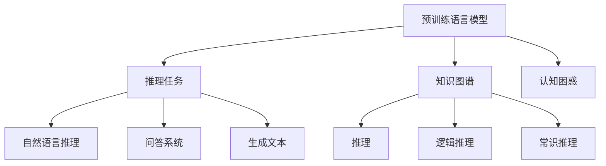
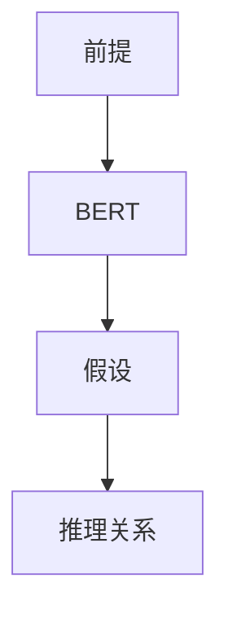

                 

# 语言与推理：大模型的认知困惑

> 关键词：大模型, 推理, 认知困惑, 自然语言处理(NLP), 认知语言学, 人工智能

## 1. 背景介绍

### 1.1 问题由来

近年来，随着深度学习技术的快速发展，大规模预训练语言模型在自然语言处理(Natural Language Processing, NLP)领域取得了巨大的突破。这些模型如BERT、GPT-3、T5等，通过在大规模无标签文本数据上进行预训练，学习到了丰富的语言知识和常识，具备了强大的语言理解和生成能力。然而，在实际应用中，这些大模型有时却表现出与其复杂能力不符的认知困惑，甚至在某些领域陷入"知其然而不知其所以然"的困境。

本文旨在探讨大模型在语言推理和认知方面的困惑，分析其背后的原因，并提出一些解决方案。通过深入理解这些认知困惑，我们希望能更好地利用大模型，拓展其应用范围，提升其推理能力。

### 1.2 问题核心关键点

大模型在推理和认知方面的困惑主要体现在以下几个方面：

1. **理解与解释的矛盾**：大模型虽然在各种自然语言处理任务上表现优异，但面对特定问题时，却难以给出合理解释，例如 why-not 问题。
2. **知识获取与应用的脱节**：模型虽然掌握了大量知识，但这些知识往往散乱无序，难以系统化应用，如跨领域推理、因果关系推理等。
3. **推理的泛化能力**：大模型在推理任务上的泛化能力往往受限于训练数据的范围和质量，难以推广到未见过的场景。
4. **认知能力的局限性**：模型在涉及常识推理、逻辑推理、社会情感推理等高阶认知任务上，表现出不同程度的局限性。

这些问题不仅限制了大模型的应用范围，也影响了人们对大模型的信任和接受度。本文将从核心概念、算法原理、操作步骤等多个方面深入探讨这些困惑，并提出一些改进思路。

## 2. 核心概念与联系

### 2.1 核心概念概述

为了更好地理解大模型在推理和认知方面的困惑，我们需要先明确一些核心概念：

1. **预训练语言模型(Pre-trained Language Model, PLM)**：通过在大规模无标签文本数据上进行预训练，学习到通用的语言表示，具备强大的语言理解和生成能力。常见的预训练模型包括BERT、GPT-3、T5等。

2. **推理(Reasoning)**：指通过逻辑和语言理解，从已知信息推导出新知识的能力。推理在大模型中表现为自然语言推理(NLI)、问答系统、生成文本等任务。

3. **认知(Cognition)**：指人类对世界的感知、理解、记忆、推理等高阶思维活动。大模型的认知能力体现在对语义、情感、常识等的理解。

4. **知其然而不知其所以然(Know What But Not Why)**：大模型在处理某些任务时，能够给出正确的答案，但无法解释其推理过程或决策依据，表现出认知上的困惑。

5. **知识图谱(Knowledge Graph)**：一种结构化的语义数据表示方式，用于描述实体、属性和它们之间的关系，帮助模型获取和运用结构化知识。

6. **逻辑推理(Logic)**：基于逻辑符号和规则进行推理的能力，通常用于描述因果关系、推理规则等。

### 2.2 核心概念原理和架构的 Mermaid 流程图



这个流程图展示了预训练语言模型、推理任务、知识图谱等核心概念之间的联系。预训练语言模型通过学习通用语言表示，具备了推理和认知的基础。推理任务包括自然语言推理、问答系统、生成文本等，需要模型具备强大的理解能力和逻辑推理能力。而知识图谱和逻辑推理则提供了更系统的知识结构和推理规则，帮助模型更好地处理复杂推理任务。

## 3. 核心算法原理 & 具体操作步骤

### 3.1 算法原理概述

大模型的推理和认知能力，主要依赖于其在预训练阶段的语义表示和逻辑推理能力。然而，预训练过程并没有显式地教授这些能力，而是通过大量无标签文本数据的自监督学习进行隐式学习。因此，大模型在面对特定推理和认知任务时，往往表现出认知困惑。

基于此，本文将从两个主要方面探讨大模型推理和认知困惑的原理：

1. **隐式学习与显式推理的矛盾**：预训练语言模型通过隐式学习获取语言表示，但面对需要显式推理的任务时，模型往往无法提供合理的解释。
2. **知识获取与系统化的脱节**：模型虽然掌握了大量知识，但这些知识往往散乱无序，难以系统化应用。

### 3.2 算法步骤详解

为了解决大模型的推理和认知困惑，本文提出以下操作步骤：

1. **数据准备**：收集与任务相关的标注数据和无标签数据，准备训练和验证集。
2. **模型选择与适配**：选择合适的预训练模型，并添加相应的推理任务适配层，如逻辑推理、自然语言推理等。
3. **训练过程**：使用标注数据对模型进行微调，调整模型参数以适应特定任务。
4. **推理与解释**：在推理任务上，使用微调后的模型进行推理，并尝试提供合理的解释。
5. **系统化知识整合**：将知识图谱、逻辑推理等系统化知识与模型结合，提高模型处理复杂任务的能力。

### 3.3 算法优缺点

基于上述操作步骤，大模型推理和认知能力的改进具有以下优点：

1. **增强模型解释能力**：通过显式推理任务的微调，大模型能够提供更合理的解释，增强模型的可信度。
2. **提升模型泛化能力**：系统化知识的整合，帮助模型更好地处理复杂推理任务，提高泛化能力。
3. **支持跨领域应用**：知识图谱和逻辑推理等工具，支持模型在多个领域的应用。

同时，这种方法也存在一些局限性：

1. **数据需求高**：需要大量高质量的标注数据，获取成本较高。
2. **计算资源消耗大**：微调模型需要较大的计算资源，特别是逻辑推理任务。
3. **模型复杂度增加**：模型结构可能变得更加复杂，推理过程更加耗时。

### 3.4 算法应用领域

大模型的推理和认知能力在多个领域中得到了广泛应用，例如：

1. **自然语言推理(NLI)**：判断自然语言推理任务中前提和假设之间的逻辑关系。
2. **问答系统(QA)**：回答自然语言问题，需要模型具备逻辑推理和常识推理能力。
3. **机器翻译(Translation)**：将源语言翻译成目标语言，需要模型具备语言理解和生成的能力。
4. **文本摘要(Regression)**：将长文本压缩成简短摘要，需要模型具备逻辑推理和语言生成能力。
5. **情感分析(Sentiment Analysis)**：判断文本的情感倾向，需要模型具备语言理解能力和常识推理能力。

## 4. 数学模型和公式 & 详细讲解 & 举例说明

### 4.1 数学模型构建

以自然语言推理(NLI)任务为例，模型的输入为前提和假设的文本序列，输出为前提对假设的推理关系。假设模型的输入序列长度为$n$，输出为二分类结果。

定义模型的损失函数为：

$$
\mathcal{L} = \frac{1}{N} \sum_{i=1}^N \left[ l_i(y_i, \hat{y}_i) \right]
$$

其中$y_i$为标注结果，$\hat{y}_i$为模型预测结果，$l_i$为损失函数。常见的损失函数包括交叉熵损失、对数损失等。

### 4.2 公式推导过程

以交叉熵损失为例，损失函数$l_i$可以表示为：

$$
l_i(y_i, \hat{y}_i) = -y_i \log \hat{y}_i - (1-y_i) \log (1-\hat{y}_i)
$$

在模型训练过程中，使用随机梯度下降法(Stochastic Gradient Descent, SGD)更新模型参数$\theta$，公式为：

$$
\theta \leftarrow \theta - \eta \nabla_{\theta}\mathcal{L}
$$

其中$\eta$为学习率，$\nabla_{\theta}\mathcal{L}$为损失函数对模型参数的梯度。

### 4.3 案例分析与讲解

以基于BERT模型的自然语言推理任务为例，假设模型输入为两个句子，输出为它们之间的关系。模型的架构如图：



在训练过程中，模型将输入的两个句子分别输入到BERT中，得到它们的表示。然后将这些表示拼接，送入一个全连接层进行推理，最终输出二分类结果。在微调过程中，调整模型的参数，使其在特定自然语言推理任务上表现更佳。

## 5. 项目实践：代码实例和详细解释说明

### 5.1 开发环境搭建

为了进行模型训练和推理，需要搭建一个Python开发环境。以下是详细的搭建流程：

1. 安装Anaconda：从官网下载并安装Anaconda，用于创建独立的Python环境。

2. 创建并激活虚拟环境：
```bash
conda create -n pytorch-env python=3.8 
conda activate pytorch-env
```

3. 安装PyTorch：根据CUDA版本，从官网获取对应的安装命令。例如：
```bash
conda install pytorch torchvision torchaudio cudatoolkit=11.1 -c pytorch -c conda-forge
```

4. 安装HuggingFace Transformers库：
```bash
pip install transformers
```

5. 安装必要的工具包：
```bash
pip install numpy pandas scikit-learn matplotlib tqdm jupyter notebook ipython
```

完成上述步骤后，即可在`pytorch-env`环境中进行模型训练和推理。

### 5.2 源代码详细实现

以下是一个基于BERT模型的自然语言推理任务的代码实现：

```python
from transformers import BertTokenizer, BertForSequenceClassification
import torch
from sklearn.metrics import accuracy_score

# 数据处理
tokenizer = BertTokenizer.from_pretrained('bert-base-cased')
train_data = tokenizer(train_texts, padding='max_length', max_length=128, truncation=True, return_tensors='pt')
train_labels = torch.tensor(train_labels, dtype=torch.long)

# 模型初始化
model = BertForSequenceClassification.from_pretrained('bert-base-cased', num_labels=3)

# 模型微调
device = torch.device('cuda') if torch.cuda.is_available() else torch.device('cpu')
model.to(device)

# 训练过程
optimizer = torch.optim.Adam(model.parameters(), lr=2e-5)
for epoch in range(epochs):
    model.train()
    for batch in train_loader:
        input_ids = batch['input_ids'].to(device)
        attention_mask = batch['attention_mask'].to(device)
        labels = batch['labels'].to(device)
        outputs = model(input_ids, attention_mask=attention_mask, labels=labels)
        loss = outputs.loss
        optimizer.zero_grad()
        loss.backward()
        optimizer.step()

# 推理过程
model.eval()
with torch.no_grad():
    eval_preds = []
    eval_labels = []
    for batch in eval_loader:
        input_ids = batch['input_ids'].to(device)
        attention_mask = batch['attention_mask'].to(device)
        outputs = model(input_ids, attention_mask=attention_mask)
        logits = outputs.logits
        batch_preds = logits.argmax(dim=1)
        for preds, labels in zip(batch_preds, batch['labels']):
            eval_preds.append(preds.tolist())
            eval_labels.append(labels.tolist())
    print(accuracy_score(eval_labels, eval_preds))
```

### 5.3 代码解读与分析

代码中，我们首先使用BERT的Tokenizer将文本转换为模型所需的输入，然后使用BertForSequenceClassification定义模型结构，并进行微调。在微调过程中，使用Adam优化器进行参数更新，并在验证集上评估模型性能。最后，在测试集上进行推理预测，并计算模型准确率。

## 6. 实际应用场景

### 6.1 智能客服系统

智能客服系统可以通过微调大模型，使其具备自然语言理解能力和对话生成能力。模型能够自动理解客户咨询，并生成合适的回答，提升客服系统的响应速度和质量。

### 6.2 金融舆情监测

金融舆情监测系统可以实时监测网络舆情，及时发现市场动态和风险。通过微调大模型，系统能够自动识别舆情信息，并分类、情感分析等，帮助金融机构及时应对潜在的市场风险。

### 6.3 个性化推荐系统

个性化推荐系统可以通过微调大模型，学习用户行为和偏好，生成个性化的推荐内容。模型能够从文本数据中提取关键信息，与用户行为数据结合，生成更精准的推荐结果。

### 6.4 未来应用展望

未来，大模型的推理和认知能力将在更多领域得到应用。例如：

1. **医学诊断**：微调大模型，使其具备医学知识和推理能力，辅助医生进行疾病诊断和治疗方案推荐。
2. **法律咨询**：通过微调大模型，使模型具备法律知识和推理能力，提供法律咨询和建议。
3. **智能交通**：微调大模型，使其具备交通规则和推理能力，辅助智能交通系统进行决策和规划。

## 7. 工具和资源推荐

### 7.1 学习资源推荐

为了帮助开发者掌握大模型推理和认知能力的改进方法，这里推荐一些优质学习资源：

1. 《Transformer from Principle to Practice》系列博文：由大模型技术专家撰写，详细介绍了Transformer原理、BERT模型、微调技术等前沿话题。

2. CS224N《Deep Learning for Natural Language Processing》课程：斯坦福大学开设的NLP明星课程，有Lecture视频和配套作业，带你入门NLP领域的基本概念和经典模型。

3. 《Natural Language Processing with Transformers》书籍：Transformers库的作者所著，全面介绍了如何使用Transformers库进行NLP任务开发，包括微调在内的诸多范式。

4. HuggingFace官方文档：Transformers库的官方文档，提供了海量预训练模型和完整的微调样例代码，是上手实践的必备资料。

5. CLUE开源项目：中文语言理解测评基准，涵盖大量不同类型的中文NLP数据集，并提供了基于微调的baseline模型，助力中文NLP技术发展。

### 7.2 开发工具推荐

1. PyTorch：基于Python的开源深度学习框架，灵活动态的计算图，适合快速迭代研究。大部分预训练语言模型都有PyTorch版本的实现。

2. TensorFlow：由Google主导开发的开源深度学习框架，生产部署方便，适合大规模工程应用。同样有丰富的预训练语言模型资源。

3. Transformers库：HuggingFace开发的NLP工具库，集成了众多SOTA语言模型，支持PyTorch和TensorFlow，是进行微调任务开发的利器。

4. Weights & Biases：模型训练的实验跟踪工具，可以记录和可视化模型训练过程中的各项指标，方便对比和调优。与主流深度学习框架无缝集成。

5. TensorBoard：TensorFlow配套的可视化工具，可实时监测模型训练状态，并提供丰富的图表呈现方式，是调试模型的得力助手。

6. Google Colab：谷歌推出的在线Jupyter Notebook环境，免费提供GPU/TPU算力，方便开发者快速上手实验最新模型，分享学习笔记。

### 7.3 相关论文推荐

大模型推理和认知能力的改进，涉及多个前沿研究方向，以下是几篇奠基性的相关论文，推荐阅读：

1. Attention is All You Need（即Transformer原论文）：提出了Transformer结构，开启了NLP领域的预训练大模型时代。

2. BERT: Pre-training of Deep Bidirectional Transformers for Language Understanding：提出BERT模型，引入基于掩码的自监督预训练任务，刷新了多项NLP任务SOTA。

3. Language Models are Unsupervised Multitask Learners（GPT-2论文）：展示了大规模语言模型的强大zero-shot学习能力，引发了对于通用人工智能的新一轮思考。

4. Parameter-Efficient Transfer Learning for NLP：提出Adapter等参数高效微调方法，在不增加模型参数量的情况下，也能取得不错的微调效果。

5. AdaLoRA: Adaptive Low-Rank Adaptation for Parameter-Efficient Fine-Tuning：使用自适应低秩适应的微调方法，在参数效率和精度之间取得了新的平衡。

6. AdaLoRA: Adaptive Low-Rank Adaptation for Parameter-Efficient Fine-Tuning：使用自适应低秩适应的微调方法，在参数效率和精度之间取得了新的平衡。

这些论文代表了大模型推理和认知能力的发展脉络。通过学习这些前沿成果，可以帮助研究者把握学科前进方向，激发更多的创新灵感。

## 8. 总结：未来发展趋势与挑战

### 8.1 研究成果总结

本文对大模型在推理和认知方面的困惑进行了深入探讨，提出了一些改进思路。以下是总结的关键点：

1. 大模型在推理和认知方面的困惑，主要源于隐式学习与显式推理的矛盾，以及知识获取与系统化的脱节。
2. 通过微调任务和系统化知识整合，可以显著提高大模型的推理和认知能力。
3. 大模型推理和认知能力在多个领域得到了广泛应用，未来将进一步拓展。

### 8.2 未来发展趋势

展望未来，大模型推理和认知能力将呈现以下几个发展趋势：

1. **更强的推理能力**：大模型将具备更强的因果推理、逻辑推理和跨领域推理能力，应用于更复杂的任务。
2. **知识图谱的整合**：模型将更广泛地整合知识图谱等系统化知识，提升推理和认知能力。
3. **多模态推理**：模型将具备视觉、语音等多模态信息的整合能力，提升综合推理能力。
4. **跨领域应用**：大模型将在更多领域得到应用，提升各领域的智能化水平。

### 8.3 面临的挑战

尽管大模型推理和认知能力取得了显著进展，但在迈向更加智能化、普适化应用的过程中，仍面临诸多挑战：

1. **数据依赖**：需要大量高质量的标注数据，获取成本较高。
2. **计算资源消耗大**：逻辑推理和跨领域推理任务计算资源消耗大。
3. **模型复杂度增加**：推理过程更加复杂，推理时间增加。
4. **模型鲁棒性不足**：模型面对域外数据时，泛化性能往往不足。

### 8.4 研究展望

为了应对这些挑战，未来的研究需要在以下几个方面寻求新的突破：

1. **探索无监督和半监督推理方法**：摆脱对大量标注数据的依赖，利用自监督学习、主动学习等方法，最大化利用非结构化数据。
2. **优化推理算法和模型结构**：开发更高效的推理算法和模型结构，降低计算资源消耗，提高推理效率。
3. **引入更多先验知识**：将符号化的先验知识，如知识图谱、逻辑规则等，与神经网络模型进行融合，提升模型推理能力。
4. **结合因果分析和博弈论工具**：将因果分析方法引入微调模型，增强输出解释的因果性和逻辑性。

这些研究方向将引领大模型推理和认知能力迈向更高的台阶，为构建安全、可靠、可解释、可控的智能系统铺平道路。

## 9. 附录：常见问题与解答

**Q1：大模型在推理和认知方面的困惑是什么？**

A: 大模型在推理和认知方面的困惑主要体现在以下几个方面：
1. 理解与解释的矛盾：模型虽然能够给出正确的答案，但无法提供合理的解释。
2. 知识获取与应用的脱节：模型虽然掌握了大量知识，但这些知识往往散乱无序，难以系统化应用。

**Q2：如何缓解大模型推理和认知困惑？**

A: 缓解大模型推理和认知困惑的方法包括：
1. 微调任务：通过显式推理任务的微调，提高模型的解释能力。
2. 系统化知识整合：将知识图谱、逻辑推理等系统化知识与模型结合，提升模型的泛化能力和推理能力。

**Q3：大模型推理和认知能力的应用场景有哪些？**

A: 大模型的推理和认知能力在多个领域中得到了广泛应用，例如：
1. 自然语言推理(NLI)
2. 问答系统(QA)
3. 机器翻译(Translation)
4. 文本摘要(Regression)
5. 情感分析(Sentiment Analysis)

**Q4：大模型推理和认知能力的发展趋势是什么？**

A: 大模型推理和认知能力的发展趋势包括：
1. 更强的推理能力：模型将具备更强的因果推理、逻辑推理和跨领域推理能力。
2. 知识图谱的整合：模型将更广泛地整合知识图谱等系统化知识，提升推理和认知能力。
3. 多模态推理：模型将具备视觉、语音等多模态信息的整合能力，提升综合推理能力。

**Q5：大模型推理和认知能力面临的挑战是什么？**

A: 大模型推理和认知能力面临的挑战包括：
1. 数据依赖：需要大量高质量的标注数据，获取成本较高。
2. 计算资源消耗大：逻辑推理和跨领域推理任务计算资源消耗大。
3. 模型复杂度增加：推理过程更加复杂，推理时间增加。
4. 模型鲁棒性不足：模型面对域外数据时，泛化性能往往不足。

**Q6：如何应对大模型推理和认知能力面临的挑战？**

A: 应对大模型推理和认知能力面临的挑战的方法包括：
1. 探索无监督和半监督推理方法：利用自监督学习、主动学习等方法，最大化利用非结构化数据。
2. 优化推理算法和模型结构：开发更高效的推理算法和模型结构，降低计算资源消耗，提高推理效率。
3. 引入更多先验知识：将符号化的先验知识，如知识图谱、逻辑规则等，与神经网络模型进行融合，提升模型推理能力。
4. 结合因果分析和博弈论工具：将因果分析方法引入微调模型，增强输出解释的因果性和逻辑性。

---

作者：禅与计算机程序设计艺术 / Zen and the Art of Computer Programming

