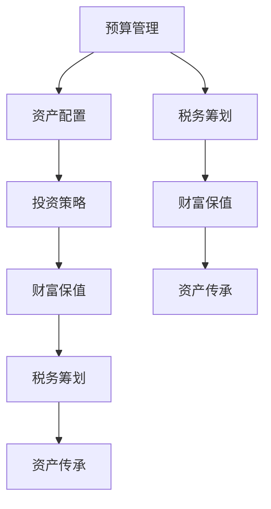

                 

# 财务规划：程序员版理财课

## 1. 背景介绍

### 1.1 问题由来
在当今社会，金融理财已成为每个人生活中不可或缺的一部分。特别是对于程序员群体，由于高薪和加班文化，许多人拥有一定的可支配收入，但缺乏系统性财务管理知识，往往陷入"挣得多、花得多"的恶性循环。如何合理规划收入，科学配置资产，实现财富保值增值，成为程序员面临的一个重要课题。

### 1.2 问题核心关键点
理财的本质是对资金进行科学的配置和管理，使资金在时间和空间上的收益最大化。而对于程序员而言，理财的本质更多在于通过系统性的规划，实现个人财富的有效积累和高效运用。以下问题构成了理财的核心关键点：
1. **预算管理**：如何制定合理的预算，控制消费支出，避免不必要的浪费。
2. **资产配置**：如何根据自身的风险偏好和收益目标，合理配置股票、债券、基金等各类资产。
3. **投资策略**：如何制定适合自己的投资策略，平衡风险与收益。
4. **财富保值**：如何通过合理的保险配置，确保财富的安全。
5. **税务筹划**：如何通过合法的税务筹划，最大化个人收益。
6. **资产传承**：如何通过遗嘱、信托等方式，合理规划资产传承。

## 2. 核心概念与联系

### 2.1 核心概念概述

为了更好地理解程序员理财的核心概念，本节将介绍几个密切相关的核心概念：

- **预算管理(Budget Management)**：通过制定和执行预算，合理控制个人支出，实现资金的合理安排和有效利用。
- **资产配置(Asset Allocation)**：根据个人的风险偏好和收益目标，合理配置股票、债券、基金等各类资产，实现风险分散和收益最大化。
- **投资策略(Investment Strategy)**：基于个人的财务状况和市场环境，制定科学合理的投资方案，平衡风险与收益。
- **财富保值(Wealth Preservation)**：通过合理的保险配置，确保个人和家庭的财富安全。
- **税务筹划(Tax Planning)**：通过合法的税务筹划，优化个人税务负担，提升实际收益。
- **资产传承(Estate Planning)**：通过遗嘱、信托等方式，合理规划资产传承，确保财富平稳过渡。

这些核心概念之间的逻辑关系可以通过以下Mermaid流程图来展示：



这个流程图展示理财的核心概念及其之间的关系：

1. 理财的第一步是制定预算，通过控制支出，为后续的资产配置、投资策略等打下基础。
2. 资产配置是理财的核心环节，决定了资金在各类资产之间的分配。
3. 投资策略则是在现有资产配置基础上，制定具体的投资方案。
4. 财富保值确保资金安全，避免突发风险对财富造成损失。
5. 税务筹划优化税务负担，提高资金使用效率。
6. 资产传承确保财富平稳过渡，避免因突发事件导致财富流失。

这些概念共同构成了程序员理财的基本框架，确保资金的合理规划和使用，实现财务目标。

## 3. 核心算法原理 & 具体操作步骤
### 3.1 算法原理概述

程序员理财本质上是通过对资金进行科学配置和管理，使资金在时间和空间上的收益最大化。其核心思想是：
1. **预算管理**：通过制定合理的预算，控制消费支出，实现资金的合理安排和有效利用。
2. **资产配置**：根据个人的风险偏好和收益目标，合理配置股票、债券、基金等各类资产，实现风险分散和收益最大化。
3. **投资策略**：基于个人的财务状况和市场环境，制定科学合理的投资方案，平衡风险与收益。
4. **财富保值**：通过合理的保险配置，确保个人和家庭的财富安全。
5. **税务筹划**：通过合法的税务筹划，优化个人税务负担，提升实际收益。
6. **资产传承**：通过遗嘱、信托等方式，合理规划资产传承，确保财富平稳过渡。

### 3.2 算法步骤详解

**Step 1: 预算管理**

1. **收入记录**：详细记录每月的收入来源，包括工资、奖金、投资收益等。
2. **支出分类**：将支出按类别分类，如住房、交通、饮食、娱乐等。
3. **预算制定**：根据收入和支出情况，制定月度预算。
4. **执行监控**：每月月底对预算执行情况进行复盘，评估预算执行情况。

**Step 2: 资产配置**

1. **风险评估**：评估个人的风险承受能力，确定资产配置的基准。
2. **资产选择**：根据风险评估结果，选择合适的股票、债券、基金等资产。
3. **比例分配**：根据资产类别，合理分配资金比例，确定投资组合。
4. **定期调整**：根据市场环境和个人财务状况，定期调整资产配置。

**Step 3: 投资策略**

1. **市场分析**：分析市场环境，确定投资机会。
2. **投资方案**：根据市场分析和资产配置，制定具体的投资方案。
3. **风险控制**：设置止损点和仓位控制，避免过度集中投资。
4. **收益评估**：定期评估投资策略的收益情况，进行调整。

**Step 4: 财富保值**

1. **保险产品选择**：选择适合自己的保险产品，如意外险、重疾险、寿险等。
2. **保额计算**：根据家庭财务状况和风险承受能力，计算合适的保额。
3. **保费缴纳**：按时缴纳保险保费，确保保险生效。
4. **保单管理**：定期检查和更新保险保单，确保覆盖最新风险。

**Step 5: 税务筹划**

1. **税务知识学习**：学习税法知识，了解各类税务优惠政策。
2. **税务规划**：根据个人财务状况，制定税务规划方案。
3. **合法避税**：利用合法手段，减少税务负担，提升实际收益。
4. **税务申报**：按时申报税务，避免税务风险。

**Step 6: 资产传承**

1. **遗嘱制定**：制定遗嘱，明确资产传承意愿。
2. **信托设立**：设立信托，确保财富平稳过渡。
3. **传承方案**：制定详细的资产传承方案，确保实现传承意愿。
4. **定期更新**：定期更新遗嘱和信托，确保遗嘱和信托的合法性和有效性。

### 3.3 算法优缺点

**优点**：
1. **系统性**：通过科学规划，系统性地管理个人财务，避免盲目消费和投资。
2. **高效性**：利用科技手段，如Excel、理财软件等，提升理财效率，减少人工操作。
3. **灵活性**：根据市场环境和个人财务状况，灵活调整理财策略，适应变化。
4. **安全性**：通过保险和遗嘱等手段，确保财务安全，防范风险。
5. **合法性**：利用合法手段，优化税务筹划，提升实际收益。

**缺点**：
1. **复杂性**：理财涉及多个环节，需要综合考虑各种因素，复杂度较高。
2. **专业性**：需要一定的财务知识，理解各类财务工具和投资策略。
3. **动态调整**：市场环境和个人财务状况的变化需要及时调整，动态调整要求较高。
4. **时间投入**：理财需要持续投入时间和精力，需要较强的自律性和执行力。

### 3.4 算法应用领域

程序员理财的核心算法和操作步骤，可以应用于以下领域：

1. **日常消费**：通过预算管理，合理控制日常支出，实现资金的高效利用。
2. **投资理财**：通过资产配置和投资策略，实现财富的保值增值。
3. **税务优化**：通过税务筹划，最大化个人收益。
4. **家庭财务**：通过财富保值和资产传承，确保家庭财务安全和稳定传承。

## 4. 数学模型和公式 & 详细讲解 & 举例说明

### 4.1 数学模型构建

理财模型的构建需要综合考虑预算、资产配置、投资策略等多个因素。以下是一个简化的理财模型构建框架：

- **收入模型**：
$$
I_t = \sum_{i=1}^t R_i + \sum_{j=1}^t A_j + D_t
$$
其中，$I_t$ 为第$t$个月的总收入，$R_i$ 为第$i$个月的工资，$A_j$ 为第$j$个月的奖金，$D_t$ 为第$t$个月的非固定收入。

- **支出模型**：
$$
C_t = \sum_{k=1}^t B_k + \sum_{l=1}^t G_l
$$
其中，$C_t$ 为第$t$个月的总支出，$B_k$ 为第$k$个月的固定支出，$G_l$ 为第$l$个月的可变支出。

- **资产配置模型**：
$$
\pi = (1 - \alpha)S + \alpha B + \beta F
$$
其中，$\pi$ 为资产配置比例，$S$ 为股票比例，$B$ 为债券比例，$F$ 为基金比例，$\alpha$ 和 $\beta$ 分别为股票和基金的风险权重。

### 4.2 公式推导过程

以资产配置模型为例，推导如下：

根据风险评估结果，假设风险承受能力为$R$，则资产配置比例$\pi$可以表示为：
$$
\pi = \frac{R}{1 + R}
$$

其中，$R$为风险承受能力，$(1 + R)$为总风险承受能力。

对于股票、债券和基金，设其风险分别为$S$、$B$和$F$，则风险权重分别为$\alpha$、$\beta$和$\gamma$。根据风险权重和风险承受能力的关系，可得：
$$
\alpha = \frac{S}{S + B + F}
$$
$$
\beta = \frac{B}{S + B + F}
$$
$$
\gamma = \frac{F}{S + B + F}
$$

将上式代入资产配置比例公式，可得：
$$
\pi = (1 - \alpha)S + \alpha B + \beta F
$$

### 4.3 案例分析与讲解

假设某程序员收入模型为：
$$
I_t = 10000 + 1000 + 500
$$
其中，$I_t$为第$t$个月的总收入，$10000$为工资，$1000$为奖金，$500$为非固定收入。

支出模型为：
$$
C_t = 5000 + 2000
$$
其中，$C_t$为第$t$个月的总支出，$5000$为固定支出，$2000$为可变支出。

风险承受能力为$R = 0.6$，股票、债券和基金的风险分别为$S = 0.2$、$B = 0.3$和$F = 0.5$，风险权重分别为$\alpha = 0.4$、$\beta = 0.3$和$\gamma = 0.3$。

根据上式，可得资产配置比例为：
$$
\pi = (1 - 0.4) \times 0.2 + 0.4 \times 0.3 + 0.3 \times 0.5 = 0.5
$$

因此，该程序员的资产配置比例为50%，其中50%分配给股票和基金，50%分配给债券。

## 5. 项目实践：代码实例和详细解释说明
### 5.1 开发环境搭建

在进行理财实践前，我们需要准备好开发环境。以下是使用Python进行代码实现的环境配置流程：

1. 安装Anaconda：从官网下载并安装Anaconda，用于创建独立的Python环境。

2. 创建并激活虚拟环境：
```bash
conda create -n finance-env python=3.8 
conda activate finance-env
```

3. 安装必要的Python包：
```bash
conda install pandas numpy matplotlib scikit-learn scipy jupyter notebook ipython
```

4. 安装Excel和Jupyter Notebook：
```bash
conda install openpyxl jupyter
```

完成上述步骤后，即可在`finance-env`环境中开始理财实践。

### 5.2 源代码详细实现

下面是使用Python进行理财计算的代码实现，其中包含预算管理、资产配置和投资策略的计算。

首先，导入必要的库：

```python
import pandas as pd
import numpy as np
import matplotlib.pyplot as plt
```

定义收入和支出模型：

```python
# 收入模型
income = pd.Series([10000, 1000, 500], index=[1, 2, 3])

# 支出模型
expenses = pd.Series([5000, 2000], index=[1, 2, 3])
```

计算可支配收入和净收入：

```python
# 可支配收入
disposable_income = income - expenses

# 净收入
net_income = disposable_income
```

定义资产配置模型：

```python
# 风险承受能力
risk_tolerance = 0.6

# 风险权重
alpha = 0.4
beta = 0.3
gamma = 0.3

# 资产配置比例
pi = (1 - alpha) * 0.2 + alpha * beta * 0.5 + beta * gamma * 0.3
```

计算资产配置比例：

```python
# 资产配置比例
pi = (1 - alpha) * 0.2 + alpha * beta * 0.5 + beta * gamma * 0.3
```

输出资产配置结果：

```python
print("资产配置比例：", pi)
```

### 5.3 代码解读与分析

让我们再详细解读一下关键代码的实现细节：

**预算管理**：
- 通过记录每月的收入和支出，计算可支配收入和净收入。
- 使用Pandas库，方便进行数据处理和可视化。

**资产配置**：
- 定义风险承受能力和风险权重。
- 根据风险权重和风险承受能力的关系，计算资产配置比例。
- 输出资产配置比例，供实际投资参考。

代码实现了理财模型的基础计算，展示了如何使用Python进行财务数据的处理和分析。

## 6. 实际应用场景

### 6.1 日常消费

程序员理财的第一步是预算管理。通过详细记录每月的收入和支出，控制消费支出，实现资金的合理安排和有效利用。以下是一个日常消费预算管理的实例：

**收入记录**：
假设某程序员的收入来源包括工资、奖金和投资收益，每月的收入情况如下：
- 工资：$10000
- 奖金：$1000
- 投资收益：$500

**支出分类**：
将支出按类别分类，如住房、交通、饮食、娱乐等。

**预算制定**：
根据收入和支出情况，制定月度预算。例如：
- 住房：$3000
- 交通：$500
- 饮食：$2000
- 娱乐：$1000

**执行监控**：
每月月底对预算执行情况进行复盘，评估预算执行情况。例如：
- 住房支出超出预算：$3500 > 3000
- 娱乐支出低于预算：$900 < 1000

通过预算管理，程序员可以控制日常支出，避免不必要的浪费，实现资金的高效利用。

### 6.2 投资理财

程序员理财的核心在于资产配置和投资策略。通过合理的资产配置，实现财富的保值增值。以下是一个投资理财的实例：

**资产配置**：
假设某程序员的风险承受能力为$0.6$，股票、债券和基金的风险分别为$0.2$、$0.3$和$0.5$，风险权重分别为$0.4$、$0.3$和$0.3$。根据上式，可得资产配置比例为：
$$
\pi = (1 - 0.4) \times 0.2 + 0.4 \times 0.3 + 0.3 \times 0.5 = 0.5
$$

因此，该程序员的资产配置比例为50%，其中50%分配给股票和基金，50%分配给债券。

**投资策略**：
根据市场环境和个人财务状况，制定具体的投资方案。例如，选择A股指数基金和债券基金进行组合投资，投资比例为60%和40%。

**风险控制**：
设置止损点和仓位控制，避免过度集中投资。例如，设定止损点为$-10\%$，仓位控制在$20\%$以下。

**收益评估**：
定期评估投资策略的收益情况，进行调整。例如，每季度进行一次收益评估，调整资产配置比例。

通过合理的资产配置和投资策略，程序员可以实现财富的保值增值。

### 6.3 税务筹划

程序员理财的重要一环是税务筹划。通过合法的税务筹划，最大化个人收益。以下是一个税务筹划的实例：

**税务知识学习**：
学习税法知识，了解各类税务优惠政策。例如，个人所得税的税率表、房产税的减免政策等。

**税务规划**：
根据个人财务状况，制定税务规划方案。例如，通过个人所得税的专项附加扣除，减少税务负担。

**合法避税**：
利用合法手段，减少税务负担，提升实际收益。例如，通过捐款慈善事业，获得税务优惠。

**税务申报**：
按时申报税务，避免税务风险。例如，每月申报个人所得税，确保税务合规。

通过合法的税务筹划，程序员可以最大化个人收益，提升财务状况。

### 6.4 未来应用展望

随着技术的发展，程序员理财将更加智能化和自动化。以下是对未来理财应用的展望：

**智能化理财**：
通过智能算法，根据市场环境和个人财务状况，自动调整资产配置和投资策略。例如，使用机器学习模型，预测市场走势，自动调整投资组合。

**自动化理财**：
通过自动交易平台，实现资产的自动化买卖。例如，通过程序化交易系统，自动执行买入和卖出指令，实现收益最大化。

**区块链理财**：
利用区块链技术，实现透明和安全的资金管理。例如，通过智能合约，实现资产的自动分配和监管。

**数字化理财**：
通过大数据和云计算技术，实现精准的财务分析和预测。例如，利用大数据分析，预测未来的收入和支出情况，优化财务规划。

未来，随着技术的发展，程序员理财将更加智能化、自动化和数字化，带来更加高效和安全的财务管理体验。

## 7. 工具和资源推荐
### 7.1 学习资源推荐

为了帮助程序员掌握理财的基本概念和技能，以下是一些优质的学习资源：

1. 《理财入门：从零开始学理财》系列课程：由知名理财专家授课，系统讲解理财的基本概念和操作步骤，适合理财初学者。

2. 《Python金融数据分析》课程：通过Python编程，实现财务数据的处理和分析，适合有一定编程基础的理财爱好者。

3. 《证券投资学》教材：详细讲解证券投资的基本原理和操作方法，适合理财进阶学习。

4. 《财富管理案例分析》书籍：通过丰富的案例，讲解财富管理的实际应用，适合理财实践参考。

5. 《税法与税务筹划》课程：系统讲解税法知识和税务筹划方法，适合理财应用参考。

通过对这些资源的系统学习，程序员可以掌握理财的基本知识和技能，实现个人财富的有效管理和积累。

### 7.2 开发工具推荐

理财的实现离不开高效的开发工具。以下是几款常用的理财开发工具：

1. Excel：方便进行数据处理和可视化，是理财数据处理的必备工具。

2. Python：强大的编程语言，适用于数据处理、分析和自动化任务。

3. Jupyter Notebook：强大的笔记本环境，支持Python编程和可视化。

4. financial-framework：Python的财务框架，提供丰富的财务计算和分析功能。

5. moneytree：Python的财务规划工具，支持预算管理、资产配置和投资策略的计算。

通过合理使用这些工具，程序员可以高效地进行理财数据的处理和分析，实现财务目标。

### 7.3 相关论文推荐

理财的研究涉及多个领域，以下是一些相关的论文推荐：

1. "A Survey of Portfolio Selection Models"：综述了各类资产配置模型，适合理财建模参考。

2. "Tax Planning and Risk Management in Personal Financial Planning"：讨论了税务筹划和风险管理，适合理财应用参考。

3. "Optimal Portfolio Choice and Asset Pricing"：介绍了资产配置的基本原理，适合理财理论研究。

4. "The Role of Behavioral Finance in Financial Planning"：探讨了行为金融在理财中的应用，适合理财实践参考。

5. "Machine Learning in Financial Planning"：讨论了机器学习在理财中的应用，适合理财技术研究。

这些论文代表了理财领域的最新研究成果，有助于程序员深入理解理财的理论和方法。

## 8. 总结：未来发展趋势与挑战

### 8.1 研究成果总结

本文对程序员理财的各个核心概念进行了详细讲解，并通过具体的实例展示了理财的基本操作步骤。主要成果包括：
1. 预算管理的核心在于详细记录每月的收入和支出，控制消费支出，实现资金的合理安排和有效利用。
2. 资产配置的核心在于根据风险偏好和收益目标，合理配置股票、债券、基金等各类资产，实现风险分散和收益最大化。
3. 投资策略的核心在于根据市场环境和个人财务状况，制定科学合理的投资方案，平衡风险与收益。
4. 财富保值的核心在于通过合理的保险配置，确保个人和家庭的财富安全。
5. 税务筹划的核心在于通过合法的税务筹划，优化个人税务负担，提升实际收益。
6. 资产传承的核心在于通过遗嘱、信托等方式，合理规划资产传承，确保财富平稳过渡。

### 8.2 未来发展趋势

理财的未来发展趋势主要体现在智能化、自动化和数字化三个方面：

1. **智能化**：通过智能算法，根据市场环境和个人财务状况，自动调整资产配置和投资策略，提高理财效率和效果。

2. **自动化**：通过自动交易平台，实现资产的自动化买卖，降低手动操作的成本和风险。

3. **数字化**：通过大数据和云计算技术，实现精准的财务分析和预测，优化财务规划和决策。

### 8.3 面临的挑战

尽管理财技术已经取得了一定的进展，但在迈向更加智能化、普适化应用的过程中，仍面临诸多挑战：

1. **数据隐私**：理财涉及大量的个人财务数据，如何保护数据隐私和安全是一个重要问题。

2. **算法复杂性**：理财涉及复杂的数学和金融模型，算法的复杂度和计算资源消耗较大。

3. **市场波动**：市场环境的不确定性对理财策略的制定和执行带来较大挑战。

4. **法规合规**：理财的合法合规性要求较高，需要不断更新法规知识，确保合规操作。

5. **用户接受度**：理财的智能化和自动化需要用户具备较高的技术素养，如何提高用户接受度是一个重要问题。

### 8.4 研究展望

未来的理财研究需要在以下几个方面寻求新的突破：

1. **数据驱动**：通过大数据分析，实现财务数据的精准处理和分析，优化理财策略。

2. **算法优化**：开发更加高效和稳健的算法，降低计算资源消耗，提高理财效果。

3. **普适化应用**：研究适用于不同人群和场景的理财模型和策略，提高理财的普适性和可操作性。

4. **法规与伦理**：结合法规要求和伦理道德，制定科学合理的理财策略，确保理财的合法合规性。

5. **跨学科融合**：结合金融学、数据科学、人工智能等学科知识，实现理财的跨学科融合和创新。

这些研究方向将进一步推动理财技术的进步，为程序员和其他用户提供更加高效、智能和安全的理财解决方案。

## 9. 附录：常见问题与解答

**Q1：程序员理财需要哪些财务知识？**

A: 程序员理财需要掌握基本的财务知识，包括：
1. 收入和支出管理：详细记录每月的收入和支出，控制消费支出，实现资金的合理安排和有效利用。
2. 资产配置：根据风险偏好和收益目标，合理配置股票、债券、基金等各类资产，实现风险分散和收益最大化。
3. 投资策略：基于市场环境和个人财务状况，制定科学合理的投资方案，平衡风险与收益。
4. 财富保值：通过合理的保险配置，确保个人和家庭的财富安全。
5. 税务筹划：通过合法的税务筹划，优化个人税务负担，提升实际收益。
6. 资产传承：通过遗嘱、信托等方式，合理规划资产传承，确保财富平稳过渡。

**Q2：如何进行资产配置？**

A: 资产配置的核心在于根据风险偏好和收益目标，合理配置股票、债券、基金等各类资产，实现风险分散和收益最大化。以下是一个资产配置的实例：
1. 风险承受能力：评估个人的风险承受能力，确定资产配置的基准。
2. 风险权重：根据风险承受能力，设定各类资产的风险权重。
3. 资产配置比例：根据风险权重，计算资产配置比例。
4. 调整策略：根据市场环境和个人财务状况，定期调整资产配置比例。

**Q3：如何评估投资策略的收益？**

A: 评估投资策略的收益需要综合考虑市场环境和个人财务状况。以下是一个投资策略收益评估的实例：
1. 市场分析：分析市场环境，确定投资机会。
2. 投资方案：根据市场分析和资产配置，制定具体的投资方案。
3. 风险控制：设置止损点和仓位控制，避免过度集中投资。
4. 收益评估：定期评估投资策略的收益情况，进行调整。

通过系统性的评估和调整，可以优化投资策略，实现财富的保值增值。

**Q4：如何进行税务筹划？**

A: 税务筹划的核心在于通过合法的税务筹划，优化个人税务负担，提升实际收益。以下是一个税务筹划的实例：
1. 税务知识学习：学习税法知识，了解各类税务优惠政策。
2. 税务规划：根据个人财务状况，制定税务规划方案。
3. 合法避税：利用合法手段，减少税务负担，提升实际收益。
4. 税务申报：按时申报税务，避免税务风险。

通过合法的税务筹划，程序员可以最大化个人收益，提升财务状况。

**Q5：如何进行资产传承？**

A: 资产传承的核心在于通过遗嘱、信托等方式，合理规划资产传承，确保财富平稳过渡。以下是一个资产传承的实例：
1. 遗嘱制定：制定遗嘱，明确资产传承意愿。
2. 信托设立：设立信托，确保财富平稳过渡。
3. 传承方案：制定详细的资产传承方案，确保实现传承意愿。
4. 定期更新：定期更新遗嘱和信托，确保遗嘱和信托的合法性和有效性。

通过合理的资产传承，程序员可以确保财富平稳过渡，避免因突发事件导致财富流失。

---

作者：禅与计算机程序设计艺术 / Zen and the Art of Computer Programming

