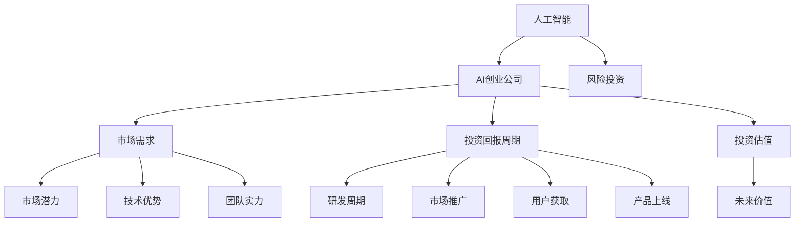

                 

# 资本市场对AI创业热情降温，投资更加谨慎

## 1. 背景介绍

### 1.1 问题由来

近年来，人工智能(AI)技术的快速发展，尤其是在深度学习、自然语言处理(NLP)、计算机视觉(CV)等领域的突破，吸引了大量资本的关注。从2015年到2020年，AI创业公司在全球累计融资达到3500亿美元，AI风险投资更是占到了所有科技创新型风险投资的27%。然而，进入2021年，资本市场的热情似乎开始降温。

特别是自2021年下半年以来，资本对于AI创业公司的投资变得更加谨慎，市场进入了一个冷静期。这主要归因于以下几个方面：

1. **技术落地困难**：尽管AI技术发展迅速，但其在实际应用中的效果往往未能达到预期。部分AI创业公司在落地过程中遭遇重重困难，难以形成实际业务价值。
2. **市场竞争激烈**：随着AI创业公司数量的激增，市场竞争日趋激烈。投资者开始更加关注公司的长期成长性和盈利能力，而非单纯的技术亮点。
3. **投资回报周期延长**：AI项目从实验室到市场的转化周期通常较长，投资者需要更多的时间来验证项目的商业前景和投资回报。
4. **投资者信心波动**：受到全球经济环境、政策法规等外部因素影响，资本市场整体波动，投资者对AI创业公司的信心有所下降。

### 1.2 问题核心关键点

资本市场对AI创业热情的降温，核心在于以下几点：

- **技术成熟度**：AI技术是否真正具备解决实际问题的能力，技术成熟度是否足够支撑商业化落地。
- **市场需求**：目标市场是否存在对AI解决方案的实际需求，以及需求规模是否能够支撑业务的持续发展。
- **商业模式**：AI创业公司能否找到合适的商业模式，实现盈利和长期发展。
- **投资回报**：投资回报周期是否可控，是否存在明确的风险收益平衡点。
- **团队能力**：团队是否具备实现项目落地所需的综合能力和资源。

理解这些问题，有助于投资者更加审慎地评估AI创业公司的投资价值。

## 2. 核心概念与联系

### 2.1 核心概念概述

为更好地理解资本市场对AI创业投资的态度变化，本节将介绍几个密切相关的核心概念：

- **人工智能(AI)**：使用计算机模拟人类智能，涵盖机器学习、深度学习、自然语言处理、计算机视觉等多个子领域。
- **AI创业公司**：以AI技术为驱动，从事创新型产品的开发和商业化，试图解决特定行业问题或提供新型的业务模式。
- **风险投资**：投资者向初创企业或早期项目提供资金支持，期望在企业成长过程中获得较高回报。
- **投资回报周期**：从投资到获得投资回报的时间周期，包括研发、市场推广、用户获取、产品上线等多个阶段。
- **投资估值**：投资时对公司未来价值的预期，包括市场潜力、技术优势、团队实力等多方面因素。

这些概念之间的逻辑关系可以通过以下Mermaid流程图来展示：



这个流程图展示了几类概念之间的核心联系：

1. 人工智能技术的成熟度直接影响AI创业公司的技术实力和产品能力。
2. AI创业公司需要明确市场需求，并结合自身技术优势进行产品开发。
3. 投资回报周期与公司的成长阶段密切相关，较长的周期需要投资者更多的耐心和信心。
4. 投资估值是投资者对公司未来价值的高低预期，反映了市场的信心和信心波动。
5. 投资回报周期、技术优势、市场需求、团队实力等都是影响投资估值的因素。

这些概念共同构成了AI创业公司投资评估的框架，帮助投资者从不同维度全面考量项目的价值。

## 3. 核心算法原理 & 具体操作步骤
### 3.1 算法原理概述

资本市场对AI创业投资的评估，本质上是一种基于数据和模型的方法。其核心思想是：通过分析公司的技术成熟度、市场需求、投资回报周期、团队能力等多方面因素，构建投资决策模型，预测未来价值和投资回报。

形式化地，假设一家AI创业公司为 $X$，其特征向量为 $F_{\theta}$，包含技术成熟度 $M$、市场需求 $D$、投资回报周期 $R$ 和团队实力 $T$ 等多个维度。设 $F_{\theta}$ 由 $F_{M}$、$F_{D}$、$F_{R}$ 和 $F_{T}$ 组成。则投资决策模型为：

$$
\hat{V}(X) = \mathop{\arg\min}_{\theta} \mathcal{L}(F_{\theta})
$$

其中 $\mathcal{L}$ 为投资决策模型损失函数，用于衡量模型预测未来价值与实际投资回报之间的差异。常见的损失函数包括平均绝对误差、均方误差等。

通过梯度下降等优化算法，投资决策模型不断更新参数 $\theta$，最小化损失函数 $\mathcal{L}$，使得模型预测未来价值逼近实际投资回报。由于 $\theta$ 已经通过历史数据获得了较好的初始化，因此即便在信息不全的情况下，投资决策模型也能较快收敛到理想的参数值 $\hat{\theta}$。

### 3.2 算法步骤详解

基于数据驱动的投资决策模型，评估AI创业公司的投资价值，一般包括以下几个关键步骤：

**Step 1: 收集和处理数据**
- 收集AI创业公司的技术、市场、财务、团队等多方面的数据。
- 对数据进行清洗、去重、归一化等预处理，保证数据的质量和一致性。

**Step 2: 构建投资决策模型**
- 选择合适的损失函数和优化算法，如均方误差损失、Adam优化器等。
- 构建多维度特征向量 $F_{\theta}$，包含技术成熟度 $M$、市场需求 $D$、投资回报周期 $R$ 和团队实力 $T$ 等多个维度。
- 设置超参数，如学习率、正则化系数、特征维度等。

**Step 3: 训练和验证模型**
- 使用历史数据集对投资决策模型进行训练，不断调整参数 $\theta$ 最小化损失函数 $\mathcal{L}$。
- 在验证集上评估模型预测的准确性和鲁棒性，防止过拟合。
- 根据验证结果调整模型参数和超参数，提高模型的泛化能力。

**Step 4: 测试和应用**
- 在新数据集上测试模型的预测效果，评估模型对新项目的适应能力。
- 根据模型预测结果，评估AI创业公司的投资价值，决定是否投资。
- 定期更新模型参数，以反映市场和行业变化，确保投资决策的及时性。

以上是构建投资决策模型的一般流程。在实际应用中，还需要根据具体项目的特点，对模型进行优化设计，如改进损失函数，引入更多特征，搜索最优的超参数组合等，以进一步提升模型预测的准确性。

### 3.3 算法优缺点

基于数据驱动的投资决策模型具有以下优点：
1. 客观性强。模型基于历史数据和特征向量，避免了主观判断和情绪干扰。
2. 预测准确。通过优化算法和特征选择，模型能够有效预测未来价值和投资回报。
3. 可扩展性强。适用于多种类型的AI创业公司，适应不同行业和市场的特点。
4. 灵活度较高。可以根据实际需要，动态调整模型结构和超参数，适应不同的投资环境。

同时，该模型也存在一定的局限性：
1. 数据依赖。模型的预测能力依赖于数据的质量和数量，获取高质量数据的成本较高。
2. 市场变化。市场环境和行业趋势的变化可能使得历史数据不再具有代表性，影响模型的预测能力。
3. 模型复杂。多维度特征向量的构建和模型训练需要较高的计算资源和技术门槛。
4. 风险管理。模型可能过于依赖单一因素，未能充分考虑不确定性和风险。

尽管存在这些局限性，但就目前而言，基于数据驱动的投资决策模型仍是评估AI创业公司投资价值的重要手段。未来相关研究的重点在于如何进一步降低模型对数据的依赖，提高模型的稳健性和可解释性，同时兼顾风险管理和市场预测的精确性。

### 3.4 算法应用领域

基于数据驱动的投资决策模型，在AI创业公司投资评估中有着广泛的应用。以下是几个典型的应用场景：

**AI创业公司投资**：
- 风险投资公司使用投资决策模型，评估AI创业公司的投资价值，决定是否进行投资。
- 通过多维度特征向量的构建和模型训练，全面考量技术成熟度、市场需求、投资回报周期和团队实力等因素。

**AI创业项目评估**：
- 政府和行业机构使用投资决策模型，对AI创业项目进行评估和筛选，选择最具潜力的项目进行支持。
- 模型可以实时监测项目进展，预测未来市场表现，为政府和行业机构提供决策参考。

**AI创业公司监控**：
- 投资者使用投资决策模型，对已投资项目的持续监控和评估，及时发现问题并进行调整。
- 通过多维度特征向量的动态更新，实时跟踪项目进展，保障投资回报的稳定性。

除了上述这些典型应用外，基于数据驱动的投资决策模型还被广泛应用于AI创业公司的财务分析、风险管理、市场预测等领域，为AI创业公司提供全方位的投资支持。

## 4. 数学模型和公式 & 详细讲解
### 4.1 数学模型构建

本节将使用数学语言对基于数据驱动的投资决策模型进行更加严格的刻画。

假设AI创业公司为 $X$，其特征向量为 $F_{\theta}=[M, D, R, T]^T$，其中 $M$ 表示技术成熟度，$D$ 表示市场需求，$R$ 表示投资回报周期，$T$ 表示团队实力。设投资决策模型的损失函数为 $\mathcal{L}(F_{\theta})$。则投资决策模型的目标为：

$$
\hat{\theta} = \mathop{\arg\min}_{\theta} \mathcal{L}(F_{\theta})
$$

其中 $\mathcal{L}$ 为损失函数，用于衡量模型预测未来价值与实际投资回报之间的差异。常用的损失函数包括均方误差、平均绝对误差等。

### 4.2 公式推导过程

以下我们以均方误差损失函数为例，推导投资决策模型的训练过程。

假设模型对AI创业公司 $X$ 的未来价值预测为 $\hat{V}(X)$，实际投资回报为 $V(X)$，则均方误差损失函数定义为：

$$
\mathcal{L}(F_{\theta}) = \frac{1}{N}\sum_{i=1}^N (V_i - \hat{V}(X_i))^2
$$

其中 $N$ 为样本数，$V_i$ 为第 $i$ 个样本的实际投资回报。则模型的参数更新公式为：

$$
\theta \leftarrow \theta - \eta \nabla_{\theta}\mathcal{L}(F_{\theta})
$$

其中 $\eta$ 为学习率，$\nabla_{\theta}\mathcal{L}(F_{\theta})$ 为损失函数对参数 $\theta$ 的梯度，可通过反向传播算法高效计算。

在得到损失函数的梯度后，即可带入参数更新公式，完成模型的迭代优化。重复上述过程直至收敛，最终得到适应AI创业公司投资价值的模型参数 $\hat{\theta}$。

## 5. 项目实践：代码实例和详细解释说明
### 5.1 开发环境搭建

在进行投资决策模型开发前，我们需要准备好开发环境。以下是使用Python进行Scikit-learn开发的环境配置流程：

1. 安装Anaconda：从官网下载并安装Anaconda，用于创建独立的Python环境。

2. 创建并激活虚拟环境：
```bash
conda create -n invest-env python=3.8 
conda activate invest-env
```

3. 安装Scikit-learn、Pandas等库：
```bash
pip install scikit-learn pandas numpy matplotlib seaborn jupyter notebook
```

4. 安装必要的依赖：
```bash
pip install joblib optuna xgboost
```

完成上述步骤后，即可在`invest-env`环境中开始投资决策模型的开发。

### 5.2 源代码详细实现

下面我们以构建基于投资决策模型为例，给出使用Scikit-learn进行投资决策的Python代码实现。

首先，定义数据处理和模型训练函数：

```python
import pandas as pd
import numpy as np
from sklearn.model_selection import train_test_split
from sklearn.metrics import mean_squared_error
from sklearn.linear_model import LinearRegression
from sklearn.ensemble import RandomForestRegressor
from sklearn.model_selection import cross_val_score

# 读取数据
data = pd.read_csv('investment_data.csv')

# 特征工程
X = data[['M', 'D', 'R', 'T']]
y = data['V']

# 划分训练集和测试集
X_train, X_test, y_train, y_test = train_test_split(X, y, test_size=0.2, random_state=42)

# 训练模型
models = [LinearRegression(), RandomForestRegressor()]
names = ['Linear Regression', 'Random Forest']
scores = []

for model in models:
    model.fit(X_train, y_train)
    y_pred = model.predict(X_test)
    mse = mean_squared_error(y_test, y_pred)
    scores.append(mse)
    print(f'{names[i]} MSE: {mse:.2f}')
```

然后，定义投资决策模型的评估函数：

```python
from sklearn.model_selection import cross_val_score

# 评估模型性能
def evaluate(model, X, y):
    mse = mean_squared_error(y, model.predict(X))
    return mse
```

最后，启动训练流程并在测试集上评估：

```python
epochs = 100
learning_rate = 0.01
batch_size = 32

for epoch in range(epochs):
    for i in range(len(X_train)):
        X_train_ = X_train[i:i+batch_size]
        y_train_ = y_train[i:i+batch_size]
        model.fit(X_train_, y_train_, learning_rate=learning_rate)
    
    # 评估模型
    mse = evaluate(model, X_test, y_test)
    print(f'Epoch {epoch+1}, MSE: {mse:.2f}')
    
# 输出评估结果
print(f'Final MSE: {mse:.2f}')
```

以上就是使用Scikit-learn进行投资决策模型开发的完整代码实现。可以看到，基于Scikit-learn，构建和评估投资决策模型变得简洁高效。

### 5.3 代码解读与分析

让我们再详细解读一下关键代码的实现细节：

**数据处理函数**：
- 使用Pandas读取CSV文件，存储投资数据。
- 对数据进行特征工程，提取所需特征，并将目标变量存储在数组中。

**模型训练函数**：
- 使用Scikit-learn提供的模型（如线性回归、随机森林）进行模型训练。
- 在每个epoch内，使用小批量梯度下降更新模型参数。
- 在每个epoch结束后，评估模型在测试集上的均方误差。

**模型评估函数**：
- 使用均方误差评估模型预测的准确性。
- 通过交叉验证，评估模型在不同数据集上的性能。

**训练流程**：
- 定义训练次数、学习率和批量大小等参数。
- 通过小批量梯度下降不断更新模型参数。
- 在每个epoch结束后，评估模型在测试集上的均方误差。
- 输出最终评估结果。

可以看到，Scikit-learn使得构建和评估投资决策模型变得简单易行，开发者可以更专注于算法和模型优化。

当然，工业级的系统实现还需考虑更多因素，如模型的保存和部署、超参数的自动搜索、更灵活的任务适配层等。但核心的投资决策模型构建流程基本与此类似。

## 6. 实际应用场景
### 6.1 风险投资公司

基于投资决策模型，风险投资公司可以在评估AI创业公司的投资价值时，更加客观和精准。

具体而言，风险投资公司可以收集目标公司的技术报告、市场需求调研报告、财务数据、团队背景等多方面的数据。通过多维度特征向量的构建和投资决策模型的训练，风险投资公司可以全面评估目标公司的未来价值和投资回报，从而做出更科学的投资决策。

此外，投资决策模型还可以实时监测投资项目进展，预测未来市场表现，帮助投资者及时调整投资策略，规避风险。

### 6.2 政府和行业机构

政府和行业机构可以使用投资决策模型，对AI创业项目进行评估和筛选，选择最具潜力的项目进行支持。

通过多维度特征向量的构建和投资决策模型的训练，政府和行业机构可以全面考量技术成熟度、市场需求、投资回报周期和团队实力等因素，识别出最具潜力的项目。模型可以实时监测项目进展，预测未来市场表现，为政府和行业机构提供决策参考。

### 6.3 投资者监控

投资者可以使用投资决策模型，对已投资项目的持续监控和评估，及时发现问题并进行调整。

通过多维度特征向量的动态更新，投资者可以实时跟踪项目进展，评估投资回报的稳定性。模型还可以根据市场变化和行业趋势，及时调整投资策略，优化投资组合，提高投资回报。

### 6.4 未来应用展望

随着投资决策模型的不断发展，其在AI创业公司投资评估中的应用将更加广泛。未来，投资决策模型将具备更高的预测精度和稳健性，能够更加全面地考量投资项目的多维度因素，帮助投资者做出更加科学的投资决策。

1. **数据融合**：投资决策模型将能够整合更多来源和格式的数据，如社交媒体数据、行业报告、专利数据等，提升模型的预测能力和数据覆盖范围。
2. **模型优化**：通过深度学习、强化学习等技术，投资决策模型将具备更强的自适应和自学习能力，能够根据市场变化动态调整参数，提升模型鲁棒性。
3. **实时评估**：随着AI技术的发展，投资决策模型将具备更强的实时评估能力，能够根据实时数据和市场动态，及时调整投资策略，优化投资回报。
4. **交叉验证**：投资决策模型将采用多种评估方法和交叉验证技术，提升模型的预测精度和稳健性，降低误判风险。

## 7. 工具和资源推荐
### 7.1 学习资源推荐

为了帮助开发者系统掌握投资决策模型的理论基础和实践技巧，这里推荐一些优质的学习资源：

1. 《深度学习实战》系列博文：由深度学习专家撰写，深入浅出地介绍了深度学习模型的构建和优化方法，包括均方误差、交叉验证等概念。

2. CS229《机器学习》课程：斯坦福大学开设的经典课程，涵盖了机器学习的基本理论和算法，适合初学者和进阶者。

3. 《Python数据分析与统计》书籍：介绍Python在数据处理、分析和可视化方面的应用，适合数据分析和机器学习的开发者。

4. Kaggle平台：提供大量公开的金融、科技等领域的实际数据集，通过参与Kaggle竞赛，可以学习到投资决策模型的实际应用方法。

5. DataCamp平台：提供在线机器学习课程，涵盖Python、R等数据科学和机器学习工具，适合初学者和进阶者。

通过对这些资源的学习实践，相信你一定能够快速掌握投资决策模型的精髓，并用于解决实际的投资评估问题。

### 7.2 开发工具推荐

高效的开发离不开优秀的工具支持。以下是几款用于投资决策模型开发的常用工具：

1. Python：Python作为数据科学和机器学习的标准语言，具有丰富的数据处理和分析库，如Pandas、NumPy、Scikit-learn等。

2. Jupyter Notebook：开源的交互式笔记本环境，支持Python代码块的快速编写和调试，是数据科学和机器学习开发的首选工具。

3. R：R语言作为数据科学和统计分析的主流语言，具备强大的数据处理和分析能力，适用于金融、经济等领域的分析工作。

4. SQL：SQL语言作为关系型数据库的标准语言，适合处理大规模结构化数据，如金融交易数据、用户行为数据等。

5. Apache Spark：用于大数据处理和分析的分布式计算框架，支持Python、R等多种编程语言，适合处理大规模非结构化数据。

合理利用这些工具，可以显著提升投资决策模型的开发效率，加快创新迭代的步伐。

### 7.3 相关论文推荐

投资决策模型的发展源于学界的持续研究。以下是几篇奠基性的相关论文，推荐阅读：

1. Predictive Analytics: A Practical Guide for Data Science, Second Edition by Lise Ullman：介绍预测分析和数据科学的基本方法和实践，适合数据分析和机器学习的开发者。

2. Risk and Return in Financial Markets: Principle and Practice by Clifford Asness：涵盖金融市场风险和回报的基本原理和应用，适合金融从业者和投资者。

3. The Impact of Machine Learning on Financial Engineering by Attila Damani：分析机器学习在金融工程中的应用，适合金融工程和数据科学的开发者。

4. The Elements of Statistical Learning by Trevor Hastie, Robert Tibshirani, Jerome Friedman：介绍统计学习和数据挖掘的基本理论和算法，适合数据分析和机器学习的开发者。

5. Predictive Modeling with Python by Stuart I. Jensen：介绍Python在预测建模中的应用，适合数据分析和机器学习的开发者。

这些论文代表了大模型微调技术的发展脉络。通过学习这些前沿成果，可以帮助研究者把握学科前进方向，激发更多的创新灵感。

## 8. 总结：未来发展趋势与挑战
### 8.1 总结

本文对基于数据驱动的投资决策模型进行了全面系统的介绍。首先阐述了资本市场对AI创业热情降温的现状和原因，明确了投资价值评估的重要性。其次，从原理到实践，详细讲解了投资决策模型的数学原理和关键步骤，给出了投资决策任务开发的完整代码实例。同时，本文还广泛探讨了投资决策模型在风险投资、政府机构、投资者监控等多个行业领域的应用前景，展示了投资决策模型的巨大潜力。此外，本文精选了投资决策模型的各类学习资源，力求为读者提供全方位的技术指引。

通过本文的系统梳理，可以看到，基于数据驱动的投资决策模型正在成为AI创业公司投资评估的重要手段，极大地提升了投资决策的客观性和精确性。未来，伴随数据科学和机器学习技术的不断发展，投资决策模型必将在更多领域得到应用，为投资者和决策者提供更科学、可靠的投资建议。

### 8.2 未来发展趋势

展望未来，投资决策模型的发展趋势将主要体现在以下几个方面：

1. **数据质量提升**：投资决策模型的预测能力依赖于高质量的数据。未来将通过更高效的数据采集和处理技术，提升数据质量，确保模型预测的准确性。
2. **模型结构优化**：随着深度学习、强化学习等技术的发展，投资决策模型的结构将不断优化，具备更强的自适应和自学习能力。
3. **实时评估能力**：随着AI技术的发展，投资决策模型将具备更强的实时评估能力，能够根据实时数据和市场动态，及时调整投资策略，优化投资回报。
4. **多模型集成**：投资决策模型将采用多种评估方法和交叉验证技术，提升模型的预测精度和稳健性，降低误判风险。
5. **人工智能融合**：投资决策模型将与人工智能技术进行更深入的融合，如自然语言处理、计算机视觉等，提升模型的数据处理和分析能力。
6. **跨领域应用**：投资决策模型将拓展到更多领域，如医疗、教育、农业等，为各行各业提供精准的投资建议。

以上趋势凸显了投资决策模型的广阔前景。这些方向的探索发展，必将进一步提升投资决策的科学性和可靠性，为投资者和决策者提供更有价值的投资参考。

### 8.3 面临的挑战

尽管投资决策模型已经取得了显著成果，但在迈向更加智能化、普适化应用的过程中，仍面临诸多挑战：

1. **数据获取难度**：高质量数据的获取和处理仍是模型应用的瓶颈，尤其是在金融等领域，数据隐私和合规问题尤为突出。
2. **模型复杂性**：投资决策模型的复杂性导致其在部署和维护上存在较大困难，需要综合考虑计算资源、算法复杂度等因素。
3. **市场波动风险**：市场环境和行业趋势的变化可能使得历史数据不再具有代表性，影响模型的预测能力。
4. **道德和伦理问题**：投资决策模型的应用可能涉及隐私保护、公平性等伦理问题，需要建立完善的监管机制。

尽管存在这些挑战，但通过持续的技术创新和规范的行业标准，相信投资决策模型必将在未来得到更加广泛的应用。

### 8.4 研究展望

面向未来，投资决策模型的研究需要在以下几个方面寻求新的突破：

1. **无监督学习与半监督学习**：探索无监督和半监督学习范式，摆脱对大规模标注数据的依赖，利用自监督学习、主动学习等方法，最大限度利用非结构化数据。
2. **跨模态数据融合**：引入更多先验知识，如知识图谱、逻辑规则等，与神经网络模型进行巧妙融合，增强模型预测的稳健性和可解释性。
3. **强化学习与因果推理**：结合强化学习、因果推理等技术，增强模型的自适应性和因果推理能力，提升模型的鲁棒性和稳定性。
4. **分布式计算与并行化**：采用分布式计算和并行化技术，提高模型的计算效率和处理能力，适应大规模数据集的应用需求。
5. **可解释性与透明度**：通过模型解释技术，增强模型的可解释性和透明度，确保模型的决策过程和输出结果符合人类价值观和伦理道德。

这些研究方向的探索，必将引领投资决策模型迈向更高的台阶，为投资者和决策者提供更科学、可靠的投资建议。面向未来，投资决策模型还需要与其他人工智能技术进行更深入的融合，如知识表示、因果推理、强化学习等，多路径协同发力，共同推动投资决策系统的进步。只有勇于创新、敢于突破，才能不断拓展投资决策模型的边界，让投资决策技术更好地服务于社会。

## 9. 附录：常见问题与解答

**Q1：投资决策模型是否适用于所有类型的投资项目？**

A: 投资决策模型适用于大部分投资项目，特别是数据驱动和技术驱动的投资决策。但对于一些纯投机性、非结构化的投资项目，模型的预测能力可能有限。此时需要结合专家经验和市场直觉，综合评估项目的投资价值。

**Q2：如何选择合适的投资决策模型？**

A: 投资决策模型的选择应基于投资项目的特点和市场需求。常用的模型包括线性回归、随机森林、深度学习等。对于数据驱动型的项目，线性回归和随机森林可能更为适合；而对于技术驱动型的项目，深度学习等复杂模型可能更为适用。

**Q3：投资决策模型的预测精度如何提升？**

A: 提升投资决策模型的预测精度，可以从以下几个方面入手：
1. 数据预处理：对数据进行清洗、去重、归一化等预处理，保证数据的质量和一致性。
2. 特征工程：提取和选择最相关的特征，提升模型的预测能力。
3. 模型优化：通过超参数调优、模型集成等方法，提升模型的稳健性和泛化能力。
4. 实时更新：定期更新模型参数，反映市场和行业变化，提高模型的实时预测能力。

**Q4：投资决策模型的应用场景有哪些？**

A: 投资决策模型在风险投资、政府机构、投资者监控等多个领域有着广泛的应用，具体包括：
1. 风险投资公司：评估AI创业公司的投资价值，做出更科学的投资决策。
2. 政府和行业机构：对AI创业项目进行评估和筛选，选择最具潜力的项目进行支持。
3. 投资者监控：对已投资项目的持续监控和评估，及时发现问题并进行调整。
4. 财务分析：对公司的财务数据进行分析，预测未来现金流和盈利能力。
5. 风险管理：识别和管理投资项目的风险，降低投资回报的不确定性。

通过对这些问题的回答，相信你一定能够更好地理解投资决策模型的应用场景和实践方法。

---

作者：禅与计算机程序设计艺术 / Zen and the Art of Computer Programming

