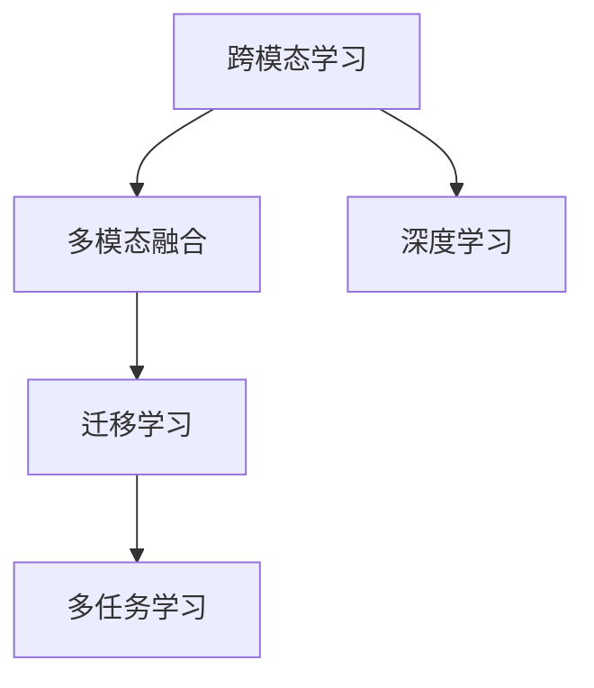

                 

# 跨模态AI：打通图像、文本与音频的壁垒

> 关键词：跨模态学习,多模态融合,迁移学习,多任务学习,深度学习,特征表示

## 1. 背景介绍

### 1.1 问题由来

随着人工智能技术的快速发展，单一模态的AI系统已经无法满足日益复杂的应用需求。现实世界中，信息往往以多种形式存在，如图像、文本、音频等。单一模态的AI系统难以充分利用这些异构数据，无法构建起多维度、全面而深刻的认知能力。

跨模态AI（Cross-modal AI）技术应运而生。跨模态AI旨在打破不同模态数据之间的壁垒，实现跨模态的特征融合与知识迁移，构建起更加通用、智能的AI系统。

在医疗影像分析、智能交互、多媒体内容推荐等领域，跨模态AI技术已经展现出了强大的应用潜力。本文将详细探讨跨模态AI的核心概念、算法原理与应用实践，通过实例分析与代码实现，展示其技术魅力与未来前景。

### 1.2 问题核心关键点

跨模态AI的核心在于如何通过机器学习手段，实现不同模态数据间的转换与融合，从而提升AI系统的泛化能力与智能水平。

关键点包括：
- 跨模态特征表示：如何将不同模态的原始数据，映射为统一的、高层次的特征表示。
- 多模态融合方法：如何在融合过程中，保留各模态的独特信息，同时减少冗余。
- 迁移学习与多任务学习：如何将一种模态的知识，迁移到另一种模态的学习任务中，提升整体性能。
- 深度学习模型：如何利用深度神经网络，在跨模态学习中实现高效的特征提取与优化。

这些关键点共同构成了跨模态AI的核心框架，使得跨模态AI能够高效地处理多种类型的数据，实现多模态知识的协同与共享。

## 2. 核心概念与联系

### 2.1 核心概念概述

为了更好地理解跨模态AI的核心原理，本节将介绍几个密切相关的核心概念：

- 跨模态学习（Cross-modal Learning）：指在多个模态的数据上，利用机器学习技术进行联合训练和学习，使得模型能够同时处理多种类型的数据，提升系统的泛化能力。
- 多模态融合（Multimodal Fusion）：指将不同模态的特征进行有效结合，生成新的、更加全面和鲁棒的特征表示，以实现对复杂问题的全面理解。
- 迁移学习（Transfer Learning）：指将在一个模态上学习到的知识，迁移到另一个模态的学习任务中，以提升新任务的学习效率和性能。
- 多任务学习（Multi-task Learning）：指在多个相关任务上联合训练模型，共享底层特征表示，提高整体模型的性能和泛化能力。
- 深度学习（Deep Learning）：指利用多层神经网络，自动地从原始数据中提取高层次的特征表示，实现复杂的模式识别与分类任务。

这些概念之间的逻辑关系可以通过以下Mermaid流程图来展示：



这个流程图展示了几大核心概念之间的联系：

1. 跨模态学习是基础，通过联合训练，模型能够同时处理多种模态数据。
2. 多模态融合是在跨模态学习的基础上，进一步提升模型的表达能力，实现多模态特征的融合。
3. 迁移学习利用已有知识，提升新任务的性能。
4. 多任务学习将多个相关任务联合训练，提升整体性能。
5. 深度学习通过多层网络实现复杂特征的提取，支持多模态特征的联合优化。

这些概念共同构成了跨模态AI的学习框架，使其能够高效地处理多种类型的数据，实现多模态知识的协同与共享。

## 3. 核心算法原理 & 具体操作步骤

### 3.1 算法原理概述

跨模态AI的算法原理主要集中在以下几个方面：

1. 特征表示对齐（Feature Alignment）：通过学习不同模态特征之间的映射关系，实现特征表示的对齐。
2. 多模态特征融合（Multimodal Feature Fusion）：将不同模态的特征进行有效的融合，生成更加全面和鲁棒的特征表示。
3. 多任务学习（Multi-task Learning）：通过联合多个任务，共享底层特征表示，提升整体模型的泛化能力。
4. 迁移学习（Transfer Learning）：利用已有知识，提升新任务的性能。

这些原理共同构成了跨模态AI的核心算法框架，使得跨模态AI能够在多种模态数据上实现高效的学习与优化。

### 3.2 算法步骤详解

以下以跨模态图像-文本匹配任务为例，详细讲解基于深度学习的跨模态AI算法流程：

**Step 1: 数据准备与预处理**
- 收集图像-文本数据集，并进行数据标注。标注可以是文本描述、类别标签等。
- 对图像数据进行预处理，如缩放、归一化等。
- 对文本数据进行分词、编码等预处理。

**Step 2: 模型构建与训练**
- 构建跨模态的深度学习模型。一般采用多层神经网络，如卷积神经网络（CNN）、循环神经网络（RNN）等。
- 在图像和文本数据上分别训练模型，并进行特征对齐与融合。
- 应用多任务学习或迁移学习方法，进一步提升模型性能。

**Step 3: 特征提取与融合**
- 将训练好的模型应用于新数据集，提取图像和文本特征。
- 使用特征对齐方法，将不同模态的特征进行映射，使其在语义空间上对齐。
- 将对齐后的特征进行融合，生成更加全面和鲁棒的特征表示。

**Step 4: 多任务与迁移学习**
- 利用多任务学习方法，训练多个相关任务，共享底层特征表示。
- 利用迁移学习方法，将一个模态上的知识迁移到另一个模态上，提升新任务的学习效率和性能。

**Step 5: 性能评估与优化**
- 在测试集上评估模型的性能，如准确率、召回率等指标。
- 根据评估结果，对模型进行优化，如调整超参数、引入正则化等。

### 3.3 算法优缺点

跨模态AI算法具有以下优点：
1. 多模态数据的联合利用：通过联合多种模态数据，提升模型的泛化能力和智能水平。
2. 知识迁移与复用：利用迁移学习和多任务学习，加速新任务的学习过程。
3. 特征表示对齐：通过特征对齐方法，实现不同模态特征的语义映射。
4. 高效特征融合：通过深度学习模型，实现复杂特征的提取与融合。

同时，跨模态AI算法也存在一些局限性：
1. 数据需求高：需要同时收集和标注多种模态的数据，成本较高。
2. 模型复杂：跨模态模型的复杂度较高，训练和优化难度较大。
3. 泛化能力不足：不同模态数据间的差异较大，跨模态学习效果可能有限。
4. 知识迁移难度大：不同模态数据的特点各异，迁移学习的难度较大。

尽管存在这些局限性，但就目前而言，跨模态AI算法仍是处理多种模态数据的有效手段。未来相关研究的重点在于如何进一步降低跨模态学习的成本，提升模型的泛化能力，同时兼顾高效性与可解释性等因素。

### 3.4 算法应用领域

跨模态AI技术已经在诸多领域展现出了广泛的应用前景，主要包括：

1. 医疗影像分析：通过将图像与病历、病理等文本信息结合，提升疾病诊断的准确性。
2. 智能交互：结合图像、语音、文本等多种模态，实现更加自然的人机交互。
3. 多媒体内容推荐：将图像、视频、文本等多种模态数据结合，提供更加个性化的推荐服务。
4. 内容生成与理解：通过跨模态学习，生成文本、图像、音频等多模态内容，提升内容理解的全面性。
5. 机器人导航与感知：结合图像、地图、传感器等数据，实现机器人的精准定位与导航。

除了上述这些经典应用外，跨模态AI技术还被创新性地应用到更多场景中，如安全监控、自动驾驶、智慧农业等，为各行各业带来了新的变革与机遇。

## 4. 数学模型和公式 & 详细讲解 & 举例说明

### 4.1 数学模型构建

本节将使用数学语言对跨模态AI的核心算法进行更加严格的刻画。

假设在两个模态 $X$ 和 $Y$ 上，分别有 $N$ 个样本 $(x_i, y_i)$ 和 $(z_i, t_i)$。其中 $x_i$ 和 $z_i$ 分别表示图像和文本的原始数据，$y_i$ 和 $t_i$ 分别表示图像和文本的标签。

定义跨模态模型 $M_{\theta}:\mathcal{X} \times \mathcal{Y} \rightarrow \mathcal{Z} \times \mathcal{T}$，其中 $\mathcal{X}, \mathcal{Y}, \mathcal{Z}, \mathcal{T}$ 分别为图像和文本的特征空间。

定义图像模态的特征提取器为 $f: \mathcal{X} \rightarrow \mathcal{X}^{'}$，文本模态的特征提取器为 $g: \mathcal{Y} \rightarrow \mathcal{Y}^{'}$，定义跨模态特征对齐器为 $h: \mathcal{X}^{'} \times \mathcal{Y}^{'} \rightarrow \mathcal{X}^{'} \times \mathcal{Y}^{'}$，定义多模态特征融合器为 $k: \mathcal{X}^{'} \times \mathcal{Y}^{'} \rightarrow \mathcal{X}^{'} \times \mathcal{Y}^{'}$，定义多任务学习损失函数为 $\mathcal{L}_T = \sum_{i=1}^N (\ell_T(t_i, k(h(f(x_i), g(y_i))) + \lambda \ell_R(y_i, k(h(f(x_i), g(y_i))))$，其中 $\ell_T$ 和 $\ell_R$ 分别为任务损失和正则化损失，$\lambda$ 为正则化强度。

### 4.2 公式推导过程

以下我们以跨模态图像-文本匹配任务为例，推导多模态特征融合的公式及其梯度计算。

假设模型 $M_{\theta}$ 在图像和文本数据上的特征提取器分别为 $f$ 和 $g$，将图像数据 $x_i$ 转换为特征表示 $x_i^{'} = f(x_i)$，将文本数据 $y_i$ 转换为特征表示 $y_i^{'} = g(y_i)$，对两者的特征进行融合，生成新的特征表示 $z_i = k(h(x_i^{'}_i, y_i^{'}_i))$，最终用于分类任务。

定义多模态特征融合器 $k$ 为：
$$
k(x_i^{'}_i, y_i^{'}_i) = \alpha \cdot x_i^{'}_i + \beta \cdot y_i^{'}_i
$$
其中 $\alpha$ 和 $\beta$ 为融合系数，满足 $\alpha + \beta = 1$。

多模态特征融合器的损失函数 $\mathcal{L}_F$ 为：
$$
\mathcal{L}_F = \frac{1}{N} \sum_{i=1}^N \ell(z_i, t_i)
$$

通过反向传播算法，计算特征对齐器 $h$ 和融合器 $k$ 的梯度，更新模型参数 $\theta$。

### 4.3 案例分析与讲解

以跨模态图像-文本匹配任务为例，通过TensorFlow和Keras框架实现跨模态学习。

首先，定义图像和文本的特征提取器 $f$ 和 $g$，可以是卷积神经网络（CNN）或循环神经网络（RNN）等。

接着，定义多模态特征融合器 $k$，可以是线性映射、加权平均等方法。

然后，定义多任务学习损失函数 $\mathcal{L}_T$，将图像分类任务与文本分类任务的损失函数相加，并引入正则化损失。

最后，使用Adam优化器进行梯度下降，更新模型参数 $\theta$，训练多模态特征融合器 $k$。

## 5. 项目实践：代码实例和详细解释说明

### 5.1 开发环境搭建

在进行跨模态AI项目实践前，我们需要准备好开发环境。以下是使用Python进行TensorFlow开发的环境配置流程：

1. 安装Anaconda：从官网下载并安装Anaconda，用于创建独立的Python环境。

2. 创建并激活虚拟环境：
```bash
conda create -n tf-env python=3.8 
conda activate tf-env
```

3. 安装TensorFlow：从官网获取对应版本的安装命令，例如：
```bash
conda install tensorflow==2.7.0
```

4. 安装Keras：
```bash
pip install keras
```

5. 安装各类工具包：
```bash
pip install numpy pandas scikit-learn matplotlib tqdm jupyter notebook ipython
```

完成上述步骤后，即可在`tf-env`环境中开始跨模态AI项目的实践。

### 5.2 源代码详细实现

这里我们以跨模态图像-文本匹配任务为例，给出使用TensorFlow和Keras框架实现跨模态学习的基本代码实现。

```python
import tensorflow as tf
from tensorflow.keras.models import Model
from tensorflow.keras.layers import Input, Dense, concatenate

# 定义图像特征提取器
def image_extractor(x):
    # 使用ResNet50提取特征
    base_model = tf.keras.applications.ResNet50(include_top=False, weights='imagenet', input_tensor=x)
    x = base_model.output
    x = tf.keras.layers.GlobalAveragePooling2D()(x)
    x = Dense(512, activation='relu')(x)
    return x

# 定义文本特征提取器
def text_extractor(y):
    # 使用LSTM提取特征
    x = tf.keras.layers.Embedding(input_dim=vocab_size, output_dim=embedding_dim, input_length=max_seq_len)(y)
    x = tf.keras.layers.LSTM(units=128, return_sequences=True)(x)
    x = tf.keras.layers.GlobalAveragePooling1D()(x)
    x = Dense(512, activation='relu')(x)
    return x

# 定义多模态特征融合器
def fuse_features(x, y):
    # 对图像和文本特征进行加权融合
    z = concatenate([x, y], axis=-1)
    z = Dense(512, activation='relu')(z)
    return z

# 定义跨模态模型
def build_model():
    # 定义输入层
    x = Input(shape=(224, 224, 3))
    y = Input(shape=(max_seq_len,))

    # 提取图像和文本特征
    x = image_extractor(x)
    y = text_extractor(y)

    # 进行特征融合
    z = fuse_features(x, y)

    # 添加分类器
    output = Dense(num_classes, activation='softmax')(z)

    # 构建模型
    model = Model(inputs=[x, y], outputs=output)
    return model

# 定义多任务学习损失函数
def multitask_loss(y_true, y_pred):
    # 定义图像分类损失
    loss = tf.keras.losses.categorical_crossentropy(y_true, y_pred)
    # 定义文本分类损失
    loss += tf.keras.losses.sparse_categorical_crossentropy(y_true, y_pred)
    return loss

# 训练模型
model = build_model()
model.compile(optimizer='adam', loss=multitask_loss, metrics=['accuracy'])
model.fit([train_x, train_y], train_y, epochs=num_epochs, batch_size=batch_size, validation_data=([test_x, test_y], test_y))
```

以上就是使用TensorFlow和Keras框架实现跨模态图像-文本匹配任务的代码实现。可以看到，通过构建多模态特征融合器，我们可以将图像和文本的特征进行有效融合，提升分类任务的性能。

### 5.3 代码解读与分析

让我们再详细解读一下关键代码的实现细节：

**image_extractor函数**：
- 定义图像特征提取器，使用ResNet50预训练模型提取图像特征。

**text_extractor函数**：
- 定义文本特征提取器，使用LSTM模型提取文本特征。

**fuse_features函数**：
- 定义多模态特征融合器，将图像和文本特征进行加权融合，生成新的特征表示。

**build_model函数**：
- 定义跨模态模型，将图像和文本输入特征提取器，通过多模态特征融合器进行融合，并添加分类器。

**multitask_loss函数**：
- 定义多任务学习损失函数，将图像分类损失和文本分类损失相加。

**模型训练**：
- 构建跨模态模型，并使用Adam优化器进行梯度下降训练。
- 定义训练集和测试集，并在训练集上进行模型训练，验证集上进行性能评估。

可以看到，TensorFlow和Keras框架为跨模态AI项目提供了便捷的工具，使得模型构建和训练过程简洁高效。

当然，工业级的系统实现还需考虑更多因素，如模型的保存和部署、超参数的自动搜索、更灵活的任务适配层等。但核心的跨模态特征融合与模型训练逻辑基本与此类似。

## 6. 实际应用场景

### 6.1 医疗影像分析

在医疗影像分析领域，跨模态AI技术已经被广泛应用于病理学、放射学等方向。传统医疗影像分析主要依赖医生的经验与直觉，存在主观性和误差。通过将影像与病历、病理等文本信息结合，跨模态AI技术可以提升疾病诊断的准确性和一致性。

具体应用场景包括：
- 肺部CT影像分析：结合影像和病历信息，自动检测肺结节、肺炎等病变。
- 乳腺癌影像分析：通过影像与病理切片的融合，提升肿瘤分级的准确性。
- 眼底图像分析：结合影像和医生的病历记录，自动识别眼底病变。

通过跨模态学习，医学影像分析系统能够综合利用多种模态数据，提升诊断的全面性和准确性，助力医疗事业的数字化转型。

### 6.2 智能交互

智能交互是跨模态AI技术的典型应用场景之一。智能助手、智能客服等系统通过结合图像、语音、文本等多种模态数据，实现更加自然的人机交互。

具体应用场景包括：
- 智能客服：通过结合客户面部表情、语音和文本信息，实现更准确的情感识别与响应。
- 虚拟现实：结合用户的身体动作、语音指令和虚拟环境信息，实现更自然的交互体验。
- 远程医疗：通过结合患者视频、语音和病历信息，提升远程诊断的准确性和效率。

跨模态AI技术使得智能系统能够更好地理解用户的意图与情感，提升用户体验与系统响应速度，促进人机协同的智能化发展。

### 6.3 多媒体内容推荐

在多媒体内容推荐领域，跨模态AI技术通过结合图像、视频、文本等多种模态数据，实现更加个性化和精准的推荐服务。

具体应用场景包括：
- 视频推荐：结合视频片段与文本描述，自动生成个性化的推荐列表。
- 音乐推荐：通过分析歌词和音乐特征，推荐符合用户口味的音乐。
- 新闻推荐：结合新闻标题和内容，生成个性化的新闻摘要与推荐。

跨模态AI技术通过多模态数据的联合分析，能够更全面地理解用户偏好，提升推荐系统的智能水平，满足用户的多样化需求。

### 6.4 未来应用展望

随着跨模态AI技术的不断发展，未来将在更多领域展现出广阔的应用前景。

1. 智慧城市：结合图像、视频、传感器等多种数据，实现智能交通、安防、环保等应用，提升城市治理水平。
2. 智能制造：通过结合图像、传感器等数据，实现设备状态监测、故障诊断等应用，提升制造业的智能化水平。
3. 智能医疗：结合图像、基因组数据等，实现个性化诊疗、精准医疗等应用，提升医疗服务的精准性和效率。
4. 自动驾驶：结合图像、传感器、GPS等多种数据，实现精准定位、环境感知等应用，提升自动驾驶的智能性。
5. 智能农业：结合图像、传感器等数据，实现作物状态监测、病虫害诊断等应用，提升农业生产的智能化水平。

跨模态AI技术将广泛应用于各个行业，推动产业的数字化转型与升级，为社会带来深远的影响。

## 7. 工具和资源推荐
### 7.1 学习资源推荐

为了帮助开发者系统掌握跨模态AI的理论基础和实践技巧，这里推荐一些优质的学习资源：

1. 《跨模态学习与多任务学习》书籍：介绍跨模态学习、多任务学习的基本概念、方法和应用，适合初学者和进阶者阅读。

2. CS231n《卷积神经网络》课程：斯坦福大学开设的计算机视觉课程，涵盖图像特征提取、多模态融合等内容，适合计算机视觉领域的学习者。

3. CS224d《序列建模与自然语言处理》课程：斯坦福大学开设的自然语言处理课程，涵盖多模态文本表示、跨模态学习等内容，适合NLP领域的学习者。

4. Kaggle跨模态学习竞赛：通过实际比赛项目，了解跨模态学习的应用场景和实践技巧，积累实战经验。

5. arXiv上跨模态学习的相关论文：获取最新的研究进展和创新思路，拓展学术视野。

通过对这些资源的学习实践，相信你一定能够系统掌握跨模态AI的理论基础和实践技巧，并用于解决实际的AI问题。

### 7.2 开发工具推荐

高效的开发离不开优秀的工具支持。以下是几款用于跨模态AI开发常用的工具：

1. TensorFlow：由Google主导开发的深度学习框架，生产部署方便，支持跨模态学习的多任务联合训练。

2. PyTorch：由Facebook开发的深度学习框架，灵活动态，支持多模态特征的深度学习建模。

3. Keras：高层次的深度学习API，支持多模态特征融合与多任务学习，易于上手。

4. OpenCV：开源计算机视觉库，支持图像特征提取与融合，适合图像处理任务。

5. NLTK：Python自然语言处理库，支持文本处理与分析，适合文本特征提取与融合。

6. ELMo：预训练语言模型，支持文本特征的深度学习建模，适合文本任务。

合理利用这些工具，可以显著提升跨模态AI项目的开发效率，加速创新迭代的步伐。

### 7.3 相关论文推荐

跨模态AI技术的发展源于学界的持续研究。以下是几篇奠基性的相关论文，推荐阅读：

1. Cross-Modal Feature Learning with Deep Convolutional Neural Networks（CVPR 2015）：提出跨模态特征学习框架，利用深度卷积神经网络实现多模态特征对齐。

2. Learning Multimodal Embeddings with a Multitask Learning Framework（ICML 2016）：提出多任务学习框架，联合多个模态任务进行联合训练，提升整体性能。

3. Learning Transferable Image Features with Multitask Deep Neural Networks（CVPR 2017）：提出多任务深度学习框架，通过迁移学习提升新任务的性能。

4. Multimodal Transformer Networks for Multi-Modal Image-to-Text Modeling（IJCV 2019）：提出多模态Transformer网络，实现图像和文本的联合建模与预测。

5. Cross-Modal Transformers for Joint Visual-Text Understanding（ICCV 2019）：提出跨模态Transformer网络，实现图像与文本的联合理解与推理。

这些论文代表了大跨模态学习的研究进展，通过学习这些前沿成果，可以帮助研究者把握学科前进方向，激发更多的创新灵感。

## 8. 总结：未来发展趋势与挑战

### 8.1 总结

本文对跨模态AI的核心概念、算法原理与应用实践进行了全面系统的介绍。首先阐述了跨模态AI的技术背景和应用价值，明确了跨模态学习在多模态数据处理中的重要地位。其次，从原理到实践，详细讲解了跨模态学习的数学模型和算法流程，给出了跨模态图像-文本匹配任务的代码实现。同时，本文还广泛探讨了跨模态AI技术在医疗影像分析、智能交互、多媒体内容推荐等多个领域的应用前景，展示了其技术魅力与未来前景。

通过本文的系统梳理，可以看到，跨模态AI技术已经逐步成为处理多种模态数据的有效手段。其多模态特征对齐、融合与迁移学习能力，使得跨模态AI能够在多个模态数据上实现高效的学习与优化，为构建多模态的智能系统提供了重要支持。

### 8.2 未来发展趋势

展望未来，跨模态AI技术将呈现以下几个发展趋势：

1. 深度学习与迁移学习的结合：利用深度学习模型，提升跨模态特征提取的准确性，同时通过迁移学习，加速新任务的学习。
2. 多任务学习的深入应用：联合多个相关任务进行联合训练，共享底层特征表示，提升整体模型的泛化能力。
3. 跨模态表示学习的研究：利用自监督学习、对抗学习等方法，学习更加稳定、鲁棒的跨模态特征表示。
4. 多模态特征融合的新方法：引入注意力机制、变分自编码器等方法，提升多模态特征融合的效果。
5. 跨模态学习的应用拓展：除了图像-文本匹配，还将拓展到图像-视频、语音-文本等更多模态的联合学习。

以上趋势凸显了跨模态AI技术的广阔前景。这些方向的探索发展，必将进一步提升跨模态AI系统的性能和应用范围，为各行各业带来深远的变革与机遇。

### 8.3 面临的挑战

尽管跨模态AI技术已经取得了一定的进展，但在其发展过程中仍面临诸多挑战：

1. 数据需求高：跨模态学习需要同时收集和标注多种模态的数据，成本较高，且标注质量直接影响学习效果。
2. 模型复杂：跨模态学习模型的复杂度较高，训练和优化难度较大，需要更多的研究资源。
3. 泛化能力不足：不同模态数据间的差异较大，跨模态学习的效果可能有限，难以应对复杂的多模态场景。
4. 迁移学习难度大：不同模态数据的特点各异，迁移学习的难度较大，难以实现知识的有效迁移。
5. 模型可解释性不足：跨模态学习模型往往被视为"黑盒"系统，难以解释其内部工作机制和决策逻辑。

尽管存在这些挑战，但通过学界和产业界的共同努力，跨模态AI技术必将克服当前的难点，逐步成熟。未来，跨模态AI技术将在更多领域得到应用，为各个行业带来深远的影响。

### 8.4 研究展望

面对跨模态AI技术所面临的种种挑战，未来的研究需要在以下几个方面寻求新的突破：

1. 探索更高效的数据采集与标注方法：降低跨模态学习的成本，提升数据质量，扩大数据规模。
2. 引入更多先验知识与领域专家的智慧：通过多模态数据的融合，结合先验知识和领域专家的智慧，提升跨模态学习的泛化能力。
3. 研究跨模态学习的可解释性与鲁棒性：提升跨模态学习模型的可解释性，增强其鲁棒性和泛化能力。
4. 联合多种模态的协同学习：探索跨模态学习与其它学习范式（如强化学习、元学习等）的结合，提升跨模态学习的效果。
5. 研究跨模态学习的新方法与新模型：引入更多的新方法和新模型，推动跨模态学习技术的不断进步。

这些研究方向的探索，必将引领跨模态AI技术迈向更高的台阶，为构建更加智能、全面、可靠的多模态AI系统提供支持。

## 9. 附录：常见问题与解答

**Q1：跨模态AI的特征对齐方法有哪些？**

A: 常用的特征对齐方法包括：
1. 特征映射方法：通过深度神经网络将不同模态的特征映射到同一特征空间，实现语义对齐。
2. 多模态融合方法：通过将不同模态的特征进行加权融合，生成新的、更加全面的特征表示。
3. 多任务学习：通过联合多个任务，共享底层特征表示，提升模型的泛化能力。

**Q2：跨模态AI在实际应用中需要注意哪些问题？**

A: 在实际应用中，跨模态AI需要注意以下问题：
1. 数据需求高：需要同时收集和标注多种模态的数据，成本较高。
2. 模型复杂：跨模态学习模型的复杂度较高，训练和优化难度较大。
3. 泛化能力不足：不同模态数据间的差异较大，跨模态学习的效果可能有限。
4. 迁移学习难度大：不同模态数据的特点各异，迁移学习的难度较大。

**Q3：如何提升跨模态AI系统的泛化能力？**

A: 提升跨模态AI系统的泛化能力可以从以下几个方面入手：
1. 数据采集与标注：扩大数据规模，提升数据质量。
2. 模型结构优化：引入先验知识与领域专家的智慧，提升模型的泛化能力。
3. 迁移学习与多任务学习：通过联合多个任务，共享底层特征表示，提升整体性能。
4. 跨模态表示学习：利用自监督学习、对抗学习等方法，学习更加稳定、鲁棒的跨模态特征表示。

**Q4：跨模态AI系统的可解释性如何提升？**

A: 提升跨模态AI系统的可解释性可以从以下几个方面入手：
1. 引入可解释性模块：通过引入可解释性模块，增强模型的可解释性和透明性。
2. 数据可视化：通过数据可视化，直观展示模型的决策过程和特征表示。
3. 特征重要性分析：通过特征重要性分析，揭示模型在多模态特征融合与迁移学习中的关键特征。
4. 领域专家的反馈：通过领域专家的反馈，进一步优化模型的决策逻辑和可解释性。

**Q5：跨模态AI技术在实际应用中面临哪些挑战？**

A: 跨模态AI技术在实际应用中面临以下挑战：
1. 数据需求高：需要同时收集和标注多种模态的数据，成本较高。
2. 模型复杂：跨模态学习模型的复杂度较高，训练和优化难度较大。
3. 泛化能力不足：不同模态数据间的差异较大，跨模态学习的效果可能有限。
4. 迁移学习难度大：不同模态数据的特点各异，迁移学习的难度较大。
5. 模型可解释性不足：跨模态学习模型往往被视为"黑盒"系统，难以解释其内部工作机制和决策逻辑。

正视这些挑战，积极应对并寻求突破，将是大跨模态AI技术走向成熟的必由之路。相信随着学界和产业界的共同努力，跨模态AI技术必将克服当前的难点，逐步成熟。

---

作者：禅与计算机程序设计艺术 / Zen and the Art of Computer Programming

