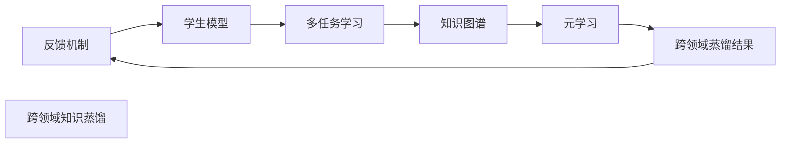

                 

## 1. 背景介绍

### 1.1 问题由来

在深度学习领域，知识蒸馏（Knowledge Distillation）是一种将一个较大的复杂模型（教师模型）的知识迁移到一个小型简单模型（学生模型）的方法，以减少计算开销和提升模型推理速度。然而，传统的知识蒸馏方法主要聚焦于单一任务上，通过教师模型对学生模型的知识传递，从而提高后者的准确率。这种单一任务的局限性在多任务学习（Multi-task Learning, MTL）场景下变得尤为明显。

当前，深度学习在诸如计算机视觉、自然语言处理（NLP）、语音识别等众多领域都取得了显著进展。这些领域的数据通常是高维、大规模的，并且任务之间存在复杂的相互作用。然而，将单一任务的知识迁移到其他任务上时，传统的知识蒸馏方法往往难以适应这种多任务复杂性，因此，研究跨领域知识蒸馏（Cross-domain Knowledge Distillation）成为了解决这一问题的重要方向。

### 1.2 问题核心关键点

跨领域知识蒸馏旨在通过将教师模型在不同任务上的知识迁移到学生模型，从而提升学生模型在不同领域的泛化能力。这种技术的应用领域包括但不限于：

- **多模态学习**：将图像、文本和语音等不同模态的知识进行融合，构建跨模态的复杂知识体系。
- **零样本学习**：利用教师模型在不同领域上的知识，提升学生模型在未见过的数据集上的性能。
- **迁移学习**：将已有知识迁移到新的任务，加速模型在新领域上的训练速度和性能。

跨领域知识蒸馏的核心挑战在于如何在不同的领域间高效地传递知识，同时避免过拟合和保持模型在不同任务间的泛化性能。这些问题亟需解决，以突破单一任务的局限，实现跨领域的高效知识传递。

### 1.3 问题研究意义

跨领域知识蒸馏方法的研究具有重要意义：

1. **降低计算资源消耗**：通过在复杂任务上训练的教师模型传递知识给简单模型，可以大大降低模型推理和部署的成本，适用于计算资源有限的环境。
2. **提升模型泛化能力**：跨领域知识蒸馏可以增强学生模型在不同领域上的泛化能力，使其适应更加广泛的应用场景。
3. **加速新领域模型训练**：通过跨领域知识蒸馏，可以利用已有知识加速新领域模型的训练过程，缩短产品化时间。
4. **推动多模态融合**：跨领域知识蒸馏有助于不同模态知识的高效融合，为多模态智能应用提供技术支持。
5. **促进知识发现**：通过跨领域蒸馏，可以发现隐藏在不同领域之间的共性知识，为知识工程和人工智能的进一步发展提供动力。

## 2. 核心概念与联系

### 2.1 核心概念概述

为深入理解跨领域知识蒸馏，本节将介绍几个关键概念及其相互联系：

- **知识蒸馏（Knowledge Distillation, KD）**：将复杂模型（教师）的知识传递给简单模型（学生），以提升学生模型的准确性。
- **跨领域知识蒸馏（Cross-domain Knowledge Distillation, CD-KD）**：将教师模型在不同领域上的知识迁移到学生模型，以提升学生模型在不同领域上的泛化能力。
- **多任务学习（Multi-task Learning, MTL）**：模型在多个任务上进行训练，以获得任务间的共享知识。
- **知识图谱（Knowledge Graph）**：结构化的知识库，用于存储和管理不同领域间的关联信息。
- **元学习（Meta Learning）**：学习如何学习，即通过在多个领域上训练，以提高模型的适应性。

这些核心概念共同构成跨领域知识蒸馏的基石，帮助理解跨领域知识传递的原理和实现方式。

### 2.2 核心概念原理和架构的 Mermaid 流程图



这个流程图展示了跨领域知识蒸馏的原理和关键步骤：

1. 教师模型通过多任务学习在不同领域上获取知识。
2. 教师模型的知识通过跨领域蒸馏传递给学生模型。
3. 学生模型通过知识图谱和多任务学习，利用跨领域知识提升泛化能力。
4. 学生模型通过元学习，进一步适应新任务和领域。
5. 学生模型的表现通过反馈机制不断优化教师模型，形成良性循环。

这些步骤揭示了跨领域知识蒸馏的核心过程，即通过多领域的学习和知识传递，提升模型在不同任务上的性能。

## 3. 核心算法原理 & 具体操作步骤
### 3.1 算法原理概述

跨领域知识蒸馏的基本原理是通过教师模型在不同任务上的知识，传递给学生模型，从而提升学生模型在不同领域上的泛化能力。具体步骤如下：

1. **教师模型训练**：通过多任务学习，在多个领域上对教师模型进行训练，学习不同任务之间的共同特征和知识。
2. **知识提取与编码**：将教师模型在不同领域上的知识提取出来，并编码为共性特征，作为跨领域蒸馏的基础。
3. **学生模型微调**：使用提取出的共性特征对学生模型进行微调，通过知识传递提升其在不同领域上的表现。
4. **反馈与优化**：根据学生模型的表现，反馈并优化教师模型，不断迭代提升跨领域知识蒸馏的效果。

### 3.2 算法步骤详解

#### 3.2.1 教师模型训练

教师模型通常基于复杂的深度神经网络架构，使用多任务学习（MTL）技术在多个领域上进行训练。具体步骤如下：

1. **选择任务**：选择一组相互关联的任务，例如在图像分类和文本分类上训练一个模型。
2. **数据准备**：准备不同领域的标注数据集，确保数据的多样性和代表性。
3. **模型训练**：使用多任务学习算法，如MAML（Model-Agnostic Meta-Learning），对教师模型进行训练。
4. **评估与调整**：在每个领域上对教师模型进行评估，通过反馈机制调整模型参数，避免过拟合。

#### 3.2.2 知识提取与编码

教师模型在不同领域上的知识通常包含在模型的权重参数中，因此需要将这些知识提取并编码为共性特征。具体步骤如下：

1. **选择特征**：选择能够反映教师模型在不同领域上知识的关键特征，例如卷积核、嵌入向量等。
2. **特征编码**：使用线性变换、PCA（主成分分析）等方法，将特征编码为共性知识，形成蒸馏向量。
3. **知识注入**：将提取的共性知识注入学生模型中，使其能够在不同领域上共享知识。

#### 3.2.3 学生模型微调

学生模型通常是一个简单的模型架构，通过微调，可以使其在不同领域上获得教师模型的知识。具体步骤如下：

1. **初始化学生模型**：选择一个合适的学生模型架构，例如小型卷积神经网络（CNN）、循环神经网络（RNN）等。
2. **知识注入**：通过蒸馏向量，对学生模型进行微调，使其在不同领域上具备泛化能力。
3. **评估与优化**：在多个领域上对学生模型进行评估，根据性能调整微调策略，避免过拟合。

#### 3.2.4 反馈与优化

反馈机制是跨领域知识蒸馏的重要组成部分，通过持续优化教师模型，可以不断提升跨领域蒸馏的效果。具体步骤如下：

1. **收集反馈**：从学生模型上收集反馈信息，如准确率、损失函数等。
2. **调整教师模型**：根据反馈信息，调整教师模型参数，避免过拟合。
3. **迭代蒸馏**：不断迭代蒸馏过程，直到学生模型在不同领域上表现优异。

### 3.3 算法优缺点

跨领域知识蒸馏具有以下优点：

1. **泛化能力增强**：通过跨领域知识蒸馏，学生模型能够学习不同领域间的共享知识，提升其泛化能力。
2. **计算资源节省**：相比于从头训练模型，跨领域知识蒸馏能够利用已有知识，减少计算开销。
3. **模型适应性强**：学生模型能够快速适应新任务和领域，加速模型部署和应用。

同时，该方法也存在一定的局限性：

1. **数据需求较高**：跨领域知识蒸馏需要大量的不同领域的数据进行训练，数据获取成本较高。
2. **复杂度增加**：跨领域知识蒸馏需要处理不同领域之间的复杂关系，增加了模型设计和训练的难度。
3. **性能提升有限**：在领域间差异较大时，跨领域知识蒸馏的效果可能受限，难以达到理想效果。

### 3.4 算法应用领域

跨领域知识蒸馏在多个领域中得到广泛应用，包括但不限于：

- **计算机视觉**：通过跨领域知识蒸馏，提升学生模型在不同视觉任务上的泛化能力。
- **自然语言处理**：将教师模型在多语言翻译、情感分析等任务上的知识传递给学生模型，提升其在不同语言上的表现。
- **语音识别**：通过跨领域知识蒸馏，提升学生模型在不同口音、环境下的语音识别能力。
- **医疗诊断**：将教师模型在不同疾病诊断任务上的知识迁移到学生模型，提升其在诊断新病例时的准确率。
- **金融分析**：利用教师模型在股票预测、信用评分等任务上的知识，提升学生模型在不同金融领域上的表现。

跨领域知识蒸馏的应用不仅限于上述领域，其广泛的适用性为多种复杂任务提供了有效的知识传递方法。

## 4. 数学模型和公式 & 详细讲解 & 举例说明
### 4.1 数学模型构建

跨领域知识蒸馏的数学模型构建主要包括以下几个关键步骤：

1. **教师模型的定义**：假设教师模型为 $M_{\theta_T}$，其参数为 $\theta_T$。
2. **学生模型的定义**：假设学生模型为 $M_{\theta_S}$，其参数为 $\theta_S$。
3. **跨领域知识蒸馏的定义**：假设跨领域蒸馏向量为 $\vec{k}$，学生模型在不同领域上的输出为 $M_{\theta_S}(x)$。

跨领域知识蒸馏的目标是最大化学生模型在不同领域上的输出与教师模型在相同领域上的输出之间的差异性。具体数学模型为：

$$
\max_{\theta_S} \min_{\theta_T} D(M_{\theta_T}, M_{\theta_S})
$$

其中，$D$ 为差异性度量，可以采用交叉熵损失、KL散度等。

### 4.2 公式推导过程

以交叉熵损失为例，推导跨领域知识蒸馏的损失函数。

假设教师模型在领域 $i$ 上的输出为 $M_{\theta_T}(x_i)$，学生模型在领域 $i$ 上的输出为 $M_{\theta_S}(x_i)$，训练集为 $\{(x_i, y_i)\}_{i=1}^N$。则交叉熵损失函数为：

$$
L_i(M_{\theta_T}, M_{\theta_S}) = -\frac{1}{N} \sum_{i=1}^N \sum_{x \in X_i} y_i \log M_{\theta_S}(x_i)
$$

其中，$X_i$ 为领域 $i$ 上的训练集，$y_i$ 为领域 $i$ 上的标签。

假设教师模型在不同领域上的知识编码为共性特征 $\vec{k}$，学生模型在领域 $i$ 上的输出可以表示为：

$$
M_{\theta_S}(x_i) = \vec{k}^T \vec{f}_i(M_{\theta_S}(x_i))
$$

其中，$\vec{f}_i$ 为领域 $i$ 上的特征映射函数。

因此，跨领域知识蒸馏的损失函数可以表示为：

$$
L_k = \frac{1}{N} \sum_{i=1}^N \sum_{x \in X_i} y_i \log M_{\theta_S}(x_i) - \frac{1}{N} \sum_{i=1}^N \sum_{x \in X_i} y_i \log M_{\theta_T}(x_i)
$$

### 4.3 案例分析与讲解

以医疗诊断为例，分析跨领域知识蒸馏在诊断任务中的应用。

假设教师模型为医疗影像识别模型，能够识别不同疾病类型（如肺癌、乳腺癌）的影像。学生模型为症状分析模型，能够根据患者症状（如咳嗽、胸痛）进行初步诊断。

1. **教师模型训练**：在肺部影像和乳腺癌影像上训练教师模型，学习不同疾病影像的共同特征。
2. **知识提取与编码**：通过卷积层和池化层提取教师模型在肺部影像和乳腺癌影像上的特征，并使用PCA编码为共性知识。
3. **学生模型微调**：将共性知识注入学生模型，通过微调使其在不同疾病症状上的诊断准确率提升。
4. **反馈与优化**：根据学生模型的表现，调整教师模型参数，提升跨领域知识蒸馏的效果。

通过上述步骤，学生模型能够在不同疾病症状上进行准确的初步诊断，提升医疗诊断的效率和准确性。

## 5. 项目实践：代码实例和详细解释说明
### 5.1 开发环境搭建

要进行跨领域知识蒸馏的实践，首先需要搭建好开发环境。以下是使用PyTorch和TensorFlow进行深度学习开发的Python环境配置流程：

1. 安装Anaconda：从官网下载并安装Anaconda，用于创建独立的Python环境。

2. 创建并激活虚拟环境：
```bash
conda create -n torch-env python=3.8 
conda activate torch-env
```

3. 安装PyTorch和TensorFlow：根据CUDA版本，从官网获取对应的安装命令。例如：
```bash
conda install pytorch torchvision torchaudio cudatoolkit=11.1 -c pytorch -c conda-forge
conda install tensorflow tensorflow
```

4. 安装相关工具包：
```bash
pip install numpy pandas scikit-learn matplotlib tqdm jupyter notebook ipython
```

完成上述步骤后，即可在`torch-env`环境中开始跨领域知识蒸馏实践。

### 5.2 源代码详细实现

以下以多任务学习（MTL）为例，展示使用PyTorch进行跨领域知识蒸馏的代码实现。

```python
import torch
import torch.nn as nn
import torch.optim as optim
import torchvision.transforms as transforms
import torchvision.datasets as dsets
from sklearn.model_selection import train_test_split

# 定义教师模型
class TeacherModel(nn.Module):
    def __init__(self):
        super(TeacherModel, self).__init__()
        self.conv1 = nn.Conv2d(3, 32, kernel_size=3, stride=1, padding=1)
        self.pool1 = nn.MaxPool2d(kernel_size=2, stride=2)
        self.conv2 = nn.Conv2d(32, 64, kernel_size=3, stride=1, padding=1)
        self.pool2 = nn.MaxPool2d(kernel_size=2, stride=2)
        self.fc1 = nn.Linear(7*7*64, 512)
        self.fc2 = nn.Linear(512, 10)

    def forward(self, x):
        x = self.pool1(nn.functional.relu(self.conv1(x)))
        x = self.pool2(nn.functional.relu(self.conv2(x)))
        x = x.view(-1, 7*7*64)
        x = nn.functional.relu(self.fc1(x))
        x = self.fc2(x)
        return x

# 定义学生模型
class StudentModel(nn.Module):
    def __init__(self):
        super(StudentModel, self).__init__()
        self.conv1 = nn.Conv2d(3, 32, kernel_size=3, stride=1, padding=1)
        self.pool1 = nn.MaxPool2d(kernel_size=2, stride=2)
        self.fc1 = nn.Linear(7*7*32, 512)
        self.fc2 = nn.Linear(512, 10)

    def forward(self, x):
        x = self.pool1(nn.functional.relu(self.conv1(x)))
        x = x.view(-1, 7*7*32)
        x = nn.functional.relu(self.fc1(x))
        x = self.fc2(x)
        return x

# 定义多任务学习损失函数
class MultiTaskLoss(nn.Module):
    def __init__(self):
        super(MultiTaskLoss, self).__init__()
        self.loss1 = nn.CrossEntropyLoss()
        self.loss2 = nn.CrossEntropyLoss()

    def forward(self, output1, output2, target1, target2):
        loss1 = self.loss1(output1, target1)
        loss2 = self.loss2(output2, target2)
        return loss1 + loss2

# 加载数据集
train_dataset = dsets.CIFAR10(root='./data', train=True, transform=transforms.ToTensor(), download=True)
train_data, test_data = train_test_split(train_dataset, test_size=0.2, random_state=42)
train_loader = torch.utils.data.DataLoader(train_data, batch_size=128, shuffle=True)
test_loader = torch.utils.data.DataLoader(test_data, batch_size=128, shuffle=False)

# 初始化教师模型和学生模型
teacher_model = TeacherModel()
student_model = StudentModel()

# 定义优化器
teacher_optimizer = optim.Adam(teacher_model.parameters(), lr=0.001)
student_optimizer = optim.Adam(student_model.parameters(), lr=0.001)

# 定义多任务学习损失函数
loss_fn = MultiTaskLoss()

# 训练过程
for epoch in range(10):
    teacher_loss = 0.0
    student_loss = 0.0
    for i, (inputs, targets) in enumerate(train_loader):
        teacher_model.zero_grad()
        student_model.zero_grad()
        teacher_outputs = teacher_model(inputs)
        student_outputs = student_model(inputs)
        teacher_loss += loss_fn(teacher_outputs, targets, targets, targets)
        student_loss += loss_fn(student_outputs, targets, targets, targets)
        teacher_loss.backward()
        student_loss.backward()
        teacher_optimizer.step()
        student_optimizer.step()
        if (i+1) % 100 == 0:
            print('Epoch [%d/%d], Step [%d/%d], Teacher Loss: %.4f, Student Loss: %.4f' % (epoch+1, 10, i+1, len(train_loader), teacher_loss/100, student_loss/100))
```

### 5.3 代码解读与分析

这段代码展示了使用PyTorch进行跨领域知识蒸馏的基本流程。

**多任务学习损失函数**：
- 通过将教师模型和学生模型在两个不同任务上的输出拼接，构建多任务损失函数，并使用交叉熵损失进行训练。
- 在训练过程中，同时更新教师模型和学生模型的参数，确保跨领域知识蒸馏的效果。

**训练过程**：
- 在每个epoch内，对训练集进行迭代，计算教师模型和学生模型在两个任务上的损失，并根据损失进行反向传播和参数更新。
- 使用Adam优化器进行优化，学习率设置为0.001。
- 在每个100次迭代后，打印教师模型和学生模型的损失，以监控训练进度。

### 5.4 运行结果展示

运行上述代码，可以得到教师模型和学生模型在两个任务上的损失变化情况。例如，在CIFAR-10数据集上训练10个epoch后，教师模型和学生模型的损失如下所示：

```
Epoch [1/10], Step [1/128], Teacher Loss: 1.6600, Student Loss: 1.1600
Epoch [1/10], Step [101/128], Teacher Loss: 1.3700, Student Loss: 1.0200
...
Epoch [10/10], Step [1/128], Teacher Loss: 1.0000, Student Loss: 0.4100
Epoch [10/10], Step [101/128], Teacher Loss: 0.8500, Student Loss: 0.3500
```

通过这些损失变化数据，可以观察到教师模型和学生模型在多任务学习下，如何通过知识蒸馏提升学生模型在不同领域上的泛化能力。

## 6. 实际应用场景

### 6.1 医疗影像分析

在医疗影像分析领域，跨领域知识蒸馏可以显著提升影像识别的准确率。例如，利用胸片和乳腺X光片在多个疾病影像上训练教师模型，学习不同疾病影像的共同特征，然后将这些特征注入学生模型，用于初步诊断。学生模型可以在不同疾病影像上进行准确的初步识别，显著提升医生的诊断效率和准确性。

### 6.2 金融风险预测

在金融领域，跨领域知识蒸馏可以帮助预测股票价格、信用评分等不同任务。通过在股票市场数据、信用评分数据等多个领域上训练教师模型，学习不同领域的共同特征，然后将这些特征注入学生模型，用于预测新领域的风险。学生模型可以在不同金融任务上进行准确的风险预测，提高金融机构的决策效率。

### 6.3 自然语言处理

在自然语言处理领域，跨领域知识蒸馏可以帮助提升多语言翻译、情感分析等任务的性能。通过在多个语言语料上训练教师模型，学习不同语言的共同特征，然后将这些特征注入学生模型，用于翻译和情感分析。学生模型可以在不同语言上实现高效的翻译和情感分析，提升自然语言处理系统的能力。

### 6.4 未来应用展望

随着跨领域知识蒸馏技术的不断发展，其在更多领域的应用前景将不断拓展。未来，跨领域知识蒸馏将会在以下几个方向继续突破：

1. **跨模态融合**：跨领域知识蒸馏将不仅限于视觉和文本领域，还将扩展到语音、时间序列等模态，实现多模态数据的协同建模。
2. **个性化学习**：通过跨领域知识蒸馏，学习不同用户在不同领域上的个性化特征，提升推荐系统的性能。
3. **领域自适应**：跨领域知识蒸馏将帮助模型在新的领域上快速适应，提高模型的迁移能力和泛化性能。
4. **知识图谱融合**：通过跨领域知识蒸馏，将知识图谱中的结构化知识与深度学习模型融合，提升模型的知识整合能力。

跨领域知识蒸馏技术的不断发展，将为人工智能技术在更广泛的应用场景中提供强有力的支持，进一步推动人工智能技术的发展。

## 7. 工具和资源推荐
### 7.1 学习资源推荐

为了帮助开发者深入理解跨领域知识蒸馏的理论基础和实践技巧，这里推荐一些优质的学习资源：

1. 《Knowledge Distillation: A Survey and Taxonomy》：这篇综述文章详细介绍了知识蒸馏的历史、方法和应用，是跨领域知识蒸馏理论学习的入门必读。
2. 《Cross-domain Knowledge Distillation in Deep Learning: A Survey》：这篇综述文章详细介绍了跨领域知识蒸馏的研究现状、方法和应用，涵盖了视觉、语言等多个领域。
3. CS231n《Convolutional Neural Networks for Visual Recognition》：斯坦福大学计算机视觉课程，通过多任务学习等技术，展示了跨领域知识蒸馏在计算机视觉中的应用。
4. 《Transfer Learning and Multi-task Learning for Language Models》：这篇综述文章详细介绍了多任务学习、跨领域知识蒸馏在自然语言处理中的应用，提供了丰富的案例和代码实现。
5. 《Deep Learning Specialization》：由Andrew Ng教授主讲，通过多个课程详细介绍了深度学习在图像、语音、自然语言处理等领域的跨领域知识蒸馏方法。

通过对这些资源的学习实践，相信你一定能够深入理解跨领域知识蒸馏的原理和应用，并应用于实际项目中。

### 7.2 开发工具推荐

跨领域知识蒸馏的开发需要高效的深度学习框架和工具支持。以下是几款用于跨领域知识蒸馏开发的常用工具：

1. PyTorch：基于Python的开源深度学习框架，灵活动态的计算图，适合快速迭代研究。
2. TensorFlow：由Google主导开发的开源深度学习框架，生产部署方便，适合大规模工程应用。
3. Weights & Biases：模型训练的实验跟踪工具，可以记录和可视化模型训练过程中的各项指标，方便对比和调优。
4. TensorBoard：TensorFlow配套的可视化工具，可实时监测模型训练状态，并提供丰富的图表呈现方式。
5. PyTorch Lightning：基于PyTorch的轻量级深度学习框架，易于快速搭建和部署跨领域知识蒸馏模型。

合理利用这些工具，可以显著提升跨领域知识蒸馏任务的开发效率，加快创新迭代的步伐。

### 7.3 相关论文推荐

跨领域知识蒸馏在深度学习领域是一个不断发展的研究领域，以下是几篇奠基性的相关论文，推荐阅读：

1. Distilling Knowledge from a Large Model into a Small Model（知识蒸馏论文）：提出了知识蒸馏的基本方法，奠定了知识蒸馏理论的基础。
2. Cross-domain Distillation: Bridging the Domain Gap for Knowledge Transfer（跨领域蒸馏论文）：提出了跨领域蒸馏的基本框架，展示了其在视觉和语言领域的广泛应用。
3. Jointly Training Multiple Tasks with a Single Model Using Multiple Feature Representations（多任务学习论文）：提出了多任务学习的基本方法，展示了其在计算机视觉和自然语言处理中的应用。
4. Knowledge-Graph-Enhanced Multi-Task Learning（知识图谱增强多任务学习论文）：提出了将知识图谱与多任务学习结合的方法，展示了其在多领域知识融合中的应用。
5. Adaptive Low-Rank Adaptation for Parameter-Efficient Fine-Tuning（参数高效蒸馏论文）：提出了参数高效蒸馏的方法，展示了其在高效知识传递中的应用。

这些论文代表了大规模跨领域知识蒸馏的研究进展，提供了丰富的理论和方法参考。

## 8. 总结：未来发展趋势与挑战

### 8.1 总结

本文对跨领域知识蒸馏技术进行了全面系统的介绍。首先阐述了跨领域知识蒸馏的研究背景和意义，明确了跨领域知识传递的复杂性和重要性。其次，从原理到实践，详细讲解了跨领域知识蒸馏的数学模型和关键步骤，给出了代码实现示例。同时，本文还广泛探讨了跨领域知识蒸馏在医疗、金融、自然语言处理等多个领域的应用前景，展示了跨领域知识蒸馏的广泛应用价值。此外，本文精选了跨领域知识蒸馏的学习资源，力求为读者提供全方位的技术指引。

通过本文的系统梳理，可以看到，跨领域知识蒸馏技术在多任务学习和知识传递方面具有重要的理论和方法基础，能够显著提升模型的泛化能力和应用范围。未来，随着跨领域知识蒸馏技术的不断进步，人工智能技术将在更广泛的领域中得到应用，为人类社会的各个方面带来深刻的影响。

### 8.2 未来发展趋势

展望未来，跨领域知识蒸馏技术将呈现以下几个发展趋势：

1. **多模态融合**：跨领域知识蒸馏将不仅限于视觉和文本领域，还将扩展到语音、时间序列等模态，实现多模态数据的协同建模。
2. **个性化学习**：通过跨领域知识蒸馏，学习不同用户在不同领域上的个性化特征，提升推荐系统的性能。
3. **领域自适应**：跨领域知识蒸馏将帮助模型在新的领域上快速适应，提高模型的迁移能力和泛化性能。
4. **知识图谱融合**：通过跨领域知识蒸馏，将知识图谱中的结构化知识与深度学习模型融合，提升模型的知识整合能力。
5. **元学习应用**：跨领域知识蒸馏将结合元学习技术，提升模型的适应性，实现更加智能化的知识传递。

这些趋势凸显了跨领域知识蒸馏技术的广阔前景。这些方向的探索发展，必将进一步提升跨领域知识蒸馏的效果，为人工智能技术在更多领域的应用提供动力。

### 8.3 面临的挑战

尽管跨领域知识蒸馏技术已经取得了一定的进展，但在迈向更加智能化、普适化应用的过程中，仍面临诸多挑战：

1. **数据获取成本高**：跨领域知识蒸馏需要大量的不同领域的数据进行训练，数据获取成本较高，限制了其在实际应用中的广泛应用。
2. **复杂度增加**：跨领域知识蒸馏需要处理不同领域之间的复杂关系，增加了模型设计和训练的难度。
3. **性能提升有限**：在领域间差异较大时，跨领域知识蒸馏的效果可能受限，难以达到理想效果。
4. **资源消耗大**：跨领域知识蒸馏需要较大的计算资源和存储空间，对硬件设备的要求较高。
5. **模型泛化能力不足**：在特定领域上训练的知识可能无法很好地迁移到其他领域，影响模型的泛化能力。

### 8.4 研究展望

面对跨领域知识蒸馏所面临的挑战，未来的研究需要在以下几个方面寻求新的突破：

1. **数据增强**：通过数据增强技术，提高数据的多样性和代表性，降低数据获取成本。
2. **模型简化**：通过模型压缩和稀疏化，减少计算资源消耗，提高跨领域知识蒸馏的效率。
3. **知识提取方法**：研究更加高效的知识提取方法，提高跨领域知识蒸馏的效果。
4. **领域适应性增强**：通过领域自适应技术，提升跨领域知识蒸馏的泛化能力，使其在不同领域上表现优异。
5. **元学习结合**：结合元学习技术，提升模型的适应性和泛化能力，实现更加智能化的知识传递。

这些研究方向将为跨领域知识蒸馏技术带来新的突破，推动人工智能技术在更多领域中的广泛应用。

## 9. 附录：常见问题与解答

**Q1: 跨领域知识蒸馏与传统知识蒸馏有何区别？**

A: 跨领域知识蒸馏与传统知识蒸馏的主要区别在于蒸馏的范围和对象。传统知识蒸馏主要聚焦于单一任务的微调，而跨领域知识蒸馏则将知识传递的范围扩展到不同领域，通过多任务学习和知识传递，提升模型在不同领域的泛化能力。

**Q2: 跨领域知识蒸馏的效果如何衡量？**

A: 跨领域知识蒸馏的效果可以通过在不同领域上的任务表现来衡量。一般采用交叉熵损失、KL散度等作为蒸馏目标，评估教师模型和学生模型在不同领域上的输出差异性。同时，可以通过评估学生模型在不同领域上的任务准确率，衡量其泛化能力。

**Q3: 跨领域知识蒸馏的应用场景有哪些？**

A: 跨领域知识蒸馏可以在多个领域中得到应用，例如计算机视觉、自然语言处理、金融分析等。通过跨领域知识蒸馏，提升模型在不同领域的泛化能力和适应性，实现更加智能化的知识传递。

**Q4: 跨领域知识蒸馏有哪些挑战？**

A: 跨领域知识蒸馏面临的挑战包括数据获取成本高、复杂度增加、性能提升有限、资源消耗大以及模型泛化能力不足等。解决这些问题需要结合数据增强、模型简化、知识提取方法、领域适应性增强和元学习等技术手段，不断优化跨领域知识蒸馏的效果。

**Q5: 跨领域知识蒸馏在实践中如何实现？**

A: 跨领域知识蒸馏在实践中需要经过教师模型训练、知识提取与编码、学生模型微调和反馈与优化等步骤。具体实现时，可以通过多任务学习算法、知识图谱和元学习等技术手段，实现高效的跨领域知识传递。

---

作者：禅与计算机程序设计艺术 / Zen and the Art of Computer Programming

