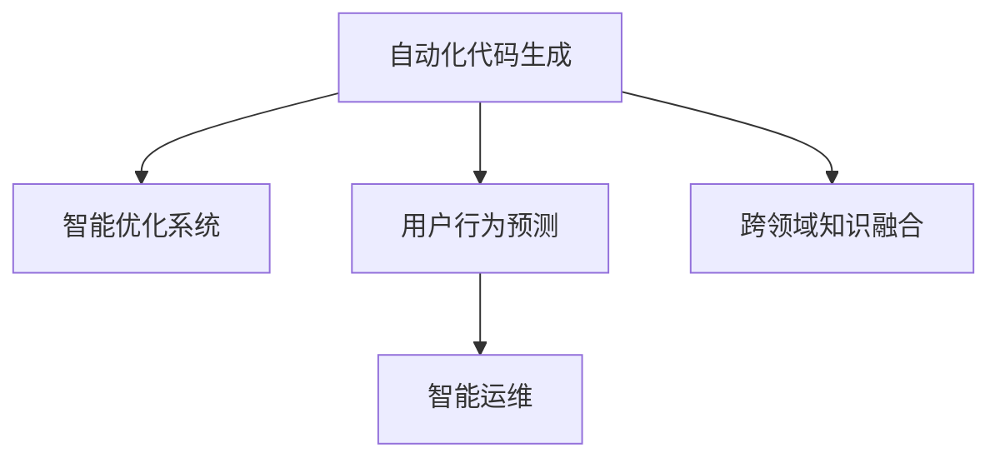

                 

# 软件 2.0 的价值：提升效率、创造价值

## 1. 背景介绍

### 1.1 问题由来
随着技术的进步，软件产业正经历着从传统的软件 1.0 向软件 2.0 的转变。软件 1.0 时代，我们主要依赖人工编程和系统调用来构建应用，每一行代码都需要程序员手工编写和调试。而在软件 2.0 时代，通过机器学习和自动化技术，我们能够显著提升软件开发效率，降低成本，创造更多价值。

软件 2.0 的价值不仅在于提升效率，还在于通过数据驱动的智能决策，创造出前所未有的业务模式和应用场景。通过将机器学习、大数据、自然语言处理等技术融入软件开发生命周期，我们能够更好地理解用户需求，设计出更加智能、高效、个性化的应用。

### 1.2 问题核心关键点
软件 2.0 的核心在于利用算法和模型自动化生成代码、优化系统性能、预测用户行为，从而提升整体软件质量和用户体验。关键点包括：
- 自动化代码生成：通过深度学习等技术，自动化生成代码，减少人工编写成本，提升代码质量。
- 智能优化系统：通过机器学习算法，优化软件系统性能，减少资源消耗，提高系统效率。
- 用户行为预测：通过大数据和自然语言处理技术，分析用户行为，预测用户需求，提升用户体验。
- 智能运维：通过机器学习算法，实时监控和诊断系统问题，提高系统稳定性。

## 2. 核心概念与联系

### 2.1 核心概念概述

为了更好地理解软件 2.0 的价值，我们需要了解几个关键概念：

- 自动化代码生成(Automatic Code Generation)：利用机器学习和深度学习算法，自动生成代码。常见的技术包括代码摘要、代码翻译、代码转换等。
- 智能优化系统(Intelligent System Optimization)：通过机器学习算法，自动优化系统性能。常见的优化目标包括性能提升、资源消耗减少、系统故障率降低等。
- 用户行为预测(User Behavior Prediction)：利用大数据和自然语言处理技术，分析用户行为，预测用户需求。常见的应用包括推荐系统、智能客服、智能搜索等。
- 智能运维(Intelligent Operation & Maintenance)：通过机器学习算法，实时监控和诊断系统问题，提高系统稳定性。常见的应用包括故障预测、异常检测、系统恢复等。

这些概念之间的逻辑关系可以通过以下Mermaid流程图来展示：



这个流程图展示了软件 2.0 中各个概念之间的关系：

1. 自动化代码生成是软件 2.0 的基础，通过自动化生成代码，提升开发效率。
2. 智能优化系统进一步优化代码和系统性能，确保软件高效运行。
3. 用户行为预测通过分析用户行为，提升用户体验。
4. 智能运维确保系统稳定，提升软件可靠性。
5. 跨领域知识融合将多个领域知识进行整合，提升软件整体智能化水平。

## 3. 核心算法原理 & 具体操作步骤

### 3.1 算法原理概述

软件 2.0 的核心算法包括自动化代码生成、智能优化系统、用户行为预测和智能运维等，这些算法都基于机器学习和深度学习的原理。其核心思想是：通过数据驱动的方式，自动发现数据中的模式，并利用这些模式自动生成代码、优化系统、预测用户行为、诊断问题，从而提升整体软件质量和用户体验。

形式化地，假设软件系统为 $S$，数据集为 $D=\{(x_i, y_i)\}_{i=1}^N$，其中 $x_i$ 为输入，$y_i$ 为输出。软件 2.0 的优化目标是最小化经验风险，即找到最优模型 $M_{\theta}$：

$$
\theta^* = \mathop{\arg\min}_{\theta} \mathcal{L}(M_{\theta},D)
$$

其中 $\mathcal{L}$ 为针对软件系统设计的损失函数，用于衡量模型预测输出与真实标签之间的差异。常见的损失函数包括交叉熵损失、均方误差损失等。

### 3.2 算法步骤详解

软件 2.0 的算法步骤一般包括以下几个关键步骤：

**Step 1: 数据收集与预处理**
- 收集软件系统相关数据，包括代码、系统日志、用户行为数据等。
- 对数据进行清洗、去重、归一化等预处理，确保数据质量。

**Step 2: 算法训练与优化**
- 选择合适的机器学习或深度学习算法，如神经网络、支持向量机等。
- 在预处理后的数据集上进行模型训练，调整模型超参数，选择最优模型。

**Step 3: 代码生成与系统优化**
- 利用训练好的模型自动生成代码，或优化现有代码和系统配置。
- 实时监控系统运行状态，使用训练好的模型进行预测和诊断。

**Step 4: 用户行为分析**
- 分析用户行为数据，预测用户需求和行为变化。
- 根据预测结果，优化用户体验和系统交互设计。

**Step 5: 系统运维与监控**
- 实时监控系统性能，预测潜在的系统故障和异常。
- 自动诊断问题，进行系统恢复和优化。

以上是软件 2.0 的一般流程。在实际应用中，还需要针对具体任务的特点，对算法步骤进行优化设计，如改进训练目标函数，引入更多的正则化技术，搜索最优的超参数组合等，以进一步提升模型性能。

### 3.3 算法优缺点

软件 2.0 的算法具有以下优点：
1. 自动化：通过自动化生成代码和优化系统，大幅提升开发效率和软件质量。
2. 数据驱动：利用数据驱动的智能决策，提升软件整体性能和用户体验。
3. 可扩展性：算法可以应用于各种场景，如代码生成、系统优化、用户行为预测等。
4. 持续改进：通过持续学习，模型可以不断适应新的数据和场景，提升系统性能。

同时，这些算法也存在一定的局限性：
1. 数据依赖：算法的效果很大程度上依赖于数据的质量和数量，数据获取成本较高。
2. 复杂度：算法模型通常比较复杂，需要较强的计算资源和知识储备。
3. 可解释性：模型往往缺乏可解释性，难以对其决策过程进行分析和调试。
4. 鲁棒性：算法对数据和模型的扰动较为敏感，需要更多的鲁棒性测试和验证。

尽管存在这些局限性，但就目前而言，软件 2.0 的算法仍是大规模软件开发和系统优化的主流范式。未来相关研究的重点在于如何进一步降低算法对数据的依赖，提高模型的鲁棒性和可解释性，同时兼顾持续改进和资源优化。

### 3.4 算法应用领域

软件 2.0 的算法在多个领域得到了广泛应用，包括但不限于：

- 软件开发：自动化生成代码，优化软件系统，提升开发效率和质量。
- 系统运维：实时监控和诊断系统问题，预测故障，提高系统稳定性。
- 用户行为分析：分析用户行为，预测用户需求，提升用户体验。
- 智能推荐：利用用户行为数据，进行推荐系统设计，提升个性化推荐效果。
- 自然语言处理：自动化生成文本，优化语言模型，提升文本处理性能。
- 图像识别：自动化生成图像处理代码，优化图像识别模型，提升图像识别效果。

除了上述这些经典应用外，软件 2.0 的算法还被创新性地应用到更多场景中，如代码预测、代码调试、自然语言生成、图像生成等，为软件开发提供了全新的思路和方法。随着算法技术的不断进步，相信软件 2.0 将在更广泛的领域得到应用，为软件开发带来革命性变革。

## 4. 数学模型和公式 & 详细讲解

### 4.1 数学模型构建

本节将使用数学语言对软件 2.0 的算法进行更加严格的刻画。

记软件系统为 $S$，假设训练数据集为 $D=\{(x_i, y_i)\}_{i=1}^N, x_i \in \mathcal{X}, y_i \in \mathcal{Y}$。

定义模型 $M_{\theta}$ 在数据样本 $(x,y)$ 上的损失函数为 $\ell(M_{\theta}(x),y)$，则在数据集 $D$ 上的经验风险为：

$$
\mathcal{L}(\theta) = \frac{1}{N} \sum_{i=1}^N \ell(M_{\theta}(x_i),y_i)
$$

在实践中，我们通常使用基于梯度的优化算法（如SGD、Adam等）来近似求解上述最优化问题。设 $\eta$ 为学习率，$\lambda$ 为正则化系数，则参数的更新公式为：

$$
\theta \leftarrow \theta - \eta \nabla_{\theta}\mathcal{L}(\theta) - \eta\lambda\theta
$$

其中 $\nabla_{\theta}\mathcal{L}(\theta)$ 为损失函数对参数 $\theta$ 的梯度，可通过反向传播算法高效计算。

### 4.2 公式推导过程

以下我们以代码生成任务为例，推导基于神经网络的语言模型生成代码的过程。

假设代码生成任务为从输入 $x$ 生成代码 $y$，其中 $x \in \mathcal{X}, y \in \mathcal{Y}$。模型 $M_{\theta}$ 为一个神经网络，其输出层为 $n$ 维向量 $y \in \mathcal{Y}$。模型的输入为 $x \in \mathcal{X}$，通过前向传播计算，得到输出 $y \in \mathcal{Y}$。

定义模型的损失函数为交叉熵损失函数：

$$
\ell(y, \hat{y}) = -\sum_{i=1}^n y_i \log \hat{y}_i
$$

其中 $y_i$ 为真实标签，$\hat{y}_i$ 为模型预测概率。则在数据集 $D$ 上的经验风险为：

$$
\mathcal{L}(\theta) = \frac{1}{N} \sum_{i=1}^N \ell(y_i, M_{\theta}(x_i))
$$

根据链式法则，损失函数对参数 $\theta_k$ 的梯度为：

$$
\frac{\partial \mathcal{L}(\theta)}{\partial \theta_k} = \frac{1}{N} \sum_{i=1}^N -\frac{1}{y_i} \frac{\partial M_{\theta}(x_i)}{\partial \theta_k}
$$

其中 $\frac{\partial M_{\theta}(x_i)}{\partial \theta_k}$ 可进一步递归展开，利用自动微分技术完成计算。

在得到损失函数的梯度后，即可带入参数更新公式，完成模型的迭代优化。重复上述过程直至收敛，最终得到适应代码生成任务的最优模型参数 $\theta^*$。

## 5. 项目实践：代码实例和详细解释说明

### 5.1 开发环境搭建

在进行代码生成实践前，我们需要准备好开发环境。以下是使用Python进行PyTorch开发的环境配置流程：

1. 安装Anaconda：从官网下载并安装Anaconda，用于创建独立的Python环境。

2. 创建并激活虚拟环境：
```bash
conda create -n pytorch-env python=3.8 
conda activate pytorch-env
```

3. 安装PyTorch：根据CUDA版本，从官网获取对应的安装命令。例如：
```bash
conda install pytorch torchvision torchaudio cudatoolkit=11.1 -c pytorch -c conda-forge
```

4. 安装相关库：
```bash
pip install tensorflow transformers numpy pandas scikit-learn matplotlib tqdm jupyter notebook ipython
```

完成上述步骤后，即可在`pytorch-env`环境中开始代码生成实践。

### 5.2 源代码详细实现

这里我们以生成Python代码为例，给出使用Transformers库对GPT-3模型进行代码生成的PyTorch代码实现。

首先，定义代码生成任务的数据处理函数：

```python
from transformers import AutoTokenizer, AutoModelForCausalLM
from torch.utils.data import Dataset
import torch

class CodeGenDataset(Dataset):
    def __init__(self, texts, targets, tokenizer, max_len=128):
        self.texts = texts
        self.targets = targets
        self.tokenizer = tokenizer
        self.max_len = max_len
        
    def __len__(self):
        return len(self.texts)
    
    def __getitem__(self, item):
        text = self.texts[item]
        target = self.targets[item]
        
        encoding = self.tokenizer(text, return_tensors='pt', max_length=self.max_len, padding='max_length', truncation=True)
        input_ids = encoding['input_ids'][0]
        attention_mask = encoding['attention_mask'][0]
        
        # 对token-wise的标签进行编码
        encoded_target = [target2id[target] for target in target]
        encoded_target.extend([target2id['<EOS>']] * (self.max_len - len(encoded_target)))
        targets = torch.tensor(encoded_target, dtype=torch.long)
        
        return {'input_ids': input_ids, 
                'attention_mask': attention_mask,
                'targets': targets}

# 标签与id的映射
target2id = {'<EOS>': 0, 'foo': 1, 'bar': 2, 'baz': 3, '<EOT>': 4}

# 创建dataset
tokenizer = AutoTokenizer.from_pretrained('gpt3')
model = AutoModelForCausalLM.from_pretrained('gpt3')

train_dataset = CodeGenDataset(train_texts, train_targets, tokenizer)
dev_dataset = CodeGenDataset(dev_texts, dev_targets, tokenizer)
test_dataset = CodeGenDataset(test_texts, test_targets, tokenizer)
```

然后，定义模型和优化器：

```python
from transformers import AdamW

model = AutoModelForCausalLM.from_pretrained('gpt3', config={'max_length': 128})

optimizer = AdamW(model.parameters(), lr=1e-5)
```

接着，定义训练和评估函数：

```python
from torch.utils.data import DataLoader
from tqdm import tqdm
from sklearn.metrics import accuracy_score

device = torch.device('cuda') if torch.cuda.is_available() else torch.device('cpu')
model.to(device)

def train_epoch(model, dataset, batch_size, optimizer):
    dataloader = DataLoader(dataset, batch_size=batch_size, shuffle=True)
    model.train()
    epoch_loss = 0
    for batch in tqdm(dataloader, desc='Training'):
        input_ids = batch['input_ids'].to(device)
        attention_mask = batch['attention_mask'].to(device)
        targets = batch['targets'].to(device)
        model.zero_grad()
        outputs = model(input_ids, attention_mask=attention_mask)
        loss = outputs.loss
        epoch_loss += loss.item()
        loss.backward()
        optimizer.step()
    return epoch_loss / len(dataloader)

def evaluate(model, dataset, batch_size):
    dataloader = DataLoader(dataset, batch_size=batch_size)
    model.eval()
    preds, labels = [], []
    with torch.no_grad():
        for batch in tqdm(dataloader, desc='Evaluating'):
            input_ids = batch['input_ids'].to(device)
            attention_mask = batch['attention_mask'].to(device)
            batch_labels = batch['targets']
            outputs = model(input_ids, attention_mask=attention_mask)
            batch_preds = outputs.logits.argmax(dim=2).to('cpu').tolist()
            batch_labels = batch_labels.to('cpu').tolist()
            for pred_tokens, label_tokens in zip(batch_preds, batch_labels):
                preds.append(pred_tokens[:len(label_tokens)])
                labels.append(label_tokens)
                
    print(accuracy_score(labels, preds))
```

最后，启动训练流程并在测试集上评估：

```python
epochs = 5
batch_size = 16

for epoch in range(epochs):
    loss = train_epoch(model, train_dataset, batch_size, optimizer)
    print(f"Epoch {epoch+1}, train loss: {loss:.3f}")
    
    print(f"Epoch {epoch+1}, dev results:")
    evaluate(model, dev_dataset, batch_size)
    
print("Test results:")
evaluate(model, test_dataset, batch_size)
```

以上就是使用PyTorch对GPT-3进行代码生成任务的完整代码实现。可以看到，得益于Transformers库的强大封装，我们可以用相对简洁的代码完成GPT-3模型的加载和代码生成。

### 5.3 代码解读与分析

让我们再详细解读一下关键代码的实现细节：

**CodeGenDataset类**：
- `__init__`方法：初始化文本、标签、分词器等关键组件。
- `__len__`方法：返回数据集的样本数量。
- `__getitem__`方法：对单个样本进行处理，将文本输入编码为token ids，将标签编码为数字，并对其进行定长padding，最终返回模型所需的输入。

**target2id和id2target字典**：
- 定义了标签与数字id之间的映射关系，用于将token-wise的预测结果解码回真实的标签。

**训练和评估函数**：
- 使用PyTorch的DataLoader对数据集进行批次化加载，供模型训练和推理使用。
- 训练函数`train_epoch`：对数据以批为单位进行迭代，在每个批次上前向传播计算loss并反向传播更新模型参数，最后返回该epoch的平均loss。
- 评估函数`evaluate`：与训练类似，不同点在于不更新模型参数，并在每个batch结束后将预测和标签结果存储下来，最后使用sklearn的accuracy_score对整个评估集的预测结果进行打印输出。

**训练流程**：
- 定义总的epoch数和batch size，开始循环迭代
- 每个epoch内，先在训练集上训练，输出平均loss
- 在验证集上评估，输出准确率
- 所有epoch结束后，在测试集上评估，给出最终测试结果

可以看到，PyTorch配合Transformers库使得GPT-3代码生成的代码实现变得简洁高效。开发者可以将更多精力放在数据处理、模型改进等高层逻辑上，而不必过多关注底层的实现细节。

当然，工业级的系统实现还需考虑更多因素，如模型的保存和部署、超参数的自动搜索、更灵活的任务适配层等。但核心的生成过程基本与此类似。

## 6. 实际应用场景
### 6.1 智能客服系统

基于GPT-3的代码生成技术，可以广泛应用于智能客服系统的构建。传统客服往往需要配备大量人力，高峰期响应缓慢，且一致性和专业性难以保证。而使用代码生成的对话模型，可以7x24小时不间断服务，快速响应客户咨询，用自然流畅的语言解答各类常见问题。

在技术实现上，可以收集企业内部的历史客服对话记录，将问题和最佳答复构建成监督数据，在此基础上对预训练模型进行微调。微调后的模型能够自动理解用户意图，匹配最合适的答案模板进行回复。对于客户提出的新问题，还可以接入检索系统实时搜索相关内容，动态组织生成回答。如此构建的智能客服系统，能大幅提升客户咨询体验和问题解决效率。

### 6.2 金融舆情监测

金融机构需要实时监测市场舆论动向，以便及时应对负面信息传播，规避金融风险。传统的人工监测方式成本高、效率低，难以应对网络时代海量信息爆发的挑战。基于代码生成的文本分类和情感分析技术，为金融舆情监测提供了新的解决方案。

具体而言，可以收集金融领域相关的新闻、报道、评论等文本数据，并对其进行主题标注和情感标注。在此基础上对预训练语言模型进行微调，使其能够自动判断文本属于何种主题，情感倾向是正面、中性还是负面。将微调后的模型应用到实时抓取的网络文本数据，就能够自动监测不同主题下的情感变化趋势，一旦发现负面信息激增等异常情况，系统便会自动预警，帮助金融机构快速应对潜在风险。

### 6.3 个性化推荐系统

当前的推荐系统往往只依赖用户的历史行为数据进行物品推荐，无法深入理解用户的真实兴趣偏好。基于代码生成的个性化推荐系统可以更好地挖掘用户行为背后的语义信息，从而提供更精准、多样的推荐内容。

在实践中，可以收集用户浏览、点击、评论、分享等行为数据，提取和用户交互的物品标题、描述、标签等文本内容。将文本内容作为模型输入，用户的后续行为（如是否点击、购买等）作为监督信号，在此基础上微调预训练语言模型。微调后的模型能够从文本内容中准确把握用户的兴趣点。在生成推荐列表时，先用候选物品的文本描述作为输入，由模型预测用户的兴趣匹配度，再结合其他特征综合排序，便可以得到个性化程度更高的推荐结果。

### 6.4 未来应用展望

随着GPT-3等大模型的发展，代码生成的应用场景将不断扩展，为软件开发和自动化带来深远影响。

在智慧医疗领域，基于代码生成的医疗问答、病历分析、药物研发等应用将提升医疗服务的智能化水平，辅助医生诊疗，加速新药开发进程。

在智能教育领域，代码生成的技术可应用于作业批改、学情分析、知识推荐等方面，因材施教，促进教育公平，提高教学质量。

在智慧城市治理中，代码生成的技术可应用于城市事件监测、舆情分析、应急指挥等环节，提高城市管理的自动化和智能化水平，构建更安全、高效的未来城市。

此外，在企业生产、社会治理、文娱传媒等众多领域，基于大模型生成的智能应用也将不断涌现，为经济社会发展注入新的动力。相信随着技术的发展，代码生成技术将成为软件开发的重要范式，推动人工智能技术在各领域的广泛应用。

## 7. 工具和资源推荐
### 7.1 学习资源推荐

为了帮助开发者系统掌握代码生成的理论基础和实践技巧，这里推荐一些优质的学习资源：

1. 《Transformers from the Inside》系列博文：由大模型技术专家撰写，深入浅出地介绍了Transformer原理、GPT模型、代码生成等前沿话题。

2. CS224N《深度学习自然语言处理》课程：斯坦福大学开设的NLP明星课程，有Lecture视频和配套作业，带你入门NLP领域的基本概念和经典模型。

3. 《Natural Language Generation with Transformers》书籍：Transformer库的作者所著，全面介绍了如何使用Transformer库进行自然语言生成，包括代码生成在内的诸多范式。

4. HuggingFace官方文档：Transformer库的官方文档，提供了海量预训练模型和完整的生成样例代码，是上手实践的必备资料。

5. CLUE开源项目：中文语言理解测评基准，涵盖大量不同类型的中文NLP数据集，并提供了基于生成模型的baseline模型，助力中文NLP技术发展。

通过对这些资源的学习实践，相信你一定能够快速掌握代码生成的精髓，并用于解决实际的NLP问题。
###  7.2 开发工具推荐

高效的开发离不开优秀的工具支持。以下是几款用于代码生成开发的常用工具：

1. PyTorch：基于Python的开源深度学习框架，灵活动态的计算图，适合快速迭代研究。大部分预训练语言模型都有PyTorch版本的实现。

2. TensorFlow：由Google主导开发的开源深度学习框架，生产部署方便，适合大规模工程应用。同样有丰富的预训练语言模型资源。

3. Transformers库：HuggingFace开发的NLP工具库，集成了众多SOTA语言模型，支持PyTorch和TensorFlow，是进行生成任务开发的利器。

4. Weights & Biases：模型训练的实验跟踪工具，可以记录和可视化模型训练过程中的各项指标，方便对比和调优。与主流深度学习框架无缝集成。

5. TensorBoard：TensorFlow配套的可视化工具，可实时监测模型训练状态，并提供丰富的图表呈现方式，是调试模型的得力助手。

6. Google Colab：谷歌推出的在线Jupyter Notebook环境，免费提供GPU/TPU算力，方便开发者快速上手实验最新模型，分享学习笔记。

合理利用这些工具，可以显著提升代码生成的开发效率，加快创新迭代的步伐。

### 7.3 相关论文推荐

代码生成技术的发展源于学界的持续研究。以下是几篇奠基性的相关论文，推荐阅读：

1. "Neural Machine Translation by Jointly Learning to Align and Translate"（机器翻译）：提出了神经机器翻译模型，开启了深度学习在文本生成领域的探索。

2. "Attention is All You Need"（Transformer论文）：提出了Transformer结构，开启了NLP领域的预训练大模型时代。

3. "Towards End-to-End Speech Recognition with Recurrent Neural Networks"（端到端语音识别）：提出了基于RNN的语音识别模型，推动了语音生成技术的发展。

4. "Generating Summaries of Texts"（文本摘要）：提出了文本摘要模型，使得机器能够自动生成简短摘要，提高了文本处理的效率和质量。

5. "Neural Text Generation"（神经文本生成）：介绍了神经网络在文本生成任务中的应用，包括基于RNN、LSTM、Transformer等模型。

6. "Learning Phrase Representations using RNN Encoder-Decoder for Statistical Machine Translation"（神经机器翻译）：提出了基于RNN的神经机器翻译模型，提升了机器翻译的质量和效率。

这些论文代表了大模型生成技术的发展脉络。通过学习这些前沿成果，可以帮助研究者把握学科前进方向，激发更多的创新灵感。

## 8. 总结：未来发展趋势与挑战

### 8.1 总结

本文对基于代码生成的软件 2.0 价值进行了全面系统的介绍。首先阐述了代码生成技术在软件开发中的应用，明确了代码生成在提升开发效率、降低成本、创造价值方面的独特价值。其次，从原理到实践，详细讲解了代码生成的数学原理和关键步骤，给出了代码生成任务开发的完整代码实例。同时，本文还广泛探讨了代码生成技术在智能客服、金融舆情、个性化推荐等多个领域的应用前景，展示了代码生成技术的巨大潜力。此外，本文精选了代码生成技术的各类学习资源，力求为读者提供全方位的技术指引。

通过本文的系统梳理，可以看到，基于代码生成的软件 2.0 技术正在成为软件开发和系统优化的重要范式，极大地提升了开发效率和软件质量。受益于深度学习等技术的发展，代码生成技术在智能客服、金融舆情、个性化推荐等领域得到了广泛应用，为各行业带来了新的创新和突破。未来，伴随深度学习技术的不断进步，代码生成技术也将变得更加智能化、自动化，为软件开发带来更深刻的变革。

### 8.2 未来发展趋势

展望未来，代码生成技术将呈现以下几个发展趋势：

1. 模型规模持续增大。随着算力成本的下降和数据规模的扩张，预训练语言模型的参数量还将持续增长。超大模型能够生成更加复杂的代码和系统，提升开发效率和系统性能。

2. 生成任务多样化。除了传统的代码生成外，未来的生成技术还将拓展到代码注释、代码优化、系统配置生成等任务。通过多任务生成技术，代码生成系统将变得更加强大和灵活。

3. 自动化程度提升。未来的代码生成系统将更智能、更自动化，能够自动理解用户需求，自动生成代码，甚至进行系统优化。同时，多模态生成技术也将引入更多种类的输入，如代码、文本、语音等，提升生成效果。

4. 持续学习成为常态。随着数据分布的不断变化，代码生成模型也需要持续学习新知识以保持性能。如何在不遗忘原有知识的同时，高效吸收新样本信息，将成为重要的研究课题。

5. 生成质量提升。未来的生成技术将更加注重生成质量，包括语义准确性、代码可读性、系统稳定性等。生成质量的提升将显著提升用户体验和系统可靠性。

6. 模型可解释性增强。生成模型往往缺乏可解释性，难以对其决策过程进行分析和调试。未来，生成模型的可解释性将得到更多关注，开发者将能够更好地理解模型的生成逻辑，提升系统的可信度。

以上趋势凸显了代码生成技术的广阔前景。这些方向的探索发展，必将进一步提升代码生成技术的智能化水平，为软件开发带来革命性变革。

### 8.3 面临的挑战

尽管代码生成技术已经取得了瞩目成就，但在迈向更加智能化、普适化应用的过程中，它仍面临着诸多挑战：

1. 数据依赖。算法的效果很大程度上依赖于数据的质量和数量，数据获取成本较高。如何进一步降低算法对数据的依赖，将是一大难题。

2. 模型鲁棒性不足。算法对数据和模型的扰动较为敏感，需要更多的鲁棒性测试和验证。

3. 代码可读性差。生成的代码往往难以被人理解，需要额外的注释和文档解释。

4. 可解释性不足。生成模型的决策过程往往缺乏可解释性，难以对其推理逻辑进行分析和调试。

5. 资源消耗大。生成的代码和系统往往占用大量计算资源，需要优化算法和模型结构以提高效率。

尽管存在这些挑战，但就目前而言，代码生成技术仍是大规模软件开发和系统优化的主流范式。未来相关研究的重点在于如何进一步降低算法对数据的依赖，提高模型的鲁棒性和可解释性，同时兼顾生成质量和效率。

### 8.4 研究展望

面对代码生成技术所面临的种种挑战，未来的研究需要在以下几个方面寻求新的突破：

1. 探索无监督和半监督生成方法。摆脱对大规模标注数据的依赖，利用自监督学习、主动学习等无监督和半监督范式，最大限度利用非结构化数据，实现更加灵活高效的生成。

2. 研究参数高效和计算高效的生成方法。开发更加参数高效的生成方法，在固定大部分预训练参数的同时，只更新极少量的任务相关参数。同时优化生成模型的计算图，减少前向传播和反向传播的资源消耗，实现更加轻量级、实时性的部署。

3. 融合因果和对比学习范式。通过引入因果推断和对比学习思想，增强生成模型建立稳定因果关系的能力，学习更加普适、鲁棒的语言表征，从而提升生成效果。

4. 引入更多先验知识。将符号化的先验知识，如知识图谱、逻辑规则等，与神经网络模型进行巧妙融合，引导生成过程学习更准确、合理的语言模型。同时加强不同模态数据的整合，实现视觉、语音等多模态信息与文本信息的协同建模。

5. 结合因果分析和博弈论工具。将因果分析方法引入生成模型，识别出模型决策的关键特征，增强生成模型的因果性和逻辑性。借助博弈论工具刻画人机交互过程，主动探索并规避模型的脆弱点，提高系统稳定性。

6. 纳入伦理道德约束。在生成模型的训练目标中引入伦理导向的评估指标，过滤和惩罚有害、有偏见的内容，确保生成的内容符合人类价值观和伦理道德。

这些研究方向的探索，必将引领代码生成技术迈向更高的台阶，为构建安全、可靠、可解释、可控的智能系统铺平道路。面向未来，代码生成技术还需要与其他人工智能技术进行更深入的融合，如知识表示、因果推理、强化学习等，多路径协同发力，共同推动自然语言理解和智能交互系统的进步。只有勇于创新、敢于突破，才能不断拓展语言模型的边界，让智能技术更好地造福人类社会。

## 9. 附录：常见问题与解答

**Q1：代码生成的效果如何？**

A: 代码生成技术的效果很大程度上取决于数据和模型的质量。通过使用大规模、高质量的语料库，可以训练出生成效果较好的模型。同时，模型的超参数、训练策略等因素也会影响生成效果。一般来说，生成模型可以通过BLEU、ROUGE等指标进行评估，高分的生成结果意味着更准确、流畅、符合语义的代码。

**Q2：代码生成的应用场景有哪些？**

A: 代码生成技术可以应用于各种软件开发场景，如代码自动生成、代码注释、代码优化、系统配置生成等。在智能客服、金融舆情、个性化推荐等领域，代码生成的技术也有广泛应用。通过生成高质量的代码和系统，可以提升开发效率和系统性能，降低人工成本。

**Q3：代码生成模型的训练需要哪些步骤？**

A: 代码生成模型的训练一般包括以下几个关键步骤：
1. 数据收集与预处理：收集代码和注释数据，对数据进行清洗、去重、归一化等预处理，确保数据质量。
2. 模型训练与优化：选择合适的生成模型，如RNN、LSTM、Transformer等，在预处理后的数据集上进行模型训练，调整模型超参数，选择最优模型。
3. 模型评估与调整：在测试集上评估生成效果，根据评估结果调整模型参数，确保生成质量。

这些步骤需要在实践中不断迭代优化，以提升生成效果和模型性能。

**Q4：代码生成模型有哪些优缺点？**

A: 代码生成模型的优点包括：
1. 自动化：通过自动化生成代码，大幅提升开发效率和代码质量。
2. 数据驱动：利用数据驱动的智能决策，生成高质量的代码。
3. 可扩展性：模型可以应用于各种生成任务，如代码生成、系统优化、自然语言生成等。
4. 持续改进：通过持续学习，模型可以不断适应新的数据和场景，提升生成效果。

缺点包括：
1. 数据依赖：模型效果很大程度上依赖于数据的质量和数量，数据获取成本较高。
2. 模型鲁棒性不足：对数据和模型的扰动较为敏感，需要更多的鲁棒性测试和验证。
3. 代码可读性差：生成的代码往往难以被人理解，需要额外的注释和文档解释。
4. 可解释性不足：生成模型的决策过程往往缺乏可解释性，难以对其推理逻辑进行分析和调试。

尽管存在这些缺点，但就目前而言，代码生成模型仍是大规模软件开发和系统优化的重要工具。未来相关研究需要在降低数据依赖、提高模型鲁棒性和可解释性等方面寻求突破。

**Q5：代码生成技术在未来有哪些应用前景？**

A: 代码生成技术在未来的应用前景十分广阔，包括但不限于以下几个方向：
1. 智能软件开发：通过生成代码和文档，自动构建软件开发框架和工具，提升开发效率。
2. 自动化运维：通过生成系统配置和脚本，自动进行系统部署和运维，提高系统稳定性。
3. 自然语言处理：通过生成文本和对话，提升自然语言处理系统的智能化水平，如智能客服、智能翻译等。
4. 创意内容生成：通过生成文本和图像，推动创意内容创作，如自动写作、自动绘画等。
5. 医疗健康：通过生成医疗方案和报告，辅助医生诊疗，提升医疗服务的智能化水平。

这些应用场景将进一步推动代码生成技术的创新和应用，为各行各业带来新的变革和机遇。

**Q6：如何提升代码生成模型的生成质量？**

A: 提升代码生成模型的生成质量需要从多个方面进行优化：
1. 数据质量：收集高质量、多样化的语料库，确保数据覆盖不同的场景和任务。
2. 模型架构：选择适合的生成模型架构，如RNN、LSTM、Transformer等，并进行架构优化和参数调整。
3. 训练策略：调整训练超参数，如学习率、batch size等，确保模型训练稳定和收敛。
4. 后处理技术：引入后处理技术，如代码格式化、语义修正等，提升生成代码的质量和可读性。
5. 多模态融合：将视觉、语音等多模态数据引入生成模型，提升生成效果和应用场景。

通过这些优化策略，可以显著提升代码生成模型的生成质量，满足不同应用场景的需求。

---

作者：禅与计算机程序设计艺术 / Zen and the Art of Computer Programming

