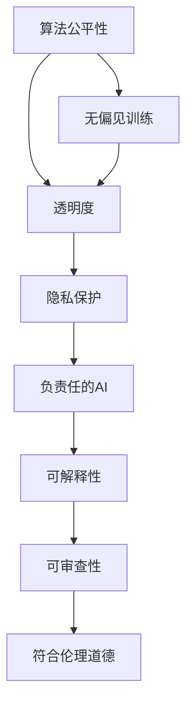

                 

# 软件 2.0 的伦理规范：人工智能的责任

> 关键词：软件2.0, 人工智能伦理, 算法公平性, 隐私保护, 透明度, 负责任的AI

## 1. 背景介绍

### 1.1 问题由来
随着人工智能(AI)技术的迅猛发展，特别是在自然语言处理(NLP)、计算机视觉(CV)等领域的突破，"软件2.0"时代已然到来。软件2.0以强大的AI模型为代表，其核心在于通过对大量无标签数据进行预训练，构建起具有复杂理解与生成能力的"智能软件"。然而，AI技术应用普及的同时，其带来的伦理问题也愈发凸显。从面部识别争议到自动驾驶事故，再到算法偏见导致的就业歧视，AI应用中暴露出的一系列伦理问题引起了公众的广泛关注。

在软件2.0时代，AI技术不仅在算法性能上不断进步，更在社会影响力上获得了前所未有的扩展。因此，构建AI技术的伦理规范，确保其负责任、公平、透明的应用，已成为社会各界共同关注的重要议题。本文将围绕软件2.0的伦理规范，特别是AI算法的公平性、隐私保护、透明度和负责任应用等方面展开探讨。

### 1.2 问题核心关键点
软件2.0伦理规范的核心在于确保AI算法在设计和应用过程中，遵循公平、透明、隐私保护和负责任的原则。这些原则不仅关乎技术本身，更是关乎整个社会对于AI技术的接受度和信任度。具体而言，AI算法的公平性要求算法无偏见，隐私保护要求算法尊重用户隐私，透明度要求算法可解释，负责任的应用则要求算法决策可接受、可审查，并具有相应的道德和社会责任。

## 2. 核心概念与联系

### 2.1 核心概念概述

为了更好地理解软件2.0的伦理规范，首先需要明确几个关键概念：

- **算法公平性**：算法输出不应受到输入数据偏见的影响，应尽可能提供公正、无歧视的服务。
- **隐私保护**：算法在处理个人数据时，应遵循数据最小化、匿名化、加密等原则，保障用户隐私权。
- **透明度**：算法应提供清晰的决策路径和逻辑，使用户能够理解算法的工作原理和决策依据。
- **负责任的AI**：算法应具备可解释性，能接受外部审查，同时其决策过程应符合伦理道德标准，避免潜在的负面社会影响。

这些概念之间相互联系，共同构成了软件2.0伦理规范的基础。算法公平性和透明度有助于提升隐私保护和负责任的AI，而负责任的AI又反过来对算法公平性和透明度提出更高要求。因此，在实践中，需要对这些概念进行全面考量，以确保AI技术的负责任应用。

### 2.2 核心概念原理和架构的 Mermaid 流程图



这个流程图展示了算法公平性、透明度、隐私保护和负责任AI之间的联系：

1. **算法公平性**：通过无偏见训练减少算法偏差，确保决策公正。
2. **透明度**：清晰的决策路径和逻辑使得算法可解释。
3. **隐私保护**：使用户数据处理符合隐私保护原则。
4. **负责任的AI**：在可解释和符合伦理道德的基础上，确保算法的可审查性和决策的公平性。

## 3. 核心算法原理 & 具体操作步骤
### 3.1 算法原理概述

软件2.0伦理规范的核心算法原理在于确保AI算法的公正性、透明性和隐私保护。其核心在于：

1. **无偏见训练**：使用多样化的数据集，确保算法在各种背景和情境下的公正性。
2. **可解释性**：构建算法决策的透明路径，使用户能够理解算法的决策依据。
3. **隐私保护**：采用加密、去标识化等技术手段，保障用户数据安全。

### 3.2 算法步骤详解

基于上述原则，软件2.0的伦理规范算法步骤主要包括以下几个关键环节：

1. **数据准备**：确保数据集的多样性和代表性，减少算法偏见。
2. **模型训练**：使用无偏见的数据训练模型，并通过正则化等方法提高模型泛化能力。
3. **算法设计**：确保算法设计符合伦理标准，如公平性、可解释性和隐私保护。
4. **测试验证**：在多样化的场景下测试模型，评估其公平性和可解释性。
5. **部署实施**：在部署过程中，确保数据处理符合隐私保护原则，提供算法决策的透明路径。

### 3.3 算法优缺点

软件2.0伦理规范的算法具有以下优点：

1. **提升公平性**：通过多样化的数据集和正则化方法，显著降低算法偏见，提高模型公正性。
2. **增强透明度**：通过可解释性技术，使用户能够理解和信任算法的决策过程。
3. **保障隐私**：采用隐私保护技术，保障用户数据的安全性。

同时，这些算法也存在以下局限：

1. **成本高**：多样化的数据集收集和隐私保护技术的实施需要大量资源投入。
2. **复杂度高**：算法设计和验证过程较为复杂，需要专业知识。
3. **可解释性有限**：部分算法仍然难以解释其决策过程，特别是深度学习模型。

### 3.4 算法应用领域

软件2.0伦理规范的算法已经在多个领域得到了应用，具体如下：

1. **金融风险评估**：通过无偏见、可解释的算法模型，提升风险评估的公平性和透明度，减少歧视性决策。
2. **医疗诊断**：使用公平、透明的算法模型辅助医生决策，提高诊断准确性和公平性。
3. **教育公平**：通过无偏见、可解释的推荐系统，提升教育资源的公平分配。
4. **司法判决**：采用透明、负责任的算法模型辅助司法判决，减少算法偏见。
5. **社会治理**：利用可解释、公平的算法模型，提升社会治理的公平性和透明度。

这些应用展示了AI算法在各个领域提升决策公正性和透明度的巨大潜力。

## 4. 数学模型和公式 & 详细讲解 & 举例说明

### 4.1 数学模型构建

软件2.0伦理规范的数学模型构建主要涉及公平性、透明度和隐私保护三个方面：

- **公平性模型**：使用分类准确率、F1-score等指标评估算法的公平性。
- **透明度模型**：使用SHAP、LIME等可解释性工具构建算法的透明路径。
- **隐私保护模型**：使用差分隐私技术，保障用户数据匿名化处理。

### 4.2 公式推导过程

以公平性模型为例，假设算法在样本集 $D$ 上对类别 $y$ 的预测概率为 $\hat{p}(y|x)$，其中 $x$ 为输入特征，$y$ 为类别标签。在无偏见训练中，我们期望算法对所有类别的预测概率相等。因此，设公平性约束为 $p_0 = \frac{1}{K}\sum_{k=1}^K p_k$，其中 $K$ 为类别数，$p_k$ 为类别 $k$ 的预测概率。

公平性模型的目标为：

$$
\min_{\theta} \mathcal{L}(\hat{p}(y|x))
$$

其中 $\mathcal{L}$ 为损失函数，可以使用交叉熵损失函数。

### 4.3 案例分析与讲解

以推荐系统的公平性为例，假设推荐系统根据用户历史行为数据预测其对商品 $i$ 的评分。如果数据集中存在性别偏见，男性和女性的评分标准不一致，会导致推荐算法出现偏见。为消除这种偏见，可以使用公平性约束，确保对所有性别的用户预测评分的一致性。

假设数据集中用户 $x$ 对商品 $i$ 的预测评分为 $\hat{p}(i|x)$，其公平性约束为：

$$
\min_{\theta} \mathcal{L}(\hat{p}(i|x)) + \lambda \sum_{i=1}^{N} (\frac{p_{i,1} - p_{i,0}}{p_{i,0} + p_{i,1}})^2
$$

其中 $\lambda$ 为公平性约束的权重，$N$ 为商品数，$p_{i,1}$ 和 $p_{i,0}$ 分别为男性和女性的预测评分概率。

## 5. 项目实践：代码实例和详细解释说明

### 5.1 开发环境搭建

在进行项目实践前，需要搭建开发环境。以下是Python开发环境搭建步骤：

1. 安装Anaconda：从官网下载并安装Anaconda，用于创建独立的Python环境。
2. 创建并激活虚拟环境：
```bash
conda create -n pytorch-env python=3.8 
conda activate pytorch-env
```
3. 安装PyTorch：根据CUDA版本，从官网获取对应的安装命令。例如：
```bash
conda install pytorch torchvision torchaudio cudatoolkit=11.1 -c pytorch -c conda-forge
```
4. 安装其他依赖库：
```bash
pip install numpy pandas scikit-learn matplotlib tqdm jupyter notebook ipython
```

### 5.2 源代码详细实现

以下是一个简单的Python代码实现示例，展示了如何使用PyTorch进行无偏见训练：

```python
import torch
import torch.nn as nn
import torch.optim as optim
from torch.utils.data import Dataset, DataLoader
from sklearn.metrics import classification_report

class FairDataset(Dataset):
    def __init__(self, data, labels, weights):
        self.data = data
        self.labels = labels
        self.weights = weights
    
    def __len__(self):
        return len(self.data)
    
    def __getitem__(self, idx):
        data = self.data[idx]
        label = self.labels[idx]
        weight = self.weights[idx]
        return data, label, weight
    
class FairModel(nn.Module):
    def __init__(self):
        super(FairModel, self).__init__()
        self.fc = nn.Linear(784, 10)
    
    def forward(self, x, y, weight):
        x = self.fc(x)
        loss = nn.functional.cross_entropy(x, y, reduction='none', weight=weight.unsqueeze(-1))
        loss = loss.mean()
        return loss

# 加载数据集
train_data = torchvision.datasets.MNIST(root='./data', train=True, transform=transforms.ToTensor(), download=True)
train_labels = train_data.targets
train_weights = torch.ones_like(train_labels) * 1 / len(train_labels)
test_data = torchvision.datasets.MNIST(root='./data', train=False, transform=transforms.ToTensor(), download=True)
test_labels = test_data.targets

# 定义数据集
train_dataset = FairDataset(train_data, train_labels, train_weights)
test_dataset = FairDataset(test_data, test_labels, torch.ones_like(test_labels))

# 定义模型和优化器
model = FairModel()
optimizer = optim.Adam(model.parameters(), lr=0.01)
criterion = nn.CrossEntropyLoss()

# 训练模型
for epoch in range(10):
    for data, label, weight in DataLoader(train_dataset, batch_size=64, shuffle=True):
        optimizer.zero_grad()
        output = model(data, label, weight)
        loss = criterion(output, label)
        loss.backward()
        optimizer.step()

# 测试模型
with torch.no_grad():
    _, predicted = torch.max(model(test_data), 1)
    print(classification_report(test_labels, predicted))
```

### 5.3 代码解读与分析

上述代码展示了如何使用PyTorch进行无偏见训练。具体步骤如下：

1. 定义数据集 `FairDataset`，其构造函数接收数据、标签和权重作为参数，其中权重用于平衡不同类别。
2. 定义模型 `FairModel`，使用交叉熵损失函数进行训练。
3. 在训练过程中，对于每个样本，通过 `DataLoader` 获取数据，计算损失并反向传播更新模型参数。
4. 在测试过程中，使用 `classification_report` 函数评估模型性能。

## 6. 实际应用场景

### 6.1 金融风险评估

在金融风险评估领域，AI算法需要确保评估过程的公正性和透明度。通过无偏见训练和可解释性模型，可以避免基于性别、年龄等敏感特征的歧视性决策，提升风险评估的公平性和透明度。

### 6.2 医疗诊断

医疗诊断中，AI算法需要准确、公平地对不同种族、性别、年龄等背景的用户进行诊断。通过使用多样化的数据集和正则化方法，确保算法在各种背景下的公正性。

### 6.3 教育公平

在教育领域，AI算法需要公平地分配教育资源，避免基于社会经济背景的歧视。通过无偏见训练和可解释性模型，提升教育资源的公平分配。

### 6.4 未来应用展望

展望未来，软件2.0的伦理规范将在更多领域得到应用，为社会公平和透明带来变革性影响。在智慧医疗、教育公平、社会治理等领域，基于公平、透明、隐私保护和负责任的AI技术，将逐步构建起更加公正、透明的社会治理系统。

## 7. 工具和资源推荐

### 7.1 学习资源推荐

为帮助开发者系统掌握软件2.0的伦理规范，这里推荐一些优质的学习资源：

1. 《人工智能伦理与法律》书籍：介绍了AI技术应用中的伦理问题和法律挑战，提供全面的解决方案。
2. 《公平性、透明性和负责任的AI》系列博文：详细介绍了AI算法的公平性、透明度和隐私保护，提供实际应用案例。
3. 《数据隐私保护技术》课程：介绍数据隐私保护的基础知识和实际应用技术。
4. 《算法可解释性》系列教程：讲解如何构建可解释的AI算法模型，提供实战案例。

### 7.2 开发工具推荐

有效的开发离不开优秀的工具支持。以下是几款用于软件2.0伦理规范开发的常用工具：

1. PyTorch：基于Python的开源深度学习框架，灵活动态的计算图，适合快速迭代研究。
2. TensorFlow：由Google主导开发的开源深度学习框架，生产部署方便，适合大规模工程应用。
3. Transformers库：HuggingFace开发的NLP工具库，集成了SOTA语言模型，支持公平性、可解释性等伦理特性。
4. Weights & Biases：模型训练的实验跟踪工具，可以记录和可视化模型训练过程中的各项指标。
5. TensorBoard：TensorFlow配套的可视化工具，可实时监测模型训练状态，并提供丰富的图表呈现方式。

### 7.3 相关论文推荐

软件2.0伦理规范的研究源于学界的持续研究。以下是几篇奠基性的相关论文，推荐阅读：

1. "Fairness, Accountability, and Transparency"（FAT）：数据科学和人工智能领域重要的伦理会议，提供大量相关研究成果。
2. "Algorithmic Fairness through Pre-processing"（AFT）：介绍了数据预处理中的公平性问题及解决思路。
3. "Explaining Black-box Models and Intelligent Terminating Systems"：讨论了可解释性技术在AI模型中的应用。
4. "Principles and Practices for AI Responsible Research and Development"：AI负责任研究与开发指南，提供伦理规范和实践建议。

通过对这些资源的学习实践，相信你一定能够系统掌握软件2.0的伦理规范，并用于解决实际的AI问题。

## 8. 总结：未来发展趋势与挑战

### 8.1 总结

本文对软件2.0的伦理规范进行了全面系统的介绍。首先阐述了软件2.0伦理规范的核心概念和应用意义，明确了公平性、透明度、隐私保护和负责任原则的重要性。其次，从原理到实践，详细讲解了公平性、透明度和隐私保护的核心算法步骤，给出了具体的代码实现示例。同时，本文还探讨了软件2.0在多个领域的应用场景，展示了其提升决策公正性和透明度的巨大潜力。最后，本文推荐了相关学习资源、开发工具和论文，力求为开发者提供全方位的技术指引。

通过本文的系统梳理，可以看到，软件2.0伦理规范是确保AI算法公正、透明、负责任应用的基础。这些规范不仅关乎技术本身，更是关乎社会对AI技术的接受度和信任度。只有积极构建伦理规范，确保AI技术的负责任应用，才能真正实现AI技术在各个领域的广泛应用和深远影响。

### 8.2 未来发展趋势

展望未来，软件2.0伦理规范将呈现以下几个发展趋势：

1. **多模态融合**：软件2.0将进一步拓展到多模态数据融合，如视觉、语音、文本等，实现更全面的信息整合能力。
2. **联邦学习**：通过分布式计算和差分隐私技术，保护用户隐私的同时实现算法模型的优化和共享。
3. **解释性增强**：未来将开发更多可解释的AI算法模型，使用户能够更好地理解和信任算法决策。
4. **负责任的AI**：软件2.0将更多关注算法的伦理和社会责任，确保AI决策的可审查性和公平性。
5. **跨领域应用**：AI伦理规范将逐步应用于更多领域，如司法、教育、医疗等，推动社会公平和透明。

这些趋势凸显了软件2.0伦理规范的广阔前景。这些方向的探索发展，必将进一步提升AI技术的公平性、透明性和负责任性，为构建安全、可靠、可解释、可控的智能系统铺平道路。

### 8.3 面临的挑战

尽管软件2.0伦理规范已经取得了一定进展，但在迈向更加智能化、普适化应用的过程中，仍面临诸多挑战：

1. **资源瓶颈**：多样化的数据集收集和隐私保护技术的实施需要大量资源投入，如何平衡资源和效果仍是难题。
2. **算法复杂度**：无偏见训练和可解释性算法的设计和验证过程较为复杂，需要专业知识。
3. **数据隐私**：如何在大规模数据处理中保障用户隐私，防止数据泄露，是AI应用中的重大挑战。
4. **模型可解释性**：部分AI模型，特别是深度学习模型，仍然难以解释其决策过程，如何提高模型的可解释性，将是重要的研究方向。
5. **伦理道德**：AI算法的伦理和社会责任问题复杂多样，如何构建统一的伦理规范和标准，还需要更多研究和讨论。

### 8.4 研究展望

面对软件2.0伦理规范面临的挑战，未来的研究需要在以下几个方面寻求新的突破：

1. **数据隐私保护**：探索更多差分隐私、联邦学习等隐私保护技术，确保数据安全。
2. **模型可解释性**：研究如何构建更可解释的AI算法模型，如LIME、SHAP等可解释性工具，提高算法的透明性。
3. **公平性和负责任**：开发公平性和负责任的AI算法，确保算法的公平性、透明性和社会责任。
4. **跨领域应用**：将伦理规范应用到更多领域，如司法、医疗、教育等，推动跨领域公平和透明。

这些研究方向的探索，必将引领软件2.0伦理规范技术迈向更高的台阶，为构建安全、可靠、可解释、可控的智能系统铺平道路。面向未来，软件2.0伦理规范还需要与其他人工智能技术进行更深入的融合，如知识表示、因果推理、强化学习等，多路径协同发力，共同推动自然语言理解和智能交互系统的进步。只有勇于创新、敢于突破，才能不断拓展语言模型的边界，让智能技术更好地造福人类社会。

## 9. 附录：常见问题与解答

**Q1：软件2.0的伦理规范包括哪些核心内容？**

A: 软件2.0的伦理规范主要包括算法公平性、透明度、隐私保护和负责任应用四个核心内容。算法公平性要求算法无偏见，透明度要求算法可解释，隐私保护要求算法尊重用户隐私，负责任的应用则要求算法决策可接受、可审查，并具有相应的道德和社会责任。

**Q2：如何衡量算法的公平性？**

A: 算法的公平性通常通过分类准确率、F1-score等指标进行衡量。这些指标可以帮助评估算法在各种背景和情境下的公正性。

**Q3：如何确保算法的透明度？**

A: 确保算法透明度主要通过可解释性技术，如SHAP、LIME等工具，构建算法的透明路径，使用户能够理解算法的决策依据。

**Q4：如何在保护隐私的前提下使用数据？**

A: 使用差分隐私技术，对用户数据进行匿名化处理，确保数据隐私保护。同时，采用联邦学习等分布式计算技术，保护用户数据安全。

**Q5：如何构建负责任的AI算法？**

A: 构建负责任的AI算法需要遵循伦理标准，如公平性、可解释性和隐私保护。同时，确保算法决策的可审查性和公平性，避免潜在的负面社会影响。

---

作者：禅与计算机程序设计艺术 / Zen and the Art of Computer Programming

