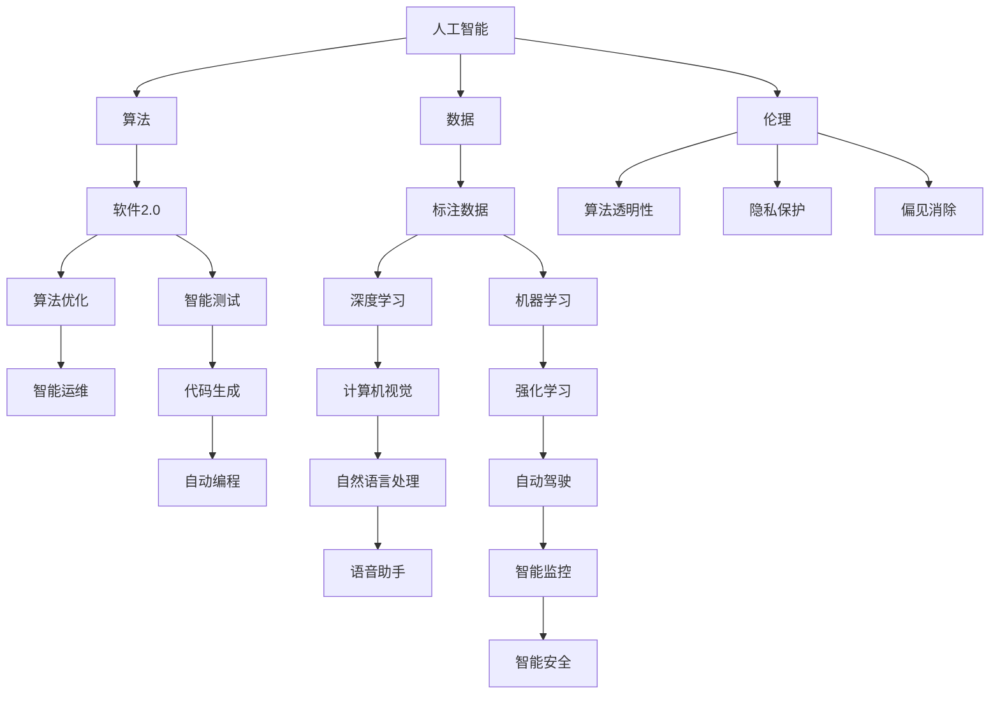

                 

# 软件 2.0 的哲学思考：人工智能的本质

## 1. 背景介绍

在过去几十年中，软件技术以几何级数增长，改变了全球经济、社会和文化。从早期的机器语言、汇编语言，到高级编程语言、操作系统、数据库管理系统，再到今天的大数据、人工智能和区块链，软件已经成为推动社会进步的重要力量。然而，随着技术的不断演进，软件发展的范式也逐渐发生了变化，从以数据为中心的“软件 1.0”，演变为以智能算法为中心的“软件 2.0”。在这一背景下，如何理解人工智能的本质，以及它在软件2.0时代的作用，成为了一个重要的哲学问题。

### 1.1 问题由来

随着深度学习、自然语言处理、计算机视觉等技术的飞速发展，人工智能(AI)已经成为软件2.0时代的重要标志。从棋类游戏到游戏AI，从自动驾驶到语音助手，AI技术在各个领域的应用取得了显著进展。但与此同时，AI的迅速崛起也引发了广泛的伦理、安全、隐私等方面的争议。如何从哲学的角度理解AI的本质，以及它对社会的影响，成为了一个亟待解决的问题。

### 1.2 问题核心关键点

本问题聚焦于AI在软件2.0时代的作用和意义，主要包括以下几个核心关键点：

- AI与软件的关系：AI技术在软件2.0时代的作用和地位。
- AI的哲学本质：AI技术的本质是什么，以及它与人类智慧的关系。
- AI的社会影响：AI技术对社会、经济、文化等方面的影响。
- AI的伦理和道德：AI技术的伦理和道德问题，如算法透明性、隐私保护、偏见消除等。
- AI的未来发展：AI技术的发展趋势和未来可能带来的挑战。

## 2. 核心概念与联系

### 2.1 核心概念概述

要理解软件2.0时代的AI本质，首先需要理解几个核心概念：

- 人工智能(AI)：模拟人类智能的技术，包括机器学习、深度学习、自然语言处理、计算机视觉等。
- 软件2.0：基于人工智能的自动化软件系统，包括自动编程、代码生成、智能测试、智能运维等。
- 算法：计算问题的有效解决方案，如深度学习、强化学习、进化算法等。
- 数据：算法训练和优化所需的信息，包括结构化数据、非结构化数据、标注数据等。
- 伦理：涉及AI技术的道德规范和社会责任，如隐私保护、公平性、透明性等。

这些概念之间的逻辑关系可以通过以下Mermaid流程图来展示：



这个流程图展示了一些核心概念之间的相互关系：

1. 人工智能由算法和数据驱动，通过机器学习、深度学习等算法模型，从数据中学习。
2. 人工智能技术的应用在软件2.0时代得到了广泛拓展，包括自动编程、智能测试、智能运维等。
3. 算法优化和智能运维是AI技术在实际应用中的重要环节，有助于提升软件系统的性能和效率。
4. 标注数据是训练AI模型的重要基础，其质量和数量直接决定了AI模型的性能。
5. AI技术的应用范围广泛，包括计算机视觉、自然语言处理、语音助手、自动驾驶等。
6. AI技术的伦理问题，如算法透明性、隐私保护、偏见消除等，也是其发展的重要方向。

这些概念共同构成了AI技术在软件2.0时代的本质，也反映了其在实际应用中的重要性和挑战。

## 3. 核心算法原理 & 具体操作步骤

### 3.1 算法原理概述

基于AI的软件2.0时代，核心算法原理主要是机器学习和深度学习。机器学习通过统计学习方法，使计算机能够从数据中学习模式和规律，从而实现自动化决策和预测。深度学习则利用多层神经网络模型，模拟人脑的工作方式，能够处理复杂的非线性关系和噪声数据，适用于图像识别、自然语言处理等复杂任务。

### 3.2 算法步骤详解

AI技术的开发和应用一般包括以下几个关键步骤：

**Step 1: 数据准备**
- 收集、清洗和标注数据，确保数据质量和多样性。
- 将数据划分为训练集、验证集和测试集。
- 选择合适的特征表示方法，提取和选择有意义的特征。

**Step 2: 模型选择和设计**
- 根据任务需求选择适当的机器学习或深度学习模型。
- 设计模型的结构和超参数，如神经网络层数、激活函数、正则化等。
- 选择合适的优化器和损失函数。

**Step 3: 模型训练和调优**
- 使用训练集对模型进行训练，使用验证集进行模型调优。
- 采用各种优化算法，如梯度下降、Adam等，最小化损失函数。
- 通过正则化、Dropout等技术防止过拟合。

**Step 4: 模型评估和部署**
- 在测试集上评估模型性能，计算精度、召回率、F1分数等指标。
- 部署模型到实际应用中，进行实时预测和决策。
- 持续监控模型性能，进行模型更新和优化。

### 3.3 算法优缺点

AI算法具有以下优点：

1. 自动化决策：AI算法能够自动进行数据处理和决策，提高效率和准确性。
2. 处理复杂问题：AI算法能够处理复杂的非线性关系和噪声数据，适用于图像识别、自然语言处理等复杂任务。
3. 数据驱动：AI算法依赖数据进行学习和优化，能够适应数据分布的变化。

然而，AI算法也存在一些缺点：

1. 数据依赖性高：AI算法的性能很大程度上取决于数据的质量和数量，数据获取成本高。
2. 模型复杂度高：深度学习模型通常结构复杂，训练和优化需要大量计算资源。
3. 可解释性差：AI算法的决策过程难以解释和调试，难以理解其内部工作机制。
4. 偏见和偏差：AI算法容易学习到数据中的偏见和偏差，导致模型输出存在歧视性。

### 3.4 算法应用领域

AI技术在软件2.0时代得到了广泛应用，涉及多个领域：

- 自动驾驶：通过计算机视觉、深度学习等技术，实现自动驾驶汽车。
- 自然语言处理：通过自然语言理解和生成，实现机器翻译、语音助手等应用。
- 医疗诊断：通过图像识别、深度学习等技术，辅助医生进行疾病诊断。
- 金融风控：通过机器学习、深度学习等技术，进行信用评分、风险预测等。
- 智能推荐：通过推荐算法，实现个性化推荐系统，如电商推荐、新闻推荐等。
- 智能客服：通过自然语言处理、机器学习等技术，实现智能客服系统。

## 4. 数学模型和公式 & 详细讲解 & 举例说明

### 4.1 数学模型构建

AI技术的数学模型主要涉及机器学习和深度学习的算法模型，如线性回归、逻辑回归、支持向量机、神经网络、卷积神经网络、循环神经网络等。以神经网络模型为例，其基本结构由输入层、隐藏层和输出层组成，如下图所示：


神经网络模型的训练过程是通过反向传播算法，计算损失函数的梯度，并使用优化器更新模型参数。常用的优化器包括梯度下降、Adam、Adagrad等。以梯度下降为例，其基本流程如下：

1. 随机初始化模型参数 $\theta$。
2. 输入数据 $x$，计算模型的预测结果 $\hat{y}$。
3. 计算损失函数 $L$。
4. 计算损失函数对模型参数的梯度 $\nabla_{\theta}L$。
5. 使用优化器更新模型参数 $\theta$。

### 4.2 公式推导过程

以线性回归为例，推导最小二乘法（Mean Squared Error，MSE）损失函数的梯度计算过程。设训练数据集为 $(x_i, y_i)$，其中 $x_i$ 为输入向量，$y_i$ 为输出向量。假设模型为 $h_\theta(x) = \theta^T x$，则最小二乘法的损失函数为：

$$
J(\theta) = \frac{1}{2N} \sum_{i=1}^N (y_i - h_\theta(x_i))^2
$$

对 $\theta$ 求偏导，得：

$$
\frac{\partial J(\theta)}{\partial \theta} = \frac{1}{N} \sum_{i=1}^N (y_i - h_\theta(x_i))x_i
$$

其中，$x_i$ 是样本 $i$ 的输入向量，$y_i$ 是样本 $i$ 的输出向量，$h_\theta(x_i)$ 是模型对样本 $i$ 的预测输出，$N$ 是样本数量。

### 4.3 案例分析与讲解

以图像分类任务为例，分析深度学习模型在实际应用中的训练和优化过程。假设任务为手写数字识别，训练集为MNIST数据集。使用卷积神经网络模型进行训练，其结构如下：

```
层1：卷积层，32个5x5的卷积核
层2：卷积层，64个5x5的卷积核
层3：池化层
层4：全连接层，128个神经元
层5：输出层，10个神经元
```

训练过程中，使用交叉熵损失函数，优化器为Adam。具体的训练流程如下：

1. 随机初始化模型参数。
2. 输入训练样本，通过卷积层、池化层提取特征。
3. 使用全连接层和输出层进行分类预测。
4. 计算交叉熵损失函数。
5. 计算损失函数对模型参数的梯度。
6. 使用Adam优化器更新模型参数。
7. 重复上述步骤，直至收敛。

通过深度学习模型在图像分类任务中的应用，可以看到，AI技术能够自动从数据中学习特征和规律，实现自动化的决策和预测。

## 5. 项目实践：代码实例和详细解释说明

### 5.1 开发环境搭建

在进行AI项目实践前，需要准备好开发环境。以下是使用Python进行TensorFlow开发的环境配置流程：

1. 安装Anaconda：从官网下载并安装Anaconda，用于创建独立的Python环境。

2. 创建并激活虚拟环境：
```bash
conda create -n tf-env python=3.8 
conda activate tf-env
```

3. 安装TensorFlow：根据CUDA版本，从官网获取对应的安装命令。例如：
```bash
conda install tensorflow -c pytorch -c conda-forge
```

4. 安装各类工具包：
```bash
pip install numpy pandas scikit-learn matplotlib tqdm jupyter notebook ipython
```

完成上述步骤后，即可在`tf-env`环境中开始AI项目实践。

### 5.2 源代码详细实现

这里我们以手写数字识别为例，给出使用TensorFlow对卷积神经网络模型进行训练的代码实现。

首先，定义模型和损失函数：

```python
import tensorflow as tf

model = tf.keras.Sequential([
    tf.keras.layers.Conv2D(32, (3,3), activation='relu', input_shape=(28,28,1)),
    tf.keras.layers.MaxPooling2D((2,2)),
    tf.keras.layers.Conv2D(64, (3,3), activation='relu'),
    tf.keras.layers.MaxPooling2D((2,2)),
    tf.keras.layers.Flatten(),
    tf.keras.layers.Dense(128, activation='relu'),
    tf.keras.layers.Dense(10, activation='softmax')
])

loss_fn = tf.keras.losses.SparseCategoricalCrossentropy(from_logits=True)

# 训练数据集和测试数据集
train_ds = tf.keras.datasets.mnist.load_data()
test_ds = tf.keras.datasets.mnist.load_data()

train_images = train_ds[0][0]
train_labels = train_ds[1]
test_images = test_ds[0][0]
test_labels = test_ds[1]

# 将数据归一化
train_images = train_images / 255.0
test_images = test_images / 255.0

# 定义优化器和回调函数
optimizer = tf.keras.optimizers.Adam(learning_rate=0.001)
checkpoint = tf.keras.callbacks.ModelCheckpoint('model.h5', save_weights_only=True, verbose=1)

# 训练模型
model.compile(optimizer=optimizer, loss=loss_fn, metrics=['accuracy'])
model.fit(train_images, train_labels, epochs=10, validation_data=(test_images, test_labels), callbacks=[checkpoint])

# 评估模型
test_loss, test_acc = model.evaluate(test_images, test_labels)
print(f'Test accuracy: {test_acc:.2f}')
```

然后，进行模型训练和评估：

```python
# 模型训练
model.fit(train_images, train_labels, epochs=10, validation_data=(test_images, test_labels), callbacks=[checkpoint])

# 模型评估
test_loss, test_acc = model.evaluate(test_images, test_labels)
print(f'Test accuracy: {test_acc:.2f}')
```

最终，保存训练好的模型：

```python
# 保存模型
tf.keras.models.save_model(model, 'mnist_model')
```

以上就是使用TensorFlow对卷积神经网络模型进行训练的完整代码实现。可以看到，TensorFlow提供了一体化的API，使得模型的构建、训练和评估变得非常便捷。

### 5.3 代码解读与分析

让我们再详细解读一下关键代码的实现细节：

**卷积神经网络模型**：
- 通过`tf.keras.Sequential`创建卷积神经网络模型。
- 使用`Conv2D`层实现卷积操作，提取图像特征。
- 使用`MaxPooling2D`层实现池化操作，减小特征图尺寸。
- 使用`Dense`层实现全连接操作，进行分类预测。
- 使用`softmax`激活函数，计算输出概率分布。

**训练函数**：
- 使用`tf.keras.datasets.mnist.load_data()`加载MNIST数据集。
- 将数据归一化到[0,1]范围内，以提高模型收敛速度。
- 定义优化器`optimizer`，使用Adam优化器。
- 定义检查点回调函数`checkpoint`，保存模型参数。
- 使用`compile`方法编译模型，定义损失函数和评估指标。
- 使用`fit`方法训练模型，设置训练轮数和验证集。
- 使用`evaluate`方法评估模型性能，输出准确率。

**保存模型**：
- 使用`save_model`方法将训练好的模型保存为h5文件。

可以看到，TensorFlow提供了高效的API，使得AI项目的开发和部署变得非常便捷。开发者可以专注于模型设计和优化，而不必过多关注底层实现细节。

## 6. 实际应用场景

### 6.1 自动驾驶

自动驾驶是AI技术的重要应用领域之一。通过计算机视觉、深度学习等技术，实现对道路环境、交通信号、车辆行为的实时感知和决策，实现自动驾驶汽车。自动驾驶技术的核心是感知、决策和控制，每个环节都需要AI技术的大力支持。

### 6.2 医疗诊断

AI技术在医疗诊断中的应用也非常广泛。通过图像识别、深度学习等技术，辅助医生进行疾病诊断。例如，医学影像诊断、病理图像分析、病历信息挖掘等，能够提高医生的诊断准确性和效率，减少误诊和漏诊。

### 6.3 金融风控

金融行业也广泛应用AI技术，进行信用评分、风险预测、智能投顾等。通过机器学习、深度学习等技术，对用户行为数据、金融市场数据进行建模和分析，识别出潜在的风险和机会，辅助金融决策。

### 6.4 智能推荐

智能推荐系统是AI技术的典型应用之一。通过推荐算法，实现个性化推荐系统，如电商推荐、新闻推荐等。通过分析用户行为数据和兴趣偏好，智能推荐系统能够提供更加精准、多样的推荐内容，提升用户体验。

## 7. 工具和资源推荐

### 7.1 学习资源推荐

为了帮助开发者系统掌握AI技术，这里推荐一些优质的学习资源：

1. 《深度学习》系列博文：由深度学习专家撰写，深入浅出地介绍了深度学习的基本原理和应用。

2. CS231n《计算机视觉：卷积神经网络》课程：斯坦福大学开设的计算机视觉明星课程，有Lecture视频和配套作业，带你入门计算机视觉领域的基本概念和经典模型。

3. 《自然语言处理综述》书籍：全面介绍了自然语言处理的基本概念和前沿技术，是学习NLP的必备资料。

4. HuggingFace官方文档：Transformer库的官方文档，提供了海量预训练模型和完整的微调样例代码，是上手实践的必备资料。

5. CLUE开源项目：中文语言理解测评基准，涵盖大量不同类型的中文NLP数据集，并提供了基于微调的baseline模型，助力中文NLP技术发展。

通过对这些资源的学习实践，相信你一定能够快速掌握AI技术的精髓，并用于解决实际的AI问题。

### 7.2 开发工具推荐

高效的开发离不开优秀的工具支持。以下是几款用于AI开发的常用工具：

1. PyTorch：基于Python的开源深度学习框架，灵活动态的计算图，适合快速迭代研究。大部分预训练语言模型都有PyTorch版本的实现。

2. TensorFlow：由Google主导开发的开源深度学习框架，生产部署方便，适合大规模工程应用。同样有丰富的预训练语言模型资源。

3. HuggingFace Transformers库：提供了丰富的预训练模型和微调接口，支持PyTorch和TensorFlow，是进行AI项目开发的利器。

4. Weights & Biases：模型训练的实验跟踪工具，可以记录和可视化模型训练过程中的各项指标，方便对比和调优。与主流深度学习框架无缝集成。

5. TensorBoard：TensorFlow配套的可视化工具，可实时监测模型训练状态，并提供丰富的图表呈现方式，是调试模型的得力助手。

6. Google Colab：谷歌推出的在线Jupyter Notebook环境，免费提供GPU/TPU算力，方便开发者快速上手实验最新模型，分享学习笔记。

合理利用这些工具，可以显著提升AI项目的开发效率，加快创新迭代的步伐。

### 7.3 相关论文推荐

AI技术的发展离不开学界的持续研究。以下是几篇奠基性的相关论文，推荐阅读：

1. AlexNet：通过深度卷积神经网络实现图像分类，奠定了深度学习在计算机视觉领域的地位。

2. RNN和LSTM：引入了循环神经网络，用于处理序列数据，如语音、文本等。

3. Transformer：提出了自注意力机制，使得模型能够处理长序列，适用于自然语言处理等任务。

4. BERT：提出基于掩码的自监督预训练任务，刷新了多项NLP任务SOTA。

5. GAN：提出生成对抗网络，实现图像生成、风格迁移等效果。

这些论文代表了大AI技术的发展脉络。通过学习这些前沿成果，可以帮助研究者把握学科前进方向，激发更多的创新灵感。

## 8. 总结：未来发展趋势与挑战

### 8.1 总结

本文对基于AI的软件2.0时代进行了全面系统的介绍。首先阐述了AI技术在软件2.0时代的作用和意义，明确了AI技术的本质及其在实际应用中的重要性和挑战。其次，从原理到实践，详细讲解了AI技术的开发和应用流程，给出了AI项目开发的完整代码实例。同时，本文还广泛探讨了AI技术在自动驾驶、医疗诊断、金融风控、智能推荐等多个行业领域的应用前景，展示了AI技术的广泛应用场景。此外，本文精选了AI技术的各类学习资源，力求为读者提供全方位的技术指引。

通过本文的系统梳理，可以看到，AI技术在软件2.0时代已经取得了显著进展，其在自动驾驶、医疗诊断、金融风控、智能推荐等领域的广泛应用，展现了AI技术的巨大潜力和发展前景。未来，伴随AI技术的不断演进，软件2.0时代将会迎来更多的创新和发展，为社会带来深远的变革。

### 8.2 未来发展趋势

展望未来，AI技术将呈现以下几个发展趋势：

1. 模型规模持续增大。随着算力成本的下降和数据规模的扩张，AI模型的参数量还将持续增长。超大模型蕴含的丰富知识，有望支撑更加复杂多变的应用场景。

2. 模型性能持续提升。AI模型在图像识别、自然语言处理等领域的性能将持续提升，突破现有技术瓶颈，实现更精准、更高效的自动化决策和预测。

3. 模型泛化能力增强。AI模型将更加注重泛化能力，减少过拟合，提高在不同数据分布上的表现。

4. 模型可解释性提升。AI模型将更加注重可解释性，通过可视化、调试等手段，增强模型的透明性和可解释性。

5. 模型伦理和安全问题得到重视。AI模型将更加注重伦理和安全问题，避免偏见、歧视等不良影响，确保模型输出的可信度和安全性。

6. AI技术与其他技术的融合。AI技术将与其他技术（如区块链、物联网、量子计算等）进行深度融合，形成更加智能化的解决方案。

以上趋势凸显了AI技术在软件2.0时代的广泛应用前景。这些方向的探索发展，必将进一步提升AI技术的性能和应用范围，为人类社会带来更深远的影响。

### 8.3 面临的挑战

尽管AI技术已经取得了显著进展，但在迈向更加智能化、普适化应用的过程中，仍然面临诸多挑战：

1. 数据依赖性高。AI技术的性能很大程度上取决于数据的质量和数量，数据获取成本高。

2. 模型复杂度高。AI模型通常结构复杂，训练和优化需要大量计算资源。

3. 可解释性差。AI模型的决策过程难以解释和调试，难以理解其内部工作机制。

4. 偏见和偏差问题。AI模型容易学习到数据中的偏见和偏差，导致模型输出存在歧视性。

5. 伦理和安全问题。AI技术的伦理和安全问题，如隐私保护、公平性、透明性等，亟需进一步研究和规范。

6. 计算资源瓶颈。AI模型的训练和推理需要大量计算资源，可能面临计算资源瓶颈。

7. 跨领域应用难度大。AI模型在不同领域的适用性还需进一步研究和优化。

正视AI技术面临的这些挑战，积极应对并寻求突破，将使AI技术更加成熟和可靠。

### 8.4 研究展望

面对AI技术面临的挑战，未来的研究需要在以下几个方面寻求新的突破：

1. 探索无监督和半监督学习。摆脱对大规模标注数据的依赖，利用自监督学习、主动学习等无监督和半监督范式，最大限度利用非结构化数据，实现更加灵活高效的AI技术。

2. 研究参数高效和计算高效的AI技术。开发更加参数高效的AI技术，在固定大部分预训练参数的情况下，只更新极少量的任务相关参数。同时优化AI技术的计算图，减少前向传播和反向传播的资源消耗，实现更加轻量级、实时性的部署。

3. 引入因果推断和博弈论思想。通过引入因果推断和博弈论思想，增强AI技术的稳定性和鲁棒性，学习更加普适、鲁棒的语言表征，从而提升模型泛化性和抗干扰能力。

4. 将符号化的先验知识与神经网络模型融合。将符号化的先验知识，如知识图谱、逻辑规则等，与神经网络模型进行巧妙融合，引导AI技术学习更准确、合理的语言模型。

5. 将AI技术与其他技术结合。将AI技术与其他技术（如区块链、物联网、量子计算等）进行深度融合，形成更加智能化的解决方案。

6. 加强AI技术的伦理和安全约束。在AI技术的训练目标中引入伦理导向的评估指标，过滤和惩罚有偏见、有害的输出倾向，确保AI技术的输出符合人类价值观和伦理道德。

这些研究方向的研究成果，将使AI技术更加成熟和可靠，为构建安全、可靠、可解释、可控的智能系统铺平道路。面向未来，AI技术还需要与其他人工智能技术进行更深入的融合，如知识表示、因果推理、强化学习等，多路径协同发力，共同推动人工智能技术的发展。

## 9. 附录：常见问题与解答

**Q1：AI技术如何应用于自动驾驶？**

A: AI技术在自动驾驶中主要应用于感知、决策和控制三个环节。通过计算机视觉、深度学习等技术，实现对道路环境、交通信号、车辆行为的实时感知和决策，实现自动驾驶汽车。具体实现包括：

1. 感知：通过摄像头、雷达、激光雷达等传感器，获取道路环境信息，通过计算机视觉、图像处理等技术，实现对道路、车辆、行人等的实时检测和跟踪。

2. 决策：通过机器学习和深度学习技术，对感知信息进行分析和决策，判断当前的行驶状态和意图。

3. 控制：通过自动驾驶系统，对车辆的加速度、方向等进行控制，实现自动驾驶。

**Q2：AI技术在医疗诊断中的具体应用有哪些？**

A: AI技术在医疗诊断中的应用非常广泛，具体包括：

1. 医学影像诊断：通过图像识别和深度学习技术，辅助医生进行医学影像诊断，如X光片、CT、MRI等。

2. 病理图像分析：通过图像处理和深度学习技术，辅助医生进行病理图像分析，如病理切片、病理学检测等。

3. 病历信息挖掘：通过自然语言处理和机器学习技术，辅助医生进行病历信息挖掘和分析，提高诊断准确性和效率。

**Q3：AI技术在金融风控中的应用有哪些？**

A: AI技术在金融风控中的应用主要包括：

1. 信用评分：通过机器学习和深度学习技术，对用户行为数据和金融市场数据进行建模和分析，识别出潜在的风险和机会，辅助金融决策。

2. 风险预测：通过机器学习和深度学习技术，对市场数据和交易数据进行建模和分析，预测金融市场趋势和风险。

3. 智能投顾：通过自然语言处理和机器学习技术，构建智能投顾系统，提供个性化的金融咨询和建议。

**Q4：AI技术在智能推荐中的应用有哪些？**

A: AI技术在智能推荐中的应用非常广泛，具体包括：

1. 电商推荐：通过推荐算法，实现个性化推荐系统，推荐商品、优惠活动等。

2. 新闻推荐：通过推荐算法，实现个性化推荐系统，推荐新闻文章、视频等。

3. 视频推荐：通过推荐算法，实现个性化推荐系统，推荐视频内容、电视剧等。

4. 音乐推荐：通过推荐算法，实现个性化推荐系统，推荐音乐、MV等。

5. 书籍推荐：通过推荐算法，实现个性化推荐系统，推荐书籍、杂志等。

6. 旅游推荐：通过推荐算法，实现个性化推荐系统，推荐旅游目的地、景点等。

以上是AI技术在各个领域的具体应用，展示了AI技术在实际生活中的广泛应用前景。

