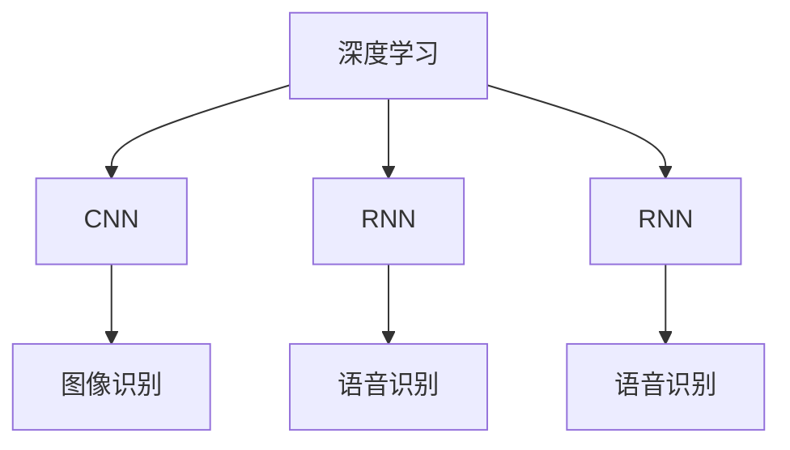

                 

# 软件 2.0 的应用领域：图像识别、语音识别

> 关键词：深度学习,卷积神经网络(CNN),循环神经网络(RNN),递归神经网络(RNN),图像识别,语音识别,计算机视觉,自然语言处理(NLP)

## 1. 背景介绍

### 1.1 问题由来

随着计算机科学的迅猛发展，人工智能（AI）技术已经渗透到了各个领域，而软件 2.0 作为这一技术进步的产物，在图像识别和语音识别这两个领域的应用尤为突出。

### 1.2 问题核心关键点

软件 2.0 的独特之处在于其深度学习能力的卓越表现，特别是在图像识别和语音识别这两个方向。

- **图像识别**：利用计算机视觉技术，通过图像处理算法和深度学习模型自动识别和分类图像中的物体或场景。
- **语音识别**：利用自然语言处理（NLP）技术，通过声学模型和语言模型对语音信号进行识别和理解。

这两个方向的研究不仅推动了人工智能技术的发展，也对诸多行业产生了深远的影响，如医疗、自动驾驶、安防、智能家居等。

## 2. 核心概念与联系

### 2.1 核心概念概述

软件 2.0 的核心概念主要涉及深度学习、卷积神经网络（CNN）、循环神经网络（RNN）、递归神经网络（RNN）等。

- **深度学习**：通过构建多层神经网络，模拟人脑的抽象思维过程，实现复杂模式的识别和预测。
- **卷积神经网络（CNN）**：一种特殊的神经网络，特别擅长处理具有网格状结构的数据，如图像和声音。
- **循环神经网络（RNN）**：一种能够处理序列数据的神经网络，适合处理时间序列数据，如语音信号。
- **递归神经网络（RNN）**：一种具有记忆功能的神经网络，能够捕捉数据之间的依赖关系，适合处理自然语言等序列数据。

这些概念通过深度学习框架如TensorFlow、PyTorch等得以实现，并广泛应用于图像识别和语音识别领域。

### 2.2 核心概念原理和架构的 Mermaid 流程图



## 3. 核心算法原理 & 具体操作步骤

### 3.1 算法原理概述

软件 2.0 中的图像识别和语音识别算法主要基于深度学习和神经网络。

- **图像识别**：通过卷积神经网络（CNN）对图像进行特征提取和分类。
- **语音识别**：通过循环神经网络（RNN）对语音信号进行特征提取和语言识别。

### 3.2 算法步骤详解

#### 3.2.1 图像识别算法步骤

1. **数据准备**：收集图像数据集，并进行预处理，如缩放、裁剪、归一化等。
2. **模型构建**：搭建卷积神经网络（CNN），设计卷积层、池化层、全连接层等。
3. **训练模型**：使用随机梯度下降（SGD）等优化算法，在训练集上进行前向传播和反向传播，更新网络参数。
4. **测试模型**：在测试集上评估模型性能，使用准确率、精确率、召回率等指标。
5. **应用模型**：将训练好的模型应用于实际场景，识别图像中的物体或场景。

#### 3.2.2 语音识别算法步骤

1. **数据准备**：收集语音数据集，并进行预处理，如去噪、分帧、归一化等。
2. **模型构建**：搭建循环神经网络（RNN），设计声学模型、语言模型等。
3. **训练模型**：使用随机梯度下降（SGD）等优化算法，在训练集上进行前向传播和反向传播，更新网络参数。
4. **测试模型**：在测试集上评估模型性能，使用词错误率（WER）等指标。
5. **应用模型**：将训练好的模型应用于实际场景，识别语音中的文字。

### 3.3 算法优缺点

#### 3.3.1 图像识别算法的优缺点

**优点**：
- 高效处理大规模图像数据。
- 适用于复杂的物体分类任务。
- 精度高，适用于医疗、安防等领域。

**缺点**：
- 计算资源需求高，训练时间长。
- 模型复杂度较高，难以解释。
- 对数据质量要求高，数据标注成本高。

#### 3.3.2 语音识别算法的优缺点

**优点**：
- 适用于多语言、多方言的语音识别。
- 实时性强，适用于智能家居、智能客服等领域。
- 模型简洁，易于部署。

**缺点**：
- 对噪音敏感，抗干扰能力弱。
- 对口音和语速的变化适应性差。
- 需要大量的标注数据，成本较高。

### 3.4 算法应用领域

图像识别和语音识别技术在多个领域得到了广泛应用。

- **医疗**：通过图像识别技术，自动识别医学影像中的病变区域，辅助医生诊断。
- **自动驾驶**：通过图像识别技术，实时分析道路情况，辅助驾驶决策。
- **安防**：通过图像识别技术，实时监控公共场所，提高安全性。
- **智能家居**：通过语音识别技术，实现语音控制家电、智能导航等功能。
- **智能客服**：通过语音识别技术，实现语音聊天机器人，提高客户服务效率。

## 4. 数学模型和公式 & 详细讲解 & 举例说明

### 4.1 数学模型构建

#### 4.1.1 图像识别模型的数学模型构建

图像识别模型主要基于卷积神经网络（CNN），其数学模型可以表示为：

$$
y = f(x; \theta)
$$

其中，$x$ 表示输入的图像数据，$\theta$ 表示模型的参数，$f$ 表示神经网络的非线性变换。

#### 4.1.2 语音识别模型的数学模型构建

语音识别模型主要基于循环神经网络（RNN），其数学模型可以表示为：

$$
y = f(x; \theta)
$$

其中，$x$ 表示输入的语音信号，$\theta$ 表示模型的参数，$f$ 表示神经网络的非线性变换。

### 4.2 公式推导过程

#### 4.2.1 图像识别模型的公式推导

对于卷积神经网络（CNN），其前向传播过程可以表示为：

$$
y = h(x; W)
$$

其中，$h$ 表示卷积层和池化层的非线性变换，$W$ 表示卷积核的参数。

后向传播过程中，使用梯度下降算法更新网络参数，其公式可以表示为：

$$
\theta = \theta - \alpha \nabla L(\theta)
$$

其中，$\alpha$ 表示学习率，$\nabla L$ 表示损失函数的梯度。

#### 4.2.2 语音识别模型的公式推导

对于循环神经网络（RNN），其前向传播过程可以表示为：

$$
y = h(x; W)
$$

其中，$h$ 表示RNN的隐藏状态更新过程，$W$ 表示网络参数。

后向传播过程中，使用梯度下降算法更新网络参数，其公式可以表示为：

$$
\theta = \theta - \alpha \nabla L(\theta)
$$

其中，$\alpha$ 表示学习率，$\nabla L$ 表示损失函数的梯度。

### 4.3 案例分析与讲解

#### 4.3.1 图像识别案例分析

以AlexNet为例，AlexNet是一种典型的卷积神经网络，其结构如图1所示：

```
         ----(Conv-1)----> (Pool-1) ----> (Conv-2) -> (Pool-2) -> (Conv-3) -> (Pool-3) -> (Dropout-1) -> (FC-1) -> (Dropout-2) -> (FC-2)
        (3x3) (2x2)      (3x3) (2x2)      (3x3) (2x2)   (5x5)  (5x5)   (400)   (400)   (1000)
         ---- (ReLU)      ---- (ReLU)     ---- (ReLU)   ---- (ReLU)  ---- (ReLU) ---- (ReLU) ---- (Softmax)
```

图1：AlexNet网络结构

通过AlexNet的训练，可以将其应用于图像分类任务中，如MNIST手写数字识别、ImageNet物体分类等。

#### 4.3.2 语音识别案例分析

以DeepSpeech为例，DeepSpeech是一种基于RNN的语音识别模型，其结构如图2所示：

```
                        ----(Conv-1)----> (Pooling-1) ----> (RNN-1) ----> (RNN-2) ----> (Softmax)
                        (3x3)      (2x2)        (50)        (50)     (1000)
```

图2：DeepSpeech网络结构

通过DeepSpeech的训练，可以将其应用于语音识别任务中，如Google Speech-to-Text、Apple Siri等。

## 5. 项目实践：代码实例和详细解释说明

### 5.1 开发环境搭建

在进行图像识别和语音识别项目开发前，需要搭建好开发环境。以下是Python环境下搭建开发环境的步骤：

1. **安装Python**：确保Python版本为3.6或以上，使用Anaconda或Miniconda进行安装。
2. **安装深度学习框架**：安装TensorFlow或PyTorch等深度学习框架，建议使用GPU版本以加快训练速度。
3. **安装相关库**：安装Pillow（图像处理库）、numpy、scipy、scikit-learn等库。
4. **安装深度学习模型库**：安装Keras、TensorFlow、PyTorch等库，使用预训练模型库进行项目开发。

### 5.2 源代码详细实现

#### 5.2.1 图像识别项目代码实现

以下是一个简单的图像识别项目代码实现：

```python
import tensorflow as tf
from tensorflow.keras.datasets import cifar10
from tensorflow.keras.models import Sequential
from tensorflow.keras.layers import Conv2D, MaxPooling2D, Flatten, Dense, Dropout

# 加载CIFAR-10数据集
(x_train, y_train), (x_test, y_test) = cifar10.load_data()

# 数据预处理
x_train = x_train / 255.0
x_test = x_test / 255.0

# 搭建CNN模型
model = Sequential()
model.add(Conv2D(32, (3, 3), activation='relu', input_shape=(32, 32, 3)))
model.add(MaxPooling2D((2, 2)))
model.add(Conv2D(64, (3, 3), activation='relu'))
model.add(MaxPooling2D((2, 2)))
model.add(Conv2D(128, (3, 3), activation='relu'))
model.add(MaxPooling2D((2, 2)))
model.add(Flatten())
model.add(Dense(128, activation='relu'))
model.add(Dropout(0.5))
model.add(Dense(10, activation='softmax'))

# 编译模型
model.compile(optimizer='adam', loss='categorical_crossentropy', metrics=['accuracy'])

# 训练模型
model.fit(x_train, y_train, epochs=10, validation_data=(x_test, y_test))

# 测试模型
model.evaluate(x_test, y_test)
```

#### 5.2.2 语音识别项目代码实现

以下是一个简单的语音识别项目代码实现：

```python
import tensorflow as tf
from tensorflow.keras.layers import LSTM, Dense, Dropout
from tensorflow.keras.models import Sequential

# 定义RNN模型
model = Sequential()
model.add(LSTM(128, input_shape=(None, 13)))
model.add(Dropout(0.5))
model.add(Dense(10, activation='softmax'))

# 编译模型
model.compile(optimizer='adam', loss='categorical_crossentropy', metrics=['accuracy'])

# 训练模型
model.fit(X_train, y_train, epochs=10, validation_data=(X_val, y_val))

# 测试模型
model.evaluate(X_test, y_test)
```

### 5.3 代码解读与分析

#### 5.3.1 图像识别代码解读

1. **数据加载**：使用Keras库中的CIFAR-10数据集，加载训练集和测试集。
2. **数据预处理**：将图像数据归一化到0-1之间。
3. **模型搭建**：搭建卷积神经网络（CNN）模型，包含多个卷积层、池化层、全连接层。
4. **模型编译**：使用Adam优化器和交叉熵损失函数编译模型。
5. **模型训练**：在训练集上进行模型训练，使用验证集进行模型评估。
6. **模型测试**：在测试集上测试模型性能。

#### 5.3.2 语音识别代码解读

1. **数据加载**：使用自定义数据集，加载训练集、验证集和测试集。
2. **模型搭建**：搭建循环神经网络（RNN）模型，包含多个LSTM层和全连接层。
3. **模型编译**：使用Adam优化器和交叉熵损失函数编译模型。
4. **模型训练**：在训练集上进行模型训练，使用验证集进行模型评估。
5. **模型测试**：在测试集上测试模型性能。

## 6. 实际应用场景

### 6.1 医疗领域

在医疗领域，图像识别技术被广泛应用于医学影像分析、病理切片识别、病患体征检测等场景。

1. **医学影像分析**：通过图像识别技术，自动识别CT、MRI等医学影像中的病变区域，辅助医生诊断。
2. **病理切片识别**：通过图像识别技术，自动识别病理切片中的肿瘤区域，提高病理诊断的准确性和效率。
3. **病患体征检测**：通过图像识别技术，自动识别患者体征图像中的异常指标，如血常规、心电图等。

### 6.2 自动驾驶领域

在自动驾驶领域，图像识别技术被广泛应用于道路环境感知、车辆行为识别、行人检测等场景。

1. **道路环境感知**：通过图像识别技术，自动识别道路标志、交通信号、行人等道路元素，提供实时环境感知信息。
2. **车辆行为识别**：通过图像识别技术，自动识别其他车辆的行为，如变道、超车、停车等，提高驾驶安全。
3. **行人检测**：通过图像识别技术，自动识别行人位置，提供行人行为预测和避障策略。

### 6.3 安防领域

在安防领域，图像识别技术被广泛应用于人脸识别、异常行为检测、入侵检测等场景。

1. **人脸识别**：通过图像识别技术，自动识别监控视频中的人脸信息，进行身份验证和访问控制。
2. **异常行为检测**：通过图像识别技术，自动识别监控视频中的异常行为，如入侵、打斗等，提供实时安防预警。
3. **入侵检测**：通过图像识别技术，自动识别入侵行为，提供实时报警和响应。

### 6.4 未来应用展望

随着技术的不断进步，图像识别和语音识别技术在未来将有更广泛的应用前景。

1. **虚拟现实（VR）和增强现实（AR）**：通过图像识别技术，实时识别用户手势、面部表情等，提供更加逼真的交互体验。
2. **智能家居**：通过语音识别技术，实现语音控制家电、智能导航等功能，提高用户的生活便利性。
3. **自动客服**：通过语音识别技术，实现语音聊天机器人，提高客户服务效率，降低人力成本。
4. **教育领域**：通过图像识别技术，自动识别学生作业、讲义等，提供个性化学习推荐。
5. **游戏领域**：通过图像识别技术，自动识别游戏场景和角色行为，提供更加逼真的游戏体验。

## 7. 工具和资源推荐

### 7.1 学习资源推荐

1. **《深度学习入门：基于TensorFlow的理论与实现》**：这本书系统介绍了深度学习的基本理论和TensorFlow的使用方法，适合初学者学习。
2. **Coursera《深度学习专项课程》**：由吴恩达教授主讲，涵盖深度学习的基本理论和实践应用，适合深度学习初学者和进阶者。
3. **Udacity《深度学习纳米学位》**：提供深度学习的理论和实践课程，涵盖卷积神经网络、循环神经网络等知识，适合进阶者学习。
4. **Kaggle数据科学竞赛**：提供丰富的数据集和挑战任务，通过实际项目训练深度学习技能。
5. **GitHub深度学习项目**：提供开源的深度学习项目，学习最新的深度学习应用技术。

### 7.2 开发工具推荐

1. **TensorFlow**：Google开发的深度学习框架，支持多种硬件平台，适合复杂深度学习项目开发。
2. **PyTorch**：Facebook开发的深度学习框架，支持动态计算图，适合研究性深度学习项目开发。
3. **Keras**：高层次的深度学习框架，适合快速原型开发和模型实验。
4. **Jupyter Notebook**：基于Web的交互式编程环境，适合数据处理、模型训练和实验分析。
5. **Visual Studio Code**：轻量级且功能强大的开发环境，支持多种编程语言和工具扩展。

### 7.3 相关论文推荐

1. **《ImageNet Classification with Deep Convolutional Neural Networks》**：AlexNet的原始论文，详细介绍了卷积神经网络（CNN）的应用。
2. **《Deep Speech: Scalable end-to-end speech recognition using convolutional recurrent neural networks》**：DeepSpeech的原始论文，详细介绍了循环神经网络（RNN）的应用。
3. **《Attention Is All You Need》**：Transformer模型的原始论文，详细介绍了自注意力机制的应用。
4. **《Understanding the difficulty of training deep feedforward neural networks》**：Alex Krizhevsky等人的论文，详细介绍了深度神经网络训练中的困难和解决方法。
5. **《WaveNet: A Generative Model for Raw Audio》**：WaveNet的原始论文，详细介绍了生成对抗网络（GAN）在音频生成中的应用。

## 8. 总结：未来发展趋势与挑战

### 8.1 总结

软件 2.0 中的图像识别和语音识别技术已经广泛应用于多个领域，推动了人工智能技术的发展。本文详细介绍了图像识别和语音识别的算法原理、操作步骤、数学模型、应用场景和项目实践，系统总结了该领域的研究现状和发展方向。

### 8.2 未来发展趋势

1. **技术融合**：图像识别和语音识别技术将与自然语言处理（NLP）、计算机视觉等技术进行更深入的融合，推动人工智能技术的全面发展。
2. **多模态学习**：通过多模态学习技术，结合图像、声音、文本等多种数据，提升模型性能和应用范围。
3. **边缘计算**：通过边缘计算技术，将深度学习模型部署到移动设备或边缘服务器上，提高实时性和计算效率。
4. **联邦学习**：通过联邦学习技术，将数据和模型分布在多个设备上，保护数据隐私和提升模型性能。
5. **可解释性**：通过可解释性技术，提高深度学习模型的透明性和可理解性，增强用户信任和应用可靠性。

### 8.3 面临的挑战

1. **计算资源需求高**：深度学习模型需要大量的计算资源和存储空间，训练时间和成本较高。
2. **数据标注成本高**：深度学习模型需要大量标注数据进行训练，数据标注成本较高。
3. **模型复杂度高**：深度学习模型结构复杂，难以理解和调试，容易出现过拟合等问题。
4. **实时性要求高**：在某些应用场景中，需要实时处理和响应，对深度学习模型的计算效率和实时性提出了更高的要求。
5. **安全性和隐私保护**：深度学习模型涉及大量用户数据，如何保护用户隐私和数据安全是一个重要的研究方向。

### 8.4 研究展望

1. **边缘计算与实时处理**：通过边缘计算和实时处理技术，提高深度学习模型的计算效率和响应速度。
2. **联邦学习和分布式训练**：通过联邦学习和分布式训练技术，降低深度学习模型的计算成本和数据标注成本。
3. **可解释性研究**：通过可解释性技术，提高深度学习模型的透明性和可理解性，增强用户信任和应用可靠性。
4. **多模态学习和跨领域迁移**：通过多模态学习和跨领域迁移技术，提升深度学习模型的泛化能力和应用范围。

## 9. 附录：常见问题与解答

### 9.1 常见问题

**Q1: 什么是深度学习？**

A: 深度学习是一种基于神经网络的机器学习方法，通过多层次的非线性映射，自动提取和识别复杂模式。

**Q2: 什么是卷积神经网络（CNN）？**

A: 卷积神经网络（CNN）是一种特殊的前馈神经网络，通过卷积层和池化层对图像等数据进行特征提取和分类。

**Q3: 什么是循环神经网络（RNN）？**

A: 循环神经网络（RNN）是一种具有记忆功能的神经网络，通过隐藏状态更新过程对时间序列数据进行处理。

**Q4: 图像识别技术可以用于哪些领域？**

A: 图像识别技术可以应用于医学影像分析、自动驾驶、安防等领域，通过识别和分类图像中的物体或场景，提供实时环境感知和行为预测。

**Q5: 语音识别技术可以用于哪些领域？**

A: 语音识别技术可以应用于智能家居、智能客服、语音翻译等领域，通过识别和理解语音信号，实现自然交互和语音控制。

### 9.2 解答

通过本文的详细讲解和实际项目实践，相信读者已经对图像识别和语音识别技术的算法原理和操作步骤有了全面的了解。在未来的学习和工作中，可以通过持续的实践和探索，不断提升深度学习模型的性能和应用能力。

---

作者：禅与计算机程序设计艺术 / Zen and the Art of Computer Programming

