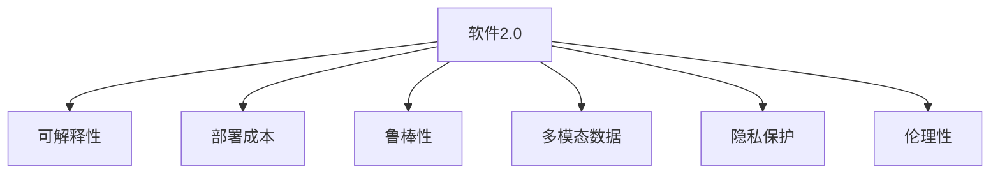

                 

# 软件 2.0 的应用：从实验室走向现实

## 1. 背景介绍

### 1.1 问题由来
随着人工智能(AI)技术的迅猛发展，AI软件正逐渐从实验室走向现实，成为各行各业数字化转型的重要引擎。尤其是在自然语言处理(NLP)、计算机视觉(CV)、机器学习(ML)等领域，AI软件的创新应用为人类社会带来了翻天覆地的变化。然而，当前大多数AI软件仍局限于研究实验阶段，尚未真正大规模部署。

### 1.2 问题核心关键点
AI软件2.0时代，如何从学术研究到实际应用，成为当前技术发展的核心挑战。核心问题包括：
1. 如何提高模型的可解释性，使其更易于理解和接受？
2. 如何降低模型的部署成本，使其更易于部署和维护？
3. 如何优化模型的性能，使其在实际应用中具备更高的准确性和鲁棒性？
4. 如何实现多模态数据的整合，拓展AI软件的应用边界？

这些问题不仅需要从技术层面解决，还需要考虑伦理、安全、隐私等多个因素。本文将系统探讨这些关键问题，并提出相应的解决方案。

## 2. 核心概念与联系

### 2.1 核心概念概述

为更好地理解AI软件2.0的应用，本节将介绍几个密切相关的核心概念：

- 软件2.0：指基于深度学习和大数据技术的自动化、智能化软件，与传统软件相比，软件2.0具有更高的智能水平和自适应能力。
- 可解释性：指AI模型决策过程的可理解性和可解释性，帮助用户理解和信任AI系统。
- 部署成本：指将AI软件从研究实验室部署到生产环境的成本，包括数据准备、模型训练、模型优化等。
- 鲁棒性：指AI模型面对数据噪声、输入扰动、对抗攻击等异常情况的抵抗能力。
- 多模态数据：指结合视觉、听觉、文本等多种数据类型，提升AI系统的感知能力和智能化水平。
- 隐私保护：指在AI模型训练和应用过程中，如何保护用户隐私，避免数据泄露和滥用。
- 伦理性：指AI系统的设计和使用过程中，如何确保符合社会伦理和道德标准，避免负面影响。

这些核心概念之间的逻辑关系可以通过以下Mermaid流程图来展示：



这个流程图展示了大语言模型的核心概念及其之间的关系：

1. 软件2.0是研究的对象，需要考虑可解释性、部署成本、鲁棒性等特性。
2. 可解释性、部署成本、鲁棒性、多模态数据、隐私保护、伦理性等特性，是软件2.0系统设计的关键因素。

这些概念共同构成了AI软件2.0的研究和应用框架，使其能够更好地应对现实世界的复杂场景。

## 3. 核心算法原理 & 具体操作步骤
### 3.1 算法原理概述

AI软件2.0的核心算法原理可以归结为以下几点：

1. 基于深度学习的大规模模型训练：通过大量标注数据，训练深度神经网络模型，使其具备强大的特征提取和推理能力。
2. 迁移学习：将预训练模型在一种任务上的知识迁移到另一种任务上，减少模型训练的时间和成本。
3. 模型压缩和优化：通过参数剪枝、量化、蒸馏等技术，减小模型规模，提升计算效率和推理速度。
4. 多模态数据融合：结合视觉、听觉、文本等多种数据类型，提升AI系统的感知能力和智能化水平。
5. 模型解释和可视化：通过模型蒸馏、可解释AI等技术，生成可视化解释结果，提高模型的可解释性。

这些原理构成了AI软件2.0的技术基础，帮助其在实际应用中实现高性能、低成本和高可靠性。

### 3.2 算法步骤详解

AI软件2.0的开发流程通常包括以下几个关键步骤：

**Step 1: 准备数据和计算资源**
- 收集和预处理数据集，包括图像、文本、语音等多种类型。
- 配置高性能计算资源，如GPU、TPU等，以支持大规模模型训练。

**Step 2: 设计模型架构**
- 选择合适的深度学习框架，如PyTorch、TensorFlow等。
- 设计模型的结构和层级，包括卷积层、池化层、全连接层、激活函数等。

**Step 3: 预训练模型**
- 使用大规模无标签数据集，进行预训练，如ImageNet、COCO等数据集。
- 通过迁移学习或自监督学习任务，学习通用语言或视觉表示。

**Step 4: 微调模型**
- 根据具体任务，使用小规模标注数据集进行微调，优化模型在特定任务上的性能。
- 采用全参数微调或参数高效微调方法，以减少计算成本。

**Step 5: 模型优化**
- 应用模型压缩技术，如参数剪枝、量化、蒸馏等，减小模型规模。
- 采用多模态数据融合技术，提升模型在不同数据类型上的性能。

**Step 6: 模型部署**
- 将模型导出为生产环境可用的格式，如TensorFlow SavedModel、PyTorch Script等。
- 集成到实际应用系统中，实现高性能、高可靠性的部署。

**Step 7: 模型监控与维护**
- 实时监控模型的性能指标，如精度、响应时间等。
- 定期进行模型更新和维护，保证系统的长期稳定运行。

以上是AI软件2.0的典型开发流程，每个步骤都需要精心设计和优化，以确保最终应用的性能和可靠性。

### 3.3 算法优缺点

AI软件2.0具有以下优点：
1. 高性能：大规模深度学习模型具有强大的特征提取和推理能力，能够在多种任务上取得优异性能。
2. 自适应：通过迁移学习，模型可以适应多种数据分布，提升模型的泛化能力和鲁棒性。
3. 低成本：模型压缩和优化技术能够减小模型规模，降低计算和存储成本。
4. 高可靠性：多模态数据融合和模型解释技术提高了系统的可解释性和鲁棒性，提升了用户信任度。

同时，AI软件2.0也存在一些局限性：
1. 数据依赖性强：模型的性能很大程度上依赖于标注数据的数量和质量。
2. 模型复杂度高：深度学习模型的参数量庞大，训练和推理过程复杂。
3. 可解释性不足：复杂模型难以解释，缺乏透明的决策过程。
4. 伦理和安全风险：模型可能会学习到偏见、有害信息等，需要严格控制和监管。

尽管存在这些局限性，但AI软件2.0仍是大数据时代的主要技术方向，其高效、智能、可靠的特性，使其在各种场景下具备广泛的应用前景。

### 3.4 算法应用领域

AI软件2.0已经被广泛应用于多个领域，包括但不限于：

- 自然语言处理(NLP)：包括机器翻译、情感分析、智能问答、文本摘要等任务。
- 计算机视觉(CV)：包括图像分类、目标检测、图像分割、人脸识别等任务。
- 语音识别与处理：包括语音识别、语音合成、情感分析、自动翻译等任务。
- 医疗健康：包括医学影像分析、病历分析、医疗咨询、健康管理等任务。
- 智能制造：包括质量检测、设备维护、供应链管理、智能制造等任务。
- 金融科技：包括风险评估、信用评分、智能投顾、智能合约等任务。
- 智慧城市：包括智能交通、智能安防、城市规划、公共服务等任务。

## 4. 数学模型和公式 & 详细讲解 & 举例说明

### 4.1 数学模型构建

本节将使用数学语言对AI软件2.0的构建过程进行更加严格的刻画。

记AI软件2.0中的深度学习模型为 $M_{\theta}:\mathcal{X} \rightarrow \mathcal{Y}$，其中 $\mathcal{X}$ 为输入空间，$\mathcal{Y}$ 为输出空间，$\theta \in \mathbb{R}^d$ 为模型参数。假设模型的损失函数为 $\ell$，则经验风险为：

$$
\mathcal{L}(\theta) = \frac{1}{N}\sum_{i=1}^N \ell(M_{\theta}(x_i),y_i)
$$

其中 $N$ 为样本数，$x_i$ 和 $y_i$ 分别为输入和标签。训练目标是最小化经验风险：

$$
\theta^* = \mathop{\arg\min}_{\theta} \mathcal{L}(\theta)
$$

### 4.2 公式推导过程

以下我们以图像分类任务为例，推导交叉熵损失函数及其梯度的计算公式。

假设模型 $M_{\theta}$ 在输入 $x$ 上的输出为 $\hat{y}=M_{\theta}(x) \in [0,1]^C$，表示样本属于 $C$ 个类别的概率分布。真实标签 $y \in \{1,2,...,C\}$。则交叉熵损失函数定义为：

$$
\ell(M_{\theta}(x),y) = -\sum_{c=1}^C y_c\log \hat{y}_c
$$

将其代入经验风险公式，得：

$$
\mathcal{L}(\theta) = -\frac{1}{N}\sum_{i=1}^N \sum_{c=1}^C y_{ic}\log \hat{y}_{ic}
$$

根据链式法则，损失函数对参数 $\theta_k$ 的梯度为：

$$
\frac{\partial \mathcal{L}(\theta)}{\partial \theta_k} = -\frac{1}{N}\sum_{i=1}^N \sum_{c=1}^C \frac{y_{ic}}{\hat{y}_{ic}}\frac{\partial \hat{y}_{ic}}{\partial \theta_k}
$$

其中 $\frac{\partial \hat{y}_{ic}}{\partial \theta_k}$ 可进一步递归展开，利用自动微分技术完成计算。

### 4.3 案例分析与讲解

以下是一些典型的AI软件2.0应用场景，以及其数学模型的构建和推导过程：

**图像分类**
- 输入：$x \in \mathbb{R}^{H \times W \times C}$，表示 $H$ 行 $W$ 列的彩色图像。
- 输出：$y \in \{1,2,...,C\}$，表示图像属于 $C$ 个类别中的一个。
- 模型：卷积神经网络(Convolutional Neural Network, CNN)。
- 损失函数：交叉熵损失。
- 模型训练：通过反向传播算法，最小化交叉熵损失，更新模型参数 $\theta$。

**机器翻译**
- 输入：$x \in \mathbb{R}^{N \times D}$，表示源语言文本序列。
- 输出：$y \in \mathbb{R}^{M \times D}$，表示目标语言文本序列。
- 模型：基于Transformer的序列到序列(Sequence-to-Sequence, Seq2Seq)模型。
- 损失函数：交叉熵损失。
- 模型训练：通过反向传播算法，最小化交叉熵损失，更新模型参数 $\theta$。

**情感分析**
- 输入：$x \in \mathbb{R}^{N \times D}$，表示社交媒体文本序列。
- 输出：$y \in \{1,2,3\}$，表示文本情感极性。
- 模型：双向长短时记忆网络(BiLSTM)。
- 损失函数：交叉熵损失。
- 模型训练：通过反向传播算法，最小化交叉熵损失，更新模型参数 $\theta$。

通过上述数学模型的构建和推导，可以看出AI软件2.0在各个应用场景中的共性和差异性，进一步理解其数学原理和优化目标。

## 5. 项目实践：代码实例和详细解释说明

### 5.1 开发环境搭建

在进行AI软件2.0开发前，我们需要准备好开发环境。以下是使用Python进行TensorFlow开发的环境配置流程：

1. 安装Anaconda：从官网下载并安装Anaconda，用于创建独立的Python环境。

2. 创建并激活虚拟环境：
```bash
conda create -n tf-env python=3.8 
conda activate tf-env
```

3. 安装TensorFlow：根据CUDA版本，从官网获取对应的安装命令。例如：
```bash
conda install tensorflow tensorflow-cpu -c conda-forge
```

4. 安装TensorBoard：
```bash
pip install tensorboard
```

5. 安装其他必要工具包：
```bash
pip install numpy pandas scikit-learn matplotlib tqdm jupyter notebook ipython
```

完成上述步骤后，即可在`tf-env`环境中开始AI软件2.0的开发实践。

### 5.2 源代码详细实现

这里我们以图像分类任务为例，给出使用TensorFlow对CNN模型进行训练和微调的PyTorch代码实现。

首先，定义CNN模型的架构：

```python
import tensorflow as tf
from tensorflow.keras import layers

def create_model(input_shape, num_classes):
    model = tf.keras.Sequential([
        layers.Conv2D(32, (3,3), activation='relu', input_shape=input_shape),
        layers.MaxPooling2D((2,2)),
        layers.Conv2D(64, (3,3), activation='relu'),
        layers.MaxPooling2D((2,2)),
        layers.Flatten(),
        layers.Dense(128, activation='relu'),
        layers.Dense(num_classes, activation='softmax')
    ])
    return model
```

然后，准备数据集和标签：

```python
import numpy as np
from tensorflow.keras.preprocessing.image import ImageDataGenerator

train_datagen = ImageDataGenerator(rescale=1./255)
train_generator = train_datagen.flow_from_directory(
    'train_dir', 
    target_size=(150,150),
    batch_size=32,
    class_mode='categorical')

val_datagen = ImageDataGenerator(rescale=1./255)
val_generator = val_datagen.flow_from_directory(
    'val_dir', 
    target_size=(150,150),
    batch_size=32,
    class_mode='categorical')
```

接着，定义训练和评估函数：

```python
def train_model(model, train_generator, val_generator, epochs=50):
    model.compile(optimizer='adam', loss='categorical_crossentropy', metrics=['accuracy'])
    model.fit(train_generator, epochs=epochs, validation_data=val_generator)
    
    val_loss, val_acc = model.evaluate(val_generator)
    print(f'Validation loss: {val_loss:.4f}')
    print(f'Validation accuracy: {val_acc:.4f}')
    
train_model(create_model((150,150,3), 10), train_generator, val_generator)
```

最后，启动训练流程并在验证集上评估：

```python
train_model(create_model((150,150,3), 10), train_generator, val_generator)
```

以上就是使用TensorFlow对CNN模型进行图像分类任务微调的完整代码实现。可以看到，TensorFlow提供了方便的高级API，使得模型训练和微调变得简单高效。

### 5.3 代码解读与分析

让我们再详细解读一下关键代码的实现细节：

**模型定义**：
- `create_model`函数：定义了一个简单的卷积神经网络模型，包含卷积层、池化层、全连接层等组件。
- `input_shape`和`num_classes`参数：输入图像的尺寸和类别数。

**数据加载**：
- `ImageDataGenerator`：用于数据增强和归一化处理，提升模型的泛化能力。
- `flow_from_directory`：将目录中的图像数据加载到模型中，支持指定大小和批量大小。

**模型训练**：
- `compile`方法：设置优化器、损失函数和评估指标。
- `fit`方法：在训练集上进行模型训练，指定迭代轮数和验证集。
- `evaluate`方法：在验证集上评估模型性能，输出损失和准确率。

**训练流程**：
- 定义模型、数据集和训练参数，调用`train_model`函数进行训练。
- 在训练过程中，模型通过反向传播算法更新参数，优化交叉熵损失。
- 在每个epoch结束时，模型在验证集上进行性能评估，避免过拟合。
- 最终输出验证集上的损失和准确率，帮助判断模型性能。

通过上述代码实现，我们可以看到TensorFlow对模型训练和微调的简洁高效支持。TensorFlow不仅提供了易于使用的高级API，还支持模型图可视化、动态图计算等功能，进一步提升开发效率。

## 6. 实际应用场景
### 6.1 智能客服系统

基于AI软件2.0的智能客服系统，可以通过语音识别、自然语言处理和机器翻译等技术，实现全天候、多语言、高准确度的客户服务。系统能够理解用户问题，自动匹配答案模板，生成自然流畅的回复，极大地提升了客服效率和客户满意度。

在技术实现上，可以集成语音识别、文本分析、知识库查询等功能，构建完整的客服对话系统。在用户交互过程中，系统可以实时分析和评估用户情感状态，提供更加个性化的服务。对于复杂的客户问题，系统还可以接入人工客服进行转接，确保问题得到及时解决。

### 6.2 金融舆情监测

AI软件2.0在金融舆情监测中的应用，可以帮助金融机构及时掌握市场动向，预测市场走势，规避金融风险。系统通过情感分析、主题建模等技术，从新闻、评论、社交媒体等数据源中提取关键信息，自动生成舆情报告。

在实际应用中，可以构建基于TensorFlow或PyTorch的金融舆情监测系统，集成多源数据获取、情感分析、主题建模、文本摘要等功能。系统能够实时监控市场舆情变化，提供关键信息预警，辅助投资决策和风险控制。

### 6.3 个性化推荐系统

AI软件2.0的个性化推荐系统，可以结合用户历史行为和实时数据，生成个性化的推荐内容。系统通过协同过滤、深度学习等技术，预测用户对物品的兴趣程度，优化推荐列表。

在技术实现上，可以构建基于TensorFlow或PyTorch的推荐系统，集成用户行为数据、物品信息、情感分析等功能。系统能够实时处理用户输入，生成个性化推荐，提升用户体验和满意度。

### 6.4 未来应用展望

随着AI软件2.0技术的发展，其在各个领域的应用前景将更加广阔。未来，AI软件2.0将具备更强的智能水平和自适应能力，能够更好地应对复杂多变的现实场景。

在智慧医疗领域，AI软件2.0可以辅助医生诊断、提供健康管理建议，提升医疗服务水平。在智能制造领域，AI软件2.0可以实现设备预测性维护、质量检测、供应链优化等功能，推动制造业的数字化转型。在智慧城市治理中，AI软件2.0可以提供智能交通、智能安防、公共服务等应用，提升城市管理的智能化水平。

此外，AI软件2.0还将在更多垂直领域中发挥重要作用，如智能教育、农业、零售等，为各行各业带来深刻的变革。随着技术的不断进步，AI软件2.0必将成为推动社会进步的重要引擎。

## 7. 工具和资源推荐
### 7.1 学习资源推荐

为了帮助开发者系统掌握AI软件2.0的理论基础和实践技巧，这里推荐一些优质的学习资源：

1. 《深度学习》课程：由斯坦福大学开设，涵盖深度学习的基础理论和前沿技术，是入门AI领域的经典课程。
2. 《TensorFlow实战Google深度学习》书籍：详细介绍TensorFlow的使用方法和实战案例，是TensorFlow学习的必读之作。
3. 《Python深度学习》书籍：介绍深度学习算法和模型，涵盖卷积神经网络、循环神经网络、生成对抗网络等经典模型。
4. 《PyTorch深度学习》书籍：介绍PyTorch的使用方法和实战案例，是PyTorch学习的必读之作。
5. Kaggle竞赛平台：提供大量数据集和开源代码，帮助开发者实践深度学习算法，提升实战能力。

通过对这些资源的学习实践，相信你一定能够快速掌握AI软件2.0的精髓，并用于解决实际的AI应用问题。

### 7.2 开发工具推荐

高效的开发离不开优秀的工具支持。以下是几款用于AI软件2.0开发的常用工具：

1. TensorFlow：由Google主导开发的开源深度学习框架，生产部署方便，适合大规模工程应用。
2. PyTorch：由Facebook主导开发的开源深度学习框架，灵活动态，适合研究实验和快速迭代。
3. Keras：高层次的深度学习API，易于上手，适合初学者和快速开发。
4. Jupyter Notebook：交互式Python开发环境，支持实时数据可视化和代码执行，适合研究和开发。
5. Anaconda：Python环境管理工具，支持创建独立的Python环境，方便版本管理和依赖管理。
6. TensorBoard：TensorFlow配套的可视化工具，可实时监测模型训练状态，提供丰富的图表呈现方式。

合理利用这些工具，可以显著提升AI软件2.0的开发效率，加快创新迭代的步伐。

### 7.3 相关论文推荐

AI软件2.0的发展源于学界的持续研究。以下是几篇奠基性的相关论文，推荐阅读：

1. AlexNet: ImageNet Classification with Deep Convolutional Neural Networks：提出卷积神经网络(CNN)，开启计算机视觉领域的深度学习革命。
2. RNNs for Sequence Modeling：提出循环神经网络(RNN)，推动自然语言处理领域的发展。
3. Sequence to Sequence Learning with Neural Networks：提出序列到序列(Seq2Seq)模型，推动机器翻译、对话系统等任务的发展。
4. Attention is All You Need：提出Transformer模型，解决长距离依赖问题，推动自然语言处理和计算机视觉领域的发展。
5. The Illustrated Transformer：详细解释Transformer模型的工作原理和应用，适合深入理解Transformer技术。

这些论文代表了大语言模型微调技术的发展脉络。通过学习这些前沿成果，可以帮助研究者把握学科前进方向，激发更多的创新灵感。

## 8. 总结：未来发展趋势与挑战

### 8.1 总结

本文对AI软件2.0的应用进行全面系统的介绍。首先阐述了AI软件2.0的研究背景和应用意义，明确了其在各个领域的重要价值。其次，从原理到实践，详细讲解了AI软件2.0的数学模型和开发流程，给出了具体的代码实例和解释。同时，本文还广泛探讨了AI软件2.0在智能客服、金融舆情、个性化推荐等实际应用场景中的应用前景，展示了其广泛的应用潜力。此外，本文精选了AI软件2.0的学习资源、开发工具和相关论文，力求为读者提供全方位的技术指引。

通过本文的系统梳理，可以看出AI软件2.0在大数据时代的巨大潜力和应用前景。尽管当前技术仍面临一些挑战，但通过不断的技术创新和应用优化，相信AI软件2.0必将在未来取得更加辉煌的成就。

### 8.2 未来发展趋势

展望未来，AI软件2.0将呈现以下几个发展趋势：

1. 模型规模持续增大。随着算力成本的下降和数据规模的扩张，深度学习模型的参数量还将持续增长。超大规模模型蕴含的丰富知识，有望支撑更加复杂多变的下游任务。
2. 迁移学习变得更加智能。未来的迁移学习将更加灵活，能够自动发现和适应新任务，进一步减少模型训练的时间和成本。
3. 多模态数据融合更加高效。多模态数据融合技术将更加成熟，能够高效处理视觉、听觉、文本等多种数据类型，提升系统的感知能力和智能化水平。
4. 模型解释和可视化更加透明。未来AI软件2.0将具备更强的可解释性，能够生成可视化的解释结果，提高系统的透明性和可信度。
5. 智能交互更加自然。基于生成对抗网络(GAN)等技术的AI软件2.0，将能够生成更加自然流畅的对话和内容，提升用户交互体验。
6. 实时计算更加高效。未来的AI软件2.0将具备更高的计算效率和推理速度，能够实时处理大规模数据，满足实时应用的需求。

以上趋势凸显了AI软件2.0的技术前景，这些方向的探索发展，必将进一步提升AI系统的高性能、高可靠性和高可用性，为各个行业带来更加智能化的应用。

### 8.3 面临的挑战

尽管AI软件2.0在各个领域取得了显著进展，但在迈向大规模应用的过程中，仍面临诸多挑战：

1. 数据依赖性强：模型的性能很大程度上依赖于标注数据的数量和质量。如何获取高质量数据，降低数据依赖，是一个重要问题。
2. 计算成本高：大规模深度学习模型的训练和推理过程需要高性能计算资源，成本较高。如何降低计算成本，提升计算效率，是一个重要课题。
3. 可解释性不足：复杂模型难以解释，缺乏透明的决策过程，需要进一步提升模型的可解释性。
4. 伦理和安全风险：AI系统可能会学习到偏见、有害信息等，需要严格控制和监管，确保伦理和安全。
5. 用户隐私保护：在数据收集和使用过程中，如何保护用户隐私，避免数据泄露和滥用，是一个重要问题。
6. 系统鲁棒性不足：模型面对异常输入和攻击时，容易发生泛化失效和推理错误，需要提升系统的鲁棒性。

正视AI软件2.0面临的这些挑战，积极应对并寻求突破，将是大语言模型微调走向成熟的必由之路。相信随着学界和产业界的共同努力，这些挑战终将一一被克服，AI软件2.0必将在构建智能系统和社会进步中扮演越来越重要的角色。

### 8.4 研究展望

面对AI软件2.0所面临的挑战，未来的研究需要在以下几个方面寻求新的突破：

1. 探索无监督和半监督学习范式：摆脱对大规模标注数据的依赖，利用自监督学习、主动学习等方法，最大化数据利用率。
2. 研究多模态数据融合技术：结合视觉、听觉、文本等多种数据类型，提升AI系统的感知能力和智能化水平，拓展应用边界。
3. 开发智能交互模型：引入生成对抗网络(GAN)等技术，生成更加自然流畅的对话和内容，提升用户交互体验。
4. 提升模型可解释性：通过模型蒸馏、可解释AI等技术，生成可视化解释结果，提高系统的透明性和可信度。
5. 保护用户隐私：采用差分隐私、联邦学习等技术，保护用户数据隐私，避免数据泄露和滥用。
6. 提升系统鲁棒性：引入对抗训练、鲁棒性增强等技术，提升模型的鲁棒性和泛化能力。

这些研究方向的探索，必将引领AI软件2.0技术迈向更高的台阶，为构建安全、可靠、可解释、可控的智能系统铺平道路。面向未来，AI软件2.0技术还需要与其他人工智能技术进行更深入的融合，如知识表示、因果推理、强化学习等，多路径协同发力，共同推动人工智能技术的发展。只有勇于创新、敢于突破，才能不断拓展AI系统的边界，让智能技术更好地造福人类社会。

## 9. 附录：常见问题与解答

**Q1：如何提高AI软件2.0的可解释性？**

A: 提高AI软件2.0的可解释性，可以从以下几个方面入手：
1. 模型蒸馏：通过知识蒸馏技术，将复杂模型压缩为轻量级模型，提高模型的可解释性。
2. 可解释AI：引入可解释性技术，如LIME、SHAP等，生成可视化的解释结果。
3. 特征重要性分析：使用特征重要性分析技术，评估模型对每个输入特征的依赖程度。
4. 可视化工具：利用TensorBoard、SHAP等可视化工具，展示模型的决策过程和特征分布。

**Q2：如何降低AI软件2.0的部署成本？**

A: 降低AI软件2.0的部署成本，可以从以下几个方面入手：
1. 模型压缩：通过参数剪枝、量化、蒸馏等技术，减小模型规模，降低计算和存储成本。
2. 模型优化：采用模型并行、混合精度训练等技术，提升计算效率和内存利用率。
3. 容器化部署：将模型打包为Docker镜像或Kubernetes容器，方便部署和扩展。
4. 边缘计算：将模型部署到边缘设备，减少数据传输和网络延迟，提高系统响应速度。

**Q3：如何提高AI软件2.0的鲁棒性？**

A: 提高AI软件2.0的鲁棒性，可以从以下几个方面入手：
1. 对抗训练：通过对抗样本训练，增强模型对输入扰动的抵抗能力。
2. 鲁棒性增强：引入鲁棒性增强技术，如对抗正则化、鲁棒蒸馏等，提升模型的泛化能力。
3. 异常检测：结合异常检测技术，识别和处理异常输入和攻击，提升系统的稳定性和安全性。
4. 多模态融合：结合视觉、听觉、文本等多种数据类型，提升模型的感知能力和鲁棒性。

**Q4：如何保护AI软件2.0的用户隐私？**

A: 保护AI软件2.0的用户隐私，可以从以下几个方面入手：
1. 差分隐私：采用差分隐私技术，保护用户数据隐私，避免数据泄露和滥用。
2. 联邦学习：采用联邦学习技术，在本地设备上进行模型训练，保护用户数据不离开设备。
3. 数据加密：对用户数据进行加密处理，防止数据泄露和篡改。
4. 数据匿名化：对用户数据进行匿名化处理，避免个人隐私被识别和关联。

**Q5：如何提升AI软件2.0的系统鲁棒性？**

A: 提升AI软件2.0的系统鲁棒性，可以从以下几个方面入手：
1. 模型增强：引入鲁棒性增强技术，如对抗训练、鲁棒蒸馏等，提升模型的鲁棒性和泛化能力。
2. 数据增强：通过数据增强技术，扩充训练集，提高模型的泛化能力。
3. 异常检测：结合异常检测技术，识别和处理异常输入和攻击，提升系统的稳定性和安全性。
4. 多模态融合：结合视觉、听觉、文本等多种数据类型，提升模型的感知能力和鲁棒性。

通过这些措施，可以进一步提升AI软件2.0的系统鲁棒性和可靠性，确保其在实际应用中的稳定性和安全性。

---

作者：禅与计算机程序设计艺术 / Zen and the Art of Computer Programming

