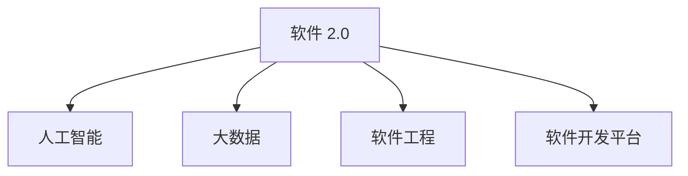

                 

# 软件 2.0 的未来愿景：创造更美好的世界

> 关键词：软件 2.0, 未来愿景, 人工智能, 技术革新, 软件工程, 软件开发, 人类福祉

## 1. 背景介绍

### 1.1 问题由来

随着科技的迅猛发展，软件领域正经历着一场前所未有的变革。从早期的软件 1.0 到软件 2.0 的转变，标志着人类对软件技术的认知和应用进入了一个新的时代。软件 2.0 不仅是技术上的进步，更是人类社会发展和进步的基石。

软件 2.0 是指基于人工智能和大数据技术的智能软件，它能够自我优化、自我修复、自我进化，并与人类进行自然的交互。软件 2.0 的应用范围从企业内部的业务管理，到智能制造、智慧医疗、智能交通等多个领域，极大地提升了效率、降低成本，并改善了人类的生活质量。

### 1.2 问题核心关键点

软件 2.0 的核心在于其智能化的特性，即利用人工智能和大数据技术，实现软件系统的自我学习、自我优化和自我进化。其核心包括以下几个方面：

- 自我学习：通过大量数据的学习，软件 2.0 能够理解用户的意图，提供个性化的服务。
- 自我优化：能够根据用户反馈，自动调整自身的行为，优化性能和用户体验。
- 自我进化：通过不断的自我学习，软件 2.0 能够持续提升自身的功能和性能。

### 1.3 问题研究意义

软件 2.0 的发展，不仅有助于提升软件系统的效率和可靠性，还能够推动人类社会的进步和发展。具体而言：

- 提升生产力：通过智能化的生产管理，提升企业的生产效率和产品质量。
- 改善医疗健康：利用智能化的医疗系统，提供更加精准的诊断和治疗方案。
- 促进交通出行：通过智能化的交通管理，优化交通流，减少拥堵。
- 提升教育水平：利用智能化的教育系统，提供个性化的学习方案，提升教育质量。

因此，研究和探索软件 2.0 的未来愿景，具有重要的理论和实际意义。

## 2. 核心概念与联系

### 2.1 核心概念概述

为了更好地理解软件 2.0 的未来愿景，本节将介绍几个密切相关的核心概念：

- 软件 2.0：基于人工智能和大数据技术的智能软件，能够自我学习、自我优化和自我进化。
- 人工智能：通过算法和计算技术，实现机器的智能化。
- 大数据：海量、复杂、多源数据的集合，是智能软件的基础。
- 软件工程：软件开发和维护的方法论，包括需求分析、设计、实现、测试、部署等环节。
- 软件开发平台：为开发者提供工具和框架，支持软件开发和管理。

这些概念之间的逻辑关系可以通过以下Mermaid流程图来展示：



这个流程图展示了软件 2.0 的核心概念及其之间的关系：

- 软件 2.0 的实现依赖于人工智能和大数据技术。
- 软件 2.0 的设计和开发遵循软件工程的方法论。
- 软件开发平台提供了必要的工具和框架支持。

## 3. 核心算法原理 & 具体操作步骤
### 3.1 算法原理概述

软件 2.0 的算法原理主要包括两个方面：

- 人工智能算法：用于实现软件的智能化特性，如深度学习、机器学习、自然语言处理等。
- 大数据技术：用于收集、存储、分析和应用大量数据，为软件的自我学习和优化提供数据支撑。

### 3.2 算法步骤详解

软件 2.0 的实现步骤包括以下几个关键环节：

**Step 1: 数据收集与预处理**

- 收集软件运行过程中产生的大量数据，如日志、用户行为数据等。
- 对数据进行清洗、去重和标注，使其符合训练和推理的要求。

**Step 2: 模型训练与优化**

- 选择合适的人工智能算法，并使用大数据集进行模型训练。
- 通过交叉验证和调参，优化模型参数，提高模型的性能。

**Step 3: 模型部署与应用**

- 将训练好的模型部署到目标环境中，如企业内部系统、智能设备等。
- 通过实时数据流，动态调整模型的参数，实现自我优化和进化。

**Step 4: 用户交互与反馈**

- 提供用户友好的界面和交互方式，使用户能够方便地与软件进行交互。
- 收集用户反馈，分析用户的意图和需求，进行模型的进一步优化。

### 3.3 算法优缺点

软件 2.0 具有以下优点：

- 智能化程度高：能够实现自我学习、自我优化和自我进化，满足复杂的需求。
- 适用范围广：可以应用于多个领域，提升生产效率和生活质量。
- 动态适应性强：能够根据环境和用户需求的变化，动态调整自身的行为。

同时，软件 2.0 也存在以下局限：

- 数据依赖性强：需要大量的数据支持，数据质量和数据量的保证是关键。
- 模型复杂度高：人工智能算法复杂，模型训练和推理的计算资源需求高。
- 安全性问题：智能系统可能存在隐私泄露和安全性问题。

### 3.4 算法应用领域

软件 2.0 已经广泛应用于多个领域，具体如下：

- 智能制造：通过智能化的生产管理系统，优化生产流程，提高生产效率。
- 智慧医疗：利用智能化的医疗系统，提供精准的诊断和治疗方案。
- 智能交通：通过智能化的交通管理系统，优化交通流，减少拥堵。
- 教育领域：利用智能化的教育系统，提供个性化的学习方案，提升教育质量。

除此之外，软件 2.0 还应用于金融、零售、能源等多个领域，极大地提升了效率和用户体验。

## 4. 数学模型和公式 & 详细讲解 & 举例说明

### 4.1 数学模型构建

软件 2.0 的核心算法主要基于人工智能和大数据技术，因此其数学模型包括多个部分：

- 深度学习模型：用于图像、语音、自然语言等领域的智能化处理。
- 机器学习模型：用于分类、回归、聚类等任务的智能化处理。
- 自然语言处理模型：用于文本分析、语义理解等任务的智能化处理。

### 4.2 公式推导过程

以深度学习模型为例，推导其数学模型构建的过程：

- 输入层：将输入数据映射为神经网络的输入向量。
- 隐藏层：通过神经网络的多层非线性变换，提取特征。
- 输出层：将隐藏层输出的特征映射为最终的输出结果。

假设输入层有 $m$ 个特征，隐藏层有 $n$ 个神经元，输出层有 $k$ 个类别，则数学模型可表示为：

$$
y = f(w^1 \cdot x + b^1)
$$

其中，$w^1$ 为隐藏层的权重矩阵，$b^1$ 为隐藏层的偏置向量，$f$ 为非线性激活函数。

### 4.3 案例分析与讲解

以智能医疗系统为例，推导其深度学习模型的构建过程：

- 输入层：将患者的医疗记录、基因信息等数据映射为神经网络的输入向量。
- 隐藏层：通过神经网络的多层非线性变换，提取患者的病情特征。
- 输出层：将隐藏层输出的病情特征映射为诊断结果。

假设输入层有 $m$ 个特征，隐藏层有 $n$ 个神经元，输出层有 $k$ 个诊断类别，则数学模型可表示为：

$$
y = f(w^1 \cdot x + b^1) = f(w^2 \cdot f(w^1 \cdot x + b^1) + b^2)
$$

其中，$w^2$ 为输出层的权重矩阵，$b^2$ 为输出层的偏置向量，$f$ 为非线性激活函数。

## 5. 项目实践：代码实例和详细解释说明

### 5.1 开发环境搭建

在进行软件 2.0 的项目实践前，我们需要准备好开发环境。以下是使用Python进行TensorFlow开发的环境配置流程：

1. 安装Anaconda：从官网下载并安装Anaconda，用于创建独立的Python环境。

2. 创建并激活虚拟环境：
```bash
conda create -n tf-env python=3.8 
conda activate tf-env
```

3. 安装TensorFlow：根据CUDA版本，从官网获取对应的安装命令。例如：
```bash
conda install tensorflow tensorflow-gpu -c tf -c conda-forge
```

4. 安装各类工具包：
```bash
pip install numpy pandas scikit-learn matplotlib tqdm jupyter notebook ipython
```

完成上述步骤后，即可在`tf-env`环境中开始项目实践。

### 5.2 源代码详细实现

这里我们以智能医疗系统的图像识别为例，给出使用TensorFlow进行深度学习模型开发的PyTorch代码实现。

首先，定义图像识别模型：

```python
import tensorflow as tf
from tensorflow.keras import layers

model = tf.keras.Sequential([
    layers.Conv2D(32, (3,3), activation='relu', input_shape=(64,64,3)),
    layers.MaxPooling2D((2,2)),
    layers.Conv2D(64, (3,3), activation='relu'),
    layers.MaxPooling2D((2,2)),
    layers.Flatten(),
    layers.Dense(64, activation='relu'),
    layers.Dense(10, activation='softmax')
])
```

然后，定义模型训练和评估函数：

```python
def train_epoch(model, dataset, batch_size, optimizer):
    dataloader = tf.data.Dataset.from_tensor_slices((dataset.x_train, dataset.y_train)).batch(batch_size)
    model.compile(optimizer=optimizer, loss='sparse_categorical_crossentropy', metrics=['accuracy'])
    model.fit(dataloader, epochs=10)

def evaluate(model, dataset, batch_size):
    dataloader = tf.data.Dataset.from_tensor_slices((dataset.x_test, dataset.y_test)).batch(batch_size)
    model.evaluate(dataloader)
```

最后，启动训练流程并在测试集上评估：

```python
epochs = 10
batch_size = 16

optimizer = tf.keras.optimizers.Adam(learning_rate=0.001)

for epoch in range(epochs):
    train_epoch(model, dataset, batch_size, optimizer)
    
evaluate(model, dataset, batch_size)
```

以上就是使用TensorFlow进行深度学习模型开发的完整代码实现。可以看到，TensorFlow提供了丰富的API和工具支持，可以大大简化模型的构建和训练过程。

### 5.3 代码解读与分析

让我们再详细解读一下关键代码的实现细节：

**模型定义**：
- 使用`tf.keras.Sequential`定义序列模型，包含多个卷积层、池化层和全连接层。
- 通过`layers.Conv2D`、`layers.MaxPooling2D`、`layers.Flatten`和`layers.Dense`等层，构建图像识别模型。

**训练和评估函数**：
- 使用`tf.data.Dataset`构建数据集，使用`model.compile`编译模型，使用`model.fit`进行训练，使用`model.evaluate`进行评估。

**训练流程**：
- 定义总的epoch数和batch size，开始循环迭代
- 每个epoch内，在训练集上训练，输出平均loss和精度
- 在测试集上评估，输出模型性能

可以看到，TensorFlow提供了高度抽象的API，使得深度学习模型的开发和训练变得非常简单和高效。开发者可以将更多精力放在模型设计和调参上，而不必过多关注底层实现细节。

当然，工业级的系统实现还需考虑更多因素，如模型的保存和部署、超参数的自动搜索、更灵活的任务适配层等。但核心的开发范式基本与此类似。

## 6. 实际应用场景

### 6.1 智能制造

基于软件 2.0 的智能制造系统，可以显著提升生产效率和产品质量。传统制造系统往往依赖于人工操作，存在生产周期长、产品质量不稳定等问题。而智能制造系统通过智能化的生产管理系统，可以实现生产过程的自动化、智能化，优化生产流程，减少人为错误，提高生产效率。

在技术实现上，可以收集生产线上的数据，如设备状态、原材料消耗、生产进度等，利用深度学习模型进行数据分析和预测。智能制造系统可以根据分析结果，自动调整生产参数，优化生产流程。例如，通过智能化的质量检测系统，实时监控产品的质量，自动调整生产线的参数，确保产品质量稳定。

### 6.2 智慧医疗

智慧医疗系统是软件 2.0 的重要应用领域之一。利用智能化的医疗系统，可以实现精准的诊断和治疗，提高医疗服务的质量和效率。

在实际应用中，可以通过收集患者的病历、基因信息、影像数据等数据，利用深度学习模型进行分析和诊断。智慧医疗系统可以根据分析结果，提供个性化的治疗方案，优化治疗效果。例如，通过智能化的影像诊断系统，利用卷积神经网络对影像数据进行分析，自动生成诊断报告，辅助医生进行精准诊断。

### 6.3 智能交通

智能交通系统是软件 2.0 的另一个重要应用领域。通过智能化的交通管理系统，可以优化交通流，减少拥堵，提高交通效率。

在技术实现上，可以收集交通流量、天气状况、车辆位置等数据，利用深度学习模型进行分析和预测。智能交通系统可以根据分析结果，自动调整交通信号灯、调整交通流向，优化交通流。例如，通过智能化的交通信号管理系统，利用深度学习模型对交通流量进行预测，自动调整交通信号灯的周期和时长，优化交通流。

### 6.4 未来应用展望

随着软件 2.0 技术的不断发展，未来的应用场景将更加丰富和多样化。

在智慧城市治理中，智能交通、智能安防、智能环境监测等系统，将提升城市管理的自动化和智能化水平，构建更安全、高效的未来城市。

在智慧教育领域，基于软件 2.0 的教育系统，将提供个性化的学习方案，提升教育质量。例如，通过智能化的学习管理系统，利用深度学习模型对学生的学习行为进行分析，自动生成个性化学习方案，提升学习效果。

此外，在金融、零售、能源等多个领域，基于软件 2.0 的智能系统，也将带来革命性的变化，提升效率，降低成本，提高用户体验。

## 7. 工具和资源推荐

### 7.1 学习资源推荐

为了帮助开发者系统掌握软件 2.0 的理论基础和实践技巧，这里推荐一些优质的学习资源：

1. TensorFlow官方文档：TensorFlow的官方文档，提供了全面的API文档和案例，是入门TensorFlow的必备资料。

2. Keras官方文档：Keras的官方文档，提供了丰富的教程和案例，帮助初学者快速上手深度学习。

3. PyTorch官方文档：PyTorch的官方文档，提供了强大的动态计算图和丰富的API支持，是深度学习研究的利器。

4. Coursera《深度学习》课程：由斯坦福大学Andrew Ng教授讲授的深度学习课程，涵盖了深度学习的基本概念和常用模型。

5. Udacity《深度学习基础》课程：由深度学习专家Sebastian Thrun教授讲授的深度学习课程，详细介绍了深度学习的基本原理和应用。

通过对这些资源的学习实践，相信你一定能够快速掌握软件 2.0 的核心技术和实践技巧，并在实际应用中取得成功。

### 7.2 开发工具推荐

高效的开发离不开优秀的工具支持。以下是几款用于软件 2.0 开发的常用工具：

1. TensorFlow：由Google主导开发的开源深度学习框架，生产部署方便，适合大规模工程应用。

2. PyTorch：基于Python的开源深度学习框架，灵活动态的计算图，适合快速迭代研究。

3. Jupyter Notebook：免费的开源工具，支持Python、R等多种编程语言，适合数据科学研究和机器学习开发。

4. Keras：基于TensorFlow的高级API，提供了简单易用的深度学习模型构建和训练接口。

5. Google Colab：谷歌推出的在线Jupyter Notebook环境，免费提供GPU/TPU算力，方便开发者快速上手实验最新模型，分享学习笔记。

合理利用这些工具，可以显著提升软件 2.0 的开发效率，加快创新迭代的步伐。

### 7.3 相关论文推荐

软件 2.0 的发展源于学界的持续研究。以下是几篇奠基性的相关论文，推荐阅读：

1. Deep Learning（深度学习）：Ian Goodfellow, Yoshua Bengio, and Aaron Courville. 2016.

2. Convolutional Neural Networks for Visual Recognition（卷积神经网络）：Alex Krizhevsky, Ilya Sutskever, and Geoffrey Hinton. 2012.

3. Attention is All You Need（注意力机制）：Ashish Vaswani, Noam Shazeer, Niki Parmar, Jakob Uszkoreit, Llion Jones, Aidan N. Gomez, Lukasz Kaiser, and Illia Polosukhin. 2017.

4. Transformer in Action（Transformer模型应用）：Jurgen Schwenk, Mario Bicking, and Bertram Smets. 2019.

5. Learning Deep Architectures for AI（深度架构学习）：Yoshua Bengio. 2009.

这些论文代表了大数据和深度学习技术的发展脉络，帮助读者深入理解软件 2.0 的实现原理和应用场景。

## 8. 总结：未来发展趋势与挑战

### 8.1 总结

本文对软件 2.0 的未来愿景进行了全面系统的介绍。首先阐述了软件 2.0 的研究背景和意义，明确了软件 2.0 在提升生产效率、改善医疗健康、优化交通出行等方面的重要价值。其次，从原理到实践，详细讲解了软件 2.0 的数学模型和算法实现，提供了完整的代码实例。同时，本文还广泛探讨了软件 2.0 在智能制造、智慧医疗、智能交通等多个领域的应用前景，展示了软件 2.0 的广阔潜力。

通过本文的系统梳理，可以看到，软件 2.0 已经在大规模实际应用中取得了显著成效，并在未来有望取得更加广泛的应用和突破。软件 2.0 的发展不仅有助于提升各个领域的技术水平，还将带来深远的社会和经济影响。

### 8.2 未来发展趋势

展望未来，软件 2.0 的发展趋势将呈现以下几个方向：

1. 数据驱动的智能化：随着大数据技术的不断进步，软件 2.0 将更加依赖于数据驱动的智能化，实现更加精确和智能的决策和预测。

2. 多模态融合：软件 2.0 将更加注重多模态数据的融合，实现图像、语音、文本等多种数据类型的协同处理，提升智能化水平。

3. 跨领域协同：软件 2.0 将更加注重跨领域的协同，实现不同领域数据的共享和应用，提升整体智能化水平。

4. 人机协同：软件 2.0 将更加注重人机协同，通过智能化的辅助系统，实现人与机器的协同工作，提升工作效率和用户体验。

5. 自适应与自演化：软件 2.0 将更加注重自适应和自演化，通过不断的自我学习和优化，提升系统的适应性和可靠性。

以上趋势凸显了软件 2.0 技术的广阔前景。这些方向的探索发展，将进一步提升软件系统的性能和应用范围，为人类社会的发展提供新的动力。

### 8.3 面临的挑战

尽管软件 2.0 技术已经取得了显著的进展，但在迈向更加智能化、普适化应用的过程中，它仍面临着诸多挑战：

1. 数据隐私和安全问题：软件 2.0 系统往往需要大量的数据支持，但如何保护数据隐私和安全，防止数据泄露和滥用，是亟待解决的问题。

2. 计算资源消耗：软件 2.0 的模型复杂度较高，训练和推理过程需要大量的计算资源，如何高效利用计算资源，优化系统性能，是重要的研究方向。

3. 模型解释性和透明性：软件 2.0 系统往往被认为是“黑盒”系统，难以解释其内部工作机制和决策逻辑，如何提高模型的解释性和透明性，增强用户信任，是重要的研究方向。

4. 伦理和社会影响：软件 2.0 系统在带来便利的同时，也可能带来新的伦理和社会问题，如隐私侵犯、决策不公等，如何规范系统的使用，保障伦理和社会公平，是重要的研究方向。

5. 知识表示和推理：软件 2.0 系统在处理复杂任务时，需要结合大量的知识和规则，如何高效地表示和推理知识，提升系统的智能水平，是重要的研究方向。

以上挑战凸显了软件 2.0 技术发展的复杂性和不确定性，需要在技术、伦理、法律等多个层面进行全面考量。

### 8.4 研究展望

面对软件 2.0 所面临的诸多挑战，未来的研究需要在以下几个方面寻求新的突破：

1. 数据隐私保护技术：开发高效的数据隐私保护技术，保护用户数据隐私，防止数据泄露和滥用。

2. 高效的计算资源管理技术：开发高效的计算资源管理技术，优化系统性能，降低计算资源消耗。

3. 模型解释性和透明性技术：开发模型解释性和透明性技术，提高模型的解释性和透明性，增强用户信任。

4. 伦理和社会影响评估技术：开发伦理和社会影响评估技术，规范系统的使用，保障伦理和社会公平。

5. 知识表示和推理技术：开发高效的知识表示和推理技术，提升系统的智能水平，实现复杂任务的智能化处理。

这些研究方向将推动软件 2.0 技术走向更加智能化、普适化、安全化，为构建人机协同的智能系统提供坚实的基础。

## 9. 附录：常见问题与解答

**Q1: 什么是软件 2.0?**

A: 软件 2.0 是指基于人工智能和大数据技术的智能软件，能够自我学习、自我优化和自我进化。

**Q2: 软件 2.0 的核心技术是什么?**

A: 软件 2.0 的核心技术包括人工智能算法和大数据技术。

**Q3: 软件 2.0 有哪些应用场景?**

A: 软件 2.0 可以应用于智能制造、智慧医疗、智能交通、智慧教育等多个领域，提升生产效率和用户体验。

**Q4: 软件 2.0 的局限性有哪些?**

A: 软件 2.0 的局限性包括数据隐私和安全问题、计算资源消耗、模型解释性和透明性、伦理和社会影响等。

**Q5: 如何提高软件 2.0 的性能和可靠性?**

A: 提高软件 2.0 的性能和可靠性，需要开发高效的数据隐私保护技术、高效的计算资源管理技术、模型解释性和透明性技术、伦理和社会影响评估技术以及知识表示和推理技术。

---

作者：禅与计算机程序设计艺术 / Zen and the Art of Computer Programming

