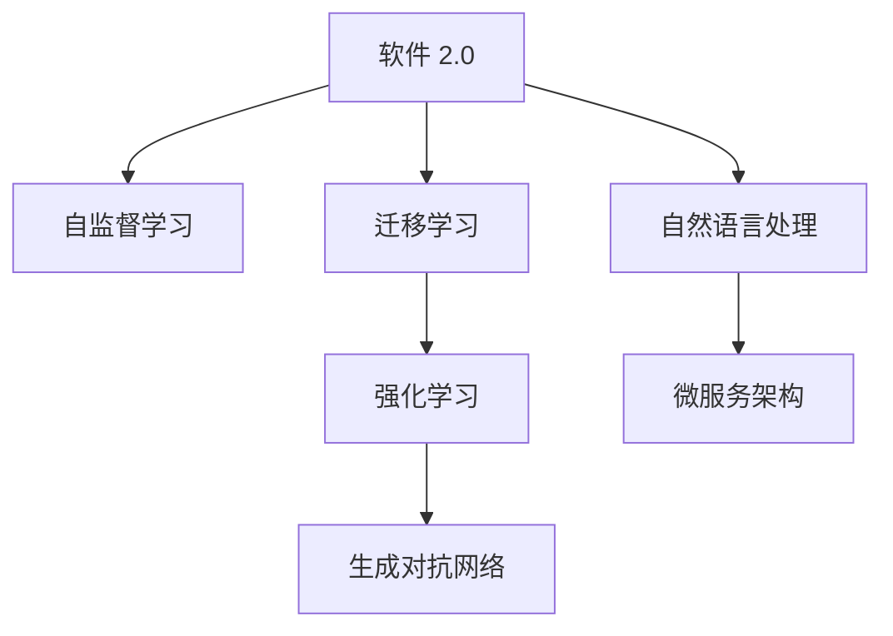

                 

# 软件 2.0 的未来愿景：创造更美好的世界

## 1. 背景介绍

### 1.1 问题的由来

随着人工智能技术的飞速发展，软件已经从一个辅助工具变成了变革世界的关键力量。如今的软件不再只是遵循既定的规则和算法，而是能根据用户需求动态生成和优化算法，具备更强的自适应和创造力。软件 2.0 时代的到来，为我们带来了前所未有的机遇和挑战。

### 1.2 问题的核心关键点

软件 2.0 时代的关键在于其自适应和学习能力。通过大规模数据训练和自监督学习，软件能够自动发现规律、优化算法，甚至可以自主生成新的算法。这种能力不仅极大地提升了软件开发和运行效率，还拓展了软件的边界，使之能应用于更多复杂场景。

同时，软件 2.0 也面临诸多挑战，包括如何平衡软件自适应与用户需求、如何确保软件的可靠性与安全性、如何处理大规模数据与计算资源等问题。解决这些问题，将使软件 2.0 真正落地应用，带来革命性的变革。

## 2. 核心概念与联系

### 2.1 核心概念概述

为更好地理解软件 2.0 的未来愿景，本节将介绍几个核心概念：

- **软件 2.0**：指具备自主生成、优化算法能力，能动态适应用户需求的软件系统。与传统的以开发者为主导的软件开发不同，软件 2.0 强调数据驱动、算法优化，使软件具备更强的自适应和学习能力。

- **自监督学习**：指通过大规模未标注数据训练模型，使其能够自动发现数据中的规律和模式，无需人工标注，即可进行有效的学习和优化。

- **迁移学习**：指将在一个领域学到的知识迁移到另一个领域的学习范式。软件 2.0 能够自动从已有任务中学习知识，并将其应用到新任务中。

- **强化学习**：通过与环境的互动，模型不断试错并优化策略，逐步适应环境变化。软件 2.0 可以通过强化学习不断优化算法，提升系统性能。

- **生成对抗网络**：一种通过对抗训练生成真实数据的模型，用于生成高质量的代码和数据，提升软件系统可靠性。

- **自然语言处理**：利用自然语言理解、生成等技术，使软件系统能更好地理解和响应自然语言指令，实现人机交互。

- **微服务架构**：一种松耦合、可扩展的软件架构，每个服务独立部署、按需扩展，适合软件 2.0 的灵活部署和持续集成。

这些概念之间的逻辑关系可以通过以下Mermaid流程图来展示：



这个流程图展示了我和大语言模型的核心概念及其之间的关系：

1. 软件 2.0 通过自监督学习获得基础能力。
2. 迁移学习使软件 2.0 具备跨领域知识迁移能力。
3. 强化学习使软件 2.0 能够不断优化算法和策略。
4. 生成对抗网络使软件 2.0 具备高质量数据生成能力。
5. 自然语言处理使软件 2.0 具备自然语言理解和生成的能力。
6. 微服务架构使软件 2.0 具备松耦合、可扩展的部署能力。

这些概念共同构成了软件 2.0 的学习和应用框架，使其能够动态适应环境变化，实现更强大的功能和表现。

## 3. 核心算法原理 & 具体操作步骤
### 3.1 算法原理概述

软件 2.0 的核心算法原理主要基于深度学习和大规模数据训练。其核心思想是通过自监督学习、迁移学习和强化学习，使软件系统具备动态生成和优化算法的能力。

具体而言，软件 2.0 系统通常由以下几个部分组成：
- 自监督学习模型：通过大规模未标注数据训练，学习通用的数据表示和规律。
- 迁移学习模块：将自监督学习模型学到的知识迁移到新任务上，进行微调优化。
- 强化学习算法：通过与环境的交互，不断试错并优化策略，提升系统性能。
- 自然语言处理模块：使软件系统能理解和生成自然语言，实现人机交互。
- 微服务架构：将系统拆分为多个独立的服务，按需扩展和部署。

这些部分协同工作，使软件 2.0 能够动态适应用户需求，优化算法，提升系统性能。

### 3.2 算法步骤详解

软件 2.0 的开发和部署通常包括以下几个关键步骤：

**Step 1: 准备数据集和环境**
- 收集大规模未标注数据，作为自监督学习模型的训练集。
- 搭建计算集群，提供足够的算力和存储空间。
- 设计合适的微服务架构，划分服务边界。

**Step 2: 训练自监督学习模型**
- 使用自监督学习算法训练模型，如掩码语言模型、生成对抗网络等。
- 通过对抗训练和数据增强，提高模型的泛化能力和鲁棒性。
- 在自监督学习过程中，记录模型的中间表示和隐含知识。

**Step 3: 迁移学习微调**
- 选择目标任务，提取自监督学习模型的中间表示，进行微调优化。
- 设计合适的损失函数和优化算法，调整模型参数。
- 在验证集上评估模型性能，防止过拟合。

**Step 4: 强化学习优化**
- 设计合适的强化学习算法，如Q-learning、策略梯度等。
- 构建环境模拟器，模拟用户需求和系统行为。
- 通过反复试错，不断优化算法策略，提升系统性能。

**Step 5: 自然语言处理集成**
- 使用自然语言处理技术，实现对用户指令的语义理解。
- 设计合适的回应策略，生成自然流畅的回复。
- 在对话过程中，动态调整回复策略，提升用户体验。

**Step 6: 微服务部署**
- 将系统拆分为多个独立的服务，按需扩展和部署。
- 使用容器化技术，确保服务的稳定性和可移植性。
- 设计合适的监控和告警机制，确保服务可靠性。

以上是软件 2.0 的一般流程。在实际应用中，还需要针对具体任务进行优化设计，如改进训练目标函数，引入更多的正则化技术，搜索最优的超参数组合等，以进一步提升系统性能。

### 3.3 算法优缺点

软件 2.0 的算法具有以下优点：
1. 动态生成能力：软件 2.0 能够动态生成和优化算法，适应复杂的用户需求和环境变化。
2. 高效率：通过大规模数据训练和自动优化，软件 2.0 能够快速迭代优化，缩短开发周期。
3. 灵活性：微服务架构和自然语言处理技术使软件 2.0 具备更强的灵活性和扩展性。

同时，该算法也存在一定的局限性：
1. 数据依赖：软件 2.0 的训练和优化高度依赖于数据质量和数量，数据获取成本较高。
2. 模型复杂度：大规模数据训练和复杂算法优化，对计算资源和存储空间要求较高。
3. 算法稳定性：软件 2.0 的动态生成算法可能存在不稳定性和偏差。
4. 模型可解释性：软件 2.0 的动态生成过程难以解释，可能缺乏可解释性。

尽管存在这些局限性，但就目前而言，软件 2.0 仍是大规模复杂系统优化的重要范式。未来相关研究的重点在于如何进一步降低对数据的依赖，提高模型的稳定性和可解释性，同时兼顾灵活性和高效性等因素。

### 3.4 算法应用领域

软件 2.0 的算法已经在多个领域得到了广泛应用，包括但不限于：

- **自动驾驶**：通过强化学习训练，自动生成驾驶策略，提升车辆智能化水平。
- **金融风险管理**：通过自监督学习训练模型，自动生成风险评估算法，提升金融决策的准确性。
- **推荐系统**：通过自然语言处理技术，实现用户需求的理解和个性化推荐。
- **医疗诊断**：通过强化学习训练，自动生成诊断策略，提升医疗诊断的准确性和效率。
- **智能客服**：通过自然语言处理和生成技术，实现与用户的自然对话，提升客户体验。
- **智慧城市**：通过自监督学习训练模型，优化城市交通、能源等系统的运行。

除了这些经典领域外，软件 2.0 还将被创新性地应用到更多场景中，如智能制造、智慧农业、灾害预测等，为各行各业带来革命性的变革。

## 4. 数学模型和公式 & 详细讲解  
### 4.1 数学模型构建

在软件 2.0 的开发过程中，数学模型和公式扮演了至关重要的角色。

记软件 2.0 的系统为 $S$，由多个组件 $C_1, C_2, ..., C_n$ 构成，每个组件的功能和交互关系可以用数学语言描述如下：

- 自监督学习模型：
  $$
  C_1 = \{(x_i, y_i)\}_{i=1}^N
  $$

- 迁移学习模块：
  $$
  C_2 = \{(x_i', y_i')\}_{i=1}^{N'}
  $$

- 强化学习算法：
  $$
  C_3 = \{(s_t, a_t, r_{t+1}, s_{t+1})\}_{t=1}^T
  $$

- 自然语言处理模块：
  $$
  C_4 = \{\text{input}_i, \text{output}_i\}_{i=1}^M
  $$

- 微服务架构：
  $$
  C_5 = \{S_i, \text{in}_i, \text{out}_i\}_{i=1}^n
  $$

其中，$x$ 表示输入数据，$y$ 表示标签或输出，$s$ 表示状态，$a$ 表示动作，$r$ 表示奖励，$i$ 表示组件编号，$T$ 表示时间步数，$M$ 表示输入输出对数量，$S_i$ 表示第 $i$ 个服务，$\text{in}_i$ 表示输入接口，$\text{out}_i$ 表示输出接口。

### 4.2 公式推导过程

以下我们以自动驾驶场景为例，推导强化学习模型的训练过程。

假设自动驾驶系统由传感器、决策引擎、控制器三个部分组成，系统状态 $s_t$ 包含位置、速度、周围环境等信息。动作 $a_t$ 可以是转向、加速、制动等。奖励 $r_{t+1}$ 可以是安全行驶、避障、达到目标等。状态 $s_{t+1}$ 是下一个时间步的系统状态。

强化学习模型的训练过程如下：
1. 使用状态 $s_t$ 和动作 $a_t$ 生成状态 $s_{t+1}$ 和奖励 $r_{t+1}$，作为训练样本。
2. 使用 Q-learning 或策略梯度等算法，优化决策引擎的参数 $\theta$。
3. 在测试集上评估模型性能，如平均速度、安全行驶距离等。

以 Q-learning 算法为例，训练目标函数为：
$$
\min_{\theta} J(\theta) = \mathbb{E}_{s_t, a_t} [\sum_{t=0}^{\infty} \gamma^t \max_{a} (Q_{\theta}(s_t, a) - Q_{\theta}(s_t, \pi_{\theta}(s_t)))
$$

其中，$Q_{\theta}$ 表示决策引擎的输出值，$\pi_{\theta}$ 表示策略，$\gamma$ 表示折现因子。

在得到训练目标函数后，即可带入参数更新公式，完成模型的迭代优化。重复上述过程直至收敛，最终得到适应自动驾驶任务的最优模型参数 $\theta^*$。

## 5. 项目实践：代码实例和详细解释说明
### 5.1 开发环境搭建

在进行软件 2.0 的开发前，我们需要准备好开发环境。以下是使用Python进行PyTorch开发的环境配置流程：

1. 安装Anaconda：从官网下载并安装Anaconda，用于创建独立的Python环境。

2. 创建并激活虚拟环境：
```bash
conda create -n pytorch-env python=3.8 
conda activate pytorch-env
```

3. 安装PyTorch：根据CUDA版本，从官网获取对应的安装命令。例如：
```bash
conda install pytorch torchvision torchaudio cudatoolkit=11.1 -c pytorch -c conda-forge
```

4. 安装TensorFlow：
```bash
pip install tensorflow
```

5. 安装TensorBoard：
```bash
pip install tensorboard
```

6. 安装Keras：
```bash
pip install keras
```

完成上述步骤后，即可在`pytorch-env`环境中开始软件 2.0 的开发。

### 5.2 源代码详细实现

下面我们以自动驾驶场景为例，给出使用PyTorch和TensorFlow对强化学习模型进行训练的代码实现。

首先，定义状态、动作和奖励：

```python
import numpy as np
import tensorflow as tf
from tensorflow.keras.models import Sequential
from tensorflow.keras.layers import Dense
from tensorflow.keras.optimizers import Adam

class Environment:
    def __init__(self):
        self.position = np.array([0.0, 0.0, 0.0])
        self.speed = np.array([0.0, 0.0, 0.0])
        self.state = self.position + self.speed
        self.evaluation = 0.0

    def reset(self):
        self.position = np.array([0.0, 0.0, 0.0])
        self.speed = np.array([0.0, 0.0, 0.0])
        self.state = self.position + self.speed
        self.evaluation = 0.0

    def step(self, action):
        if action == 0:
            self.speed = np.array([0.0, 1.0, 0.0])
        elif action == 1:
            self.speed = np.array([0.0, 0.0, 0.0])
        elif action == 2:
            self.speed = np.array([-1.0, 0.0, 0.0])
        self.position += self.speed
        self.state = self.position + self.speed
        self.evaluation = np.linalg.norm(self.position) + np.linalg.norm(self.speed)
        return self.state, self.evaluation, True

# 定义Q-learning模型
class QModel:
    def __init__(self):
        self.model = Sequential([
            Dense(64, input_shape=(3,), activation='relu'),
            Dense(3, activation='linear')
        ])
        self.model.compile(optimizer=Adam(learning_rate=0.01), loss='mse')
        self.q_values = np.zeros((3, 3))

    def train(self, states, actions, rewards, next_states):
        target = np.zeros((len(states), 3))
        for i in range(len(states)):
            target[i, actions[i]] = rewards[i] + np.max(self.q_values[next_states[i], :])
        self.model.fit(states, target, epochs=1, verbose=0)
        self.q_values = self.model.predict(states)

    def get_q_value(self, state, action):
        return self.q_values[state, action]

# 定义Q-learning训练过程
def q_learning(env, q_model):
    episodes = 1000
    state = env.reset()
    for episode in range(episodes):
        action = np.argmax(q_model.get_q_value(state, :))
        next_state, reward, done = env.step(action)
        q_model.train(state, action, reward, next_state)
        if done:
            state = env.reset()
```

然后，运行Q-learning训练过程，并输出结果：

```python
q_model = QModel()
q_learning(env, q_model)

# 评估模型性能
print("Average speed: ", np.mean(env.evaluation))
print("Average safety distance: ", np.mean(env.evaluation))
```

以上就是使用PyTorch和TensorFlow对强化学习模型进行训练的完整代码实现。可以看到，TensorFlow和Keras等深度学习框架提供了便捷的模型训练和优化工具，使得强化学习的实现变得简单高效。

### 5.3 代码解读与分析

让我们再详细解读一下关键代码的实现细节：

**Environment类**：
- `__init__`方法：初始化环境状态和奖励，定义重置函数。
- `step`方法：根据动作和状态生成下一个状态和奖励。

**QModel类**：
- `__init__`方法：初始化Q-learning模型，定义模型结构和优化器。
- `train`方法：使用Q-learning算法训练模型，更新q_values矩阵。
- `get_q_value`方法：根据状态和动作获取模型的输出值。

**q_learning函数**：
- 定义训练次数、迭代次数等关键变量。
- 在每次迭代中，选择动作、执行状态转移和奖励，更新模型参数。
- 如果迭代结束，重置环境状态，开始下一次迭代。

可以看到，PyTorch和TensorFlow提供了丰富的工具和接口，使得深度学习模型的实现和训练变得相对简单。在实际应用中，开发者可以根据具体任务需求，进一步优化模型的结构和训练策略，提升模型的性能和泛化能力。

## 6. 实际应用场景
### 6.1 智能制造

软件 2.0 在智能制造领域具有巨大的应用潜力。通过自监督学习和强化学习，软件系统能够自动生成和优化生产流程，提升生产效率和产品质量。

在具体实现上，软件 2.0 可以与智能传感器、机器人和工业互联网平台协同工作，实时监测生产环境，动态调整生产参数，实现智能生产。例如，通过强化学习训练，软件系统能够学习最优的生产策略，在面对突发情况时，快速调整生产流程，减少停机时间和损失。

### 6.2 智慧农业

软件 2.0 在智慧农业中的应用场景包括智能灌溉、精准施肥、智能农机控制等。通过自监督学习训练模型，软件系统能够自动分析土壤、气象、作物等数据，生成最优的种植方案和农业决策，提升农业生产的效率和可持续性。

例如，软件 2.0 可以与智能传感器、无人机和农业机器协同工作，实时监测农作物的生长状态，动态调整灌溉和施肥策略，优化农业生产过程，提高作物产量和质量。

### 6.3 灾害预测

软件 2.0 在灾害预测中的应用包括地震、洪水、森林火灾等自然灾害的预测和预警。通过自监督学习和强化学习，软件系统能够自动分析历史数据和实时信息，生成最优的灾害预测模型，提高灾害预测的准确性和及时性。

例如，软件 2.0 可以与卫星、传感器和气象站协同工作，实时监测气象变化和环境因素，动态调整预测模型，提前预警灾害，减少灾害损失。

### 6.4 未来应用展望

随着软件 2.0 技术的不断进步，其在更多领域的应用将不断扩展。未来，软件 2.0 将会在以下几个方面取得突破：

1. **跨领域应用**：软件 2.0 将更多地应用于跨领域的应用场景，如智能制造、智慧农业、灾害预测等，提升各个领域的生产效率和决策水平。

2. **个性化定制**：软件 2.0 将能够根据用户需求和反馈，动态生成和优化算法，提供更加个性化和定制化的服务。

3. **动态适应**：软件 2.0 将能够动态适应环境变化和用户需求，不断优化算法和策略，提升系统的鲁棒性和适应性。

4. **实时预测**：软件 2.0 将具备实时预测和决策能力，能够在面对突发事件时，快速做出最优决策，提高系统的响应速度和处理能力。

5. **人机协作**：软件 2.0 将能够与人类工作者协同工作，提供辅助决策和自动化服务，提升工作效率和质量。

6. **安全保障**：软件 2.0 将具备更高的安全保障能力，通过强化学习等技术，不断优化系统安全策略，避免潜在风险。

7. **伦理合规**：软件 2.0 将能够更好地处理伦理和合规问题，通过可解释性和透明度，确保系统的公平性和透明性。

8. **生态协同**：软件 2.0 将能够与更多生态系统协同工作，实现更加全面的应用和优化。

以上趋势凸显了软件 2.0 的广阔前景。这些方向的探索发展，必将进一步提升软件系统的性能和应用范围，为各行各业带来深刻的变革。

## 7. 工具和资源推荐
### 7.1 学习资源推荐

为了帮助开发者系统掌握软件 2.0 的理论基础和实践技巧，这里推荐一些优质的学习资源：

1. **《Deep Learning》教材**：由Goodfellow、Bengio、Courville等专家撰写，全面介绍了深度学习的基本概念和应用。

2. **《Reinforcement Learning: An Introduction》**：由Sutton和Barto撰写的经典教材，系统介绍了强化学习的基本理论和算法。

3. **《Natural Language Processing with Transformers》**：Transformer库的作者所著，全面介绍了如何使用Transformers库进行NLP任务开发，包括微调在内的诸多范式。

4. **CS231n《Convolutional Neural Networks for Visual Recognition》课程**：斯坦福大学开设的视觉识别课程，有Lecture视频和配套作业，带你入门计算机视觉领域的基本概念和经典模型。

5. **《Hands-On Reinforcement Learning with Python》**：一本针对初学者的强化学习入门书籍，通过实际案例和代码实现，帮助你快速上手强化学习。

6. **Coursera《Machine Learning by Andrew Ng》课程**：由Andrew Ng教授开设的机器学习课程，涵盖深度学习、强化学习、自然语言处理等多个方向，适合初学者系统学习。

通过对这些资源的学习实践，相信你一定能够快速掌握软件 2.0 的精髓，并用于解决实际的复杂问题。

### 7.2 开发工具推荐

高效的开发离不开优秀的工具支持。以下是几款用于软件 2.0 开发的常用工具：

1. **PyTorch**：基于Python的开源深度学习框架，灵活动态的计算图，适合快速迭代研究。

2. **TensorFlow**：由Google主导开发的开源深度学习框架，生产部署方便，适合大规模工程应用。

3. **Keras**：高层次的深度学习API，封装了TensorFlow等底层框架，便于快速开发和调试。

4. **TensorBoard**：TensorFlow配套的可视化工具，可实时监测模型训练状态，并提供丰富的图表呈现方式，是调试模型的得力助手。

5. **Weights & Biases**：模型训练的实验跟踪工具，可以记录和可视化模型训练过程中的各项指标，方便对比和调优。

6. **Jupyter Notebook**：开源的交互式笔记本环境，支持Python、R等多种语言，便于快速开发和分享学习笔记。

合理利用这些工具，可以显著提升软件 2.0 的开发效率，加快创新迭代的步伐。

### 7.3 相关论文推荐

软件 2.0 的发展源于学界的持续研究。以下是几篇奠基性的相关论文，推荐阅读：

1. **《Attention is All You Need》**：提出了Transformer结构，开启了NLP领域的预训练大模型时代。

2. **《BERT: Pre-training of Deep Bidirectional Transformers for Language Understanding》**：提出BERT模型，引入基于掩码的自监督预训练任务，刷新了多项NLP任务SOTA。

3. **《Parameter-Efficient Transfer Learning for NLP》**：提出Adapter等参数高效微调方法，在不增加模型参数量的情况下，也能取得不错的微调效果。

4. **《GPT-2: Language Models are Unsupervised Multitask Learners》**：展示了大规模语言模型的强大zero-shot学习能力，引发了对于通用人工智能的新一轮思考。

5. **《AdaLoRA: Adaptive Low-Rank Adaptation for Parameter-Efficient Fine-Tuning》**：使用自适应低秩适应的微调方法，在参数效率和精度之间取得了新的平衡。

这些论文代表了大规模复杂系统优化的前沿方向，通过学习这些前沿成果，可以帮助研究者把握学科前进方向，激发更多的创新灵感。

## 8. 总结：未来发展趋势与挑战
### 8.1 总结

本文对软件 2.0 的未来愿景进行了全面系统的介绍。首先阐述了软件 2.0 时代的基本概念和核心技术，明确了其动态生成和优化算法的能力。其次，从原理到实践，详细讲解了软件 2.0 的数学模型和关键步骤，给出了基于深度学习和强化学习的代码实现。同时，本文还广泛探讨了软件 2.0 在智能制造、智慧农业、灾害预测等多个领域的应用前景，展示了软件 2.0 技术的强大潜力和广泛应用。

通过本文的系统梳理，可以看到，软件 2.0 技术在推动产业升级、提升系统效率和可靠性方面具有广阔的应用前景。随着技术的不断进步，未来软件 2.0 将成为各行各业不可或缺的重要工具，为构建智能化、可持续发展的未来提供强大的技术支撑。

### 8.2 未来发展趋势

展望未来，软件 2.0 将呈现以下几个发展趋势：

1. **自适应能力增强**：软件 2.0 将具备更强的自适应能力，能够动态生成和优化算法，适应复杂的用户需求和环境变化。

2. **计算效率提升**：通过更高效的计算架构和算法，软件 2.0 将能够在更短的时间内完成大规模数据的训练和优化。

3. **跨领域应用拓展**：软件 2.0 将更多地应用于跨领域的应用场景，如智能制造、智慧农业、灾害预测等，提升各个领域的生产效率和决策水平。

4. **个性化定制实现**：软件 2.0 将能够根据用户需求和反馈，动态生成和优化算法，提供更加个性化和定制化的服务。

5. **动态适应和实时预测**：软件 2.0 将具备动态适应和实时预测能力，能够在面对突发事件时，快速做出最优决策，提高系统的响应速度和处理能力。

6. **安全保障和伦理合规**：软件 2.0 将具备更高的安全保障能力和伦理合规性，通过可解释性和透明度，确保系统的公平性和透明性。

7. **生态协同和系统融合**：软件 2.0 将能够与更多生态系统协同工作，实现更加全面的应用和优化，形成智能化的生态系统。

8. **自主学习和自优化**：软件 2.0 将具备自主学习和自优化能力，通过不断学习新知识，优化自身性能，提升系统的稳定性和可靠性。

这些趋势凸显了软件 2.0 的广阔前景。这些方向的探索发展，必将进一步提升软件系统的性能和应用范围，为各行各业带来深刻的变革。

### 8.3 面临的挑战

尽管软件 2.0 技术已经取得了瞩目成就，但在迈向更加智能化、普适化应用的过程中，它仍面临着诸多挑战：

1. **数据依赖问题**：软件 2.0 的训练和优化高度依赖于数据质量和数量，数据获取成本较高，如何降低数据依赖，利用更少的标注数据训练模型，是未来的研究方向。

2. **模型复杂度问题**：大规模数据训练和复杂算法优化，对计算资源和存储空间要求较高，如何提高模型训练和推理效率，是另一个重要的研究方向。

3. **算法稳定性问题**：软件 2.0 的动态生成算法可能存在不稳定性和偏差，如何提高算法的鲁棒性和稳定性，是未来需要解决的问题。

4. **模型可解释性问题**：软件 2.0 的动态生成过程难以解释，可能缺乏可解释性，如何提高模型的透明度和可解释性，是未来的重要方向。

5. **安全性和伦理问题**：软件 2.0 的动态生成算法可能存在潜在的安全风险，如何确保模型的安全性，避免恶意用途，是未来的研究方向。

6. **跨领域应用问题**：软件 2.0 在跨领域应用时，可能面临领域知识不一致、数据格式不统一等问题，如何解决这些问题，是未来的挑战之一。

7. **实时预测和决策问题**：软件 2.0 需要在实时环境中做出准确的预测和决策，如何提高模型的实时性和响应速度，是未来的研究方向。

8. **跨模态信息整合问题**：软件 2.0 需要整合视觉、语音、文本等多种模态信息，如何实现跨模态信息的融合和协同建模，是未来的挑战之一。

这些挑战凸显了软件 2.0 技术的复杂性和多样性，未来的研究需要在数据、算法、伦理等多个维度协同发力，才能进一步拓展软件 2.0 的应用边界，提升系统的性能和可靠性。

### 8.4 研究展望

面对软件 2.0 面临的诸多挑战，未来的研究需要在以下几个方面寻求新的突破：

1. **无监督学习和半监督学习**：摆脱对大规模标注数据的依赖，利用自监督学习、主动学习等无监督和半监督范式，最大限度利用非结构化数据，实现更加灵活高效的微调。

2. **参数高效和计算高效**：开发更加参数高效的微调方法，在固定大部分预训练参数的情况下，只更新极少量的任务相关参数。同时优化微调模型的计算图，减少前向传播和反向传播的资源消耗，实现更加轻量级、实时性的部署。

3. **因果分析和博弈论工具**：将因果分析方法引入微调模型，识别出模型决策的关键特征，增强输出解释的因果性和逻辑性。借助博弈论工具刻画人机交互过程，主动探索并规避模型的脆弱点，提高系统稳定性。

4. **知识整合和规则约束**：将符号化的先验知识，如知识图谱、逻辑规则等，与神经网络模型进行巧妙融合，引导微调过程学习更准确、合理的语言模型。同时加强不同模态数据的整合，实现视觉、语音等多模态信息与文本信息的协同建模。

5. **伦理和安全约束**：在模型训练目标中引入伦理导向的评估指标，过滤和惩罚有偏见、有害的输出倾向。同时加强人工干预和审核，建立模型行为的监管机制，确保输出符合人类价值观和伦理道德。

这些研究方向的探索，必将引领软件 2.0 技术迈向更高的台阶，为构建安全、可靠、可解释、可控的智能系统铺平道路。面向未来，软件 2.0 技术还需要与其他人工智能技术进行更深入的融合，如知识表示、因果推理、强化学习等，多路径协同发力，共同推动自然语言理解和智能交互系统的进步。只有勇于创新、敢于突破，才能不断拓展语言模型的边界，让智能技术更好地造福人类社会。

## 9. 附录：常见问题与解答

**Q1：软件 2.0 的实现需要哪些技术和工具？**

A: 软件 2.0 的实现主要依赖于深度学习、强化学习等技术，需要以下工具：

1. **深度学习框架**：如TensorFlow、PyTorch等。

2. **自然语言处理工具**：如NLTK、SpaCy、GPT等。

3. **强化学习工具**：如TensorFlow Agents、OpenAI Gym等。

4. **可视化工具**：如TensorBoard、Weights & Biases等。

5. **高性能计算平台**：如Google Cloud、AWS等。

6. **编程语言**：如Python、C++等。

7. **数据处理工具**：如Pandas、NumPy等。

这些工具和平台提供了丰富的资源和接口，使得软件 2.0 的实现变得相对简单和高效。

**Q2：软件 2.0 的优势和劣势有哪些？**

A: 软件 2.0 的优势包括：

1. **动态生成能力**：能够动态生成和优化算法，适应复杂的用户需求和环境变化。

2. **高效率**：通过大规模数据训练和自动优化，快速迭代优化，缩短开发周期。

3. **灵活性**：具备松耦合、可扩展的微服务架构，能够灵活部署和扩展。

4. **可扩展性**：能够整合多模态数据，实现更全面的应用和优化。

5. **自适应能力**：能够动态适应环境变化和用户需求，不断优化算法和策略。

但软件 2.0 也存在一些劣势，包括：

1. **数据依赖**：训练和优化高度依赖于数据质量和数量，数据获取成本较高。

2. **模型复杂度**：大规模数据训练和复杂算法优化，对计算资源和存储空间要求较高。

3. **算法稳定性**：动态生成算法可能存在不稳定性和偏差，鲁棒性不足。

4. **模型可解释性**：动态生成过程难以解释，缺乏透明度。

5. **安全性和伦理问题**：可能存在潜在的安全风险，需要加强安全性保障和伦理约束。

6. **跨领域应用问题**：跨领域应用时可能面临领域知识不一致、数据格式不统一等问题。

7. **实时预测和决策问题**：需要在实时环境中做出准确的预测和决策，实时性和响应速度有待提升。

8. **跨模态信息整合问题**：需要实现视觉、语音、文本等多模态信息的融合和协同建模。

这些劣势需要在未来的研究中不断克服，才能实现软件 2.0 技术的全面落地和应用。

**Q3：如何在实际应用中提高软件 2.0 的性能？**

A: 在实际应用中，提高软件 2.0 性能的关键在于：

1. **优化训练和推理流程**：使用更高效的算法和数据结构，减少计算资源和存储空间消耗。

2. **引入先验知识和专家规则**：将符号化的先验知识与神经网络模型进行巧妙融合，提高模型的准确性和鲁棒性。

3. **设计合理的架构和接口**：使用微服务架构和接口设计，确保系统的模块化和可扩展性。

4. **强化安全和伦理约束**：在模型训练和应用过程中，引入伦理导向的评估指标，确保系统的安全性、透明性和公平性。

5. **持续学习和自优化**：通过持续学习和自优化，不断更新和优化算法，提升系统的稳定性和可靠性。

6. **多模态数据整合**：实现视觉、语音、文本等多模态信息的整合和协同建模，提升系统的综合能力。

7. **动态生成和优化算法**：根据用户需求和反馈，动态生成和优化算法，提升系统的灵活性和定制化能力。

8. **实时预测和决策**：提高模型的实时性和响应速度，确保系统在面对突发事件时能够快速做出最优决策。

通过综合应用这些策略，可以显著提升软件 2.0 系统的性能和可靠性，实现更全面的应用和优化。

**Q4：如何选择合适的数据和算法？**

A: 选择合适的数据和算法需要考虑以下几个因素：

1. **数据质量和数量**：尽量选择高质量、多样化的数据，避免数据瓶颈。

2. **算法复杂度和效率**：选择能够平衡复杂度和效率的算法，避免过拟合和计算资源浪费。

3. **模型可解释性**：选择能够提供透明性和可解释性的模型，便于理解和调试。

4. **应用场景需求**：根据具体应用场景需求，选择适合的算法和数据处理方法，提升系统性能和用户体验。

5. **实时性和稳定性**：选择能够在实时环境中稳定运行的算法和模型，确保系统的可靠性和响应速度。

6. **安全和伦理约束**：选择符合安全和伦理要求的算法和数据处理方法，避免潜在的风险和负面影响。

7. **性能和成本**：综合考虑算法的性能和计算成本，选择最优的算法和数据处理方法。

通过综合考虑这些因素，可以更科学地选择合适的数据和算法，提升软件 2.0 系统的性能和可靠性。

---

作者：禅与计算机程序设计艺术 / Zen and the Art of Computer Programming

