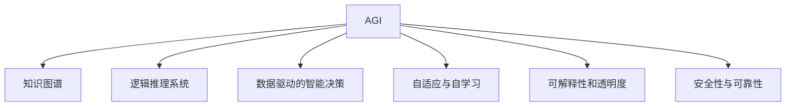

                 

# 软件 2.0 的未来：通用人工智能的基石

## 1. 背景介绍

### 1.1 问题由来

当前，软件产业正处于转型的关键时刻，从传统的以功能为中心的软件 1.0 时代，向以智能为中心的软件 2.0 时代迈进。软件 2.0 的核心在于将通用人工智能（AGI）技术与软件工程相结合，实现全面智能化、自动化的软件系统。通用人工智能，又称为强人工智能，指的是一种能够具备人类水平的智能能力，能够理解、推理、决策和创造的 AI。

软件 2.0 的核心目标是通过 AGI 技术，构建出具备自主学习、自我优化、自适应能力的智能软件系统，实现软件开发的自动化、智能化和自适应性。这种技术将颠覆传统软件开发模式，极大提升软件开发的效率和质量。

### 1.2 问题核心关键点

软件 2.0 的构建，离不开通用人工智能技术的支持。通用人工智能，旨在构建出具备人类智能水平，能够进行复杂逻辑推理、情感理解和创造性工作的 AI 系统。目前，通用人工智能技术正处于探索和实验阶段，面临诸多技术瓶颈和伦理挑战。

软件 2.0 的核心关键点在于：

1. **数据驱动的智能决策**：通过大量数据和复杂算法，实现对问题的智能理解和自动决策。
2. **跨领域的知识整合**：能够整合不同领域的知识，实现知识图谱和逻辑推理系统的无缝结合。
3. **可解释性和透明度**：实现决策过程的可解释性，确保决策的透明和可信。
4. **自适应与自学习**：具备持续学习和自我优化的能力，能够在新的数据和任务上不断提升性能。
5. **安全性与可靠性**：具备高可靠性和安全性，能够抵御恶意攻击和错误输入。

## 2. 核心概念与联系

### 2.1 核心概念概述

为更好地理解软件 2.0 的构建，本节将介绍几个密切相关的核心概念：

- **通用人工智能（AGI）**：指能够具备人类智能水平的 AI，能够进行复杂逻辑推理、情感理解和创造性工作。
- **知识图谱**：通过语义关系图，实现不同知识之间的连接和整合。
- **逻辑推理系统**：基于规则和知识库，进行形式化推理和决策。
- **数据驱动的智能决策**：通过大量数据和复杂算法，实现对问题的智能理解和自动决策。
- **自适应与自学习**：具备持续学习和自我优化的能力，能够在新的数据和任务上不断提升性能。
- **可解释性和透明度**：实现决策过程的可解释性，确保决策的透明和可信。
- **安全性与可靠性**：具备高可靠性和安全性，能够抵御恶意攻击和错误输入。

这些核心概念之间的逻辑关系可以通过以下Mermaid流程图来展示：



这个流程图展示出通用人工智能技术的多维度特征：

1. 通用人工智能通过知识图谱实现跨领域知识的整合。
2. 通过逻辑推理系统进行形式化推理和决策。
3. 数据驱动的智能决策通过大量数据和算法实现。
4. 具备自适应和自学习的能力，不断提升性能。
5. 可解释性和透明度确保决策过程的透明和可信。
6. 安全性与可靠性保障系统的稳定和安全。

## 3. 核心算法原理 & 具体操作步骤
### 3.1 算法原理概述

软件 2.0 的构建，离不开数据驱动的智能决策技术。这种技术通过复杂的数据算法，实现对问题的智能理解和自动决策。数据驱动的智能决策，通常包括以下几个关键步骤：

1. **数据收集与预处理**：收集相关数据，并进行清洗和预处理。
2. **特征提取与选择**：从数据中提取特征，并选择合适的特征进行建模。
3. **模型训练与优化**：选择合适的模型，并在数据上训练和优化。
4. **决策生成与解释**：生成决策，并解释决策过程。

### 3.2 算法步骤详解

以数据驱动的智能决策为例，介绍具体的算法步骤：

**Step 1: 数据收集与预处理**

1. **数据来源**：数据可以从各种来源收集，如传感器、日志文件、用户行为数据等。
2. **数据清洗**：对数据进行清洗，去除噪音和异常值。
3. **数据标准化**：对数据进行标准化，使其符合模型输入要求。

**Step 2: 特征提取与选择**

1. **特征选择**：从数据中提取特征，选择最相关的特征进行建模。
2. **特征工程**：对特征进行工程化处理，如归一化、编码等。
3. **特征融合**：将不同来源的特征进行融合，构建更全面的特征空间。

**Step 3: 模型训练与优化**

1. **模型选择**：选择合适的模型，如深度学习模型、逻辑回归模型等。
2. **模型训练**：在数据上训练模型，不断调整模型参数。
3. **模型优化**：使用正则化、Dropout、Early Stopping等技术，避免过拟合。

**Step 4: 决策生成与解释**

1. **决策生成**：使用训练好的模型，对新数据进行预测和决策。
2. **决策解释**：使用可解释性技术，解释模型决策过程，确保决策透明和可信。

### 3.3 算法优缺点

数据驱动的智能决策技术具有以下优点：

1. **灵活性高**：能够根据具体问题灵活选择模型和特征。
2. **泛化性强**：模型具备较好的泛化能力，能够在新的数据上表现稳定。
3. **可解释性强**：通过可解释性技术，能够解释决策过程，增强决策透明性。
4. **高效性**：使用自动化工具，能够快速完成数据处理和模型训练。

同时，该技术也存在一些缺点：

1. **数据依赖性强**：依赖高质量、丰富多样的数据，数据质量直接影响模型性能。
2. **模型复杂度高**：复杂模型需要大量的计算资源和时间进行训练和优化。
3. **可解释性不足**：某些复杂模型的决策过程难以解释，导致决策透明度不足。
4. **泛化能力受限**：模型过拟合风险较大，需要采用正则化等技术进行缓解。

### 3.4 算法应用领域

数据驱动的智能决策技术，已经在多个领域得到广泛应用，例如：

- **金融风控**：通过分析用户行为数据，进行信用评估和风险控制。
- **医疗诊断**：通过分析病历数据，进行疾病诊断和治疗方案推荐。
- **智能推荐**：通过分析用户行为数据，进行个性化推荐和广告投放。
- **智能客服**：通过分析用户咨询数据，进行智能问答和问题解答。
- **智能监控**：通过分析视频和音频数据，进行异常检测和行为分析。

## 4. 数学模型和公式 & 详细讲解  
### 4.1 数学模型构建

本节将使用数学语言对数据驱动的智能决策过程进行更加严格的刻画。

记数据集为 $D=\{(x_i, y_i)\}_{i=1}^N$，其中 $x_i$ 为输入特征，$y_i$ 为输出标签。定义损失函数为：

$$
\mathcal{L}(\theta) = \frac{1}{N} \sum_{i=1}^N \ell(M_{\theta}(x_i),y_i)
$$

其中 $M_{\theta}$ 为模型，$\ell$ 为损失函数。常见的损失函数包括交叉熵损失、均方误差损失等。

定义模型 $M_{\theta}$ 在数据集 $D$ 上的经验风险为：

$$
\mathcal{L}_{emp}(\theta) = \frac{1}{N} \sum_{i=1}^N \ell(M_{\theta}(x_i),y_i)
$$

通过最小化经验风险，优化模型参数 $\theta$：

$$
\hat{\theta} = \mathop{\arg\min}_{\theta} \mathcal{L}_{emp}(\theta)
$$

在实践中，我们通常使用基于梯度的优化算法（如SGD、Adam等）来近似求解上述最优化问题。设 $\eta$ 为学习率，则参数的更新公式为：

$$
\theta \leftarrow \theta - \eta \nabla_{\theta}\mathcal{L}_{emp}(\theta)
$$

其中 $\nabla_{\theta}\mathcal{L}_{emp}(\theta)$ 为损失函数对参数 $\theta$ 的梯度，可通过反向传播算法高效计算。

### 4.2 公式推导过程

以线性回归为例，推导模型的损失函数及其梯度的计算公式。

设数据集为 $D=\{(x_i,y_i)\}_{i=1}^N$，其中 $x_i$ 为输入特征，$y_i$ 为输出标签。定义线性回归模型为：

$$
M_{\theta}(x) = \theta_0 + \theta_1x_1 + \theta_2x_2 + \cdots + \theta_nx_n
$$

其中 $\theta_0, \theta_1, \theta_2, \cdots, \theta_n$ 为模型参数。目标是最小化损失函数：

$$
\ell(M_{\theta}(x),y) = \frac{1}{2}(x - M_{\theta}(x))^2
$$

则经验风险为：

$$
\mathcal{L}_{emp}(\theta) = \frac{1}{N} \sum_{i=1}^N \frac{1}{2}(y_i - M_{\theta}(x_i))^2
$$

根据梯度下降算法，优化目标为：

$$
\hat{\theta} = \mathop{\arg\min}_{\theta} \mathcal{L}_{emp}(\theta)
$$

对模型参数求导，得：

$$
\frac{\partial \mathcal{L}_{emp}(\theta)}{\partial \theta_k} = -\frac{1}{N} \sum_{i=1}^N (y_i - M_{\theta}(x_i))(x_i)_k
$$

其中 $(x_i)_k$ 为特征向量 $x_i$ 的第 $k$ 个元素。通过求解上述梯度方程，即可更新模型参数，实现模型优化。

### 4.3 案例分析与讲解

假设数据集 $D$ 为二分类任务，其中 $x_i$ 为输入特征，$y_i \in \{0,1\}$ 为输出标签。定义线性判别模型为：

$$
M_{\theta}(x) = \theta_0 + \theta_1x_1 + \theta_2x_2 + \cdots + \theta_nx_n
$$

其中 $\theta_0, \theta_1, \theta_2, \cdots, \theta_n$ 为模型参数。目标是最小化损失函数：

$$
\ell(M_{\theta}(x),y) = -y\log M_{\theta}(x) - (1-y)\log(1-M_{\theta}(x))
$$

则经验风险为：

$$
\mathcal{L}_{emp}(\theta) = -\frac{1}{N} \sum_{i=1}^N [y_i\log M_{\theta}(x_i)+(1-y_i)\log(1-M_{\theta}(x_i))]
$$

通过求解上述梯度方程，即可更新模型参数，实现模型优化。

## 5. 项目实践：代码实例和详细解释说明
### 5.1 开发环境搭建

在进行数据驱动的智能决策实践前，我们需要准备好开发环境。以下是使用Python进行PyTorch开发的环境配置流程：

1. 安装Anaconda：从官网下载并安装Anaconda，用于创建独立的Python环境。

2. 创建并激活虚拟环境：
```bash
conda create -n pytorch-env python=3.8 
conda activate pytorch-env
```

3. 安装PyTorch：根据CUDA版本，从官网获取对应的安装命令。例如：
```bash
conda install pytorch torchvision torchaudio cudatoolkit=11.1 -c pytorch -c conda-forge
```

4. 安装TensorFlow：
```bash
conda install tensorflow==2.5
```

5. 安装各类工具包：
```bash
pip install numpy pandas scikit-learn matplotlib tqdm jupyter notebook ipython
```

完成上述步骤后，即可在`pytorch-env`环境中开始数据驱动的智能决策实践。

### 5.2 源代码详细实现

这里以线性回归模型为例，给出使用PyTorch进行数据驱动的智能决策的代码实现。

首先，定义模型和优化器：

```python
import torch
import torch.nn as nn
import torch.optim as optim

class LinearRegressionModel(nn.Module):
    def __init__(self, n_features):
        super(LinearRegressionModel, self).__init__()
        self.linear = nn.Linear(n_features, 1)

    def forward(self, x):
        return self.linear(x)

model = LinearRegressionModel(n_features=3)
optimizer = optim.SGD(model.parameters(), lr=0.01)
```

然后，定义数据集和损失函数：

```python
import numpy as np

# 定义数据集
x = np.array([[1, 2, 3], [4, 5, 6], [7, 8, 9], [10, 11, 12]])
y = np.array([[2], [5], [8], [11]])

# 定义损失函数
criterion = nn.MSELoss()
```

接着，定义训练和评估函数：

```python
# 定义训练函数
def train(model, optimizer, criterion, x, y, num_epochs=100):
    for epoch in range(num_epochs):
        optimizer.zero_grad()
        output = model(x)
        loss = criterion(output, y)
        loss.backward()
        optimizer.step()
        print(f"Epoch {epoch+1}, Loss: {loss.item()}")

# 定义评估函数
def evaluate(model, x, y):
    with torch.no_grad():
        output = model(x)
        loss = criterion(output, y)
        print(f"Loss: {loss.item()}")
```

最后，启动训练流程并在测试集上评估：

```python
x = torch.from_numpy(x).float()
y = torch.from_numpy(y).float()

train(model, optimizer, criterion, x, y)
evaluate(model, x, y)
```

以上就是使用PyTorch进行数据驱动的智能决策的完整代码实现。可以看到，由于PyTorch提供了高效的Tensor计算和模型构建功能，数据驱动的智能决策模型的实现变得简洁高效。

### 5.3 代码解读与分析

让我们再详细解读一下关键代码的实现细节：

**LinearRegressionModel类**：
- `__init__`方法：初始化模型参数。
- `forward`方法：定义前向传播过程。

**optimizer, criterion**：
- `optimizer`：定义优化器，如SGD。
- `criterion`：定义损失函数，如均方误差损失函数。

**train, evaluate函数**：
- `train`函数：定义训练过程，包括前向传播、计算梯度、反向传播、更新参数等。
- `evaluate`函数：定义评估过程，包括前向传播和计算损失等。

**x, y数组**：
- `x`：输入特征数组，转换类型为Tensor。
- `y`：输出标签数组，转换类型为Tensor。

这些关键代码的实现细节，展示了数据驱动的智能决策模型的基本构建步骤，包括模型定义、数据准备、模型训练、模型评估等环节。通过使用PyTorch的高效工具和丰富的函数库，开发者可以轻松实现各种复杂的数据驱动智能决策模型。

## 6. 实际应用场景
### 6.1 智能推荐系统

数据驱动的智能决策技术，已经广泛应用于智能推荐系统的构建。智能推荐系统通过分析用户行为数据，推荐用户可能感兴趣的商品、内容等。

在技术实现上，可以收集用户浏览、点击、购买等行为数据，提取用户对不同商品、内容的兴趣度，利用这些数据训练推荐模型。通过数据驱动的智能决策技术，推荐模型能够对用户的兴趣进行精准预测，并推荐相应的商品或内容。

### 6.2 金融风控

数据驱动的智能决策技术，在金融风控领域也得到了广泛应用。金融机构通过分析客户的信用记录、交易行为、社交媒体等数据，评估客户的信用风险和交易欺诈风险。

在技术实现上，可以收集客户的历史信用记录、交易数据、社交媒体信息等，提取相关特征，并利用这些数据训练风控模型。通过数据驱动的智能决策技术，风控模型能够对客户的风险进行精准预测，并采取相应的风险控制措施。

### 6.3 医疗诊断

数据驱动的智能决策技术，在医疗诊断领域也具有重要应用。医生通过分析病人的病历、检查结果、基因数据等，进行疾病诊断和治疗方案推荐。

在技术实现上，可以收集病人的病历、检查结果、基因数据等，提取相关特征，并利用这些数据训练诊断模型。通过数据驱动的智能决策技术，诊断模型能够对病人的疾病进行精准预测，并推荐相应的治疗方案。

### 6.4 智能客服

数据驱动的智能决策技术，在智能客服领域也得到了广泛应用。智能客服通过分析用户的咨询记录、行为数据等，提供快速准确的问题解答。

在技术实现上，可以收集用户的咨询记录、行为数据等，提取相关特征，并利用这些数据训练客服模型。通过数据驱动的智能决策技术，客服模型能够对用户的问题进行精准预测，并推荐相应的答案或解决方案。

## 7. 工具和资源推荐
### 7.1 学习资源推荐

为了帮助开发者系统掌握数据驱动的智能决策理论基础和实践技巧，这里推荐一些优质的学习资源：

1. **《深度学习》书籍**：由Ian Goodfellow等人所著，全面介绍了深度学习的基本概念和算法。
2. **CS231n《卷积神经网络》课程**：斯坦福大学开设的计算机视觉课程，涵盖深度学习在图像处理中的应用。
3. **DeepMind博客**：DeepMind团队发布的一系列深度学习论文和技术文章，涵盖深度学习在自然语言处理、计算机视觉等多个领域的最新进展。
4. **Kaggle竞赛**：Kaggle平台提供了丰富的数据集和竞赛任务，可参与实践数据驱动的智能决策算法。
5. **Coursera课程**：Coursera平台提供的一系列深度学习课程，包括计算机视觉、自然语言处理等多个领域的深度学习技术。

通过对这些资源的学习实践，相信你一定能够快速掌握数据驱动的智能决策技术的精髓，并用于解决实际的NLP问题。

### 7.2 开发工具推荐

高效的开发离不开优秀的工具支持。以下是几款用于数据驱动的智能决策开发的常用工具：

1. **PyTorch**：基于Python的开源深度学习框架，灵活动态的计算图，适合快速迭代研究。
2. **TensorFlow**：由Google主导开发的开源深度学习框架，生产部署方便，适合大规模工程应用。
3. **JAX**：Google开发的基于JIT的深度学习框架，适合高性能计算和分布式训练。
4. **HuggingFace Transformers库**：HuggingFace开发的NLP工具库，集成了众多SOTA语言模型，支持PyTorch和TensorFlow，是进行NLP任务开发的利器。
5. **Weights & Biases**：模型训练的实验跟踪工具，可以记录和可视化模型训练过程中的各项指标，方便对比和调优。

这些工具能够显著提升数据驱动的智能决策任务的开发效率，加快创新迭代的步伐。

### 7.3 相关论文推荐

数据驱动的智能决策技术的发展源于学界的持续研究。以下是几篇奠基性的相关论文，推荐阅读：

1. **《深度学习》书籍**：Ian Goodfellow等人所著，全面介绍了深度学习的基本概念和算法。
2. **《Transformer》论文**：提出Transformer结构，开启了NLP领域的预训练大模型时代。
3. **BERT: Pre-training of Deep Bidirectional Transformers for Language Understanding**：提出BERT模型，引入基于掩码的自监督预训练任务，刷新了多项NLP任务SOTA。
4. **Adversarial Machine Learning**：研究机器学习中的对抗攻击和防御方法，保障模型的鲁棒性和安全性。
5. **The Best of Both Worlds: Combining Deep Neural Networks with Knowledge-based Models**：提出混合模型方法，将知识图谱和深度学习模型结合，提高模型性能。

这些论文代表了大数据驱动的智能决策技术的发展脉络。通过学习这些前沿成果，可以帮助研究者把握学科前进方向，激发更多的创新灵感。

## 8. 总结：未来发展趋势与挑战

### 8.1 总结

本文对数据驱动的智能决策方法进行了全面系统的介绍。首先阐述了数据驱动的智能决策技术在软件 2.0 构建中的核心地位，明确了其在智能决策、推荐系统、风控系统、医疗诊断等多个领域的应用价值。其次，从原理到实践，详细讲解了数据驱动的智能决策的数学模型和算法步骤，给出了数据驱动的智能决策任务开发的完整代码实例。同时，本文还广泛探讨了数据驱动的智能决策方法在智能推荐、金融风控、医疗诊断等多个行业领域的应用前景，展示了数据驱动的智能决策技术的巨大潜力。最后，本文精选了数据驱动的智能决策技术的各类学习资源，力求为读者提供全方位的技术指引。

通过本文的系统梳理，可以看到，数据驱动的智能决策技术正在成为软件 2.0 构建的关键范式，极大地拓展了人工智能技术的应用边界，推动了AI技术向更加智能化、普适化的方向发展。

### 8.2 未来发展趋势

展望未来，数据驱动的智能决策技术将呈现以下几个发展趋势：

1. **模型复杂度提升**：随着模型规模和复杂度的提升，数据驱动的智能决策模型的表现将持续提升，具备更强的泛化能力和泛化性能。
2. **多模态数据融合**：融合图像、视频、语音等多种模态数据，提升模型对复杂场景的识别和理解能力。
3. **自适应与自学习**：具备持续学习和自我优化的能力，能够在新的数据和任务上不断提升性能。
4. **可解释性增强**：通过可解释性技术，增强决策过程的透明性和可信度。
5. **安全性与可靠性**：具备高可靠性和安全性，能够抵御恶意攻击和错误输入。

以上趋势凸显了数据驱动的智能决策技术的广阔前景。这些方向的探索发展，必将进一步提升模型的性能和应用范围，为人工智能技术向更加智能化、普适化的方向发展奠定基础。

### 8.3 面临的挑战

尽管数据驱动的智能决策技术已经取得了瞩目成就，但在迈向更加智能化、普适化应用的过程中，它仍面临着诸多挑战：

1. **数据质量瓶颈**：高质量、多样化数据的获取是数据驱动智能决策模型的瓶颈。数据质量直接影响模型性能，数据获取成本较高。
2. **模型复杂度高**：复杂模型需要大量的计算资源和时间进行训练和优化，如何优化模型结构，提高训练效率，是一个重要的研究课题。
3. **可解释性不足**：某些复杂模型的决策过程难以解释，导致决策透明度不足。如何提升模型的可解释性，增强决策的透明和可信度，是一个重要的研究课题。
4. **安全性与可靠性**：模型需要具备高可靠性和安全性，能够抵御恶意攻击和错误输入。如何在模型训练和部署过程中，保障模型的安全性和可靠性，是一个重要的研究课题。

### 8.4 研究展望

面对数据驱动智能决策技术所面临的种种挑战，未来的研究需要在以下几个方面寻求新的突破：

1. **多模态数据融合**：融合图像、视频、语音等多种模态数据，提升模型对复杂场景的识别和理解能力。
2. **自适应与自学习**：具备持续学习和自我优化的能力，能够在新的数据和任务上不断提升性能。
3. **可解释性增强**：通过可解释性技术，增强决策过程的透明性和可信度。
4. **安全性与可靠性**：具备高可靠性和安全性，能够抵御恶意攻击和错误输入。

这些研究方向的探索，必将引领数据驱动智能决策技术迈向更高的台阶，为构建安全、可靠、可解释、可控的智能系统铺平道路。面向未来，数据驱动智能决策技术还需要与其他人工智能技术进行更深入的融合，如知识表示、因果推理、强化学习等，多路径协同发力，共同推动自然语言理解和智能交互系统的进步。只有勇于创新、敢于突破，才能不断拓展数据驱动智能决策技术的边界，让智能技术更好地造福人类社会。

## 9. 附录：常见问题与解答

**Q1：数据驱动的智能决策是否适用于所有NLP任务？**

A: 数据驱动的智能决策技术，在大多数NLP任务上都能取得不错的效果，特别是对于数据量较小的任务。但对于一些特定领域的任务，如医学、法律等，仅仅依靠通用语料预训练的模型可能难以很好地适应。此时需要在特定领域语料上进一步预训练，再进行微调，才能获得理想效果。此外，对于一些需要时效性、个性化很强的任务，如对话、推荐等，数据驱动的智能决策方法也需要针对性的改进优化。

**Q2：数据驱动的智能决策技术如何实现跨领域知识整合？**

A: 数据驱动的智能决策技术，通常利用知识图谱实现跨领域知识的整合。知识图谱通过语义关系图，将不同领域之间的知识进行连接和整合，实现知识的共享和迁移。通过将不同领域的知识整合到知识图谱中，数据驱动的智能决策模型可以借助知识图谱进行跨领域的推理和决策。

**Q3：数据驱动的智能决策技术如何实现高效计算？**

A: 数据驱动的智能决策技术，通常利用深度学习模型实现高效计算。深度学习模型通过参数共享、分布式计算等技术，大幅提升计算效率。此外，还可以利用GPU、TPU等高性能设备，进一步加速计算过程。

**Q4：数据驱动的智能决策技术如何实现可解释性？**

A: 数据驱动的智能决策技术，通常利用可解释性技术实现决策过程的透明性和可信度。常见的可解释性技术包括梯度可视化、注意力机制、特征重要性分析等。通过这些技术，可以分析模型在每个输入特征上的关注点，以及不同特征对决策结果的贡献，从而增强模型的可解释性。

**Q5：数据驱动的智能决策技术如何实现安全性与可靠性？**

A: 数据驱动的智能决策技术，通常利用对抗攻击和防御方法保障模型的安全性和可靠性。常见的防御方法包括对抗样本生成、对抗训练、梯度裁剪等。通过这些技术，可以抵御恶意攻击和错误输入，确保模型的稳定性和可靠性。

---

作者：禅与计算机程序设计艺术 / Zen and the Art of Computer Programming

