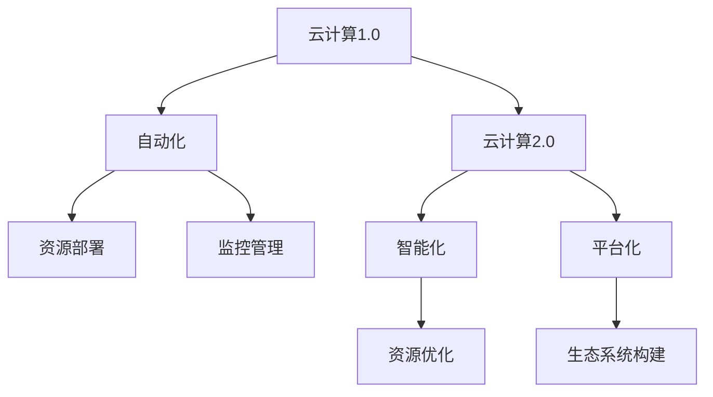

                 

## 1. 背景介绍

在当今数字化、智能化的浪潮下，云计算作为基础设施的重要组成部分，已经成为各行各业数字化转型的关键驱动力。随着技术的发展，云计算架构正经历从1.0到2.0的演进。本文将探讨软件2.0是如何通过引入自动化、智能化、平台化等技术，彻底改变云计算架构的。

## 2. 核心概念与联系

### 2.1 核心概念概述

云计算架构的1.0时代，主要关注资源的高效分配和成本控制，典型的架构如云服务提供商的IaaS（基础设施即服务）平台，提供了基础的计算、存储和网络服务。而在2.0时代，云计算架构逐渐演变，更加注重应用的智能化、自动化和平台化，通过软件2.0技术实现了更高效、更智能的云计算体验。

软件2.0技术主要包括：

- **自动化（Automation）**：通过工具和平台，实现资源的自动化部署、扩展、监控和管理，减少人工干预，提高运营效率。
- **智能化（Intelligence）**：利用AI和大数据技术，优化资源使用，提供智能化的应用部署和运行优化。
- **平台化（Platformization）**：构建开放、灵活的平台，促进生态系统的构建，实现应用的快速部署和迭代。

### 2.2 核心概念原理和架构的 Mermaid 流程图



## 3. 核心算法原理 & 具体操作步骤

### 3.1 算法原理概述

软件2.0技术通过引入自动化、智能化和平台化，对云计算架构进行了根本性的变革。以下是软件2.0在云计算架构中的核心算法原理：

- **自动化算法**：通过自动化工具和平台，实现资源的自动部署、扩展和管理，减少人工干预，提高运营效率。
- **智能化算法**：利用AI和大数据技术，对资源使用进行智能优化，提供智能化的应用部署和运行优化。
- **平台化算法**：构建开放、灵活的平台，促进生态系统的构建，实现应用的快速部署和迭代。

### 3.2 算法步骤详解

软件2.0在云计算架构中的实施步骤包括：

1. **自动化部署**：通过配置管理工具，如Ansible、Terraform等，实现资源的自动部署。
2. **智能监控**：利用AI技术，如机器学习、异常检测等，实时监控资源状态，预测性能瓶颈，自动调整资源。
3. **平台化生态**：构建开放的平台，如Kubernetes、Serverless等，支持应用的快速部署和迭代。
4. **持续集成和交付**：通过CI/CD工具，如Jenkins、GitLab CI等，实现应用的持续集成和快速交付。

### 3.3 算法优缺点

软件2.0技术在云计算架构中的应用具有以下优点：

- **提升效率**：自动化和智能化技术大幅减少了人工干预，提高了运营效率。
- **优化资源使用**：通过智能优化算法，实现了资源的高效利用，降低了成本。
- **促进生态系统建设**：平台化技术构建了开放、灵活的平台，促进了应用生态的繁荣。

同时，软件2.0也面临以下挑战：

- **复杂性增加**：引入新的技术栈和管理工具，增加了架构的复杂性。
- **学习曲线陡峭**：技术复杂性导致技术门槛提高，需要更多的学习和培训。
- **安全性风险**：自动化和平台化带来的复杂性，增加了安全管理的难度。

### 3.4 算法应用领域

软件2.0技术广泛应用于以下领域：

- **企业级应用**：在企业IT系统中，实现应用的自动化部署、智能优化和管理。
- **数据中心**：通过自动化和智能化技术，优化数据中心的资源分配和运行维护。
- **云原生应用**：支持微服务架构的应用，实现快速迭代和部署。
- **DevOps**：实现持续集成和持续交付，提升应用开发和部署的效率。

## 4. 数学模型和公式 & 详细讲解 & 举例说明

### 4.1 数学模型构建

软件2.0技术在云计算架构中的数学模型主要涉及资源优化、自动化部署和智能化监控。

**资源优化模型**：假设云计算架构中有 $n$ 个资源节点，每个节点的计算能力为 $c_i$，资源总需求为 $D$。资源优化模型的目标是最大化资源利用率，最小化运行成本。优化目标为：

$$
\max \frac{D}{\sum_{i=1}^n c_i}
$$

**自动化部署模型**：假设需要部署的应用数为 $m$，每个应用需要的资源为 $r_j$。自动化部署模型的目标是寻找最优的资源分配方案，使得应用部署的总成本最小。优化目标为：

$$
\min \sum_{j=1}^m \max(c_j)
$$

**智能化监控模型**：假设云计算架构中资源的使用情况由 $x_i$ 表示，资源优化模型为 $f(x_i)$。智能化监控模型的目标是实时监控资源状态，预测性能瓶颈，自动调整资源。优化目标为：

$$
\min \sum_{i=1}^n |f(x_i) - \hat{f}(x_i)|
$$

其中 $\hat{f}(x_i)$ 为预测的资源使用情况。

### 4.2 公式推导过程

以资源优化模型为例，假设资源节点的计算能力为 $c_i$，资源总需求为 $D$。使用线性规划求解最优的资源分配方案。

- 建立资源优化模型：
$$
\begin{aligned}
&\text{maximize } D \\
&\text{subject to } \sum_{i=1}^n c_i x_i = D \\
&0 \leq x_i \leq 1 \quad \forall i
\end{aligned}
$$

- 转化为线性规划问题：
$$
\begin{aligned}
&\text{minimize } \sum_{i=1}^n c_i y_i \\
&\text{subject to } \sum_{i=1}^n y_i = D \\
&0 \leq y_i \leq c_i \quad \forall i
\end{aligned}
$$

通过求解上述线性规划问题，可以找到最优的资源分配方案 $y_i$，使得资源利用率最大化。

### 4.3 案例分析与讲解

假设有一个云计算环境，其中有10个计算节点，每个节点的计算能力为 $c_i$，资源总需求为 $D$。通过求解上述线性规划问题，可以找到最优的资源分配方案 $y_i$。例如，当节点1的计算能力为3，节点2的计算能力为2，资源总需求为5时，最优的资源分配方案为节点1分配2个计算资源，节点2分配3个计算资源。

## 5. 项目实践：代码实例和详细解释说明

### 5.1 开发环境搭建

在项目实践前，需要搭建开发环境，主要包括以下步骤：

1. 安装Python、Ansible、Jenkins等工具。
2. 配置Ansible playbook和Jenkins pipeline，实现自动化部署和持续集成。
3. 部署监控系统，如Prometheus、Grafana等，实现智能化监控。

### 5.2 源代码详细实现

以下是使用Ansible实现自动化部署的示例代码：

```python
---
- name: deploy_app
  hosts: all
  become: true
  tasks:
    - name: install dependencies
      apt:
        name: [ "python3", "pandas" ]
        state: present
    - name: clone repository
      git:
        repo: https://github.com/example/repository.git
        dest: /path/to/repo
        update: yes
        recursive: yes
    - name: install dependencies
      pip:
        name: [ "app", "requirements.txt" ]
        state: present
    - name: start app
      command: /path/to/repo/app.py
      state: started
```

### 5.3 代码解读与分析

- **playbook文件**：定义了整个部署流程，从环境准备到应用部署。
- **hosts**：指定了部署的目标主机。
- **tasks**：定义了每个部署任务，包括安装依赖、克隆代码、安装依赖、启动应用等。

### 5.4 运行结果展示

运行上述playbook后，应用成功部署到目标主机，并开始运行。可以通过Jenkins的console output查看部署日志，确保应用正常启动。

## 6. 实际应用场景

### 6.1 企业级应用

企业级应用中，软件2.0技术广泛应用于自动化部署、智能监控和管理。例如，通过Ansible实现自动化部署，通过Prometheus实现智能监控，通过Jenkins实现持续集成和交付。这大大提升了企业IT系统的运营效率和应用开发速度。

### 6.2 数据中心

在数据中心中，软件2.0技术通过自动化和智能化，实现了资源的自动部署、智能优化和管理。例如，通过OpenStack等开源平台，实现了资源的高效管理和监控，提升了数据中心的运营效率和资源利用率。

### 6.3 云原生应用

云原生应用中，软件2.0技术提供了微服务架构的支持，实现了应用的快速迭代和部署。例如，通过Kubernetes等容器编排工具，实现了应用的自动化部署、扩展和管理，提升了应用的灵活性和可扩展性。

### 6.4 未来应用展望

未来，软件2.0技术将在云计算架构中发挥更加重要的作用，具体展望如下：

- **智能化和自动化进一步提升**：随着AI和大数据技术的发展，智能化和自动化将更加深入，实现更高效、更智能的资源管理和应用部署。
- **平台化生态不断完善**：开放、灵活的平台将继续构建，促进应用的快速部署和迭代。
- **安全性和可控性进一步加强**：通过引入自动化和智能化技术，提升云计算系统的安全性和可控性。

## 7. 工具和资源推荐

### 7.1 学习资源推荐

为了帮助开发者系统掌握软件2.0在云计算架构中的应用，这里推荐一些优质的学习资源：

1. 《软件2.0: 云计算架构的演进与未来》系列博文：由云计算专家撰写，深入浅出地介绍了软件2.0技术在云计算中的应用和未来趋势。
2. 《云计算架构设计与实现》课程：由知名大学开设的云计算课程，有Lecture视频和配套作业，带你入门云计算架构的基本概念和经典模型。
3. 《云计算技术指南》书籍：介绍了云计算技术的核心概念和典型架构，适合作为入门书籍。
4. 《软件2.0: 云计算架构的未来》书籍：深入探讨软件2.0技术在云计算中的应用，适合进阶学习。
5. 《云计算生态系统》系列视频：详细介绍了云计算生态系统中的各个组成部分，适合系统学习。

通过对这些资源的学习实践，相信你一定能够快速掌握软件2.0技术在云计算中的应用，并用于解决实际的云计算问题。

### 7.2 开发工具推荐

高效的工具支持是软件开发的关键。以下是几款用于云计算架构开发的常用工具：

1. Ansible：基于Python的自动化配置管理工具，支持多种平台和协议，实现快速部署和配置管理。
2. Kubernetes：开源的容器编排平台，支持应用的自动化部署、扩展和管理，提升应用的灵活性和可扩展性。
3. Jenkins：开源的持续集成工具，支持持续集成、持续交付和持续部署，提升应用的开发和部署效率。
4. Prometheus：开源的监控系统，支持实时监控和告警，提供丰富的指标和图表支持。
5. Grafana：开源的可视化工具，支持与Prometheus等监控系统集成，提供直观的监控仪表盘。

合理利用这些工具，可以显著提升云计算架构的开发效率，加速创新迭代的步伐。

### 7.3 相关论文推荐

云计算架构的发展离不开学界的持续研究。以下是几篇奠基性的相关论文，推荐阅读：

1. 《云计算架构设计与实现》论文：介绍了云计算架构的核心概念和设计原则，提供了多层次的架构解决方案。
2. 《软件定义数据中心》论文：探讨了软件定义数据中心的理念和技术，推动了数据中心自动化和智能化的发展。
3. 《Kubernetes: 容器编排的未来》论文：介绍了Kubernetes的核心概念和架构设计，展示了容器编排技术的未来发展方向。
4. 《云计算平台自动化管理技术》论文：讨论了云计算平台自动化管理的技术和实现，提供了自动化管理的最佳实践。
5. 《软件2.0: 云计算架构的未来》论文：探讨了软件2.0技术在云计算中的应用和未来发展趋势，提出了云计算架构的未来方向。

这些论文代表了大数据中心和云计算架构的发展脉络。通过学习这些前沿成果，可以帮助研究者把握学科前进方向，激发更多的创新灵感。

## 8. 总结：未来发展趋势与挑战

### 8.1 研究成果总结

软件2.0技术在云计算架构中的应用，实现了资源的自动化、智能化和平台化，大大提升了云计算系统的运营效率和应用开发速度。通过自动化部署、智能监控和管理，提升了数据中心的资源利用率和安全可控性。开放、灵活的平台化生态，促进了应用的快速部署和迭代。未来，软件2.0技术将在云计算架构中发挥更加重要的作用。

### 8.2 未来发展趋势

展望未来，软件2.0技术在云计算架构中将呈现以下几个发展趋势：

1. **智能化和自动化进一步提升**：随着AI和大数据技术的发展，智能化和自动化将更加深入，实现更高效、更智能的资源管理和应用部署。
2. **平台化生态不断完善**：开放、灵活的平台将继续构建，促进应用的快速部署和迭代。
3. **安全性和可控性进一步加强**：通过引入自动化和智能化技术，提升云计算系统的安全性和可控性。
4. **跨云资源管理**：实现跨云资源的统一管理，提升资源的灵活性和可扩展性。
5. **边缘计算与云的融合**：将边缘计算与云计算结合，实现数据的本地化处理和分析，提升应用的时效性和可靠性。

### 8.3 面临的挑战

尽管软件2.0技术在云计算架构中的应用取得了显著成果，但在迈向更加智能化、普适化应用的过程中，它仍面临诸多挑战：

1. **复杂性增加**：引入新的技术栈和管理工具，增加了架构的复杂性。
2. **学习曲线陡峭**：技术复杂性导致技术门槛提高，需要更多的学习和培训。
3. **安全性风险**：自动化和平台化带来的复杂性，增加了安全管理的难度。
4. **性能瓶颈**：大规模部署和大数据处理可能面临性能瓶颈，需要优化算法和技术。
5. **成本控制**：自动化和智能化技术的应用，可能带来高昂的成本，需要合理控制和管理。

### 8.4 研究展望

未来的研究需要在以下几个方面寻求新的突破：

1. **自动化与智能化结合**：探索更高效、更智能的自动化技术，实现资源管理的自动化和智能化。
2. **平台化与生态系统**：构建更开放、更灵活的平台，促进应用的快速部署和迭代，提升应用生态的繁荣。
3. **安全性与可控性**：加强云计算系统的安全性和可控性，避免安全隐患和恶意攻击。
4. **性能优化**：优化资源管理和应用部署的算法和技术，提升系统的性能和可扩展性。
5. **成本控制**：优化云计算系统的成本管理，确保系统的经济性。

这些研究方向的探索，必将引领软件2.0技术在云计算架构中迈向更高的台阶，为构建高效、智能、安全的云计算系统铺平道路。

## 9. 附录：常见问题与解答

**Q1: 什么是软件2.0技术？**

A: 软件2.0技术是指通过引入自动化、智能化和平台化，实现云计算架构的根本性变革。它通过工具和平台，实现资源的自动部署、智能优化和管理，构建开放、灵活的平台，促进生态系统的构建，提升应用的开发和部署效率。

**Q2: 如何实现云计算架构的自动化和智能化？**

A: 实现云计算架构的自动化和智能化，主要通过以下步骤：

1. 使用配置管理工具，如Ansible、Terraform等，实现资源的自动部署和扩展。
2. 使用AI技术，如机器学习、异常检测等，实时监控资源状态，预测性能瓶颈，自动调整资源。
3. 构建开放、灵活的平台，如Kubernetes、Serverless等，支持应用的快速部署和迭代。
4. 使用CI/CD工具，如Jenkins、GitLab CI等，实现持续集成和持续交付，提升应用开发和部署的效率。

**Q3: 云计算架构的自动化和智能化带来了哪些挑战？**

A: 云计算架构的自动化和智能化带来了以下挑战：

1. 复杂性增加：引入新的技术栈和管理工具，增加了架构的复杂性。
2. 学习曲线陡峭：技术复杂性导致技术门槛提高，需要更多的学习和培训。
3. 安全性风险：自动化和平台化带来的复杂性，增加了安全管理的难度。
4. 性能瓶颈：大规模部署和大数据处理可能面临性能瓶颈，需要优化算法和技术。
5. 成本控制：自动化和智能化技术的应用，可能带来高昂的成本，需要合理控制和管理。

这些挑战需要通过不断优化和创新，逐步克服，才能实现云计算架构的智能化和自动化。

**Q4: 未来云计算架构的发展方向是什么？**

A: 未来云计算架构的发展方向包括：

1. 智能化和自动化进一步提升：随着AI和大数据技术的发展，智能化和自动化将更加深入，实现更高效、更智能的资源管理和应用部署。
2. 平台化生态不断完善：开放、灵活的平台将继续构建，促进应用的快速部署和迭代。
3. 安全性和可控性进一步加强：通过引入自动化和智能化技术，提升云计算系统的安全性和可控性。
4. 跨云资源管理：实现跨云资源的统一管理，提升资源的灵活性和可扩展性。
5. 边缘计算与云的融合：将边缘计算与云计算结合，实现数据的本地化处理和分析，提升应用的时效性和可靠性。

这些方向代表了云计算架构未来的发展趋势，需要通过不断的研究和实践，逐步实现。

---

作者：禅与计算机程序设计艺术 / Zen and the Art of Computer Programming

