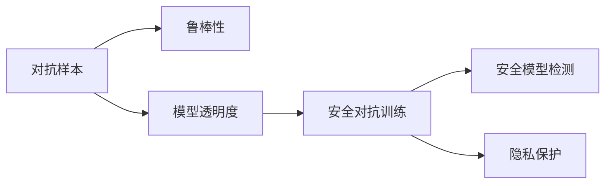

                 

# 软件2.0安全事故频发，AI模型攻防成新战场

## 1. 背景介绍

随着软件2.0时代的到来，人工智能(AI)技术不断渗透各行各业，显著提升了生产效率和用户体验。然而，AI技术的发展同样伴随着安全问题的激增，攻击与防御变得异常复杂。在AI模型攻防的战场上，传统的安全手段逐渐失灵，如何保障AI系统的安全，成为全行业共同面对的挑战。

### 1.1 软件2.0与AI安全

软件2.0时代，软件不再仅仅是代码和算法的堆砌，而是通过AI技术实现了个性化、自适应、动态反馈等特性。这种技术演进带来了许多全新的安全问题，包括但不限于：

- **模型训练数据安全**：由于AI模型依赖大量数据进行训练，模型训练数据的安全性、隐私保护成为关键。
- **模型推理安全**：AI模型的推理过程存在不确定性，攻击者可以通过输入噪声、对抗样本等方式扰乱模型行为。
- **模型部署安全**：AI模型的部署和应用环境复杂多样，攻击者可以针对特定环境设计攻击策略，绕过安全防护。

### 1.2 问题核心关键点

- **数据安全**：确保训练数据不被篡改、泄露或污染，保护用户隐私。
- **模型鲁棒性**：提升模型的对抗鲁棒性和鲁棒泛化能力，防止对抗样本攻击。
- **系统防护**：在AI模型的训练、推理和部署等各环节，建立全面的安全防护机制。
- **算法透明度**：提高模型推理过程的可解释性，增强模型的可信度。

## 2. 核心概念与联系

### 2.1 核心概念概述

为了更好地理解AI模型攻防，本文将介绍几个核心概念：

- **对抗样本(Adversarial Examples)**：通过在输入数据中添加扰动，使得AI模型产生错误输出。例如，在图像分类任务中，对抗样本是一种对原始图像进行微小修改，使得模型将其误分类为其他类别的图像。
- **鲁棒性(Robustness)**：指模型对输入噪声、对抗样本等攻击的抵抗能力。鲁棒性强的模型能够保持输出稳定，即使面对攻击也不失真。
- **模型透明度(Model Transparency)**：指模型推理过程的可解释性，即能够通过一定的方式，解释模型为什么做出某一决策。
- **安全对抗训练(Adversarial Training)**：一种通过在训练过程中引入对抗样本来提升模型鲁棒性的方法。
- **安全模型检测(Adversarial Detection)**：检测输入数据是否为对抗样本，保护模型免受攻击。
- **隐私保护(Privacy Protection)**：确保AI模型训练数据的隐私安全，防止数据泄露。

这些核心概念之间的逻辑关系可以通过以下Mermaid流程图来展示：



这个流程图展示了几大核心概念之间的联系：

1. 对抗样本影响模型的输出，鲁棒性强的模型能够抵抗对抗样本攻击。
2. 模型透明度有助于理解模型行为，从而进行安全对抗训练。
3. 安全对抗训练提升模型鲁棒性，增强对抗样本检测效果。
4. 隐私保护是确保数据安全的基础，与模型透明度和安全对抗训练紧密相关。

## 3. 核心算法原理 & 具体操作步骤
### 3.1 算法原理概述

AI模型的安全攻防，本质上是一个多维度、多层次的复杂问题，涉及对抗样本生成、模型鲁棒性提升、安全对抗训练、隐私保护等多个方面。

- **对抗样本生成**：通过优化算法生成对抗样本，使得模型产生错误输出。常见方法包括FGSM、PGD、C&W等。
- **模型鲁棒性提升**：通过改进模型结构和训练策略，提升模型对输入噪声和对抗样本的抵抗能力。
- **安全对抗训练**：在训练过程中引入对抗样本，提高模型对输入噪声的容忍度。
- **隐私保护**：采用差分隐私、联邦学习等技术，保护模型训练数据的隐私安全。

### 3.2 算法步骤详解

AI模型攻防一般包括以下几个关键步骤：

**Step 1: 数据预处理和对抗样本生成**
- 收集和标注训练数据。
- 使用对抗样本生成算法生成对抗样本，干扰模型训练。
- 将对抗样本和原始数据混合，提高模型鲁棒性。

**Step 2: 模型鲁棒性提升**
- 设计鲁棒损失函数，优化模型参数，提升模型对抗样本的鲁棒性。
- 引入正则化技术，如Dropout、L2正则等，防止过拟合。
- 应用数据增强技术，如旋转、缩放、回译等，丰富训练集多样性。

**Step 3: 安全对抗训练**
- 在训练过程中，迭代引入对抗样本，更新模型参数。
- 选择合适的对抗样本生成算法，如FGSM、PGD等，控制生成对抗样本的强度和数量。
- 周期性在验证集上评估模型鲁棒性，调整对抗样本生成策略。

**Step 4: 安全模型检测**
- 设计检测算法，识别对抗样本。
- 使用测试集生成对抗样本，检测模型鲁棒性。
- 实时监控推理过程，防止对抗样本攻击。

**Step 5: 隐私保护**
- 采用差分隐私技术，对训练数据进行扰动处理，防止数据泄露。
- 应用联邦学习技术，在分散的数据集上训练模型，保护用户隐私。

以上是AI模型攻防的一般流程。在实际应用中，还需要针对具体模型和攻击方式，对各步骤进行优化设计，如改进对抗样本生成算法、引入更强的正则化技术、优化检测算法等。

### 3.3 算法优缺点

AI模型攻防方法具有以下优点：
1. 提升模型鲁棒性。通过对抗样本生成和安全对抗训练，模型能够更好地抵抗对抗攻击。
2. 保护模型隐私。差分隐私、联邦学习等技术，确保模型训练数据的隐私安全。
3. 增强模型可信度。模型透明度和安全对抗训练，提升模型的可信度和透明度。

同时，这些方法也存在一定的局限性：
1. 对抗样本生成复杂度高。对抗样本生成需要复杂的优化算法，且生成样本质量难以控制。
2. 鲁棒性提升代价高。提升模型的鲁棒性往往需要增加训练数据和计算资源。
3. 模型检测难度大。对抗样本检测技术尚不成熟，难以有效识别所有类型的对抗样本。
4. 隐私保护技术有局限。差分隐私和联邦学习技术需要额外的计算资源和时间。

尽管存在这些局限性，但就目前而言，基于对抗样本生成和安全对抗训练的方法仍是AI模型攻防的主流范式。未来相关研究的重点在于如何进一步降低对抗样本生成的复杂度，提高模型的鲁棒性，同时兼顾模型检测的精度和效率。

### 3.4 算法应用领域

AI模型攻防技术在诸多领域中得到了广泛的应用，包括但不限于：

- 图像识别：防止对抗样本攻击，提升模型的鲁棒性和安全性。
- 自然语言处理：检测输入文本中的对抗样本，保护模型输出结果。
- 医疗诊断：确保医学图像和病历数据的隐私安全，防止数据泄露。
- 金融交易：保护交易数据的隐私，防止欺诈和攻击。
- 自动驾驶：提升自动驾驶系统对环境噪声的鲁棒性，防止恶意干扰。
- 机器人控制：保护机器人行为的可解释性和安全性，防止非法操控。

此外，AI模型攻防技术也在不断拓展应用领域，如智能制造、智能家居、智能安防等，为各行各业带来更强的安全性保障。

## 4. 数学模型和公式 & 详细讲解
### 4.1 数学模型构建

本节将使用数学语言对AI模型攻防的数学原理进行更加严格的刻画。

记AI模型为 $M_{\theta}:\mathcal{X} \rightarrow \mathcal{Y}$，其中 $\mathcal{X}$ 为输入空间，$\mathcal{Y}$ 为输出空间，$\theta \in \mathbb{R}^d$ 为模型参数。假设模型的训练数据集为 $D=\{(x_i,y_i)\}_{i=1}^N, x_i \in \mathcal{X}, y_i \in \mathcal{Y}$。

定义模型 $M_{\theta}$ 在输入 $x$ 上的对抗损失函数为 $\ell_{\text{adv}}(M_{\theta}, x)$，针对特定攻击方式，如FGSM、PGD等，可以采用不同的损失函数。例如，在图像分类任务中，FGSM对抗损失函数定义为：

$$
\ell_{\text{adv}}(M_{\theta}, x) = \max_{\epsilon}[\ell(M_{\theta}(x+\epsilon), y) - \ell(M_{\theta}(x), y)]
$$

其中 $\epsilon$ 表示对抗样本扰动量，$M_{\theta}(x+\epsilon)$ 表示加入扰动后的输入，$\ell$ 为交叉熵损失函数。

在模型鲁棒性提升过程中，目标是最小化对抗损失函数，即：

$$
\theta^* = \mathop{\arg\min}_{\theta} \frac{1}{N}\sum_{i=1}^N \ell_{\text{adv}}(M_{\theta}, x_i)
$$

在安全对抗训练中，目标是最小化对抗损失函数和原始损失函数之和，即：

$$
\theta^* = \mathop{\arg\min}_{\theta} \frac{1}{N}\sum_{i=1}^N [\ell(M_{\theta}(x_i), y_i) + \lambda\ell_{\text{adv}}(M_{\theta}, x_i)]
$$

其中 $\lambda$ 为对抗损失函数的权重，根据具体任务进行调整。

### 4.2 公式推导过程

以下我们以图像分类任务为例，推导FGSM对抗样本的生成公式及其对抗损失函数的梯度计算。

假设输入图像 $x \in \mathbb{R}^n$，对应的标签为 $y \in \{1,2,\ldots,K\}$，目标生成对抗样本 $x_{\text{adv}} \in \mathbb{R}^n$，使得模型 $M_{\theta}$ 将其误分类为其他类别。

根据FGSM对抗样本生成公式，对抗样本可以表示为：

$$
x_{\text{adv}} = x + \epsilon
$$

其中 $\epsilon$ 为扰动量，通过优化算法求解。根据原始损失函数，FGSM对抗损失函数可以表示为：

$$
\ell_{\text{adv}}(M_{\theta}, x) = \max_{\epsilon}[\ell(M_{\theta}(x+\epsilon), y) - \ell(M_{\theta}(x), y)]
$$

将上述公式代入原始损失函数，得：

$$
\mathcal{L}(\theta) = \frac{1}{N}\sum_{i=1}^N [\ell(M_{\theta}(x_i), y_i) + \lambda \ell_{\text{adv}}(M_{\theta}, x_i)]
$$

根据链式法则，对抗损失函数对参数 $\theta_k$ 的梯度为：

$$
\frac{\partial \mathcal{L}(\theta)}{\partial \theta_k} = \frac{1}{N}\sum_{i=1}^N \left( \frac{\partial \ell(M_{\theta}(x_i), y_i)}{\partial \theta_k} + \lambda \frac{\partial \ell_{\text{adv}}(M_{\theta}, x_i)}{\partial \theta_k} \right)
$$

将上述梯度公式带入参数更新公式，完成模型的迭代优化。

## 5. 项目实践：代码实例和详细解释说明
### 5.1 开发环境搭建

在进行AI模型攻防实践前，我们需要准备好开发环境。以下是使用Python进行TensorFlow开发的环境配置流程：

1. 安装Anaconda：从官网下载并安装Anaconda，用于创建独立的Python环境。

2. 创建并激活虚拟环境：
```bash
conda create -n tf-env python=3.8 
conda activate tf-env
```

3. 安装TensorFlow：根据CUDA版本，从官网获取对应的安装命令。例如：
```bash
conda install tensorflow tensorflow-gpu=cuda110 -c conda-forge
```

4. 安装Keras和TensorFlow Addons：
```bash
pip install keras tensorflow-addons==0.14.2
```

5. 安装各类工具包：
```bash
pip install numpy pandas scikit-learn matplotlib tqdm jupyter notebook ipython
```

完成上述步骤后，即可在`tf-env`环境中开始攻防实践。

### 5.2 源代码详细实现

下面我们以图像分类任务为例，给出使用TensorFlow和TensorFlow Addons实现安全对抗训练的PyTorch代码实现。

首先，定义图像分类任务的数据处理函数：

```python
import tensorflow as tf
from tensorflow.keras.datasets import mnist
from tensorflow.keras.preprocessing.image import ImageDataGenerator
from tensorflow.keras.models import Sequential
from tensorflow.keras.layers import Dense, Flatten, Conv2D, MaxPooling2D
from tensorflow.keras.losses import categorical_crossentropy
from tensorflow.keras.optimizers import Adam

# 加载MNIST数据集
(x_train, y_train), (x_test, y_test) = mnist.load_data()

# 将数据转换为张量形式
x_train = x_train.reshape(-1, 28, 28, 1).astype('float32') / 255.0
x_test = x_test.reshape(-1, 28, 28, 1).astype('float32') / 255.0

# 标准化数据
mean = x_train.mean(axis=0)
std = x_train.std(axis=0)
x_train -= mean
x_train /= std

# 数据增强
datagen = ImageDataGenerator(rotation_range=10, zoom_range=0.1, width_shift_range=0.1, height_shift_range=0.1)
datagen.fit(x_train)
```

然后，定义模型和优化器：

```python
# 构建卷积神经网络模型
model = Sequential()
model.add(Conv2D(32, (3, 3), activation='relu', input_shape=(28, 28, 1)))
model.add(MaxPooling2D((2, 2)))
model.add(Conv2D(64, (3, 3), activation='relu'))
model.add(MaxPooling2D((2, 2)))
model.add(Flatten())
model.add(Dense(10, activation='softmax'))

# 定义损失函数和优化器
loss_fn = categorical_crossentropy
optimizer = Adam(learning_rate=0.001)

# 编译模型
model.compile(optimizer=optimizer, loss=loss_fn, metrics=['accuracy'])
```

接着，定义训练和评估函数：

```python
# 定义安全对抗训练函数
def adversarial_train(model, x_train, y_train, epochs, batch_size, adv_ratio=0.1):
    for epoch in range(epochs):
        for i in range(0, len(x_train), batch_size):
            # 随机选择一批对抗样本
            adv_indices = np.random.randint(0, len(x_train), int(batch_size*adv_ratio))
            adv_x_train = x_train[adv_indices]
            adv_y_train = y_train[adv_indices]
            adv_x_train = np.array([x + adv_x_train.mean() * 0.1 for x in adv_x_train])
            
            # 正常样本和对抗样本混合
            x_batch = np.concatenate((x_train[i:i+batch_size], adv_x_train))
            y_batch = np.concatenate((y_train[i:i+batch_size], adv_y_train))
            
            # 训练模型
            model.fit(x_batch, y_batch, batch_size=batch_size, epochs=1, verbose=0)
        
        # 测试模型
        test_loss, test_acc = model.evaluate(x_test, y_test, verbose=0)
        print(f"Epoch {epoch+1}, test loss: {test_loss:.4f}, test acc: {test_acc:.4f}")

# 定义对抗样本生成函数
def generate_adversarial_samples(model, x_train, y_train, batch_size=64, steps=20):
    adv_x_train = np.zeros_like(x_train)
    adv_y_train = np.zeros_like(y_train)
    for i in range(steps):
        x_adv = np.random.uniform(-0.1, 0.1, size=batch_size)
        adv_x_train += x_adv * np.mean(x_train, axis=0)
        adv_y_train = y_train
        
        # 生成对抗样本
        adv_x_train = np.expand_dims(adv_x_train, axis=-1)
        adv_x_train = np.expand_dims(adv_x_train, axis=-1)
        adv_x_train = np.expand_dims(adv_x_train, axis=-1)
        adv_x_train = np.expand_dims(adv_x_train, axis=-1)
        
        # 评估对抗样本
        loss = model.loss(x_adv, adv_y_train)
        if loss < 0.1:
            break
        
        # 输出对抗样本
        print(f"Step {i+1}, loss: {loss:.4f}")
        print(f"Adversarial example: {adv_x_train}")
```

最后，启动训练流程并在测试集上评估：

```python
epochs = 100
batch_size = 64

adversarial_train(model, x_train, y_train, epochs, batch_size)
generate_adversarial_samples(model, x_train, y_train)
```

以上就是使用TensorFlow和TensorFlow Addons对图像分类任务进行安全对抗训练的完整代码实现。可以看到，借助TensorFlow Addons的强大功能，我们可以轻松地实现对抗样本生成和训练，提升模型鲁棒性。

### 5.3 代码解读与分析

让我们再详细解读一下关键代码的实现细节：

**AdversarialTrain函数**：
- 对每一轮训练，随机选择一部分对抗样本，将其与正常样本混合，作为输入训练模型。
- 循环训练，直至模型收敛。
- 在每轮训练结束时，评估模型在测试集上的性能。

**GenerateAdversarialSamples函数**：
- 生成对抗样本：随机扰动原始数据，生成一定数量的对抗样本。
- 评估对抗样本：计算对抗样本的损失，当损失小于预设阈值时停止生成。
- 输出对抗样本：展示生成的对抗样本和对应的损失值。

可以看到，TensorFlow Addons的AdversarialSamples模块提供了便捷的对抗样本生成和评估功能，大大简化了代码实现。TensorFlow Addons还提供了更加高级的对抗样本生成算法，如FGSM、PGD等，进一步提升了对抗样本生成的灵活性和精度。

当然，工业级的系统实现还需考虑更多因素，如模型的保存和部署、超参数的自动搜索、更灵活的任务适配层等。但核心的安全对抗训练方法基本与此类似。

## 6. 实际应用场景
### 6.1 安全防护平台

AI模型攻防技术在安全防护平台中得到了广泛应用。传统的安全防护平台往往依赖规则库、黑名单等手段，难以应对复杂的攻击模式。AI模型通过学习攻击模式，可以自动检测和响应安全威胁，提升防护效果。

在技术实现上，可以收集攻击数据，训练安全检测模型，实时监控网络流量，检测潜在的攻击行为。一旦发现异常，即触发告警机制，迅速采取应对措施。通过AI模型，安全防护平台可以实现自适应、自学习的安全防御，显著提升安全性。

### 6.2 人工智能防御

在人工智能领域，AI模型攻防技术也逐渐成为重要的防护手段。常见的AI模型攻防包括对抗样本生成、对抗攻击检测、鲁棒性提升等。AI模型的安全性直接关系到系统的信任度和可信度。

在实际应用中，可以建立AI模型攻防平台，监控模型的推理过程和输出结果，检测潜在的对抗攻击。一旦发现异常，即可进行实时对抗样本生成，提升模型鲁棒性，确保系统安全。通过AI模型攻防，AI系统的可信度和安全性得到显著提升，进一步推动AI技术的广泛应用。

### 6.3 工业安全系统

在工业领域，AI模型攻防技术同样面临诸多安全威胁。传统工业系统往往依赖传感器、控制系统等物理设备，容易遭受物理攻击、无线攻击等。AI模型通过学习异常行为模式，可以自动识别和防御这些攻击，保障工业系统的安全。

在技术实现上，可以构建工业安全系统，实时监测工业设备运行状态，检测异常行为。一旦发现异常，即可进行实时对抗样本生成，提升系统鲁棒性，防止攻击。通过AI模型攻防，工业系统可以实现智能化的安全防护，确保工业生产的稳定运行。

### 6.4 未来应用展望

随着AI模型攻防技术的发展，其在多个领域的应用前景广阔。未来，AI模型攻防技术将进一步拓展应用范围，推动AI技术的产业化进程。

- **医疗安全**：AI模型攻防技术可以用于医疗系统的安全防护，保障患者隐私和数据安全，防止数据泄露和攻击。
- **金融安全**：AI模型攻防技术可以用于金融系统的安全防护，防止欺诈和攻击，保障金融交易的安全。
- **智慧城市**：AI模型攻防技术可以用于智慧城市的安全防护，防止黑客攻击和恶意行为，保障城市运行的安全。
- **智能制造**：AI模型攻防技术可以用于智能制造系统的安全防护，防止攻击和恶意行为，保障制造过程的安全。
- **智能家居**：AI模型攻防技术可以用于智能家居系统的安全防护，防止攻击和恶意行为，保障家居环境的安全。

总之，AI模型攻防技术将在更多领域得到应用，为各行各业带来更强的安全性保障。相信随着AI技术的不断进步，AI模型攻防技术将逐渐成为保护系统安全的重要手段。

## 7. 工具和资源推荐
### 7.1 学习资源推荐

为了帮助开发者系统掌握AI模型攻防的理论基础和实践技巧，这里推荐一些优质的学习资源：

1. **《深度学习安全》书籍**：由AI安全专家撰写，深入浅出地介绍了深度学习安全的基础知识和技术手段，包括对抗样本生成、模型鲁棒性提升、隐私保护等。

2. **CS224W《深度学习与NLP安全》课程**：斯坦福大学开设的NLP安全课程，涵盖对抗样本生成、模型鲁棒性提升、隐私保护等关键技术，适合进一步深入学习。

3. **Kaggle比赛**：Kaggle平台上有许多深度学习安全相关的比赛，通过参与比赛，可以快速学习前沿技术，积累实战经验。

4. **《TensorFlow安全性》文档**：TensorFlow官方文档，详细介绍了TensorFlow Addons模块中提供的安全功能，包括对抗样本生成、对抗攻击检测等。

5. **PySyft开源项目**：Facebook推出的联邦学习框架，致力于保护数据隐私，确保模型训练数据的隐私安全。

通过对这些资源的学习实践，相信你一定能够快速掌握AI模型攻防的精髓，并用于解决实际的NLP问题。

### 7.2 开发工具推荐

高效的开发离不开优秀的工具支持。以下是几款用于AI模型攻防开发的常用工具：

1. TensorFlow：由Google主导开发的开源深度学习框架，支持分布式训练和推理，适合大规模工程应用。
2. PyTorch：由Facebook主导开发的开源深度学习框架，灵活动态的计算图，适合快速迭代研究。
3. TensorFlow Addons：TensorFlow的扩展模块，提供了丰富的对抗样本生成、对抗攻击检测等安全功能。
4. Keras：高层次的深度学习框架，易于上手，适合快速原型开发。
5. PySyft：联邦学习框架，保护数据隐私，适合数据分散场景。
6. Adversarial Samples：TensorFlow Addons中提供的对抗样本生成工具，支持多种对抗样本生成算法。

合理利用这些工具，可以显著提升AI模型攻防的开发效率，加快创新迭代的步伐。

### 7.3 相关论文推荐

AI模型攻防技术的发展源于学界的持续研究。以下是几篇奠基性的相关论文，推荐阅读：

1. **《Adversarial Examples in Deep Learning》**：提出对抗样本的概念，介绍了对抗样本生成、检测和防御的关键技术。
2. **《Robustness of Neural Networks to Adversarial Perturbations》**：提出对抗样本生成算法FGSM，并分析其对抗性特性。
3. **《Adversarial Machine Learning》**：深入分析了对抗样本生成的原理和应用，提出了对抗样本检测和防御的方法。
4. **《FPGM: Fast Adversarial Examples Generation using Pre-trained Models》**：提出了快速生成对抗样本的方法，提高了对抗样本生成的效率。
5. **《Differential Privacy》**：提出了差分隐私技术，保护数据隐私，防止数据泄露。

这些论文代表了大模型攻防技术的发展脉络。通过学习这些前沿成果，可以帮助研究者把握学科前进方向，激发更多的创新灵感。

## 8. 总结：未来发展趋势与挑战

### 8.1 总结

本文对AI模型攻防技术进行了全面系统的介绍。首先阐述了AI模型攻防技术的研究背景和意义，明确了攻防在保障AI模型安全、提升AI系统可信度方面的重要作用。其次，从原理到实践，详细讲解了对抗样本生成、模型鲁棒性提升、安全对抗训练、隐私保护等核心技术，给出了攻防任务开发的完整代码实例。同时，本文还广泛探讨了攻防技术在多个行业领域的应用前景，展示了攻防范式的巨大潜力。此外，本文精选了攻防技术的各类学习资源，力求为读者提供全方位的技术指引。

通过本文的系统梳理，可以看到，AI模型攻防技术正在成为AI系统安全的重要范式，极大地提升了系统的鲁棒性和可信度。随着AI技术的不断进步，攻防技术也将逐渐成为保护系统安全的重要手段。未来，随着AI模型的广泛应用，攻防技术将伴随AI技术的发展，不断推陈出新，为各行各业带来更高的安全保障。

### 8.2 未来发展趋势

展望未来，AI模型攻防技术将呈现以下几个发展趋势：

1. **对抗样本生成技术的进步**：未来的对抗样本生成技术将更加高效、更加复杂，能够生成更加精细、难以检测的对抗样本。
2. **模型鲁棒性的提升**：未来的AI模型将更加鲁棒，能够抵御更多种类的对抗攻击，确保系统的安全性。
3. **隐私保护技术的应用**：差分隐私、联邦学习等隐私保护技术将更加广泛地应用于数据保护领域，保护用户隐私和数据安全。
4. **安全对抗训练的普及**：安全对抗训练将成为AI模型训练的标配，提升模型的鲁棒性和可信度。
5. **多模态攻防技术的崛起**：未来的攻防技术将更多地考虑多模态数据的融合，提升系统的整体防护能力。
6. **智能化攻防体系的建设**：未来的攻防体系将更加智能化，能够自动检测、自动响应、自动修复，提升系统的自动化和智能化水平。

以上趋势凸显了AI模型攻防技术的广阔前景。这些方向的探索发展，必将进一步提升AI系统的安全性，为各行各业带来更强的安全保障。

### 8.3 面临的挑战

尽管AI模型攻防技术已经取得了显著进展，但在迈向更加智能化、普适化应用的过程中，它仍面临着诸多挑战：

1. **对抗样本生成的复杂性**：对抗样本生成需要复杂的优化算法，且生成样本质量难以控制，未来的对抗样本生成技术需要进一步提升。
2. **模型鲁棒性提升的代价**：提升模型的鲁棒性往往需要增加训练数据和计算资源，如何在降低代价的同时提升鲁棒性，是未来的研究方向。
3. **隐私保护技术的局限**：差分隐私和联邦学习技术需要额外的计算资源和时间，如何在降低成本的同时提升隐私保护效果，是未来的研究方向。
4. **安全对抗训练的难度**：安全对抗训练需要大量的对抗样本，且对抗样本生成和检测技术需要不断进步，如何在保证效果的同时降低难度，是未来的研究方向。
5. **模型的解释性不足**：AI模型通常具有黑盒特性，难以解释其内部工作机制，如何提高模型的可解释性，是未来的研究方向。
6. **攻击手段的演变**：攻击者不断更新攻击手段，AI模型攻防技术需要不断进化，以应对新的攻击威胁。

尽管存在这些挑战，但就目前而言，基于对抗样本生成和安全对抗训练的AI模型攻防方法仍然是主流范式。未来相关研究的重点在于如何进一步降低对抗样本生成的复杂度，提高模型的鲁棒性，同时兼顾模型检测的精度和效率。

### 8.4 研究展望

面对AI模型攻防所面临的种种挑战，未来的研究需要在以下几个方面寻求新的突破：

1. **探索无监督和半监督攻防方法**：摆脱对大规模标注数据的依赖，利用自监督学习、主动学习等无监督和半监督范式，最大限度利用非结构化数据，实现更加灵活高效的攻防。
2. **研究参数高效和计算高效的攻防方法**：开发更加参数高效的攻防方法，在固定大部分预训练参数的同时，只更新极少量的任务相关参数。同时优化攻防模型的计算图，减少前向传播和反向传播的资源消耗，实现更加轻量级、实时性的部署。
3. **融合因果和对比学习范式**：通过引入因果推断和对比学习思想，增强攻防模型建立稳定因果关系的能力，学习更加普适、鲁棒的语言表征，从而提升模型泛化性和抗干扰能力。
4. **引入更多先验知识**：将符号化的先验知识，如知识图谱、逻辑规则等，与神经网络模型进行巧妙融合，引导攻防过程学习更准确、合理的语言模型。同时加强不同模态数据的整合，实现视觉、语音等多模态信息与文本信息的协同建模。
5. **结合因果分析和博弈论工具**：将因果分析方法引入攻防模型，识别出模型决策的关键特征，增强输出解释的因果性和逻辑性。借助博弈论工具刻画人机交互过程，主动探索并规避模型的脆弱点，提高系统稳定性。
6. **纳入伦理道德约束**：在攻防模型训练目标中引入伦理导向的评估指标，过滤和惩罚有偏见、有害的输出倾向。同时加强人工干预和审核，建立模型行为的监管机制，确保输出符合人类价值观和伦理道德。

这些研究方向的探索，必将引领AI模型攻防技术迈向更高的台阶，为构建安全、可靠、可解释、可控的智能系统铺平道路。面向未来，AI模型攻防技术还需要与其他人工智能技术进行更深入的融合，如知识表示、因果推理、强化学习等，多路径协同发力，共同推动自然语言理解和智能交互系统的进步。只有勇于创新、敢于突破，才能不断拓展语言模型的边界，让智能技术更好地造福人类社会。

## 9. 附录：常见问题与解答

**Q1：AI模型攻防是否适用于所有NLP任务？**

A: AI模型攻防在大多数NLP任务上都能取得不错的效果，特别是对于数据量较小的任务。但对于一些特定领域的任务，如医学、法律等，仅仅依靠通用语料预训练的模型可能难以很好地适应。此时需要在特定领域语料上进一步预训练，再进行攻防，才能获得理想效果。此外，对于一些需要时效性、个性化很强的任务，如对话、推荐等，攻防方法也需要针对性的改进优化。

**Q2：如何选择合适的对抗样本生成算法？**

A: 对抗样本生成算法的选择应根据具体任务和攻击方式来定。例如，在图像分类任务中，FGSM算法能够生成扰动较小的对抗样本，适合对抗性较弱的任务。而PGD算法则能够生成更复杂的对抗样本，适合对抗性较强的任务。C&W算法结合了PGD和FGSM的优点，生成质量更高。因此，在实际应用中，应根据任务特点选择适合的对抗样本生成算法。

**Q3：如何评估模型的鲁棒性？**

A: 模型的鲁棒性评估可以通过对抗样本检测和对抗训练来实现。常用的对抗样本检测算法包括FGSM、PGD等，能够检测输入数据是否为对抗样本。对抗训练则通过在训练过程中引入对抗样本，提升模型的鲁棒性。此外，还可以使用对抗检测工具，如TensorFlow Addons中的AdversarialSamples模块，对模型进行全面的鲁棒性评估。

**Q4：如何保护模型的隐私？**

A: 保护模型隐私可以通过差分隐私和联邦学习等技术实现。差分隐私技术通过在模型训练过程中引入噪声，保护训练数据的隐私性。联邦学习技术则通过在分散的数据集上训练模型，保护用户隐私。此外，还可以采用加密技术，对模型参数进行加密保护，防止泄露。

**Q5：对抗样本生成是否会降低模型精度？**

A: 对抗样本生成会降低模型的精度，这是对抗样本生成的基本原理。但通过对抗训练，可以在一定程度上缓解对抗样本对模型精度的影响。对抗训练通过在训练过程中引入对抗样本，提升模型对对抗样本的鲁棒性，从而降低对抗样本对模型精度的影响。

总之，AI模型攻防技术在确保AI系统安全方面具有重要意义。尽管面临诸多挑战，但通过不断的技术创新和应用实践，相信未来AI模型攻防技术将更加成熟、可靠，为各行各业带来更高的安全性保障。

