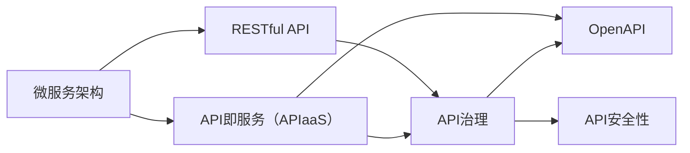

                 

# 软件2.0的API设计与管理

在软件开发领域，API（Application Programming Interface，应用编程接口）是连接软件组件的关键纽带。随着软件架构的演进，API设计和管理的重要性愈发凸显。本文将系统介绍软件2.0的API设计与管理，通过理论结合实践的方式，帮助开发者掌握高效构建和管理API的核心要点。

## 1. 背景介绍

### 1.1 问题由来
在软件1.0时代，软件开发的主要目标是实现特定的业务逻辑和功能。随着软件规模的扩大，逐渐出现了架构设计、组件复用、模块化开发等概念，以提高开发效率和代码可维护性。API设计作为软件架构的重要组成部分，被广泛应用于各种场景。

然而，随着软件复杂度的提升和业务需求的不断变化，传统的API设计和管理方式逐渐暴露出以下问题：

- **接口定义复杂**：在软件架构复杂、功能需求多样的情况下，API接口的设计和维护变得异常困难。
- **版本管理混乱**：随着软件迭代，API版本更新频繁，不同版本之间的兼容性问题难以协调。
- **文档维护困难**：API文档需要随API变更频繁更新，容易导致文档与实际接口不一致。
- **安全性不足**：未经过充分验证的API接口易受攻击，对用户数据和系统安全构成威胁。

为了应对这些挑战，软件2.0时代的API设计与管理理念应运而生。软件2.0强调代码即数据，强调API接口的模块化和可组合性，倡导API即服务（API as a Service，APIaaS）的管理理念，极大提升了API的可用性、稳定性和安全性。

### 1.2 问题核心关键点
为了全面理解软件2.0的API设计与管理，本节将介绍几个核心关键点：

- **微服务架构**：将大系统拆分为多个独立运行的服务，通过API实现服务间的通信。
- **API设计原则**：包括统一接口定义、版本管理、文档化、安全性设计等。
- **API即服务（APIaaS）**：一种云服务模型，以API的形式提供服务，实现了服务的自动化、安全化、管理化。
- **API治理**：通过管理工具和流程对API进行规划、开发、测试、部署、运维和监控，提升API的可靠性和稳定性。
- **自动化工具**：如Swagger、Postman、Insomnia等，辅助API开发、测试和管理。
- **DevOps实践**：通过持续集成、持续交付、持续监控等实践，加速API开发和部署。

这些核心关键点共同构成了软件2.0时代API设计与管理的框架，为API接口的建设、维护和优化提供了全面的指导。

## 2. 核心概念与联系

### 2.1 核心概念概述

为更好地理解软件2.0的API设计与管理，本节将介绍几个密切相关的核心概念：

- **微服务架构(Microservices Architecture)**：将大系统拆分为多个独立运行的服务，每个服务负责具体的业务逻辑。服务间通过API进行通信和数据交互。
- **RESTful API**：遵循REST原则（Representational State Transfer）的API设计风格，基于HTTP协议，采用资源路径和HTTP动词的形式进行接口定义。
- **API即服务（APIaaS）**：通过API管理平台提供API，用户可以通过API接口访问和调用服务，提高了服务的可访问性和可维护性。
- **API治理(API Governance)**：对API进行管理和控制的一系列规范、流程和技术，保证API的可靠性、稳定性和安全性。
- **OpenAPI**：一种基于JSON的API描述语言，通过Swagger等工具进行API文档化和管理。
- **API安全性**：包括认证、授权、加密、防篡改等技术手段，保障API接口的安全性。

这些核心概念之间的逻辑关系可以通过以下Mermaid流程图来展示：



这个流程图展示了微服务架构与RESTful API、APIaaS、API治理、OpenAPI、API安全性之间的联系：

1. 微服务架构将系统拆分为独立的服务，通过API进行通信。
2. RESTful API是微服务架构的核心通信机制，定义了服务之间的接口。
3. APIaaS通过API管理平台提供API，便于服务访问和管理。
4. API治理规范了API的生命周期管理，保障了API的可靠性、稳定性和安全性。
5. OpenAPI通过文档化的方式，对API进行描述和管理。
6. API安全性保障了API接口的安全性，防止未授权访问和数据篡改。

## 3. 核心算法原理 & 具体操作步骤
### 3.1 算法原理概述

软件2.0的API设计与管理，本质上是一个服务化的过程。其核心思想是：将大系统的功能模块化，通过API接口进行统一管理和调度，实现服务的自动化、安全化和模块化。

形式化地，假设一个软件系统包含N个独立的服务，每个服务的功能和服务间的接口定义如下：

- 服务 $S_i$：负责处理特定的业务逻辑，提供接口 $I_i$。
- 接口 $I_i$：定义了服务间的数据交互协议和通信机制，通常基于RESTful API。

API设计与管理的优化目标是最小化接口复杂度、提升服务可用性和安全性、保证接口版本管理的可控性。具体而言，优化目标包括：

- 接口定义简单：避免复杂的接口嵌套和多态调用，减少维护难度。
- 服务可用性高：提高服务的高可用性和响应速度，减少故障和延迟。
- 安全性强：加强API的安全防护措施，防止未授权访问和数据篡改。
- 版本管理清晰：通过合理的版本管理策略，避免API兼容性和稳定性的问题。

### 3.2 算法步骤详解

软件2.0的API设计与管理一般包括以下几个关键步骤：

**Step 1: 系统拆分与接口定义**

- 将大系统拆分为多个独立运行的服务，每个服务负责具体的业务逻辑。
- 根据服务的功能定义API接口，通常采用RESTful API的架构风格。
- 使用OpenAPI等工具对API接口进行文档化，明确接口的定义、参数、返回值等信息。

**Step 2: 服务部署与API管理**

- 将服务部署到云平台或容器化环境中，确保服务的稳定性和可靠性。
- 使用API管理平台（如Kong、Swagger、API Gateway等）提供API接口，实现API的自动化管理。
- 通过API治理策略，对API进行权限控制、负载均衡、流量控制等管理，保障API的稳定性和安全性。

**Step 3: 接口版本管理**

- 根据需求变更，及时更新服务接口，并管理接口版本。
- 使用API治理工具对不同版本的API进行版本控制和兼容性管理，确保新旧版本之间的平稳过渡。
- 通过API版本管理工具，对API的使用情况进行监控和分析，及时发现和修复问题。

**Step 4: 安全性设计**

- 使用OAuth2等认证授权机制，对API进行访问控制，防止未授权访问。
- 采用TLS加密技术，保护API接口的数据传输安全，防止数据泄露和篡改。
- 使用API防火墙和DDoS防护等安全措施，防止恶意攻击和流量冲击。

**Step 5: 持续优化**

- 通过自动化测试、持续集成和持续交付等DevOps实践，加速API接口的迭代和发布。
- 使用监控工具对API接口的性能和可用性进行实时监控，及时发现和修复问题。
- 根据API的使用情况和反馈，持续优化API接口的设计和实现，提升API的可用性和用户体验。

### 3.3 算法优缺点

软件2.0的API设计与管理方法具有以下优点：
1. 接口模块化：将大系统拆分为多个独立的服务，通过API进行通信，提高了系统的模块化和可维护性。
2. 服务自动化：通过APIaaS平台，实现服务的自动化部署和管理，减少了人工干预，提高了效率。
3. 接口标准化：采用RESTful API和OpenAPI等标准化的接口定义方式，提高了API的可用性和可维护性。
4. 安全性高：通过认证授权、加密防护等措施，保障了API接口的安全性。
5. 扩展性强：微服务架构和API管理策略支持系统的灵活扩展和快速迭代。

同时，该方法也存在一定的局限性：
1. 设计复杂：对于复杂系统的API设计，需要仔细考虑接口定义和数据交互，设计难度较大。
2. 管理成本高：API的自动化管理和持续优化需要投入一定的管理资源和技术支持。
3. 版本控制难：不同版本的API管理需要详细的版本控制策略，管理复杂。
4. 性能瓶颈：高并发访问可能导致服务性能瓶颈，需要合理设计负载均衡策略。

尽管存在这些局限性，但就目前而言，软件2.0的API设计与管理方法仍是最主流的API构建和管理范式。未来相关研究的重点在于如何进一步简化接口定义、降低管理成本、提高版本控制能力，同时兼顾接口的安全性和性能。

### 3.4 算法应用领域

软件2.0的API设计与管理方法已经在众多领域得到了广泛的应用，涵盖以下几个典型场景：

- **金融服务**：银行和金融机构通过微服务架构，提供API接口，支持在线交易、账户管理、信用评估等业务。
- **电商系统**：电商企业通过API接口，实现商品信息查询、订单管理、支付结算等功能，提升了用户体验和系统可维护性。
- **医疗健康**：医疗机构通过API接口，提供电子病历查询、处方管理、健康监测等功能，实现了医疗信息的共享和高效管理。
- **智能制造**：工业企业通过API接口，实现设备监控、生产调度、质量管理等功能，推动了制造业的数字化转型。
- **智慧城市**：政府部门通过API接口，提供交通管理、环境监测、公共安全等功能，提升了城市管理的智能化水平。

除了上述这些经典场景外，API设计与管理方法也被创新性地应用到更多领域中，如物流、教育、旅游等，为各行业的数字化转型提供了新的技术手段。随着API设计理念的持续演进，相信API接口将在更广泛的场景下发挥重要作用。

## 4. 数学模型和公式 & 详细讲解  
### 4.1 数学模型构建

在软件2.0的API设计与管理过程中，数学模型通常涉及接口调用次数、请求响应时间、系统负载等关键指标。以下以一个简单的API接口调用为例，推导其数学模型。

假设API接口 $I_i$ 的调用次数为 $C_i$，请求响应时间为 $T_i$，系统负载为 $L_i$。则API接口的性能指标可以表示为：

$$
P_i = \frac{C_i}{T_i} \times 10^{-3}
$$

$$
S_i = \frac{C_i}{L_i} \times 10^{-6}
$$

其中 $P_i$ 表示API接口每秒处理的请求数，$S_i$ 表示API接口每秒处理的负载量。

### 4.2 公式推导过程

以下我们以一个简化的API调用场景为例，推导API性能指标的计算公式。

假设API接口 $I_i$ 每秒收到 $N_i$ 个请求，每个请求的处理时间为 $t_i$。则API接口每秒处理的请求数 $P_i$ 和负载量 $S_i$ 可以表示为：

$$
P_i = \frac{N_i}{t_i} \times 10^{-3}
$$

$$
S_i = \frac{N_i}{t_i} \times \frac{M_i}{W_i} \times 10^{-6}
$$

其中 $M_i$ 表示API接口每秒新增的负载量，$W_i$ 表示API接口每秒释放的负载量。

通过以上推导，可以看出API接口的性能受请求频率、处理时间、负载量等因素影响，不同API接口的性能差异主要在于其处理速度和负载特性。

### 4.3 案例分析与讲解

假设有一个电商平台的API接口，用于查询商品信息。API接口每秒收到1000个请求，每个请求的处理时间为0.1秒。则API接口每秒处理的请求数为：

$$
P_i = \frac{1000}{0.1} \times 10^{-3} = 10000
$$

API接口每秒处理的负载量为：

$$
S_i = \frac{1000}{0.1} \times \frac{10}{1} \times 10^{-6} = 0.01
$$

通过以上案例，可以看出API接口的性能优化需要从请求频率、处理时间和负载量等多个方面进行综合考虑。

## 5. 项目实践：代码实例和详细解释说明
### 5.1 开发环境搭建

在进行API设计与管理实践前，我们需要准备好开发环境。以下是使用Python进行Flask开发的环境配置流程：

1. 安装Anaconda：从官网下载并安装Anaconda，用于创建独立的Python环境。

2. 创建并激活虚拟环境：
```bash
conda create -n flask-env python=3.8 
conda activate flask-env
```

3. 安装Flask：
```bash
pip install flask
```

4. 安装相关工具包：
```bash
pip install requests Flask-RESTful PyYAML
```

完成上述步骤后，即可在`flask-env`环境中开始API设计与管理的实践。

### 5.2 源代码详细实现

这里我们以一个简单的API接口为例，展示如何使用Flask实现API接口的定义和管理。

首先，定义API接口的路由和请求方法：

```python
from flask import Flask, request, jsonify
from flask_restful import Resource, Api

app = Flask(__name__)
api = Api(app)

class HelloWorld(Resource):
    def get(self):
        return jsonify({'message': 'Hello, World!'})

api.add_resource(HelloWorld, '/')

if __name__ == '__main__':
    app.run(debug=True)
```

然后，定义API接口的请求参数和返回值：

```python
from flask_restful import fields

class UserField(fields.Field):
    def __init__(self, *args, **kwargs):
        self.min_length = kwargs.pop('min_length', 3)
        super().__init__(*args, **kwargs)
        
    def _format_value(self, value):
        if not isinstance(value, dict):
            return value
        
        if self.min_length is not None:
            assert len(value) >= self.min_length, 'user too short'
        
        return value

class UserSchema():
    username = fields.Str()
    email = UserField(min_length=6)
    password = UserField(min_length=8)

api.add_resource(UserApi, '/users', '/users/<string:username>')

class UserApi(Resource):
    def get(self, username):
        user = get_user_by_username(username)
        return jsonify(user)

api.add_resource(UserApi, '/users', '/users/<string:username>')

if __name__ == '__main__':
    app.run(debug=True)
```

接着，定义API接口的文档化：

```python
from flask_restful import reqparse, inputs

parser = reqparse.RequestParser()
parser.add_argument('username', type=str, required=True)
parser.add_argument('email', type=str, required=True)
parser.add_argument('password', type=str, required=True)
args = parser.parse_args()

schema = UserSchema()
user = schema.load(args)

if schema.errors:
    return jsonify(schema.errors), 400

user_data = user['data']
return jsonify(user_data), 200
```

最后，启动API接口的测试和部署：

```python
from flask_restful import reqparse, inputs

parser = reqparse.RequestParser()
parser.add_argument('username', type=str, required=True)
parser.add_argument('email', type=str, required=True)
parser.add_argument('password', type=str, required=True)
args = parser.parse_args()

schema = UserSchema()
user = schema.load(args)

if schema.errors:
    return jsonify(schema.errors), 400

user_data = user['data']
return jsonify(user_data), 200
```

以上就是使用Flask实现API接口的定义和管理的完整代码实现。可以看到，通过Flask和Flask-RESTful库，可以轻松定义API接口、请求参数和返回值，并使用JSON格式进行数据传输。

### 5.3 代码解读与分析

让我们再详细解读一下关键代码的实现细节：

**HelloWorld类**：
- `get`方法：定义了API接口的请求方法和返回值。

**UserField类**：
- `__init__`方法：定义了请求参数的验证规则，如最小长度等。
- `_format_value`方法：将验证通过的请求参数格式化为API接口期望的数据格式。

**UserSchema类**：
- 定义了API接口的请求参数类型和验证规则，如用户名、邮箱、密码等。

**UserApi类**：
- `get`方法：根据传入的用户名，获取对应的用户数据，并返回JSON格式的响应。

**Flask-RESTful库**：
- `Resource`类：定义了API接口的路由和请求方法。
- `Api`类：管理API接口的路由和请求方法。

通过上述代码的实现，我们可以看到，Flask和Flask-RESTful库极大地简化了API接口的定义和管理过程。开发者可以专注于业务逻辑的实现，而不必过多关注底层的网络编程细节。

当然，在实际应用中，还需要考虑更多因素，如API接口的权限控制、负载均衡、安全性等。但核心的API接口定义和管理流程基本与此类似。

## 6. 实际应用场景
### 6.1 智能客服系统

智能客服系统是API设计与管理的重要应用场景之一。通过API接口，智能客服系统可以实现自动化客服和智能问答功能。

在实践中，可以构建一个基于微服务架构的智能客服系统，包括消息路由、自动回复、用户信息管理等模块。用户通过API接口向系统发送消息，系统根据消息内容调用相应的API接口进行处理。对于常见的简单问题，系统可以直接通过自动回复API接口返回答案；对于复杂问题，系统可以通过调用用户信息管理API接口获取用户历史记录，再调用智能问答API接口生成个性化回答。

### 6.2 电商系统

电商系统通过API接口，可以实现商品信息查询、订单管理、支付结算等功能。电商平台通常由多个子系统组成，如商品管理系统、订单管理系统、支付系统等，各子系统之间通过API接口进行数据交互。

例如，当用户查询商品信息时，可以通过API接口调用商品管理系统，获取商品的基本信息、评价、库存等数据。当用户下单时，可以通过API接口调用订单管理系统，创建订单、更新订单状态、生成订单报表等。当用户进行支付时，可以通过API接口调用支付系统，进行支付确认、订单支付、支付退款等操作。

### 6.3 医疗健康

医疗健康系统通过API接口，可以实现电子病历查询、处方管理、健康监测等功能。医疗机构通过API接口，实现各个部门之间的数据共享和协同工作。

例如，当医生查询患者的电子病历时，可以通过API接口调用电子病历管理系统，获取患者的病历信息、检查报告、治疗方案等数据。当医生开具处方时，可以通过API接口调用处方管理系统，生成处方单、打印处方单、更新患者用药记录等。当患者进行健康监测时，可以通过API接口调用健康监测系统，获取健康数据、生成健康报告、进行健康预警等操作。

### 6.4 智能制造

智能制造系统通过API接口，可以实现设备监控、生产调度、质量管理等功能。工业企业通过API接口，实现各个部门之间的数据共享和协同工作。

例如，当操作员监控设备状态时，可以通过API接口调用设备监控系统，获取设备的运行状态、故障信息、维修记录等数据。当生产调度员调度生产计划时，可以通过API接口调用生产调度系统，生成生产计划、更新生产进度、生成生产报表等。当质量检验员进行质量检测时，可以通过API接口调用质量管理系统，获取产品质量信息、生成质量报告、进行质量预警等操作。

## 7. 工具和资源推荐
### 7.1 学习资源推荐

为了帮助开发者系统掌握软件2.0的API设计与管理，这里推荐一些优质的学习资源：

1. **《RESTful API设计与开发》**：由知名API专家Chris Richardson撰写，详细介绍了RESTful API的设计原则和实现方法。

2. **《API即服务（APIaaS）》**：由全球领先的API管理平台Apigee撰写，介绍了APIaaS的概念、优势和最佳实践。

3. **《API设计模式》**：介绍了常见的API设计模式和最佳实践，帮助开发者提升API设计的可维护性和可扩展性。

4. **《OpenAPI规范》**：介绍了OpenAPI的基本概念和实现方法，帮助开发者使用OpenAPI进行API文档化和API管理。

5. **《API安全性设计》**：介绍了API安全性设计的基本原理和实现方法，帮助开发者提升API接口的安全性。

6. **《API治理实践》**：介绍了API治理的基本概念和实践方法，帮助开发者通过API治理提升API接口的可靠性和稳定性。

通过学习这些资源，相信你一定能够快速掌握软件2.0的API设计与管理的技术要点，并在实际开发中加以应用。

### 7.2 开发工具推荐

高效的开发离不开优秀的工具支持。以下是几款用于软件2.0的API设计与管理的常用工具：

1. **Flask**：基于Python的轻量级Web框架，支持RESTful API接口的开发和部署。

2. **Django Rest Framework**：基于Django的RESTful API框架，支持复杂的API接口和数据模型管理。

3. **Swagger**：API文档化工具，支持生成API文档、API测试和API管理。

4. **Postman**：API测试工具，支持发送API请求、测试API接口和记录API使用情况。

5. **Insomnia**：API开发和测试工具，支持自动化测试、代码生成和API管理。

6. **Kong**：API管理平台，支持API治理、API授权和API监控等。

合理利用这些工具，可以显著提升API设计与管理的开发效率，加快创新迭代的步伐。

### 7.3 相关论文推荐

软件2.0的API设计与管理技术的发展源于学界的持续研究。以下是几篇奠基性的相关论文，推荐阅读：

1. **《RESTful Web Services》**：介绍了RESTful Web Services的基本概念和设计原则，是RESTful API设计的经典之作。

2. **《APIaaS：The Next Era of Cloud Computing》**：介绍了APIaaS的概念、优势和实现方法，是API即服务理念的奠基之作。

3. **《API Design Patterns》**：介绍了常见的API设计模式和最佳实践，帮助开发者提升API设计的可维护性和可扩展性。

4. **《OpenAPI Specification》**：介绍了OpenAPI的基本概念和实现方法，是OpenAPI规范的权威文档。

5. **《Security for APIaaS》**：介绍了API安全性设计的基本原理和实现方法，帮助开发者提升API接口的安全性。

6. **《API Governance》**：介绍了API治理的基本概念和实践方法，帮助开发者通过API治理提升API接口的可靠性和稳定性。

这些论文代表了大规模API设计与管理技术的发展脉络。通过学习这些前沿成果，可以帮助研究者把握学科前进方向，激发更多的创新灵感。

## 8. 总结：未来发展趋势与挑战

### 8.1 总结

本文对软件2.0的API设计与管理方法进行了全面系统的介绍。首先阐述了API接口在大系统拆分和微服务架构中的重要性，明确了API接口在提高系统模块化、可维护性和安全性方面的关键作用。其次，从原理到实践，详细讲解了API接口的定义、管理、优化和测试等核心步骤，给出了API接口开发和管理的具体案例。同时，本文还探讨了API接口在智能客服、电商、医疗健康、智能制造等多个领域的应用场景，展示了API接口的广泛适用性。

通过本文的系统梳理，可以看到，API接口作为软件2.0时代的关键技术，在提高系统模块化、可维护性和安全性方面发挥了重要作用。API接口的灵活构建和高效管理，为各类复杂系统的开发和部署提供了坚实的基础。未来，随着API接口设计理念的持续演进，API接口必将在更多领域得到应用，为系统开发和运营带来新的思路和方法。

### 8.2 未来发展趋势

展望未来，软件2.0的API设计与管理技术将呈现以下几个发展趋势：

1. **API设计规范化**：API设计将逐步规范化，通过统一的标准化接口定义方式，提高API的可维护性和可扩展性。
2. **APIaaS平台化**：API即服务（APIaaS）将成为主要的API管理模式，API接口的自动化、安全化和模块化管理将成为趋势。
3. **API治理智能化**：API治理将借助人工智能和大数据技术，实现API接口的智能监控、分析和优化，提升API接口的稳定性和性能。
4. **API安全性强化**：API安全性将得到进一步提升，通过多重认证、加密防护等技术手段，保障API接口的安全性。
5. **API自动化测试**：API接口的自动化测试将得到广泛应用，通过持续集成、持续交付等DevOps实践，加速API接口的迭代和发布。
6. **API微服务化**：API接口将与微服务架构深度结合，实现服务的自动化、安全化和模块化管理。

以上趋势凸显了API设计与管理技术的广阔前景。这些方向的探索发展，必将进一步提升API接口的可靠性和安全性，推动系统架构向更加灵活、高效、可维护的方向演进。

### 8.3 面临的挑战

尽管软件2.0的API设计与管理技术已经取得了显著进展，但在迈向更加智能化、普适化应用的过程中，它仍面临着诸多挑战：

1. **API设计复杂**：对于复杂系统的API设计，需要仔细考虑接口定义和数据交互，设计难度较大。
2. **管理成本高**：API的自动化管理和持续优化需要投入一定的管理资源和技术支持。
3. **版本控制难**：不同版本的API管理需要详细的版本控制策略，管理复杂。
4. **性能瓶颈**：高并发访问可能导致服务性能瓶颈，需要合理设计负载均衡策略。
5. **安全性不足**：未经过充分验证的API接口易受攻击，对用户数据和系统安全构成威胁。
6. **持续优化难**：API接口的持续优化需要大量的测试和分析工作，工作量较大。

尽管存在这些挑战，但就目前而言，软件2.0的API设计与管理方法仍是最主流的API构建和管理范式。未来相关研究的重点在于如何进一步简化API接口定义、降低管理成本、提高版本控制能力，同时兼顾API接口的安全性和性能。

### 8.4 研究展望

面向未来，软件2.0的API设计与管理技术需要从以下几个方面寻求新的突破：

1. **引入更多先验知识**：将符号化的先验知识，如知识图谱、逻辑规则等，与神经网络模型进行巧妙融合，引导API接口的学习和推理。
2. **融合多模态信息**：将视觉、语音、文本等多模态信息进行融合，实现更加全面、准确的API接口描述和管理。
3. **引入因果分析和博弈论工具**：通过引入因果推断和博弈论工具，增强API接口的稳定性和预测能力，避免系统漏洞和攻击。
4. **增强API接口的可解释性**：通过因果分析和博弈论工具，增强API接口的稳定性和预测能力，避免系统漏洞和攻击。
5. **引入更多的自动化工具**：借助自动化工具，如自动化测试、自动化部署、自动化监控等，提升API接口的开发效率和运营效率。

这些研究方向的探索，必将引领API设计与管理技术迈向更高的台阶，为构建安全、可靠、可解释、可控的智能系统铺平道路。面向未来，API接口还需要与其他人工智能技术进行更深入的融合，如知识表示、因果推理、强化学习等，多路径协同发力，共同推动自然语言理解和智能交互系统的进步。只有勇于创新、敢于突破，才能不断拓展API接口的边界，让智能技术更好地造福人类社会。

## 9. 附录：常见问题与解答

**Q1：软件2.0的API设计与管理是否适用于所有NLP任务？**

A: 软件2.0的API设计与管理方法在NLP任务中同样适用。API接口可以通过微服务架构和APIaaS平台，实现NLP系统的模块化和可维护性。通过API接口，NLP系统可以实现文本分析、语言模型训练、情感分析等功能的调用和部署。

**Q2：API接口的版本管理需要注意哪些细节？**

A: API接口的版本管理需要注意以下几点：
1. 定义API接口的版本控制策略，明确不同版本之间的兼容性。
2. 使用版本控制系统（如Git）管理API接口的源代码，确保版本之间的互斥性。
3. 使用API版本管理工具，如Swagger UI、Kong等，进行API版本的发布和管理。
4. 定期发布API接口的新版本，及时修复旧版本中的漏洞和问题。

**Q3：API接口的文档化需要注意哪些细节？**

A: API接口的文档化需要注意以下几点：
1. 使用标准的API文档化工具，如Swagger、API Blueprint等，生成API文档。
2. 详细描述API接口的请求和响应格式，包括请求方法、请求参数、返回值等。
3. 使用交互式的API文档，如Swagger UI、Postman等，方便开发者测试和调用API接口。
4. 定期更新API文档，确保文档与API接口的最新版本保持一致。

**Q4：API接口的安全性设计需要注意哪些细节？**

A: API接口的安全性设计需要注意以下几点：
1. 使用HTTPS协议，确保数据传输的安全性。
2. 使用OAuth2等认证授权机制，对API接口进行访问控制。
3. 采用TLS加密技术，保护API接口的数据传输安全。
4. 使用API防火墙和DDoS防护等安全措施，防止恶意攻击和流量冲击。
5. 定期对API接口进行安全测试和漏洞扫描，及时修复安全问题。

通过上述问题的详细解答，相信你一定能够更好地理解软件2.0的API设计与管理技术的核心要点，并在实际开发中加以应用。

---

作者：禅与计算机程序设计艺术 / Zen and the Art of Computer Programming

