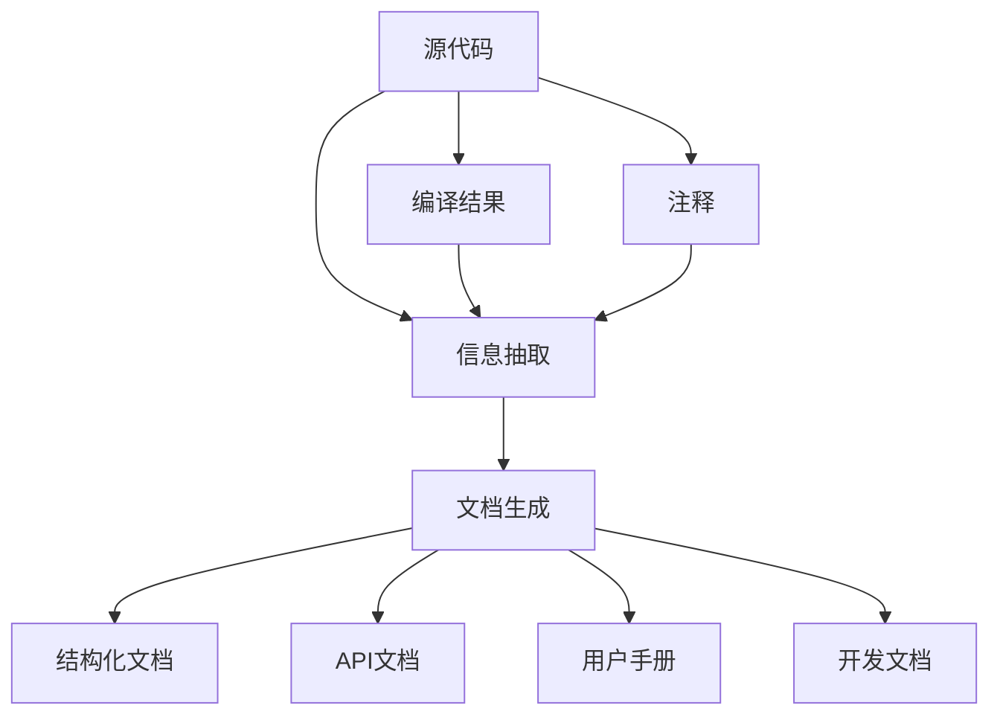

                 

# 软件2.0的文档自动生成技术

## 1. 背景介绍

软件工程已经成为现代企业和创新不可或缺的核心。随着软件复杂性的不断增加，软件维护、优化和迭代开发变得越来越困难。文档自动生成技术（Automatic Documentation Generation）作为一种自动化工具，能够大幅降低软件开发和维护的成本，提升软件开发的效率和质量。在软件2.0时代，文档自动生成技术将成为软件工程的重要组成部分。

### 1.1 问题由来

软件开发过程中的文档，如API文档、用户手册、开发文档等，是开发团队和用户沟通的重要桥梁。传统的手工编写和维护文档不仅耗时耗力，而且容易出错。尤其是对于大型项目，文档的维护成本非常高，且随着项目规模的扩大，文档质量往往难以保证。

### 1.2 问题核心关键点

软件2.0时代，文档自动生成技术旨在通过自动化手段，从源代码和编译结果中提取信息，生成高质量的文档。核心关键点包括：

1. **文档结构化**：将源代码、注释和编译结果结构化处理，生成规范的文档格式。
2. **信息抽取**：从源代码和编译结果中提取关键信息，如函数名、参数、返回值、类型、注释等，用于生成文档。
3. **文档生成**：根据抽取的信息，自动生成API文档、用户手册、开发文档等。
4. **交互式文档**：利用交互技术，提升用户阅读体验，如高亮、链接、搜索等。
5. **实时更新**：文档内容能够实时更新，以反映代码的最新状态。

### 1.3 问题研究意义

文档自动生成技术的应用，对软件开发和维护具有重要意义：

1. **提升效率**：文档自动生成能够大幅减少文档编写的周期和成本，提升开发效率。
2. **提高质量**：自动生成的文档更加规范和一致，减少了人工编辑错误。
3. **促进协作**：自动生成的文档便于团队成员共享和理解，促进协作开发。
4. **提高用户体验**：高质量、实时更新的文档能够帮助用户快速上手，提升使用体验。
5. **支持持续集成**：文档能够与代码变更同步，支持持续集成和持续交付。

## 2. 核心概念与联系

### 2.1 核心概念概述

为更好地理解文档自动生成技术，本节将介绍几个密切相关的核心概念：

- **文档自动生成**：指通过自动手段，从源代码和编译结果中提取信息，生成高质量的文档。
- **API文档**：描述软件接口的文档，包括函数名、参数、返回值、注释等。
- **用户手册**：指导用户如何使用软件的文档，通常包含安装、配置、操作流程等。
- **开发文档**：帮助开发人员理解和维护代码的文档，如架构图、设计文档、代码注释等。
- **结构化文档**：将文档内容组织成有结构、易于阅读的格式，如Markdown、HTML等。
- **信息抽取**：从源代码和编译结果中提取关键信息，用于生成文档。
- **语义分析**：对源代码进行语义分析，识别函数、变量、类等元素。

这些核心概念之间的逻辑关系可以通过以下Mermaid流程图来展示：



这个流程图展示了几类文档的生成流程：

1. 源代码经过信息抽取生成文档。
2. 编译结果也参与信息抽取，以获取更多的信息。
3. 提取出的信息用于生成API文档、用户手册和开发文档。
4. 注释被抽取出来，进一步提高文档的准确性。

## 3. 核心算法原理 & 具体操作步骤

### 3.1 算法原理概述

文档自动生成技术通常包括以下几个关键步骤：

1. **文档结构化**：将源代码、注释和编译结果结构化处理，生成规范的文档格式。
2. **信息抽取**：从源代码和编译结果中提取关键信息，如函数名、参数、返回值、类型、注释等，用于生成文档。
3. **文档生成**：根据抽取的信息，自动生成API文档、用户手册、开发文档等。
4. **交互式文档**：利用交互技术，提升用户阅读体验，如高亮、链接、搜索等。
5. **实时更新**：文档内容能够实时更新，以反映代码的最新状态。

### 3.2 算法步骤详解

以下是文档自动生成技术的详细操作步骤：

**Step 1: 文档结构化**

- 使用工具将源代码和注释进行结构化处理，如转换为Markdown格式。
- 对编译结果进行解析，提取关键信息，如函数名、参数、返回值等。
- 将结构化后的源代码、注释和编译结果合并，生成统一的文档格式。

**Step 2: 信息抽取**

- 对结构化后的文档进行语义分析，识别函数、变量、类等元素。
- 根据语义分析结果，提取关键信息，如函数名、参数、返回值、注释等。
- 将抽取的信息存储到数据库中，以便后续生成文档时使用。

**Step 3: 文档生成**

- 根据数据库中的信息，自动生成API文档、用户手册、开发文档等。
- 生成文档时，使用模板引擎进行格式化，生成规范的文档格式。
- 对生成的文档进行校验，确保文档格式正确、内容完整。

**Step 4: 交互式文档**

- 在生成的文档中添加交互功能，如高亮、链接、搜索等。
- 实现用户可以动态地与文档进行互动，提高用户阅读体验。
- 提供离线阅读和在线阅读两种方式，方便用户使用。

**Step 5: 实时更新**

- 在代码变更后，重新提取关键信息，更新文档内容。
- 提供实时更新机制，确保文档内容始终与代码状态一致。
- 利用Webhook等技术，自动触发文档更新流程。

### 3.3 算法优缺点

文档自动生成技术具有以下优点：

1. **高效性**：自动化文档生成能够显著减少文档编写的周期和成本，提升开发效率。
2. **一致性**：自动生成的文档更加规范和一致，减少了人工编辑错误。
3. **实时性**：文档内容能够实时更新，以反映代码的最新状态。
4. **易维护性**：自动生成的文档便于团队成员共享和理解，促进协作开发。
5. **提高用户体验**：高质量、实时更新的文档能够帮助用户快速上手，提升使用体验。

同时，该技术也存在以下局限性：

1. **依赖工具和技术**：文档自动生成依赖于特定的工具和技术，难以跨平台、跨语言使用。
2. **初始成本高**：结构化文档和信息抽取过程需要大量的前期工作，初期成本较高。
3. **处理复杂性高**：对于复杂的软件系统，文档自动生成过程较为复杂，需要更高的技术要求。
4. **数据质量问题**：依赖源代码和编译结果进行信息抽取，如果数据质量不佳，生成的文档可能存在错误。
5. **用户接受度问题**：部分用户可能习惯于传统的手工文档，对自动生成的文档接受度较低。

尽管存在这些局限性，但文档自动生成技术在软件2.0时代的应用前景仍然非常广阔，其优势和潜力依然不可忽视。

### 3.4 算法应用领域

文档自动生成技术广泛应用于软件开发和维护的各个环节，具体包括：

- **API文档**：帮助开发者理解接口，提高代码复用性。
- **用户手册**：指导用户如何使用软件，提升用户满意度。
- **开发文档**：帮助开发人员理解和维护代码，提升代码质量。
- **代码注释**：提高代码的可读性和可维护性。
- **测试文档**：生成测试用例，提升测试覆盖率。
- **项目文档**：记录项目开发过程，便于团队协作和项目管理。

此外，文档自动生成技术还应用于文档搜索、代码重构、代码导航等辅助开发工具中，提升开发效率和质量。

## 4. 数学模型和公式 & 详细讲解 & 举例说明

### 4.1 数学模型构建

本节将使用数学语言对文档自动生成技术的核心流程进行更加严格的刻画。

假设源代码和注释的结构化文本为 $D$，编译结果为 $C$，信息抽取算法为 $F$，模板引擎为 $T$，文档生成函数为 $G$，则文档自动生成的数学模型可以表示为：

$$
D, C \xrightarrow{F} I \xrightarrow{G} D'
$$

其中 $I$ 为从源代码和编译结果中抽取的信息，$D'$ 为最终生成的文档。

### 4.2 公式推导过程

以API文档生成为例，推导API文档生成的数学公式：

假设源代码和注释的结构化文本为 $D$，编译结果为 $C$，函数 $f$ 为函数名，参数 $p$ 为参数列表，返回值 $r$ 为返回值类型，注释 $c$ 为函数注释，则API文档生成的数学公式可以表示为：

$$
D, C \xrightarrow{F} (f, p, r, c) \xrightarrow{G} \text{API文档}
$$

其中 $f$、$p$、$r$ 和 $c$ 分别表示函数名、参数列表、返回值类型和注释。

### 4.3 案例分析与讲解

以Python的API文档生成为例，进行案例分析：

**Step 1: 文档结构化**

- 将Python源代码和注释结构化处理为Markdown格式。

**Step 2: 信息抽取**

- 对结构化后的代码进行语义分析，识别函数名、参数列表、返回值类型和注释。

**Step 3: 文档生成**

- 根据信息抽取结果，使用模板引擎生成Python的API文档。

**Step 4: 交互式文档**

- 在生成的API文档中添加高亮、链接、搜索等功能，提升用户体验。

**Step 5: 实时更新**

- 代码变更后，重新抽取关键信息，更新API文档内容。

## 5. 项目实践：代码实例和详细解释说明

### 5.1 开发环境搭建

在进行文档自动生成实践前，我们需要准备好开发环境。以下是使用Python进行文档自动生成工具开发的开发环境配置流程：

1. 安装Anaconda：从官网下载并安装Anaconda，用于创建独立的Python环境。

2. 创建并激活虚拟环境：
```bash
conda create -n docgen-env python=3.8 
conda activate docgen-env
```

3. 安装Python开发包：
```bash
pip install pipenv
pipenv install pytest docutils
```

4. 安装文档自动生成工具：
```bash
pip install sphinx sphinx-autobuild sphinx-autodoc sphinx-autosectionlabel
```

5. 安装可视化工具：
```bash
pip install plotly
```

完成上述步骤后，即可在`docgen-env`环境中开始文档自动生成的实践。

### 5.2 源代码详细实现

下面我们以Python的API文档自动生成为例，给出使用Sphinx工具进行文档自动生成的Python代码实现。

首先，创建一个Sphinx项目目录：

```bash
mkdir python-api-doc
cd python-api-doc
```

然后，初始化Sphinx项目：

```bash
sphinx-quickstart
```

按照指导，设置项目名称、路径等，完成项目初始化。

在项目的`conf.py`文件中，配置Sphinx参数，如下所示：

```python
# conf.py
extensions = ['sphinx.ext.autodoc', 'sphinx.ext.autosectionlabel', 'sphinx.ext.intersphinx']

autodoc_typehints = "none"

intersphinx_mapping = {
    'python': ('https://docs.python.org/3', None),
}
```

接着，在项目根目录下，创建一个`api`文件夹，将Python模块文件放入其中。

然后，使用Sphinx的`autodoc`命令自动生成API文档：

```bash
sphinx-autodoc -o -R python -o -p api
```

上述命令会生成API文档，保存在`api/_modules`文件夹中。

最后，使用Sphinx的`autosectionlabel`命令自动生成文档目录：

```bash
sphinx-autosectionlabel -o -R python -o -p api
```

上述命令会生成文档目录，保存在`api/_modules`文件夹中。

### 5.3 代码解读与分析

让我们再详细解读一下关键代码的实现细节：

**conf.py文件**：
- `extensions`配置了Sphinx的扩展插件，如`autodoc`、`autosectionlabel`等。
- `autodoc_typehints`设置为`none`，表示禁用类型注释的自动生成。
- `intersphinx_mapping`配置了与其他Python文档的链接关系。

**自动生成API文档**：
- `sphinx-autodoc`命令自动生成API文档，`-o`表示输出，`-R`表示模块名，`-p`表示输出路径。

**自动生成文档目录**：
- `sphinx-autosectionlabel`命令自动生成文档目录，同样使用`-o`和`-p`参数。

通过上述步骤，我们实现了Python的API文档自动生成，展示了Sphinx工具的强大功能。在实践中，可以根据具体需求，进一步定制API文档的格式和内容，如增加参数示例、返回值示例等。

## 6. 实际应用场景

### 6.1 智能客服系统

智能客服系统是文档自动生成技术的重要应用场景之一。在智能客服系统中，文档自动生成技术可以将客户的常见问题、回复模板等转换为结构化数据，自动生成FAQ文档，提升客服人员的工作效率。

**Step 1: 文档结构化**
- 收集客户的常见问题和回复模板，结构化处理为Markdown格式。

**Step 2: 信息抽取**
- 对结构化后的文本进行语义分析，提取关键信息，如问题、答案等。

**Step 3: 文档生成**
- 使用模板引擎自动生成FAQ文档，保存在服务器上。

**Step 4: 实时更新**
- 新的客户问题出现后，重新提取关键信息，更新FAQ文档内容。

通过文档自动生成技术，智能客服系统能够实时更新FAQ文档，确保客服人员能够快速响应客户的各种问题，提升客户满意度。

### 6.2 金融数据分析

金融数据分析是文档自动生成技术的另一重要应用场景。在金融数据分析中，文档自动生成技术可以将复杂的数据分析和统计过程转换为可读性强的文档，便于分析师和决策者理解和使用。

**Step 1: 文档结构化**
- 将数据分析的代码和注释结构化处理为Markdown格式。

**Step 2: 信息抽取**
- 对结构化后的代码进行语义分析，提取关键信息，如变量、函数、返回值等。

**Step 3: 文档生成**
- 使用模板引擎自动生成数据分析报告，保存在服务器上。

**Step 4: 实时更新**
- 数据分析结果变更后，重新抽取关键信息，更新报告内容。

通过文档自动生成技术，金融数据分析过程能够自动化、文档化，提升数据分析的质量和效率。

### 6.3 医疗健康记录

医疗健康记录是文档自动生成技术的重要应用场景之一。在医疗健康记录中，文档自动生成技术可以将医生对患者的诊断、治疗过程等转换为可读性强的文档，便于医生和患者理解和使用。

**Step 1: 文档结构化**
- 将医生的诊断、治疗过程结构化处理为Markdown格式。

**Step 2: 信息抽取**
- 对结构化后的文本进行语义分析，提取关键信息，如症状、诊断、治疗等。

**Step 3: 文档生成**
- 使用模板引擎自动生成医疗健康记录文档，保存在服务器上。

**Step 4: 实时更新**
- 医生对患者进行诊断和治疗后，重新抽取关键信息，更新医疗健康记录文档内容。

通过文档自动生成技术，医疗健康记录过程能够自动化、文档化，提升医疗服务的质量和效率。

### 6.4 未来应用展望

文档自动生成技术在软件2.0时代的应用前景非常广阔，未来将会有更多创新和突破：

1. **跨语言生成**：文档自动生成技术将支持多语言生成，适用于不同语言环境的软件开发和维护。
2. **跨平台集成**：文档自动生成技术将支持跨平台集成，方便开发者在不同操作系统和设备上使用。
3. **智能推荐**：利用机器学习算法，自动推荐相关的文档和资源，提升开发效率。
4. **语义搜索**：对文档进行语义搜索和筛选，快速找到需要的信息。
5. **动态生成**：根据用户的操作和反馈，动态生成和更新文档，提升用户体验。
6. **个性化生成**：根据用户的行为和偏好，生成个性化的文档和资源。

## 7. 工具和资源推荐

### 7.1 学习资源推荐

为了帮助开发者系统掌握文档自动生成技术的理论基础和实践技巧，这里推荐一些优质的学习资源：

1. **Sphinx官方文档**：Sphinx官方文档提供了详细的文档自动生成教程和示例代码，是学习文档自动生成的必备资料。
2. **Python官方文档**：Python官方文档提供了Python语言的详细文档，包括API文档和代码示例。
3. **文档自动生成课程**：如Coursera上的《自然语言处理基础》课程，介绍了文档自动生成的基本原理和实践方法。
4. **机器学习书籍**：如《Python机器学习基础教程》，介绍了机器学习算法的原理和应用，可用于文档自动生成中的推荐和搜索。

通过这些资源的学习实践，相信你一定能够快速掌握文档自动生成的精髓，并用于解决实际的NLP问题。

### 7.2 开发工具推荐

高效的开发离不开优秀的工具支持。以下是几款用于文档自动生成开发的常用工具：

1. **Sphinx**：开源的文档自动生成工具，支持Python、Java等语言，广泛应用于Python和Java项目的文档生成。
2. **Javadoc**：Java文档自动生成工具，支持Java语言的API文档生成。
3. **Doxygen**：开源的C++、C#、Java等语言的文档生成工具，支持多种语言和格式。
4. **Plotly**：可视化工具，支持生成交互式图表和文档。
5. **Jupyter Notebook**：交互式编程环境，支持代码和文档的混合编辑和展示。

合理利用这些工具，可以显著提升文档自动生成任务的开发效率，加快创新迭代的步伐。

### 7.3 相关论文推荐

文档自动生成技术的发展源于学界的持续研究。以下是几篇奠基性的相关论文，推荐阅读：

1. **"Automatic Documentation Generation Using Sphinx"**：介绍Sphinx工具的原理和应用，提供了详细的文档生成示例。
2. **"Documentation as Code: A Complete Guide"**：介绍了"Documentation as Code"的概念和实现方法，强调代码和文档的统一管理。
3. **"Code-to-Documentation Translation"**：提出将代码翻译为文档的自动化方法，利用静态分析和模板引擎，提高文档生成的效率和准确性。
4. **"Semantic Web Services: The Next Step Towards Automated Documentation Generation"**：探讨语义Web服务在文档自动生成中的应用，提升文档的可读性和可理解性。
5. **"Leveraging Artificial Intelligence for Automated Documentation Generation"**：介绍人工智能技术在文档自动生成中的应用，包括自然语言处理和机器学习。

这些论文代表了大文档自动生成技术的发展脉络。通过学习这些前沿成果，可以帮助研究者把握学科前进方向，激发更多的创新灵感。

## 8. 总结：未来发展趋势与挑战

### 8.1 研究成果总结

文档自动生成技术在软件2.0时代的应用非常广泛，涵盖了API文档、用户手册、开发文档等多个方面。该技术能够自动化文档生成过程，提高文档生成的效率和质量，提升开发和维护的效率。

### 8.2 未来发展趋势

展望未来，文档自动生成技术将呈现以下几个发展趋势：

1. **智能化提升**：利用人工智能技术，实现文档生成过程的智能化，如自动推荐相关文档、语义搜索等。
2. **多语言支持**：支持多语言生成，满足不同语言环境的需求。
3. **跨平台集成**：支持跨平台集成，方便开发者在不同操作系统和设备上使用。
4. **实时更新**：支持实时更新文档，确保文档内容始终与代码状态一致。
5. **交互式文档**：提升用户阅读体验，如高亮、链接、搜索等。
6. **个性化生成**：根据用户的行为和偏好，生成个性化的文档和资源。

### 8.3 面临的挑战

尽管文档自动生成技术已经取得了不少进展，但在迈向更加智能化、普适化应用的过程中，仍面临诸多挑战：

1. **依赖工具和技术**：依赖于特定的工具和技术，难以跨平台、跨语言使用。
2. **初始成本高**：结构化文档和信息抽取过程需要大量的前期工作，初期成本较高。
3. **处理复杂性高**：对于复杂的软件系统，文档自动生成过程较为复杂，需要更高的技术要求。
4. **数据质量问题**：依赖源代码和编译结果进行信息抽取，如果数据质量不佳，生成的文档可能存在错误。
5. **用户接受度问题**：部分用户可能习惯于传统的手工文档，对自动生成的文档接受度较低。

尽管存在这些挑战，但文档自动生成技术在软件2.0时代的应用前景仍然非常广阔，其优势和潜力依然不可忽视。

### 8.4 研究展望

面对文档自动生成技术所面临的挑战，未来的研究需要在以下几个方面寻求新的突破：

1. **探索无监督和半监督文档生成方法**：摆脱对大规模标注数据的依赖，利用自监督学习、主动学习等无监督和半监督范式，最大限度利用非结构化数据，实现更加灵活高效的文档生成。
2. **研究参数高效和计算高效的文档生成范式**：开发更加参数高效和计算高效的文档生成方法，在固定大部分预训练参数的同时，只更新极少量的任务相关参数。
3. **融合因果和对比学习范式**：通过引入因果推断和对比学习思想，增强文档生成模型建立稳定因果关系的能力，学习更加普适、鲁棒的语言表征。
4. **引入更多先验知识**：将符号化的先验知识，如知识图谱、逻辑规则等，与神经网络模型进行巧妙融合，引导文档生成过程学习更准确、合理的语言模型。
5. **结合因果分析和博弈论工具**：将因果分析方法引入文档生成模型，识别出模型决策的关键特征，增强输出解释的因果性和逻辑性。借助博弈论工具刻画人机交互过程，主动探索并规避模型的脆弱点，提高系统稳定性。
6. **纳入伦理道德约束**：在文档生成目标中引入伦理导向的评估指标，过滤和惩罚有偏见、有害的输出倾向。同时加强人工干预和审核，建立模型行为的监管机制，确保输出符合人类价值观和伦理道德。

这些研究方向的探索，必将引领文档自动生成技术迈向更高的台阶，为构建安全、可靠、可解释、可控的智能系统铺平道路。面向未来，文档自动生成技术还需要与其他人工智能技术进行更深入的融合，如知识表示、因果推理、强化学习等，多路径协同发力，共同推动自然语言理解和智能交互系统的进步。只有勇于创新、敢于突破，才能不断拓展语言模型的边界，让智能技术更好地造福人类社会。

## 9. 附录：常见问题与解答

**Q1: 文档自动生成技术是否适用于所有编程语言？**

A: 文档自动生成技术虽然起源于Python和Java等语言，但其原理可以应用于多种编程语言。不同语言的文档生成工具和技术略有不同，但核心思想和方法是一致的。

**Q2: 文档自动生成技术是否依赖于源代码？**

A: 文档自动生成技术需要源代码和编译结果进行信息抽取，但并非完全依赖源代码。对于动态语言，如JavaScript、Ruby等，部分信息可以通过运行代码动态获取。

**Q3: 文档自动生成技术是否需要高超的技术能力？**

A: 文档自动生成技术需要一定的技术基础，但并不需要高超的技术能力。通过学习和实践，开发者可以掌握文档自动生成技术的核心方法，并将其应用于实际项目中。

**Q4: 文档自动生成技术是否适用于小型项目？**

A: 文档自动生成技术同样适用于小型项目。对于小型项目，结构化文档和信息抽取的过程相对简单，可以快速实现文档自动生成。

**Q5: 文档自动生成技术是否能够减少文档编写成本？**

A: 文档自动生成技术能够显著减少文档编写的成本，特别是在大型项目中，文档自动生成能够大幅提升文档编写的效率和质量。

---

作者：禅与计算机程序设计艺术 / Zen and the Art of Computer Programming

