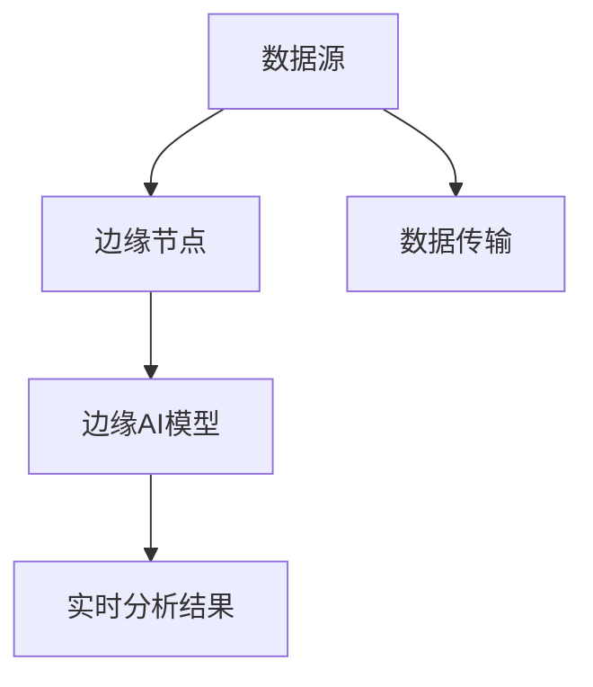

                 

## 1. 背景介绍

在现代社会，数据已经成为一种重要的生产要素，对数据进行实时分析和处理成为了企业和组织提升决策效率、优化运营流程的关键。然而，传统的数据处理和分析方法往往需要大规模的数据存储和计算资源，对于实时性和处理速度的要求也较高。边缘计算作为一种新兴的数据处理技术，能够在靠近数据源的地方进行数据处理，大幅提升了数据处理的实时性和效率，因此在多个领域得到了广泛应用。本文将聚焦于边缘计算在注意力实时分析中的应用，介绍其在提升数据处理速度、优化决策过程等方面的作用，以及面临的技术挑战和未来发展方向。

## 2. 核心概念与联系

### 2.1 核心概念概述

边缘计算(Edge Computing)是指在数据生成的源头，即终端设备或网络边缘节点上进行数据处理和分析的一种计算模式。它能够减少数据传输的延迟和带宽消耗，同时提升数据处理的实时性和可靠性。在边缘计算中，数据被就地处理和分析，处理结果直接发送到需要使用的终端设备或云端平台，减少了数据传输和存储的需求，同时提高了数据处理的效率和安全性。

注意力分析(Attention Analysis)是一种通过计算注意力权重，识别和分析数据集中关键特征和模式的技术。在深度学习和计算机视觉中，注意力机制被广泛应用于图像处理、语音识别、自然语言处理等领域，用于增强模型的推理能力、提高特征提取的精度。注意力分析的核心思想是通过计算注意力权重，引导模型关注数据中的关键部分，从而提升模型性能。

边缘AI是指在边缘计算环境中，结合人工智能技术进行数据处理和分析的模式。边缘AI能够充分利用边缘计算的实时性和高效性，结合AI模型的强大分析能力，实现对数据的快速处理和智能决策。

### 2.2 核心概念原理和架构的 Mermaid 流程图



这个流程图展示了边缘AI在注意力实时分析中的应用流程：
- 数据从数据源（如传感器、物联网设备、视频监控等）采集后，通过数据传输网络传输到边缘节点。
- 在边缘节点上，边缘AI模型对数据进行处理和分析，计算注意力权重，生成分析结果。
- 分析结果通过网络传输到需要使用的终端设备或云端平台，用于决策和控制。

## 3. 核心算法原理 & 具体操作步骤

### 3.1 算法原理概述

边缘AI在注意力实时分析中的应用，主要基于深度学习中的注意力机制。深度学习中的注意力机制通过计算注意力权重，引导模型关注数据集中的关键部分，从而提升模型的推理能力和特征提取的精度。在边缘AI中，注意力机制的应用更加灵活，可以在不消耗大量计算资源的情况下，快速计算注意力权重，生成实时分析结果。

### 3.2 算法步骤详解

以下是边缘AI在注意力实时分析中的具体操作步骤：

**Step 1: 数据采集与预处理**

1. 收集数据源（如传感器、摄像头、网络日志等）产生的原始数据。
2. 对数据进行预处理，包括数据清洗、格式转换、标准化等。
3. 对数据进行特征提取，将其转换为模型可用的输入格式。

**Step 2: 模型训练与优化**

1. 选择适合的深度学习模型，如卷积神经网络、循环神经网络等。
2. 在边缘节点或云端训练模型，对其进行参数调整和优化。
3. 对模型进行压缩和优化，减少其在边缘计算环境中的计算和存储需求。

**Step 3: 实时计算与分析**

1. 在边缘节点上部署训练好的模型，进行实时数据处理。
2. 计算数据集中的注意力权重，识别关键特征和模式。
3. 生成实时分析结果，并将结果传输到需要使用的终端设备或云端平台。

**Step 4: 结果反馈与决策**

1. 将实时分析结果用于决策和控制，如自动化生产、智能交通、安全监控等。
2. 收集决策结果，进行效果评估和反馈，优化模型和算法。
3. 根据反馈结果，对模型进行迭代和优化，提升分析精度和实时性。

### 3.3 算法优缺点

#### 3.3.1 优点

1. 实时性高：边缘AI能够直接在数据生成的源头进行计算，大大减少了数据传输和存储的需求，提升了数据处理的实时性。
2. 灵活性高：边缘AI可以根据不同的应用场景进行定制化部署，满足不同领域的需求。
3. 安全性好：边缘AI处理的数据一般存储在本地，减少了数据泄露的风险。
4. 低成本：边缘AI能够利用边缘节点的计算资源，避免了在云端进行大规模计算的开销。

#### 3.3.2 缺点

1. 计算资源有限：边缘节点的计算和存储资源相对有限，可能无法支持复杂模型和大规模数据。
2. 数据隐私问题：边缘AI在本地处理数据，可能存在数据隐私和泄露的风险。
3. 维护难度高：边缘节点的分布式特性增加了系统维护的复杂度。
4. 跨平台兼容性差：边缘AI的部署需要考虑到不同平台和设备的兼容性问题。

### 3.4 算法应用领域

边缘AI在注意力实时分析中的应用，已经在多个领域得到了广泛应用。例如：

- 智能交通：在交通路口部署边缘AI设备，实时分析交通数据，进行交通流量控制和优化。
- 工业制造：在工业生产线上部署边缘AI设备，实时监控设备状态，预测设备故障，优化生产流程。
- 智能家居：在智能家居设备中部署边缘AI，实时分析环境数据，提供个性化服务。
- 医疗健康：在医疗设备中部署边缘AI，实时监测病人健康数据，提供实时诊断和建议。
- 智慧城市：在智慧城市系统中部署边缘AI，实时分析城市运行数据，进行城市管理和决策。

## 4. 数学模型和公式 & 详细讲解

### 4.1 数学模型构建

在边缘AI的注意力实时分析中，通常使用注意力机制进行特征提取和模式识别。常用的注意力模型包括自注意力模型、多头自注意力模型、双向注意力模型等。

以多头自注意力模型为例，其数学模型如下：

$$
\text{Attention}(Q, K, V) = \text{softmax}(\frac{QK^T}{\sqrt{d_k}})V
$$

其中，$Q, K, V$ 分别表示查询向量、键向量和值向量，$d_k$ 表示键向量的维度。注意力机制通过计算注意力权重，对数据集中的关键部分进行加权处理，生成注意力权重矩阵。

### 4.2 公式推导过程

以多头自注意力模型的推导为例，注意力权重矩阵的计算过程如下：

1. 将查询向量 $Q$ 与键向量 $K$ 进行点积计算，得到矩阵 $QK^T$。
2. 将 $QK^T$ 除以 $\sqrt{d_k}$，得到矩阵 $QK^T/\sqrt{d_k}$。
3. 对 $QK^T/\sqrt{d_k}$ 进行 softmax 运算，得到注意力权重矩阵。
4. 将注意力权重矩阵与值向量 $V$ 进行矩阵乘法运算，得到注意力结果向量。

### 4.3 案例分析与讲解

以智能交通中的实时交通流量分析为例，边缘AI可以通过计算注意力权重，识别关键路段和关键时间点的交通流量数据，从而进行实时交通流量控制和优化。具体实现步骤如下：

1. 在交通路口部署边缘AI设备，收集交通摄像头和传感器产生的实时数据。
2. 对数据进行预处理，包括数据清洗、格式转换、标准化等。
3. 使用自注意力模型计算注意力权重，识别关键路段和关键时间点的交通流量数据。
4. 根据注意力权重，生成实时交通流量分析结果，进行交通流量控制和优化。

## 5. 项目实践：代码实例和详细解释说明

### 5.1 开发环境搭建

边缘AI的注意力实时分析项目开发环境搭建包括以下步骤：

1. 安装Python和相关依赖包，如TensorFlow、Keras、Scikit-learn等。
2. 配置边缘计算设备，如树莓派、NVIDIA Jetson等。
3. 安装GPU驱动和相关软件包，确保设备支持深度学习模型的训练和推理。

### 5.2 源代码详细实现

以下是使用Python和TensorFlow实现边缘AI在智能交通中实时交通流量分析的代码实现：

```python
import tensorflow as tf
from tensorflow.keras.layers import Input, Dense, MultiHeadAttention
from tensorflow.keras.models import Model

# 定义输入层
input_seq = Input(shape=(None, 10))

# 定义多头自注意力层
query = Dense(256)(input_seq)
key = Dense(256)(input_seq)
value = Dense(256)(input_seq)
attention = MultiHeadAttention(num_heads=4, key_dim=64)(query, key, value)

# 定义输出层
output_seq = Dense(1, activation='sigmoid')(attention)

# 定义模型
model = Model(inputs=input_seq, outputs=output_seq)

# 编译模型
model.compile(optimizer='adam', loss='binary_crossentropy', metrics=['accuracy'])

# 训练模型
model.fit(x_train, y_train, epochs=10, batch_size=32)

# 推理模型
y_pred = model.predict(x_test)
```

### 5.3 代码解读与分析

上述代码实现了多头自注意力模型在智能交通中实时交通流量分析的应用。具体解读如下：

1. 定义输入层，表示交通流量数据的序列长度为None，特征维度为10。
2. 定义多头自注意力层，将输入序列进行多头自注意力计算，得到注意力结果向量。
3. 定义输出层，将注意力结果向量进行二分类处理，输出交通流量分析结果。
4. 编译模型，使用Adam优化器和二分类交叉熵损失函数进行训练。
5. 训练模型，使用训练数据进行模型训练。
6. 推理模型，使用测试数据进行模型推理，生成交通流量分析结果。

## 6. 实际应用场景

### 6.1 智能交通

边缘AI在智能交通中的应用场景包括交通流量控制、交通信号优化、交通事故预警等。通过在交通路口部署边缘AI设备，实时分析交通数据，可以提升交通管理效率，减少交通拥堵和事故发生率。

### 6.2 工业制造

边缘AI在工业制造中的应用场景包括设备状态监测、生产流程优化、质量控制等。通过在生产线上部署边缘AI设备，实时分析生产数据，可以提升生产效率，降低生产成本。

### 6.3 智能家居

边缘AI在智能家居中的应用场景包括环境监测、智能控制、用户行为分析等。通过在智能家居设备中部署边缘AI，实时分析环境数据，可以提供个性化服务，提升用户生活品质。

### 6.4 未来应用展望

边缘AI在注意力实时分析中的应用前景广阔，未来将会在更多领域得到应用。例如：

- 智慧医疗：实时监测病人生理数据，进行智能诊断和治疗。
- 智慧农业：实时分析土壤和气象数据，进行精准农业管理。
- 智能物流：实时分析物流数据，进行货物追踪和优化。
- 智能城市：实时分析城市运行数据，进行城市管理和决策。

## 7. 工具和资源推荐

### 7.1 学习资源推荐

为了帮助开发者系统掌握边缘AI在注意力实时分析中的相关技术，以下是一些优质的学习资源：

1. TensorFlow官方文档：提供了完整的TensorFlow库使用方法和深度学习模型实现。
2. PyTorch官方文档：提供了PyTorch库的使用方法和深度学习模型实现。
3. Keras官方文档：提供了Keras库的使用方法和深度学习模型实现。
4. Kaggle：提供了丰富的深度学习竞赛和数据集，可以用于练习和实践。
5. Coursera深度学习课程：由斯坦福大学开设，涵盖了深度学习基础和前沿技术。

### 7.2 开发工具推荐

边缘AI在注意力实时分析的开发工具推荐如下：

1. TensorFlow：提供了强大的深度学习库，支持分布式计算和GPU加速。
2. Keras：提供了简单易用的深度学习模型实现，适合快速原型开发。
3. PyTorch：提供了动态计算图和丰富的深度学习模型，适合科研和工程应用。
4. Scikit-learn：提供了常用的机器学习算法和工具，适合数据分析和特征工程。

### 7.3 相关论文推荐

以下是几篇与边缘AI在注意力实时分析相关的经典论文，推荐阅读：

1. Attention is All You Need：提出了自注意力机制，开启了注意力模型在深度学习中的广泛应用。
2. Transformer-XL: Attentive Language Models: Global Views Without Global Computations：提出Transformer-XL模型，引入了长距离注意力机制，解决了长期依赖问题。
3. A Neural Algorithm of Artistic Style：提出神经风格迁移算法，将图像风格转换问题转化为深度学习问题。
4. The Anatomy of Text: Character-level Representations in Transformer Models：深入分析了Transformer模型中字符级别的表示学习。
5. Structured Attention with Transformer-XL：提出了结构化注意力机制，提高了Transformer模型的推理能力。

这些论文代表了边缘AI在注意力实时分析领域的理论进展和技术突破。通过学习这些前沿成果，可以帮助研究者更好地理解注意力机制的应用，并应用于实际项目中。

## 8. 总结：未来发展趋势与挑战

### 8.1 总结

本文对边缘AI在注意力实时分析中的应用进行了全面系统的介绍。首先阐述了边缘计算和注意力分析的核心概念，介绍了边缘AI在注意力实时分析中的作用和应用场景。其次，从原理到实践，详细讲解了边缘AI在注意力实时分析中的具体操作步骤和实现方法。同时，本文还探讨了边缘AI在实际应用中面临的技术挑战和未来发展方向。

通过本文的系统梳理，可以看到，边缘AI在注意力实时分析中的应用具有广泛的前景，能够在多个领域提升数据处理和决策的效率和精度。未来，伴随深度学习技术和边缘计算技术的不断发展，边缘AI在注意力实时分析中的应用将会更加深入和广泛。

### 8.2 未来发展趋势

展望未来，边缘AI在注意力实时分析领域的发展趋势包括：

1. 深度学习模型的优化和压缩：边缘计算环境资源有限，未来需要在模型优化和压缩方面进行更多的研究和探索。
2. 多模态数据的融合：边缘AI在注意力实时分析中，可以与其他模态的数据（如视觉、语音、文本等）进行融合，提升综合分析能力。
3. 边缘计算与云计算的结合：边缘AI与云计算的结合，可以提升数据处理的效率和性能，满足不同领域的需求。
4. 联邦学习的应用：在边缘计算环境中，可以采用联邦学习技术，保护数据隐私和安全。
5. 跨平台和跨设备的兼容性：边缘AI需要具备跨平台和跨设备的兼容性，方便部署和维护。

### 8.3 面临的挑战

尽管边缘AI在注意力实时分析中的应用前景广阔，但在实际应用中仍面临诸多挑战：

1. 计算资源有限：边缘计算环境资源有限，可能无法支持复杂模型和大规模数据。
2. 数据隐私问题：边缘AI在本地处理数据，可能存在数据隐私和泄露的风险。
3. 维护难度高：边缘AI的分布式特性增加了系统维护的复杂度。
4. 跨平台兼容性差：边缘AI的部署需要考虑到不同平台和设备的兼容性问题。
5. 算力与存储限制：边缘计算环境算力和存储资源有限，可能影响模型的训练和推理。

### 8.4 研究展望

未来的研究需要在以下几个方面寻求新的突破：

1. 模型优化与压缩：开发更加高效的模型压缩和优化方法，减小计算和存储需求。
2. 数据隐私保护：采用联邦学习等技术，保护数据隐私和安全。
3. 跨平台兼容性：提升边缘AI的跨平台和跨设备兼容性，方便部署和维护。
4. 多模态融合：将视觉、语音、文本等多模态数据进行融合，提升综合分析能力。
5. 实时性和高效性：提升边缘AI在实时处理和优化方面的能力，满足不同领域的需求。

这些研究方向的探索，必将引领边缘AI在注意力实时分析领域迈向更高的台阶，为构建高效、智能、可靠的系统铺平道路。面向未来，我们需要在算法、硬件、软件等多个方面进行深入研究，共同推动边缘AI在注意力实时分析中的应用和发展。

## 9. 附录：常见问题与解答

**Q1: 边缘AI在注意力实时分析中，如何优化模型计算资源的使用？**

A: 边缘AI在注意力实时分析中，可以通过以下几个方法优化模型计算资源的使用：

1. 模型压缩和优化：采用剪枝、量化等技术，减小模型参数量，提升推理速度。
2. 分布式计算：在多个边缘节点上部署模型，利用分布式计算提高处理能力。
3. 硬件加速：使用GPU、TPU等硬件加速设备，提升模型计算速度。
4. 模型剪枝和量化：通过剪枝和量化技术，减少模型计算量，提高计算效率。

这些方法可以结合使用，根据不同的应用场景进行优化，提升边缘AI的计算资源使用效率。

**Q2: 边缘AI在注意力实时分析中，如何保护数据隐私和安全？**

A: 边缘AI在注意力实时分析中，可以通过以下几个方法保护数据隐私和安全：

1. 数据加密：在数据传输和存储过程中，采用加密技术，保护数据隐私。
2. 联邦学习：采用联邦学习技术，在边缘节点上进行模型训练，保护数据隐私。
3. 访问控制：对数据访问进行严格控制，防止未授权访问。
4. 审计和监控：实时监控数据访问和使用情况，防止数据泄露和滥用。

这些方法可以结合使用，根据不同的应用场景进行优化，提升边缘AI的数据隐私和安全保障。

**Q3: 边缘AI在注意力实时分析中，如何提高模型的跨平台和跨设备兼容性？**

A: 边缘AI在注意力实时分析中，可以通过以下几个方法提高模型的跨平台和跨设备兼容性：

1. 标准化的模型格式：采用标准化的模型格式，如TensorFlow SavedModel、ONNX等，方便不同平台和设备使用。
2. 跨平台的API设计：采用跨平台的API设计，实现不同平台和设备之间的数据交换和通信。
3. 自动化部署工具：采用自动化部署工具，如Ansible、Docker等，方便模型在不同平台和设备上的部署和维护。
4. 多设备测试：在多个设备和平台上进行测试，保证模型的兼容性和稳定性。

这些方法可以结合使用，根据不同的应用场景进行优化，提升边缘AI的跨平台和跨设备兼容性。

---

作者：禅与计算机程序设计艺术 / Zen and the Art of Computer Programming

