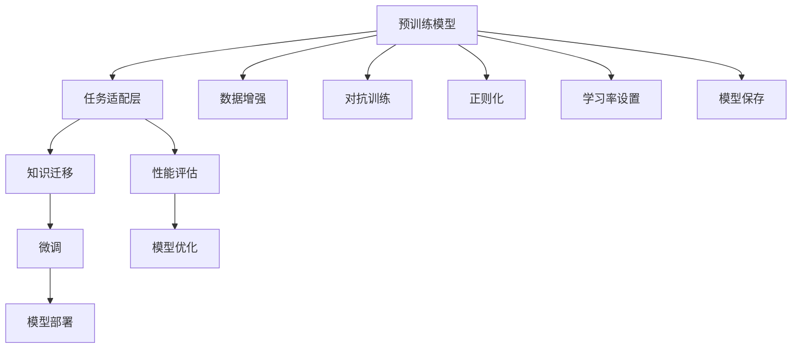

                 

## 1. 背景介绍

在当今数据驱动的AI领域，迁移学习（Transfer Learning）已成为深度学习中的一项重要技术。迁移学习利用从源任务中学到的知识，迁移到目标任务中，从而在不标注新数据的情况下，提高模型在目标任务上的性能。近年来，随着预训练模型的发展，迁移学习的应用范围和效果都在不断提升，广泛应用于图像识别、自然语言处理、语音识别等多个领域。

迁移学习的核心理念是“知识共享”，即将在大规模数据上预训练出的通用知识，应用于特定领域或小规模数据上，从而加速模型训练，提升模型性能。这一理念与人类学习过程有着高度的相似性，符合“学以致用”的原理，使得迁移学习成为了AI研究的热点领域。

## 2. 核心概念与联系

### 2.1 核心概念概述

迁移学习的核心概念包括预训练模型、任务适配层、知识迁移、微调等。

- **预训练模型**：在大规模数据上预训练出的深度学习模型，例如BERT、GPT等，具备强大的通用知识表示能力。
- **任务适配层**：根据目标任务的特定需求，在预训练模型的基础上添加新的输出层和损失函数，使其能够适应新的任务。
- **知识迁移**：将预训练模型的通用知识迁移到新的任务中，从而提升模型在目标任务上的性能。
- **微调**：在预训练模型的基础上，使用目标任务的数据进行有监督学习，进一步优化模型在特定任务上的表现。

这些概念之间存在密切联系，共同构成了迁移学习的理论基础和技术框架。预训练模型提供了通用的知识表示，任务适配层为迁移提供了具体的方法和策略，知识迁移和微调则是迁移学习在实践中的应用。

### 2.2 核心概念原理和架构的 Mermaid 流程图



此图展示了预训练模型、任务适配层、知识迁移、微调之间的关系，以及相关的预处理和后处理步骤。

## 3. 核心算法原理 & 具体操作步骤

### 3.1 算法原理概述

迁移学习的基本原理是，将预训练模型在源任务上学习到的知识，通过任务适配层迁移到目标任务中。具体来说，可以按照以下步骤进行：

1. 选择预训练模型：根据目标任务的特性，选择合适的预训练模型，如BERT、GPT等。
2. 添加任务适配层：在预训练模型的基础上，添加新的输出层和损失函数，以适应目标任务的需求。
3. 微调：在目标任务的数据集上，使用有监督学习进行微调，进一步优化模型性能。
4. 评估和优化：在验证集和测试集上评估模型性能，根据评估结果进行模型优化。

### 3.2 算法步骤详解

#### 3.2.1 选择预训练模型

根据目标任务的特性，选择合适的预训练模型。例如，对于文本分类任务，可以选择BERT等预训练语言模型；对于图像识别任务，可以选择VGG、ResNet等预训练卷积神经网络。

#### 3.2.2 添加任务适配层

在预训练模型的基础上，添加新的输出层和损失函数，以适应目标任务的需求。例如，对于文本分类任务，可以在BERT模型的最后一层添加全连接层和softmax激活函数，以进行多分类任务。

#### 3.2.3 微调

在目标任务的数据集上，使用有监督学习进行微调。具体步骤包括：

1. 数据预处理：将目标任务的数据集进行预处理，如分词、归一化、拼接等。
2. 训练：使用目标任务的数据集，在预训练模型的基础上进行微调训练。
3. 验证和优化：在验证集上评估模型性能，根据评估结果进行模型优化，如调整学习率、正则化强度等。
4. 测试：在测试集上评估模型性能，输出最终结果。

#### 3.2.4 评估和优化

在验证集和测试集上评估模型性能，根据评估结果进行模型优化。可以使用各种指标，如准确率、精确率、召回率、F1-score等，来衡量模型性能。

### 3.3 算法优缺点

迁移学习具有以下优点：

1. **减少标注成本**：相比于从头训练模型，迁移学习可以利用预训练模型学习到的通用知识，减少标注新数据的成本。
2. **提高模型性能**：通过迁移学习，可以加速模型训练，提高模型在目标任务上的性能。
3. **适用范围广**：迁移学习适用于多种任务和领域，可以应用于图像识别、自然语言处理、语音识别等多个领域。

同时，迁移学习也存在以下缺点：

1. **数据不平衡**：如果目标任务与源任务的数据分布差异较大，迁移学习的效果可能不佳。
2. **模型过拟合**：如果目标任务的数据集较小，迁移学习可能会发生过拟合。
3. **模型鲁棒性不足**：迁移学习的模型可能对目标任务中的噪声和干扰较为敏感。

### 3.4 算法应用领域

迁移学习已经在多个领域得到广泛应用，包括：

- **计算机视觉**：利用预训练的图像识别模型，对新的图像进行分类、检测、分割等任务。
- **自然语言处理**：利用预训练的语言模型，对新的文本进行情感分析、文本分类、机器翻译等任务。
- **语音识别**：利用预训练的语音识别模型，对新的语音进行语音转文字、语音情感识别等任务。
- **医疗诊断**：利用预训练的图像识别模型，对医疗图像进行疾病诊断、病变分析等任务。
- **金融分析**：利用预训练的情感分析模型，对金融文本进行情感倾向分析、舆情监测等任务。

## 4. 数学模型和公式 & 详细讲解 & 举例说明

### 4.1 数学模型构建

在迁移学习中，通常使用分类问题作为示例。假设源任务的数据集为 $D_s$，目标任务的数据集为 $D_t$，预训练模型的参数为 $\theta$，任务适配层的参数为 $\alpha$，目标任务的数据集为 $D_t$，目标任务的损失函数为 $L_t$。迁移学习的目标是最大化目标任务的性能，即：

$$
\min_{\theta, \alpha} \mathcal{L}_t(\theta, \alpha) = \frac{1}{N_t} \sum_{i=1}^{N_t} L_t(\theta \circ \alpha(x_i), y_i)
$$

其中，$N_t$ 为目标任务的数据集大小，$L_t$ 为目标任务的损失函数，$x_i$ 为目标任务的输入，$y_i$ 为目标任务的输出，$\circ$ 表示任务适配层的操作。

### 4.2 公式推导过程

为了最大化目标任务的性能，可以使用梯度下降算法来更新参数。假设学习率为 $\eta$，则参数的更新公式为：

$$
\theta \leftarrow \theta - \eta \nabla_{\theta} \mathcal{L}_t(\theta, \alpha) - \eta \lambda \theta
$$

其中，$\nabla_{\theta} \mathcal{L}_t(\theta, \alpha)$ 为目标任务损失函数对参数 $\theta$ 的梯度，$\lambda$ 为正则化系数，用于避免过拟合。

### 4.3 案例分析与讲解

以文本分类为例，假设使用BERT预训练模型进行迁移学习。具体步骤如下：

1. 将BERT的输出层替换为全连接层，并添加softmax激活函数，用于多分类任务。
2. 在目标任务的数据集上，使用有监督学习进行微调训练。
3. 在验证集上评估模型性能，根据评估结果进行模型优化。
4. 在测试集上评估模型性能，输出最终结果。

## 5. 项目实践：代码实例和详细解释说明

### 5.1 开发环境搭建

在进行迁移学习实践前，需要准备好开发环境。以下是使用Python进行TensorFlow开发的环境配置流程：

1. 安装Anaconda：从官网下载并安装Anaconda，用于创建独立的Python环境。
2. 创建并激活虚拟环境：
```bash
conda create -n tensorflow-env python=3.8 
conda activate tensorflow-env
```
3. 安装TensorFlow：根据CUDA版本，从官网获取对应的安装命令。例如：
```bash
conda install tensorflow==2.7 -c tf
```
4. 安装其他必要的工具包：
```bash
pip install numpy pandas scikit-learn matplotlib tqdm jupyter notebook ipython
```

完成上述步骤后，即可在`tensorflow-env`环境中进行迁移学习的开发和实践。

### 5.2 源代码详细实现

以下是一个简单的迁移学习项目，使用TensorFlow和Keras实现。

首先，定义数据集：

```python
import numpy as np
from sklearn.datasets import fetch_20newsgroups

categories = ['alt.atheism', 'soc.religion.christian', 'comp.graphics', 'sci.med']
newsgroups_train = fetch_20newsgroups(subset='train', categories=categories)
newsgroups_test = fetch_20newsgroups(subset='test', categories=categories)

# 将文本数据转换为numpy数组
vocab_size = 10000
tokenizer = tf.keras.preprocessing.text.Tokenizer(num_words=vocab_size)
tokenizer.fit_on_texts(newsgroups_train.data)
sequences = tokenizer.texts_to_sequences(newsgroups_train.data)
word_index = tokenizer.word_index
sequences = tf.keras.preprocessing.sequence.pad_sequences(sequences, maxlen=1000)

X_train = sequences
y_train = tf.keras.utils.to_categorical(newsgroups_train.target, 4)

vocab_size = len(word_index) + 1
tokenizer_test = tf.keras.preprocessing.text.Tokenizer(num_words=vocab_size)
tokenizer_test.fit_on_texts(newsgroups_test.data)
sequences_test = tokenizer_test.texts_to_sequences(newsgroups_test.data)
word_index = tokenizer_test.word_index
sequences_test = tf.keras.preprocessing.sequence.pad_sequences(sequences_test, maxlen=1000)

X_test = sequences_test
y_test = tf.keras.utils.to_categorical(newsgroups_test.target, 4)
```

然后，定义模型：

```python
from tensorflow.keras.models import Sequential
from tensorflow.keras.layers import Embedding, LSTM, Dense, Dropout

model = Sequential()
model.add(Embedding(vocab_size, 64, input_length=1000))
model.add(LSTM(64, dropout=0.2, recurrent_dropout=0.2))
model.add(Dense(4, activation='softmax'))
```

接着，定义损失函数和优化器：

```python
from tensorflow.keras.optimizers import Adam

loss_fn = 'categorical_crossentropy'
optimizer = Adam(lr=0.001)
```

最后，定义训练和评估函数：

```python
def train_epoch(model, X_train, y_train, batch_size):
    train_dataset = tf.data.Dataset.from_tensor_slices((X_train, y_train)).shuffle(1000).batch(batch_size)
    model.fit(train_dataset, epochs=5, batch_size=batch_size)
    
def evaluate(model, X_test, y_test, batch_size):
    test_dataset = tf.data.Dataset.from_tensor_slices((X_test, y_test)).batch(batch_size)
    _, accuracy = model.evaluate(test_dataset, verbose=0)
    print('Test accuracy:', accuracy)
```

运行代码：

```python
train_epoch(model, X_train, y_train, batch_size=128)
evaluate(model, X_test, y_test, batch_size=128)
```

### 5.3 代码解读与分析

让我们再详细解读一下关键代码的实现细节：

**数据预处理**：
- 首先，从sklearn库中获取20个新组数据集，将其划分为训练集和测试集。
- 使用Tokenizer将文本转换为numpy数组，并进行填充，保证输入序列长度一致。
- 将标签进行one-hot编码，转换为适合模型的格式。

**模型定义**：
- 使用Sequential模型，依次添加嵌入层、LSTM层和全连接层。
- 嵌入层将文本转换为向量表示，LSTM层进行序列建模，全连接层输出分类结果。
- 使用Dropout层防止过拟合。

**训练和评估函数**：
- 使用TensorFlow的Dataset API构建数据集，支持并行加载和处理数据。
- 在训练集上使用Adam优化器进行训练，并设置epoch和batch_size。
- 在测试集上评估模型性能，并输出测试准确率。

**运行结果展示**：
- 训练5个epoch后，输出训练和测试结果，评估模型性能。

## 6. 实际应用场景

### 6.1 智能客服系统

智能客服系统可以通过迁移学习快速构建和优化。传统的客服系统依赖大量人工客服，成本高、效率低。而使用迁移学习，可以在现有客服对话数据上训练模型，使机器人能够理解和响应客户问题，提升服务质量和效率。

具体步骤包括：
- 收集客服对话数据。
- 使用迁移学习训练模型。
- 将模型集成到客服系统中，实时响应客户查询。
- 持续收集新对话数据，定期更新模型，以提升系统性能。

### 6.2 金融舆情监测

金融舆情监测需要实时监测市场动态，及时发现异常情况，避免损失。迁移学习可以通过预训练的情感分析模型，在少量标注数据上训练，实现对金融文本的情感分析，监测舆情变化。

具体步骤包括：
- 收集金融新闻和评论数据。
- 使用迁移学习训练情感分析模型。
- 实时抓取金融文本，使用模型分析情感倾向。
- 根据情感分析结果，设置预警阈值，及时应对风险。

### 6.3 个性化推荐系统

个性化推荐系统需要考虑用户兴趣和行为数据，为用户推荐个性化内容。迁移学习可以利用预训练的文本表示，在少量用户行为数据上训练，提升推荐精度。

具体步骤包括：
- 收集用户行为数据。
- 使用迁移学习训练文本表示模型。
- 使用模型计算用户兴趣，推荐个性化内容。
- 持续收集用户反馈，优化推荐模型。

## 7. 工具和资源推荐

### 7.1 学习资源推荐

为了帮助开发者系统掌握迁移学习的理论基础和实践技巧，这里推荐一些优质的学习资源：

1. 《深度学习》系列博文：由大模型技术专家撰写，深入浅出地介绍了迁移学习的基本原理和应用场景。
2. 《迁移学习》课程：斯坦福大学开设的深度学习课程，讲解了迁移学习的核心概念和算法。
3. 《迁移学习》书籍：相关领域的经典书籍，全面介绍了迁移学习的基本理论和实际应用。
4. TensorFlow官方文档：TensorFlow的官方文档，提供了迁移学习的基本教程和样例代码。
5. PyTorch官方文档：PyTorch的官方文档，提供了迁移学习的基本教程和样例代码。

通过对这些资源的学习实践，相信你一定能够快速掌握迁移学习的精髓，并用于解决实际的NLP问题。

### 7.2 开发工具推荐

高效的开发离不开优秀的工具支持。以下是几款用于迁移学习开发的常用工具：

1. TensorFlow：谷歌开发的深度学习框架，支持分布式训练和多种优化器，适用于大规模工程应用。
2. PyTorch：Facebook开发的深度学习框架，支持动态图和静态图，适用于快速迭代研究。
3. Keras：高层深度学习框架，提供简单易用的API，适用于快速原型开发。
4. Jupyter Notebook：交互式笔记本，支持代码、文本、图片等多种格式，便于分享和学习。
5. TensorBoard：TensorFlow配套的可视化工具，实时监测模型训练状态，提供丰富的图表呈现方式。

合理利用这些工具，可以显著提升迁移学习的开发效率，加快创新迭代的步伐。

### 7.3 相关论文推荐

迁移学习在多个领域的研究成果丰富，以下是几篇奠基性的相关论文，推荐阅读：

1. Fine-tune Pre-trained Word Vectors for Named Entity Recognition：使用迁移学习训练命名实体识别模型。
2. Deep residual learning for image recognition：使用迁移学习训练图像分类模型。
3. Neural Architecture Search with Reinforcement Learning：使用迁移学习优化神经网络结构。
4. Knowledge Distillation for Efficient Image Classification：使用迁移学习优化图像分类模型。
5. Feature Pyramid Networks for Object Detection：使用迁移学习优化目标检测模型。

这些论文代表了大规模迁移学习的研究成果，展示了迁移学习在不同领域的应用效果。

## 8. 总结：未来发展趋势与挑战

### 8.1 总结

本文对迁移学习的原理和实践进行了全面系统的介绍。首先阐述了迁移学习的背景和意义，明确了迁移学习在提高模型性能、减少标注成本等方面的独特优势。其次，从原理到实践，详细讲解了迁移学习的数学模型和操作步骤，给出了迁移学习任务开发的完整代码实例。同时，本文还广泛探讨了迁移学习在智能客服、金融舆情、个性化推荐等多个行业领域的应用前景，展示了迁移学习的广阔应用场景。此外，本文精选了迁移学习技术的各类学习资源，力求为读者提供全方位的技术指引。

通过本文的系统梳理，可以看到，迁移学习技术在深度学习中的应用广泛且效果显著。它不仅加速了模型训练，还降低了标注数据的需求，成为了深度学习领域的重要技术。未来，伴随迁移学习技术的不断演进，相信其在更多领域的应用将更加广泛，为人工智能技术的落地应用带来更多可能性。

### 8.2 未来发展趋势

展望未来，迁移学习将呈现以下几个发展趋势：

1. 预训练模型的规模将持续增大。随着算力成本的下降和数据规模的扩张，预训练模型的参数量还将持续增长，为迁移学习提供更强大的知识表示能力。
2. 迁移学习的应用领域将更加多样化。除了图像识别、文本分类等传统领域，迁移学习还将应用于智能推荐、医疗诊断、自然语言生成等新兴领域。
3. 迁移学习的算法和技术将不断演进。未来将出现更多参数高效和计算高效的迁移学习方法，提高迁移学习的效率和效果。
4. 迁移学习的模型将更具可解释性。未来的迁移学习模型将能够提供更清晰的知识迁移路径和解释，提高模型的可信度。
5. 迁移学习的理论将更加深入。未来的研究将更多地关注迁移学习的机理和优化算法，提高模型的泛化能力和鲁棒性。

以上趋势凸显了迁移学习技术的广阔前景。这些方向的探索发展，必将进一步提升迁移学习的性能和应用范围，为人工智能技术的发展提供更多动力。

### 8.3 面临的挑战

尽管迁移学习已经取得了显著成果，但在迈向更加智能化、普适化应用的过程中，它仍面临诸多挑战：

1. 数据不平衡问题。如果目标任务与源任务的数据分布差异较大，迁移学习的效果可能不佳。
2. 模型过拟合问题。如果目标任务的数据集较小，迁移学习可能会发生过拟合。
3. 模型鲁棒性问题。迁移学习的模型可能对目标任务中的噪声和干扰较为敏感，鲁棒性不足。
4. 模型可解释性问题。迁移学习的模型难以提供清晰的知识迁移路径和解释，可解释性不足。
5. 模型参数量问题。预训练模型的参数量较大，迁移学习需要大量的计算资源。

以上挑战需要未来研究进一步突破，才能使迁移学习技术更好地应用于实际问题。

### 8.4 研究展望

面对迁移学习面临的诸多挑战，未来的研究需要在以下几个方面寻求新的突破：

1. 研究更加高效的迁移学习算法和技术，提高迁移学习的效率和效果。
2. 探索更多预训练模型和任务适配层的优化方法，提高迁移学习的泛化能力和鲁棒性。
3. 深入研究迁移学习的机理和理论，提供更清晰的知识迁移路径和解释。
4. 开发更加高效的迁移学习工具和资源，降低迁移学习的开发和部署成本。

这些研究方向将推动迁移学习技术的不断演进，为人工智能技术的落地应用提供更多可能性。

## 9. 附录：常见问题与解答

**Q1：迁移学习是否适用于所有NLP任务？**

A: 迁移学习适用于大多数NLP任务，特别是数据量较小的任务。对于数据量较大的任务，如大规模文本分类，可以从零开始的从头训练获得更好的效果。

**Q2：如何选择合适的预训练模型？**

A: 根据目标任务的特性，选择合适的预训练模型。例如，对于文本分类任务，可以选择BERT等预训练语言模型；对于图像识别任务，可以选择VGG、ResNet等预训练卷积神经网络。

**Q3：如何在迁移学习中避免过拟合？**

A: 可以在目标任务的数据集上，使用数据增强、正则化、对抗训练等方法，防止模型过拟合。

**Q4：迁移学习中的知识迁移机制是怎样的？**

A: 迁移学习利用源任务中学到的通用知识，迁移到目标任务中。具体来说，在预训练模型的基础上，添加新的输出层和损失函数，使用目标任务的数据集进行微调训练，从而优化模型在特定任务上的性能。

**Q5：迁移学习的效果如何评估？**

A: 在验证集和测试集上评估模型性能，使用各种指标，如准确率、精确率、召回率、F1-score等，衡量模型性能。

---

作者：禅与计算机程序设计艺术 / Zen and the Art of Computer Programming

