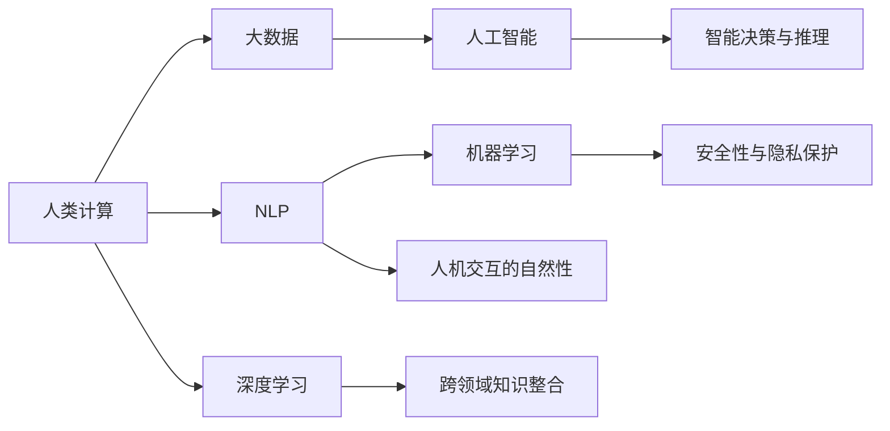

                 

# 连接人类智慧的纽带：人类计算的协作精神

> 关键词：人类计算,协作,智慧,大数据,人工智能,自然语言处理(NLP),机器学习,深度学习

## 1. 背景介绍

### 1.1 问题由来
随着科技的飞速发展，人类社会已经进入了一个新的阶段——数字时代。在这个时代，数据成为了最重要的生产要素之一。如何高效地利用和管理这些数据，成为了各个行业面临的重大挑战。特别是在大数据和人工智能的推动下，人类计算（Human-Computer Interaction, HCI）正在经历一场深刻的变革。

人类计算的核心理念是通过人与机器的协同工作，实现知识的共享和智慧的融合。在过去几十年里，这一理念已经在各个领域得到了广泛的应用，从简单的计算器到复杂的计算机辅助设计系统，人类计算已经成为人类智慧和机器智能之间不可分割的桥梁。

### 1.2 问题核心关键点
当前，人类计算已经进入了一个新的发展阶段。面对海量数据的涌现和复杂任务的挑战，如何构建更高效、更智能、更人性化的计算系统，成为了研究者们关注的焦点。以下是在这一背景下，人类计算面临的几个关键问题：

1. **数据高效处理与存储**：在数据量呈指数级增长的今天，如何快速高效地处理和存储数据，成为首要挑战。

2. **人机交互的自然性**：如何使机器更好地理解和响应人类的需求，实现自然、流畅的人机交互，是实现智能计算的关键。

3. **智能决策与推理**：在数据驱动的决策过程中，如何引入人类智慧，使得计算系统具备更强的推理和决策能力。

4. **安全性与隐私保护**：在数据共享与协作过程中，如何确保数据的安全性和用户的隐私保护，是一个不容忽视的问题。

5. **跨领域知识整合**：如何整合不同领域的专业知识，构建更全面、更准确的计算模型，是实现智能计算的重要步骤。

这些问题不仅关系到技术的进步，更关乎人类社会的可持续发展。如何构建一个既能高效处理数据，又能充分尊重和利用人类智慧的计算系统，成为了人类计算研究的前沿方向。

## 2. 核心概念与联系

### 2.1 核心概念概述

为了更好地理解人类计算的概念和应用，我们需要先了解一些核心概念。以下是对这些概念的概述：

- **人类计算**：指通过人与计算机之间的协作，实现计算任务的过程。人类计算强调人机交互的自然性和智能性，旨在构建更加友好、高效、智能的计算环境。

- **大数据**：指规模巨大、类型多样的数据集。大数据的特征包括“4V”（Volume, Velocity, Variety, Veracity），即数据量大、速度快、多样性强、价值高。

- **人工智能**：指通过机器学习和深度学习等技术，使计算机具备类似于人类的智能能力，包括理解、推理、决策等。

- **自然语言处理(NLP)**：指让计算机能够理解和处理人类语言的技术。NLP是实现人机交互的重要手段，也是人工智能的重要分支。

- **机器学习**：指通过数据驱动的方式，使计算机具备学习能力和适应能力。机器学习在数据挖掘、图像识别、语音识别等领域有广泛应用。

- **深度学习**：一种特殊的机器学习方法，通过多层神经网络实现数据的高级抽象和特征提取。深度学习在计算机视觉、自然语言处理等领域表现优异。

- **跨领域知识整合**：指将不同领域的专业知识和技术进行有机整合，构建更加全面、准确的计算模型。

这些概念之间有着紧密的联系，共同构成了人类计算的核心框架。通过理解这些概念，我们可以更好地把握人类计算的研究方向和技术路径。

### 2.2 核心概念原理和架构的 Mermaid 流程图

以下是一个简单的 Mermaid 流程图，展示了这些核心概念之间的联系：



这个流程图展示了人类计算中各个核心概念之间的相互作用。大数据和人工智能是基础，而NLP、机器学习和深度学习是核心技术手段。跨领域知识整合则提供了更全面的知识支持，智能决策与推理则实现了计算系统的智能应用。人机交互的自然性和安全性与隐私保护则保障了系统的友好性和可靠性。

## 3. 核心算法原理 & 具体操作步骤

### 3.1 算法原理概述

人类计算的核心算法原理包括数据处理、特征提取、模型训练、智能推理等多个环节。这些环节相互配合，共同实现了高效、智能、友好的计算过程。以下是对这些算法原理的概述：

1. **数据处理**：通过数据清洗、数据整合、数据转换等技术，将原始数据转换为可用于计算的形式。数据处理技术包括数据挖掘、数据清洗、数据集成等。

2. **特征提取**：从原始数据中提取有用的特征，以便用于模型的训练和推理。特征提取技术包括PCA、LDA、特征选择等。

3. **模型训练**：通过机器学习或深度学习算法，训练出一个能够处理特定任务的计算模型。模型训练技术包括监督学习、非监督学习、半监督学习等。

4. **智能推理**：在训练好的模型上，输入新的数据，通过推理技术得到输出结果。智能推理技术包括符号推理、神经网络推理等。

### 3.2 算法步骤详解

以下是一个简单的算法步骤详解，展示了人类计算的整个流程：

**Step 1: 数据收集与预处理**
- 收集原始数据，包括文本、图像、语音等。
- 对数据进行清洗、转换和整合，去除噪声和冗余，确保数据质量。

**Step 2: 特征提取与选择**
- 使用PCA、LDA等技术，从原始数据中提取有用的特征。
- 对特征进行降维和选择，去除无关或冗余特征，提高计算效率。

**Step 3: 模型训练与优化**
- 使用监督学习或深度学习算法，训练出一个初始模型。
- 通过交叉验证和超参数调优，优化模型性能，提高模型准确性。

**Step 4: 智能推理与决策**
- 输入新的数据，通过训练好的模型进行推理，得到输出结果。
- 结合领域知识和人机交互技术，对输出结果进行解释和优化，确保结果符合人类期望。

**Step 5: 模型部署与应用**
- 将训练好的模型部署到实际应用环境中，进行测试和优化。
- 结合用户反馈和实时数据，不断调整模型参数，实现智能决策和优化。

### 3.3 算法优缺点

人类计算的算法优点包括：

1. **高效性**：通过机器学习和深度学习算法，能够在短时间内处理大量数据，实现高效的计算。

2. **智能性**：通过智能推理和决策技术，使得计算系统具备了类似于人类的智能能力，能够进行复杂任务的推理和决策。

3. **可扩展性**：通过并行计算和分布式计算技术，能够实现大规模数据的处理和存储。

4. **人机交互的自然性**：通过自然语言处理和跨领域知识整合技术，使得人机交互更加自然、流畅。

然而，人类计算的算法也存在一些缺点：

1. **依赖数据质量**：数据质量和数据完整性对计算结果有直接影响，数据噪声和缺失可能导致计算错误。

2. **模型复杂性**：深度学习等算法的模型复杂度较高，需要大量的计算资源和存储空间。

3. **安全性与隐私保护**：在数据共享与协作过程中，如何确保数据的安全性和用户的隐私保护，是一个重要问题。

4. **可解释性不足**：许多深度学习模型是“黑盒”系统，缺乏足够的解释和透明度，难以解释其决策过程。

5. **计算成本高**：深度学习等算法的计算成本较高，需要大量的计算资源和硬件设备支持。

### 3.4 算法应用领域

人类计算的核心算法原理和操作步骤已经被广泛应用于各个领域。以下是对其应用领域的简要概述：

1. **自然语言处理(NLP)**：通过NLP技术，实现人机之间的自然语言交互，应用于智能客服、智能翻译、智能摘要等。

2. **计算机视觉**：通过图像识别和视频分析技术，实现视觉信息的处理和分析，应用于自动驾驶、智能监控、医学影像分析等。

3. **智能推荐系统**：通过机器学习和深度学习算法，实现个性化推荐，应用于电子商务、社交网络、视频网站等。

4. **金融分析与预测**：通过数据挖掘和智能推理技术，进行金融市场的分析和预测，应用于股票交易、风险管理、信用评估等。

5. **医疗诊断与治疗**：通过医学知识和深度学习算法，实现疾病诊断和治疗方案的生成，应用于医疗影像分析、基因组分析等。

6. **智能制造与工业控制**：通过智能推理和决策技术，实现制造过程的优化和控制，应用于智能工厂、智能机器人等。

## 4. 数学模型和公式 & 详细讲解 & 举例说明

### 4.1 数学模型构建

在人类计算中，数学模型是实现数据处理、特征提取、模型训练和智能推理的重要工具。以下是对数学模型的构建过程的详细讲解：

**Step 1: 数据预处理**
- 将原始数据转换为矩阵形式，包括特征向量和标签向量。

**Step 2: 特征提取与选择**
- 使用PCA、LDA等技术，对特征进行降维和选择。

**Step 3: 模型训练与优化**
- 使用监督学习或深度学习算法，训练出一个初始模型。

**Step 4: 智能推理与决策**
- 使用符号推理或神经网络推理技术，对新数据进行推理和决策。

### 4.2 公式推导过程

以下是一个简单的数学模型推导过程，展示了人类计算的核心数学模型：

假设我们有一个分类问题，数据集为 $D=\{(x_i,y_i)\}_{i=1}^N$，其中 $x_i$ 为输入特征， $y_i$ 为标签。我们的目标是训练一个线性分类器 $f(x)=\sum_{j=1}^d w_jx_j + b$，其中 $w_j$ 为权重向量，$b$ 为偏置项。

**Step 1: 数据预处理**
- 将原始数据转换为矩阵形式，包括特征向量和标签向量。

**Step 2: 特征提取与选择**
- 使用PCA技术，对特征进行降维和选择。

**Step 3: 模型训练与优化**
- 使用梯度下降算法，最小化损失函数 $\mathcal{L}=\frac{1}{N}\sum_{i=1}^N [y_if(x_i) - 1]^2$。

**Step 4: 智能推理与决策**
- 使用符号推理技术，对新数据进行推理和决策。

### 4.3 案例分析与讲解

以下是一个简单的案例分析，展示了人类计算的应用：

假设我们需要构建一个智能客服系统，对用户的问题进行分类和回答。我们收集了10000个用户问题和对应的回答，训练一个线性分类器。

**Step 1: 数据预处理**
- 将用户问题和回答转换为矩阵形式，包括特征向量和标签向量。

**Step 2: 特征提取与选择**
- 使用PCA技术，对特征进行降维和选择。

**Step 3: 模型训练与优化**
- 使用梯度下降算法，最小化损失函数 $\mathcal{L}=\frac{1}{N}\sum_{i=1}^N [y_if(x_i) - 1]^2$。

**Step 4: 智能推理与决策**
- 使用符号推理技术，对新用户问题进行分类和回答。

## 5. 项目实践：代码实例和详细解释说明

### 5.1 开发环境搭建

在进行人类计算项目实践前，我们需要准备好开发环境。以下是使用Python进行Scikit-learn开发的环境配置流程：

1. 安装Anaconda：从官网下载并安装Anaconda，用于创建独立的Python环境。

2. 创建并激活虚拟环境：
```bash
conda create -n scikit-learn-env python=3.8 
conda activate scikit-learn-env
```

3. 安装Scikit-learn：
```bash
conda install scikit-learn
```

4. 安装各类工具包：
```bash
pip install numpy pandas scikit-learn matplotlib tqdm jupyter notebook ipython
```

完成上述步骤后，即可在`scikit-learn-env`环境中开始人类计算实践。

### 5.2 源代码详细实现

这里我们以自然语言处理(NLP)任务为例，给出使用Scikit-learn对线性分类器进行训练的Python代码实现。

首先，定义NLP任务的数据处理函数：

```python
from sklearn.feature_extraction.text import CountVectorizer
from sklearn.model_selection import train_test_split
import pandas as pd

# 读取数据集
data = pd.read_csv('data.csv')

# 数据预处理
X = data['text'].tolist()
y = data['label'].tolist()

# 特征提取
vectorizer = CountVectorizer(max_features=10000)
X_vectorized = vectorizer.fit_transform(X)

# 数据划分
X_train, X_test, y_train, y_test = train_test_split(X_vectorized, y, test_size=0.2, random_state=42)
```

然后，定义模型和优化器：

```python
from sklearn.linear_model import LogisticRegression
from sklearn.metrics import accuracy_score

# 模型训练
model = LogisticRegression(solver='lbfgs', max_iter=1000)
model.fit(X_train, y_train)

# 模型评估
y_pred = model.predict(X_test)
accuracy = accuracy_score(y_test, y_pred)
print(f'Accuracy: {accuracy:.2f}')
```

最后，启动训练流程并在测试集上评估：

```python
# 模型预测
y_pred = model.predict(X_test)
accuracy = accuracy_score(y_test, y_pred)
print(f'Accuracy: {accuracy:.2f}')
```

以上就是使用Scikit-learn对线性分类器进行NLP任务训练的完整代码实现。可以看到，使用Scikit-learn库，我们可以用相对简洁的代码完成模型的训练和评估。

### 5.3 代码解读与分析

让我们再详细解读一下关键代码的实现细节：

**数据处理函数**：
- 使用`pd.read_csv`函数读取数据集。
- 对文本数据进行预处理，转换为特征向量。
- 使用`train_test_split`函数将数据集划分为训练集和测试集。

**模型定义**：
- 使用`LogisticRegression`定义线性分类器模型。
- 设置优化算法为L-BFGS，迭代次数为1000次。

**模型训练与评估**：
- 使用`fit`函数训练模型。
- 使用`predict`函数对测试集进行预测。
- 使用`accuracy_score`函数计算模型准确率。

**运行结果展示**：
- 打印出模型的准确率，评估模型性能。

## 6. 实际应用场景

### 6.1 智能客服系统

基于人类计算的智能客服系统，可以广泛应用于企业的客户服务部门。传统客服部门通常需要配备大量人力，高峰期响应缓慢，且服务质量难以保证。而使用人类计算技术，可以构建一个7x24小时不间断运行的智能客服系统，快速响应客户咨询，提供自然流畅的语音、文字互动。

在技术实现上，可以收集企业内部的历史客服对话记录，将问题和最佳答复构建成监督数据，在此基础上对预训练模型进行微调。微调后的模型能够自动理解用户意图，匹配最合适的答案模板进行回复。对于客户提出的新问题，还可以接入检索系统实时搜索相关内容，动态组织生成回答。如此构建的智能客服系统，能大幅提升客户咨询体验和问题解决效率。

### 6.2 金融舆情监测

金融机构需要实时监测市场舆论动向，以便及时应对负面信息传播，规避金融风险。传统的人工监测方式成本高、效率低，难以应对网络时代海量信息爆发的挑战。基于人类计算的文本分类和情感分析技术，为金融舆情监测提供了新的解决方案。

具体而言，可以收集金融领域相关的新闻、报道、评论等文本数据，并对其进行主题标注和情感标注。在此基础上对预训练语言模型进行微调，使其能够自动判断文本属于何种主题，情感倾向是正面、中性还是负面。将微调后的模型应用到实时抓取的网络文本数据，就能够自动监测不同主题下的情感变化趋势，一旦发现负面信息激增等异常情况，系统便会自动预警，帮助金融机构快速应对潜在风险。

### 6.3 个性化推荐系统

当前的推荐系统往往只依赖用户的历史行为数据进行物品推荐，无法深入理解用户的真实兴趣偏好。基于人类计算的个性化推荐系统，可以更好地挖掘用户行为背后的语义信息，从而提供更精准、多样的推荐内容。

在实践中，可以收集用户浏览、点击、评论、分享等行为数据，提取和用户交互的物品标题、描述、标签等文本内容。将文本内容作为模型输入，用户的后续行为（如是否点击、购买等）作为监督信号，在此基础上微调预训练语言模型。微调后的模型能够从文本内容中准确把握用户的兴趣点。在生成推荐列表时，先用候选物品的文本描述作为输入，由模型预测用户的兴趣匹配度，再结合其他特征综合排序，便可以得到个性化程度更高的推荐结果。

### 6.4 未来应用展望

随着人类计算技术的发展，其在更多领域的应用前景将更加广阔。以下是几个可能的未来应用方向：

1. **智能制造与工业控制**：通过智能推理和决策技术，实现制造过程的优化和控制，应用于智能工厂、智能机器人等。

2. **医疗诊断与治疗**：通过医学知识和深度学习算法，实现疾病诊断和治疗方案的生成，应用于医疗影像分析、基因组分析等。

3. **智能交通与自动驾驶**：通过图像识别和视频分析技术，实现交通流的分析和预测，应用于智能交通系统、自动驾驶等。

4. **智能家居与物联网**：通过语音识别和自然语言处理技术，实现家居设备的智能化控制，应用于智能音箱、智能家居等。

5. **智能教育与学习辅助**：通过自然语言处理和跨领域知识整合技术，实现个性化学习路径的生成，应用于智能教育平台、学习辅助系统等。

## 7. 工具和资源推荐

### 7.1 学习资源推荐

为了帮助开发者系统掌握人类计算的理论基础和实践技巧，这里推荐一些优质的学习资源：

1. **《人类计算导论》**：详细介绍了人类计算的原理、技术和应用，适合初学者和专业人士。

2. **CS223N《自然语言处理》课程**：斯坦福大学开设的NLP明星课程，涵盖了自然语言处理的基础理论和前沿技术。

3. **《深度学习》**：Ian Goodfellow所著的深度学习经典教材，全面介绍了深度学习的基本概念和实现方法。

4. **Kaggle竞赛平台**：提供了大量数据分析和机器学习竞赛项目，适合实战训练。

5. **OpenAI GPT-3 API**：可以访问GPT-3的API接口，进行自然语言处理和生成等任务的实验。

通过对这些资源的学习实践，相信你一定能够快速掌握人类计算的精髓，并用于解决实际的NLP问题。

### 7.2 开发工具推荐

高效的开发离不开优秀的工具支持。以下是几款用于人类计算开发的常用工具：

1. **Jupyter Notebook**：免费的交互式开发环境，支持Python、R等语言，非常适合进行数据处理和模型训练。

2. **PyTorch**：基于Python的开源深度学习框架，灵活高效，支持GPU加速。

3. **TensorFlow**：由Google主导开发的开源深度学习框架，功能全面，支持分布式计算。

4. **Scikit-learn**：基于Python的机器学习库，提供了丰富的分类、回归、聚类等算法。

5. **NLTK**：自然语言处理工具包，提供了大量的NLP工具和数据集，适合NLP任务开发。

6. **OpenNMT**：开源机器翻译工具，支持多种翻译模型和算法。

合理利用这些工具，可以显著提升人类计算任务的开发效率，加快创新迭代的步伐。

### 7.3 相关论文推荐

人类计算技术的发展源于学界的持续研究。以下是几篇奠基性的相关论文，推荐阅读：

1. **《人类计算导论》**：详细介绍了人类计算的原理和应用，是研究人类计算的重要参考资料。

2. **《深度学习》**：Ian Goodfellow所著的深度学习经典教材，全面介绍了深度学习的基本概念和实现方法。

3. **《自然语言处理综论》**：Mark D. Nielsen所著的NLP经典教材，涵盖了NLP的基础理论和应用。

4. **《分布式深度学习》**：Ting-Yi Lin所著的深度学习教材，详细介绍了分布式深度学习的实现方法和优化策略。

5. **《智能推荐系统》**：Jianbo Shi所著的推荐系统教材，全面介绍了推荐系统的原理和实现方法。

这些论文代表了大语言模型微调技术的发展脉络。通过学习这些前沿成果，可以帮助研究者把握学科前进方向，激发更多的创新灵感。

## 8. 总结：未来发展趋势与挑战

### 8.1 总结

本文对人类计算的原理、技术和应用进行了全面系统的介绍。首先阐述了人类计算的研究背景和意义，明确了人类计算在提升计算效率、智能化程度和用户体验方面的独特价值。其次，从原理到实践，详细讲解了人类计算的数学模型和操作步骤，给出了人类计算任务开发的完整代码实例。同时，本文还广泛探讨了人类计算在智能客服、金融舆情、个性化推荐等多个领域的应用前景，展示了人类计算范式的巨大潜力。此外，本文精选了人类计算的学习资源，力求为读者提供全方位的技术指引。

通过本文的系统梳理，可以看到，人类计算的核心理念是通过人与机器的协同工作，实现计算任务的过程。这一理念已经在各个领域得到了广泛的应用，并在未来将继续发展，为人类智慧与计算技术的深度融合提供新的方向和思路。

### 8.2 未来发展趋势

展望未来，人类计算技术将呈现以下几个发展趋势：

1. **数据处理与存储的智能化**：随着数据量的大幅增加，如何高效、智能地处理和存储数据，将成为研究重点。

2. **人机交互的自然化**：如何使得人机交互更加自然、流畅，实现更高层次的智能化，是未来的一个重要方向。

3. **智能决策与推理的提升**：如何通过机器学习和深度学习技术，提升智能决策与推理能力，实现更高效、更准确的计算。

4. **跨领域知识整合的深度**：如何整合不同领域的专业知识，构建更全面、更准确的计算模型，是实现智能计算的关键。

5. **安全性与隐私保护的强化**：如何在数据共享与协作过程中，确保数据的安全性和用户的隐私保护，是未来的一个重要课题。

这些趋势凸显了人类计算技术的广阔前景。这些方向的探索发展，必将进一步提升人类计算的智能性和友好性，为构建更高效、更智能的计算系统奠定基础。

### 8.3 面临的挑战

尽管人类计算技术已经取得了显著成就，但在迈向更加智能化、普适化应用的过程中，它仍面临着诸多挑战：

1. **数据依赖性**：依赖高质量、大规模的数据，数据的获取和标注成本高。

2. **模型复杂度**：深度学习等算法的模型复杂度较高，需要大量的计算资源和存储空间。

3. **可解释性不足**：许多深度学习模型是“黑盒”系统，缺乏足够的解释和透明度，难以解释其决策过程。

4. **安全性与隐私保护**：在数据共享与协作过程中，如何确保数据的安全性和用户的隐私保护，是一个重要问题。

5. **计算成本高**：深度学习等算法的计算成本较高，需要大量的计算资源和硬件设备支持。

6. **技术门槛高**：深度学习等算法的实现需要较高的技术门槛，需要大量的研究和学习成本。

正视人类计算面临的这些挑战，积极应对并寻求突破，将是人类计算技术走向成熟的必由之路。相信随着学界和产业界的共同努力，这些挑战终将一一被克服，人类计算技术必将在构建智能社会中扮演越来越重要的角色。

### 8.4 研究展望

面对人类计算所面临的种种挑战，未来的研究需要在以下几个方面寻求新的突破：

1. **数据获取与标注自动化**：如何通过自动化技术，减少数据获取和标注的成本，提升数据质量。

2. **模型结构优化**：如何优化深度学习等算法的模型结构，降低计算资源和存储空间的需求。

3. **可解释性增强**：如何增强模型的可解释性，提升用户的信任和接受度。

4. **安全性与隐私保护技术**：如何通过技术手段，确保数据的安全性和用户的隐私保护。

5. **跨领域知识整合方法**：如何整合不同领域的专业知识，构建更全面、更准确的计算模型。

6. **人工智能伦理与社会责任**：如何在技术发展的同时，关注人工智能的伦理和社会责任，确保技术应用的公平和透明。

这些研究方向的探索，必将引领人类计算技术迈向更高的台阶，为构建安全、可靠、可解释、可控的智能系统铺平道路。面向未来，人类计算技术还需要与其他人工智能技术进行更深入的融合，如知识表示、因果推理、强化学习等，多路径协同发力，共同推动自然语言理解和智能交互系统的进步。只有勇于创新、敢于突破，才能不断拓展计算系统的边界，让智能技术更好地造福人类社会。

## 9. 附录：常见问题与解答

**Q1：人类计算和人工智能有什么区别？**

A: 人类计算和人工智能都属于计算智能的范畴，但它们的目标和方法有所不同。人类计算强调人机协同，通过与用户的交互和反馈，提升计算系统的智能性和友好性。而人工智能则更注重通过算法和模型，实现自主学习、自主决策，追求更高层次的智能化。

**Q2：人类计算的核心技术有哪些？**

A: 人类计算的核心技术包括数据处理、特征提取、模型训练、智能推理等。这些技术相互配合，共同实现了高效、智能、友好的计算过程。

**Q3：人类计算的潜在应用场景有哪些？**

A: 人类计算的潜在应用场景包括智能客服、金融舆情监测、个性化推荐、智能交通、医疗诊断、智能制造等。这些场景都涉及到大量的数据处理和智能推理，是人类计算技术的重要应用领域。

**Q4：人类计算面临的主要挑战是什么？**

A: 人类计算面临的主要挑战包括数据依赖性、模型复杂度、可解释性不足、安全性与隐私保护、计算成本高、技术门槛高等。这些挑战需要不断探索和优化，才能实现人类计算技术的可持续发展。

**Q5：如何优化人类计算的模型结构？**

A: 优化人类计算的模型结构可以从以下几个方面入手：
1. 使用轻量级模型结构，如MobileNet、EfficientNet等，减小计算资源和存储空间的需求。
2. 引入网络剪枝、量化等技术，压缩模型参数和计算图，提高计算效率。
3. 使用分布式计算和GPU加速，提升计算速度和资源利用率。

---

作者：禅与计算机程序设计艺术 / Zen and the Art of Computer Programming

