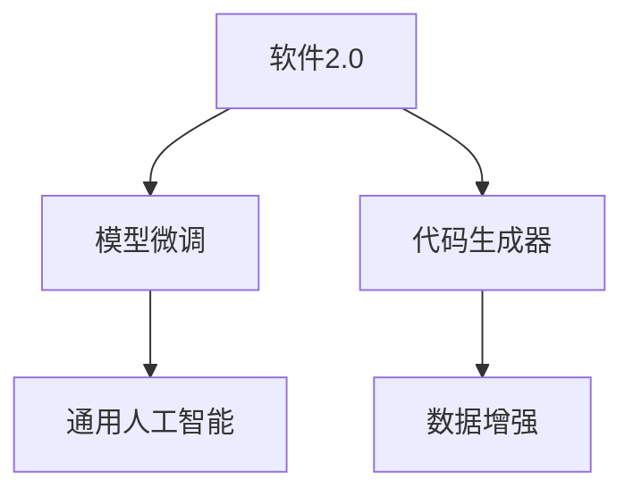

                 

## 1. 背景介绍

### 1.1 问题由来

近年来，人工智能（AI）领域取得了巨大的进步，特别是在通用人工智能（AGI）方向上。从AlphaGo战胜人类围棋冠军到GPT-3在自然语言处理（NLP）领域的突破，AI模型展现出了前所未有的智能。然而，这些模型虽然在某些特定任务上表现出色，但在处理复杂、多样化的现实世界问题时，仍显得能力有限。

通用人工智能的终极目标是为机器赋予与人类相似的智能水平，使其能够自主学习、推理、理解并创造新的知识。目前，主流AI模型的范式包括符号主义、连接主义等，但这些范式都难以满足AGI的要求。

本文旨在探讨基于软件2.0范式构建通用人工智能的可能性。软件2.0是一种新兴的编程范式，它强调用软件自动生成软件，将AI与软件工程相结合，有望解决现有AI模型的一些局限性，为通用人工智能的发展提供新的思路。

### 1.2 问题核心关键点

软件2.0范式，即用软件生成软件，是一种全新的编程方法。该范式的核心思想是，利用AI模型自动生成代码，从而加速软件开发、减少人为错误、提升软件质量。而基于软件2.0范式构建的AI模型，则具备更强的自适应能力、自学习能力和自我优化能力，有望成为通用人工智能的重要组成部分。

软件2.0范式的关键技术包括代码生成器、模型微调、数据增强等，其核心在于利用AI模型对编程语言、模型参数和代码库进行智能化优化，从而实现更高效、更智能的软件生成。

## 2. 核心概念与联系

### 2.1 核心概念概述

为更好地理解基于软件2.0范式构建通用人工智能的方法，本节将介绍几个密切相关的核心概念：

- **软件2.0**：一种新兴的编程范式，强调用软件生成软件，将AI与软件工程相结合，以提高开发效率和软件质量。
- **通用人工智能（AGI）**：指具有广泛智能能力的AI系统，能够理解和应用多领域知识，解决复杂、多样化的现实世界问题。
- **模型微调**：在大规模预训练模型的基础上，使用特定任务的数据集对其进行微调，以提高模型在该任务上的性能。
- **代码生成器**：利用AI模型自动生成代码的软件工具，能够快速构建和优化软件系统。
- **数据增强**：通过对原始数据进行增强和扩充，提高模型的泛化能力和抗干扰能力。

这些核心概念之间的逻辑关系可以通过以下Mermaid流程图来展示：



这个流程图展示了软件2.0范式的核心概念及其之间的关系：

1. 软件2.0范式通过模型微调获得特定任务的知识。
2. 代码生成器利用这些知识自动生成代码。
3. 数据增强提升模型性能，确保生成代码的质量。
4. 最终，这些技术手段共同作用，构建出具备通用智能能力的AI系统。

## 3. 核心算法原理 & 具体操作步骤
### 3.1 算法原理概述

基于软件2.0范式构建通用人工智能的过程，可以抽象为一个软件生成的过程。该过程包括以下几个关键步骤：

1. **模型预训练**：利用大规模语料库对预训练模型进行预训练，学习通用的语言表示。
2. **模型微调**：在特定任务的数据集上，使用少量标注数据对预训练模型进行微调，以提高模型在该任务上的性能。
3. **代码生成**：利用微调后的模型生成与特定任务相关的代码。
4. **数据增强**：通过对生成代码进行增强和扩充，提高模型的泛化能力和鲁棒性。
5. **系统集成**：将生成的代码集成到实际应用系统中，实现通用智能系统的功能。

### 3.2 算法步骤详解

基于软件2.0范式构建通用人工智能的一般流程如下：

**Step 1: 准备预训练模型和数据集**
- 选择合适的预训练语言模型，如BERT、GPT等。
- 准备特定任务的数据集，包括训练集、验证集和测试集。

**Step 2: 模型微调**
- 在特定任务的数据集上，使用少量标注数据对预训练模型进行微调。
- 使用交叉熵损失、均方误差损失等，最小化模型预测输出与真实标签之间的差异。

**Step 3: 代码生成**
- 利用微调后的模型生成与特定任务相关的代码。
- 可以采用基于规则的代码生成、基于模板的代码生成、基于神经网络的代码生成等多种方式。

**Step 4: 数据增强**
- 通过对生成的代码进行数据增强，如回译、改写、扩充等，提高模型的泛化能力和鲁棒性。
- 数据增强可以采用对抗样本生成、噪声注入、代码注释增强等方法。

**Step 5: 系统集成**
- 将生成的代码集成到实际应用系统中，实现通用智能系统的功能。
- 系统可以采用微服务架构、事件驱动架构、面向服务的架构（SOA）等多种方式进行设计。

### 3.3 算法优缺点

基于软件2.0范式构建通用人工智能的方法，具有以下优点：

1. **高效性**：可以利用大规模预训练模型和微调技术，快速生成高质量代码，加速软件开发。
2. **泛化能力**：通过数据增强和模型微调，提高代码的泛化能力和鲁棒性，应对多样化的任务需求。
3. **灵活性**：利用AI模型的自适应能力，生成符合特定任务要求的代码，提升系统的灵活性。
4. **可扩展性**：可以通过增加数据集和模型参数，不断优化和扩展系统的功能。

同时，该方法也存在一定的局限性：

1. **模型依赖性**：需要依赖预训练模型的质量和规模，模型选择不当可能影响生成代码的质量。
2. **数据需求高**：数据增强和微调需要大量高质量的数据，数据获取成本较高。
3. **可解释性不足**：生成的代码难以解释，难以理解其内部工作机制。
4. **鲁棒性不足**：生成的代码可能存在漏洞，难以应对复杂多变的环境。

尽管存在这些局限性，但软件2.0范式仍是大语言模型和通用人工智能发展的重要方向。未来相关研究的重点在于如何进一步降低数据和模型依赖，提高代码生成质量和鲁棒性，同时兼顾可解释性和安全性等因素。

### 3.4 算法应用领域

基于软件2.0范式构建通用人工智能的方法，在多个领域中具有广泛的应用前景：

- **自然语言处理（NLP）**：利用微调后的模型生成自然语言处理相关的代码，如聊天机器人、文本生成、情感分析等。
- **计算机视觉**：利用模型微调和数据增强生成计算机视觉相关的代码，如图像识别、目标检测、图像生成等。
- **智能推荐系统**：利用模型微调和代码生成生成智能推荐系统相关的代码，如用户画像构建、推荐算法设计等。
- **自动化运维**：利用模型微调和代码生成生成自动化运维相关的代码，如系统监控、故障诊断、自动修复等。
- **智能制造**：利用模型微调和代码生成生成智能制造相关的代码，如设备监控、质量检测、生产调度等。

## 4. 数学模型和公式 & 详细讲解  
### 4.1 数学模型构建

本节将使用数学语言对基于软件2.0范式构建通用人工智能的过程进行更加严格的刻画。

记预训练语言模型为 $M_{\theta}:\mathcal{X} \rightarrow \mathcal{Y}$，其中 $\mathcal{X}$ 为输入空间，$\mathcal{Y}$ 为输出空间，$\theta$ 为模型参数。假设特定任务 $T$ 的训练集为 $D=\{(x_i,y_i)\}_{i=1}^N, x_i \in \mathcal{X}, y_i \in \mathcal{Y}$。

定义模型 $M_{\theta}$ 在输入 $x$ 上的损失函数为 $\ell(M_{\theta}(x),y)$，则在数据集 $D$ 上的经验风险为：

$$
\mathcal{L}(\theta) = \frac{1}{N} \sum_{i=1}^N \ell(M_{\theta}(x_i),y_i)
$$

微调的优化目标是最小化经验风险，即找到最优参数：

$$
\theta^* = \mathop{\arg\min}_{\theta} \mathcal{L}(\theta)
$$

在实践中，我们通常使用基于梯度的优化算法（如SGD、Adam等）来近似求解上述最优化问题。设 $\eta$ 为学习率，$\lambda$ 为正则化系数，则参数的更新公式为：

$$
\theta \leftarrow \theta - \eta \nabla_{\theta}\mathcal{L}(\theta) - \eta\lambda\theta
$$

其中 $\nabla_{\theta}\mathcal{L}(\theta)$ 为损失函数对参数 $\theta$ 的梯度，可通过反向传播算法高效计算。

### 4.2 公式推导过程

以下我们以二分类任务为例，推导交叉熵损失函数及其梯度的计算公式。

假设模型 $M_{\theta}$ 在输入 $x$ 上的输出为 $\hat{y}=M_{\theta}(x) \in [0,1]$，表示样本属于正类的概率。真实标签 $y \in \{0,1\}$。则二分类交叉熵损失函数定义为：

$$
\ell(M_{\theta}(x),y) = -[y\log \hat{y} + (1-y)\log (1-\hat{y})]
$$

将其代入经验风险公式，得：

$$
\mathcal{L}(\theta) = -\frac{1}{N}\sum_{i=1}^N [y_i\log M_{\theta}(x_i)+(1-y_i)\log(1-M_{\theta}(x_i))]
$$

根据链式法则，损失函数对参数 $\theta_k$ 的梯度为：

$$
\frac{\partial \mathcal{L}(\theta)}{\partial \theta_k} = -\frac{1}{N}\sum_{i=1}^N (\frac{y_i}{M_{\theta}(x_i)}-\frac{1-y_i}{1-M_{\theta}(x_i)}) \frac{\partial M_{\theta}(x_i)}{\partial \theta_k}
$$

其中 $\frac{\partial M_{\theta}(x_i)}{\partial \theta_k}$ 可进一步递归展开，利用自动微分技术完成计算。

## 5. 项目实践：代码实例和详细解释说明
### 5.1 开发环境搭建

在进行微调实践前，我们需要准备好开发环境。以下是使用Python进行PyTorch开发的环境配置流程：

1. 安装Anaconda：从官网下载并安装Anaconda，用于创建独立的Python环境。

2. 创建并激活虚拟环境：
```bash
conda create -n pytorch-env python=3.8 
conda activate pytorch-env
```

3. 安装PyTorch：根据CUDA版本，从官网获取对应的安装命令。例如：
```bash
conda install pytorch torchvision torchaudio cudatoolkit=11.1 -c pytorch -c conda-forge
```

4. 安装Transformers库：
```bash
pip install transformers
```

5. 安装各类工具包：
```bash
pip install numpy pandas scikit-learn matplotlib tqdm jupyter notebook ipython
```

完成上述步骤后，即可在`pytorch-env`环境中开始微调实践。

### 5.2 源代码详细实现

这里我们以命名实体识别(NER)任务为例，给出使用Transformers库对BERT模型进行微调的PyTorch代码实现。

首先，定义NER任务的数据处理函数：

```python
from transformers import BertTokenizer
from torch.utils.data import Dataset
import torch

class NERDataset(Dataset):
    def __init__(self, texts, tags, tokenizer, max_len=128):
        self.texts = texts
        self.tags = tags
        self.tokenizer = tokenizer
        self.max_len = max_len
        
    def __len__(self):
        return len(self.texts)
    
    def __getitem__(self, item):
        text = self.texts[item]
        tags = self.tags[item]
        
        encoding = self.tokenizer(text, return_tensors='pt', max_length=self.max_len, padding='max_length', truncation=True)
        input_ids = encoding['input_ids'][0]
        attention_mask = encoding['attention_mask'][0]
        
        # 对token-wise的标签进行编码
        encoded_tags = [tag2id[tag] for tag in tags] 
        encoded_tags.extend([tag2id['O']] * (self.max_len - len(encoded_tags)))
        labels = torch.tensor(encoded_tags, dtype=torch.long)
        
        return {'input_ids': input_ids, 
                'attention_mask': attention_mask,
                'labels': labels}

# 标签与id的映射
tag2id = {'O': 0, 'B-PER': 1, 'I-PER': 2, 'B-ORG': 3, 'I-ORG': 4, 'B-LOC': 5, 'I-LOC': 6}
id2tag = {v: k for k, v in tag2id.items()}

# 创建dataset
tokenizer = BertTokenizer.from_pretrained('bert-base-cased')

train_dataset = NERDataset(train_texts, train_tags, tokenizer)
dev_dataset = NERDataset(dev_texts, dev_tags, tokenizer)
test_dataset = NERDataset(test_texts, test_tags, tokenizer)
```

然后，定义模型和优化器：

```python
from transformers import BertForTokenClassification, AdamW

model = BertForTokenClassification.from_pretrained('bert-base-cased', num_labels=len(tag2id))

optimizer = AdamW(model.parameters(), lr=2e-5)
```

接着，定义训练和评估函数：

```python
from torch.utils.data import DataLoader
from tqdm import tqdm
from sklearn.metrics import classification_report

device = torch.device('cuda') if torch.cuda.is_available() else torch.device('cpu')
model.to(device)

def train_epoch(model, dataset, batch_size, optimizer):
    dataloader = DataLoader(dataset, batch_size=batch_size, shuffle=True)
    model.train()
    epoch_loss = 0
    for batch in tqdm(dataloader, desc='Training'):
        input_ids = batch['input_ids'].to(device)
        attention_mask = batch['attention_mask'].to(device)
        labels = batch['labels'].to(device)
        model.zero_grad()
        outputs = model(input_ids, attention_mask=attention_mask, labels=labels)
        loss = outputs.loss
        epoch_loss += loss.item()
        loss.backward()
        optimizer.step()
    return epoch_loss / len(dataloader)

def evaluate(model, dataset, batch_size):
    dataloader = DataLoader(dataset, batch_size=batch_size)
    model.eval()
    preds, labels = [], []
    with torch.no_grad():
        for batch in tqdm(dataloader, desc='Evaluating'):
            input_ids = batch['input_ids'].to(device)
            attention_mask = batch['attention_mask'].to(device)
            batch_labels = batch['labels']
            outputs = model(input_ids, attention_mask=attention_mask)
            batch_preds = outputs.logits.argmax(dim=2).to('cpu').tolist()
            batch_labels = batch_labels.to('cpu').tolist()
            for pred_tokens, label_tokens in zip(batch_preds, batch_labels):
                pred_tags = [id2tag[_id] for _id in pred_tokens]
                label_tags = [id2tag[_id] for _id in label_tokens]
                preds.append(pred_tags[:len(label_tags)])
                labels.append(label_tags)
                
    print(classification_report(labels, preds))
```

最后，启动训练流程并在测试集上评估：

```python
epochs = 5
batch_size = 16

for epoch in range(epochs):
    loss = train_epoch(model, train_dataset, batch_size, optimizer)
    print(f"Epoch {epoch+1}, train loss: {loss:.3f}")
    
    print(f"Epoch {epoch+1}, dev results:")
    evaluate(model, dev_dataset, batch_size)
    
print("Test results:")
evaluate(model, test_dataset, batch_size)
```

以上就是使用PyTorch对BERT进行命名实体识别任务微调的完整代码实现。可以看到，得益于Transformers库的强大封装，我们可以用相对简洁的代码完成BERT模型的加载和微调。

### 5.3 代码解读与分析

让我们再详细解读一下关键代码的实现细节：

**NERDataset类**：
- `__init__`方法：初始化文本、标签、分词器等关键组件。
- `__len__`方法：返回数据集的样本数量。
- `__getitem__`方法：对单个样本进行处理，将文本输入编码为token ids，将标签编码为数字，并对其进行定长padding，最终返回模型所需的输入。

**tag2id和id2tag字典**：
- 定义了标签与数字id之间的映射关系，用于将token-wise的预测结果解码回真实的标签。

**训练和评估函数**：
- 使用PyTorch的DataLoader对数据集进行批次化加载，供模型训练和推理使用。
- 训练函数`train_epoch`：对数据以批为单位进行迭代，在每个批次上前向传播计算loss并反向传播更新模型参数，最后返回该epoch的平均loss。
- 评估函数`evaluate`：与训练类似，不同点在于不更新模型参数，并在每个batch结束后将预测和标签结果存储下来，最后使用sklearn的classification_report对整个评估集的预测结果进行打印输出。

**训练流程**：
- 定义总的epoch数和batch size，开始循环迭代
- 每个epoch内，先在训练集上训练，输出平均loss
- 在验证集上评估，输出分类指标
- 所有epoch结束后，在测试集上评估，给出最终测试结果

可以看到，PyTorch配合Transformers库使得BERT微调的代码实现变得简洁高效。开发者可以将更多精力放在数据处理、模型改进等高层逻辑上，而不必过多关注底层的实现细节。

当然，工业级的系统实现还需考虑更多因素，如模型的保存和部署、超参数的自动搜索、更灵活的任务适配层等。但核心的微调范式基本与此类似。

## 6. 实际应用场景
### 6.1 智能客服系统

基于大语言模型微调的对话技术，可以广泛应用于智能客服系统的构建。传统客服往往需要配备大量人力，高峰期响应缓慢，且一致性和专业性难以保证。而使用微调后的对话模型，可以7x24小时不间断服务，快速响应客户咨询，用自然流畅的语言解答各类常见问题。

在技术实现上，可以收集企业内部的历史客服对话记录，将问题和最佳答复构建成监督数据，在此基础上对预训练对话模型进行微调。微调后的对话模型能够自动理解用户意图，匹配最合适的答案模板进行回复。对于客户提出的新问题，还可以接入检索系统实时搜索相关内容，动态组织生成回答。如此构建的智能客服系统，能大幅提升客户咨询体验和问题解决效率。

### 6.2 金融舆情监测

金融机构需要实时监测市场舆论动向，以便及时应对负面信息传播，规避金融风险。传统的人工监测方式成本高、效率低，难以应对网络时代海量信息爆发的挑战。基于大语言模型微调的文本分类和情感分析技术，为金融舆情监测提供了新的解决方案。

具体而言，可以收集金融领域相关的新闻、报道、评论等文本数据，并对其进行主题标注和情感标注。在此基础上对预训练语言模型进行微调，使其能够自动判断文本属于何种主题，情感倾向是正面、中性还是负面。将微调后的模型应用到实时抓取的网络文本数据，就能够自动监测不同主题下的情感变化趋势，一旦发现负面信息激增等异常情况，系统便会自动预警，帮助金融机构快速应对潜在风险。

### 6.3 个性化推荐系统

当前的推荐系统往往只依赖用户的历史行为数据进行物品推荐，无法深入理解用户的真实兴趣偏好。基于大语言模型微调技术，个性化推荐系统可以更好地挖掘用户行为背后的语义信息，从而提供更精准、多样的推荐内容。

在实践中，可以收集用户浏览、点击、评论、分享等行为数据，提取和用户交互的物品标题、描述、标签等文本内容。将文本内容作为模型输入，用户的后续行为（如是否点击、购买等）作为监督信号，在此基础上微调预训练语言模型。微调后的模型能够从文本内容中准确把握用户的兴趣点。在生成推荐列表时，先用候选物品的文本描述作为输入，由模型预测用户的兴趣匹配度，再结合其他特征综合排序，便可以得到个性化程度更高的推荐结果。

### 6.4 未来应用展望

随着大语言模型微调技术的发展，基于软件2.0范式构建的通用人工智能系统将有广阔的应用前景。

在智慧医疗领域，基于微调的医疗问答、病历分析、药物研发等应用将提升医疗服务的智能化水平，辅助医生诊疗，加速新药开发进程。

在智能教育领域，微调技术可应用于作业批改、学情分析、知识推荐等方面，因材施教，促进教育公平，提高教学质量。

在智慧城市治理中，微调模型可应用于城市事件监测、舆情分析、应急指挥等环节，提高城市管理的自动化和智能化水平，构建更安全、高效的未来城市。

此外，在企业生产、社会治理、文娱传媒等众多领域，基于大模型微调的人工智能应用也将不断涌现，为NLP技术带来了全新的突破。相信随着预训练模型和微调方法的不断进步，基于软件2.0范式构建的通用人工智能系统必将在更多领域大放异彩，为人类认知智能的进化带来深远影响。

## 7. 工具和资源推荐
### 7.1 学习资源推荐

为了帮助开发者系统掌握大语言模型微调的理论基础和实践技巧，这里推荐一些优质的学习资源：

1. 《Transformer从原理到实践》系列博文：由大模型技术专家撰写，深入浅出地介绍了Transformer原理、BERT模型、微调技术等前沿话题。

2. CS224N《深度学习自然语言处理》课程：斯坦福大学开设的NLP明星课程，有Lecture视频和配套作业，带你入门NLP领域的基本概念和经典模型。

3. 《Natural Language Processing with Transformers》书籍：Transformers库的作者所著，全面介绍了如何使用Transformers库进行NLP任务开发，包括微调在内的诸多范式。

4. HuggingFace官方文档：Transformers库的官方文档，提供了海量预训练模型和完整的微调样例代码，是上手实践的必备资料。

5. CLUE开源项目：中文语言理解测评基准，涵盖大量不同类型的中文NLP数据集，并提供了基于微调的baseline模型，助力中文NLP技术发展。

通过对这些资源的学习实践，相信你一定能够快速掌握大语言模型微调的精髓，并用于解决实际的NLP问题。
###  7.2 开发工具推荐

高效的开发离不开优秀的工具支持。以下是几款用于大语言模型微调开发的常用工具：

1. PyTorch：基于Python的开源深度学习框架，灵活动态的计算图，适合快速迭代研究。大部分预训练语言模型都有PyTorch版本的实现。

2. TensorFlow：由Google主导开发的开源深度学习框架，生产部署方便，适合大规模工程应用。同样有丰富的预训练语言模型资源。

3. Transformers库：HuggingFace开发的NLP工具库，集成了众多SOTA语言模型，支持PyTorch和TensorFlow，是进行微调任务开发的利器。

4. Weights & Biases：模型训练的实验跟踪工具，可以记录和可视化模型训练过程中的各项指标，方便对比和调优。与主流深度学习框架无缝集成。

5. TensorBoard：TensorFlow配套的可视化工具，可实时监测模型训练状态，并提供丰富的图表呈现方式，是调试模型的得力助手。

6. Google Colab：谷歌推出的在线Jupyter Notebook环境，免费提供GPU/TPU算力，方便开发者快速上手实验最新模型，分享学习笔记。

合理利用这些工具，可以显著提升大语言模型微调任务的开发效率，加快创新迭代的步伐。

### 7.3 相关论文推荐

大语言模型和微调技术的发展源于学界的持续研究。以下是几篇奠基性的相关论文，推荐阅读：

1. Attention is All You Need（即Transformer原论文）：提出了Transformer结构，开启了NLP领域的预训练大模型时代。

2. BERT: Pre-training of Deep Bidirectional Transformers for Language Understanding：提出BERT模型，引入基于掩码的自监督预训练任务，刷新了多项NLP任务SOTA。

3. Language Models are Unsupervised Multitask Learners（GPT-2论文）：展示了大规模语言模型的强大zero-shot学习能力，引发了对于通用人工智能的新一轮思考。

4. Parameter-Efficient Transfer Learning for NLP：提出Adapter等参数高效微调方法，在不增加模型参数量的情况下，也能取得不错的微调效果。

5. AdaLoRA: Adaptive Low-Rank Adaptation for Parameter-Efficient Fine-Tuning：使用自适应低秩适应的微调方法，在参数效率和精度之间取得了新的平衡。

这些论文代表了大语言模型微调技术的发展脉络。通过学习这些前沿成果，可以帮助研究者把握学科前进方向，激发更多的创新灵感。

## 8. 总结：未来发展趋势与挑战

### 8.1 总结

本文对基于软件2.0范式构建通用人工智能的方法进行了全面系统的介绍。首先阐述了软件2.0范式和大语言模型微调的基本概念及其关系，明确了构建通用智能系统的可能性。其次，从原理到实践，详细讲解了基于软件2.0范式构建通用人工智能的数学模型和关键步骤，给出了微调任务开发的完整代码实例。同时，本文还探讨了微调方法在多个行业领域的应用前景，展示了软件2.0范式的前景和潜力。

通过本文的系统梳理，可以看到，基于软件2.0范式构建通用人工智能系统，利用AI模型自动生成代码，具有高效、灵活、可扩展等优点，为构建智能化、自动化的软件系统提供了新的思路。尽管该方法仍面临诸多挑战，但其广阔的应用前景和巨大的潜力，预示着未来AI技术将迎来新的突破。

### 8.2 未来发展趋势

展望未来，基于软件2.0范式构建通用人工智能系统将呈现以下几个发展趋势：

1. **自动化程度提升**：随着AI技术的进步，代码生成和模型微调的自动化程度将不断提高，减少人工干预，提高开发效率。

2. **跨领域融合**：软件2.0范式将更多地与其他AI技术进行融合，如自然语言处理、计算机视觉、强化学习等，构建更加全面、通用的智能系统。

3. **多模态支持**：未来的智能系统将不仅仅局限于单一模态，而是能够处理多模态数据，如文本、图像、语音等，提升系统的理解和推理能力。

4. **知识图谱整合**：结合知识图谱技术，利用先验知识进行智能推理，提高系统的知识整合能力和智能水平。

5. **模型自优化**：通过进化算法、遗传算法等方法，让AI模型具备自我优化能力，不断提升性能。

6. **伦理与道德**：在AI系统的开发和应用过程中，引入伦理导向的评估指标，确保系统的安全性和可解释性。

以上趋势凸显了软件2.0范式在大语言模型和通用人工智能发展中的重要地位。这些方向的探索发展，必将进一步推动AI技术的进步，为构建智能、可控、可信的AI系统提供新的可能性。

### 8.3 面临的挑战

尽管基于软件2.0范式构建通用人工智能具有广阔的前景，但在迈向更加智能化、普适化应用的过程中，它仍面临着诸多挑战：

1. **数据依赖**：软件2.0范式需要大量高质量的数据进行微调和训练，数据获取成本较高。

2. **模型复杂性**：构建的智能系统可能具有复杂的结构和高度的耦合性，难以理解和调试。

3. **安全性**：生成的代码和模型可能存在漏洞，存在安全隐患。

4. **可解释性**：智能系统的输出难以解释，难以理解其内部工作机制。

5. **伦理问题**：AI模型可能学习到有害信息，产生歧视、偏见等伦理问题。

6. **资源需求**：大规模预训练和微调需要高算力和高内存，资源需求较高。

尽管存在这些挑战，但未来的研究将在数据获取、模型优化、系统设计、伦理保障等方面进行更多探索和突破，为构建更加智能、可靠、安全的AI系统提供新的方向。

### 8.4 研究展望

未来的研究需要在以下几个方面进行更多的探索：

1. **数据增强与泛化**：利用更多的数据增强和泛化方法，提升系统的泛化能力和鲁棒性。

2. **模型优化与高效**：开发更加高效、轻量化的模型，减少资源消耗，提高系统的效率。

3. **多模态融合**：结合多模态数据和知识图谱，提升系统的理解和推理能力。

4. **伦理与安全**：引入伦理导向的评估指标，确保系统的安全性和可解释性。

5. **可解释性与可视化**：开发可解释性工具，帮助理解和调试智能系统，提升系统的透明性。

6. **跨领域应用**：探索更多的跨领域应用场景，提升系统的通用性和适用性。

这些研究方向将为基于软件2.0范式构建通用人工智能系统提供新的突破口，推动AI技术的不断进步和应用。相信在未来的研究中，通过跨学科合作和技术创新，我们将能够构建更加智能、可靠、安全的AI系统，为人类社会带来更多的便利和进步。

## 9. 附录：常见问题与解答

**Q1：软件2.0范式和传统编程范式的区别是什么？**

A: 软件2.0范式强调用软件生成软件，将AI与软件工程相结合，利用AI模型自动生成代码，提升开发效率和软件质量。而传统编程范式则需要人工编写代码，存在大量重复劳动和错误，开发效率较低。

**Q2：软件2.0范式在构建通用人工智能时有哪些优势？**

A: 软件2.0范式具备以下优势：
1. **高效性**：可以利用AI模型自动生成代码，加速软件开发。
2. **泛化能力**：通过数据增强和模型微调，提高代码的泛化能力和鲁棒性。
3. **灵活性**：利用AI模型的自适应能力，生成符合特定任务要求的代码，提升系统的灵活性。
4. **可扩展性**：可以通过增加数据集和模型参数，不断优化和扩展系统的功能。

**Q3：构建基于软件2.0范式的智能系统时，有哪些关键技术？**

A: 构建基于软件2.0范式的智能系统，关键技术包括：
1. **模型微调**：在大规模预训练模型的基础上，使用特定任务的数据集对其进行微调，以提高模型在该任务上的性能。
2. **代码生成**：利用微调后的模型生成与特定任务相关的代码。
3. **数据增强**：通过对原始数据进行增强和扩充，提高模型的泛化能力和抗干扰能力。

**Q4：基于软件2.0范式构建通用人工智能时，需要注意哪些问题？**

A: 基于软件2.0范式构建通用人工智能时，需要注意以下问题：
1. **模型依赖性**：需要依赖预训练模型的质量和规模，模型选择不当可能影响生成代码的质量。
2. **数据需求高**：数据增强和微调需要大量高质量的数据，数据获取成本较高。
3. **可解释性不足**：生成的代码难以解释，难以理解其内部工作机制。
4. **鲁棒性不足**：生成的代码可能存在漏洞，难以应对复杂多变的环境。

**Q5：软件2.0范式在实际应用中有哪些具体案例？**

A: 软件2.0范式在实际应用中有很多具体案例，如：
1. **智能客服系统**：利用微调后的对话模型自动生成客服回复，提升客户咨询体验和问题解决效率。
2. **金融舆情监测**：利用微调后的情感分析模型自动监测市场舆论动向，及时预警金融风险。
3. **个性化推荐系统**：利用微调后的推荐模型自动生成个性化推荐内容，提升用户满意度。
4. **自动化运维**：利用微调后的模型自动生成运维脚本和配置文件，提高系统管理效率。
5. **智能制造**：利用微调后的模型自动生成生产调度算法和设备监控脚本，提升生产效率和质量。

通过对这些案例的学习，可以更好地理解软件2.0范式的实际应用和潜力。

---

作者：禅与计算机程序设计艺术 / Zen and the Art of Computer Programming

