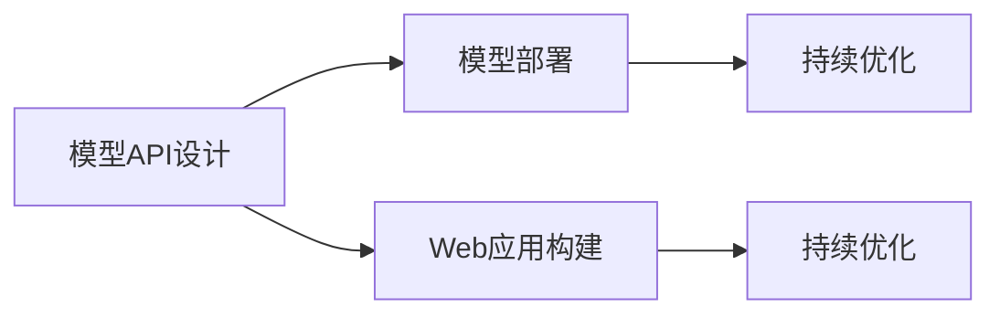

                 

## 1. 背景介绍

在人工智能技术的快速发展下，深度学习模型正逐渐在各个行业中扮演越来越重要的角色。无论是自然语言处理（NLP）、计算机视觉（CV），还是语音识别（ASR）等领域，基于深度学习的AI模型都在创造新的价值。然而，将模型从研究实验室搬入实际应用中，使其能够为用户带来实际价值，是摆在我们面前的一大挑战。本文将探讨从部署AI模型到Web应用的流程，包括模型API设计、模型部署、Web应用构建、以及持续优化等环节，旨在为读者提供一个完整的部署AI模型的指南。

## 2. 核心概念与联系

### 2.1 核心概念概述

部署AI模型涉及多个关键概念，这些概念相互关联，共同构成了模型部署的完整流程。

- **模型API设计**：指通过RESTful API的形式将模型暴露给外部用户，以便用户可以方便地使用模型进行预测或推理。
- **模型部署**：指将训练好的模型部署到服务器、云平台或边缘设备中，以便能够被API调用。
- **Web应用构建**：指基于模型API构建Web界面，供用户直接通过浏览器使用模型服务。
- **持续优化**：指模型上线后，根据用户反馈和业务需求，不断优化模型性能和API服务质量。

这些概念之间的逻辑关系可以通过以下Mermaid流程图来展示：



这个流程图展示了一组紧密相关的概念：

1. 模型API设计是部署和构建Web应用的起点。
2. 模型部署是将模型嵌入到计算环境中的过程。
3. Web应用构建是在模型API的基础上，开发交互式的Web界面。
4. 持续优化是部署和应用后持续改进的关键步骤。

## 3. 核心算法原理 & 具体操作步骤

### 3.1 算法原理概述

基于深度学习的AI模型部署流程主要包括模型训练、API设计、模型导出、模型部署、API调用和持续优化等步骤。其中，模型训练和API设计是前提，模型导出和模型部署是核心，API调用和持续优化是后续。

**模型训练**：使用现有的深度学习框架（如TensorFlow、PyTorch等）和库（如Keras、MXNet等）对模型进行训练，得到最终的模型参数。

**API设计**：根据业务需求，设计API接口，确定API输入和输出格式，并选择合适的通信协议（如HTTP、WebSocket等）。

**模型导出**：将训练好的模型保存为模型文件，并转换成API所需的格式（如JSON、PB等）。

**模型部署**：将模型文件部署到服务器、云平台或边缘设备中，并设置API调用路径和参数。

**API调用**：通过API接口调用模型进行推理或预测，得到结果。

**持续优化**：根据API调用的结果和用户反馈，不断优化模型性能和API服务质量。

### 3.2 算法步骤详解

#### 3.2.1 模型训练

模型训练是AI模型部署的第一步，也是最关键的一步。通常需要以下几个步骤：

1. **数据准备**：收集和预处理数据集，确保数据的质量和多样性。
2. **模型选择**：选择合适的深度学习模型（如CNN、RNN、Transformer等），并调整模型结构。
3. **模型训练**：使用深度学习框架训练模型，选择合适的优化器、学习率、批大小等超参数。
4. **模型评估**：使用验证集评估模型性能，选择合适的评估指标（如准确率、召回率、F1-score等）。
5. **模型保存**：保存训练好的模型参数，以便后续部署。

#### 3.2.2 API设计

API设计是模型部署的基础，需要考虑以下几个方面：

1. **接口设计**：根据业务需求，设计API接口，确定接口的输入和输出格式。
2. **请求方式**：选择合适的HTTP请求方式（如GET、POST等），并定义请求路径。
3. **参数验证**：对请求参数进行验证，确保输入数据的合法性。
4. **结果返回**：确定API返回结果的格式（如JSON、XML等），并设置错误码和错误信息。

#### 3.2.3 模型导出

模型导出是将训练好的模型转换成API所需的格式，以便模型能够被调用。具体步骤如下：

1. **模型保存**：将训练好的模型参数保存到文件（如TensorFlow的checkpoint文件）。
2. **模型转换**：使用深度学习框架提供的工具将模型转换成API所需的格式（如TensorFlow的SavedModel、ONNX等）。
3. **模型压缩**：对模型进行压缩，减小模型文件的大小，提高部署效率。

#### 3.2.4 模型部署

模型部署是将模型文件部署到服务器、云平台或边缘设备中，并设置API调用路径和参数。具体步骤如下：

1. **服务器选择**：选择合适的服务器或云平台，确保其具备足够的计算和存储资源。
2. **模型部署**：将模型文件部署到服务器上，并设置API调用路径和参数。
3. **负载均衡**：使用负载均衡技术，确保API能够高效地处理并发请求。
4. **监控报警**：设置监控报警机制，实时监控API的运行状态，并及时处理异常情况。

#### 3.2.5 API调用

API调用是将模型暴露给外部用户的过程，具体步骤如下：

1. **客户端开发**：开发客户端程序，使用API进行调用。
2. **请求处理**：将用户请求转换成API请求，并发送请求到服务器。
3. **结果解析**：解析API返回的结果，并展示给用户。
4. **错误处理**：处理API调用中可能出现的错误，并给出友好的提示信息。

#### 3.2.6 持续优化

持续优化是模型部署后的持续改进过程，具体步骤如下：

1. **用户反馈收集**：收集用户对API调用的反馈，包括调用的成功率、响应时间、服务质量等。
2. **模型性能评估**：根据用户反馈，评估模型的性能，确定是否需要重新训练或优化模型。
3. **模型调优**：根据评估结果，调整模型参数或重新训练模型，提升模型性能。
4. **API服务优化**：根据模型性能评估结果，优化API服务，提高API调用的效率和可靠性。

### 3.3 算法优缺点

基于深度学习的AI模型部署流程具有以下优点：

1. **灵活性高**：可以根据业务需求设计灵活的API接口，满足不同的应用场景。
2. **可扩展性强**：通过API调用和持续优化，可以不断提升模型的性能和服务质量。
3. **易于维护**：API设计和模型部署过程相对独立，易于维护和升级。

同时，该流程也存在以下缺点：

1. **模型资源占用大**：深度学习模型通常具有较大的参数量，需要占用大量的计算资源。
2. **部署复杂度高**：模型部署过程涉及多个环节，需要处理多种问题，如服务器选择、负载均衡等。
3. **服务质量依赖模型**：API调用的服务质量高度依赖于模型的性能，如果模型性能不佳，服务质量会受到影响。

### 3.4 算法应用领域

基于深度学习的AI模型部署流程广泛应用于以下几个领域：

1. **金融科技**：如风险评估、信用评分、投资建议等。
2. **医疗健康**：如医学影像诊断、病历分析、基因预测等。
3. **智能客服**：如聊天机器人、自动回复等。
4. **智能推荐**：如商品推荐、新闻推荐、视频推荐等。
5. **自动驾驶**：如目标检测、路径规划、行为预测等。
6. **语音识别**：如语音识别、情感分析、语音合成等。

以上领域展示了AI模型部署的广泛应用，相信随着技术的不断进步，AI模型部署将在更多领域大放异彩。

## 4. 数学模型和公式 & 详细讲解

### 4.1 数学模型构建

在AI模型部署中，模型的数学模型是核心。通常使用深度学习框架（如TensorFlow、PyTorch等）来构建和训练模型。

设模型的输入为 $x$，输出为 $y$，其中 $x \in \mathcal{X}$，$y \in \mathcal{Y}$。模型的目标是最小化损失函数 $\mathcal{L}(y, y^*)$，其中 $y^*$ 是模型的预测输出。

常用的损失函数包括：

- **均方误差（MSE）**：$\mathcal{L}(y, y^*) = \frac{1}{N} \sum_{i=1}^N (y_i - y_i^*)^2$
- **交叉熵损失（CE）**：$\mathcal{L}(y, y^*) = -\frac{1}{N} \sum_{i=1}^N (y_i \log y_i^* + (1-y_i) \log (1-y_i^*))$

### 4.2 公式推导过程

以回归任务为例，假设模型的线性回归模型为 $y^* = \theta^T x + b$，其中 $\theta$ 为模型参数，$b$ 为偏置项。损失函数为均方误差损失：

$$
\mathcal{L}(y, y^*) = \frac{1}{N} \sum_{i=1}^N (y_i - (\theta^T x_i + b))^2
$$

对损失函数求导，得到梯度：

$$
\nabla_{\theta} \mathcal{L}(y, y^*) = \frac{2}{N} \sum_{i=1}^N (y_i - (\theta^T x_i + b)) x_i
$$

使用梯度下降等优化算法，更新模型参数 $\theta$：

$$
\theta \leftarrow \theta - \eta \nabla_{\theta} \mathcal{L}(y, y^*)
$$

其中 $\eta$ 为学习率，控制更新步长。

### 4.3 案例分析与讲解

以一个简单的线性回归模型为例，分析其在模型训练和部署中的应用。

假设有一个简单的线性回归模型 $y^* = \theta^T x + b$，其中 $\theta$ 和 $b$ 为模型参数，$x$ 为输入，$y$ 为输出。使用均方误差损失函数，并使用梯度下降算法进行模型训练。

训练过程如下：

1. **数据准备**：收集训练数据集 $\{(x_i, y_i)\}_{i=1}^N$。
2. **模型初始化**：初始化模型参数 $\theta$ 和 $b$。
3. **模型训练**：使用梯度下降算法，不断更新模型参数，使得模型预测输出与真实输出 $y_i$ 的误差最小。
4. **模型评估**：使用验证集评估模型性能，确定是否需要重新训练或调整模型。
5. **模型保存**：保存训练好的模型参数。

部署过程如下：

1. **服务器选择**：选择合适的服务器或云平台，确保其具备足够的计算和存储资源。
2. **模型部署**：将模型文件部署到服务器上，并设置API调用路径和参数。
3. **负载均衡**：使用负载均衡技术，确保API能够高效地处理并发请求。
4. **监控报警**：设置监控报警机制，实时监控API的运行状态，并及时处理异常情况。

## 5. 项目实践：代码实例和详细解释说明

### 5.1 开发环境搭建

在进行AI模型部署实践前，我们需要准备好开发环境。以下是使用Python进行Flask开发的开发环境配置流程：

1. 安装Anaconda：从官网下载并安装Anaconda，用于创建独立的Python环境。

2. 创建并激活虚拟环境：
```bash
conda create -n flask-env python=3.8 
conda activate flask-env
```

3. 安装Flask：
```bash
pip install flask
```

4. 安装TensorFlow：
```bash
pip install tensorflow
```

5. 安装Gunicorn：
```bash
pip install gunicorn
```

6. 安装Jupyter Notebook：
```bash
pip install jupyter notebook
```

完成上述步骤后，即可在`flask-env`环境中开始Flask应用的开发。

### 5.2 源代码详细实现

下面是一个简单的Flask应用示例，用于部署一个基于TensorFlow的线性回归模型。

首先，导入所需的库和模块：

```python
from flask import Flask, request, jsonify
import tensorflow as tf
import numpy as np
```

然后，定义Flask应用：

```python
app = Flask(__name__)

@app.route('/predict', methods=['POST'])
def predict():
    data = request.get_json()
    x = np.array([data['x']])
    y = tf.keras.Sequential([
        tf.keras.layers.Dense(1, input_shape=[1])
    ]).predict(x)
    return jsonify(y[0][0])
```

接下来，训练并保存线性回归模型：

```python
# 训练数据
x_train = np.array([1, 2, 3, 4, 5])
y_train = np.array([2, 4, 6, 8, 10])

# 定义模型
model = tf.keras.Sequential([
    tf.keras.layers.Dense(1, input_shape=[1])
])

# 编译模型
model.compile(optimizer=tf.keras.optimizers.Adam(), loss='mse')

# 训练模型
model.fit(x_train, y_train, epochs=50, verbose=0)

# 保存模型
model.save('linear_regression.h5')
```

最后，运行Flask应用：

```python
if __name__ == '__main__':
    app.run(host='0.0.0.0', port=5000)
```

运行上述代码后，即可在浏览器中访问`http://localhost:5000/predict`，通过POST请求发送输入数据，获取模型预测结果。

### 5.3 代码解读与分析

让我们再详细解读一下关键代码的实现细节：

**Flask应用**：
- 定义Flask应用对象 `app`。
- 定义路由 `/predict`，使用 `request.get_json()` 获取请求数据，并使用 `tf.keras.Sequential` 定义线性回归模型。
- 使用 `tf.keras.layers.Dense` 定义全连接层，设置输出维度为1。
- 使用 `model.predict()` 进行模型预测，并返回预测结果。

**训练和保存模型**：
- 定义训练数据 `x_train` 和 `y_train`。
- 使用 `tf.keras.Sequential` 定义线性回归模型。
- 使用 `model.compile()` 编译模型，设置优化器和损失函数。
- 使用 `model.fit()` 训练模型，并设置训练轮数和日志输出。
- 使用 `model.save()` 保存训练好的模型。

**运行Flask应用**：
- 使用 `if __name__ == '__main__':` 判断是否为模块直接运行。
- 使用 `app.run()` 启动Flask应用，并设置监听地址和端口号。

通过Flask应用示例，我们可以看到从模型训练、保存到API调用的全过程。开发者可以根据实际需求，将此示例扩展为更复杂的AI模型部署应用。

## 6. 实际应用场景

### 6.1 智能客服系统

基于深度学习的智能客服系统已经广泛应用于各行各业。通过将预训练语言模型微调并部署为API，用户可以通过浏览器或移动应用访问该系统，进行自然语言问答或智能交互。

在技术实现上，可以收集企业内部的历史客服对话记录，将问题和最佳答复构建成监督数据，在此基础上对预训练语言模型进行微调。微调后的语言模型能够自动理解用户意图，匹配最合适的答案模板进行回复。对于客户提出的新问题，还可以接入检索系统实时搜索相关内容，动态组织生成回答。如此构建的智能客服系统，能大幅提升客户咨询体验和问题解决效率。

### 6.2 金融舆情监测

金融机构需要实时监测市场舆论动向，以便及时应对负面信息传播，规避金融风险。通过将深度学习模型部署为API，用户可以通过浏览器或移动应用访问该系统，进行舆情分析或风险评估。

在技术实现上，可以收集金融领域相关的新闻、报道、评论等文本数据，并对其进行主题标注和情感标注。在此基础上对预训练语言模型进行微调，使其能够自动判断文本属于何种主题，情感倾向是正面、中性还是负面。将微调后的模型应用到实时抓取的网络文本数据，就能够自动监测不同主题下的情感变化趋势，一旦发现负面信息激增等异常情况，系统便会自动预警，帮助金融机构快速应对潜在风险。

### 6.3 个性化推荐系统

当前的推荐系统往往只依赖用户的历史行为数据进行物品推荐，无法深入理解用户的真实兴趣偏好。通过将深度学习模型部署为API，用户可以通过浏览器或移动应用访问该系统，进行个性化推荐或智能搜索。

在技术实现上，可以收集用户浏览、点击、评论、分享等行为数据，提取和用户交互的物品标题、描述、标签等文本内容。将文本内容作为模型输入，用户的后续行为（如是否点击、购买等）作为监督信号，在此基础上微调预训练语言模型。微调后的模型能够从文本内容中准确把握用户的兴趣点。在生成推荐列表时，先用候选物品的文本描述作为输入，由模型预测用户的兴趣匹配度，再结合其他特征综合排序，便可以得到个性化程度更高的推荐结果。

### 6.4 未来应用展望

随着深度学习模型的不断进步，基于深度学习的AI模型部署将在更多领域得到应用，为传统行业带来变革性影响。

在智慧医疗领域，基于深度学习的智能诊疗系统已经逐步走向成熟，可以辅助医生进行疾病诊断和治疗方案推荐。通过将深度学习模型部署为API，用户可以通过浏览器或移动应用访问该系统，进行疾病自我检测或治疗方案查询。

在智能教育领域，基于深度学习的智能辅导系统已经能够根据学生的学习情况，提供个性化的学习方案和资源推荐。通过将深度学习模型部署为API，用户可以通过浏览器或移动应用访问该系统，进行自我学习和自主测评。

在智慧城市治理中，基于深度学习的智能监控系统已经能够实时监测城市运行状态，提供智能化的城市管理服务。通过将深度学习模型部署为API，用户可以通过浏览器或移动应用访问该系统，进行城市事件监测、公共安全预警等。

此外，在企业生产、社会治理、文娱传媒等众多领域，基于深度学习的AI模型部署也将不断涌现，为各行各业带来新的技术突破。

## 7. 工具和资源推荐

### 7.1 学习资源推荐

为了帮助开发者系统掌握AI模型部署的理论基础和实践技巧，这里推荐一些优质的学习资源：

1. **《Flask Web Development》**：由Miguel Grinberg编写，介绍了如何使用Flask构建Web应用，是Flask的官方文档和入门指南。
2. **《TensorFlow官方文档》**：由Google发布，提供了深度学习模型的训练、导出和部署的详细说明。
3. **《PyTorch官方文档》**：由Facebook发布，提供了深度学习模型的训练、导出和部署的详细说明。
4. **《AI模型部署与实践》在线课程**：由Coursera或Udacity等在线教育平台提供，涵盖了模型API设计、模型部署、Web应用构建等方面的内容。
5. **《深度学习框架实战》书籍**：由清华大学出版社或人民邮电出版社等机构出版，介绍了深度学习模型的训练、导出和部署的实践经验。

通过对这些资源的学习实践，相信你一定能够快速掌握AI模型部署的精髓，并用于解决实际的业务问题。

### 7.2 开发工具推荐

高效的开发离不开优秀的工具支持。以下是几款用于AI模型部署开发的常用工具：

1. **Flask**：基于Python的Web应用框架，适合快速迭代开发和部署API服务。
2. **TensorFlow Serving**：Google开发的深度学习模型部署工具，支持多种模型格式，适合大规模模型部署。
3. **Kubeflow**：由Google开源的机器学习平台，支持模型训练、部署和可视化，适合企业级的模型部署。
4. **Docker**：开源的容器化技术，适合构建和部署稳定的API服务。
5. **Jupyter Notebook**：基于Python的交互式开发环境，适合进行模型训练和调试。

合理利用这些工具，可以显著提升AI模型部署的开发效率，加快创新迭代的步伐。

### 7.3 相关论文推荐

AI模型部署技术的发展源于学界的持续研究。以下是几篇奠基性的相关论文，推荐阅读：

1. **Deep Learning in Networked Systems**：Nikos Vlassis等人发表的论文，介绍了深度学习在网络系统中的应用，包括模型部署和API设计。
2. **A Survey of Transfer Learning**：P. Flach等人发表的综述论文，介绍了迁移学习在模型部署中的重要性。
3. **Deploying Deep Learning Models in Production**：Dávid Kaufmann等人发表的论文，介绍了深度学习模型在生产环境中的部署方法和优化策略。
4. **API Design for Machine Learning Models**：M. Shankar等人发表的论文，介绍了API设计和模型部署的最佳实践。
5. **Continuous Learning in Recommendation Systems**：G. Zhang等人发表的论文，介绍了持续学习在推荐系统中的应用。

这些论文代表了大模型部署技术的发展脉络。通过学习这些前沿成果，可以帮助研究者把握学科前进方向，激发更多的创新灵感。

## 8. 总结：未来发展趋势与挑战

### 8.1 总结

本文对基于深度学习的AI模型部署流程进行了全面系统的介绍。首先阐述了模型API设计、模型部署、Web应用构建、以及持续优化等环节的重要性，明确了部署AI模型的完整流程。其次，从原理到实践，详细讲解了模型训练、API设计、模型导出、模型部署、API调用和持续优化等步骤，给出了模型部署的完整代码实例。同时，本文还广泛探讨了模型部署在智能客服、金融舆情、个性化推荐等多个行业领域的应用前景，展示了模型部署范式的巨大潜力。此外，本文精选了模型部署的各类学习资源，力求为读者提供全方位的技术指引。

通过本文的系统梳理，可以看到，基于深度学习的AI模型部署流程已经逐渐成为AI技术落地应用的重要手段，极大地拓展了模型的应用范围，为各行各业带来了新的技术突破。未来，伴随深度学习技术的不断发展，AI模型部署将在更多领域得到应用，为传统行业带来变革性影响。

### 8.2 未来发展趋势

展望未来，深度学习模型的部署流程将呈现以下几个发展趋势：

1. **模型微调能力的提升**：随着预训练技术的发展，模型微调能力将不断提升，使得模型能够更好地适应特定的应用场景。
2. **模型推理加速**：模型推理加速技术（如量化、剪枝等）的进步，将使模型部署更加高效，降低部署成本。
3. **模型安全性增强**：模型部署后将涉及大量的敏感数据，模型安全性将受到更多的关注，研究者将致力于提升模型的鲁棒性和安全性。
4. **模型解释性和可控性增强**：随着AI模型的广泛应用，模型解释性和可控性将受到更多的关注，研究者将致力于提升模型的可解释性和可控性。
5. **模型跨平台部署**：模型部署将不再局限于单一平台，跨平台部署将成为趋势，使得模型能够更好地适配各种设备和环境。

以上趋势展示了深度学习模型部署的广阔前景。这些方向的探索发展，必将进一步提升AI模型的性能和服务质量，为各行各业带来更大的价值。

### 8.3 面临的挑战

尽管深度学习模型的部署流程已经取得了一定的进展，但在迈向更加智能化、普适化应用的过程中，它仍面临诸多挑战：

1. **部署成本高**：深度学习模型的参数量通常很大，部署所需的计算和存储资源较高，部署成本较高。
2. **模型性能波动**：模型在生产环境中的表现可能与训练环境中的表现有所差异，导致性能波动。
3. **模型解释性不足**：深度学习模型的内部机制较为复杂，模型解释性不足，难以理解和调试。
4. **模型安全性问题**：模型部署后将涉及大量的敏感数据，模型安全性问题将受到更多的关注。
5. **跨平台兼容性问题**：模型跨平台部署过程中，可能存在兼容性问题，导致模型无法正常运行。

正视这些挑战，积极应对并寻求突破，将是大模型部署走向成熟的必由之路。相信随着学界和产业界的共同努力，这些挑战终将一一被克服，深度学习模型部署必将在更多领域大放异彩。

### 8.4 研究展望

面对深度学习模型部署所面临的种种挑战，未来的研究需要在以下几个方面寻求新的突破：

1. **模型压缩和量化**：开发更加高效的模型压缩和量化技术，减小模型文件大小，提升推理速度。
2. **跨平台模型适配**：研究跨平台模型适配技术，使得模型能够更好地适配各种设备和环境。
3. **模型解释性和可控性增强**：提升模型的可解释性和可控性，使得模型更加透明和可理解。
4. **模型安全性增强**：研究模型安全性技术，提升模型的鲁棒性和安全性。
5. **模型持续学习**：研究持续学习技术，使模型能够不断学习新知识，保持模型性能和鲁棒性。

这些研究方向的探索，必将引领深度学习模型部署技术迈向更高的台阶，为构建智能、安全、可控的AI应用系统铺平道路。面向未来，深度学习模型部署技术还需要与其他人工智能技术进行更深入的融合，如知识表示、因果推理、强化学习等，多路径协同发力，共同推动AI技术的进步。

## 9. 附录：常见问题与解答

**Q1：如何提高模型推理速度？**

A: 提高模型推理速度的方法包括：

1. **模型量化**：将浮点数模型转换为定点模型，减小计算量。
2. **模型剪枝**：去除不必要的参数，减小模型大小。
3. **模型并行**：使用GPU、TPU等硬件进行并行计算，提高推理速度。
4. **模型压缩**：使用稀疏化、低秩分解等方法压缩模型，减小存储空间。
5. **优化算法**：使用优化的推理算法，提高推理效率。

**Q2：模型部署后如何进行监控和优化？**

A: 模型部署后，可以通过以下方式进行监控和优化：

1. **日志记录**：记录模型推理过程中的各项指标，如响应时间、推理耗时、资源占用等。
2. **性能分析**：使用工具（如TensorBoard）对模型推理性能进行分析，找出瓶颈。
3. **异常检测**：设置异常检测机制，及时发现模型推理中的异常情况。
4. **超参数调优**：根据日志记录和性能分析结果，调整模型的超参数，提升模型性能。
5. **模型更新**：定期更新模型，保持模型性能和鲁棒性。

**Q3：如何提高模型的解释性和可控性？**

A: 提高模型的解释性和可控性的方法包括：

1. **模型可视化**：使用工具（如TensorBoard）可视化模型的推理过程，帮助理解模型行为。
2. **可解释模型**：使用可解释模型（如LIME、SHAP等），解释模型的推理逻辑和决策过程。
3. **公平性和透明度**：在模型训练过程中，加入公平性和透明度约束，保证模型的行为符合人类价值观。
4. **用户反馈机制**：建立用户反馈机制，收集用户对模型输出的反馈，不断改进模型。
5. **多模型集成**：使用多模型集成技术，提升模型的鲁棒性和可控性。

**Q4：如何在不同的设备和平台上部署模型？**

A: 在不同设备和平台上部署模型的方法包括：

1. **模型适配**：针对不同设备和平台的硬件特性，适配模型结构和参数。
2. **模型压缩**：使用压缩技术减小模型大小，适应不同的存储和计算资源。
3. **模型量化**：将浮点数模型转换为定点模型，适应不同的计算硬件。
4. **模型优化**：使用优化的推理算法，提高模型在低性能设备上的运行效率。
5. **模型迁移学习**：使用迁移学习技术，将模型在不同设备和平台之间迁移。

**Q5：如何保证模型安全性？**

A: 保证模型安全性的方法包括：

1. **数据加密**：对输入数据进行加密，保护用户隐私。
2. **模型水印**：在模型中添加水印，防止模型被非法复制和分发。
3. **模型加固**：对模型进行加固，防止攻击者利用漏洞攻击模型。
4. **访问控制**：对模型访问进行控制，确保只有授权用户可以访问模型。
5. **模型审计**：对模型进行定期审计，检查模型的行为和性能。

通过这些方法的综合应用，可以有效地提升深度学习模型在生产环境中的安全性和可靠性。

---

作者：禅与计算机程序设计艺术 / Zen and the Art of Computer Programming

