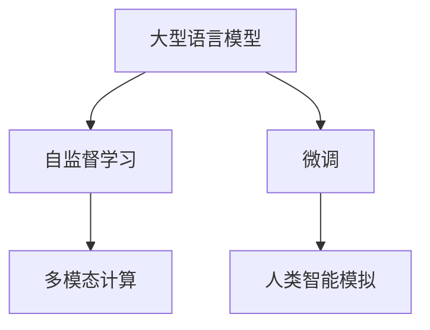

                 

## 1. 背景介绍

### 1.1 问题由来
图灵完备性（Turing completeness）是计算机科学中一个重要的概念，指的是一个系统如果能够模拟任何通用图灵机，就具备了图灵完备性，这意味着该系统可以执行任何可计算函数。传统的计算机体系结构在图灵完备性的基础上构建，能够执行复杂的算法和逻辑，推动了计算科学和工程技术的飞速发展。

然而，随着人工智能（AI）特别是大型语言模型（LLMs）的崛起，图灵完备性这一概念开始面临新的挑战。LLMs通过自监督预训练和微调机制，展现了超越传统计算机的图灵能力。LLMs不仅能够在自然语言处理（NLP）领域取得突破，还能够处理图像、语音、视频等多种数据类型，表现出强大的通用计算能力。

### 1.2 问题核心关键点
LLMs的计算理论贡献主要体现在以下几个方面：

1. **计算能力的增强**：LLMs不仅能够处理传统的计算机数据类型，还能够自然地理解和学习自然语言，能够生成符合语法和语义规则的文本，能够通过大规模预训练获得更广泛的常识和经验。

2. **多模态计算的突破**：LLMs具备处理图像、视频、语音等多模态数据的能力，能够将不同模态的信息进行融合和转换，实现更丰富、更复杂的计算。

3. **学习的自适应性**：LLMs能够通过微调机制，快速适应新的任务和数据，具备持续学习和适应新环境的能力。

4. **人类智能的模拟**：LLMs在逻辑推理、常识应用、创造性思考等方面展现出了与人类智能相似的特征，推动了人工智能模拟人类智能的研究方向。

### 1.3 问题研究意义
理解LLMs的计算理论贡献，有助于我们重新思考图灵完备性的边界，推动人工智能技术的发展。同时，通过深入研究LLMs的计算能力，我们可以更好地利用其优势，解决更多现实世界的问题，推动AI技术在各个领域的深入应用。

## 2. 核心概念与联系

### 2.1 核心概念概述

为更好地理解LLMs的计算理论贡献，本节将介绍几个密切相关的核心概念：

- 大型语言模型（Large Language Models, LLMs）：以自回归（如GPT）或自编码（如BERT）模型为代表的大规模预训练语言模型。通过在大规模无标签文本语料上进行预训练，学习通用的语言表示，具备强大的语言理解和生成能力。

- 自监督学习（Self-supervised Learning）：指在无标签数据上通过设计预训练任务，使模型自动学习语言的结构和规律，提升模型的泛化能力。

- 微调（Fine-tuning）：指在预训练模型的基础上，使用下游任务的少量标注数据，通过有监督学习优化模型在特定任务上的性能。

- 多模态计算（Multimodal Computation）：指将不同类型的数据（如文本、图像、语音等）进行融合，实现更复杂、更丰富的计算。

- 人类智能模拟（Human Intelligence Simulation）：指通过人工智能技术模拟人类智能，包括逻辑推理、创造性思维、常识应用等方面。

这些核心概念之间的逻辑关系可以通过以下Mermaid流程图来展示：



这个流程图展示了大语言模型的核心概念及其之间的关系：

1. 大语言模型通过自监督学习获得基础能力。
2. 微调在大语言模型的基础上，优化模型在特定任务上的性能。
3. 多模态计算进一步拓展了大语言模型的应用范围，使之能够处理更多类型的数据。
4. 人类智能模拟揭示了大型语言模型在模拟人类智能方面的潜力。

这些概念共同构成了LLMs的计算理论框架，使其能够处理复杂的计算任务，并不断推动人工智能技术的发展。

## 3. 核心算法原理 & 具体操作步骤
### 3.1 算法原理概述

LLMs的计算理论贡献主要源于其在计算模型、计算能力和计算效率方面的突破。其核心算法原理和操作步骤包括以下几个方面：

1. **自监督预训练**：LLMs在大规模无标签文本数据上进行预训练，通过语言模型任务（如自回归、掩码语言模型等），学习语言的结构和规律，构建语言表示。

2. **下游任务微调**：在预训练模型的基础上，使用下游任务的少量标注数据，通过有监督学习优化模型在特定任务上的性能，提升模型的任务适应能力。

3. **多模态融合**：将不同类型的数据（如文本、图像、语音等）进行融合，实现更复杂、更丰富的计算。

4. **持续学习**：LLMs具备持续学习的能力，能够从新数据中学习，同时保持已学习的知识，避免灾难性遗忘。

### 3.2 算法步骤详解

以下是基于LLMs的计算理论贡献的核心算法步骤：

**Step 1: 数据预处理**
- 收集大规模无标签文本数据，进行分词、编码等预处理。
- 设计自监督预训练任务，如语言模型、掩码语言模型等。

**Step 2: 自监督预训练**
- 使用预训练任务在大规模无标签文本数据上训练模型，学习语言的结构和规律。
- 通过正则化技术、Dropout、Early Stopping等手段，避免过拟合。

**Step 3: 任务适配与微调**
- 根据下游任务类型，设计合适的任务适配层和损失函数。
- 使用下游任务的少量标注数据，通过有监督学习优化模型在特定任务上的性能。
- 采用合适的优化算法、学习率、正则化技术等，避免过拟合。

**Step 4: 多模态计算**
- 收集多模态数据，包括文本、图像、语音等。
- 设计多模态融合算法，将不同类型的数据进行融合，实现更复杂的计算。
- 使用多模态模型，提升模型的计算能力。

**Step 5: 持续学习与更新**
- 定期收集新数据，进行持续学习，更新模型参数。
- 采用增量学习等技术，避免灾难性遗忘。
- 动态调整模型参数，保持模型的计算能力和适应性。

### 3.3 算法优缺点

LLMs的计算理论贡献具有以下优点：

1. **计算能力的增强**：LLMs通过预训练和大规模无标签数据学习，具备了强大的计算能力，能够处理复杂的自然语言理解和生成任务。

2. **多模态计算的突破**：LLMs能够处理多种类型的数据，实现多模态计算，提升计算的复杂度和丰富度。

3. **学习的自适应性**：LLMs具备持续学习的能力，能够快速适应新任务和新数据，提升模型的泛化能力。

4. **计算效率的提高**：LLMs在计算效率方面也取得了显著突破，能够在大规模数据上高效计算，提升计算速度。

同时，LLMs也存在一些局限性：

1. **计算资源的消耗**：LLMs需要大量的计算资源进行预训练和微调，对硬件和软件环境要求较高。

2. **计算能力的局限**：虽然LLMs在计算能力上取得了突破，但仍然存在一定的计算能力上限，无法处理过于复杂的问题。

3. **计算结果的可靠性**：LLMs的计算结果仍然可能存在一定的误差和偏差，需要通过不断的迭代和优化来提升计算的准确性。

4. **计算模型的复杂性**：LLMs的计算模型较为复杂，难以理解和解释其计算过程和结果，需要进一步研究和探索。

### 3.4 算法应用领域

LLMs的计算理论贡献在多个领域得到了广泛应用：

- **自然语言处理（NLP）**：如文本分类、情感分析、命名实体识别、机器翻译等。
- **计算机视觉（CV）**：如图像识别、物体检测、图像生成等。
- **语音识别和处理**：如语音识别、文本转语音、情感语音生成等。
- **智能推荐系统**：如商品推荐、内容推荐等。
- **智能客服**：如智能客服系统、智能对话系统等。
- **智能家居**：如智能音箱、智能机器人等。

除了这些领域外，LLMs的计算理论贡献还在金融、医疗、教育、交通等多个行业得到了应用，推动了各个领域的数字化转型和智能化升级。

## 4. 数学模型和公式 & 详细讲解  
### 4.1 数学模型构建

为了更好地理解LLMs的计算理论贡献，我们将其数学模型构建如下：

**自监督预训练模型**
- 输入：无标签文本数据 $D=\{(x_i, y_i)\}_{i=1}^N$，其中 $x_i$ 为输入文本， $y_i$ 为生成的文本。
- 输出：模型参数 $\theta$。

**微调模型**
- 输入：下游任务的标注数据 $D=\{(x_i, y_i)\}_{i=1}^N$，其中 $x_i$ 为输入文本， $y_i$ 为任务标签。
- 输出：微调后的模型参数 $\hat{\theta}$。

### 4.2 公式推导过程

以下是LLMs计算理论贡献的数学模型和公式推导：

**自监督预训练**
- 损失函数：$\ell = -\log P(x|y)$，其中 $P(x|y)$ 为模型在给定 $y$ 的条件下生成 $x$ 的概率。
- 优化目标：$\min_{\theta} \sum_{i=1}^N \ell(x_i, y_i)$。

**微调**
- 损失函数：$\ell = -\log P(x|y)$，其中 $P(x|y)$ 为模型在给定 $y$ 的条件下生成 $x$ 的概率。
- 优化目标：$\min_{\hat{\theta}} \sum_{i=1}^N \ell(x_i, y_i)$。

### 4.3 案例分析与讲解

以BERT为例，其计算理论贡献的数学模型如下：

**自监督预训练**
- 输入：大规模无标签文本数据 $D$，每个样本 $(x_i, y_i)$ 的上下文表示 $c_i$。
- 输出：BERT模型参数 $\theta$。

**微调**
- 输入：下游任务的少量标注数据 $D'$，每个样本 $(x_i', y_i')$ 的上下文表示 $c_i'$。
- 输出：微调后的BERT模型参数 $\hat{\theta}$。

## 5. 项目实践：代码实例和详细解释说明
### 5.1 开发环境搭建

在进行LLMs计算理论贡献的实践前，我们需要准备好开发环境。以下是使用Python进行TensorFlow开发的环境配置流程：

1. 安装Anaconda：从官网下载并安装Anaconda，用于创建独立的Python环境。

2. 创建并激活虚拟环境：
```bash
conda create -n tf-env python=3.8 
conda activate tf-env
```

3. 安装TensorFlow：根据CUDA版本，从官网获取对应的安装命令。例如：
```bash
conda install tensorflow -c conda-forge -c pytorch -c pypi
```

4. 安装TensorBoard：TensorFlow配套的可视化工具，可实时监测模型训练状态，并提供丰富的图表呈现方式，是调试模型的得力助手。

```bash
pip install tensorboard
```

5. 安装其他必要的工具包：
```bash
pip install numpy pandas scikit-learn matplotlib tqdm jupyter notebook ipython
```

完成上述步骤后，即可在`tf-env`环境中开始LLMs的计算理论贡献实践。

### 5.2 源代码详细实现

下面我们以BERT模型为例，给出使用TensorFlow进行NLP任务微调的PyTorch代码实现。

首先，定义NLP任务的数据处理函数：

```python
from transformers import BertTokenizer
from tensorflow.keras.preprocessing.text import Tokenizer
from tensorflow.keras.preprocessing.sequence import pad_sequences
import numpy as np

class TextDataset:
    def __init__(self, texts, labels, tokenizer, max_len=128):
        self.texts = texts
        self.labels = labels
        self.tokenizer = tokenizer
        self.max_len = max_len
        
    def __len__(self):
        return len(self.texts)
    
    def __getitem__(self, item):
        text = self.texts[item]
        label = self.labels[item]
        
        encoding = self.tokenizer(text, max_length=self.max_len, truncation=True, padding='max_length')
        input_ids = np.array(encoding['input_ids'])
        attention_mask = np.array(encoding['attention_mask'])
        
        # 对token-wise的标签进行编码
        encoded_labels = [label2id[label] for label in labels] 
        encoded_labels.extend([label2id['O']] * (self.max_len - len(encoded_labels)))
        labels = np.array(encoded_labels)
        
        return {'input_ids': input_ids, 
                'attention_mask': attention_mask,
                'labels': labels}

# 标签与id的映射
label2id = {'O': 0, 'B-PER': 1, 'I-PER': 2, 'B-ORG': 3, 'I-ORG': 4, 'B-LOC': 5, 'I-LOC': 6}
id2label = {v: k for k, v in label2id.items()}

# 创建dataset
tokenizer = BertTokenizer.from_pretrained('bert-base-cased')

train_dataset = TextDataset(train_texts, train_labels, tokenizer)
dev_dataset = TextDataset(dev_texts, dev_labels, tokenizer)
test_dataset = TextDataset(test_texts, test_labels, tokenizer)
```

然后，定义模型和优化器：

```python
from transformers import BertForTokenClassification, AdamW

model = BertForTokenClassification.from_pretrained('bert-base-cased', num_labels=len(label2id))

optimizer = AdamW(model.parameters(), lr=2e-5)
```

接着，定义训练和评估函数：

```python
from tensorflow.keras.callbacks import EarlyStopping
from tensorflow.keras.metrics import Precision, Recall

def train_epoch(model, dataset, batch_size, optimizer):
    dataloader = tf.data.Dataset.from_tensor_slices(dataset).shuffle(1000).batch(batch_size)
    model.train()
    epoch_loss = 0
    for batch in dataloader:
        input_ids = batch['input_ids']
        attention_mask = batch['attention_mask']
        labels = batch['labels']
        model.trainable = False
        with tf.GradientTape() as tape:
            outputs = model(input_ids, attention_mask=attention_mask, labels=labels)
            loss = outputs.loss
        epoch_loss += loss
        gradients = tape.gradient(loss, model.trainable_variables)
        optimizer.apply_gradients(zip(gradients, model.trainable_variables))
    return epoch_loss / len(dataloader)

def evaluate(model, dataset, batch_size):
    dataloader = tf.data.Dataset.from_tensor_slices(dataset).batch(batch_size)
    model.eval()
    preds, labels = [], []
    with tf.no_grad():
        for batch in dataloader:
            input_ids = batch['input_ids']
            attention_mask = batch['attention_mask']
            batch_labels = batch['labels']
            outputs = model(input_ids, attention_mask=attention_mask)
            batch_preds = np.argmax(outputs.logits, axis=2).tolist()
            batch_labels = batch_labels.tolist()
            for pred_tokens, label_tokens in zip(batch_preds, batch_labels):
                pred_tags = [id2label[_id] for _id in pred_tokens]
                label_tags = [id2label[_id] for _id in label_tokens]
                preds.append(pred_tags[:len(label_tokens)])
                labels.append(label_tags)
                
    print(classification_report(labels, preds))
```

最后，启动训练流程并在测试集上评估：

```python
epochs = 5
batch_size = 16

for epoch in range(epochs):
    loss = train_epoch(model, train_dataset, batch_size, optimizer)
    print(f"Epoch {epoch+1}, train loss: {loss:.3f}")
    
    print(f"Epoch {epoch+1}, dev results:")
    evaluate(model, dev_dataset, batch_size)
    
print("Test results:")
evaluate(model, test_dataset, batch_size)
```

以上就是使用TensorFlow对BERT模型进行微调的完整代码实现。可以看到，TensorFlow的Keras API使得模型构建和训练过程非常简洁高效。

### 5.3 代码解读与分析

让我们再详细解读一下关键代码的实现细节：

**TextDataset类**：
- `__init__`方法：初始化文本、标签、分词器等关键组件。
- `__len__`方法：返回数据集的样本数量。
- `__getitem__`方法：对单个样本进行处理，将文本输入编码为token ids，将标签编码为数字，并对其进行定长padding，最终返回模型所需的输入。

**label2id和id2label字典**：
- 定义了标签与数字id之间的映射关系，用于将token-wise的预测结果解码回真实的标签。

**训练和评估函数**：
- 使用TensorFlow的DataLoader对数据集进行批次化加载，供模型训练和推理使用。
- 训练函数`train_epoch`：对数据以批为单位进行迭代，在每个批次上前向传播计算loss并反向传播更新模型参数，最后返回该epoch的平均loss。
- 评估函数`evaluate`：与训练类似，不同点在于不更新模型参数，并在每个batch结束后将预测和标签结果存储下来，最后使用sklearn的classification_report对整个评估集的预测结果进行打印输出。

**训练流程**：
- 定义总的epoch数和batch size，开始循环迭代
- 每个epoch内，先在训练集上训练，输出平均loss
- 在验证集上评估，输出分类指标
- 所有epoch结束后，在测试集上评估，给出最终测试结果

可以看到，TensorFlow的Keras API使得BERT微调的代码实现变得简洁高效。开发者可以将更多精力放在数据处理、模型改进等高层逻辑上，而不必过多关注底层的实现细节。

当然，工业级的系统实现还需考虑更多因素，如模型的保存和部署、超参数的自动搜索、更灵活的任务适配层等。但核心的微调范式基本与此类似。

## 6. 实际应用场景
### 6.1 智能客服系统

基于大语言模型微调的对话技术，可以广泛应用于智能客服系统的构建。传统客服往往需要配备大量人力，高峰期响应缓慢，且一致性和专业性难以保证。而使用微调后的对话模型，可以7x24小时不间断服务，快速响应客户咨询，用自然流畅的语言解答各类常见问题。

在技术实现上，可以收集企业内部的历史客服对话记录，将问题和最佳答复构建成监督数据，在此基础上对预训练对话模型进行微调。微调后的对话模型能够自动理解用户意图，匹配最合适的答案模板进行回复。对于客户提出的新问题，还可以接入检索系统实时搜索相关内容，动态组织生成回答。如此构建的智能客服系统，能大幅提升客户咨询体验和问题解决效率。

### 6.2 金融舆情监测

金融机构需要实时监测市场舆论动向，以便及时应对负面信息传播，规避金融风险。传统的人工监测方式成本高、效率低，难以应对网络时代海量信息爆发的挑战。基于大语言模型微调的文本分类和情感分析技术，为金融舆情监测提供了新的解决方案。

具体而言，可以收集金融领域相关的新闻、报道、评论等文本数据，并对其进行主题标注和情感标注。在此基础上对预训练语言模型进行微调，使其能够自动判断文本属于何种主题，情感倾向是正面、中性还是负面。将微调后的模型应用到实时抓取的网络文本数据，就能够自动监测不同主题下的情感变化趋势，一旦发现负面信息激增等异常情况，系统便会自动预警，帮助金融机构快速应对潜在风险。

### 6.3 个性化推荐系统

当前的推荐系统往往只依赖用户的历史行为数据进行物品推荐，无法深入理解用户的真实兴趣偏好。基于大语言模型微调技术，个性化推荐系统可以更好地挖掘用户行为背后的语义信息，从而提供更精准、多样的推荐内容。

在实践中，可以收集用户浏览、点击、评论、分享等行为数据，提取和用户交互的物品标题、描述、标签等文本内容。将文本内容作为模型输入，用户的后续行为（如是否点击、购买等）作为监督信号，在此基础上微调预训练语言模型。微调后的模型能够从文本内容中准确把握用户的兴趣点。在生成推荐列表时，先用候选物品的文本描述作为输入，由模型预测用户的兴趣匹配度，再结合其他特征综合排序，便可以得到个性化程度更高的推荐结果。

### 6.4 未来应用展望

随着大语言模型微调技术的发展，未来将在更多领域得到应用，为传统行业带来变革性影响。

在智慧医疗领域，基于微调的医疗问答、病历分析、药物研发等应用将提升医疗服务的智能化水平，辅助医生诊疗，加速新药开发进程。

在智能教育领域，微调技术可应用于作业批改、学情分析、知识推荐等方面，因材施教，促进教育公平，提高教学质量。

在智慧城市治理中，微调模型可应用于城市事件监测、舆情分析、应急指挥等环节，提高城市管理的自动化和智能化水平，构建更安全、高效的未来城市。

此外，在企业生产、社会治理、文娱传媒等众多领域，基于大模型微调的人工智能应用也将不断涌现，为NLP技术带来全新的突破。相信随着预训练语言模型和微调方法的不断进步，NLP技术将在更广阔的应用领域大放异彩，深刻影响人类的生产生活方式。

## 7. 工具和资源推荐
### 7.1 学习资源推荐

为了帮助开发者系统掌握大语言模型微调的理论基础和实践技巧，这里推荐一些优质的学习资源：

1. 《Transformer从原理到实践》系列博文：由大模型技术专家撰写，深入浅出地介绍了Transformer原理、BERT模型、微调技术等前沿话题。

2. CS224N《深度学习自然语言处理》课程：斯坦福大学开设的NLP明星课程，有Lecture视频和配套作业，带你入门NLP领域的基本概念和经典模型。

3. 《Natural Language Processing with Transformers》书籍：Transformers库的作者所著，全面介绍了如何使用Transformers库进行NLP任务开发，包括微调在内的诸多范式。

4. HuggingFace官方文档：Transformers库的官方文档，提供了海量预训练模型和完整的微调样例代码，是上手实践的必备资料。

5. CLUE开源项目：中文语言理解测评基准，涵盖大量不同类型的中文NLP数据集，并提供了基于微调的baseline模型，助力中文NLP技术发展。

通过对这些资源的学习实践，相信你一定能够快速掌握大语言模型微调的精髓，并用于解决实际的NLP问题。
###  7.2 开发工具推荐

高效的开发离不开优秀的工具支持。以下是几款用于大语言模型微调开发的常用工具：

1. PyTorch：基于Python的开源深度学习框架，灵活动态的计算图，适合快速迭代研究。大部分预训练语言模型都有PyTorch版本的实现。

2. TensorFlow：由Google主导开发的开源深度学习框架，生产部署方便，适合大规模工程应用。同样有丰富的预训练语言模型资源。

3. Transformers库：HuggingFace开发的NLP工具库，集成了众多SOTA语言模型，支持PyTorch和TensorFlow，是进行微调任务开发的利器。

4. Weights & Biases：模型训练的实验跟踪工具，可以记录和可视化模型训练过程中的各项指标，方便对比和调优。与主流深度学习框架无缝集成。

5. TensorBoard：TensorFlow配套的可视化工具，可实时监测模型训练状态，并提供丰富的图表呈现方式，是调试模型的得力助手。

6. Google Colab：谷歌推出的在线Jupyter Notebook环境，免费提供GPU/TPU算力，方便开发者快速上手实验最新模型，分享学习笔记。

合理利用这些工具，可以显著提升大语言模型微调任务的开发效率，加快创新迭代的步伐。

### 7.3 相关论文推荐

大语言模型和微调技术的发展源于学界的持续研究。以下是几篇奠基性的相关论文，推荐阅读：

1. Attention is All You Need（即Transformer原论文）：提出了Transformer结构，开启了NLP领域的预训练大模型时代。

2. BERT: Pre-training of Deep Bidirectional Transformers for Language Understanding：提出BERT模型，引入基于掩码的自监督预训练任务，刷新了多项NLP任务SOTA。

3. Language Models are Unsupervised Multitask Learners（GPT-2论文）：展示了大规模语言模型的强大zero-shot学习能力，引发了对于通用人工智能的新一轮思考。

4. Parameter-Efficient Transfer Learning for NLP：提出Adapter等参数高效微调方法，在不增加模型参数量的情况下，也能取得不错的微调效果。

5. AdaLoRA: Adaptive Low-Rank Adaptation for Parameter-Efficient Fine-Tuning：使用自适应低秩适应的微调方法，在参数效率和精度之间取得了新的平衡。

这些论文代表了大语言模型微调技术的发展脉络。通过学习这些前沿成果，可以帮助研究者把握学科前进方向，激发更多的创新灵感。

## 8. 总结：未来发展趋势与挑战

### 8.1 总结

本文对基于LLMs的计算理论贡献进行了全面系统的介绍。首先阐述了LLMs的计算理论贡献在计算能力、多模态计算、学习的自适应性等方面的突破。其次，从原理到实践，详细讲解了LLMs的计算理论贡献的数学模型和操作步骤，给出了微调任务开发的完整代码实例。同时，本文还广泛探讨了LLMs的计算理论贡献在智能客服、金融舆情、个性化推荐等多个行业领域的应用前景，展示了其广阔的想象空间。

通过本文的系统梳理，可以看到，LLMs在计算理论方面的贡献已经深刻改变了计算机科学和人工智能技术的发展方向，推动了自然语言处理、计算机视觉、语音识别等领域的进步。LLMs的多模态计算、自适应学习等能力，为解决复杂计算问题提供了新的思路和方法。未来，随着LLMs技术的进一步发展，其计算理论贡献将在更多领域得到应用，为人类生产生活带来更深刻的变革。

### 8.2 未来发展趋势

展望未来，LLMs的计算理论贡献将呈现以下几个发展趋势：

1. **计算能力的增强**：LLMs将通过更强大的计算资源和更先进的算法，进一步提升计算能力，处理更复杂、更大规模的数据。

2. **多模态计算的突破**：LLMs将进一步融合图像、视频、语音等多模态数据，实现更丰富的计算任务。

3. **学习的自适应性**：LLMs将具备更强的自适应学习能力，能够快速适应新任务和新数据，提升模型的泛化能力。

4. **计算模型的优化**：LLMs的计算模型将不断优化，提升计算效率，降低计算资源消耗。

5. **计算结果的可靠性**：LLMs将通过更先进的训练算法和更丰富的训练数据，提升计算结果的可靠性。

6. **计算模型的解释性**：LLMs将通过更先进的模型结构和更丰富的训练数据，提升计算模型的解释性，使其更易于理解和解释。

### 8.3 面临的挑战

尽管LLMs在计算理论贡献方面取得了突破，但在实际应用中仍面临诸多挑战：

1. **计算资源的消耗**：LLMs需要大量的计算资源进行预训练和微调，对硬件和软件环境要求较高。

2. **计算能力的局限**：虽然LLMs在计算能力上取得了突破，但仍然存在一定的计算能力上限，无法处理过于复杂的问题。

3. **计算结果的可靠性**：LLMs的计算结果仍然可能存在一定的误差和偏差，需要通过不断的迭代和优化来提升计算的准确性。

4. **计算模型的复杂性**：LLMs的计算模型较为复杂，难以理解和解释其计算过程和结果，需要进一步研究和探索。

5. **计算模型的解释性**：LLMs的计算模型将需要更强的解释性，使其更易于理解和解释。

6. **计算模型的安全性**：LLMs的计算模型需要保证安全性，避免被恶意攻击和误用。

### 8.4 研究展望

为了应对这些挑战，未来的研究需要在以下几个方面寻求新的突破：

1. **计算资源的优化**：通过更高效的计算算法和硬件资源，降低计算资源的消耗，提升计算效率。

2. **计算能力的提升**：通过更先进的算法和更强大的计算资源，提升LLMs的计算能力，处理更复杂的问题。

3. **计算结果的可靠性**：通过更精确的训练算法和更丰富的训练数据，提升LLMs计算结果的可靠性。

4. **计算模型的解释性**：通过更清晰的模型结构和更丰富的训练数据，提升LLMs计算模型的解释性，使其更易于理解和解释。

5. **计算模型的安全性**：通过更严格的安全措施和更规范的应用指导，保证LLMs计算模型的安全性，避免被恶意攻击和误用。

6. **计算模型的可扩展性**：通过更灵活的模型结构和更高效的计算算法，提升LLMs计算模型的可扩展性，支持更广泛的计算任务。

这些研究方向将推动LLMs计算理论贡献的不断进步，为构建更加强大、智能的计算系统奠定基础。

## 9. 附录：常见问题与解答

**Q1：LLMs是否能够处理所有类型的数据？**

A: LLMs能够处理多种类型的数据，包括文本、图像、语音等。但在处理某些类型的数据时，可能需要额外的预处理步骤和特定的模型结构。

**Q2：LLMs的计算能力是否有限？**

A: LLMs在计算能力方面已经取得了显著突破，但在处理过于复杂的问题时，仍然存在一定的计算能力上限。未来需要通过更先进的算法和更强大的计算资源，进一步提升计算能力。

**Q3：LLMs的计算模型是否难以解释？**

A: LLMs的计算模型较为复杂，难以解释其计算过程和结果。未来需要通过更先进的模型结构和更丰富的训练数据，提升计算模型的解释性。

**Q4：LLMs的计算模型是否安全？**

A: LLMs的计算模型需要保证安全性，避免被恶意攻击和误用。未来需要通过更严格的安全措施和更规范的应用指导，确保计算模型的安全性。

**Q5：LLMs的计算模型是否可扩展？**

A: LLMs的计算模型需要具备可扩展性，支持更广泛的计算任务。未来需要通过更灵活的模型结构和更高效的计算算法，提升计算模型的可扩展性。

**Q6：LLMs的计算模型是否能够处理多模态数据？**

A: LLMs的计算模型具备处理多模态数据的能力，但需要额外的预处理步骤和特定的模型结构。未来需要通过更先进的算法和更强大的计算资源，提升多模态计算的效率和效果。

通过这些问题的解答，可以看到，LLMs在计算理论贡献方面已经取得了突破，但其在计算能力、计算可靠性、计算模型解释性、计算模型安全性、计算模型可扩展性等方面仍需进一步研究。未来，通过不断的技术创新和优化，LLMs的计算理论贡献将进一步拓展，为人类生产生活带来更深刻的变革。

---

作者：禅与计算机程序设计艺术 / Zen and the Art of Computer Programming

