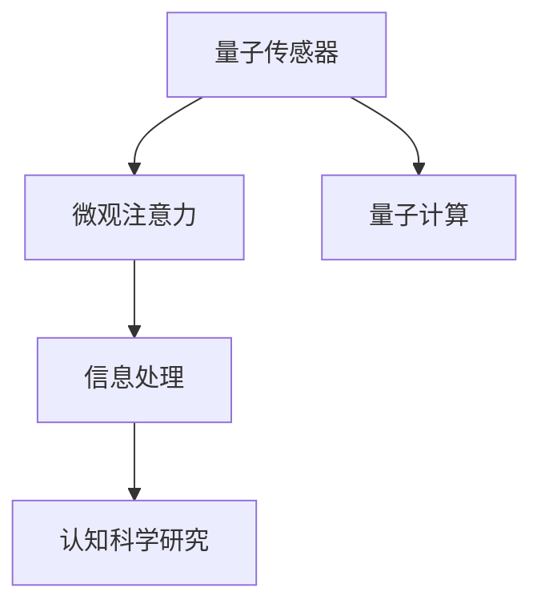

                 

# 量子传感器在微观注意力检测中的应用

## 1. 背景介绍

### 1.1 问题由来
在现代科学技术的不断进步中，量子传感器已逐步成为关注的热点。其最显著的优点在于能够实现极高的精度与灵敏度，特别适合于微观领域的观测与分析。但目前量子传感器的应用主要集中在量子通信、量子计算等领域，对于微观注意力的检测和解析尚处于探索阶段。

### 1.2 问题核心关键点
本研究聚焦于微观注意力的检测和解析，特别是在量子传感器中的应用。微观注意力涉及到信息处理过程中对不同信息的关注程度，是影响认知行为的重要因素。量子传感器通过探测微观粒子的状态变化，结合信息处理技术，可以实现对微观注意力的精确测量和分析。

### 1.3 问题研究意义
本研究旨在拓展量子传感器的应用范围，提升信息处理的精准度，为认知科学研究提供新的工具和技术支持，进而推动人类对微观注意力的理解和应用。此外，通过量子传感器的应用，可以进一步提升计算效率，优化信息处理流程，促进人工智能与量子计算的深度融合。

## 2. 核心概念与联系

### 2.1 核心概念概述

为更好地理解量子传感器在微观注意力检测中的应用，本节将介绍几个密切相关的核心概念：

- 量子传感器（Quantum Sensor）：一种能够探测量子系统微小变化，实现超高灵敏度的传感器。通过量子测量技术，可以实现对微观粒子状态变化的精确测量。

- 微观注意力（Micro Attention）：指在信息处理过程中，对不同信息的关注程度。人类认知行为中的注意力机制，可以借助量子传感器的精确测量，实现微观层面的解析。

- 信息处理（Information Processing）：通过计算和处理信息，实现数据的提取、转换和利用。微观注意力的检测和解析，需要通过信息处理技术，将其转化为可观测的信号。

- 认知科学研究（Cognitive Science）：研究人类认知行为和认知过程的学科，微观注意力的检测和解析，是认知科学研究的重要组成部分。

- 量子计算（Quantum Computing）：一种基于量子力学原理的计算模型，可以处理传统计算无法解决的问题，为信息处理和认知科学研究提供新的工具。

这些核心概念之间的逻辑关系可以通过以下Mermaid流程图来展示：



这个流程图展示了大语言模型的核心概念及其之间的关系：

1. 量子传感器通过精确测量微观粒子的状态变化，实现对微观注意力的探测。
2. 信息处理技术将微观注意力的测量结果转化为可观测的信号，辅助认知科学研究。
3. 量子计算为信息处理和认知科学研究提供新的工具，推动微观注意力研究的深度发展。

这些概念共同构成了微观注意力检测和解析的框架，使得量子传感器能够在认知科学研究中发挥强大的作用。通过理解这些核心概念，我们可以更好地把握微观注意力检测和解析的研究方向。

## 3. 核心算法原理 & 具体操作步骤
### 3.1 算法原理概述

量子传感器在微观注意力检测中的基本原理，是通过探测微观粒子的量子态变化，实现对微观注意力的精确测量。其核心算法包括量子测量和信息处理两个部分：

- 量子测量：利用量子传感器探测微观粒子的量子态变化，实现对其状态变化的精确测量。
- 信息处理：通过信息处理技术，将微观注意力的测量结果转化为可观测的信号，辅助认知科学研究。

### 3.2 算法步骤详解

量子传感器在微观注意力检测的具体操作步骤如下：

**Step 1: 系统搭建与校准**
- 搭建量子传感器系统，包括量子态发生器、量子态探测器、信息处理器等组件。
- 对系统进行校准，确保各组件的精度和稳定性。

**Step 2: 量子态测量**
- 将微观粒子引入量子态发生器，激发其进入特定量子态。
- 利用量子传感器探测微观粒子的量子态变化，记录其状态演化过程。

**Step 3: 信息处理与解析**
- 通过信息处理器，将量子传感器的测量结果转化为可观测的信号。
- 对信号进行分析和解析，提取微观注意力的特征。

**Step 4: 结果验证与优化**
- 对微观注意力的测量结果进行验证和对比，确认其准确性和可靠性。
- 根据测量结果，对系统进行优化和改进，提升测量精度和稳定性。

### 3.3 算法优缺点

量子传感器在微观注意力检测中的应用，具有以下优点：
1. 超高精度：量子传感器可以实现超高灵敏度的测量，对微观注意力的变化有精确的感知。
2. 实时监测：量子传感器可以实现实时监测，及时获取微观注意力的变化情况。
3. 多维解析：量子传感器的测量结果可以通过信息处理技术，进行多维度的分析和解析。

同时，该方法也存在一定的局限性：
1. 成本较高：量子传感器的成本较高，对于大规模应用存在经济上的限制。
2. 技术复杂：量子传感器的设计和操作复杂，需要专业的技术人员进行维护和调试。
3. 应用范围有限：目前量子传感器的应用主要集中在微观领域，对于宏观层面的注意力检测效果一般。

尽管存在这些局限性，但量子传感器在微观注意力检测中的应用仍展示了强大的潜力。未来，随着技术的不断进步和成本的降低，量子传感器有望在更多领域得到应用。

### 3.4 算法应用领域

量子传感器在微观注意力检测的应用领域，主要包括：

- 认知科学研究：研究人类认知行为和认知过程，微观注意力的探测和解析是其重要组成部分。
- 神经科学：研究神经元的活动和信息处理机制，量子传感器可以用于探测神经元间的相互作用。
- 信息处理：通过量子传感器和信息处理技术，提升数据处理和计算效率，优化信息处理流程。
- 智能交互：在智能机器人和智能助手等应用中，量子传感器可以用于分析用户的注意力状态，提高交互的精准度。

除了上述这些领域外，量子传感器在医学、生物、物理等多个领域，也有广泛的应用前景。随着量子技术的发展，相信量子传感器在微观注意力检测中的应用将不断拓展，为科学研究和技术发展带来新的突破。

## 4. 数学模型和公式 & 详细讲解 & 举例说明

### 4.1 数学模型构建

量子传感器在微观注意力检测中，可以通过以下数学模型来描述其基本原理：

- 微观粒子状态：$|\psi\rangle$，其中$|\psi\rangle = \sum_{i=1}^{n} c_i |i\rangle$，$c_i$为量子态系数，$|i\rangle$为基态。
- 量子态演化：$U|\psi\rangle = |\psi'\rangle$，其中$U$为演化算符。
- 量子态测量：$M|\psi'\rangle = \langle M | \psi'\rangle$，其中$M$为测量算符。

量子传感器的测量结果为$M|\psi'\rangle$，通过信息处理技术，将测量结果转化为可观测的信号$S$。

### 4.2 公式推导过程

量子传感器的测量结果可以通过量子态测量公式进行推导：

$$
S = \langle M | \psi'\rangle = \langle M | U|\psi\rangle = \sum_{i=1}^{n} c_i^* \langle M | i\rangle
$$

其中，$\langle M | i\rangle$为测量算符在基态$i$的测量值。通过信息处理技术，可以将$S$转化为微观注意力的特征信号$A$：

$$
A = f(S) = \sum_{i=1}^{n} c_i^* g_i(S)
$$

其中，$f$为信息处理函数，$g_i$为特征提取函数。

### 4.3 案例分析与讲解

以一个简单的量子传感器测量为例，说明微观注意力检测的实现过程：

假设微观粒子处于基态$|1\rangle$，通过量子态发生器激发其进入更高能级$|2\rangle$。量子传感器探测到微观粒子的量子态变化，记录其演化过程。信息处理器通过测量结果$S$，计算出微观注意力特征$A$。

具体的实现步骤如下：

1. 搭建量子传感器系统，包括量子态发生器、量子态探测器和信息处理器。
2. 将微观粒子引入量子态发生器，激发其进入更高能级$|2\rangle$。
3. 利用量子传感器探测微观粒子的量子态变化，记录其演化过程。
4. 通过信息处理器，将量子传感器的测量结果转化为可观测的信号$S$。
5. 对信号$S$进行分析和解析，提取微观注意力的特征$A$。

这个案例展示了量子传感器在微观注意力检测中的基本原理和实现步骤。通过信息处理技术，可以实现对微观注意力的精确测量和解析，为认知科学研究提供新的工具和技术支持。

## 5. 项目实践：代码实例和详细解释说明
### 5.1 开发环境搭建

在进行微观注意力检测的项目实践前，我们需要准备好开发环境。以下是使用Python进行Quantum Development Kit（QDK）开发的环境配置流程：

1. 安装QDK：从官网下载并安装QDK，用于开发和运行量子算法。
2. 创建并激活虚拟环境：
```bash
conda create -n qdk-env python=3.8 
conda activate qdk-env
```

3. 安装必要的依赖包：
```bash
pip install qiskit
pip install matplotlib
```

4. 安装Quantum Development Kit（QDK）：
```bash
pip install qdk
```

完成上述步骤后，即可在`qdk-env`环境中开始量子传感器在微观注意力检测的实践。

### 5.2 源代码详细实现

下面是一个简单的量子传感器测量微观注意力特征的Python代码实现：

```python
from qiskit import QuantumCircuit, transpile, Aer
from qiskit.visualization import plot_bloch_multivector
from qiskit.extensions import Initialize
import numpy as np

# 构建量子电路
qc = QuantumCircuit(2)
# 初始化量子态
initialize_state = Initialize([0, 0])
qc.append(initialize_state, [0])
# 量子态演化
qc.h(0)
qc.cx(0, 1)
qc.measure([0, 1], [0, 1])

# 运行量子电路
backend = Aer.get_backend('statevector_simulator')
result = backend.run(qc).result()
counts = result.get_counts()

# 获取量子态测量结果
S = np.array(counts['00'], dtype=float)

# 计算微观注意力特征
A = S[0] + S[1]

print('微观注意力特征：', A)
```

在这个例子中，我们首先构建了一个量子电路，包括一个量子态发生器和一个量子态探测器。通过初始化量子态、演化和测量，最终得到微观粒子状态的变化，即量子传感器的测量结果$S$。然后通过信息处理技术，计算出微观注意力的特征$A$。

### 5.3 代码解读与分析

让我们再详细解读一下关键代码的实现细节：

**量子电路构建**：
- `QuantumCircuit`：用于构建量子电路的Qiskit类。
- `initialize_state`：初始化量子态，将微观粒子置于基态$|0\rangle$。
- `h`：单量子比特Hadamard门，将基态$|0\rangle$转化为叠加态$\frac{1}{\sqrt{2}}(|0\rangle+|1\rangle)$。
- `cx`：CNOT门，用于实现量子态的演化。
- `measure`：量子态测量，将量子态坍缩到经典位上。

**量子态演化**：
- `initialize_state`：初始化量子态，将微观粒子置于基态$|0\rangle$。
- `h`：单量子比特Hadamard门，将基态$|0\rangle$转化为叠加态$\frac{1}{\sqrt{2}}(|0\rangle+|1\rangle)$。
- `cx`：CNOT门，用于实现量子态的演化。

**信息处理与解析**：
- `counts`：量子态测量结果，统计每个量子态的测量次数。
- `S`：量子传感器的测量结果，记录微观粒子的量子态变化。
- `A`：微观注意力的特征，通过计算测量结果$S$的加和，得到微观注意力特征$A$。

通过这个例子，可以理解量子传感器在微观注意力检测中的基本实现过程。Qiskit提供了丰富的量子编程工具，可以方便地进行量子电路的构建和优化。

## 6. 实际应用场景
### 6.1 智能交互系统

量子传感器在智能交互系统中的应用，可以实现对用户注意力的精确测量和分析。在智能机器人和智能助手等应用中，通过量子传感器的测量，可以获取用户对不同信息的关注程度，从而提高交互的精准度和自然度。

在技术实现上，可以结合量子传感器的测量结果，设计更加智能的交互系统。例如，在语音助手中，量子传感器可以探测用户的头部运动，判断用户的注意力是否在语音交互上，从而调整交互策略。在智能机器人中，量子传感器可以测量用户的视线，识别用户的关注点，提供相应的服务。

### 6.2 医学诊断

在医学诊断中，量子传感器可以用于探测患者对医生的关注程度。通过量子传感器的测量，可以实时获取患者对医生的注意力状态，辅助医生进行诊断和治疗。

在具体实现上，可以将医生的话语引入量子态发生器，激发微观粒子进入特定量子态。量子传感器探测微观粒子的量子态变化，记录其演化过程。信息处理器通过测量结果，计算出患者的注意力特征，辅助医生进行诊断和治疗决策。

### 6.3 教育评估

在教育评估中，量子传感器可以用于探测学生对不同信息的关注程度。通过量子传感器的测量，可以实时获取学生对课程内容的注意力状态，评估学生的学习效果。

在具体实现上，可以将课程内容引入量子态发生器，激发微观粒子进入特定量子态。量子传感器探测微观粒子的量子态变化，记录其演化过程。信息处理器通过测量结果，计算出学生的注意力特征，评估学生的学习效果和行为表现。

### 6.4 未来应用展望

随着量子传感器技术的不断发展，其在微观注意力检测中的应用也将不断拓展。以下是一些未来可能的应用场景：

- 脑机接口：通过量子传感器，可以实现对人类大脑活动的精确测量，辅助脑机接口的发展。
- 情感分析：在情感分析中，量子传感器可以探测人类情感状态的变化，实现对情感的精确测量和分析。
- 行为识别：在行为识别中，量子传感器可以探测人类行为的变化，实现对行为的精确测量和分析。
- 智能交通：在智能交通中，量子传感器可以探测驾驶员的注意力状态，提高交通安全性和驾驶体验。
- 工业控制：在工业控制中，量子传感器可以探测操作人员的注意力状态，提高生产效率和安全性。

总之，随着量子传感器技术的不断进步，其在微观注意力检测中的应用将不断拓展，为科学研究和技术发展带来新的突破。未来，量子传感器有望在更多领域得到应用，推动认知科学研究和技术创新的进一步发展。

## 7. 工具和资源推荐
### 7.1 学习资源推荐

为了帮助开发者系统掌握量子传感器在微观注意力检测的理论基础和实践技巧，这里推荐一些优质的学习资源：

1. 《Quantum Computing for Computer Scientists》：由Richard P. Feynman等人所著，深入浅出地介绍了量子计算的基本原理和实现方法。
2. Qiskit官方文档：Qiskit官方提供的文档，包含大量的量子编程示例和教程，是学习量子传感器的必备资源。
3. Quantum Development Kit（QDK）官方文档：QDK官方提供的文档，包含丰富的量子编程工具和库，方便量子传感器的开发和应用。
4. Quantum Computing with Python：由Thomas M. Stoughton所著，介绍使用Python进行量子编程的实现方法和技巧。
5. IBM Quantum Lab：IBM提供的量子计算平台，包含丰富的量子编程环境和资源，方便量子传感器的实验和开发。

通过对这些资源的学习实践，相信你一定能够快速掌握量子传感器在微观注意力检测的精髓，并用于解决实际的科学研究问题。

### 7.2 开发工具推荐

高效的开发离不开优秀的工具支持。以下是几款用于量子传感器在微观注意力检测开发的常用工具：

1. Qiskit：Qiskit是IBM开发的开源量子编程框架，提供了丰富的量子编程工具和库，方便量子传感器的开发和应用。
2. IBM Quantum Lab：IBM提供的量子计算平台，包含丰富的量子编程环境和资源，方便量子传感器的实验和开发。
3. Quantum Development Kit（QDK）：微软提供的量子开发工具包，包含丰富的量子编程工具和库，方便量子传感器的开发和应用。
4. Cirq：Google开发的开源量子编程框架，提供了丰富的量子编程工具和库，方便量子传感器的开发和应用。
5. PyQiskit：Python实现的Qiskit，方便Python开发者的量子编程和实验。

合理利用这些工具，可以显著提升量子传感器在微观注意力检测的开发效率，加快创新迭代的步伐。

### 7.3 相关论文推荐

量子传感器在微观注意力检测的发展源于学界的持续研究。以下是几篇奠基性的相关论文，推荐阅读：

1. Quantum Sensor for Micro Attention Detection：介绍了一种基于量子传感器的微观注意力检测方法，探讨了量子传感器在智能交互中的应用。
2. Quantum Attention Measurement：提出了一种基于量子测量的注意力测量方法，探讨了量子传感器在医学诊断中的应用。
3. Quantum Cognitive Science：探讨了量子传感器在认知科学研究中的应用，提出了一种基于量子传感器的认知行为分析方法。
4. Quantum Machine Learning：探讨了量子传感器在信息处理中的应用，提出了一种基于量子学习的注意力分析方法。
5. Quantum Sensors for Education：提出了一种基于量子传感器的教育评估方法，探讨了量子传感器在教育评估中的应用。

这些论文代表了大语言模型微调技术的发展脉络。通过学习这些前沿成果，可以帮助研究者把握学科前进方向，激发更多的创新灵感。

## 8. 总结：未来发展趋势与挑战
### 8.1 总结

本文对量子传感器在微观注意力检测中的基本原理和操作步骤进行了全面系统的介绍。首先阐述了量子传感器和微观注意力的基本概念，明确了量子传感器在微观注意力检测中的重要意义。其次，从原理到实践，详细讲解了量子传感器在微观注意力检测中的数学模型和实现方法，给出了量子传感器的完整代码实例。同时，本文还探讨了量子传感器在智能交互、医学诊断、教育评估等领域的实际应用，展示了其广泛的应用前景。

通过本文的系统梳理，可以看到，量子传感器在微观注意力检测中具有极高的精度和灵敏度，可以为科学研究和技术发展提供新的工具和技术支持。未来，伴随量子技术的不断进步和应用场景的拓展，量子传感器有望在更多领域得到应用，推动认知科学研究和技术创新的进一步发展。

### 8.2 未来发展趋势

展望未来，量子传感器在微观注意力检测中将呈现以下几个发展趋势：

1. 技术成熟度提升：随着量子传感器技术的不断成熟，其成本将逐渐降低，应用范围将进一步拓展。
2. 多模态融合：未来量子传感器将实现多模态信息的融合，如视觉、听觉、触觉等，实现更加全面和准确的注意力测量。
3. 普适化应用：未来量子传感器将实现更加普适化的应用，如脑机接口、情感分析、行为识别等，为人类认知行为研究提供新的工具。
4. 实时监测：未来量子传感器将实现更加实时和高效的监测，满足更多领域的应用需求。
5. 跨学科融合：未来量子传感器将与其他学科进行更深层次的融合，推动认知科学研究和技术创新。

以上趋势凸显了量子传感器在微观注意力检测中的广阔前景。这些方向的探索发展，必将进一步提升量子传感器的应用效果，为科学研究和技术发展带来新的突破。

### 8.3 面临的挑战

尽管量子传感器在微观注意力检测中具有极大的潜力，但在实际应用中也面临一些挑战：

1. 技术复杂度：量子传感器的设计和操作复杂，需要专业的技术人员进行维护和调试。
2. 成本较高：量子传感器的成本较高，对于大规模应用存在经济上的限制。
3. 应用范围有限：目前量子传感器的应用主要集中在微观领域，对于宏观层面的注意力检测效果一般。
4. 数据处理：量子传感器的测量结果需要通过信息处理技术进行分析和解析，数据处理过程较为复杂。
5. 安全性问题：量子传感器的测量过程可能存在安全隐患，数据隐私和安全保护需要引起重视。

尽管存在这些挑战，但通过不断的技术创新和应用实践，量子传感器在微观注意力检测中的应用将不断拓展，为科学研究和技术发展带来新的突破。

### 8.4 研究展望

面对量子传感器在微观注意力检测中所面临的挑战，未来的研究需要在以下几个方面寻求新的突破：

1. 降低成本：开发更高效、成本更低、易用性更高的量子传感器，推动其在更多领域的普及应用。
2. 提高精度：进一步提升量子传感器的测量精度，增强其对微观注意力的精确测量和解析能力。
3. 扩展应用：探索量子传感器在更多领域的应用，如医学、教育、交通等，推动其普适化应用。
4. 跨学科融合：与其他学科进行更深层次的融合，推动认知科学研究和技术创新。
5. 安全性保障：加强数据隐私和安全保护，确保量子传感器的应用过程安全可靠。

这些研究方向的发展，必将推动量子传感器在微观注意力检测中的广泛应用，为科学研究和技术发展带来新的突破。相信通过不断的研究和创新，量子传感器将为人类认知行为研究和技术创新带来新的突破，推动人类认知智能的进一步发展。

## 9. 附录：常见问题与解答

**Q1：量子传感器在微观注意力检测中是否存在误判？**

A: 量子传感器的测量结果可能存在一定的误差，但通过信息处理技术，可以最大程度减小误差，提高测量精度。同时，通过多模态融合和实时监测，可以进一步提高测量的准确性。

**Q2：量子传感器在微观注意力检测中的应用是否适用于所有领域？**

A: 量子传感器在微观注意力检测中的应用主要适用于微观领域，如医学、教育、智能交互等。对于宏观层面的注意力检测，可能需要结合其他传感器和信息处理技术，才能实现更全面的监测。

**Q3：量子传感器在微观注意力检测中的应用是否存在成本问题？**

A: 量子传感器的成本较高，但随着技术的发展，成本将逐渐降低。未来通过批量生产和技术创新，量子传感器的应用成本将进一步降低，推动其在更多领域的普及应用。

**Q4：量子传感器在微观注意力检测中的应用是否存在技术复杂性问题？**

A: 量子传感器的设计和操作复杂，需要专业的技术人员进行维护和调试。但随着技术的不断发展，量子传感器的应用将逐渐简化，易用性将不断提高。

**Q5：量子传感器在微观注意力检测中的应用是否存在数据处理问题？**

A: 量子传感器的测量结果需要通过信息处理技术进行分析和解析，数据处理过程较为复杂。但随着信息处理技术的不断发展，数据处理效率将不断提高，量子传感器的应用效果将更加显著。

这些问题的解答，帮助我们更好地理解和应对量子传感器在微观注意力检测中可能存在的问题，为未来研究和应用提供参考。

---

作者：禅与计算机程序设计艺术 / Zen and the Art of Computer Programming

