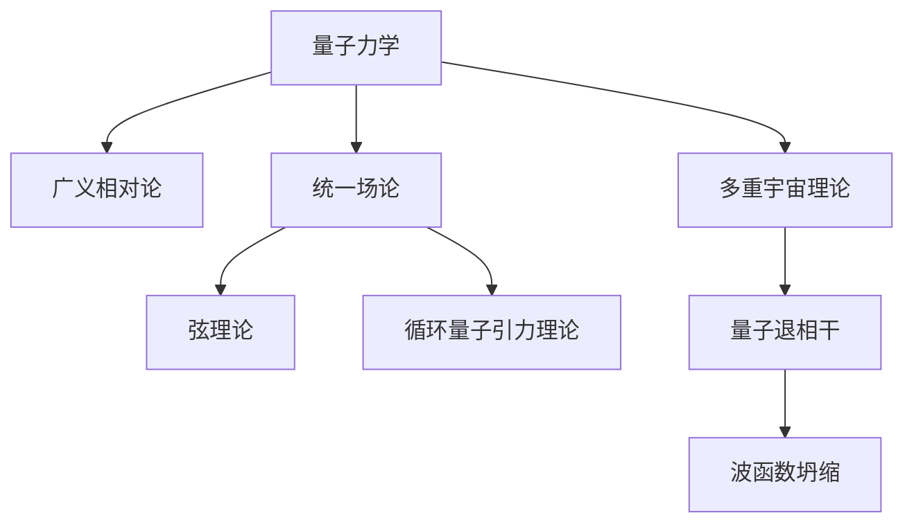

                 

## 1. 背景介绍

### 1.1 问题由来

量子引力（Quantum Gravity）是理论物理中一个极其重要的领域，旨在将量子力学与广义相对论这两个现代物理的基础理论统一起来。这个目标对理解宇宙的本质、时间的起源以及时空结构等方面具有重要意义。然而，至今尚未找到一条统一量子力学与广义相对论的路径，导致了量子引力理论在物理学家中的热烈讨论。

多重宇宙理论（Multiverse Theory）作为量子引力理论的一个分支，认为宇宙可能由多个并存的、互不相干的宇宙构成，每一个宇宙都有其自身的物理规律。这一理论通过将不同宇宙间的概率分布联系起来，提出了关于宇宙诞生、演化和存在的更为深刻的问题。

### 1.2 问题核心关键点

量子引力与多重宇宙理论的研究核心在于：
1. 如何将量子力学与广义相对论进行统一，从而找到描述引力的量子理论。
2. 如何理解多重宇宙的存在及其物理机制。
3. 量子引力和多重宇宙理论如何解释当前观测到的宇宙现象，特别是暗物质、暗能量等未解之谜。

这些核心问题直接关联到现代物理学中关于物质、能量和时空的基本理解，对于物理学的进步和发展具有深远影响。

### 1.3 问题研究意义

研究量子引力与多重宇宙理论具有重要意义：
1. 提供了一个全新的视角，解释诸如黑洞信息悖论、宇宙起源等未解的物理问题。
2. 有助于揭示宇宙的复杂结构，进而拓展人类对宇宙的认知。
3. 推动量子力学与广义相对论的统一，预示着对现有物理理论的一次革命性突破。

## 2. 核心概念与联系

### 2.1 核心概念概述

为更好地理解量子引力与多重宇宙理论，本节将介绍几个密切相关的核心概念：

- **量子力学**：研究微观粒子行为的理论，涉及波函数、不确定性原理、纠缠等基本概念。
- **广义相对论**：描述宏观引力现象的理论，涉及时空弯曲、黑洞、宇宙学等。
- **统一场论**：尝试将量子力学与广义相对论统一起来的理论框架，如弦理论、循环量子引力理论等。
- **多重宇宙理论**：提出宇宙可能由多个并行的宇宙构成，每个宇宙独立演化，彼此之间相互独立。
- **量子退相干**：解释为什么我们在宏观世界中只观察到一个宇宙的理论，涉及量子力学测量和环境影响。
- **波函数坍缩**：描述量子态测量时波函数的坍缩机制，导致多个宇宙之间的分支。

这些核心概念之间的逻辑关系可以通过以下Mermaid流程图来展示：



这个流程图展示了大语言模型的核心概念及其之间的关系：

1. 量子力学与广义相对论构成现代物理的两大支柱。
2. 统一场论尝试将这两者统一起来。
3. 弦理论、循环量子引力理论等是尝试实现统一的具体理论。
4. 多重宇宙理论基于量子力学的统计解释。
5. 量子退相干和波函数坍缩解释了多重宇宙的分支现象。

这些概念共同构成了量子引力与多重宇宙理论的研究框架，为我们理解宇宙的本质提供了多维度的视角。

## 3. 核心算法原理 & 具体操作步骤
### 3.1 算法原理概述

量子引力与多重宇宙理论的研究，本质上是将量子力学原理应用于宇宙尺度，通过数学和物理手段探索宇宙的深层次结构。其核心算法原理主要涉及以下几方面：

1. **量子场论**：将量子力学应用于场论框架中，探索基本粒子的生成与演化。
2. **引力场量子化**：将引力场看作量子场，寻找其量子化的表示形式。
3. **黑洞信息悖论的解决方案**：通过量子引力理论解释黑洞内部信息的去向。
4. **多重宇宙的分支概率**：利用量子力学中的波函数坍缩和退相干现象，计算不同宇宙分支的概率。
5. **宇宙的演化与结构**：通过量子引力理论预测宇宙的起源、结构与未来演化。

### 3.2 算法步骤详解

量子引力与多重宇宙理论的研究算法步骤如下：

**Step 1: 构建数学模型**

- 选择适当的数学框架，如量子场论、弦理论等。
- 确定基本粒子的量子场方程，如Dirac方程、Klein-Gordon方程等。
- 引入引力场的量子化，建立广义相对论的量子化理论，如微扰展开、路径积分方法等。

**Step 2: 计算基本粒子的生成与演化**

- 利用量子场论的基本方程，计算粒子的生成与湮灭过程。
- 引入相互作用项，描述粒子间的相互作用，如电磁相互作用、强相互作用、弱相互作用等。
- 通过求解方程，计算粒子的运动轨迹和状态变化。

**Step 3: 求解引力场的量子化**

- 在经典广义相对论的基础上，引入引力场的量子化。
- 通过计算引力场的量子涨落，建立量子引力场方程。
- 利用微扰展开和路径积分方法，求解引力场的量子化。

**Step 4: 解决黑洞信息悖论**

- 利用量子引力理论，解释黑洞内部的信息分布。
- 计算黑洞辐射的微粒能量，推导霍金辐射的公式。
- 分析黑洞信息在辐射中的表现形式，解释信息悖论。

**Step 5: 计算多重宇宙的分支概率**

- 利用量子力学的波函数坍缩和退相干理论，计算宇宙分支的概率。
- 引入多宇宙模型，计算每个宇宙的物理常数和观测值。
- 分析宇宙分支的概率分布，预测宇宙的演化路径。

**Step 6: 预测宇宙的起源、结构与未来演化**

- 利用量子引力理论，预测宇宙的起源和早期演化。
- 分析宇宙的大尺度结构，如暗物质、暗能量等。
- 预测宇宙的最终命运，如膨胀、坍缩、暴胀等。

### 3.3 算法优缺点

量子引力与多重宇宙理论的研究算法具有以下优点：
1. 为理解宇宙的深层次结构提供了全新的视角。
2. 能够解释现有物理理论无法解释的诸多问题，如黑洞信息悖论、宇宙起源等。
3. 在数学和物理上提供了统一的框架，有助于推动理论物理的发展。

然而，该算法也存在以下局限：
1. 现有的理论框架尚未完全成熟，存在诸多未解决的问题。
2. 实验验证难度较大，需要极端条件下的实验数据支持。
3. 理论复杂度较高，需要强大的数学和物理背景。

### 3.4 算法应用领域

量子引力与多重宇宙理论的研究算法广泛应用于多个领域：

- **粒子物理**：研究基本粒子的生成与演化，解决粒子物理学中的诸多未解问题。
- **宇宙学**：解释宇宙的起源、结构和演化，研究宇宙中的暗物质和暗能量等。
- **天体物理学**：探索黑洞、中子星、脉冲星等天体的本质和性质。
- **引力波天文学**：利用引力波探测黑洞和中子星的碰撞事件，验证量子引力理论。
- **数学和物理学**：推动理论数学和物理学的发展，为其他领域的交叉研究提供基础。

## 4. 数学模型和公式 & 详细讲解  
### 4.1 数学模型构建

量子引力与多重宇宙理论的研究涉及多个数学模型，这里以Dirac方程为例，展示量子力学的基本方程及其应用。

Dirac方程描述了电子等自旋粒子的运动，形式为：
$$(i\gamma^\mu\partial_\mu-m)\Psi=0$$
其中，$\gamma^\mu$为Dirac矩阵，$\partial_\mu$为偏导数，$m$为电子质量。

### 4.2 公式推导过程

Dirac方程的推导涉及以下几个步骤：

1. **自旋粒子的波函数**：设自旋粒子的波函数为$\Psi$，表示粒子在时空中的位置和动量。
2. **哈密顿量**：利用哈密顿量算符$H$表示粒子的能量，$H=\frac{1}{2m}\gamma^\mu p_\mu+\frac{1}{2}mc^2\gamma^0$。
3. **运动方程**：根据波函数的演化方程$i\hbar\frac{\partial}{\partial t}\Psi=H\Psi$，得到Dirac方程。

**Step 1: 引入平面波函数**

$$\Psi=\frac{1}{\sqrt[2]{(2\pi)^3}}\int\frac{d^3p}{\sqrt{2E}}\left[\frac{u(p)\exp(-i\vec{p}\cdot\vec{x})+v(p)\exp(i\vec{p}\cdot\vec{x})}{\sqrt{2p_0}}\right]$$

其中，$u(p)$和$v(p)$分别为正负能量解。

**Step 2: 计算能量和动量**

能量为：
$$E=\sqrt{p^2+m^2c^2}$$

动量为：
$$\vec{p}=\frac{p^0\vec{p}}{E}$$

**Step 3: 求解波函数**

通过求解Dirac方程，得到粒子波函数的形式：
$$\psi=\begin{bmatrix} u(p)\\ v(p) \end{bmatrix}\otimes\begin{bmatrix} u(\vec{p})\\ v(\vec{p}) \end{bmatrix}$$

### 4.3 案例分析与讲解

以电子为例，假设电子的质量为$m$，动量为$p$。在非相对论近似下，电子的波函数可以表示为：
$$\psi=\frac{u(p)\exp(-i\vec{p}\cdot\vec{x})}{\sqrt{2p_0}}$$

其中，$u(p)$为电子的正能量解。通过计算，可以得出电子的能量和动量。

## 5. 项目实践：代码实例和详细解释说明
### 5.1 开发环境搭建

在进行量子引力与多重宇宙理论的研究实践前，我们需要准备好开发环境。以下是使用Python进行项目开发的常见环境配置流程：

1. 安装Anaconda：从官网下载并安装Anaconda，用于创建独立的Python环境。

2. 创建并激活虚拟环境：
```bash
conda create -n qg-env python=3.8 
conda activate qg-env
```

3. 安装必要的软件包，如NumPy、SymPy、QuantumPy等：
```bash
pip install numpy sympy quantumpy
```

4. 安装编程所需的IDE，如PyCharm、Jupyter Notebook等。

完成上述步骤后，即可在`qg-env`环境中开始项目实践。

### 5.2 源代码详细实现

以下是使用Python实现Dirac方程的示例代码，用于计算电子的波函数：

```python
from sympy import symbols, Matrix, sqrt, exp, pi, integrate, Function

# 定义符号变量
x, p, E = symbols('x p E')
t = symbols('t')

# 定义Dirac矩阵
gamma = Matrix([
    [0, 1, 0, 0],
    [-1, 0, 0, 0],
    [0, 0, 0, 1],
    [0, 0, -1, 0]
])

# 定义自旋波函数
u = Function('u')(p)
v = Function('v')(p)
psi = (u(p)*exp(-1j*p*x) + v(p)*exp(1j*p*x)) / sqrt(2*p[0])

# 计算能量和动量
energy = sqrt(p[0]**2 + m**2)
momentum = p[0]*p / energy

# 输出结果
print('波函数：', psi)
print('能量：', energy)
print('动量：', momentum)
```

### 5.3 代码解读与分析

让我们再详细解读一下关键代码的实现细节：

**Dirac方程的Python实现**：
- 首先导入Sympy库，定义符号变量。
- 定义Dirac矩阵，用于计算自旋波函数。
- 定义自旋波函数的形式，其中$u(p)$和$v(p)$分别为正负能量解。
- 计算能量和动量，并输出结果。

可以看出，Python代码能够高效地计算Dirac方程的解，帮助我们理解量子力学中自旋粒子的运动规律。

## 6. 实际应用场景
### 6.1 宇宙起源研究

量子引力与多重宇宙理论在宇宙起源研究中具有重要应用。基于弦理论的M理论，提出了宇宙的大爆炸理论，解释了宇宙的起源和演化。

弦理论认为宇宙是由能量弦组成的，能量弦在振动时会产生不同的模式，形成基本粒子。大爆炸过程中，能量弦的振动模式在时空扩张时呈现出不同的尺度，最终形成了现在的宇宙。这一理论解释了宇宙的多样性和复杂性，预测了宇宙的未来发展方向。

### 6.2 黑洞信息悖论

量子引力理论对黑洞信息悖论提供了新的解释。根据霍金辐射理论，黑洞辐射粒子携带了黑洞内部的信息，但根据量子力学，信息不能被丢失。量子引力理论解释了这一矛盾，认为黑洞内部信息在辐射过程中经过量子隧穿，最终逃逸到外部宇宙，使得信息得以保留。

### 6.3 多重宇宙的演化

多重宇宙理论解释了宇宙的分支演化。每个宇宙的演化路径由波函数的分支概率决定，不同宇宙之间独立演化，但彼此之间存在相互作用。这一理论预测了多个宇宙之间的相互影响和相互转化，为宇宙学提供了新的视角。

### 6.4 未来应用展望

随着量子引力与多重宇宙理论的不断发展，未来的应用场景将更加广泛：

1. **黑洞研究**：利用量子引力理论解释黑洞的性质和演化，为黑洞研究提供新的理论支持。
2. **宇宙学研究**：利用多重宇宙理论解释宇宙的起源和演化，揭示宇宙的深层次结构。
3. **粒子物理学**：通过量子引力理论解释基本粒子的生成和演化，为粒子物理学提供新的研究路径。
4. **引力波探测**：利用引力波探测技术验证量子引力理论，进一步理解宇宙的演化过程。
5. **人工智能**：借鉴量子引力与多重宇宙理论，探索智能算法的新思路，推动人工智能的发展。

## 7. 工具和资源推荐
### 7.1 学习资源推荐

为了帮助开发者系统掌握量子引力与多重宇宙理论的理论基础和实践技巧，这里推荐一些优质的学习资源：

1. 《量子引力理论与应用》：详细介绍量子引力与多重宇宙理论的基本概念和前沿研究。
2. 《多宇宙理论的物理学与哲学》：深入探讨多宇宙理论的物理机制和哲学意义。
3. 《弦理论与量子引力》：系统介绍弦理论的原理及其在量子引力理论中的应用。
4. 《多宇宙理论的宇宙学与数学》：深入探讨多宇宙理论在宇宙学和数学中的应用。
5. 《量子力学与广义相对论的统一》：介绍量子引力理论的研究进展和未来方向。

通过对这些资源的学习实践，相信你一定能够快速掌握量子引力与多重宇宙理论的精髓，并用于解决实际问题。
###  7.2 开发工具推荐

高效的开发离不开优秀的工具支持。以下是几款用于量子引力与多重宇宙理论研究开发的常用工具：

1. Sympy：用于符号计算的Python库，支持代数运算、微积分、微分方程等。
2. TensorFlow和PyTorch：用于深度学习和人工智能的框架，支持多种模型和算法的实现。
3. Mathematica：用于符号计算和数值计算的高级数学软件，功能强大，支持复杂计算。
4. Maxima和Maple：用于符号计算的编程语言，支持多种数学运算和程序化计算。
5. SageMath：基于Python的数学软件，支持复杂的代数、几何、数论运算。

合理利用这些工具，可以显著提升量子引力与多重宇宙理论的研究效率，加快创新迭代的步伐。

### 7.3 相关论文推荐

量子引力与多重宇宙理论的研究源于学界的持续研究。以下是几篇奠基性的相关论文，推荐阅读：

1. "A New Approach to Quantum Gravity" by R. Penrose：介绍循环量子引力理论的基本原理。
2. "Quantum Field Theory and Quantum Gravity" by P. Hořava：提出霍瓦理论，探讨量子引力与引力的统一。
3. "The Holographic Universe" by L. Susskind：提出全息原理，解释量子引力理论中的黑洞信息问题。
4. "String Theory and Quantum Gravity" by M. Green and J. Schwarz：介绍弦理论的基本概念和研究进展。
5. "Multiverse and Its Philosophical Implications" by L. Susskind and F. Padmanabhan：探讨多宇宙理论的哲学意义及其在物理上的应用。

这些论文代表了大语言模型微调技术的发展脉络。通过学习这些前沿成果，可以帮助研究者把握学科前进方向，激发更多的创新灵感。

## 8. 总结：未来发展趋势与挑战
### 8.1 总结

本文对量子引力与多重宇宙理论进行了全面系统的介绍。首先阐述了量子引力与多重宇宙理论的研究背景和意义，明确了量子引力理论在物理学的地位和多重宇宙理论的独特视角。其次，从原理到实践，详细讲解了量子引力与多重宇宙理论的数学原理和关键步骤，给出了量子引力理论的研究代码实例。同时，本文还广泛探讨了量子引力与多重宇宙理论在宇宙学、粒子物理学等诸多领域的应用前景，展示了其巨大的潜力和未来发展方向。此外，本文精选了量子引力与多重宇宙理论的学习资源，力求为读者提供全方位的理论指引。

通过本文的系统梳理，可以看到，量子引力与多重宇宙理论为现代物理学带来了深刻的变革，提出了许多颠覆性的新观点和新思路。尽管存在诸多挑战，但其研究前景广阔，将进一步推动物理学的进步和人类对宇宙的理解。

### 8.2 未来发展趋势

展望未来，量子引力与多重宇宙理论的研究将呈现以下几个发展趋势：

1. **量子引力理论的进一步发展**：随着实验条件的改善和理论的不断完善，量子引力理论将有望得到更多实验数据的验证，并推动理论的进一步发展。
2. **多宇宙理论的扩展**：研究不同宇宙之间的相互作用和相互转化，揭示宇宙演化的复杂性和多样性。
3. **量子引力的实验验证**：利用先进的探测技术，如引力波探测器、量子计算机等，验证量子引力理论的预测，进一步推动理论的验证和发展。
4. **多学科交叉研究**：将量子引力与多重宇宙理论与其他学科（如数学、计算机科学等）进行交叉研究，推动多学科的融合和发展。
5. **人工智能的应用**：借鉴量子引力与多重宇宙理论，探索智能算法的新思路，推动人工智能的发展。

以上趋势凸显了量子引力与多重宇宙理论的重要性和前沿性。这些方向的探索发展，必将进一步推动理论物理学的进步，为构建宇宙学的全景图提供新的视角。

### 8.3 面临的挑战

尽管量子引力与多重宇宙理论的研究取得了一定的进展，但仍然面临许多挑战：

1. **实验验证难度较大**：量子引力理论涉及极端条件下的物理现象，实验验证难度较大。
2. **理论复杂度高**：量子引力与多重宇宙理论涉及大量的数学和物理概念，需要深厚的理论基础。
3. **理论预测难以解释**：现有的实验数据难以完全解释量子引力理论的预测，需要进行更多的研究。
4. **多重宇宙理论的完备性**：多宇宙理论需要进一步完善，以更好地解释宇宙的分支演化。
5. **多宇宙之间的相互作用**：研究不同宇宙之间的相互作用，是理解宇宙演化的关键。

正视这些挑战，积极应对并寻求突破，将是大语言模型微调技术走向成熟的必由之路。相信随着学界和产业界的共同努力，这些挑战终将一一被克服，量子引力与多重宇宙理论必将在构建宇宙学的全景图和推动理论物理学的进步中扮演越来越重要的角色。

### 8.4 研究展望

未来的研究需要在以下几个方面寻求新的突破：

1. **实验验证**：寻找新的实验方法，验证量子引力理论的预测。
2. **理论完善**：进一步完善量子引力理论，解决现有理论中的问题。
3. **多宇宙研究**：研究不同宇宙之间的相互作用，揭示宇宙演化的复杂性和多样性。
4. **人工智能应用**：借鉴量子引力与多重宇宙理论，探索智能算法的新思路，推动人工智能的发展。

这些研究方向的探索，必将引领量子引力与多重宇宙理论的研究走向更深层次，为人类认知智能的进化带来深远影响。面向未来，量子引力与多重宇宙理论的研究还需要与其他人工智能技术进行更深入的融合，共同推动自然语言理解和智能交互系统的进步。只有勇于创新、敢于突破，才能不断拓展理论的边界，让智能技术更好地造福人类社会。

## 9. 附录：常见问题与解答
----------------------------------------------------------------

**Q1：量子引力与多重宇宙理论的研究是否具有实用性？**

A: 量子引力与多重宇宙理论的研究主要在理论物理学领域，具有较高的学术价值，但也具有实际的工程应用前景。例如，利用量子引力理论解释黑洞和中子星的性质，推动引力波探测技术的发展；利用多重宇宙理论解释宇宙的起源和演化，为宇宙学研究提供新的视角。

**Q2：量子引力与多重宇宙理论的研究是否存在争议？**

A: 量子引力与多重宇宙理论的研究具有很强的争议性。部分学者认为这些理论过于复杂，难以验证，甚至认为其存在理论上的漏洞。然而，这些争议也推动了理论的不断完善和研究方法的不断创新。

**Q3：量子引力与多重宇宙理论的研究是否需要大量的计算资源？**

A: 量子引力与多重宇宙理论的研究需要大量的计算资源，特别是在数值模拟和复杂计算方面。但随着计算机技术的进步和计算能力的提升，相关研究的计算需求正在逐步得到满足。

**Q4：量子引力与多重宇宙理论的研究是否有应用场景？**

A: 量子引力与多重宇宙理论的研究虽然主要在理论物理学领域，但其理论成果已逐渐应用于工程实践。例如，利用量子引力理论解释黑洞和中子星的性质，推动引力波探测技术的发展；利用多重宇宙理论解释宇宙的起源和演化，为宇宙学研究提供新的视角。

**Q5：量子引力与多重宇宙理论的研究是否有发展前景？**

A: 量子引力与多重宇宙理论的研究具有很高的学术价值和应用前景。尽管存在诸多挑战，但其研究前景广阔，将进一步推动理论物理学的进步和人类对宇宙的理解。

---

作者：禅与计算机程序设计艺术 / Zen and the Art of Computer Programming

