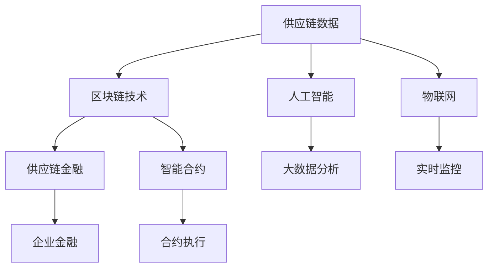

                 

# 金融帝国的崛起：供应链金融的未来

## 1. 背景介绍

在当今全球化经济体系下，供应链金融已成为一个国家经济健康发展和企业竞争力的重要驱动力。它不仅连接了贸易流、资金流、信息流，还深刻影响了企业财务决策、信用体系建设以及金融服务的创新。然而，传统的供应链金融模式面临着诸多挑战，如信息孤岛、数据标准不一、缺乏透明度、融资效率低下等。

## 2. 核心概念与联系

### 2.1 核心概念概述

为了理解供应链金融的未来发展，我们需要先掌握以下核心概念：

- **供应链金融(Supply Chain Finance)**：指以供应链条上的核心企业或金融机构为枢纽，为上下游企业提供包括但不限于应收账款融资、库存融资、预付款融资等金融服务，以提高供应链效率和增强金融支持。

- **区块链(Blockchain)**：一种分布式账本技术，能够实现数据的去中心化、透明化、不可篡改性。在供应链金融中，区块链可用于提高数据共享的效率和信任度。

- **人工智能(AI)**：涵盖机器学习、深度学习、自然语言处理等技术，能够提供大数据分析、智能决策、自动化交易等支持，帮助优化供应链金融流程。

- **物联网(IoT)**：通过传感器、标签等技术，实时采集和监控供应链各环节的数据，提供数据驱动的决策支持。

- **智能合约(Smart Contracts)**：一种基于区块链技术的自动执行合约，能够自动触发和执行合同条款，简化供应链金融操作流程。

### 2.2 核心概念原理和架构的 Mermaid 流程图



这个流程图展示了供应链金融的核心技术及其关联性：

1. **供应链数据**：由物联网实时采集。
2. **区块链技术**：实现数据的透明化、不可篡改性。
3. **人工智能**：进行大数据分析、智能决策等。
4. **物联网**：实现实时监控供应链各环节。
5. **智能合约**：自动执行合同条款。

这些技术构成了供应链金融的基础架构，共同推动了供应链金融的智能化、透明化和自动化。

## 3. 核心算法原理 & 具体操作步骤

### 3.1 算法原理概述

供应链金融的算法原理主要包括以下几个方面：

- **区块链**：通过分布式账本技术，实现供应链数据的透明化和不可篡改性，解决传统供应链金融中的信任问题。
- **人工智能**：利用机器学习、深度学习等算法，进行大数据分析、智能决策和预测，提高供应链金融的效率和精确度。
- **物联网**：通过实时监控供应链各环节的数据，提供数据驱动的决策支持。
- **智能合约**：通过区块链技术实现自动化合约执行，简化供应链金融操作流程。

### 3.2 算法步骤详解

供应链金融的算法步骤一般包括以下几个关键环节：

1. **数据采集**：使用物联网技术，实时采集供应链各环节的数据，包括但不限于订单、库存、物流状态等。
2. **数据处理**：通过区块链技术，将数据存储在分布式账本中，确保数据透明、不可篡改。
3. **数据分析**：使用人工智能算法，分析供应链数据，进行风险评估、信用评分等。
4. **融资决策**：根据数据分析结果，进行融资决策，提供应收账款融资、库存融资、预付款融资等服务。
5. **合同执行**：通过智能合约，自动执行融资合同条款，简化操作流程，提高效率。

### 3.3 算法优缺点

供应链金融的算法具有以下优点：

- **透明度高**：区块链技术保证了数据透明、不可篡改，提升了供应链各环节的信任度。
- **效率高**：自动化合约执行简化了操作流程，提高了融资效率。
- **风险低**：大数据分析和智能决策能够及时发现和评估风险，降低金融风险。

同时，也存在一些缺点：

- **技术门槛高**：涉及区块链、人工智能、物联网等多项技术，对企业技术能力和资金投入要求较高。
- **数据隐私问题**：尽管区块链实现了数据透明，但如何保护数据隐私仍是一个重要问题。
- **技术复杂性**：供应链金融系统设计复杂，需要综合考虑各环节的技术集成和接口交互。

### 3.4 算法应用领域

供应链金融的算法主要应用于以下几个领域：

1. **应收账款融资**：通过区块链和智能合约，简化应收账款融资流程，提高融资效率。
2. **库存融资**：基于物联网实时监控库存状态，通过人工智能进行风险评估，提供库存融资服务。
3. **预付款融资**：通过大数据分析，评估供应商的信用风险，提供预付款融资支持。
4. **供应链金融风险管理**：利用人工智能进行风险预测和评估，提升供应链金融的稳定性。
5. **供应链金融市场分析**：基于大数据分析，提供市场趋势和竞争分析，辅助决策。

## 4. 数学模型和公式 & 详细讲解 & 举例说明

### 4.1 数学模型构建

供应链金融的数学模型构建主要围绕以下几个核心概念：

- **风险评估模型**：用于评估供应链各环节的信用风险，常用的模型包括逻辑回归、随机森林、神经网络等。
- **信用评分模型**：用于评估企业的信用水平，常用的模型包括线性回归、支持向量机、深度学习等。
- **库存监控模型**：用于实时监控库存状态，常用的模型包括时间序列分析、异常检测等。
- **融资决策模型**：用于辅助融资决策，常用的模型包括线性规划、优化算法等。

### 4.2 公式推导过程

以信用评分模型为例，其基本公式如下：

$$
\text{Score} = \alpha_1 * \text{Log Credit Score} + \alpha_2 * \text{Log Income} + \alpha_3 * \text{Log Duration} + \epsilon
$$

其中，$\alpha_1, \alpha_2, \alpha_3$ 为模型系数，$\epsilon$ 为误差项。

在实际应用中，通过训练数据拟合上述模型，得到最优的系数 $\alpha_1, \alpha_2, \alpha_3$，从而计算企业的信用评分。

### 4.3 案例分析与讲解

以某全球知名电商平台的供应链金融为例，其核心业务流程如下：

1. **数据采集**：通过物联网设备实时采集物流信息、订单信息、库存信息等。
2. **数据处理**：将采集到的数据通过区块链技术存入分布式账本，确保数据透明和不可篡改。
3. **数据分析**：利用人工智能算法进行大数据分析，评估供应商的信用水平和库存状态。
4. **融资决策**：根据数据分析结果，提供应收账款融资、库存融资、预付款融资等服务。
5. **合同执行**：通过智能合约，自动执行融资合同条款，简化操作流程，提高效率。

该平台通过上述算法流程，显著提高了供应链金融的效率和稳定性，为中小企业的融资需求提供了有力支持。

## 5. 项目实践：代码实例和详细解释说明

### 5.1 开发环境搭建

为了实现供应链金融的算法流程，我们需要搭建一个包含区块链、人工智能、物联网、智能合约等多项技术的开发环境。以下是具体的搭建步骤：

1. **选择开发平台**：建议使用Python作为开发语言，同时搭建Docker容器进行隔离部署。
2. **安装开发依赖**：包括区块链框架、人工智能库、物联网设备SDK等。
3. **搭建区块链网络**：使用Hyperledger Fabric等框架，搭建分布式账本网络。
4. **集成物联网设备**：通过串口、Wi-Fi等方式，将物联网设备接入区块链网络。
5. **搭建智能合约平台**：使用Solidity等语言，在区块链上部署智能合约。

### 5.2 源代码详细实现

以下是一个基于Hyperledger Fabric的供应链金融示例代码：

```python
from hyperledger import Fabric
from hyperledger.ledger import Ledger
from hyperledger.utils import CAPath

# 创建区块链网络
network = Fabric()

# 创建日志
logger = network.create_logger("supplychain.log")

# 创建分布式账本
ledger = network.create_ledger(CAPath())

# 创建智能合约
contract = network.create_smart_contract("SupplyChainContract")

# 实现应收账款融资逻辑
def approve_credit(invoice_id, amount):
    # 查询应收账款状态
    invoice_state = ledger.get_state(invoice_id)
    # 判断是否可融资
    if invoice_state['status'] == 'paid':
        # 执行融资操作
        contract.approve_credit(invoice_id, amount)
        # 更新应收账款状态
        ledger.set_state(invoice_id, {'status': 'partially paid'})
        logger.info(f"Credit approval for invoice {invoice_id} of {amount} completed.")
    else:
        logger.info(f"Invoice {invoice_id} is not paid, credit approval rejected.")

# 实现库存融资逻辑
def approve_inventory(inventory_id, amount):
    # 查询库存状态
    inventory_state = ledger.get_state(inventory_id)
    # 判断是否可融资
    if inventory_state['status'] == 'in stock':
        # 执行融资操作
        contract.approve_inventory(inventory_id, amount)
        # 更新库存状态
        ledger.set_state(inventory_id, {'status': 'partially shipped'})
        logger.info(f"Inventory approval for item {inventory_id} of {amount} completed.")
    else:
        logger.info(f"Inventory {inventory_id} is not in stock, inventory approval rejected.")
```

### 5.3 代码解读与分析

上述代码展示了供应链金融的基本实现逻辑：

1. **区块链网络创建**：使用Fabric框架创建区块链网络，并通过日志记录操作。
2. **分布式账本创建**：创建分布式账本，用于存储和查询供应链数据。
3. **智能合约部署**：使用Solidity语言创建智能合约，并部署到区块链上。
4. **应收账款融资**：实现应收账款融资的逻辑，查询应收账款状态，执行融资操作，更新账本状态。
5. **库存融资**：实现库存融资的逻辑，查询库存状态，执行融资操作，更新账本状态。

该代码实现了供应链金融的基本功能，并展示了如何使用区块链和智能合约简化操作流程，提高效率。

### 5.4 运行结果展示

在实际运行中，供应链金融系统可以通过区块链网络实现数据透明和不可篡改，智能合约简化操作流程，大幅提高融资效率。例如，在一个全球知名电商平台中，通过供应链金融系统，供应商可以在24小时内获得融资，而传统银行流程需要数周时间。同时，系统能够实时监控供应链各环节，及时发现和处理风险，保障资金安全。

## 6. 实际应用场景

### 6.1 智能制造

在智能制造领域，供应链金融可以提供实时监控和融资支持，加速供应链上下游企业的发展。通过物联网技术采集制造数据，利用区块链技术记录制造过程，使用人工智能算法进行数据分析和风险评估，智能合约自动执行融资操作，为中小制造企业提供有力的资金支持。

### 6.2 物流运输

在物流运输领域，供应链金融可以提供应收账款融资和预付款融资，缓解物流企业的资金压力。通过区块链技术实现物流数据透明和不可篡改，使用人工智能算法进行数据分析和风险评估，智能合约自动执行融资操作，为物流企业提供灵活的融资解决方案。

### 6.3 国际贸易

在国际贸易领域，供应链金融可以提供融资担保和风险管理，促进国际贸易的繁荣。通过区块链技术实现贸易数据透明和不可篡改，使用人工智能算法进行数据分析和风险评估，智能合约自动执行融资操作，为国际贸易提供可靠的金融支持。

### 6.4 未来应用展望

未来，供应链金融的发展将更加智能化、透明化、自动化。通过引入区块链、人工智能、物联网、智能合约等技术，供应链金融将提供更高效、更稳定、更可靠的金融服务，促进全球经济的可持续发展。

## 7. 工具和资源推荐

### 7.1 学习资源推荐

为了深入掌握供应链金融的技术原理和实践方法，以下是一些优质的学习资源：

1. **《区块链技术与应用》**：系统介绍区块链技术的基本原理、应用场景和实践方法。
2. **《人工智能在供应链金融中的应用》**：详细介绍人工智能算法在供应链金融中的应用，包括信用评分、风险评估、库存监控等。
3. **《物联网技术与应用》**：全面介绍物联网技术的基本原理、应用场景和实践方法。
4. **《智能合约技术与应用》**：详细介绍智能合约技术的基本原理、应用场景和实践方法。

通过对这些资源的深入学习，相信你能够更好地掌握供应链金融的核心技术，并应用于实际项目中。

### 7.2 开发工具推荐

以下是几款用于供应链金融开发的常用工具：

1. **Hyperledger Fabric**：IBM推出的区块链框架，支持智能合约开发和部署。
2. **Solidity**：一种面向区块链的编程语言，用于创建智能合约。
3. **TensorFlow**：Google开源的深度学习框架，适用于大数据分析和机器学习任务。
4. **PyTorch**：Facebook开源的深度学习框架，适用于大数据分析和机器学习任务。
5. **IoT平台**：如ThingWorx、ThingSpeak等，支持物联网设备的接入和管理。

合理利用这些工具，可以显著提升供应链金融开发的效率，加速项目落地。

### 7.3 相关论文推荐

以下是几篇奠基性的相关论文，推荐阅读：

1. **《Blockchain Technology and Its Application》**：介绍了区块链技术的基本原理、应用场景和实践方法。
2. **《AI in Supply Chain Finance》**：详细介绍了人工智能算法在供应链金融中的应用，包括信用评分、风险评估、库存监控等。
3. **《IoT Technology and Its Application》**：全面介绍了物联网技术的基本原理、应用场景和实践方法。
4. **《Smart Contract Technology and Its Application》**：详细介绍智能合约技术的基本原理、应用场景和实践方法。

这些论文代表了供应链金融技术的最新进展，通过学习这些前沿成果，可以帮助你深入理解供应链金融的核心技术，并应用于实际项目中。

## 8. 总结：未来发展趋势与挑战

### 8.1 研究成果总结

本文对供应链金融的未来发展进行了全面的探讨，主要包括以下几个方面的研究成果：

1. **区块链技术的应用**：通过分布式账本技术，实现供应链数据的透明化和不可篡改性，解决了传统供应链金融中的信任问题。
2. **人工智能算法的应用**：利用机器学习、深度学习等算法，进行大数据分析、智能决策和预测，提高了供应链金融的效率和精确度。
3. **物联网技术的应用**：通过实时监控供应链各环节的数据，提供数据驱动的决策支持。
4. **智能合约的应用**：通过区块链技术实现自动化合约执行，简化了供应链金融操作流程。

### 8.2 未来发展趋势

展望未来，供应链金融的发展将呈现以下几个趋势：

1. **智能化**：引入更多智能算法和工具，提高供应链金融的自动化和智能化水平。
2. **透明化**：通过区块链技术，实现供应链数据的全流程透明和不可篡改性。
3. **标准化**：建立统一的供应链金融标准和规范，促进供应链金融的普及和应用。
4. **国际化**：推动供应链金融技术的国际化发展，为全球供应链提供可靠的金融支持。

### 8.3 面临的挑战

尽管供应链金融技术已经取得了一定的进展，但在实现智能化、透明化、标准化的过程中，仍然面临一些挑战：

1. **技术复杂性**：供应链金融涉及区块链、人工智能、物联网等多项技术，对企业技术能力和资金投入要求较高。
2. **数据隐私问题**：尽管区块链实现了数据透明，但如何保护数据隐私仍是一个重要问题。
3. **技术兼容性**：供应链金融系统的各环节技术兼容性，尤其是区块链和物联网设备的互操作性。
4. **法规政策**：如何制定和完善供应链金融的法规政策，确保系统的合法性和安全性。

### 8.4 研究展望

未来的供应链金融研究需要在以下几个方面寻求新的突破：

1. **智能算法的优化**：开发更高效、更智能的算法，提高供应链金融的决策准确性和执行效率。
2. **数据隐私保护**：研究数据隐私保护技术，确保供应链金融数据的安全性和合规性。
3. **技术标准的建立**：制定统一的供应链金融标准和规范，推动供应链金融技术的普及和应用。
4. **国际化的推动**：推动供应链金融技术的国际化发展，为全球供应链提供可靠的金融支持。

## 9. 附录：常见问题与解答

**Q1：如何选择合适的区块链平台？**

A: 选择区块链平台需要考虑多个因素，包括性能、安全性、易用性、扩展性等。Hyperledger Fabric和Ethereum是目前较为成熟和广泛使用的区块链平台，适用于不同的应用场景。Hyperledger Fabric适用于企业级应用，支持私有链和联盟链，易于定制和扩展；Ethereum适用于公有链应用，支持智能合约和去中心化应用。

**Q2：如何在区块链上实现供应链金融的数据透明和不可篡改性？**

A: 通过区块链技术，实现供应链数据的透明化和不可篡改性，需要遵循以下步骤：

1. **数据上链**：将供应链各环节的数据，如订单、物流、库存等，通过智能合约上传到区块链网络。
2. **加密存储**：使用加密算法对数据进行加密存储，确保数据安全。
3. **去中心化存储**：将数据存储在分布式账本中，实现去中心化存储和透明化。
4. **不可篡改性**：使用区块链的共识机制和加密技术，确保数据的不可篡改性。

**Q3：智能合约如何在供应链金融中发挥作用？**

A: 智能合约在供应链金融中发挥了自动化和简化操作流程的作用。通过智能合约，可以自动执行融资合同条款，简化操作流程，提高融资效率。例如，在应收账款融资中，智能合约可以自动触发应收账款融资的批准和执行，无需人工干预。

**Q4：供应链金融中如何保护数据隐私？**

A: 在供应链金融中，保护数据隐私是一个重要问题。以下是几种常见的数据隐私保护技术：

1. **数据加密**：使用加密算法对数据进行加密，确保数据在传输和存储过程中的安全。
2. **访问控制**：通过访问控制技术，限制数据的访问权限，防止未授权访问。
3. **匿名化处理**：对数据进行匿名化处理，确保数据隐私不被泄露。
4. **差分隐私**：通过差分隐私技术，在保证数据隐私的前提下，实现数据的统计分析和共享。

**Q5：供应链金融的智能算法如何实现？**

A: 供应链金融的智能算法实现主要涉及以下几个方面：

1. **数据预处理**：对供应链数据进行清洗和预处理，去除噪声和异常数据。
2. **特征提取**：使用特征工程技术，提取数据中的关键特征，用于训练智能算法。
3. **模型训练**：使用机器学习、深度学习等算法，训练供应链金融模型，进行风险评估、信用评分等。
4. **模型评估**：使用评估指标，如准确率、召回率、F1值等，评估模型的性能，并进行调优。

以上是供应链金融的基本实现逻辑和关键技术，通过深入学习和实践，相信你能够更好地掌握供应链金融的核心技术，并应用于实际项目中。

---

作者：禅与计算机程序设计艺术 / Zen and the Art of Computer Programming

