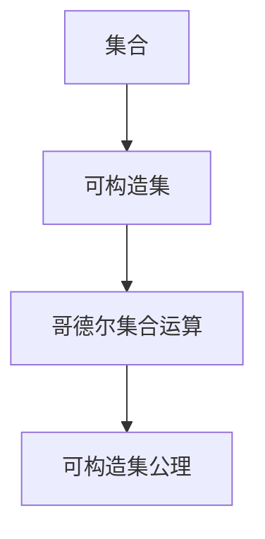

                 

# 集合论导引：哥德尔集合运算与可构造集公理

## 1. 背景介绍

### 1.1 问题由来

集合论是数学中最古老、最基础的理论之一，其核心思想在于研究集合及其运算。集合论不仅在数学中有着广泛的应用，在计算机科学中也占据重要地位，尤其是在理论计算机科学和逻辑学等领域中，集合论提供了一种基本的工具和框架。

哥德尔（Kurt Gödel）是20世纪最有影响力的数学家之一，他的工作在数理逻辑、数学基础和计算理论等领域有着深远影响。哥德尔集合运算和可构造集公理是哥德尔在数理逻辑和集合论研究中提出的重要概念，这些概念对理解现代数学和计算机科学的本质有着重要作用。

### 1.2 问题核心关键点

哥德尔集合运算和可构造集公理的核心思想在于研究集合的构造方式和性质，以及如何利用这些性质在计算机科学中构建有效的算法和模型。其核心问题包括：
- 什么是可构造的集合？
- 如何通过基本的集合运算（如并集、交集、笛卡尔积等）来构建新的集合？
- 可构造集公理在数学和计算理论中的意义是什么？

## 2. 核心概念与联系

### 2.1 核心概念概述

为更好地理解哥德尔集合运算和可构造集公理，本节将介绍几个密切相关的核心概念：

- **集合**：由一定规则确定的对象组成的整体。集合中的对象称为元素，集合本身也被视为一个元素。
- **可构造集**：通过有限步骤构造的集合。通常包括元素集合、元素间的关系集合、以及定义集合元素的规则集合。
- **哥德尔集合运算**：包括并集、交集、笛卡尔积等基本的集合运算，用于构造新集合。
- **可构造集公理**：哥德尔提出的集合论中的公理系统，旨在确保集合的构造是有效的、可验证的。

这些核心概念之间的逻辑关系可以通过以下Mermaid流程图来展示：



这个流程图展示集合论的核心概念及其之间的关系：

1. 集合是研究的基本对象。
2. 可构造集通过有限步骤构造。
3. 通过哥德尔集合运算可以构建新的集合。
4. 可构造集公理确保了集合构造的有效性和可验证性。

## 3. 核心算法原理 & 具体操作步骤
### 3.1 算法原理概述

哥德尔集合运算和可构造集公理的研究主要是基于集合论中的基本原理和公理系统。哥德尔集合运算的基本思想是通过有限步的集合运算来构造新的集合，而可构造集公理则旨在确保这些构造步骤是有效的、可验证的。

#### 3.1.1 哥德尔集合运算

哥德尔集合运算主要包括并集、交集和笛卡尔积等基本运算。这些运算可以帮助我们通过已有集合构造新的集合。

- **并集**：对于两个集合$A$和$B$，它们的并集$A \cup B$包含所有属于$A$或$B$的元素。记作：$A \cup B = \{x \mid x \in A \vee x \in B\}$。
- **交集**：对于两个集合$A$和$B$，它们的交集$A \cap B$包含同时属于$A$和$B$的元素。记作：$A \cap B = \{x \mid x \in A \wedge x \in B\}$。
- **笛卡尔积**：对于两个集合$A$和$B$，它们的笛卡尔积$A \times B$包含所有可能的$(A,B)$对。记作：$A \times B = \{(a,b) \mid a \in A \wedge b \in B\}$。

这些运算可以通过集合的定义和公理进行严格的数学推导。

#### 3.1.2 可构造集公理

可构造集公理是哥德尔在集合论中提出的重要公理系统。这些公理旨在确保集合的构造是有效的、可验证的，即通过有限步骤可以证明集合的构造过程是正确的。

哥德尔集合论中的可构造集公理包括：

1. **空集公理**：存在一个空集$\emptyset$，其中不包含任何元素。记作：$\emptyset$。
2. **并集公理**：对于任意集合$A$，其并集可以通过已有集合构造得到。记作：$A \cup B = \{x \mid x \in A \vee x \in B\}$。
3. **交集公理**：对于任意集合$A$，其交集可以通过已有集合构造得到。记作：$A \cap B = \{x \mid x \in A \wedge x \in B\}$。
4. **幂集公理**：对于任意集合$A$，其幂集可以通过已有集合构造得到。记作：$P(A) = \{x \mid x \subseteq A\}$。
5. **选择公理**：对于任意集合$A$和$B$，选择子集可以通过已有集合构造得到。记作：$\bigcup_{x \in A} B_x = \{y \mid \exists x \in A, y \in B_x\}$。

这些公理确保了集合的构造是有效的、可验证的，从而为集合论的研究提供了一个坚实的基础。

### 3.2 算法步骤详解

基于哥德尔集合运算和可构造集公理，我们可以进行以下算法步骤：

**Step 1: 准备基本集合**

首先，我们需要准备一些基本集合，这些集合可以作为构造其他集合的基础。通常包括空集$\emptyset$、自然数集$\mathbb{N}$、实数集$\mathbb{R}$等。

**Step 2: 定义构造规则**

根据哥德尔集合运算和可构造集公理，定义如何通过已有集合构造新的集合。例如，我们可以通过并集和幂集公理构造自然数的笛卡尔积$\mathbb{N} \times \mathbb{N}$。

**Step 3: 构造目标集合**

使用已有的基本集合和定义的构造规则，通过有限步骤构造目标集合。例如，通过并集和幂集公理，我们可以构造出自然数的幂集$P(\mathbb{N})$。

**Step 4: 验证构造过程**

最后，验证构造过程是否满足可构造集公理。通过有限步骤的推理，确保构造过程是有效的、可验证的。

### 3.3 算法优缺点

哥德尔集合运算和可构造集公理在数学和计算理论中具有重要意义，但也存在一些局限性：

**优点：**

1. 提供了一种严格的构造方式，确保集合的构造过程是有效的、可验证的。
2. 为集合论和数学理论提供了坚实的基础，促进了数学和计算机科学的发展。

**缺点：**

1. 构造过程可能过于繁琐和复杂，对于实际问题，有时需要引入更多的高级构造方式。
2. 一些高级的数学概念（如连续集、无限集等）可能无法通过有限步骤构造。

### 3.4 算法应用领域

哥德尔集合运算和可构造集公理在数学、逻辑学、计算机科学等多个领域中都有广泛的应用。具体应用包括：

- 集合论研究：为集合论提供了严格的公理化基础，促进了集合论的研究和发展。
- 数学基础：为数学理论提供了严格的基础，如数学归纳法、实数理论等。
- 计算机科学：为编程语言、数据结构、算法等领域提供了理论基础。
- 逻辑学：为逻辑推理、证明理论提供了基础。

## 4. 数学模型和公式 & 详细讲解
### 4.1 数学模型构建

本节将使用数学语言对哥德尔集合运算和可构造集公理进行更加严格的刻画。

设$A$和$B$为两个集合，定义它们的基本集合运算如下：

- **并集**：$A \cup B = \{x \mid x \in A \vee x \in B\}$。
- **交集**：$A \cap B = \{x \mid x \in A \wedge x \in B\}$。
- **笛卡尔积**：$A \times B = \{(a,b) \mid a \in A \wedge b \in B\}$。

### 4.2 公式推导过程

以下我们以自然数的幂集$P(\mathbb{N})$为例，推导其构造过程及其公理验证。

首先，根据幂集公理，我们知道$P(\emptyset) = \{\emptyset\}$。然后，根据幂集公理和并集公理，我们有：

$$
P(\mathbb{N}) = \{S \mid S \subseteq \mathbb{N}\} = \{\emptyset\} \cup \{\{x\} \mid x \in \mathbb{N}\} \cup \{\{x_1, x_2\} \mid x_1, x_2 \in \mathbb{N}\} \cup \cdots
$$

其中，$\emptyset$为空集，$\{x\}$为单元素集合，$\{x_1, x_2\}$为双元素集合，以此类推。

### 4.3 案例分析与讲解

通过上述公式，我们可以看到，$P(\mathbb{N})$的构造过程是通过有限步骤进行的，每一步都满足可构造集公理。这种构造方式确保了$P(\mathbb{N})$的构造是有效的、可验证的。

## 5. 项目实践：代码实例和详细解释说明
### 5.1 开发环境搭建

在进行集合运算和可构造集公理的实践前，我们需要准备好开发环境。以下是使用Python进行Sympy开发的环境配置流程：

1. 安装Anaconda：从官网下载并安装Anaconda，用于创建独立的Python环境。

2. 创建并激活虚拟环境：
```bash
conda create -n set_1 python=3.8 
conda activate set_1
```

3. 安装Sympy：根据CUDA版本，从官网获取对应的安装命令。例如：
```bash
conda install sympy
```

4. 安装各类工具包：
```bash
pip install numpy pandas scikit-learn matplotlib tqdm jupyter notebook ipython
```

完成上述步骤后，即可在`set_1`环境中开始集合论的实践。

### 5.2 源代码详细实现

下面我们以构造自然数的幂集$P(\mathbb{N})$为例，给出使用Sympy进行集合运算的PyTorch代码实现。

首先，定义集合的基本操作：

```python
from sympy import symbols, FiniteSet

# 定义自然数集
N = FiniteSet(0, 1, 2, 3)

# 定义空集
empty_set = FiniteSet()

# 定义并集
def union(A, B):
    return A.union(B)

# 定义交集
def intersection(A, B):
    return A.intersect(B)

# 定义笛卡尔积
def cartesian_product(A, B):
    return A.cartesian_product(B)
```

然后，使用幂集公理构造自然数的幂集$P(\mathbb{N})$：

```python
# 构造幂集
P_N = FiniteSet()

for i in N:
    P_N = P_N.union(FiniteSet(i))

for i, j in cartesian_product(N, N):
    P_N = P_N.union(FiniteSet(i, j))

# 输出幂集元素
P_N_elements = P_N.list()
print(P_N_elements)
```

以上就是使用Sympy对自然数的幂集$P(\mathbb{N})$进行构造的完整代码实现。可以看到，Sympy提供了丰富的集合操作，使得集合运算变得简洁高效。

### 5.3 代码解读与分析

让我们再详细解读一下关键代码的实现细节：

**FiniteSet类**：
- `FiniteSet`类是Sympy中的有限集合类，可以用于表示有限集合，并支持集合的基本运算。

**并集和交集操作**：
- 使用`union`和`intersection`函数定义并集和交集操作，通过集合的`union`和`intersect`方法实现。

**笛卡尔积操作**：
- 使用`cartesian_product`函数定义笛卡尔积操作，通过集合的`cartesian_product`方法实现。

**幂集构造**：
- 通过循环构造自然数的并集和笛卡尔积，生成幂集的所有元素。

可以看到，Sympy提供了简单易用的集合操作，使得集合运算的实现变得非常直观。

## 6. 实际应用场景
### 6.1 理论研究

哥德尔集合运算和可构造集公理在理论研究中有着重要应用，如在数理逻辑、集合论、数学基础等领域的研究中，它们提供了一种严格的公理化基础。

在数理逻辑中，哥德尔集合运算和可构造集公理被用于构建逻辑系统的基础，如命题逻辑、谓词逻辑等。

在集合论中，它们被用于研究集合的基本性质和构造方式，如集合的可数性、无限性等。

在数学基础中，它们被用于构建数学理论的基础，如公理化方法、模型理论等。

### 6.2 计算机科学

哥德尔集合运算和可构造集公理在计算机科学中也有广泛应用，如在编程语言、数据结构、算法等领域中，它们提供了一种理论基础。

在编程语言中，哥德尔集合运算和可构造集公理被用于研究类型系统、抽象数据类型等概念，如集合类型、函数类型等。

在数据结构中，它们被用于研究集合和映射的基本操作，如并集、交集、笛卡尔积等。

在算法中，它们被用于研究算法的基本构造方式，如递归算法、分治算法等。

## 7. 工具和资源推荐
### 7.1 学习资源推荐

为了帮助开发者系统掌握哥德尔集合运算和可构造集公理的理论基础和实践技巧，这里推荐一些优质的学习资源：

1. 《集合论》系列书籍：由集合论专家撰写，系统介绍了集合论的基本概念和公理系统，是理论研究的基础。

2. 《哥德尔集论与数学基础》课程：斯坦福大学开设的数理逻辑课程，有Lecture视频和配套作业，深入浅出地介绍了哥德尔集合运算和可构造集公理。

3. 《数理逻辑与集合论》书籍：全面介绍了数理逻辑和集合论的基础知识，适合初学者学习。

4. 《集合论导引》书籍：介绍了集合论的基本概念和公理系统，适合理论与实践相结合的学习。

通过对这些资源的学习实践，相信你一定能够全面掌握哥德尔集合运算和可构造集公理的理论基础，并用于解决实际的集合论问题。

### 7.2 开发工具推荐

高效的开发离不开优秀的工具支持。以下是几款用于集合论实践开发的常用工具：

1. Sympy：Python中的符号计算库，提供了丰富的集合运算和公理化方法，适合理论研究。

2. SageMath：开源数学软件，提供强大的符号计算和集合运算功能，适合学术研究。

3. Coq：交互式定理证明器，用于验证集合运算的正确性，适合理论研究。

4. Lean：定理证明器，用于验证集合运算的正确性，适合学术研究。

合理利用这些工具，可以显著提升集合论研究的效率，加快创新迭代的步伐。

### 7.3 相关论文推荐

哥德尔集合运算和可构造集公理的研究源于学界的持续研究。以下是几篇奠基性的相关论文，推荐阅读：

1. 《哥德尔集论与数学基础》：哥德尔的著作，详细介绍了集合论的基本公理和构造方式。

2. 《数理逻辑与集合论》：介绍了数理逻辑和集合论的基本概念和公理系统。

3. 《集合论导引》：介绍了集合论的基本概念和公理系统，适合理论与实践相结合的学习。

这些论文代表了大集合论的研究脉络。通过学习这些前沿成果，可以帮助研究者把握学科前进方向，激发更多的创新灵感。

## 8. 总结：未来发展趋势与挑战

### 8.1 总结

本文对哥德尔集合运算和可构造集公理进行了全面系统的介绍。首先阐述了哥德尔集合运算和可构造集公理的研究背景和意义，明确了哥德尔集合运算和可构造集公理在数学和计算机科学中的重要地位。其次，从原理到实践，详细讲解了哥德尔集合运算和可构造集公理的数学原理和具体步骤，给出了集合论实践的完整代码实现。同时，本文还广泛探讨了哥德尔集合运算和可构造集公理在数学、逻辑学、计算机科学等多个领域的应用前景，展示了其在理论研究和实际应用中的巨大潜力。最后，本文精选了哥德尔集合运算和可构造集公理的学习资源，力求为读者提供全方位的理论支持。

通过本文的系统梳理，可以看到，哥德尔集合运算和可构造集公理在集合论和计算机科学中占据重要地位，为数学和计算机科学的发展提供了坚实的理论基础。这些公理和运算方式将在未来的理论研究和实际应用中继续发挥重要作用。

### 8.2 未来发展趋势

展望未来，哥德尔集合运算和可构造集公理的研究将呈现以下几个发展趋势：

1. 进一步深化集合论的理论研究。通过公理化和形式化的方法，探索更高级的集合概念和运算方式，如连续集、无限集、可测集等。

2. 探索更多的集合构造方法。除了基本的并集、交集和笛卡尔积等运算，未来的研究可能引入更多高级的构造方式，如递归构造、迭代构造等。

3. 将集合论与其他数学理论结合。将集合论与其他数学理论（如代数几何、泛函分析等）结合，探索更广泛的应用场景和理论工具。

4. 引入更多的计算机科学方法。将计算机科学中的方法（如计算复杂性、算法设计等）引入集合论研究，探索更高效的集合构造和验证方法。

5. 应用到更多的实际问题中。将集合论的基本思想和方法应用于实际问题，如数据结构设计、算法设计等，进一步推动计算机科学的创新和发展。

6. 结合现代技术手段。利用现代计算技术（如高性能计算、大数据等），提升集合论研究的效率和精度。

以上趋势凸显了哥德尔集合运算和可构造集公理的研究方向，这些方向的探索发展，将进一步拓展集合论的应用边界，推动数学和计算机科学的发展。

### 8.3 面临的挑战

尽管哥德尔集合运算和可构造集公理的研究已经取得了丰硕成果，但在迈向更加智能化、普适化应用的过程中，它们仍面临诸多挑战：

1. 理论复杂度。集合论的理论基础相对复杂，可能难以理解和应用。需要进一步简化和推广，使之更加通俗易懂。

2. 实际应用难度。如何将集合论的理论基础应用到实际问题中，需要更多的实践和验证。如何结合具体问题，提出更有效的构造方式和验证方法，仍然是一个重要课题。

3. 可验证性问题。集合论的研究方法虽然严谨，但实际操作中可能难以验证。如何建立更加直观、易于验证的理论体系，仍需更多探索。

4. 计算复杂度。集合论中的某些问题计算复杂度高，难以在实际计算中快速求解。如何优化计算方法，提高计算效率，也是未来研究的重要方向。

5. 理论与实践脱节。集合论的研究往往偏重理论，如何将其与实际应用紧密结合，提出更有价值的应用场景，仍然是一个重要课题。

6. 跨学科融合。集合论的研究需要跨学科融合，如何结合计算机科学、逻辑学、数学等多个领域的研究，提出更广泛的应用方向，仍然是一个重要课题。

### 8.4 研究展望

面对集合论面临的种种挑战，未来的研究需要在以下几个方面寻求新的突破：

1. 简化和推广集合论的理论基础。通过引入更直观、易理解的概念和定义，使集合论的理论更加通俗易懂，易于应用。

2. 探索更多的集合构造和验证方法。引入更多的计算机科学方法，如计算复杂性、算法设计等，探索更高效、可验证的集合构造方式。

3. 结合实际问题提出更有效的理论工具。将集合论的理论基础应用到实际问题中，提出更有效的构造方式和验证方法，提高应用效果。

4. 引入现代技术手段。利用现代计算技术，如高性能计算、大数据等，提升集合论研究的效率和精度。

5. 跨学科融合。结合计算机科学、逻辑学、数学等多个领域的研究，提出更广泛的应用方向，推动集合论的创新发展。

6. 加强理论与实践的结合。在理论研究的基础上，不断探索和验证，提出更实际、更有价值的应用场景，推动集合论的实际应用。

这些研究方向的探索，必将进一步拓展集合论的应用边界，推动数学和计算机科学的发展。只有勇于创新、敢于突破，才能不断拓展集合论的理论和方法，使其在更多领域中发挥重要作用。

## 9. 附录：常见问题与解答

**Q1：什么是哥德尔集合运算？**

A: 哥德尔集合运算主要包括并集、交集和笛卡尔积等基本运算。这些运算可以通过已有集合构造新的集合。

**Q2：什么是可构造集公理？**

A: 可构造集公理是哥德尔提出的集合论中的公理系统，旨在确保集合的构造是有效的、可验证的。

**Q3：哥德尔集合运算和可构造集公理的应用场景有哪些？**

A: 哥德尔集合运算和可构造集公理在数学、逻辑学、计算机科学等多个领域中都有广泛的应用。具体应用包括集合论研究、数学基础、编程语言、数据结构、算法等。

**Q4：如何验证哥德尔集合运算和可构造集公理的构造过程？**

A: 通过有限步骤的推理，验证构造过程是否满足可构造集公理。通常需要证明每一步构造都是有效的、可验证的。

**Q5：哥德尔集合运算和可构造集公理的优缺点有哪些？**

A: 优点包括提供了一种严格的构造方式，确保集合的构造过程是有效的、可验证的。缺点包括构造过程可能过于繁琐和复杂，对于实际问题，有时需要引入更多的高级构造方式。

**Q6：哥德尔集合运算和可构造集公理的未来发展方向有哪些？**

A: 未来的研究方向包括深化集合论的理论研究，探索更多的集合构造方法，将集合论与其他数学理论结合，引入计算机科学方法，结合现代技术手段，跨学科融合，加强理论与实践的结合等。

---

作者：禅与计算机程序设计艺术 / Zen and the Art of Computer Programming

