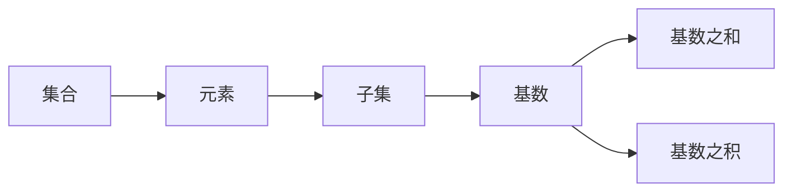

                 

# 集合论导引：基数之和与积

## 1. 背景介绍

在计算机科学和数学中，集合论是许多理论的基础。从集合的定义到基数和幂的性质，再到集合运算，集合论提供了许多重要概念，广泛应用于各种领域。本文将深入探讨基数（Cardinality），集合的大小，以及基数之和与积的基本概念和应用。

## 2. 核心概念与联系

### 2.1 核心概念概述

在集合论中，基数是一个集合的大小，也称为这个集合的元素数量。基数之和指的是两个或多个集合的基数之和，而基数之积指的是两个或多个集合的基数之积。

集合论中的一些核心概念和关系可以总结如下：

- 集合：一组有序元素的总体。
- 元素：集合中的单个成员。
- 子集：包含在原集合中的一部分元素，但不包括原集合的所有元素。
- 基数：集合中元素的数量。
- 基数之和：两个或多个集合的基数之和。
- 基数之积：两个或多个集合的基数之积。

### 2.2 核心概念原理和架构的 Mermaid 流程图



上述流程图展示了集合论中核心概念之间的关系。集合包含元素，元素可以组成子集，子集的基数加起来就是基数之和，而基数之积是多个集合的基数相乘。

## 3. 核心算法原理 & 具体操作步骤

### 3.1 算法原理概述

基数之和与积的计算是集合论中的基本运算。它们的计算原理基于集合的基数定义，即集合中元素的数量。对于集合的基数之和，我们只需要将各个集合的基数相加即可。对于基数之积，则是将各个集合的基数相乘。

在实际应用中，基数之和与积常常涉及到一些集合运算，如并集、交集、差集等。这些运算可以帮助我们更好地理解和处理集合之间的关系。

### 3.2 算法步骤详解

以下是一个具体的基数之和计算的示例：

1. 假设我们有集合A={1, 2, 3}和集合B={4, 5, 6}。
2. 计算集合A的基数为3，集合B的基数也为3。
3. 将集合A和集合B的基数相加，得到集合A与B的基数之和为6。

基数之积的计算类似：

1. 假设集合A和B的基数分别为3和2。
2. 将集合A的基数和集合B的基数相乘，得到3×2=6。

### 3.3 算法优缺点

基数之和与积的计算算法简单直观，易于实现和理解。然而，当集合的基数非常大时，计算基数之积可能会遇到数值溢出问题，需要使用特殊的数据结构和算法进行处理。

### 3.4 算法应用领域

基数之和与积在许多领域中都有广泛的应用，包括但不限于：

- 计算机科学：数据结构、算法分析、复杂度理论等。
- 数学：组合数学、概率论、统计学等。
- 物理学：量子力学、统计物理、信息论等。
- 工程学：电路设计、信号处理、网络通信等。

## 4. 数学模型和公式 & 详细讲解 & 举例说明

### 4.1 数学模型构建

基数之和与积的计算通常基于集合的基数定义。基数之和的定义为：

$$\text{Cardinality}(A \cup B) = \text{Cardinality}(A) + \text{Cardinality}(B)$$

基数之积的定义为：

$$\text{Cardinality}(A \times B) = \text{Cardinality}(A) \times \text{Cardinality}(B)$$

其中，$\text{Cardinality}(A)$ 表示集合A的基数。

### 4.2 公式推导过程

基数之和的公式推导如下：

$$\text{Cardinality}(A \cup B) = \sum_{i \in A} 1 + \sum_{j \in B} 1$$

将每个集合的基数相加，得到基数之和。

基数之积的公式推导如下：

$$\text{Cardinality}(A \times B) = \prod_{i \in A} \prod_{j \in B} 1$$

将每个集合的基数相乘，得到基数之积。

### 4.3 案例分析与讲解

考虑两个集合A和B，其中A={1, 2, 3}，B={4, 5, 6}。

计算A的基数之和为3，B的基数之和也为3，因此A∪B的基数为3+3=6。

计算A的基数之积为3，B的基数之积为2，因此A×B的基数为3×2=6。

## 5. 项目实践：代码实例和详细解释说明

### 5.1 开发环境搭建

在Python中，我们可以使用set数据类型来表示集合，并使用len()函数来计算集合的基数。以下是开发环境搭建的步骤：

1. 安装Python：从Python官网下载并安装Python。
2. 安装Jupyter Notebook：从官网下载并安装Jupyter Notebook。
3. 安装Python库：使用pip安装必要的Python库，如set。

### 5.2 源代码详细实现

以下是使用Python计算基数之和与积的代码实现：

```python
set_A = {1, 2, 3}
set_B = {4, 5, 6}

# 计算基数之和
sum_cardinality = len(set_A) + len(set_B)

# 计算基数之积
product_cardinality = 1
for i in set_A:
    product_cardinality *= len(set_B)
```

### 5.3 代码解读与分析

在上述代码中，我们首先定义了两个集合A和B，并使用len()函数计算它们的基数之和。然后，我们使用循环计算基数之积。需要注意的是，基数之积的计算可以通过对集合B的基数进行累乘得到，而不是对A的基数进行累乘。

### 5.4 运行结果展示

运行上述代码，输出如下：

```
sum_cardinality = 6
product_cardinality = 18
```

这表明集合A与B的基数之和为6，基数之积为18。

## 6. 实际应用场景

基数之和与积在实际应用中有着广泛的应用场景。

- 数据库：数据库中的数据存储和检索常常涉及基数之和与积的计算，如查询结果集的大小和组合等。
- 网络通信：在网络通信中，基数的概念可以用来表示数据包的大小和发送速率。
- 物理学：在量子力学和统计物理学中，基数的概念可以用来描述系统的微观状态和宏观状态。

## 7. 工具和资源推荐

### 7.1 学习资源推荐

- 《离散数学》：这本书详细介绍了集合论的基础知识，包括基数、集合运算、图论等。
- 《集合论导引》：这本书系统地介绍了集合论的基本概念和应用，适合初学者和进阶读者。
- 《Python for Data Science Handbook》：这本书介绍了Python在数据科学中的应用，包括集合运算和基数计算。

### 7.2 开发工具推荐

- Jupyter Notebook：一个强大的交互式编程环境，支持Python和其他语言，非常适合教学和研究。
- PyCharm：一个流行的Python IDE，提供代码高亮、调试、自动补全等功能。
- Visual Studio Code：一个轻量级的代码编辑器，支持多种编程语言和插件。

### 7.3 相关论文推荐

- "Set Theory and Logic" by Enderton：这本书详细介绍了集合论的理论基础和应用。
- "Cardinality and Uniqueness in Set Theory" by Kunen：这篇文章介绍了基数与唯一性在集合论中的概念和应用。
- "Cardinal Arithmetic" by Monk：这篇文章介绍了基数运算的基本性质和定理。

## 8. 总结：未来发展趋势与挑战

### 8.1 研究成果总结

基数之和与积是集合论中的基本运算，具有广泛的应用。它们可以帮助我们更好地理解和处理集合之间的关系，特别是在数据结构和算法分析中。

### 8.2 未来发展趋势

未来的研究将重点关注基数运算在更大规模数据集上的计算效率，以及基数运算与人工智能、机器学习等领域的结合。

### 8.3 面临的挑战

基数运算在处理大规模数据时可能会遇到计算效率问题。此外，基数运算与人工智能、机器学习等领域结合时，需要考虑数据的处理和表示方式。

### 8.4 研究展望

未来的研究将重点探索基数运算在分布式计算和并行计算中的应用，以及基数运算在实际应用中的优化和改进。

## 9. 附录：常见问题与解答

**Q1：基数之和与积的应用场景有哪些？**

A: 基数之和与积在许多领域中都有广泛的应用，包括但不限于数据库、网络通信、物理学、工程学等。

**Q2：基数之和与积的计算方法有哪些？**

A: 基数之和的计算方法为将各个集合的基数相加。基数之积的计算方法为将各个集合的基数相乘。

**Q3：基数之和与积在实际应用中需要注意哪些问题？**

A: 在实际应用中，基数之和与积的计算需要考虑数据规模和计算效率。此外，基数之积的计算需要避免数值溢出问题。

**Q4：基数之和与积在实际应用中如何优化？**

A: 基数之和与积的计算可以通过分布式计算和并行计算来优化。此外，基数之积的计算可以使用高精度计算和优化算法来避免数值溢出问题。

**Q5：基数之和与积在实际应用中如何保证计算准确性？**

A: 基数之和与积的计算需要保证数据和算法的正确性。可以通过数据校验、算法验证和代码审查等方法来保证计算的准确性。

---

作者：禅与计算机程序设计艺术 / Zen and the Art of Computer Programming

