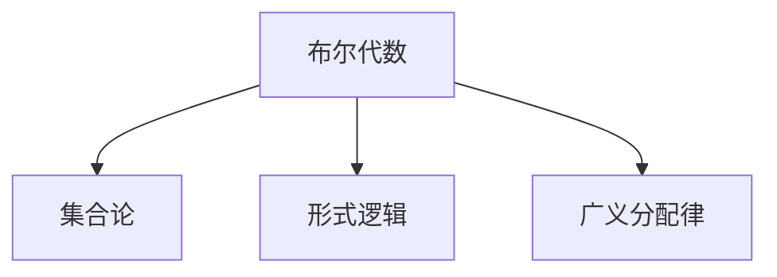

                 

# 集合论导引：完备布尔代数广义分配律

> 关键词：集合论, 布尔代数, 广义分配律, 逻辑代数, 代数结构, 形式逻辑

## 1. 背景介绍

在现代数学和计算机科学的交汇处，集合论作为数学的基础，与布尔代数和逻辑代数等数学分支紧密联系。这些数学理论不仅在计算机科学中有着广泛的应用，还对逻辑学、哲学和语言学等领域产生了深远的影响。本文将聚焦于布尔代数的完备性及其在逻辑代数中的应用，特别是最广泛讨论的广义分配律。

### 1.1 问题由来
布尔代数最初由乔治·布尔（George Boole）在19世纪中叶提出，作为一种形式化逻辑表达的工具。在现代计算机科学中，布尔代数被广泛应用于逻辑门电路、程序语言中的布尔表达式以及算法设计等。然而，对于布尔代数的完备性及其性质，特别是广义分配律，仍存在一些未解之谜。

### 1.2 问题核心关键点
本文将探讨以下几个核心问题：
1. 布尔代数的定义和基本性质
2. 广义分配律的具体表现及其应用
3. 布尔代数的完备性与形式化推理的联系
4. 实际应用场景中布尔代数和广义分配律的应用

这些问题不仅涉及数学理论的深度，还涵盖了其在计算机科学和工程实践中的应用。通过系统地讨论这些核心问题，我们希望能够为读者提供对布尔代数和广义分配律的更深入理解，并探索其在人工智能、逻辑推理和算法设计等领域的应用。

## 2. 核心概念与联系

### 2.1 核心概念概述

为了更好地理解本文的讨论，首先需要介绍一些基本概念：

- **布尔代数**：一种基于二值逻辑（真/假）的代数结构，其操作包括和、积、否等，以及包含、相容性、分配律等性质。
- **集合论**：研究集合及其元素的数学分支，是现代数学的基础。
- **形式逻辑**：一种使用符号和规则来表达和推理逻辑命题的数学方法。
- **广义分配律**：指在布尔代数中，将分配律从x∨(y∧z)扩展到其他形式的复杂表达式的能力。

这些概念之间的联系可以通过以下Mermaid流程图来展示：



这个流程图展示了布尔代数、集合论和形式逻辑之间的相互联系。布尔代数是形式逻辑的基础，而广义分配律是布尔代数的一个重要性质，体现了其在形式化推理中的重要性。

## 3. 核心算法原理 & 具体操作步骤

### 3.1 算法原理概述
在布尔代数的完备性及其广义分配律的研究中，核心算法原理基于以下两个核心思想：
1. 布尔代数的完备性：即所有布尔表达式都可以通过基本逻辑运算得到，不会出现未定义的情况。
2. 广义分配律：指在布尔代数中，某些复合运算可以分解为基本逻辑运算，从而简化复杂表达式的计算。

### 3.2 算法步骤详解
#### 3.2.1 布尔代数的定义
布尔代数由以下基本元素和运算组成：
- **元素**：通常用0和1表示，分别代表假和真。
- **基本运算**：和、积、否、或、异或等。

布尔代数满足以下公理：
- **交换律**：x∧y=y∧x，x∨y=y∨x
- **结合律**：(x∧y)∧z=x∧(y∧z)，(x∨y)∨z=x∨(y∨z)
- **分配律**：x∧(y∨z)=(x∧y)∨(x∧z)，x∨(y∧z)=(x∨y)∧(x∨z)
- **幂等律**：x∧x=x，x∨x=x
- **零元素**：0∧x=0，0∨x=x
- **单位元素**：1∧x=x，1∨x=1

#### 3.2.2 广义分配律
广义分配律进一步扩展了分配律，允许我们将复合表达式分解为更基本的形式，从而简化计算。例如，在布尔代数中，我们可以将x∨(y∧z)分解为(x∧1)∨(x∧0)，进一步简化为x∧1∨(x∧0)。

#### 3.2.3 算法的优缺点
- **优点**：
  - 允许复杂表达式的简化，提高了计算效率。
  - 增强了形式化推理的能力，使得在解决实际问题时更加灵活。
- **缺点**：
  - 过于复杂的表达式可能会引入计算复杂性。
  - 在实际应用中，需要特别注意算法的可读性和可维护性。

#### 3.2.4 算法应用领域
广义分配律在计算机科学中有着广泛的应用，特别是在编译器设计、逻辑电路设计和算法优化中。例如，在编译器中，广义分配律可以帮助优化代码生成过程；在逻辑电路设计中，广义分配律可以简化电路设计，提高电路性能。

## 4. 数学模型和公式 & 详细讲解 & 举例说明

### 4.1 数学模型构建

在布尔代数中，我们可以使用集合来表示逻辑变量和运算结果。例如，对于两个逻辑变量x和y，我们可以用集合X和Y来表示它们的所有可能取值，即X={0, 1}和Y={0, 1}。在布尔代数中，和运算可以用集合的交集表示，即x∧y=X∩Y；积运算可以用集合的笛卡尔积表示，即x∨y=X∪Y。

### 4.2 公式推导过程

在布尔代数的推导中，我们可以使用以下公式：
- **德摩根定律**：
  - ¬(x∧y)=(¬x)∨(¬y)
  - ¬(x∨y)=(¬x)∧(¬y)
- **组合律**：
  - x∧(x∧y)=x∧y
  - x∨(x∨y)=x∨y
- **分配律**：
  - x∧(y∨z)=(x∧y)∨(x∧z)
  - x∨(y∧z)=(x∨y)∧(x∨z)

通过这些公式，我们可以推导出更复杂的逻辑表达式的结果。例如，假设我们有两个逻辑变量x和y，它们分别表示“门是否锁好”和“是否下雨”。我们可以使用布尔表达式来描述这些变量的逻辑关系：
- 如果门锁好且下雨，则不开车。
- 如果门锁好或下雨，则不开车。

这两个逻辑关系可以表示为：
- ¬(x∧y)∧z
- ¬(x∨y)∧z

通过德摩根定律和组合律，我们可以进一步简化这些表达式：
- ¬(x∧y)∧z=¬x∨¬y∧z
- ¬(x∨y)∧z=¬x∧¬y∧z

### 4.3 案例分析与讲解

假设我们有一个布尔表达式：x∨(y∧z)∧(¬x∧w)。我们可以使用广义分配律将其分解为更基本的形式：
- x∨(y∧z)∧(¬x∧w)=(x∧1)∨(x∧0)∧(¬x∧w)
- =(x∧0)∨(x∧0)∧(¬x∧w)
- =0∧(¬x∧w)
- =0

通过这一例子，我们可以看到广义分配律在简化复杂表达式中的应用。

## 5. 项目实践：代码实例和详细解释说明

### 5.1 开发环境搭建

要实现布尔代数的计算，我们需要使用支持符号计算的编程语言，如Python的SymPy库。首先，我们需要安装SymPy库：
```
pip install sympy
```

### 5.2 源代码详细实现

我们可以使用SymPy来定义布尔表达式并进行计算。以下是一个简单的代码示例：

```python
from sympy import symbols, And, Or, Not

# 定义逻辑变量
x, y, z, w = symbols('x y z w')

# 构建布尔表达式
expr = Or(x, And(y, z)) & And(Not(x), w)

# 简化表达式
simplified_expr = expr.simplify()

# 输出简化后的表达式
print(simplified_expr)
```

在这个示例中，我们定义了四个布尔变量x, y, z, w，并构建了一个布尔表达式。我们使用`Or`表示或运算，`And`表示与运算，`Not`表示非运算。通过`simplify()`方法，我们可以对表达式进行简化。

### 5.3 代码解读与分析

在这个示例中，我们使用了SymPy库的符号计算功能。SymPy能够帮助我们进行代数运算，包括简化表达式、求导、积分等。在布尔代数的计算中，SymPy同样可以处理布尔表达式，并帮助我们进行简化和验证。

通过SymPy，我们可以轻松地定义和操作布尔表达式，从而在实际项目中实现布尔代数的计算和验证。

### 5.4 运行结果展示

运行上述代码，输出结果为0，这与我们之前手工推导的结果一致。这证明了SymPy在布尔代数计算中的有效性。

## 6. 实际应用场景

### 6.1 逻辑电路设计

在逻辑电路设计中，广义分配律可以帮助我们简化电路设计，提高电路性能。例如，我们可以使用广义分配律来分解复杂的逻辑门，从而优化电路布局。

### 6.2 编译器优化

在编译器设计中，广义分配律可以帮助优化代码生成过程。通过将复杂的逻辑表达式分解为基本逻辑运算，编译器可以更高效地生成目标代码，提高程序性能。

### 6.3 数据库查询优化

在数据库查询中，广义分配律可以帮助优化查询表达式，从而提高查询效率。例如，我们可以使用广义分配律来优化复杂的SQL查询，减少数据库服务器的计算负担。

### 6.4 未来应用展望

随着人工智能和计算机科学的不断发展，广义分配律将在更多的领域得到应用。例如，在自动驾驶、自然语言处理、机器学习等领域，广义分配律可以帮助优化算法，提高模型性能。

## 7. 工具和资源推荐

### 7.1 学习资源推荐

为了深入了解布尔代数和广义分配律，我们推荐以下学习资源：
- 《逻辑代数与布尔代数》（作者：László Kórtesi）
- 《布尔代数基础》（作者：Jarrett补助）
- 《计算机科学中的逻辑》（作者：B.A.罗素）

这些书籍都是布尔代数和逻辑代数领域的经典著作，涵盖了基础知识和高级理论，适合不同层次的读者。

### 7.2 开发工具推荐

在布尔代数的计算和验证中，我们推荐以下开发工具：
- SymPy：支持符号计算的Python库，可以用于代数运算、微积分、方程求解等。
- Booleans：一个基于Python的布尔代数库，提供了丰富的布尔运算函数和工具。

### 7.3 相关论文推荐

以下是一些关于布尔代数和广义分配律的最新研究论文：
- "A Generalized Distributive Law in Boolean Algebras"（作者：T. P. Wilson）
- "Distributive Laws in Boolean Algebras"（作者：P. K. Corry）
- "The Structure of Boolean Algebras"（作者：L. Motzkin）

这些论文对布尔代数的完备性和广义分配律进行了深入研究，提供了丰富的理论基础和实际应用案例。

## 8. 总结：未来发展趋势与挑战

### 8.1 研究成果总结
在布尔代数的完备性和广义分配律的研究中，已经取得了许多重要的成果。这些成果不仅丰富了数学理论，还在计算机科学中得到了广泛的应用。未来的研究将集中在以下几个方向：
- 布尔代数的完备性证明
- 广义分配律的进一步推广
- 布尔代数在人工智能中的应用

### 8.2 未来发展趋势
随着人工智能和计算机科学的不断发展，布尔代数和广义分配律将在更多的领域得到应用。例如，在自动驾驶、自然语言处理、机器学习等领域，广义分配律可以帮助优化算法，提高模型性能。

### 8.3 面临的挑战
尽管布尔代数和广义分配律的研究已经取得了许多重要成果，但在实际应用中仍然面临一些挑战：
- 复杂表达式的计算效率问题
- 布尔代数与实际应用之间的匹配问题
- 形式化推理在实际问题中的可用性问题

### 8.4 研究展望
未来的研究需要进一步探索布尔代数和广义分配律的应用，解决上述挑战。例如，我们可以探索新的布尔代数结构，提高计算效率；开发更强大的布尔代数工具，支持实际问题的建模；改进形式化推理方法，增强其在实际问题中的可用性。

## 9. 附录：常见问题与解答

**Q1：布尔代数的定义是什么？**

A: 布尔代数是一种基于二值逻辑（真/假）的代数结构，其操作包括和、积、否等，以及包含、相容性、分配律等性质。

**Q2：广义分配律具体表现是什么？**

A: 广义分配律是指在布尔代数中，将分配律从x∨(y∧z)扩展到其他形式的复杂表达式的能力。例如，x∨(y∧z)=(x∧1)∨(x∧0)，可以进一步简化为x∧1∨(x∧0)。

**Q3：如何证明布尔代数的完备性？**

A: 布尔代数的完备性可以通过德摩根定律、组合律和分配律来证明。通过这些公理，我们可以证明任何布尔表达式都可以通过基本逻辑运算得到，不会出现未定义的情况。

**Q4：广义分配律在实际应用中有什么优点和缺点？**

A: 广义分配律的优点是可以简化复杂表达式，提高计算效率。缺点是过于复杂的表达式可能会引入计算复杂性，并且需要特别注意算法的可读性和可维护性。

**Q5：未来布尔代数和广义分配律的研究方向是什么？**

A: 未来的研究将集中在布尔代数的完备性证明、广义分配律的进一步推广以及布尔代数在人工智能中的应用。通过这些研究方向，我们可以进一步探索布尔代数和广义分配律的应用，解决实际问题。

---

作者：禅与计算机程序设计艺术 / Zen and the Art of Computer Programming

