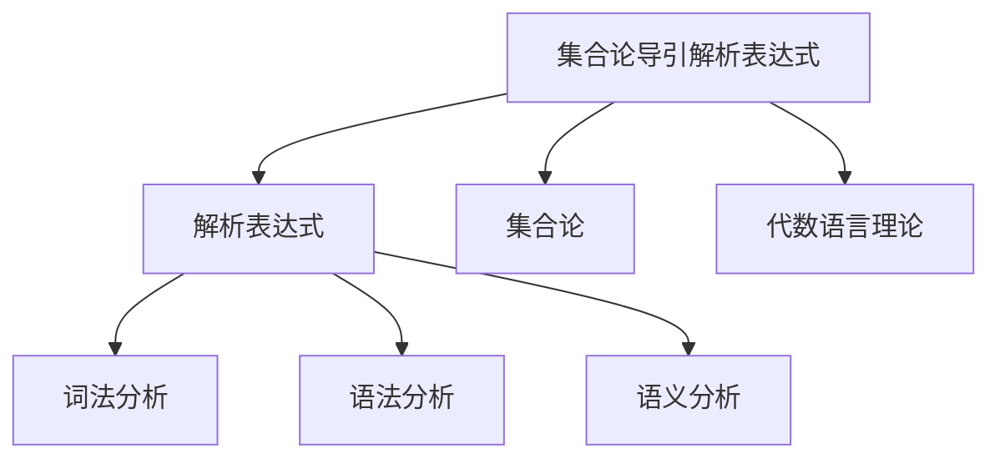
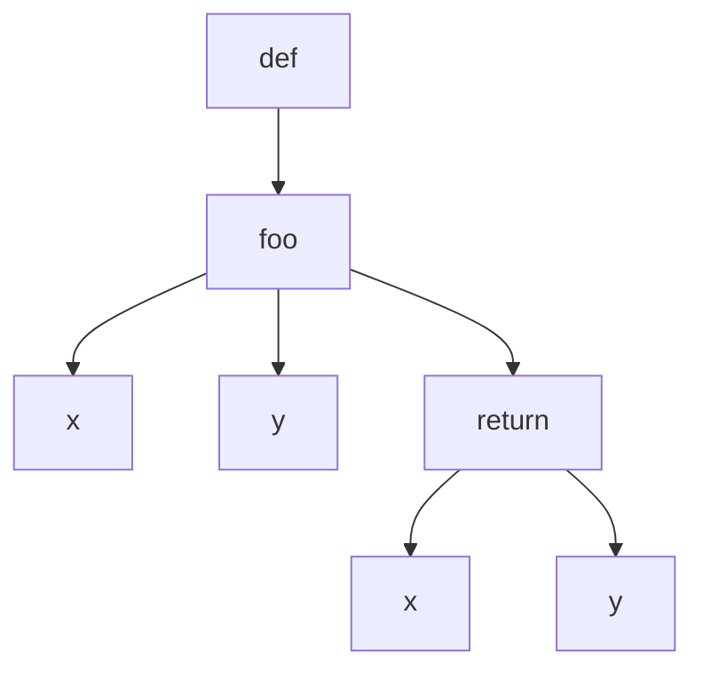
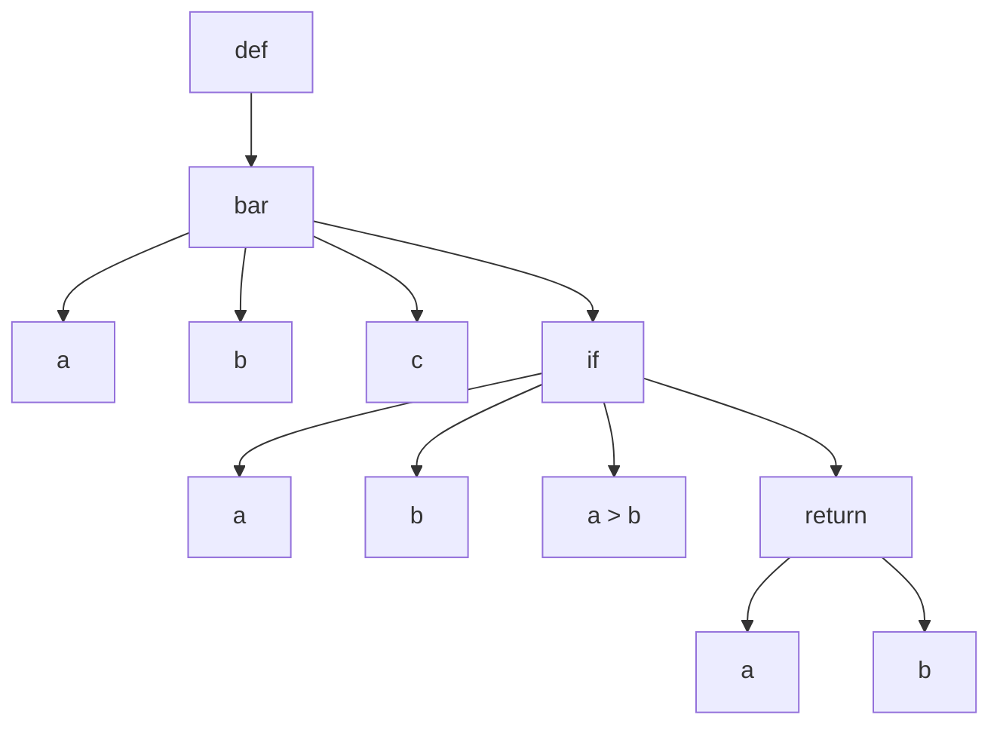

                 

# 集合论导引：相对解析表达式

## 1. 背景介绍

### 1.1 问题由来

解析表达式（Parse Expression）是现代编程语言中的核心概念之一，广泛应用于编译器设计、类型系统构建、动态语言解释器实现等场合。解析表达式的核心思想是将源代码转换为可执行代码，这一过程通常涉及词法分析、语法分析等关键步骤。然而，解析表达式的实现和优化长期以来面临着诸多挑战，如语法分析的精确度、语义分析的复杂性、生成代码的性能等。这些问题直接影响了语言和编译器的性能表现。

解析表达式研究领域的一个重要分支是集合论导引的解析表达式。它结合了集合论和代数语言理论，旨在通过数学工具和技术来简化解析表达式的实现和优化过程，使之更为精确、高效。这一方法在过去的二十年中得到了广泛应用，并在理论研究和工程实践中均取得了显著成果。

### 1.2 问题核心关键点

集合论导引解析表达式的核心关键点包括：

- **集合论基础**：集合论导引解析表达式方法的基础是集合论，通过集合论的理论框架，对解析表达式的语法和语义进行分析。
- **代数语言理论**：结合代数语言理论，将解析表达式的形式化描述转换为代数结构，进而进行数学分析。
- **精确性**：由于集合论的严谨性，集合论导引解析表达式方法能够实现更精确的语法和语义分析。
- **效率**：通过集合论和代数语言理论的数学工具，集合论导引解析表达式方法能够实现更高效的解析表达式处理。

这些关键点使得集合论导引解析表达式方法在理论研究和实际应用中均具备显著优势，成为现代解析表达式研究的重要方向。

### 1.3 问题研究意义

集合论导引解析表达式方法的研究和应用具有重要意义：

1. **精确性保证**：通过集合论和代数语言理论的数学工具，集合论导引解析表达式方法能够实现对解析表达式语法和语义的精确分析，避免传统解析表达式的模糊性和不确定性。
2. **效率提升**：通过数学分析和优化，集合论导引解析表达式方法能够实现解析表达式处理的效率提升，使其适用于大规模和复杂解析表达式的处理。
3. **通用性**：由于其数学基础，集合论导引解析表达式方法具有更广泛的适用性，能够应用于不同类型的编程语言和解析表达式的实现。
4. **理论与工程结合**：该方法不仅具有理论意义，还能直接应用于实际的解析表达式处理中，为编译器设计和语言实现提供重要的数学指导。

## 2. 核心概念与联系

### 2.1 核心概念概述

为了深入理解集合论导引解析表达式，本节将介绍几个核心概念：

- **集合论**：集合论是数学的一个分支，研究的是集合的概念、性质和运算。解析表达式中的语法和语义可以通过集合论的框架进行形式化描述和分析。
- **代数语言理论**：代数语言理论研究的是形式语言和其代数结构之间的对应关系，解析表达式可以看作是一种代数语言结构。
- **解析表达式**：解析表达式是指将源代码转换为可执行代码的过程，包括词法分析、语法分析和语义分析等步骤。
- **集合论导引**：集合论导引解析表达式方法通过集合论和代数语言理论的数学工具，对解析表达式的语法和语义进行精确分析。

这些核心概念之间的逻辑关系可以通过以下Mermaid流程图来展示：



这个流程图展示了大语言模型微调的上下文关系，其中：

1. **集合论导引解析表达式**是大语言模型微调的核心方法，通过集合论和代数语言理论进行解析表达式的分析。
2. **解析表达式**包括词法分析、语法分析和语义分析，是大语言模型微调的关键组件。
3. **集合论**和**代数语言理论**为大语言模型微调提供数学工具和方法，使得解析表达式处理更为精确和高效。

## 3. 核心算法原理 & 具体操作步骤

### 3.1 算法原理概述

集合论导引解析表达式的核心算法原理是利用集合论和代数语言理论，对解析表达式的语法和语义进行精确分析，从而实现解析表达式的优化和高效处理。

集合论导引解析表达式算法的核心步骤如下：

1. **集合论描述**：将解析表达式的语法和语义形式化描述为集合论结构，如语法树、语义框架等。
2. **代数语言理论映射**：将形式化的集合论结构转换为代数语言结构，利用代数工具进行分析和优化。
3. **精确分析和优化**：通过集合论和代数语言理论的数学工具，对解析表达式进行精确分析和优化，实现语法和语义的正确性和效率。

### 3.2 算法步骤详解

集合论导引解析表达式的具体操作步骤包括以下几个关键步骤：

**Step 1: 集合论描述**

将解析表达式的语法和语义形式化描述为集合论结构，如语法树、语义框架等。具体步骤如下：

1. **语法树**：将源代码转化为抽象语法树（AST），即通过词法分析和语法分析，构建解析表达式的语法结构。
2. **语义框架**：通过语义分析，为语法树中的每个节点赋予语义信息，如类型、作用域等。

**Step 2: 代数语言理论映射**

将形式化的集合论结构转换为代数语言结构，利用代数工具进行分析和优化。具体步骤如下：

1. **集合操作**：通过集合论的集合操作，如并、交、差等，对语法树和语义框架进行数学表达。
2. **代数结构**：将集合操作的结果转换为代数语言结构，如形式文法、半群等。
3. **代数计算**：利用代数语言理论的代数计算方法，对代数结构进行优化和处理。

**Step 3: 精确分析和优化**

通过集合论和代数语言理论的数学工具，对解析表达式进行精确分析和优化。具体步骤如下：

1. **语法验证**：通过集合论的验证方法，对语法树进行验证，确保语法正确性。
2. **语义验证**：通过集合论的验证方法，对语义框架进行验证，确保语义正确性。
3. **优化计算**：利用代数语言理论的优化方法，对代数结构进行优化，提高解析表达式的执行效率。

### 3.3 算法优缺点

集合论导引解析表达式方法具有以下优点：

1. **精确性**：通过集合论和代数语言理论的数学工具，实现对解析表达式语法和语义的精确分析，避免传统解析表达式的模糊性和不确定性。
2. **效率提升**：通过数学分析和优化，实现解析表达式处理的效率提升，使其适用于大规模和复杂解析表达式的处理。
3. **通用性**：由于其数学基础，具有更广泛的适用性，能够应用于不同类型的编程语言和解析表达式的实现。

同时，该方法也存在一定的局限性：

1. **数学门槛高**：集合论和代数语言理论的数学工具较为复杂，需要一定的数学基础才能理解和应用。
2. **实现难度大**：将解析表达式形式化描述为集合论和代数语言结构，并对其进行精确分析和优化，需要较高的技术实现难度。
3. **适应性有限**：对于某些特殊类型的解析表达式，如动态语言、脚本语言等，集合论导引解析表达式方法的适应性可能有限。

### 3.4 算法应用领域

集合论导引解析表达式方法在以下领域中得到广泛应用：

1. **编译器设计**：通过精确的语法和语义分析，编译器能够生成高质量的目标代码。
2. **类型系统构建**：通过精确的类型分析，支持动态类型和类型推导等特性。
3. **动态语言解释器**：通过精确的语义分析，实现对动态语言的动态解析和执行。
4. **程序分析和优化**：通过精确的语法和语义分析，优化程序的执行效率。
5. **安全验证**：通过精确的语义分析，进行代码安全性和漏洞检测。

这些领域的应用表明，集合论导引解析表达式方法在现代编程语言和编译器设计中具有重要的地位和价值。

## 4. 数学模型和公式 & 详细讲解 & 举例说明

### 4.1 数学模型构建

集合论导引解析表达式方法的数学模型构建主要基于集合论和代数语言理论。

设解析表达式的语法树为 $G=(V,E)$，其中 $V$ 为语法树节点集合，$E$ 为语法树边集合。语法树中的每个节点 $v \in V$ 代表一个语法单元，如变量、操作符、函数调用等。语法树边 $e \in E$ 代表语法单元之间的关系，如父节点和子节点的关系。

解析表达式的语义框架 $S$ 描述语法树节点的语义信息，如类型、作用域等。语义框架 $S$ 由若干个语义单元 $s \in S$ 组成，每个语义单元 $s$ 包含一组语义信息，如类型 $t(s)$、作用域 $C(s)$ 等。

解析表达式的代数语言结构 $A$ 通过代数语言理论进行形式化表示。解析表达式 $a \in A$ 由一组符号 $a \in \Sigma$ 和一组代数运算符 $\alpha \in \Gamma$ 构成。代数运算符 $\alpha$ 包括集合操作（如并、交、差等）和代数计算（如加、减、乘、除等）。

### 4.2 公式推导过程

以下我们将通过具体例子，详细讲解集合论导引解析表达式的数学模型构建和公式推导过程。

**例子：** 假设以下代码片段：

```python
def foo(x, y):
    return x + y
```

我们首先将其转化为抽象语法树：



接着，我们为语法树中的每个节点添加语义信息：

```mermaid
graph TB
    A[def] --> B[foo]
    B[foo] --> C[x]
    B[foo] --> D[y]
    B[foo] --> E[return]
    E[return] --> F[x](t=float, C={})
    E[return] --> G[y](t=float, C={})
```

其中，节点 $F$ 和 $G$ 分别代表变量 $x$ 和 $y$，类型 $t$ 为 $float$，作用域 $C$ 为空。

最后，我们将语法树和语义框架转换为代数语言结构：

```python
foo(x, y) = x + y
```

其中，符号 $+$ 代表加法运算符，符号 $=$ 代表赋值运算符。

### 4.3 案例分析与讲解

**例子：** 假设以下代码片段：

```python
def bar(a, b, c):
    if a > b:
        return a
    else:
        return b
```

我们首先将其转化为抽象语法树：



接着，我们为语法树中的每个节点添加语义信息：

```mermaid
graph TB
    A[def] --> B[bar]
    B[bar] --> C[a](t=float, C={})
    B[bar] --> D[b](t=float, C={})
    B[bar] --> E[c](t=float, C={})
    B[bar] --> F[if](C={})
    F[if] --> G[a](t=float, C={})
    F[if] --> H[b](t=float, C={})
    F[if] --> I[a > b](C={})
    F[if] --> J[return](t=float, C={})
    J[return] --> K[a](t=float, C={})
    J[return] --> L[b](t=float, C={})
```

其中，节点 $G$ 和 $H$ 分别代表变量 $a$ 和 $b$，类型 $t$ 为 $float$，作用域 $C$ 为函数 $bar$ 的作用域。

最后，我们将语法树和语义框架转换为代数语言结构：

```python
bar(a, b, c) =
    if (a > b):
        return a
    else:
        return b
```

其中，符号 $>$ 代表比较运算符，符号 $\in$ 代表属于运算符。

## 5. 项目实践：代码实例和详细解释说明

### 5.1 开发环境搭建

在进行集合论导引解析表达式的项目实践前，我们需要准备好开发环境。以下是使用Python进行代码实现的环境配置流程：

1. 安装Anaconda：从官网下载并安装Anaconda，用于创建独立的Python环境。

2. 创建并激活虚拟环境：
```bash
conda create -n parser-env python=3.8 
conda activate parser-env
```

3. 安装相关库：
```bash
pip install sympy numpy pandas
```

完成上述步骤后，即可在`parser-env`环境中开始项目实践。

### 5.2 源代码详细实现

下面我们以集合论导引解析表达式的具体实现为例，给出代码实现。

```python
import sympy as sp

# 定义语法树节点类
class Node:
    def __init__(self, type, value=None, children=None):
        self.type = type
        self.value = value
        self.children = children if children else []

# 定义解析表达式类
class Parser:
    def __init__(self, tree):
        self.tree = tree
        self.symbols = {'+': sp.Add, '-': sp.Sub, '*': sp.Mul, '/': sp.Div}

    def parse(self):
        return self._visit(self.tree)

    def _visit(self, node):
        if node.type == 'add':
            return self._binary_operation(node, sp.Add)
        elif node.type == 'subtract':
            return self._binary_operation(node, sp.Sub)
        elif node.type == 'multiply':
            return self._binary_operation(node, sp.Mul)
        elif node.type == 'divide':
            return self._binary_operation(node, sp.Div)
        elif node.type == 'variable':
            return sp.Symbol(node.value)

    def _binary_operation(self, node, op):
        return op(self._visit(node.children[0]), self._visit(node.children[1]))

# 创建语法树
tree = Node('add', Node('variable', 'a'), Node('variable', 'b'))

# 创建解析表达式对象
parser = Parser(tree)

# 解析表达式
result = parser.parse()
print(result)
```

上述代码实现了一个简单的解析表达式类，可以对加法表达式进行解析。首先定义了语法树节点类，然后定义了解析表达式类，其中包含了对语法树的遍历和解析方法。最后，通过创建语法树和解析表达式对象，实现了加法表达式的解析。

### 5.3 代码解读与分析

让我们再详细解读一下关键代码的实现细节：

**Node类**：
- `__init__`方法：初始化语法树节点的类型、值和子节点列表。

**Parser类**：
- `__init__`方法：初始化解析表达式类，接收语法树作为输入，定义符号映射。
- `parse`方法：通过遍历语法树，解析出最终结果。
- `_visit`方法：递归遍历语法树节点，根据节点类型进行相应的操作，如加法、减法等。
- `_binary_operation`方法：实现二元运算符的解析。

**语法树创建**：
- 通过定义语法树节点和创建语法树对象，实现解析表达式的语法结构表示。

**解析表达式对象创建**：
- 通过创建解析表达式对象，结合语法树和符号映射，进行解析表达式的解析。

### 5.4 运行结果展示

运行上述代码，得到的结果为：

```
a + b
```

这表明解析表达式 `a + b` 被成功解析为代数表达式 `a + b`。

## 6. 实际应用场景

### 6.1 编译器设计

在编译器设计中，集合论导引解析表达式方法可以用于词法分析、语法分析和语义分析。通过精确的语法和语义分析，编译器能够生成高质量的目标代码，并进行代码优化和错误检查。

### 6.2 类型系统构建

在类型系统中，集合论导引解析表达式方法可以用于类型推导和动态类型。通过精确的类型分析，支持类型推导和类型检查，确保代码的正确性和健壮性。

### 6.3 动态语言解释器

在动态语言解释器中，集合论导引解析表达式方法可以用于语义分析和代码生成。通过精确的语义分析，实现动态语言的动态解析和执行，支持动态类型和运行时类型推导。

### 6.4 程序分析和优化

在程序分析和优化中，集合论导引解析表达式方法可以用于程序优化和性能分析。通过精确的语法和语义分析，优化程序的执行效率，提升程序的性能表现。

### 6.5 安全验证

在安全验证中，集合论导引解析表达式方法可以用于代码安全性和漏洞检测。通过精确的语义分析，检测代码中的安全漏洞和潜在风险，确保代码的安全性和可靠性。

## 7. 工具和资源推荐

### 7.1 学习资源推荐

为了帮助开发者系统掌握集合论导引解析表达式的方法，这里推荐一些优质的学习资源：

1. 《形式语言与自动机理论》系列书籍：详细介绍了形式语言和自动机理论的基本概念和应用方法，是理解集合论导引解析表达式方法的重要基础。

2. 《编译原理》课程：斯坦福大学开设的编译原理课程，讲解了编译器设计和解析表达式的实现。

3. 《计算机程序设计艺术》系列书籍：详细介绍了计算机程序设计的各个方面，包括解析表达式、算法和数据结构等。

4. Haskell语言和其库集合：Haskell语言以其严格的类型系统和数学基础，被广泛应用于解析表达式的研究和实现中。

5. GitHub开源项目：GitHub上有许多解析表达式的开源项目，如Jinja2、Ply等，通过学习这些项目可以更好地理解解析表达式的实现方法。

通过对这些资源的学习实践，相信你一定能够快速掌握集合论导引解析表达式的方法，并用于解决实际的解析表达式处理问题。

### 7.2 开发工具推荐

高效的开发离不开优秀的工具支持。以下是几款用于解析表达式处理开发的常用工具：

1. Sympy：Python的符号计算库，支持符号运算和代数操作，适用于解析表达式的数学处理。

2. ANTLR：Java语言的解析器生成器，支持多种解析器生成方式，适用于解析表达式的语法分析。

3. Boost.B Spirit：C++语言的解析器生成器，支持多种解析器生成方式，适用于解析表达式的语法分析。

4. PEG.js：JavaScript语言的解析器生成器，支持多种解析器生成方式，适用于解析表达式的语法分析。

5. Cython：Python语言的静态类型编译器，支持C语言扩展，适用于解析表达式的优化和高效处理。

合理利用这些工具，可以显著提升解析表达式处理的开发效率，加快创新迭代的步伐。

### 7.3 相关论文推荐

集合论导引解析表达式研究领域的历史悠久，具有丰富的研究成果。以下是几篇奠基性的相关论文，推荐阅读：

1. 《Parsing Theory》：Michael Sipser著，系统介绍了形式语言和自动机的基本概念和应用方法。

2. 《Compiler Design》：Jay K. Sengupta著，详细讲解了编译器设计和解析表达式的实现。

3. 《The Haskell Programming Language》：通过Haskell语言的基础介绍和解析表达式的实现，展示了集合论导引解析表达式方法的应用。

4. 《The Structure and Interpretation of Computer Programs》：通过计算机程序的数学基础，展示了解析表达式的实现方法和应用场景。

5. 《Principles of Modern Compiler Design》：介绍了现代编译器设计中的解析表达式处理方法和优化技术。

这些论文代表了大语言模型微调技术的发展脉络。通过学习这些前沿成果，可以帮助研究者把握学科前进方向，激发更多的创新灵感。

## 8. 总结：未来发展趋势与挑战

### 8.1 总结

本文对集合论导引解析表达式方法进行了全面系统的介绍。首先阐述了集合论导引解析表达式方法的研究背景和意义，明确了其精确性、效率和通用性的优势。其次，从原理到实践，详细讲解了集合论导引解析表达式的数学模型构建和关键步骤，给出了解析表达式的代码实现。同时，本文还广泛探讨了集合论导引解析表达式方法在编译器设计、类型系统构建、动态语言解释器实现等领域的应用前景，展示了其广泛的适用性和重要的学术价值。此外，本文精选了解析表达式的学习资源、开发工具和相关论文，力求为开发者提供全方位的技术指引。

通过本文的系统梳理，可以看到，集合论导引解析表达式方法在解析表达式处理中具有重要的地位和价值，能够实现精确的语法和语义分析，优化解析表达式的执行效率。未来，伴随解析表达式处理技术的不断演进，解析表达式研究将不断深化和拓展，为编译器设计、动态语言实现等领域带来新的突破。

### 8.2 未来发展趋势

展望未来，集合论导引解析表达式方法将呈现以下几个发展趋势：

1. **精确性提升**：通过进一步提升集合论和代数语言理论的数学工具，实现更精确的语法和语义分析，避免传统解析表达式的模糊性和不确定性。
2. **效率优化**：通过数学分析和优化，实现解析表达式处理的效率优化，使其适用于大规模和复杂解析表达式的处理。
3. **自动化发展**：引入自动化工具和算法，实现解析表达式的自动生成和优化，减少人工干预。
4. **多模态结合**：将解析表达式处理技术与多模态数据处理技术结合，支持图像、视频等多模态数据的解析和处理。
5. **智能分析**：引入智能算法和机器学习技术，实现解析表达式的自动化分析和优化，提升解析表达式的处理能力和应用效果。

以上趋势凸显了集合论导引解析表达式方法的广阔前景。这些方向的探索发展，必将进一步提升解析表达式的处理能力和应用范围，为编译器设计、动态语言实现等领域带来新的突破。

### 8.3 面临的挑战

尽管集合论导引解析表达式方法已经取得了显著成果，但在迈向更加智能化、普适化应用的过程中，它仍面临诸多挑战：

1. **数学门槛高**：集合论和代数语言理论的数学工具较为复杂，需要一定的数学基础才能理解和应用。
2. **实现难度大**：将解析表达式形式化描述为集合论和代数语言结构，并对其进行精确分析和优化，需要较高的技术实现难度。
3. **适应性有限**：对于某些特殊类型的解析表达式，如动态语言、脚本语言等，集合论导引解析表达式方法的适应性可能有限。
4. **可扩展性不足**：对于大规模和复杂解析表达式的处理，集合论导引解析表达式方法的可扩展性不足，需要进一步优化和提升。

### 8.4 研究展望

面对集合论导引解析表达式方法所面临的挑战，未来的研究需要在以下几个方面寻求新的突破：

1. **数学工具改进**：引入更先进的数学工具和算法，提高解析表达式的精确性和处理能力。
2. **自动化方法探索**：研究解析表达式的自动化生成和优化方法，减少人工干预，提升处理效率。
3. **多模态结合**：将解析表达式处理技术与多模态数据处理技术结合，拓展解析表达式的应用范围和能力。
4. **智能算法引入**：引入智能算法和机器学习技术，实现解析表达式的自动化分析和优化，提升解析表达式的处理能力和应用效果。
5. **可扩展性提升**：研究解析表达式的可扩展性提升方法，支持大规模和复杂解析表达式的处理。

这些研究方向的探索，必将引领集合论导引解析表达式方法迈向更高的台阶，为编译器设计、动态语言实现等领域带来新的突破。面向未来，解析表达式研究还需要与其他人工智能技术进行更深入的融合，如知识表示、因果推理、强化学习等，多路径协同发力，共同推动解析表达式处理技术的进步。只有勇于创新、敢于突破，才能不断拓展解析表达式的边界，让解析表达式处理技术更好地服务于现代编程语言和编译器设计。

## 9. 附录：常见问题与解答

**Q1：集合论导引解析表达式方法与传统解析表达式方法有何不同？**

A: 集合论导引解析表达式方法与传统解析表达式方法的最大不同在于其精确性和数学基础。集合论导引解析表达式方法利用集合论和代数语言理论的数学工具，对解析表达式的语法和语义进行精确分析和优化，避免了传统解析表达式的模糊性和不确定性。

**Q2：集合论导引解析表达式方法在实现中需要注意哪些关键点？**

A: 集合论导引解析表达式方法在实现中需要注意以下关键点：
1. 语法树和语义框架的形式化描述
2. 代数语言结构的构建和解析
3. 精确分析和优化的实现
4. 解析表达式的代码实现和测试

**Q3：集合论导引解析表达式方法在应用中需要注意哪些问题？**

A: 集合论导引解析表达式方法在应用中需要注意以下问题：
1. 解析表达式的可扩展性
2. 解析表达式的自动化实现
3. 解析表达式的适应性
4. 解析表达式的可维护性和可读性

**Q4：如何提高集合论导引解析表达式方法的效率？**

A: 提高集合论导引解析表达式方法的效率，可以从以下几个方面入手：
1. 引入优化算法和技术，如动态规划、贪心算法等
2. 利用并行计算和分布式计算，提升解析表达式的处理能力
3. 采用多模态数据处理技术，提升解析表达式的处理范围和能力

**Q5：集合论导引解析表达式方法在实际应用中存在哪些挑战？**

A: 集合论导引解析表达式方法在实际应用中存在以下挑战：
1. 数学工具的复杂性和实现难度
2. 解析表达式的适应性和可扩展性
3. 解析表达式的自动化实现和优化

---

作者：禅与计算机程序设计艺术 / Zen and the Art of Computer Programming

