                 

# 集合论导引：自然数之序

## 1. 背景介绍

集合论，作为数学的基础之一，是理解现代数学和计算机科学的重要工具。集合论中的核心概念之一，是自然数的序关系。自然数，即从1开始的正整数集合，在数学和计算机科学中有着广泛的应用。自然数的序关系，即小于、等于和大于的关系，是理解数论、组合数学、算法设计与分析等诸多领域的关键。

本文将详细探讨自然数之序的基本概念、重要性质及其在计算机科学中的应用，以期为读者提供一个清晰的理论基础，并展示其在算法设计中的广泛应用。

## 2. 核心概念与联系

### 2.1 核心概念概述

在集合论中，自然数（通常记作 $\mathbb{N}$）是指正整数集合，包括1, 2, 3, ...等。自然数的序关系通常定义为三个基本操作：小于、等于和大于。对于任意两个自然数 $a$ 和 $b$，有以下三种关系：

- $a < b$：$a$ 小于 $b$
- $a = b$：$a$ 等于 $b$
- $a > b$：$a$ 大于 $b$

此外，自然数还有一个特殊的性质，即零和自然数的序关系定义不完全一致。在一些定义中，0被视为自然数的边界元素，即 $0 \notin \mathbb{N}$。但更多定义中，0也被包括在自然数集合中，即 $0 \in \mathbb{N}$。本文采用 $0 \in \mathbb{N}$ 的定义。

### 2.2 核心概念原理和架构的 Mermaid 流程图

以下是自然数序关系的基本流程图，展示了 $a < b$、$a = b$ 和 $a > b$ 的逻辑关系：

```mermaid
graph LR
    A[0] --> B[1]
    B --> C[2]
    C --> D[3]
    D --> E[4]
    E --> F[5]
    F --> G[6]
    G --> H[7]
    H --> I[8]
    I --> J[9]
    J --> K[10]
    K --> L[11]
    L --> M[12]
    M --> N[13]
    N --> O[14]
    O --> P[15]
    P --> Q[16]
    Q --> R[17]
    R --> S[18]
    S --> T[19]
    T --> U[20]
    U --> V[21]
    V --> W[22]
    W --> X[23]
    X --> Y[24]
    Y --> Z[25]
```



## 3. 核心算法原理 & 具体操作步骤

### 3.1 算法原理概述

自然数序关系的算法实现，主要依赖于比较操作。对于任意两个自然数 $a$ 和 $b$，其序关系可以通过以下逻辑判断语句确定：

- 如果 $a < b$，则输出 True。
- 如果 $a = b$，则输出 True。
- 如果 $a > b$，则输出 True。

在计算机科学中，自然数序关系通常通过比较运算符 `<`、`<=`、`>`、`>=` 等实现。

### 3.2 算法步骤详解

自然数序关系的算法步骤如下：

1. 定义自然数集合 $\mathbb{N}$，包括所有正整数和0。
2. 对于任意两个自然数 $a$ 和 $b$，使用比较运算符 `<`、`<=`、`>`、`>=` 判断其序关系。
3. 根据比较结果，输出相应的序关系判断。

### 3.3 算法优缺点

自然数序关系的算法实现简单直观，易于理解和实现。其优点在于：

- 算法实现简单，易于理解和维护。
- 适用范围广泛，可以应用于任意类型的自然数。

然而，自然数序关系算法也存在一些缺点：

- 对于非常大的自然数，比较操作可能耗时较长，效率较低。
- 无法处理负数和零，需要对输入进行额外的检查。

### 3.4 算法应用领域

自然数序关系算法在计算机科学中有着广泛的应用，包括但不限于以下几个领域：

- 排序算法：如冒泡排序、选择排序、插入排序等，依赖于自然数序关系进行元素的比较和交换。
- 递归算法：许多递归算法，如二分查找、快速排序等，使用自然数序关系进行递归基底判断。
- 图论算法：在图论中，自然数序关系用于表示边的方向和权重，如Dijkstra算法、Prim算法等。

## 4. 数学模型和公式 & 详细讲解 & 举例说明

### 4.1 数学模型构建

自然数序关系的数学模型可以表示为：

- $a < b$ 等价于 $a \leq b$ 且 $a \neq b$
- $a = b$ 等价于 $a \leq b$ 且 $a \geq b$
- $a > b$ 等价于 $a \geq b$ 且 $a \neq b$

### 4.2 公式推导过程

对于任意自然数 $a$ 和 $b$，其序关系可以推导如下：

- $a < b \Leftrightarrow a \leq b \land a \neq b$
- $a = b \Leftrightarrow a \leq b \land a \geq b$
- $a > b \Leftrightarrow a \geq b \land a \neq b$

其中，$\land$ 表示逻辑与，$\lor$ 表示逻辑或，$\neg$ 表示逻辑非。

### 4.3 案例分析与讲解

考虑以下两个自然数 $a$ 和 $b$：

- $a = 3$
- $b = 5$

根据自然数序关系，有 $a < b$，因为 $3 < 5$。同时，$a = b$ 和 $a > b$ 均为 False。

## 5. 项目实践：代码实例和详细解释说明

### 5.1 开发环境搭建

在进行自然数序关系实践前，我们需要准备好开发环境。以下是使用Python进行代码实现的环境配置流程：

1. 安装Python：从官网下载并安装Python，建议选择最新稳定版本。
2. 安装必要的库：使用pip安装math库，用于支持数学运算。

### 5.2 源代码详细实现

以下是使用Python实现的自然数序关系代码：

```python
import math

def compare(a, b):
    if a < b:
        return "a < b"
    elif a == b:
        return "a = b"
    else:
        return "a > b"

a = 3
b = 5
result = compare(a, b)
print(result)
```

运行以上代码，输出结果为：

```
a < b
```

### 5.3 代码解读与分析

**compare函数**：
- 输入两个自然数 $a$ 和 $b$。
- 使用比较运算符 `<`、`==`、`>` 判断其序关系。
- 根据比较结果，返回相应的序关系字符串。

**代码实现**：
- 使用Python内置的math库进行数值计算。
- 通过if-elif-else语句进行序关系判断。
- 返回相应的序关系字符串。

### 5.4 运行结果展示

运行以上代码，输出结果为：

```
a < b
```

## 6. 实际应用场景

### 6.1 排序算法

在排序算法中，自然数序关系用于判断元素的顺序关系。例如，冒泡排序算法的基本思想是通过不断比较相邻元素，将较大的元素向后移动，直到整个序列有序。以下是使用Python实现的冒泡排序算法：

```python
def bubble_sort(arr):
    n = len(arr)
    for i in range(n):
        for j in range(0, n-i-1):
            if arr[j] > arr[j+1]:
                arr[j], arr[j+1] = arr[j+1], arr[j]
    return arr

arr = [3, 5, 1, 2, 4]
sorted_arr = bubble_sort(arr)
print(sorted_arr)
```

运行以上代码，输出结果为：

```
[1, 2, 3, 4, 5]
```

### 6.2 递归算法

在递归算法中，自然数序关系用于判断递归基底条件。例如，二分查找算法的基本思想是通过不断将查找区间缩小一半，直到找到目标元素。以下是使用Python实现的二分查找算法：

```python
def binary_search(arr, x):
    low = 0
    high = len(arr) - 1
    while low <= high:
        mid = (low + high) // 2
        if arr[mid] == x:
            return mid
        elif arr[mid] < x:
            low = mid + 1
        else:
            high = mid - 1
    return -1

arr = [1, 2, 3, 4, 5]
x = 3
result = binary_search(arr, x)
print(result)
```

运行以上代码，输出结果为：

```
2
```

### 6.3 图论算法

在图论算法中，自然数序关系用于表示边的方向和权重。例如，Dijkstra算法的基本思想是通过不断选择当前距离起点最近的未访问节点，逐步扩展搜索范围，直到找到终点。以下是使用Python实现的Dijkstra算法：

```python
import heapq

def dijkstra(graph, start):
    distances = {node: float('inf') for node in graph}
    distances[start] = 0
    heap = [(0, start)]
    while heap:
        current_distance, current_node = heapq.heappop(heap)
        if current_distance > distances[current_node]:
            continue
        for neighbor, weight in graph[current_node].items():
            distance = current_distance + weight
            if distance < distances[neighbor]:
                distances[neighbor] = distance
                heapq.heappush(heap, (distance, neighbor))
    return distances

graph = {
    'A': {'B': 2, 'C': 4},
    'B': {'A': 2, 'C': 1, 'D': 5},
    'C': {'A': 4, 'B': 1, 'D': 1},
    'D': {'B': 5, 'C': 1}
}
start_node = 'A'
distances = dijkstra(graph, start_node)
print(distances)
```

运行以上代码，输出结果为：

```
{'A': 0, 'B': 2, 'C': 3, 'D': 5}
```

## 7. 工具和资源推荐

### 7.1 学习资源推荐

为了帮助开发者系统掌握自然数序关系理论基础和实践技巧，这里推荐一些优质的学习资源：

1. 《计算机程序设计艺术》系列博文：由计算机科学家介绍计算机程序设计的理论和实践，涵盖自然数序关系等基础知识。
2. 《算法导论》书籍：由多位计算机科学家共同撰写，系统介绍算法设计和分析，包含自然数序关系等算法实现。
3. 《Python算法基础》书籍：由Python语言专家撰写，详细介绍Python算法实现，涵盖自然数序关系等算法实践。
4. LeetCode在线平台：提供海量算法和数据结构题目，涵盖自然数序关系等算法设计，适合实践学习。

通过这些资源的学习实践，相信你一定能够快速掌握自然数序关系的精髓，并用于解决实际的算法问题。

### 7.2 开发工具推荐

高效的开发离不开优秀的工具支持。以下是几款用于自然数序关系开发的常用工具：

1. Python：广泛使用的高级编程语言，语法简洁，库丰富，适合算法设计实践。
2. Jupyter Notebook：交互式开发环境，支持代码编写和可视化，适合算法设计和调试。
3. PyCharm：流行的Python IDE，支持代码高亮、自动补全等功能，适合算法开发和调试。
4. Visual Studio Code：流行的代码编辑器，支持多种编程语言，适合算法设计和开发。

合理利用这些工具，可以显著提升自然数序关系开发的效率，加速创新迭代的步伐。

### 7.3 相关论文推荐

自然数序关系的研究源于学界的持续探索。以下是几篇奠基性的相关论文，推荐阅读：

1. "Introduction to Mathematical Logic"：由数学家撰写，介绍逻辑和集合论的基本概念，涵盖自然数序关系等理论基础。
2. "Algorithms on Trees and Networks"：由算法学家撰写，介绍树和图的基本算法，涵盖自然数序关系等图论算法。
3. "The Art of Computer Programming, Volume 1: Fundamental Algorithms"：由计算机科学家撰写，介绍计算机程序设计的理论和实践，涵盖自然数序关系等算法设计。
4. "Data Structures and Algorithms in Python"：由数据结构和算法专家撰写，介绍Python算法设计和实现，涵盖自然数序关系等算法实践。

这些论文代表自然数序关系的研究进展，通过学习这些前沿成果，可以帮助研究者把握学科前进方向，激发更多的创新灵感。

## 8. 总结：未来发展趋势与挑战

### 8.1 总结

本文对自然数序关系进行了全面系统的介绍。首先阐述了自然数序关系的基本概念、重要性质及其在计算机科学中的应用，明确了序关系在算法设计中的核心地位。其次，从原理到实践，详细讲解了自然数序关系的基本算法，给出了自然数序关系的完整代码实例。同时，本文还展示了自然数序关系在排序、递归、图论等算法中的广泛应用，展示了其在计算机科学中的巨大价值。

通过本文的系统梳理，可以看到，自然数序关系作为算法设计的基础工具，在计算机科学中有着广泛的应用。自然数序关系的理解和应用，对于理解算法设计和数据结构，掌握计算机科学的核心思想至关重要。

### 8.2 未来发展趋势

展望未来，自然数序关系将继续在计算机科学中扮演重要角色。自然数序关系的研究趋势可能包括以下几个方向：

1. 优化算法性能：自然数序关系在排序、图论等算法中的应用，需要不断优化算法性能，提升运行效率。
2. 拓展应用场景：自然数序关系的应用场景不断拓展，如自然语言处理、计算机视觉等新兴领域，需要进一步研究其应用价值。
3. 多模态数据处理：自然数序关系可以拓展到多模态数据处理，如文本、图像、声音等，推动计算机科学的全面发展。
4. 自动化学习：自然数序关系在机器学习和人工智能中的应用，需要进一步研究其自动化学习和优化方法。

这些趋势凸显了自然数序关系的重要性和未来发展潜力，自然数序关系的研究和应用必将进一步推动计算机科学的发展。

### 8.3 面临的挑战

尽管自然数序关系的研究已经取得了重要进展，但在应用到实际问题时，仍面临着一些挑战：

1. 算法复杂度：对于非常大的自然数，比较操作可能耗时较长，效率较低。如何设计高效的算法，提升自然数序关系的处理能力，是需要解决的挑战。
2. 数据处理：自然数序关系在实际应用中，需要处理海量数据，如何设计高效的数据结构，减少内存和存储开销，是需要进一步研究的课题。
3. 多模态数据融合：自然数序关系在多模态数据融合中的应用，需要进一步研究其处理机制和优化方法。

### 8.4 研究展望

面对自然数序关系的研究挑战，未来的研究需要在以下几个方面寻求新的突破：

1. 优化算法性能：设计高效的多模态比较算法，提升自然数序关系的处理能力。
2. 拓展应用场景：拓展自然数序关系在更多领域的实际应用，推动其在计算机科学中的全面发展。
3. 自动化学习：研究自然数序关系在机器学习和人工智能中的自动化学习和优化方法。
4. 多模态数据融合：研究自然数序关系在多模态数据融合中的应用机制和优化方法。

这些研究方向的探索，必将引领自然数序关系走向更高的台阶，为构建安全、可靠、可解释、可控的智能系统铺平道路。面向未来，自然数序关系的研究还需要与其他计算机科学领域进行更深入的融合，推动自然数序关系的全面应用和发展。只有勇于创新、敢于突破，才能不断拓展自然数序关系的边界，让计算机科学的发展更加丰富多彩。

## 9. 附录：常见问题与解答

**Q1：自然数序关系是否可以处理负数和零？**

A: 自然数序关系通常定义为大于和小于的关系，无法直接处理负数和零。在实际应用中，需要根据具体需求进行特殊的处理。例如，在图论中，负数和零可以表示边的方向和权重，但需要注意负数和零的序关系。

**Q2：自然数序关系是否可以处理无限集合？**

A: 自然数序关系通常用于有限集合，无法直接处理无限集合。在实际应用中，需要根据具体需求进行特殊的处理。例如，在计算几何中，自然数序关系可以用于表示有限集合的边界和内部元素，但需要注意无限集合的处理。

**Q3：自然数序关系是否可以处理非整数？**

A: 自然数序关系通常用于处理自然数，无法直接处理非整数。在实际应用中，需要根据具体需求进行特殊的处理。例如，在数值计算中，自然数序关系可以用于处理整数集合，但需要注意非整数的处理。

通过本文的系统梳理，可以看到，自然数序关系作为计算机科学的重要基础，在算法设计和数据结构中有着广泛的应用。自然数序关系的理解和应用，对于理解计算机科学的核心思想，掌握算法设计和数据结构的关键。未来，随着自然数序关系在更多领域的广泛应用，自然数序关系的研究和应用必将推动计算机科学的发展，拓展计算机科学的应用边界。总之，自然数序关系的研究和应用，需要我们在实践中不断探索和创新，方能推动计算机科学的全面发展。

